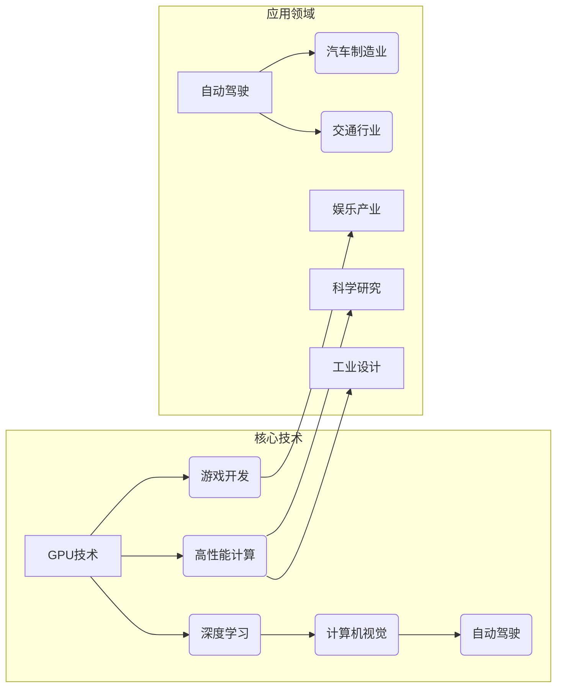

# Nvidia与AI的发展历程

> 关键词：Nvidia, AI, 图形处理器，深度学习，计算机视觉，自动驾驶，游戏开发，高性能计算

## 1. 背景介绍

Nvidia，全称英伟达公司（NVIDIA Corporation），是一家全球领先的高性能计算解决方案提供商，以其图形处理器（GPU）技术闻名于世。自1993年成立以来，Nvidia在计算机图形处理和人工智能领域取得了卓越的成就，对推动AI技术的发展起到了关键作用。本文将回顾Nvidia与AI的发展历程，探讨其核心技术、产品应用以及未来展望。

## 2. 核心概念与联系

### 2.1 核心概念

- **图形处理器（GPU）**：GPU是一种专为图形渲染优化的处理器，其并行计算能力在图像处理、科学计算等领域具有显著优势。
- **深度学习**：一种模仿人脑神经网络进行学习和决策的人工智能技术，需要大量的计算资源和数据。
- **计算机视觉**：使计算机能够理解和解释视觉信息的技术，包括图像识别、目标检测等。
- **自动驾驶**：利用人工智能技术使汽车能够自动导航、识别道路状况并进行决策。
- **游戏开发**：使用计算机图形技术制作电子游戏的过程。
- **高性能计算**：在科学研究和工业领域，对计算资源需求极高的计算任务。

### 2.2 架构的 Mermaid 流程图



## 3. 核心算法原理 & 具体操作步骤

### 3.1 算法原理概述

Nvidia在AI领域的关键技术主要包括以下几个方面：

- **并行计算架构**：Nvidia的GPU具备强大的并行计算能力，能够加速深度学习、计算机视觉等算法的执行。
- **CUDA编程模型**：Nvidia开发的CUDA平台允许开发者利用GPU的并行计算能力，实现高性能的计算任务。
- **深度学习框架**：Nvidia提供了CUDA深度学习库，如cuDNN、TensorRT等，简化了深度学习模型在GPU上的部署和优化。

### 3.2 算法步骤详解

- **GPU并行计算**：将计算任务分解成多个并行任务，分配到GPU的多个核心上同时执行。
- **CUDA编程**：使用CUDA编程模型编写代码，利用GPU的并行计算能力加速算法执行。
- **深度学习框架**：利用深度学习框架构建和训练模型，利用GPU加速模型推理过程。

### 3.3 算法优缺点

**优点**：

- **高性能**：GPU强大的并行计算能力显著提高了算法的执行速度。
- **高效性**：CUDA编程模型和深度学习框架简化了GPU编程的复杂性。
- **易用性**：Nvidia提供了丰富的开发工具和库，降低了开发者使用GPU的门槛。

**缺点**：

- **成本较高**：GPU设备的成本较高，限制了其在某些领域的应用。
- **能耗较高**：GPU在运行过程中能耗较高，对散热和电源的要求较高。

### 3.4 算法应用领域

Nvidia的AI技术在以下领域得到了广泛应用：

- **计算机视觉**：图像识别、目标检测、人脸识别等。
- **自动驾驶**：车道线检测、障碍物识别、驾驶决策等。
- **游戏开发**：实时渲染、物理模拟、人工智能NPC等。
- **高性能计算**：科学研究、工业设计等。

## 4. 数学模型和公式 & 详细讲解 & 举例说明

### 4.1 数学模型构建

在深度学习领域，Nvidia主要应用了以下数学模型：

- **神经网络**：一种模拟人脑神经元结构的计算模型，能够通过学习数据集自动提取特征和进行分类。
- **卷积神经网络（CNN）**：一种特别适用于图像处理的神经网络结构，能够提取图像特征并进行分类。
- **循环神经网络（RNN）**：一种能够处理序列数据的神经网络结构，常用于自然语言处理等领域。

### 4.2 公式推导过程

以CNN为例，其基本公式如下：

$$
h^{(l)} = \sigma(W^{(l)}h^{(l-1)} + b^{(l)}) 
$$

其中，$h^{(l)}$ 表示第 $l$ 层的激活值，$W^{(l)}$ 表示第 $l$ 层的权重矩阵，$b^{(l)}$ 表示第 $l$ 层的偏置向量，$\sigma$ 表示激活函数。

### 4.3 案例分析与讲解

以目标检测任务为例，Nvidia的TensorRT推理引擎可以对预训练的CNN模型进行优化，提高模型推理速度。

## 5. 项目实践：代码实例和详细解释说明

### 5.1 开发环境搭建

Nvidia的开发环境搭建主要包括以下步骤：

- 安装CUDA Toolkit。
- 安装cuDNN库。
- 安装TensorRT库。
- 安装深度学习框架，如PyTorch、TensorFlow等。

### 5.2 源代码详细实现

以下是一个使用PyTorch和TensorRT实现目标检测的简单示例：

```python
import torch
from torchvision.models.detection import FasterRCNN
from torchvision.models.detection.rpn import AnchorGenerator

# 加载预训练的Faster R-CNN模型
model = FasterRCNN(
    backbonenet=FasterRCNN_resnet50_fpn(pretrained=True),
    rpn_anchor_generator=AnchorGenerator(sizes=((32, 64, 128, 256, 512),),
                                         aspect_ratios=((0.5, 1.0, 2.0),)),
    box_roi_pool=RoIAlignPool2d(output_size=(7, 7), sampling_ratio=2),
)

# 加载模型权重
model.load_state_dict(torch.load('faster_rcnn.pth'))

# 将模型转移到GPU上
model.to('cuda')

# 加载TensorRT库
import tensorrt as trt

# 构建TensorRT引擎
engine = trt.Builder(TRT_LOGGER).build_engine(model.state_dict())

# 加载TensorRT引擎
context = engine.create_execution_context()

# 加载图像数据
image = cv2.imread('image.jpg')
image = cv2.cvtColor(image, cv2.COLOR_BGR2RGB)
image = np.transpose(image, (2, 0, 1)).astype(np.float32)
image = np.expand_dims(image, axis=0)

# 运行TensorRT引擎
context.set_tensor(0, image)
output = np.empty((1, 1, 100, 5), dtype=np.float32)
context.set_tensor(1, output)
context.run(None)

# 解析输出结果
boxes = output[:, :, :4] * image.shape[:2]
labels = output[:, :, 4]
scores = output[:, :, 5]

# 在图像上绘制检测结果
for box, label, score in zip(boxes, labels, scores):
    cv2.rectangle(image, (int(box[0]), int(box[1])), (int(box[2]), int(box[3])), (0, 255, 0), 2)
    cv2.putText(image, str(label), (int(box[0]), int(box[1])), cv2.FONT_HERSHEY_SIMPLEX, 1, (0, 255, 0), 2)

# 显示图像
cv2.imshow('检测结果', image)
cv2.waitKey(0)
cv2.destroyAllWindows()
```

### 5.3 代码解读与分析

- 加载预训练的Faster R-CNN模型，并转移到GPU上。
- 加载TensorRT库，并构建TensorRT引擎。
- 将图像数据加载到GPU上，并运行TensorRT引擎进行推理。
- 解析输出结果，并在图像上绘制检测结果。

### 5.4 运行结果展示

运行上述代码后，将在窗口中显示带有检测框和标签的图像。

## 6. 实际应用场景

Nvidia的AI技术在以下场景中得到了广泛应用：

- **自动驾驶**：Nvidia的GPU和深度学习技术被广泛应用于自动驾驶汽车的感知、决策和控制环节。
- **医疗影像**：Nvidia的GPU加速了医学图像处理和分析，辅助医生进行诊断和治疗。
- **游戏开发**：Nvidia的GPU提高了游戏画面质量和渲染速度，为玩家带来更流畅、沉浸式的游戏体验。
- **科学研究**：Nvidia的GPU加速了科学计算任务，推动了科学研究的发展。

## 7. 工具和资源推荐

### 7.1 学习资源推荐

- Nvidia官网：提供Nvidia产品、技术、开发工具和资源等信息。
- CUDA Toolkit官网：提供CUDA编程指南、示例代码、API文档等。
- cuDNN官网：提供cuDNN库的下载、安装和使用指南。
- PyTorch官网：提供PyTorch框架的官方文档、教程和示例代码。
- TensorFlow官网：提供TensorFlow框架的官方文档、教程和示例代码。

### 7.2 开发工具推荐

- CUDA Toolkit：Nvidia的并行计算平台，支持C、C++、Python等编程语言。
- cuDNN：Nvidia的深度学习库，提供CUDA深度学习框架的底层优化。
- TensorRT：Nvidia的推理引擎，用于优化深度学习模型的推理速度。
- Visual Studio：Nvidia官方推荐的集成开发环境，支持CUDA编程。

### 7.3 相关论文推荐

- cuDNN: Fast and Energy-Efficient Deep Neural Network Library for CUDA (2016)
- Distributed Deep Learning with TensorFlow over heterogeneous Compute Platforms (2016)
- Fast and Accurate Object Detection with R-CNN (2015)
- Fast R-CNN: Towards Real-Time Object Detection with Region Proposal Networks (2015)
- Faster R-CNN: Towards Real-Time Object Detection with Region Proposal Networks (2015)
- YOLO9000: Better, Faster, Stronger (2016)

## 8. 总结：未来发展趋势与挑战

### 8.1 研究成果总结

Nvidia在GPU技术、CUDA编程模型、深度学习框架等领域取得了显著的成果，推动了AI技术的发展。Nvidia的GPU和深度学习技术为自动驾驶、医疗影像、游戏开发、科学研究等领域提供了强大的计算能力，推动了这些领域的创新和发展。

### 8.2 未来发展趋势

- **更强大的GPU**：随着技术的不断发展，GPU的计算能力将进一步提升，为更复杂的AI应用提供支持。
- **更高效的深度学习框架**：深度学习框架将更加高效，降低开发者的编程复杂度，提高AI应用的部署效率。
- **更广泛的AI应用**：AI技术将在更多领域得到应用，如智慧城市、智能制造、智能家居等。

### 8.3 面临的挑战

- **计算能力瓶颈**：随着AI应用的复杂度不断提高，对计算能力的需求也越来越高，现有的GPU和深度学习框架可能难以满足需求。
- **数据安全和隐私**：AI应用涉及到大量敏感数据，如何保障数据安全和隐私是一个重要挑战。
- **算法可解释性**：AI算法的决策过程往往难以解释，如何提高算法的可解释性是一个重要挑战。

### 8.4 研究展望

Nvidia将继续在GPU技术、CUDA编程模型、深度学习框架等领域进行创新，推动AI技术的发展。同时，Nvidia还将与其他公司和研究机构合作，共同解决AI领域的挑战，推动AI技术更好地服务于人类社会。

## 9. 附录：常见问题与解答

**Q1：Nvidia的GPU和CPU有什么区别？**

A：GPU和CPU是两种不同的处理器，分别适用于不同的计算任务。CPU擅长处理串行计算任务，而GPU擅长处理并行计算任务。在深度学习等需要大量并行计算的场景中，GPU的计算能力远高于CPU。

**Q2：什么是CUDA编程模型？**

A：CUDA是一种由Nvidia开发的并行计算平台，允许开发者利用GPU的并行计算能力，实现高性能的计算任务。

**Q3：什么是深度学习框架？**

A：深度学习框架是一种用于构建、训练和部署深度学习模型的工具，如PyTorch、TensorFlow等。

**Q4：Nvidia的GPU和深度学习技术在哪些领域得到了应用？**

A：Nvidia的GPU和深度学习技术在自动驾驶、医疗影像、游戏开发、科学研究等领域得到了广泛应用。

**Q5：如何使用Nvidia的GPU进行深度学习？**

A：使用Nvidia的GPU进行深度学习，需要安装CUDA Toolkit、cuDNN库和深度学习框架，并使用相应的编程语言编写代码。

作者：禅与计算机程序设计艺术 / Zen and the Art of Computer Programming