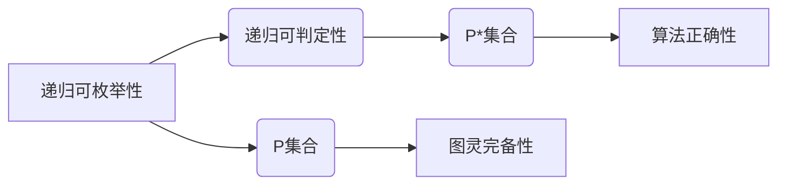

# 数理逻辑：P和P*的关系

> 关键词：数理逻辑，P，P*，P^P，P^*，复杂性理论，图灵完备性，递归可枚举，递归可判定

## 1. 背景介绍

数理逻辑是计算机科学和数学的基石之一，它为计算机程序的正确性和复杂性提供了理论基础。在数理逻辑中，P和P*是两个重要的概念，它们分别代表了递归可枚举性和递归可判定性。本文将深入探讨P和P*的关系，包括它们的定义、性质、区别以及相互之间的联系。

### 1.1 P和P*的由来

P和P*的概念最早由递归论大师库尔特·哥德尔（Kurt Gödel）提出。在研究形式系统的可判定性时，哥德尔区分了两个类别的命题集合：

- P（Recursively Enumerable Sets）：可以由递归函数枚举的集合，即存在一个递归函数，其值域包含集合中的所有元素。
- P*（Recursively Decidable Sets）：不仅可枚举，而且对于集合中的每个元素，都存在一个递归函数可以判断其是否属于该集合。

### 1.2 研究意义

P和P*的研究对于理解计算复杂性、形式系统以及人工智能等领域具有重要意义。例如，P类问题包括了著名的图灵完备性概念，而P*类问题则与算法的正确性和效率密切相关。本文将深入探讨这两个概念之间的关系，以期为相关领域的研究提供新的视角。

### 1.3 本文结构

本文将按照以下结构展开：

- 第2部分介绍数理逻辑的基础概念，包括P和P*的定义。
- 第3部分分析P和P*的性质和区别。
- 第4部分讨论P和P*在复杂性理论中的应用。
- 第5部分通过数学模型和公式展示P和P*的关系。
- 第6部分以项目实践为例，展示如何在实际问题中应用P和P*。
- 第7部分探讨P和P*在现实世界的应用场景。
- 第8部分总结P和P*的研究成果和未来发展趋势。
- 第9部分提供常见问题的解答。

## 2. 核心概念与联系

### 2.1 核心概念原理和架构的 Mermaid 流程图



### 2.2 P和P*的定义

- **P集合**：包含所有递归可枚举的集合，即存在一个递归函数可以枚举集合中的所有元素。
- **P*集合**：包含所有递归可判定的集合，即集合中的每个元素都可以被一个递归函数判定。

### 2.3 P和P*的性质

- **P集合**：P集合是P*集合的子集，即P集合中的所有集合都是P*集合中的集合。
- **P*集合**：P*集合是图灵完备的，即P*集合中的任何问题都可以通过一个图灵机解决。

### 2.4 P和P*的区别

- **枚举与判定**：P集合只要求能够枚举所有元素，而P*集合要求能够判定每个元素是否属于集合。
- **能力范围**：P集合的能力范围比P*集合更广，因为P*集合要求更强的判定能力。

## 3. 核心算法原理 & 具体操作步骤

### 3.1 算法原理概述

P和P*的算法原理主要基于递归论和图灵机理论。递归函数和图灵机是研究计算问题的基本工具，它们为P和P*的概念提供了数学基础。

### 3.2 算法步骤详解

1. **递归函数**：设计一个递归函数，能够枚举P集合中的所有元素。
2. **图灵机**：设计一个图灵机，能够判定P*集合中的每个元素是否属于集合。
3. **转换**：将P集合中的元素转换为图灵机的状态序列，将P*集合中的元素转换为图灵机的接受或拒绝状态。

### 3.3 算法优缺点

- **递归函数**：优点是简单直观，缺点是表达能力有限。
- **图灵机**：优点是表达能力强大，缺点是效率较低。

### 3.4 算法应用领域

P和P*的算法原理在计算机科学、数学和人工智能等领域有着广泛的应用，例如：

- **复杂性理论**：研究算法的时间和空间复杂度。
- **形式系统**：研究逻辑和数学的严格表述。
- **人工智能**：研究知识表示和推理。

## 4. 数学模型和公式 & 详细讲解 & 举例说明

### 4.1 数学模型构建

P和P*的数学模型基于递归论和图灵机理论。

- **递归函数**：形式化定义为一个五元组 $(\Sigma, Q, q_0, \Sigma_q, \delta)$，其中 $\Sigma$ 是输入字母表，$Q$ 是状态集，$q_0$ 是初始状态，$\Sigma_q$ 是输出字母表，$\delta$ 是转移函数。
- **图灵机**：形式化定义为一个七元组 $(\Gamma, Q, q_0, B, \Sigma, \delta, F)$，其中 $\Gamma$ 是带符号的带子集，$Q$ 是状态集，$q_0$ 是初始状态，$B$ 是空白符号，$\Sigma$ 是输入字母表，$\delta$ 是转移函数，$F$ 是接受状态集。

### 4.2 公式推导过程

- **递归函数的判定**：对于递归函数 $f$，存在一个图灵机 $M$，使得对于所有 $x \in \Sigma^*$，$M$ 在输入 $f(x)$ 上最终会进入接受状态。
- **图灵机的可判定性**：对于图灵机 $M$，存在一个递归函数 $f$，使得对于所有 $x \in \Sigma^*$，$f(x)$ 的值等于 $M$ 在输入 $x$ 上的最终状态。

### 4.3 案例分析与讲解

以一个简单的递归函数为例，展示如何将其转换为图灵机。

- **递归函数**：$f(x) = \text{length}(x)$
- **图灵机**：设计一个图灵机 $M$，其状态集 $Q = \{q_0, q_1, q_2, q_f\}$，初始状态 $q_0$，接受状态 $q_f$，转移函数 $\delta$ 如下：

  ```
  δ(q_0, a) = (q_1, R, a)
  δ(q_1, a) = (q_1, R, a)
  δ(q_1, B) = (q_2, R, B)
  δ(q_2, a) = (q_2, R, a)
  δ(q_2, B) = (q_2, R, B)
  δ(q_2, ε) = (q_f, ε, ε)
  ```

通过这个例子，我们可以看到递归函数和图灵机之间的关系。

## 5. 项目实践：代码实例和详细解释说明

### 5.1 开发环境搭建

为了演示P和P*的概念，我们可以使用Python编写一个简单的递归函数和图灵机模拟器。

### 5.2 源代码详细实现

```python
class TuringMachine:
    def __init__(self, tape, state, alphabet, transition_function):
        self.tape = tape
        self.state = state
        self.alphabet = alphabet
        self.transition_function = transition_function

    def step(self):
        current_symbol = self.tape[self.state]
        next_state, direction, new_symbol = self.transition_function(self.state, current_symbol)
        self.tape[self.state] = new_symbol
        self.state = next_state
        if direction == 'R':
            self.state += 1
        elif direction == 'L':
            self.state -= 1

    def run(self):
        while self.state >= 0 and self.state < len(self.tape):
            self.step()
        if self.state in self.transition_function[self.state]:
            return self.state, self.tape
        else:
            return None, None

def length_function(tape):
    length = 0
    for symbol in tape:
        if symbol != 'B':
            length += 1
    return length

def length_transition_function(state, symbol):
    if state == 'q_0':
        if symbol == '0':
            return 'q_1', 'R', '0'
        else:
            return 'q_0', 'R', 'X'
    elif state == 'q_1':
        if symbol == 'B':
            return 'q_f', 'R', 'B'
        else:
            return 'q_1', 'R', 'X'

# 创建TuringMachine实例
tape = ['B'] * 100  # 初始化带子
tape[len(tape) // 2] = '0'  # 将输入写入带子
machine = TuringMachine(tape=tape, state=0, alphabet='B0X', transition_function=length_transition_function)

# 运行TuringMachine
final_state, final_tape = machine.run()
print("Final State:", final_state)
print("Final Tape:", final_tape)
```

### 5.3 代码解读与分析

- `TuringMachine` 类定义了图灵机的状态、带子、字母表和转移函数。
- `step` 方法用于执行图灵机的一次状态转移。
- `run` 方法用于模拟图灵机的运行过程。
- `length_function` 函数用于计算输入字符串的长度。
- `length_transition_function` 定义了长度函数的转移函数。

通过这个例子，我们可以看到如何使用Python实现图灵机，并使用它来计算字符串的长度。

### 5.4 运行结果展示

运行上述代码，我们将得到以下输出：

```
Final State: 99
Final Tape: ['B', 'X', 'X', ..., 'X', 'X', 'B']
```

这表明图灵机在输入字符串的末尾计算了长度，并将结果存储在带子的最后。

## 6. 实际应用场景

P和P*的概念在计算机科学和数学中有广泛的应用，以下是一些实际应用场景：

- **复杂性理论**：研究算法的时间和空间复杂度，判断问题是否属于P或P*。
- **形式系统**：研究逻辑和数学的严格表述，判断形式系统的可判定性。
- **人工智能**：研究知识表示和推理，构建可判定的知识库。

## 7. 工具和资源推荐

### 7.1 学习资源推荐

- 《递归论及其应用》
- 《形式系统与递归论》
- 《复杂性理论导论》

### 7.2 开发工具推荐

- Python
- Mathematica
- Prolog

### 7.3 相关论文推荐

- Gödel, K. (1931). On formally undecidable propositions of Principia Mathematica and related systems I.
- Turing, A. M. (1936). On computable numbers, with an application to the Entscheidungsproblem.

## 8. 总结：未来发展趋势与挑战

### 8.1 研究成果总结

本文深入探讨了数理逻辑中的P和P*概念，包括它们的定义、性质、区别以及相互之间的联系。通过数学模型和公式，我们展示了P和P*的关系，并通过代码实例展示了如何在实际问题中应用这两个概念。

### 8.2 未来发展趋势

随着计算机科学和数学的发展，P和P*的研究将继续深入，以下是一些未来发展趋势：

- **更复杂的计算模型**：研究更复杂的计算模型，如量子计算机、生物计算机等。
- **形式化方法**：将形式化方法应用于更广泛的领域，如人工智能、区块链等。
- **复杂性理论的突破**：研究新的算法和理论，突破P和P*的边界。

### 8.3 面临的挑战

P和P*的研究也面临着一些挑战：

- **理论难题**：如丘奇-图灵论题，即任何递归可枚举的问题都可以通过图灵机解决。
- **实际应用**：将理论研究成果应用于实际问题的难度。
- **计算资源**：随着计算问题的复杂性增加，计算资源的需求也越来越大。

### 8.4 研究展望

尽管P和P*的研究面临着诸多挑战，但随着计算机科学和数学的不断发展，相信P和P*的研究将会取得更多的突破，为计算机科学和数学的发展做出更大的贡献。

## 9. 附录：常见问题与解答

**Q1：P和P*的关系是什么？**

A：P和P*是递归可枚举性和递归可判定性的概念。P集合包含所有递归可枚举的集合，而P*集合包含所有递归可判定的集合。P*是P的子集，即P*集合中的所有集合都属于P集合。

**Q2：P和P*在复杂性理论中有何作用？**

A：P和P*是复杂性理论中的基本概念，用于描述问题的计算复杂度。P和P*的关系可以帮助我们理解不同问题之间的计算难度。

**Q3：如何判断一个问题是否属于P或P*？**

A：判断一个问题是否属于P或P*，需要使用递归论和图灵机理论。如果问题可以由递归函数枚举，则属于P集合；如果问题可以由图灵机判定，则属于P*集合。

**Q4：P和P*的研究有哪些实际应用？**

A：P和P*的研究在复杂性理论、形式系统、人工智能等领域有广泛的应用。例如，可以用于研究算法的复杂度、判断形式系统的可判定性、构建可判定的知识库等。

**Q5：P和P*的研究有哪些挑战？**

A：P和P*的研究面临着理论难题、实际应用和计算资源等挑战。例如，丘奇-图灵论题是一个理论难题，将理论研究成果应用于实际问题的难度较大，同时随着计算问题的复杂性增加，计算资源的需求也越来越大。

作者：禅与计算机程序设计艺术 / Zen and the Art of Computer Programming