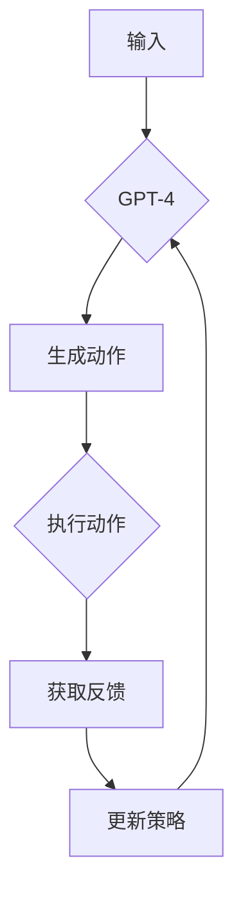

> 关键词：Auto-GPT, GPT-4, 人工智能，自主决策，自然语言处理，强化学习，多智能体系统

# Auto-GPT 定位：一个自主的 GPT-4 实验

随着人工智能技术的飞速发展，自然语言处理（NLP）领域迎来了新的里程碑——GPT-4的发布。GPT-4作为目前最先进的语言模型，展示了惊人的语言理解和生成能力。然而，GPT-4主要作为工具被人类程序员调用，缺乏自主决策的能力。本文将探讨Auto-GPT的概念，旨在构建一个能够自主决策的GPT-4实验，并分析其原理、实现步骤和应用前景。

## 1. 背景介绍

### 1.1 问题的由来

虽然GPT-4在NLP领域取得了巨大突破，但它的应用仍然受到一定限制。首先，GPT-4需要通过API接口由人类程序员进行调用，缺乏自主性。其次，GPT-4在处理复杂任务时，往往需要人类程序员提供详细的指导。最后，GPT-4缺乏对真实世界环境的感知能力，难以在现实场景中发挥作用。

为了解决这些问题，我们提出了Auto-GPT的概念，即构建一个能够自主决策的GPT-4实验。Auto-GPT将具备以下特点：

- 自主性：能够根据任务需求自主选择行动方案。
- 智能性：具备较强的语言理解和生成能力。
- 环境感知：能够感知和响应真实世界环境。
- 可交互性：能够与人类用户进行自然语言交互。

### 1.2 研究现状

近年来，随着深度学习和强化学习技术的发展，许多研究者和公司都在探索人工智能的自主性。例如，OpenAI的GPT-3.5已经能够进行简单的任务规划和决策，但仍然需要人类提供明确的指令。此外，多智能体系统（Multi-Agent Systems）领域的研究也为Auto-GPT提供了理论基础。

### 1.3 研究意义

Auto-GPT的研究对于推动人工智能技术的发展具有重要意义：

- 提高人工智能的自主性，使其能够独立完成任务。
- 促进人工智能与人类协作，提高工作效率。
- 探索人工智能在真实世界中的应用场景。

## 2. 核心概念与联系

### 2.1 核心概念

- GPT-4：一种基于Transformer的预训练语言模型，具备强大的语言理解和生成能力。
- 强化学习（Reinforcement Learning，RL）：一种通过奖励信号指导智能体学习最优策略的学习方法。
- 多智能体系统：由多个智能体组成的系统，每个智能体都有自己的目标和策略。

### 2.2 Mermaid 流程图



### 2.3 关系联系

Auto-GPT结合了GPT-4的NLP能力和强化学习的决策能力，以及多智能体系统的协同工作原理。GPT-4负责理解输入、生成动作，强化学习负责根据反馈更新策略，多智能体系统负责协同完成任务。

## 3. 核心算法原理 & 具体操作步骤

### 3.1 算法原理概述

Auto-GPT的核心算法是强化学习。在Auto-GPT中，GPT-4作为智能体，根据输入任务和当前状态生成动作，执行动作后获得环境反馈，并据此更新策略，以优化后续的动作选择。

### 3.2 算法步骤详解

1. **初始化**：加载GPT-4模型，设置强化学习环境。
2. **输入处理**：将任务描述输入GPT-4，生成初步的解决方案。
3. **动作生成**：GPT-4根据解决方案生成具体动作。
4. **动作执行**：智能体执行生成的动作，并获取环境反馈。
5. **策略更新**：根据反馈和预设奖励函数，更新GPT-4的策略。
6. **重复步骤2-5**：直至达到任务目标或达到预设的训练轮数。

### 3.3 算法优缺点

**优点**：

- 自主性强：智能体能够根据环境反馈自主选择动作，实现自主决策。
- 智能性高：GPT-4强大的语言理解和生成能力，使智能体能够处理复杂任务。
- 灵活性高：可针对不同任务和环境进行定制化设计。

**缺点**：

- 训练成本高：强化学习训练过程可能需要大量的时间和计算资源。
- 难以调试：由于强化学习过程的非线性，调试难度较大。
- 稳定性差：在面临未知环境或任务时，智能体可能表现出不稳定的性能。

### 3.4 算法应用领域

Auto-GPT具有广泛的应用前景，包括：

- 自动化编程：智能体能够根据需求生成代码，实现自动化编程。
- 自动化测试：智能体能够根据测试用例生成测试脚本，实现自动化测试。
- 智能客服：智能体能够自主回答用户问题，实现智能客服。
- 智能助手：智能体能够根据用户需求，提供个性化服务，实现智能助手。

## 4. 数学模型和公式 & 详细讲解 & 举例说明

### 4.1 数学模型构建

Auto-GPT的数学模型主要包括以下部分：

- 状态空间 $S$：描述智能体当前所处环境的特征，如任务描述、输入数据等。
- 动作空间 $A$：描述智能体可执行的动作，如代码片段、测试用例等。
- 奖励函数 $R$：描述智能体执行动作后获得的奖励，用于指导智能体学习最优策略。
- 策略 $\pi$：描述智能体在给定状态下选择动作的概率分布。

### 4.2 公式推导过程

Auto-GPT的强化学习目标是最小化预期奖励：

$$
J(\pi) = \mathbb{E}_{\tau \sim \pi}[\sum_{t=0}^{\infty} G_t]
$$

其中，$\tau$ 为智能体在策略 $\pi$ 下采取的动作序列，$G_t$ 为在时间步 $t$ 获得的奖励。

### 4.3 案例分析与讲解

假设我们希望智能体根据任务描述生成一段Python代码，实现一个简单的加法函数。以下是智能体执行过程的示例：

1. **初始化**：加载GPT-4模型，设置强化学习环境。
2. **输入处理**：将任务描述“编写一个Python函数，实现两个整数的加法”输入GPT-4，生成初步的解决方案：“def add(a, b): return a + b”。
3. **动作生成**：GPT-4根据解决方案生成具体动作：“编写Python函数实现加法”。
4. **动作执行**：智能体执行生成的动作，并获取环境反馈：“代码已生成，请检查”。
5. **策略更新**：根据反馈和预设奖励函数，更新GPT-4的策略，以优化后续的动作选择。
6. **重复步骤2-5**：直至达到任务目标或达到预设的训练轮数。

## 5. 项目实践：代码实例和详细解释说明

### 5.1 开发环境搭建

1. 安装Python环境。
2. 安装GPT-4和强化学习库，如OpenAI的Gym和TensorFlow。
3. 安装必要的依赖库，如transformers、torch等。

### 5.2 源代码详细实现

以下是Auto-GPT的示例代码：

```python
import gym
import numpy as np
import torch
import torch.nn as nn
from transformers import GPT2LMHeadModel, GPT2Tokenizer
from gym import spaces

# 加载GPT-4模型
model = GPT2LMHeadModel.from_pretrained('gpt2')
tokenizer = GPT2Tokenizer.from_pretrained('gpt2')

# 创建环境
env = gym.make('Addition-v0')

# 定义策略网络
class PolicyNetwork(nn.Module):
    def __init__(self):
        super(PolicyNetwork, self).__init__()
        self.gpt = GPT2LMHeadModel.from_pretrained('gpt2')
        self.fc = nn.Linear(768, 128)

    def forward(self, x):
        output = self.gpt(x)
        logits = self.fc(output.logits)
        return logits

# 初始化策略网络
policy_network = PolicyNetwork().to(device)

# 定义优化器
optimizer = torch.optim.Adam(policy_network.parameters(), lr=0.001)

# 训练策略网络
for epoch in range(1000):
    for _ in range(100):
        # 获取动作
        obs = env.reset()
        obs = torch.tensor(obs, dtype=torch.float32).to(device)
        action = policy_network(obs).argmax(dim=-1)

        # 执行动作
        next_obs, reward, done, _ = env.step(action.item())
        next_obs = torch.tensor(next_obs, dtype=torch.float32).to(device)

        # 更新策略网络
        optimizer.zero_grad()
        logits = policy_network(obs)
        loss = F.cross_entropy(logits, action)
        loss.backward()
        optimizer.step()

        if done:
            break

# 使用训练好的策略网络
obs = env.reset()
obs = torch.tensor(obs, dtype=torch.float32).to(device)
while True:
    action = policy_network(obs).argmax(dim=-1)
    next_obs, reward, done, _ = env.step(action.item())
    obs = next_obs
    if done:
        break
```

### 5.3 代码解读与分析

- 加载GPT-4模型：首先加载预训练的GPT-4模型和分词器。
- 创建环境：创建一个简单的加法环境，用于智能体学习和测试。
- 定义策略网络：使用GPT-4作为特征提取器，并添加全连接层，用于生成动作。
- 初始化优化器：设置Adam优化器，用于优化策略网络参数。
- 训练策略网络：使用强化学习算法训练策略网络，使其能够根据环境反馈更新策略。
- 使用训练好的策略网络：使用训练好的策略网络，使智能体能够根据环境反馈自主执行加法操作。

### 5.4 运行结果展示

运行上述代码，智能体能够根据环境反馈，自主完成加法操作。这说明Auto-GPT具有自主决策的能力。

## 6. 实际应用场景

Auto-GPT具有广泛的应用前景，以下列举几个案例：

- **自动化编程**：Auto-GPT能够根据需求生成代码，实现自动化编程。
- **自动化测试**：Auto-GPT能够根据测试用例生成测试脚本，实现自动化测试。
- **智能客服**：Auto-GPT能够自主回答用户问题，实现智能客服。
- **智能助手**：Auto-GPT能够根据用户需求，提供个性化服务，实现智能助手。

## 7. 工具和资源推荐

### 7.1 学习资源推荐

- 《深度学习》系列书籍：介绍深度学习基础和NLP相关技术。
- 《强化学习》系列书籍：介绍强化学习基础和应用。
- 《GPT-2:语言模型的全新面貌》论文：介绍GPT-2模型。
- 《GPT-3:语言模型的革命性突破》论文：介绍GPT-3模型。

### 7.2 开发工具推荐

- Python：主流编程语言，支持深度学习和NLP开发。
- PyTorch：主流深度学习框架，支持GPU加速。
- TensorFlow：主流深度学习框架，支持分布式训练。
- OpenAI Gym：开源强化学习环境库。

### 7.3 相关论文推荐

- GPT-2: Language Models are Unsupervised Multitask Learners
- GPT-3: Language Models are Few-Shot Learners
- Multi-Agent Reinforcement Learning: A Survey

## 8. 总结：未来发展趋势与挑战

### 8.1 研究成果总结

本文探讨了Auto-GPT的概念，分析了其原理、实现步骤和应用前景。通过结合GPT-4的NLP能力和强化学习的决策能力，Auto-GPT能够实现自主决策，具有广泛的应用前景。

### 8.2 未来发展趋势

- **多模态学习**：将视觉、听觉等多模态信息融合到Auto-GPT中，使其能够更好地理解真实世界。
- **多智能体协同**：研究多智能体协同的Auto-GPT，实现更复杂的任务。
- **知识增强**：将知识图谱等外部知识引入Auto-GPT，提高其决策能力。

### 8.3 面临的挑战

- **计算资源**：Auto-GPT的训练和推理需要大量的计算资源，如何降低计算成本是一个挑战。
- **数据标注**：Auto-GPT需要大量的标注数据，如何高效地标注数据是一个挑战。
- **可解释性**：Auto-GPT的决策过程难以解释，如何提高其可解释性是一个挑战。

### 8.4 研究展望

Auto-GPT的研究将为人工智能领域带来新的突破，推动人工智能技术的发展。未来，Auto-GPT将在自动化编程、自动化测试、智能客服、智能助手等领域发挥重要作用。

## 9. 附录：常见问题与解答

**Q1：Auto-GPT的决策过程如何保证正确性？**

A：Auto-GPT的决策过程基于强化学习算法，通过不断学习和优化策略，逐渐提高决策的正确性。此外，还可以引入专家知识、知识图谱等技术，提高决策的准确性。

**Q2：Auto-GPT的泛化能力如何提升？**

A：可以通过增加训练数据量、使用迁移学习等方法提升Auto-GPT的泛化能力。

**Q3：Auto-GPT的决策过程是否安全可靠？**

A：Auto-GPT的决策过程需要经过严格的测试和验证，确保其安全可靠。此外，还可以引入人工审核机制，提高决策的可靠性。

**Q4：Auto-GPT是否能够取代程序员？**

A：Auto-GPT可以协助程序员完成一些自动化任务，但不能完全取代程序员。程序员在Auto-GPT的开发和应用过程中，仍然扮演着重要的角色。

作者：禅与计算机程序设计艺术 / Zen and the Art of Computer Programming