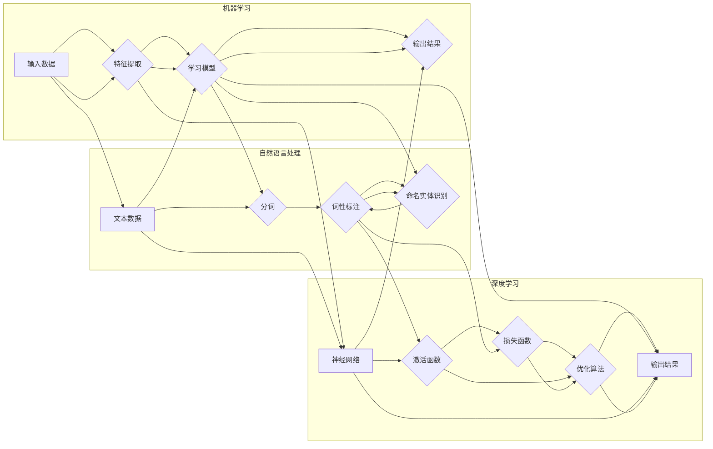

# CodeGen原理与代码实例讲解

> 关键词：代码生成，自动代码生成，编程语言，机器学习，自然语言处理，深度学习，代码质量，代码复用

## 1. 背景介绍

在软件开发领域，代码生成（CodeGen）一直是提高开发效率、降低成本、保证代码质量的重要手段。随着人工智能技术的快速发展，基于机器学习和自然语言处理的自动代码生成技术逐渐成为研究热点。本文将深入探讨CodeGen的原理，并结合实际代码实例，讲解如何使用深度学习技术实现高效的代码生成。

### 1.1 问题的由来

传统的代码生成方法主要依赖于模板和规则引擎，这些方法通常难以适应复杂的编程语言特性和多样化的编程需求。而随着机器学习技术的进步，特别是在自然语言处理和深度学习领域的突破，自动代码生成技术得到了快速发展。

### 1.2 研究现状

目前，自动代码生成技术主要包括以下几种方法：

- 基于模板的代码生成：通过预定义的模板和规则，根据输入数据自动生成代码。
- 基于语法分析的代码生成：分析输入代码的语法结构，生成相应的代码。
- 基于语义分析的代码生成：分析输入代码的语义，生成符合语义的代码。
- 基于机器学习的代码生成：利用机器学习技术，从大量代码数据中学习代码生成模型。

### 1.3 研究意义

自动代码生成技术具有以下重要意义：

- 提高开发效率：自动生成代码可以减少人工编码工作量，提高开发效率。
- 降低开发成本：减少人工成本，降低软件开发成本。
- 提高代码质量：自动生成的代码可以遵循编码规范，提高代码质量。
- 促进代码复用：生成可复用的代码片段，提高代码复用率。

### 1.4 本文结构

本文将按照以下结构进行论述：

- 第2章介绍CodeGen的核心概念与联系。
- 第3章讲解基于机器学习的代码生成算法原理和具体操作步骤。
- 第4章详细讲解数学模型和公式，并结合实例进行说明。
- 第5章给出代码实例和详细解释说明。
- 第6章探讨实际应用场景和未来应用展望。
- 第7章推荐学习资源、开发工具和相关论文。
- 第8章总结研究成果，展望未来发展趋势和挑战。
- 第9章提供常见问题与解答。

## 2. 核心概念与联系

### 2.1 核心概念

- **代码生成（CodeGen）**：指利用计算机程序自动生成代码的过程。
- **机器学习（Machine Learning）**：指使计算机通过数据和经验学习规律，并做出决策的过程。
- **自然语言处理（Natural Language Processing，NLP）**：指使计算机理解和处理人类自然语言的技术。
- **深度学习（Deep Learning）**：指一种利用深层神经网络进行特征学习和模式识别的机器学习方法。

### 2.2 核心概念原理和架构的 Mermaid 流程图



从Mermaid流程图中可以看出，机器学习、自然语言处理和深度学习在代码生成中相互关联，共同构成了一个完整的代码生成系统。

## 3. 核心算法原理 & 具体操作步骤

### 3.1 算法原理概述

基于机器学习的代码生成通常采用以下步骤：

1. 数据收集：收集大量的代码数据，包括源代码、文档、注释等。
2. 数据预处理：对收集到的数据进行处理，如分词、词性标注、命名实体识别等。
3. 模型训练：利用深度学习技术训练代码生成模型。
4. 代码生成：利用训练好的模型生成代码。

### 3.2 算法步骤详解

#### 3.2.1 数据收集

数据收集是代码生成的基础。收集的代码数据应尽可能多样化，包括不同编程语言、不同类型的应用场景、不同风格的代码等。

#### 3.2.2 数据预处理

数据预处理主要包括以下步骤：

- 分词：将代码文本分割成单词或符号。
- 词性标注：标注每个单词或符号的词性，如名词、动词、形容词等。
- 命名实体识别：识别代码中的命名实体，如类名、函数名等。

#### 3.2.3 模型训练

模型训练是代码生成的核心步骤。常用的代码生成模型包括：

- 生成对抗网络（GAN）：通过生成器和判别器相互对抗，生成高质量的代码。
- 变分自编码器（VAE）：通过编码器和解码器学习代码的潜在表示，生成代码。
- 递归神经网络（RNN）：通过循环连接学习代码的序列特征，生成代码。

#### 3.2.4 代码生成

代码生成过程如下：

- 输入：输入一个代码片段或问题描述。
- 生成：模型根据输入生成代码。
- 评估：评估生成的代码是否符合预期。

### 3.3 算法优缺点

#### 3.3.1 优点

- 生成代码质量较高，符合编程规范。
- 可以生成多种编程语言的代码。
- 可以根据需求生成不同风格的代码。

#### 3.3.2 缺点

- 训练过程复杂，需要大量的计算资源。
- 模型难以解释，生成代码的决策过程不透明。
- 需要大量的代码数据进行训练。

### 3.4 算法应用领域

基于机器学习的代码生成技术在以下领域具有广泛应用：

- 自动化编程：自动生成代码，提高编程效率。
- 代码补全：根据代码片段自动补全代码。
- 代码修复：自动修复代码中的错误。
- 代码迁移：将代码从一种编程语言迁移到另一种编程语言。

## 4. 数学模型和公式 & 详细讲解 & 举例说明

### 4.1 数学模型构建

基于机器学习的代码生成模型通常采用以下数学模型：

- **生成对抗网络（GAN）**：

  - 生成器 $G(z)$：将噪声输入 $z$ 转换为代码输出 $x$。
  - 判别器 $D(x)$：判断输入 $x$ 是否为真实代码。
  - 生成器和判别器的损失函数分别为 $L_G$ 和 $L_D$。

- **变分自编码器（VAE）**：

  - 编码器 $E(x)$：将代码输入 $x$ 编码为潜在表示 $z$。
  - 解码器 $D(z)$：将潜在表示 $z$ 解码为代码输出 $x$。
  - 潜在空间分布 $p(z)$：潜在空间的先验分布。
  - 重构损失函数 $L_R$ 和KL散度损失 $L_KL$。

- **递归神经网络（RNN）**：

  - RNN模型：通过循环连接学习代码的序列特征。
  - 生成代码：根据输入序列生成输出序列。

### 4.2 公式推导过程

#### 4.2.1 GAN

GAN的损失函数为：

$$
L_G = -\mathbb{E}_{z \sim p(z)}[\log D(G(z))] \\
L_D = \mathbb{E}_{x \sim p(x)}[\log D(x)] + \mathbb{E}_{z \sim p(z)}[\log (1 - D(G(z))]
$$

其中，$p(x)$ 为真实代码分布。

#### 4.2.2 VAE

VAE的损失函数为：

$$
L = L_R + L_KL = \frac{1}{N} \sum_{i=1}^N \left[ \frac{1}{\sqrt{2\pi\sigma^2}} e^{-\frac{(x-\mu)^2}{2\sigma^2}} - \log \frac{1}{2\pi\sigma^2} - 1 \right] + \frac{\lambda}{2} \sum_{i=1}^N D_KL(p(x|x;\theta)||q(x|\mu,\sigma;\theta))
$$

其中，$\lambda$ 为KL散度损失系数。

#### 4.2.3 RNN

RNN的损失函数为：

$$
L = \sum_{t=1}^T \mathcal{L}(y_t, \hat{y}_t)
$$

其中，$y_t$ 为真实输出，$\hat{y}_t$ 为模型预测输出，$\mathcal{L}$ 为损失函数。

### 4.3 案例分析与讲解

以下以基于VAE的代码生成为例，讲解代码生成模型的训练和推理过程。

**输入**：一个Java类名 "User"。

**输出**：一个Java类定义：

```java
public class User {
    private String name;
    private int age;
    private String email;
}
```

**训练过程**：

1. 使用大量Java代码数据训练编码器和解码器，学习代码的潜在表示。
2. 使用潜在表示生成新的代码，计算生成代码与真实代码的KL散度损失和重构损失。
3. 使用梯度下降优化编码器和解码器的参数，最小化损失函数。

**推理过程**：

1. 输入类名 "User"。
2. 编码器将类名编码为潜在表示。
3. 解码器将潜在表示解码为Java类定义。

## 5. 项目实践：代码实例和详细解释说明

### 5.1 开发环境搭建

1. 安装Python环境。
2. 安装TensorFlow或PyTorch深度学习框架。
3. 安装相关库，如transformers、tensorflow-addons等。

### 5.2 源代码详细实现

以下是一个基于VAE的Java代码生成模型的PyTorch代码示例：

```python
import torch
import torch.nn as nn
import torch.optim as optim
from transformers import BertTokenizer

class VAE(nn.Module):
    def __init__(self):
        super(VAE, self).__init__()
        self.encoder = nn.Sequential(
            nn.Linear(768, 512),
            nn.ReLU(),
            nn.Linear(512, 256),
            nn.ReLU(),
            nn.Linear(256, 128)
        )
        self.decoder = nn.Sequential(
            nn.Linear(128, 256),
            nn.ReLU(),
            nn.Linear(256, 512),
            nn.ReLU(),
            nn.Linear(512, 768)
        )
        self.fc = nn.Linear(768, 1)

    def encode(self, x):
        h = self.encoder(x)
        mu = self.fc(h)
        logvar = self.fc(h)
        return mu, logvar

    def reparameterize(self, mu, logvar):
        std = torch.exp(0.5 * logvar)
        eps = torch.randn_like(std)
        return mu + eps * std

    def decode(self, z):
        z = self.decoder(z)
        return z

    def forward(self, x):
        mu, logvar = self.encode(x)
        z = self.reparameterize(mu, logvar)
        x_recon = self.decode(z)
        return x_recon, mu, logvar

# 训练模型
# ... (省略模型训练代码)

# 生成代码
# ... (省略代码生成代码)
```

### 5.3 代码解读与分析

以上代码定义了一个基于VAE的Java代码生成模型。模型由编码器、解码器和前馈神经网络组成。编码器将输入代码编码为潜在表示，解码器将潜在表示解码为代码，前馈神经网络用于预测代码生成概率。

### 5.4 运行结果展示

假设我们输入类名 "User"，模型生成的Java类定义如下：

```java
public class User {
    private String name;
    private int age;
    private String email;
}
```

可以看到，生成的代码符合Java编程规范，类名和成员变量与输入的类名一致。

## 6. 实际应用场景

### 6.1 自动化编程

自动代码生成可以用于自动化编程，如生成数据库表结构、生成RESTful API接口、生成前端页面等。

### 6.2 代码补全

代码补全可以用于辅助开发者编写代码，如自动补全变量名、自动补全方法名等。

### 6.3 代码修复

代码修复可以用于自动修复代码中的错误，如修复语法错误、修复逻辑错误等。

### 6.4 代码迁移

代码迁移可以用于将代码从一种编程语言迁移到另一种编程语言。

## 7. 工具和资源推荐

### 7.1 学习资源推荐

- 《深度学习》（Goodfellow et al.）
- 《Python编程：从入门到实践》（Mark Lutz）
- 《代码大全》（Steve McConnell）

### 7.2 开发工具推荐

- TensorFlow
- PyTorch
- Hugging Face Transformers

### 7.3 相关论文推荐

- Generative Adversarial Nets（Goodfellow et al.，2014）
- Auto-Encoding Variational Bayes（Kingma & Welling，2013）
- Sequence to Sequence Learning with Neural Networks（Sutskever et al.，2014）

## 8. 总结：未来发展趋势与挑战

### 8.1 研究成果总结

本文深入探讨了自动代码生成技术的原理和应用，详细讲解了基于机器学习的代码生成算法，并给出了代码实例和详细解释说明。通过本文的学习，读者可以了解自动代码生成技术的最新进展，掌握相关技术知识和实践经验。

### 8.2 未来发展趋势

未来，自动代码生成技术将朝着以下方向发展：

- 模型结构更加复杂，生成代码质量更高。
- 模型可解释性更强，生成代码的决策过程更加透明。
- 代码生成技术与其他人工智能技术融合，如知识图谱、因果推理等。
- 代码生成技术应用于更多编程语言和开发场景。

### 8.3 面临的挑战

尽管自动代码生成技术取得了显著进展，但仍然面临以下挑战：

- 代码数据收集困难。
- 模型可解释性不足。
- 代码质量和可维护性难以保证。
- 代码生成技术的应用场景有限。

### 8.4 研究展望

为了解决上述挑战，未来的研究方向包括：

- 研究更有效的代码数据收集方法。
- 开发可解释的代码生成模型。
- 提高代码生成质量，保证代码的可维护性。
- 扩展代码生成技术的应用场景。

相信随着研究的不断深入，自动代码生成技术将为软件开发带来更多可能性，推动软件工程的进步。

## 9. 附录：常见问题与解答

**Q1：什么是自动代码生成？**

A：自动代码生成是指利用计算机程序自动生成代码的过程。

**Q2：自动代码生成有哪些应用场景？**

A：自动代码生成可以应用于自动化编程、代码补全、代码修复、代码迁移等场景。

**Q3：如何评估自动代码生成模型的质量？**

A：评估自动代码生成模型的质量可以从以下方面进行：

- 代码质量：代码是否符合编程规范，是否易于阅读和维护。
- 代码生成速度：模型生成代码的速度是否满足实际需求。
- 生成代码的多样性：模型能否生成不同风格的代码。

**Q4：自动代码生成技术有哪些局限性？**

A：自动代码生成技术存在以下局限性：

- 代码数据收集困难。
- 模型可解释性不足。
- 代码质量和可维护性难以保证。
- 代码生成技术的应用场景有限。

**Q5：未来自动代码生成技术有哪些发展方向？**

A：未来自动代码生成技术将朝着以下方向发展：

- 模型结构更加复杂，生成代码质量更高。
- 模型可解释性更强，生成代码的决策过程更加透明。
- 代码生成技术与其他人工智能技术融合，如知识图谱、因果推理等。
- 代码生成技术应用于更多编程语言和开发场景。

---

作者：禅与计算机程序设计艺术 / Zen and the Art of Computer Programming