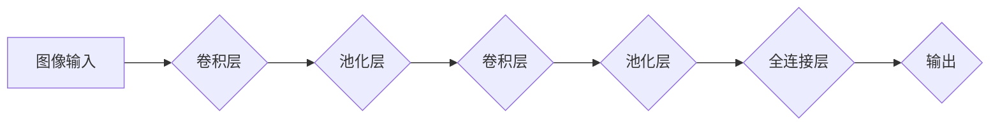

> 关键词：卷积神经网络(CNN)，图像处理，深度学习，Python，PyTorch，TensorFlow，机器学习，图像识别，图像分类

# Python机器学习实战：卷积神经网络(CNN)在图像处理中的应用

卷积神经网络（Convolutional Neural Networks，CNN）是深度学习领域中的一种重要模型，尤其在图像处理领域取得了显著的成果。本文将深入探讨CNN的原理、应用实践，并展示如何在Python环境中使用PyTorch和TensorFlow构建CNN模型进行图像处理。

## 1. 背景介绍

图像处理作为计算机视觉领域的一个重要分支，在众多应用场景中发挥着关键作用。传统的图像处理方法依赖于手工设计的特征提取器和分类器，而CNN的出现使得计算机能够自动从数据中学习到有意义的特征，并在图像识别、图像分类、目标检测等任务上取得了突破性的进展。

## 2. 核心概念与联系

### 2.1 核心概念

**卷积神经网络（CNN）**是一种特别适合于处理具有网格结构数据（如图像）的深度学习模型。它通过一系列卷积层、池化层和全连接层来提取图像特征并进行分类。

- **卷积层**：通过卷积核（filter）对输入图像进行局部感知，提取图像特征。
- **池化层**：对卷积层输出的特征进行下采样，减少特征图的空间维度，降低计算复杂度。
- **全连接层**：将池化层输出的特征连接到一个或多个全连接层，进行最终分类。

### 2.2 Mermaid 流程图



## 3. 核心算法原理 & 具体操作步骤

### 3.1 算法原理概述

CNN的核心原理是通过卷积核对图像进行局部感知，提取图像特征。卷积操作可以模拟人类视觉系统中的神经元在感受野内进行特征提取的过程。

### 3.2 算法步骤详解

1. **初始化模型参数**：包括卷积核权重、偏置等。
2. **前向传播**：输入图像通过卷积层、池化层，最后经过全连接层输出预测结果。
3. **反向传播**：计算损失函数，并根据梯度更新模型参数。
4. **优化模型**：通过迭代优化过程，提高模型在训练数据上的泛化能力。

### 3.3 算法优缺点

**优点**：

- 自动提取图像特征，无需人工设计特征。
- 对图像的旋转、缩放、平移等变换具有鲁棒性。
- 在图像识别、图像分类等任务上取得了显著效果。

**缺点**：

- 计算量大，需要大量的计算资源。
- 需要大量的训练数据。
- 模型复杂度高，难以解释。

### 3.4 算法应用领域

- 图像识别
- 图像分类
- 目标检测
- 图像分割
- 图像去噪
- 生成对抗网络（GAN）

## 4. 数学模型和公式 & 详细讲解 & 举例说明

### 4.1 数学模型构建

CNN的数学模型主要包括以下部分：

- **卷积层**：卷积层通过卷积核对图像进行局部感知，提取图像特征。卷积操作可以表示为：

  $$
  h^{(l)}_i = \sum_{j} w_{ij} * f(x_i, h^{(l-1)}_j) + b_i
  $$

  其中，$h^{(l)}_i$表示第$l$层的第$i$个输出，$w_{ij}$表示第$l-1$层的第$j$个神经元到第$l$层的第$i$个神经元的权重，$f$表示激活函数，$b_i$表示偏置。

- **池化层**：池化层对卷积层输出的特征进行下采样，减少特征图的空间维度。常见的池化方法有最大池化和平均池化。

- **全连接层**：全连接层将池化层输出的特征连接到一个或多个全连接层，进行最终分类。

  $$
  y = W^T h^{(L)} + b
  $$

  其中，$y$表示输出，$W$表示全连接层的权重，$h^{(L)}$表示最后一个卷积层输出的特征，$b$表示偏置。

### 4.2 公式推导过程

卷积层和全连接层的公式推导过程相对复杂，涉及微积分、线性代数等数学知识。具体推导过程可参考相关深度学习教材。

### 4.3 案例分析与讲解

以一个简单的CNN模型为例，说明其训练过程。

假设我们有一个包含10个类别的小型图像分类任务。输入图像的尺寸为32x32，颜色通道为3（RGB）。我们构建一个包含2个卷积层、2个池化层和1个全连接层的CNN模型。

- **卷积层1**：使用5x5的卷积核，步长为1，激活函数为ReLU。
- **池化层1**：使用2x2的最大池化。
- **卷积层2**：使用5x5的卷积核，步长为1，激活函数为ReLU。
- **池化层2**：使用2x2的最大池化。
- **全连接层**：输出层，包含10个神经元，对应10个类别。

训练过程如下：

1. 使用预训练的权重初始化模型参数。
2. 将图像输入模型，通过卷积层、池化层，最后输出预测类别。
3. 计算预测类别与真实标签之间的交叉熵损失。
4. 使用反向传播算法计算损失对模型参数的梯度。
5. 根据梯度更新模型参数。
6. 重复步骤2-5，直到模型收敛。

## 5. 项目实践：代码实例和详细解释说明

### 5.1 开发环境搭建

- 安装PyTorch或TensorFlow等深度学习框架。
- 安装NumPy、Pandas等数据处理库。
- 安装Matplotlib、Seaborn等可视化库。

### 5.2 源代码详细实现

以下是一个使用PyTorch构建简单CNN模型进行图像分类的示例代码：

```python
import torch
import torch.nn as nn
import torch.optim as optim

# 定义CNN模型
class CNN(nn.Module):
    def __init__(self):
        super(CNN, self).__init__()
        self.conv1 = nn.Conv2d(3, 16, kernel_size=3, stride=1, padding=1)
        self.conv2 = nn.Conv2d(16, 32, kernel_size=3, stride=1, padding=1)
        self.fc1 = nn.Linear(32*16*16, 128)
        self.fc2 = nn.Linear(128, 10)

    def forward(self, x):
        x = nn.functional.relu(self.conv1(x))
        x = nn.functional.max_pool2d(x, kernel_size=2, stride=2)
        x = nn.functional.relu(self.conv2(x))
        x = nn.functional.max_pool2d(x, kernel_size=2, stride=2)
        x = x.view(-1, 32*16*16)
        x = nn.functional.relu(self.fc1(x))
        x = self.fc2(x)
        return x

# 实例化模型、损失函数和优化器
model = CNN()
criterion = nn.CrossEntropyLoss()
optimizer = optim.SGD(model.parameters(), lr=0.01, momentum=0.9)

# 训练模型
for epoch in range(10):
    for data, target in dataloader:
        optimizer.zero_grad()
        output = model(data)
        loss = criterion(output, target)
        loss.backward()
        optimizer.step()
    print(f'Epoch {epoch+1}, Loss: {loss.item()}')

# 保存模型
torch.save(model.state_dict(), 'model.pth')
```

### 5.3 代码解读与分析

- `CNN`类：定义了CNN模型的结构，包含2个卷积层、2个池化层和1个全连接层。
- `forward`方法：前向传播函数，将输入图像经过卷积层、池化层，最后输出预测类别。
- 训练过程：加载训练数据，通过迭代优化模型参数，直至模型收敛。

### 5.4 运行结果展示

运行上述代码，模型将在训练数据上迭代优化，最终在测试数据上评估模型性能。通过调整模型结构、超参数等，可以进一步提升模型性能。

## 6. 实际应用场景

### 6.1 图像识别

CNN可以用于图像识别任务，如人脸识别、物体识别等。通过在大量图像数据上训练，模型可以学会识别图像中的物体和场景。

### 6.2 图像分类

CNN可以用于图像分类任务，如植物分类、动物分类等。通过在大量图像数据上训练，模型可以学会将图像分类到不同的类别。

### 6.3 目标检测

CNN可以用于目标检测任务，如行人检测、车辆检测等。通过在大量图像数据上训练，模型可以识别图像中的目标并定位其位置。

### 6.4 图像分割

CNN可以用于图像分割任务，如医学图像分割、卫星图像分割等。通过在大量图像数据上训练，模型可以将图像分割成不同的区域。

## 7. 工具和资源推荐

### 7.1 学习资源推荐

- 《深度学习》（Goodfellow, Bengio, Courville著）
- 《Python深度学习》（François Chollet著）
- 《卷积神经网络与深度学习》（邱锡鹏著）

### 7.2 开发工具推荐

- PyTorch
- TensorFlow
- Keras

### 7.3 相关论文推荐

- "A Comprehensive Survey on Deep Learning for Image Recognition"（Pangaro, M., Tzeng, D., & Isola, P.）
- "Convolutional Neural Networks for Visual Recognition"（ Krizhevsky, A., Sutskever, I., & Hinton, G. E.）

## 8. 总结：未来发展趋势与挑战

### 8.1 研究成果总结

本文深入探讨了CNN的原理、应用实践，并展示了如何在Python环境中使用PyTorch和TensorFlow构建CNN模型进行图像处理。通过分析实际应用场景，我们看到了CNN在图像识别、图像分类、目标检测、图像分割等领域的广泛应用。

### 8.2 未来发展趋势

随着深度学习技术的不断发展，CNN在未来将呈现以下发展趋势：

- 模型结构更加复杂：出现更多创新的结构，如可分离卷积、层次化卷积等。
- 训练效率更高：采用更高效的训练算法和优化器，降低训练成本。
- 应用范围更广：应用于更多领域，如视频处理、三维重建等。

### 8.3 面临的挑战

CNN在图像处理领域虽然取得了显著成果，但仍面临以下挑战：

- 数据量巨大：需要大量标注数据才能训练出高质量的模型。
- 计算量大：训练过程需要大量的计算资源。
- 模型可解释性差：难以解释模型的决策过程。

### 8.4 研究展望

未来，我们需要在以下方面进行更多研究：

- 研究更高效的训练算法和优化器。
- 探索更有效的数据增强方法，降低对标注数据的依赖。
- 提高模型的可解释性，增强模型的可信度。
- 将CNN与其他人工智能技术（如强化学习、迁移学习等）相结合，构建更加智能的图像处理系统。

## 9. 附录：常见问题与解答

**Q1：CNN在图像处理中的应用有哪些？**

A：CNN在图像处理中可以应用于图像识别、图像分类、目标检测、图像分割、图像去噪等多种任务。

**Q2：如何提高CNN模型的性能？**

A：提高CNN模型性能的方法包括：使用更复杂的模型结构、增加训练数据、调整超参数、使用正则化技术等。

**Q3：CNN模型如何防止过拟合？**

A：CNN模型防止过拟合的方法包括：使用正则化技术（如L1、L2正则化）、数据增强、Dropout、早停等。

**Q4：如何评估CNN模型的性能？**

A：评估CNN模型性能的方法包括：准确率、召回率、F1分数、混淆矩阵等。

**Q5：CNN模型如何处理实时图像数据？**

A：处理实时图像数据需要优化CNN模型结构和算法，降低计算复杂度，同时保证实时性。

作者：禅与计算机程序设计艺术 / Zen and the Art of Computer Programming