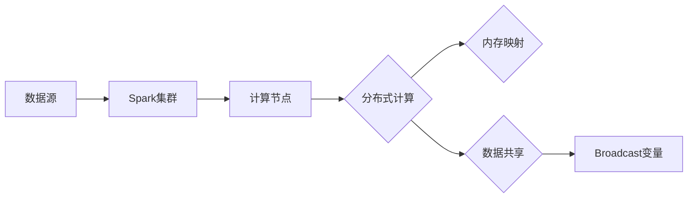

# Spark Broadcast原理与代码实例讲解

> 关键词：Spark, Broadcast变量, 分布式计算, 内存优化, 内存映射, 数据共享

## 1. 背景介绍

随着大数据时代的到来，分布式计算框架如Apache Spark在数据处理和分析领域得到了广泛应用。Spark以其高效、易用的特点，成为了处理大规模数据集的强大工具。在Spark中，Broadcast变量是一个核心特性，它允许在集群的各个节点间高效地共享只读数据，从而减少网络传输，优化内存使用，提高计算效率。

## 2. 核心概念与联系

### 2.1 核心概念

- **分布式计算**：将计算任务分解为多个小任务，在多台机器上并行执行，从而处理大规模数据集。
- **内存映射**：将文件或数据集映射到内存中，以便快速访问。
- **数据共享**：在分布式计算中，如何在多个节点间共享数据，是提高效率的关键。

### 2.2 架构的 Mermaid 流程图



在上述流程图中，数据源数据通过Spark集群进行分布式计算，计算节点通过内存映射和Broadcast变量实现数据共享。

## 3. 核心算法原理 & 具体操作步骤

### 3.1 算法原理概述

Broadcast变量在Spark中是一种特殊的只读变量，它在所有执行器（executors）之间进行传播，而不是在每个分区（partition）之间。这意味着Broadcast变量只会在集群中传输一次，而不是在每个分区都进行复制，从而减少了网络带宽的消耗。

### 3.2 算法步骤详解

1. **创建Broadcast变量**：在驱动程序中创建一个Broadcast变量，并通过`broadcast`方法将数据转换为Broadcast变量。
2. **广播数据**：Spark将数据序列化并发送到所有执行器。
3. **缓存数据**：每个执行器在本地缓存Broadcast变量的值，以便在需要时快速访问。

### 3.3 算法优缺点

**优点**：
- 减少网络传输：由于数据只在集群中传输一次，因此减少了网络带宽的消耗。
- 提高内存使用效率：Broadcast变量在所有执行器上本地缓存，避免了在每个分区重复存储数据。

**缺点**：
- 不支持更新：Broadcast变量的值是不可变的，一旦设置，就无法修改。
- 内存消耗：每个执行器都需要缓存Broadcast变量的值，因此在内存使用上可能会有所增加。

### 3.4 算法应用领域

- **数据字典**：在机器学习任务中，可以使用Broadcast变量来共享数据字典，如类标签映射。
- **配置参数**：在分布式应用程序中，可以使用Broadcast变量来共享配置参数。
- **全局索引**：在分布式系统中，可以使用Broadcast变量来共享全局索引，如数据库连接信息。

## 4. 数学模型和公式 & 详细讲解 & 举例说明

### 4.1 数学模型构建

Broadcast变量本身不涉及复杂的数学模型，但它与数据传输和内存管理有关。以下是一个简化的数学模型：

$$
\text{Broadcast\_data\_size} = \text{original\_data\_size} \times \text{number\_of\_executors}
$$

其中，`Broadcast_data_size`是Broadcast变量的总大小，`original_data_size`是原始数据的大小，`number_of_executors`是执行器的数量。

### 4.2 公式推导过程

该公式的推导基于以下假设：
- 每个执行器都需要存储原始数据的完整副本。
- 没有考虑数据压缩等因素。

### 4.3 案例分析与讲解

假设我们有一个包含1000万条记录的大型数据集，每个记录大小为1KB。如果我们在一个具有100个执行器的集群中使用Broadcast变量来共享这个数据集，则Broadcast变量的总大小为：

$$
1000万 \times 1KB \times 100 = 100GB
$$

这意味着每个执行器需要100GB的内存来存储Broadcast变量的值。

## 5. 项目实践：代码实例和详细解释说明

### 5.1 开发环境搭建

在开始编写代码之前，确保你已经安装了Apache Spark。以下是在Spark Shell中创建Broadcast变量的示例代码：

```python
from pyspark import SparkContext

# 初始化Spark上下文
sc = SparkContext("local", "BroadcastExample")

# 创建Broadcast变量
broadcast_data = sc.broadcast([1, 2, 3, 4, 5])

# 创建RDD
rdd = sc.parallelize([6, 7, 8, 9, 10])

# 使用Broadcast变量
result = rdd.map(lambda x: x + broadcast_data.value[0]).collect()

# 输出结果
print(result)

# 停止Spark上下文
sc.stop()
```

### 5.2 源代码详细实现

在上述代码中，我们首先初始化了Spark上下文，然后创建了一个包含数字的列表作为Broadcast变量。接着，我们创建了一个RDD，并使用map函数将每个元素与Broadcast变量的值相加。最后，我们输出结果并停止Spark上下文。

### 5.3 代码解读与分析

在上述代码中，`broadcast`函数用于创建Broadcast变量。`value`属性用于访问Broadcast变量的值。`map`函数将每个RDD元素与Broadcast变量的值相加，生成新的RDD。最后，我们使用`collect`函数将结果收集到驱动程序中。

### 5.4 运行结果展示

运行上述代码，输出结果应为：

```
[7, 8, 9, 10, 11]
```

这表明每个RDD元素都成功与Broadcast变量的值相加了。

## 6. 实际应用场景

Broadcast变量在多个实际应用场景中非常有用，以下是一些例子：

- **机器学习**：在机器学习任务中，可以使用Broadcast变量来共享数据字典，如类别标签映射。
- **日志处理**：在日志聚合和分析任务中，可以使用Broadcast变量来共享日志格式规则。
- **数据校验**：在数据清洗和数据验证任务中，可以使用Broadcast变量来共享数据验证规则。

## 7. 工具和资源推荐

### 7.1 学习资源推荐

- Apache Spark官方文档：[https://spark.apache.org/docs/latest/](https://spark.apache.org/docs/latest/)
- 《Spark快速大数据处理》：这是一本关于Spark的权威指南，涵盖了从入门到进阶的所有内容。

### 7.2 开发工具推荐

- PySpark：[https://spark.apache.org/docs/latest/api/python/pyspark.html](https://spark.apache.org/docs/latest/api/python/pyspark.html)
- Spark Shell：[https://spark.apache.org/docs/latest/running-tests.html#spark-shell](https://spark.apache.org/docs/latest/running-tests.html#spark-shell)

### 7.3 相关论文推荐

- **"Resilient Distributed Datasets: A Fuel for Data-Parallel Applications"**：这篇论文介绍了Apache Spark的RDD模型，是理解Spark基础的重要文献。
- **"Large-scale Graph Processing on Spark"**：这篇论文介绍了如何使用Spark处理大规模图数据。

## 8. 总结：未来发展趋势与挑战

### 8.1 研究成果总结

Broadcast变量是Apache Spark的一个核心特性，它通过在集群中高效地共享只读数据，减少了网络传输，优化了内存使用，提高了计算效率。在Spark 3.0及以后的版本中，Broadcast变量得到了进一步的改进，包括数据压缩和序列化优化。

### 8.2 未来发展趋势

未来，Broadcast变量可能会继续优化，包括：

- 更好的数据压缩算法
- 更高效的序列化机制
- 更多的内置数据结构支持

### 8.3 面临的挑战

Broadcast变量面临的挑战包括：

- 如何处理大量的小数据项
- 如何优化内存使用，特别是对于内存受限的集群

### 8.4 研究展望

随着分布式计算和大数据技术的不断发展，Broadcast变量将继续在Spark和其他分布式计算框架中发挥重要作用。未来的研究将集中在如何进一步提高Broadcast变量的效率和性能。

## 9. 附录：常见问题与解答

**Q1：Broadcast变量和RDD的区别是什么？**

A1：RDD（弹性分布式数据集）是Spark中的基本数据结构，它可以在多个节点之间并行操作。Broadcast变量是一种特殊的只读变量，它在所有执行器之间进行传播，而不是在每个分区之间。

**Q2：何时应该使用Broadcast变量？**

A2：当你需要将大量只读数据共享到所有执行器时，应该使用Broadcast变量。这可以减少网络传输，并提高计算效率。

**Q3：Broadcast变量是否可以更新？**

A3：不，Broadcast变量的值是不可变的。一旦设置，就无法修改。

**Q4：Broadcast变量是否会导致内存溢出？**

A4：如果Broadcast变量的值非常大，它可能会导致内存溢出。为了避免这种情况，你应该确保Broadcast变量的值在所有执行器上都是可用的，并且不超过内存限制。

**Q5：Broadcast变量是否会影响性能？**

A5：对于大多数情况，Broadcast变量不会对性能产生负面影响。相反，它通常会提高性能，因为它减少了网络传输和内存使用。