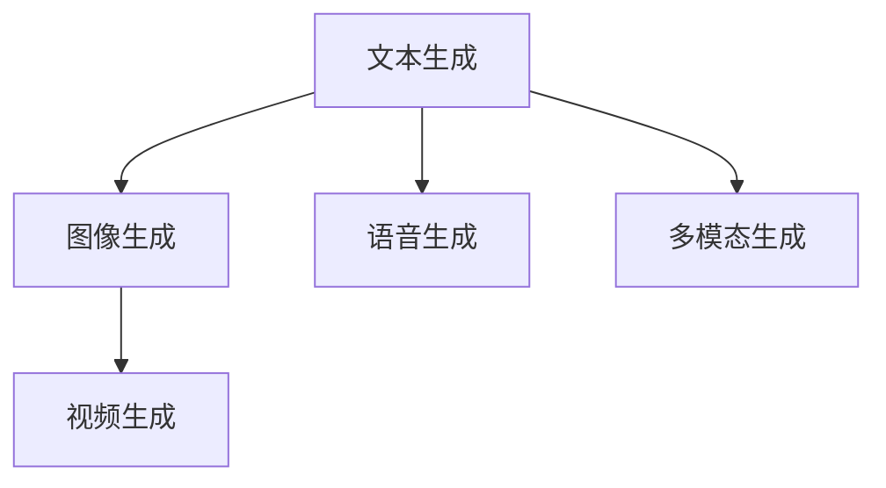

                 

# AIGC在各行业的应用前景

## 1. 背景介绍

随着人工智能技术的快速发展，人工智能生成内容（Artificial Intelligence Generated Content，简称AIGC）已经成为推动行业创新与变革的重要引擎。AIGC是指利用深度学习、自然语言处理等人工智能技术自动生成文本、图像、视频等多模态内容的技术。它包括文本生成、语音生成、图像生成、视频生成等多个子领域。AIGC的兴起为各行各业带来了全新的发展机遇，涵盖了媒体、教育、娱乐、医疗、金融、旅游、艺术等多个领域。

### 1.1 行业变革的催化剂

AIGC通过模拟人类的创造性思维，生成内容能够高度拟真并具有高度的可控性。这使得AIGC成为各行各业实现智能化转型的重要手段。在内容生成上，AIGC能够快速高效地生成高质量内容，解决了传统内容创作中耗时长、成本高的问题。在个性化推荐上，AIGC能够根据用户的行为和兴趣生成个性化的内容，提高用户体验和满意度。在自动化办公上，AIGC能够自动生成报告、合同、广告等业务文档，提高工作效率。

### 1.2 AIGC的发展历程

AIGC的发展历程可以追溯到早期的机器翻译和文本摘要系统。随着深度学习技术的进步，尤其是Transformer架构的引入，AIGC技术得到了快速的发展。2013年，Google开发的Neural Machine Translation (NMT)系统首次实现了接近人类翻译水平的机器翻译。2019年，OpenAI发布的GPT-3模型在文本生成、问答、对话等任务上取得了令人瞩目的成果，标志着AIGC技术进入了一个新的发展阶段。

## 2. 核心概念与联系

### 2.1 核心概念概述

为了更好地理解AIGC在各行业的应用前景，本节将介绍几个密切相关的核心概念：

- 人工智能生成内容（AIGC）：利用深度学习、自然语言处理等技术自动生成文本、图像、视频等内容的技术。
- 自然语言处理（NLP）：研究如何使计算机能够理解、解释和生成人类语言的技术。
- 神经网络（Neural Network）：一种模拟人脑神经网络的结构和功能的计算模型。
- 深度学习（Deep Learning）：一类基于神经网络的机器学习方法，能够从大量数据中学习并提取特征。
- 迁移学习（Transfer Learning）：将一个领域学到的知识迁移到另一个领域，提升模型在新任务上的表现。
- 多模态学习（Multimodal Learning）：处理和融合多种类型的数据，如图像、音频、文本等，以提升模型的综合表现。

这些核心概念之间存在着紧密的联系，形成了AIGC技术的完整生态系统。

### 2.2 核心概念的整体架构

AIGC技术涉及多个领域，包括文本生成、图像生成、语音生成、视频生成等。这些技术可以单独使用，也可以互相结合，形成更加复杂的解决方案。



从技术架构上来看，AIGC技术主要由以下几个部分组成：

1. **数据预处理**：对原始数据进行清洗、标注和转换，生成模型所需的输入数据。
2. **模型训练**：使用大量标注数据训练神经网络模型，学习生成内容的规律和模式。
3. **内容生成**：模型根据输入的数据生成新的内容，可以是对文本、图像、语音或视频等。
4. **模型评估**：使用评估指标（如BLEU、CIDEr等）对生成的内容进行评估，保证生成内容的质量和准确性。
5. **应用集成**：将生成的内容应用到实际场景中，如智能客服、内容推荐、虚拟主播等。

这些核心概念和架构共同构成了AIGC技术的完整框架，使得AIGC在各个行业得以广泛应用。

## 3. 核心算法原理 & 具体操作步骤
### 3.1 算法原理概述

AIGC的生成过程通常基于自回归模型或自编码模型。自回归模型通过学习历史文本或图像等数据，预测下一个字符或像素。自编码模型通过将输入数据压缩为低维编码，再通过解码器生成输出数据。这些模型都可以通过深度学习技术进行训练，并利用大规模语料库进行预训练，从而提高生成内容的质量和多样性。

### 3.2 算法步骤详解

AIGC的生成算法主要包括以下几个步骤：

**Step 1: 数据准备**

1. **收集数据**：根据具体的生成任务，收集相应的文本、图像、音频等数据。
2. **数据预处理**：清洗数据，去除噪声和无关信息，并进行必要的标注和转换。

**Step 2: 模型训练**

1. **选择模型**：根据任务类型选择合适的模型，如GPT、BERT、GAN等。
2. **模型训练**：使用训练集对模型进行训练，优化模型参数，提高生成效果。

**Step 3: 内容生成**

1. **输入数据**：将需要生成内容的数据作为模型的输入。
2. **生成输出**：通过模型生成新的内容，如文本、图像、音频等。

**Step 4: 评估与优化**

1. **评估指标**：使用BLEU、CIDEr等指标评估生成内容的质量。
2. **模型优化**：根据评估结果，调整模型参数，提高生成效果。

**Step 5: 应用集成**

1. **部署模型**：将训练好的模型部署到实际应用环境中。
2. **集成应用**：将生成的内容集成到具体的应用场景中，如智能客服、内容推荐等。

### 3.3 算法优缺点

AIGC技术在生成内容的质量和多样性上取得了显著进展，但也存在一些缺点：

**优点**：

1. **高效性**：AIGC可以自动化生成大量内容，节省了大量人力和时间。
2. **可控性**：通过调整模型参数和训练数据，可以生成符合特定需求的内容。
3. **多样性**：AIGC可以生成多种形式的内容，如图像、视频、音频等。
4. **个性化**：根据用户的行为和兴趣生成个性化的内容，提高用户体验。

**缺点**：

1. **质量不稳定**：生成的内容质量受到训练数据和模型参数的影响，有时可能生成低质量或不合适的内容。
2. **可解释性不足**：AIGC生成的内容难以解释，缺乏透明性和可解释性。
3. **版权问题**：生成的内容可能涉及版权问题，尤其是未经授权使用的图片和音频。

### 3.4 算法应用领域

AIGC技术广泛应用于各个行业，包括但不限于以下几个领域：

- **媒体与娱乐**：生成影视剧本、音乐、游戏等内容。
- **教育**：生成教学视频、习题、模拟场景等教育资源。
- **医疗**：生成医学影像、疾病报告、诊疗指南等医疗内容。
- **金融**：生成市场分析报告、财务报表、投资策略等金融内容。
- **旅游**：生成旅游攻略、景点介绍、行程规划等旅游内容。
- **艺术**：生成艺术品、艺术作品、历史文献等艺术内容。
- **广告**：生成广告文案、视频、音频等广告内容。
- **客服**：生成智能客服对话、自动回复等客户服务内容。

## 4. 数学模型和公式 & 详细讲解
### 4.1 数学模型构建

AIGC的生成过程通常基于自回归模型或自编码模型。以文本生成为例，假设文本生成任务为将给定的文本序列 $x_1, x_2, ..., x_n$ 映射到目标文本序列 $y_1, y_2, ..., y_n$。模型的输入为 $x_t$，输出为 $y_t$。模型的目标是最小化生成序列和目标序列之间的差异，即最小化损失函数：

$$
L(y, \theta) = -\frac{1}{N} \sum_{i=1}^{N} \log p(y|x)
$$

其中，$p(y|x)$ 为模型在给定输入 $x$ 下生成目标序列 $y$ 的概率。

### 4.2 公式推导过程

以文本生成任务为例，生成模型的公式为：

$$
p(y|x) = \prod_{t=1}^{n} p(y_t|y_{<t}, x)
$$

其中 $y_{<t}$ 表示目标序列中 $t$ 之前的所有文本。模型的目标是最大化生成序列和目标序列之间的KL散度，即：

$$
KL(p(y|x), p_{data}(y))
$$

其中 $p_{data}(y)$ 为目标序列的真实分布。

### 4.3 案例分析与讲解

以文本生成为例，使用BERT模型进行文本生成。假设目标序列为 "I am going to visit"，输入序列为 "I will go to"，生成结果为 "I will go to Paris"。BERT模型将输入序列编码为向量，通过Transformer结构生成目标序列的向量表示，最终输出概率分布：

$$
p(y|x) = \frac{e^{s_t}}{\sum_{t} e^{s_t}}
$$

其中 $s_t$ 为模型在输入 $x$ 下生成文本 $y_t$ 的得分。得分可以通过计算模型输出向量与目标向量之间的余弦相似度得到：

$$
s_t = \frac{v_{y_t}^T \cdot W \cdot h_{x}}{||v_{y_t}|| \cdot ||W \cdot h_{x}||}
$$

其中 $h_{x}$ 为输入序列 $x$ 的嵌入表示，$v_{y_t}$ 为目标序列 $y_t$ 的嵌入表示，$W$ 为Transformer中的权重矩阵。

## 5. 项目实践：代码实例和详细解释说明
### 5.1 开发环境搭建

进行AIGC项目实践前，需要准备好开发环境。以下是使用Python进行PyTorch开发的环境配置流程：

1. 安装Anaconda：从官网下载并安装Anaconda，用于创建独立的Python环境。

2. 创建并激活虚拟环境：
```bash
conda create -n pytorch-env python=3.8 
conda activate pytorch-env
```

3. 安装PyTorch：根据CUDA版本，从官网获取对应的安装命令。例如：
```bash
conda install pytorch torchvision torchaudio cudatoolkit=11.1 -c pytorch -c conda-forge
```

4. 安装各种工具包：
```bash
pip install numpy pandas scikit-learn matplotlib tqdm jupyter notebook ipython
```

5. 安装AIGC相关的库：
```bash
pip install transformers albert_cache
```

完成上述步骤后，即可在`pytorch-env`环境中开始AIGC实践。

### 5.2 源代码详细实现

这里以文本生成为例，给出使用PyTorch实现AIGC的代码实现。

```python
from transformers import AutoTokenizer, AutoModelForCausalLM

# 初始化模型和分词器
model = AutoModelForCausalLM.from_pretrained('gpt2')
tokenizer = AutoTokenizer.from_pretrained('gpt2')

# 定义生成函数
def generate_text(prompt, max_length=50):
    input_ids = tokenizer.encode(prompt, return_tensors='pt', max_length=max_length, padding='max_length', truncation=True)
    generated_ids = model.generate(input_ids, max_length=max_length, top_k=50, top_p=0.95)
    return tokenizer.decode(generated_ids[0], skip_special_tokens=True)

# 调用生成函数
print(generate_text("I am going to visit"))
```

以上代码实现了使用GPT-2模型进行文本生成。通过设置不同的提示（Prompt），可以生成多种不同风格和内容的文本。例如，设置提示为 "I am going to visit Paris"，可以生成类似 "I am going to visit Paris, the city of lights" 的内容。

### 5.3 代码解读与分析

让我们详细解读一下关键代码的实现细节：

**AutoTokenizer和AutoModelForCausalLM**：
- `AutoTokenizer`：用于将输入的文本转换为模型所需的token id序列。
- `AutoModelForCausalLM`：用于生成文本的模型，使用了自回归生成方法。

**generate_text函数**：
- `tokenizer.encode`：将输入文本转换为模型所需的token id序列。
- `model.generate`：使用模型生成文本，通过设置参数 `top_k` 和 `top_p` 控制生成结果的多样性。
- `tokenizer.decode`：将生成的token id序列转换为文本。

**提示（Prompt）**：
- 提示是生成函数的重要输入，通过设置不同的提示，可以生成不同的文本。

**代码运行结果**：
- 调用 `generate_text` 函数，可以生成符合设定的文本内容。

## 6. 实际应用场景

### 6.1 媒体与娱乐

AIGC技术在媒体与娱乐领域有着广泛的应用，如影视剧本生成、音乐生成、游戏生成等。通过AIGC技术，可以快速生成大量高质量的内容，满足娱乐产业的需求。例如，在影视剧制作中，可以利用AIGC生成详细的剧本，提供给编剧和导演进行参考和修改。在音乐创作中，AIGC可以生成旋律、和弦和歌词，辅助音乐家创作原创音乐。

### 6.2 教育

AIGC技术在教育领域的应用也越来越广泛。例如，利用AIGC生成个性化的教学视频和习题，帮助学生更好地理解和掌握知识。AIGC还可以生成虚拟教师，通过与学生互动，进行智能化的教学辅导。例如，在化学实验教学中，利用AIGC生成虚拟实验场景，让学生在虚拟环境中进行实验，从而降低实验风险和成本。

### 6.3 医疗

在医疗领域，AIGC技术可以生成医学影像、疾病报告、诊疗指南等内容。例如，利用AIGC生成CT和MRI影像，辅助医生进行疾病诊断。AIGC还可以生成患者病例报告，帮助医生快速了解患者病情和病史。此外，AIGC还可以生成诊疗指南和用药建议，帮助医生制定最佳治疗方案。

### 6.4 金融

金融领域是AIGC技术的另一个重要应用场景。AIGC可以生成市场分析报告、财务报表、投资策略等内容。例如，利用AIGC生成市场预测报告，帮助投资者更好地理解市场动态和趋势。AIGC还可以生成财务报表，帮助企业进行财务分析和决策。

### 6.5 旅游

在旅游领域，AIGC技术可以生成旅游攻略、景点介绍、行程规划等内容。例如，利用AIGC生成旅游目的地介绍，帮助游客更好地了解目的地。AIGC还可以生成行程规划和推荐，帮助游客制定最佳旅游路线。

### 6.6 艺术

AIGC技术在艺术领域也有着广泛的应用。例如，利用AIGC生成艺术品、艺术作品、历史文献等内容。AIGC可以生成虚拟画作，帮助艺术家创作原创作品。AIGC还可以生成历史文献和文物复制品，帮助历史学者进行研究和展示。

### 6.7 广告

在广告领域，AIGC技术可以生成广告文案、视频、音频等内容。例如，利用AIGC生成广告文案，帮助企业快速制作广告内容。AIGC还可以生成广告视频和音频，帮助企业进行多渠道广告投放。

### 6.8 客服

AIGC技术在客服领域也有着广泛的应用。例如，利用AIGC生成智能客服对话和自动回复，提高客户服务质量。AIGC还可以生成客户服务指南和FAQ，帮助客户快速解决问题。

## 7. 工具和资源推荐
### 7.1 学习资源推荐

为了帮助开发者系统掌握AIGC的理论基础和实践技巧，这里推荐一些优质的学习资源：

1. 《深度学习理论与实践》系列博文：由大模型技术专家撰写，深入浅出地介绍了深度学习原理和实践技巧。

2. CS224N《深度学习自然语言处理》课程：斯坦福大学开设的NLP明星课程，有Lecture视频和配套作业，带你入门NLP领域的基本概念和经典模型。

3. 《Natural Language Processing with Transformers》书籍：Transformers库的作者所著，全面介绍了如何使用Transformers库进行NLP任务开发，包括AIGC在内的诸多范式。

4. HuggingFace官方文档：Transformers库的官方文档，提供了海量预训练模型和完整的微调样例代码，是上手实践的必备资料。

5. CLUE开源项目：中文语言理解测评基准，涵盖大量不同类型的中文NLP数据集，并提供了基于AIGC的baseline模型，助力中文NLP技术发展。

通过对这些资源的学习实践，相信你一定能够快速掌握AIGC的精髓，并用于解决实际的NLP问题。

### 7.2 开发工具推荐

高效的开发离不开优秀的工具支持。以下是几款用于AIGC开发的常用工具：

1. PyTorch：基于Python的开源深度学习框架，灵活动态的计算图，适合快速迭代研究。大部分预训练语言模型都有PyTorch版本的实现。

2. TensorFlow：由Google主导开发的开源深度学习框架，生产部署方便，适合大规模工程应用。同样有丰富的预训练语言模型资源。

3. Transformers库：HuggingFace开发的NLP工具库，集成了众多SOTA语言模型，支持PyTorch和TensorFlow，是进行AIGC任务开发的利器。

4. Weights & Biases：模型训练的实验跟踪工具，可以记录和可视化模型训练过程中的各项指标，方便对比和调优。与主流深度学习框架无缝集成。

5. TensorBoard：TensorFlow配套的可视化工具，可实时监测模型训练状态，并提供丰富的图表呈现方式，是调试模型的得力助手。

6. Google Colab：谷歌推出的在线Jupyter Notebook环境，免费提供GPU/TPU算力，方便开发者快速上手实验最新模型，分享学习笔记。

合理利用这些工具，可以显著提升AIGC任务的开发效率，加快创新迭代的步伐。

### 7.3 相关论文推荐

AIGC技术的发展源于学界的持续研究。以下是几篇奠基性的相关论文，推荐阅读：

1. Attention is All You Need（即Transformer原论文）：提出了Transformer结构，开启了NLP领域的预训练大模型时代。

2. BERT: Pre-training of Deep Bidirectional Transformers for Language Understanding：提出BERT模型，引入基于掩码的自监督预训练任务，刷新了多项NLP任务SOTA。

3. Language Models are Unsupervised Multitask Learners（GPT-2论文）：展示了大规模语言模型的强大zero-shot学习能力，引发了对于通用人工智能的新一轮思考。

4. Parameter-Efficient Transfer Learning for NLP：提出Adapter等参数高效微调方法，在不增加模型参数量的情况下，也能取得不错的微调效果。

5. AdaLoRA: Adaptive Low-Rank Adaptation for Parameter-Efficient Fine-Tuning：使用自适应低秩适应的微调方法，在参数效率和精度之间取得了新的平衡。

这些论文代表了大规模语言模型微调技术的发展脉络。通过学习这些前沿成果，可以帮助研究者把握学科前进方向，激发更多的创新灵感。

除上述资源外，还有一些值得关注的前沿资源，帮助开发者紧跟AIGC技术的最新进展，例如：

1. arXiv论文预印本：人工智能领域最新研究成果的发布平台，包括大量尚未发表的前沿工作，学习前沿技术的必读资源。

2. 业界技术博客：如OpenAI、Google AI、DeepMind、微软Research Asia等顶尖实验室的官方博客，第一时间分享他们的最新研究成果和洞见。

3. 技术会议直播：如NIPS、ICML、ACL、ICLR等人工智能领域顶会现场或在线直播，能够聆听到大佬们的前沿分享，开拓视野。

4. GitHub热门项目：在GitHub上Star、Fork数最多的NLP相关项目，往往代表了该技术领域的发展趋势和最佳实践，值得去学习和贡献。

5. 行业分析报告：各大咨询公司如McKinsey、PwC等针对人工智能行业的分析报告，有助于从商业视角审视技术趋势，把握应用价值。

总之，对于AIGC技术的学习和实践，需要开发者保持开放的心态和持续学习的意愿。多关注前沿资讯，多动手实践，多思考总结，必将收获满满的成长收益。

## 8. 总结：未来发展趋势与挑战
### 8.1 总结

本文对AIGC技术在各行业的应用前景进行了全面系统的介绍。首先阐述了AIGC技术的核心概念和发展历程，明确了其在媒体、教育、医疗、金融等多个领域的应用潜力。其次，从原理到实践，详细讲解了AIGC的数学模型和关键步骤，给出了AIGC任务开发的完整代码实例。同时，本文还广泛探讨了AIGC技术在实际应用中的优势和挑战，展示了其广阔的应用前景。

通过本文的系统梳理，可以看到，AIGC技术已经成为推动各行各业智能化转型的重要引擎，其生成内容的效率、可控性和多样性使得其在各个领域得以广泛应用。随着AIGC技术的不断进步，相信其在各行业的应用将更加广泛，为人类社会带来更多的创新和变革。

### 8.2 未来发展趋势

展望未来，AIGC技术将呈现以下几个发展趋势：

1. **智能化水平提升**：AIGC技术将更加智能化，生成内容更加自然流畅，用户体验更加满意。
2. **多模态融合**：AIGC技术将更加多模态，能够融合文本、图像、音频等多种形式的内容，提升生成内容的综合表现。
3. **个性化定制**：AIGC技术将更加个性化，根据用户行为和兴趣生成个性化内容，提高用户满意度。
4. **动态生成**：AIGC技术将更加动态，能够实时生成内容，适应用户不断变化的实时需求。
5. **场景化应用**：AIGC技术将更加场景化，针对不同场景生成定制化的内容，提升实际应用的效果。

### 8.3 面临的挑战

尽管AIGC技术已经取得了瞩目成就，但在迈向更加智能化、普适化应用的过程中，它仍面临着诸多挑战：

1. **内容质量不稳定**：生成的内容质量受到训练数据和模型参数的影响，有时可能生成低质量或不合适的内容。
2. **可解释性不足**：AIGC生成的内容难以解释，缺乏透明性和可解释性。
3. **版权问题**：生成的内容可能涉及版权问题，尤其是未经授权使用的图片和音频。
4. **伦理道德问题**：AIGC生成的内容可能存在伦理道德问题，如歧视、虚假信息等。
5. **计算资源消耗大**：AIGC技术需要大量的计算资源，尤其是大模型和超大规模模型，可能导致高昂的计算成本。
6. **数据隐私问题**：AIGC技术需要大量的数据进行训练，可能涉及用户隐私问题，需要合理保护。

### 8.4 研究展望

面对AIGC技术面临的挑战，未来的研究需要在以下几个方面寻求新的突破：

1. **数据增强与优化**：通过数据增强和优化，提升AIGC技术的生成效果，减少低质量内容。
2. **模型可解释性**：研究AIGC技术的可解释性，提高生成内容的透明性和可解释性。
3. **版权与伦理**：研究AIGC技术的版权保护和伦理道德问题，确保生成内容的合法合规。
4. **计算效率**：研究AIGC技术的计算效率，降低计算成本，提高生成速度。
5. **数据隐私**：研究AIGC技术的数据隐私保护，确保用户数据的安全。

这些研究方向的探索，必将引领AIGC技术迈向更高的台阶，为构建安全、可靠、可解释、可控的智能系统铺平道路。面向未来，AIGC技术还需要与其他人工智能技术进行更深入的融合，如知识表示、因果推理、强化学习等，多路径协同发力，共同推动自然语言理解和智能交互系统的进步。只有勇于创新、敢于突破，才能不断拓展AIGC技术的边界，让智能技术更好地造福人类社会。

## 9. 附录：常见问题与解答

**Q1：AIGC是否只适用于文本生成？**

A: AIGC技术并不仅限于文本生成，它还包括图像生成、语音生成、视频生成等多种形式。例如，利用AIGC技术可以生成虚拟现实场景、音乐、影视作品等。

**Q2：AIGC生成的内容是否具有版权问题？**

A: AIGC生成的内容是否具有版权问题，取决于具体的应用场景和内容来源。如果生成的内容是基于特定作品的复制、仿造等，可能涉及版权问题。因此，在使用AIGC技术生成内容时，需要特别注意版权问题，避免侵犯他人的合法权益。

**Q3：AIGC技术是否存在伦理道德问题？**

A: AIGC技术可能存在伦理道德问题，如歧视、虚假信息等。例如，生成的内容可能包含种族歧视、性别歧视等偏见，或者传播虚假信息、谣言等。因此，在使用AIGC技术生成内容时，需要特别注意伦理道德问题，确保生成内容的合法合规。

**Q4：AIGC技术是否需要大量计算资源？**

A: 是的，AIGC技术需要大量的计算资源，尤其是大模型和超大规模模型，可能导致高昂的计算成本。因此，需要根据实际应用场景选择合适的模型，平衡计算资源和生成效果之间的关系。

**Q5：AIGC技术是否需要大量数据？**

A: 是的，AIGC技术需要大量的数据进行训练，以提升生成内容的精度和质量。因此，在使用AIGC技术时，需要确保有足够的数据资源进行训练和优化。

---

作者：禅与计算机程序设计艺术 / Zen and the Art of Computer Programming

