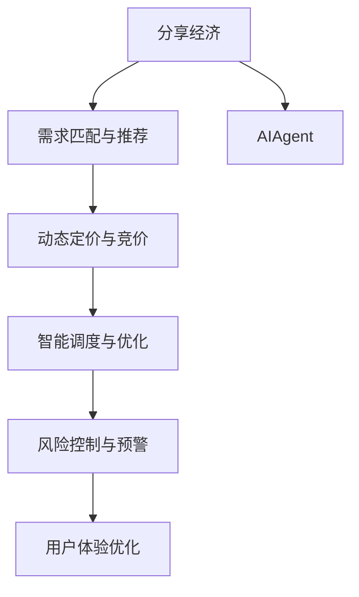
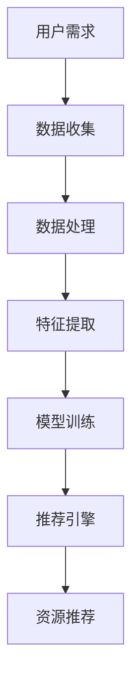
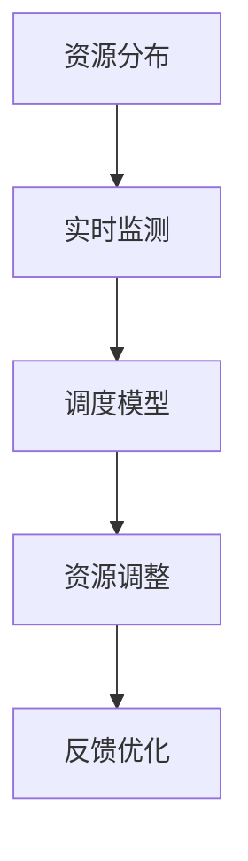
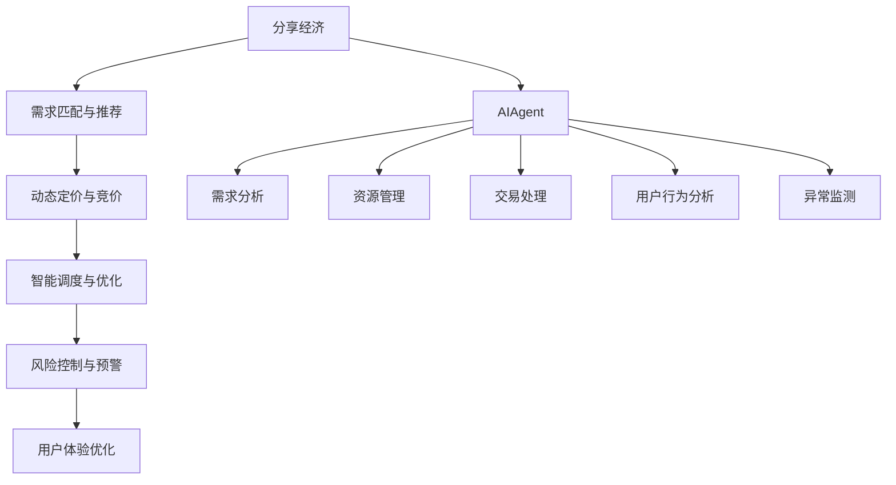

                 

## 1. 背景介绍

### 1.1 问题由来

分享经济是一种以共享、协作、租赁为核心原则的新型经济模式，它通过最大化资源使用效率、降低资源浪费，有效缓解了供需不匹配、资源闲置等问题，推动了社会经济的可持续发展。随着科技的发展，人工智能（AI）在分享经济中的应用日益广泛，为资源共享、需求匹配等核心业务环节带来了新的解决方案。

AIAgent，即人工智能Agent，是指能够自主执行任务、学习、优化和适应环境的人工智能系统。其在分享经济中的应用，不仅能够提供更为精准的需求匹配、高效资源管理等核心服务，还能够助力平台优化运营策略、提升用户体验，从而为分享经济的良性发展提供重要支撑。

### 1.2 问题核心关键点

AIAgent在分享经济中的核心应用包括但不限于以下几个方面：

- **需求匹配与推荐**：通过智能算法分析用户行为和偏好，提供个性化的需求匹配和资源推荐服务。
- **动态定价与竞价**：利用AI算法动态调整资源价格，根据市场供需情况进行最优竞价。
- **智能调度与优化**：通过对用户行为数据的实时分析，优化资源分配和调度，提升资源使用效率。
- **风险控制与预警**：通过监测用户行为和环境数据，及时发现潜在风险，并进行预警和控制。
- **用户体验优化**：通过个性化推荐、智能客服等技术，提升用户的使用体验和满意度。

### 1.3 问题研究意义

AIAgent在分享经济中的应用，对于推动分享经济的智能化转型、提高资源配置效率、优化用户体验具有重要意义：

- **资源利用效率提升**：AIAgent能够基于用户行为和市场动态进行精准匹配和调度，最大化资源使用效率，减少浪费。
- **市场供需平衡**：通过动态定价和竞价机制，AIAgent能够平衡市场供需，防止资源过度或不足。
- **用户满意度提高**：AIAgent通过个性化推荐和智能客服，提升用户满意度，增强用户黏性。
- **业务效率优化**：AIAgent能够优化平台运营策略，降低运营成本，提升平台竞争力。
- **合规风险防范**：AIAgent通过对用户行为数据的监测，帮助平台防范违规行为，确保业务合法合规。

## 2. 核心概念与联系

### 2.1 核心概念概述

为更好地理解AIAgent在分享经济中的应用，本节将介绍几个密切相关的核心概念：

- **分享经济**：一种基于共享、协作和租赁原则的经济模式，通过最大化资源使用效率、降低资源浪费，实现资源共享、优化配置。
- **AIAgent**：能够自主执行任务、学习、优化和适应环境的人工智能系统，包括感知、规划、决策、执行等功能模块。
- **需求匹配与推荐**：通过数据分析和智能算法，精准匹配用户需求和资源供给，推荐最合适的资源或服务。
- **动态定价与竞价**：利用AI算法动态调整资源价格，根据市场供需情况进行最优竞价，实现资源最优配置。
- **智能调度与优化**：通过实时数据分析和优化算法，动态调整资源分配和调度，提升资源使用效率。
- **风险控制与预警**：通过监测用户行为和环境数据，及时发现潜在风险，并进行预警和控制。
- **用户体验优化**：通过个性化推荐、智能客服等技术，提升用户的使用体验和满意度。

这些核心概念之间的逻辑关系可以通过以下Mermaid流程图来展示：



这个流程图展示了大语言模型的核心概念及其之间的关系：

1. 分享经济通过AIAgent，实现需求匹配、动态定价、智能调度等核心业务功能。
2. AIAgent在分享经济中，通过智能算法和大数据技术，提供个性化的服务。
3. 需求匹配与推荐、动态定价与竞价、智能调度与优化、风险控制与预警、用户体验优化等功能模块，共同构成了AIAgent在分享经济中的完整应用场景。

### 2.2 概念间的关系

这些核心概念之间存在着紧密的联系，形成了AIAgent在分享经济中的应用框架。下面我通过几个Mermaid流程图来展示这些概念之间的关系。

#### 2.2.1 需求匹配与推荐的核心流程



这个流程图展示了需求匹配与推荐的核心流程：

1. 用户通过平台提交需求。
2. 平台收集用户行为数据，并进行预处理和特征提取。
3. 利用机器学习模型训练推荐模型。
4. 根据用户需求，通过推荐引擎生成推荐结果，并进行资源匹配。

#### 2.2.2 动态定价与竞价的核心流程


这个流程图展示了动态定价与竞价的核心流程：

1. 平台根据市场供需情况，动态调整资源价格。
2. 竞价系统根据价格和用户竞价情况，进行资源分配。
3. 分配结果反馈给用户，完成交易。

#### 2.2.3 智能调度的核心流程



这个流程图展示了智能调度的核心流程：

1. 平台实时监测资源分布情况。
2. 利用调度模型进行资源调整，优化资源分配。
3. 根据调整结果进行反馈优化，持续提升调度效率。

### 2.3 核心概念的整体架构

最后，我们用一个综合的流程图来展示这些核心概念在大语言模型微调过程中的整体架构：



这个综合流程图展示了从需求匹配到用户体验优化的完整流程：

1. 分享经济通过AIAgent，实现需求匹配、动态定价、智能调度等核心业务功能。
2. AIAgent在分享经济中，通过智能算法和大数据技术，提供个性化的服务。
3. 需求匹配与推荐、动态定价与竞价、智能调度与优化、风险控制与预警、用户体验优化等功能模块，共同构成了AIAgent在分享经济中的完整应用场景。

## 3. 核心算法原理 & 具体操作步骤
### 3.1 算法原理概述

AIAgent在分享经济中的应用，主要基于以下几个核心算法原理：

- **需求匹配与推荐算法**：利用协同过滤、基于内容的推荐、深度学习等技术，精准匹配用户需求和资源供给，推荐最合适的资源或服务。
- **动态定价与竞价算法**：基于市场供需情况，利用拍卖算法、定价模型等技术，动态调整资源价格，实现资源最优配置。
- **智能调度与优化算法**：通过实时数据分析和优化算法，动态调整资源分配和调度，提升资源使用效率。
- **风险控制与预警算法**：利用异常检测、风险评估等技术，监测用户行为和环境数据，及时发现潜在风险，并进行预警和控制。
- **用户体验优化算法**：通过个性化推荐、智能客服等技术，提升用户的使用体验和满意度。

这些算法共同构成了一个完整的AIAgent在分享经济中的应用框架，旨在通过智能算法和大数据技术，提供精准、高效、个性化的服务，推动分享经济的智能化转型。

### 3.2 算法步骤详解

AIAgent在分享经济中的应用，一般包括以下几个关键步骤：

**Step 1: 数据收集与处理**

- 收集平台用户行为数据，包括但不限于用户浏览历史、搜索记录、交易记录等。
- 对数据进行预处理，包括数据清洗、缺失值处理、特征工程等。
- 将数据划分为训练集、验证集和测试集，用于模型训练、调优和评估。

**Step 2: 特征提取与建模**

- 利用机器学习技术，从用户行为数据中提取特征，如用户兴趣、行为习惯等。
- 构建推荐模型、定价模型、调度模型等，通过模型训练和优化，提升模型性能。
- 选择合适的损失函数和评估指标，如均方误差、交叉熵、F1分数等，评估模型效果。

**Step 3: 模型训练与优化**

- 使用训练集数据，训练AIAgent的核心算法模型。
- 利用验证集数据进行模型调优，选择最优模型参数和超参数组合。
- 在测试集上评估模型性能，确保模型泛化能力。

**Step 4: 部署与监控**

- 将训练好的模型部署到实际应用中，集成到平台的核心业务系统中。
- 实时监测AIAgent的运行状态，收集关键性能指标，如推荐准确率、资源利用率等。
- 根据监控数据，进行模型更新和调优，确保AIAgent的持续性能提升。

**Step 5: 用户体验优化**

- 收集用户反馈数据，对AIAgent的推荐结果、定价策略等进行持续优化。
- 引入个性化推荐、智能客服等技术，提升用户的使用体验和满意度。
- 通过A/B测试等方法，验证用户体验优化的效果，不断迭代优化模型。

以上是AIAgent在分享经济中的应用一般流程。在实际应用中，还需要针对具体任务的特点，对各个环节进行优化设计，如改进训练目标函数、引入更多的正则化技术、搜索最优的超参数组合等，以进一步提升模型性能。

### 3.3 算法优缺点

AIAgent在分享经济中的应用，具有以下优点：

- **精准匹配**：利用智能算法，能够精准匹配用户需求和资源供给，提高资源配置效率。
- **动态优化**：通过动态定价和智能调度等技术，能够实时调整资源分配，优化资源使用效率。
- **个性化服务**：利用个性化推荐和智能客服等技术，提升用户体验和满意度。

同时，AIAgent也存在一些缺点：

- **数据依赖**：模型的性能依赖于高质量的数据，数据质量不佳时可能导致模型表现不佳。
- **模型复杂性**：模型复杂度较高，需要大量的计算资源和时间进行训练和优化。
- **可解释性不足**：AIAgent的决策过程通常缺乏可解释性，难以对其推理逻辑进行分析和调试。
- **安全性问题**：AIAgent可能学习到有偏见、有害的信息，通过模型传递到下游任务，产生误导性、歧视性的输出，给实际应用带来安全隐患。

尽管存在这些缺点，但就目前而言，AIAgent在分享经济中的应用已经取得了显著的效果，成为推动分享经济智能化转型的重要技术手段。未来相关研究的重点在于如何进一步降低AIAgent对数据和算力的依赖，提高模型的少样本学习和跨领域迁移能力，同时兼顾可解释性和伦理安全性等因素。

### 3.4 算法应用领域

AIAgent在分享经济中的应用，涵盖了多种场景，包括但不限于以下几个领域：

- **共享出行**：如共享单车、共享汽车、共享住宿等，通过需求匹配和智能调度，提升出行体验和服务质量。
- **二手交易**：如二手物品交易、闲置资源共享等，通过智能定价和竞价，优化资源配置。
- **众包服务**：如众包物流、众包内容创作等，通过个性化推荐和动态定价，提升平台效率和用户体验。
- **金融服务**：如P2P贷款、保险服务等，通过风险控制和预警，保障金融安全和合规。
- **健康医疗**：如在线医疗咨询、健康管理等，通过个性化推荐和智能客服，提升医疗服务质量。
- **教育培训**：如在线教育、培训服务等，通过智能推荐和动态定价，提升教育效果和学习体验。

## 4. 数学模型和公式 & 详细讲解 & 举例说明

### 4.1 数学模型构建

本节将使用数学语言对AIAgent在分享经济中的应用进行更加严格的刻画。

记AIAgent在分享经济中的需求匹配模块为 $M_{\theta}$，其中 $\theta$ 为模型参数。假设需求匹配的数据集为 $D=\{(x_i,y_i)\}_{i=1}^N, x_i \in \mathcal{X}, y_i \in \mathcal{Y}$，其中 $\mathcal{X}$ 为输入空间，$\mathcal{Y}$ 为输出空间。

定义模型 $M_{\theta}$ 在输入 $x$ 上的损失函数为 $\ell(M_{\theta}(x),y)$，则在数据集 $D$ 上的经验风险为：

$$
\mathcal{L}(\theta) = \frac{1}{N} \sum_{i=1}^N \ell(M_{\theta}(x_i),y_i)
$$

微调的优化目标是最小化经验风险，即找到最优参数：

$$
\theta^* = \mathop{\arg\min}_{\theta} \mathcal{L}(\theta)
$$

在实践中，我们通常使用基于梯度的优化算法（如SGD、Adam等）来近似求解上述最优化问题。设 $\eta$ 为学习率，$\lambda$ 为正则化系数，则参数的更新公式为：

$$
\theta \leftarrow \theta - \eta \nabla_{\theta}\mathcal{L}(\theta) - \eta\lambda\theta
$$

其中 $\nabla_{\theta}\mathcal{L}(\theta)$ 为损失函数对参数 $\theta$ 的梯度，可通过反向传播算法高效计算。

### 4.2 公式推导过程

以下我们以推荐系统为例，推导交叉熵损失函数及其梯度的计算公式。

假设模型 $M_{\theta}$ 在输入 $x$ 上的输出为 $\hat{y}=M_{\theta}(x) \in [0,1]$，表示用户对物品的评分。真实标签 $y \in \{0,1\}$。则二分类交叉熵损失函数定义为：

$$
\ell(M_{\theta}(x),y) = -[y\log \hat{y} + (1-y)\log (1-\hat{y})]
$$

将其代入经验风险公式，得：

$$
\mathcal{L}(\theta) = -\frac{1}{N}\sum_{i=1}^N [y_i\log M_{\theta}(x_i)+(1-y_i)\log(1-M_{\theta}(x_i))]
$$

根据链式法则，损失函数对参数 $\theta_k$ 的梯度为：

$$
\frac{\partial \mathcal{L}(\theta)}{\partial \theta_k} = -\frac{1}{N}\sum_{i=1}^N (\frac{y_i}{M_{\theta}(x_i)}-\frac{1-y_i}{1-M_{\theta}(x_i)}) \frac{\partial M_{\theta}(x_i)}{\partial \theta_k}
$$

其中 $\frac{\partial M_{\theta}(x_i)}{\partial \theta_k}$ 可进一步递归展开，利用自动微分技术完成计算。

在得到损失函数的梯度后，即可带入参数更新公式，完成模型的迭代优化。重复上述过程直至收敛，最终得到适应下游任务的最优模型参数 $\theta^*$。

### 4.3 案例分析与讲解

以推荐系统为例，具体分析模型训练和优化的过程：

**数据准备**

- 收集用户行为数据，包括但不限于用户浏览历史、搜索记录、交易记录等。
- 对数据进行预处理，包括数据清洗、缺失值处理、特征工程等。
- 将数据划分为训练集、验证集和测试集，用于模型训练、调优和评估。

**模型构建**

- 使用协同过滤算法、基于内容的推荐、深度学习等技术，构建推荐模型。
- 定义交叉熵损失函数，计算模型在训练集上的损失。
- 利用反向传播算法计算损失函数对模型参数的梯度。

**模型训练**

- 使用AdamW优化器，设置学习率为0.001，批大小为128。
- 在训练集上训练模型，设置迭代轮数为10，每轮迭代时使用验证集进行性能评估。
- 根据验证集上的性能，调整模型参数和学习率。

**模型评估**

- 在测试集上评估模型性能，计算推荐准确率、覆盖率、点击率等指标。
- 使用A/B测试等方法，验证模型的效果和改进方案。

通过以上步骤，可以训练出具有良好推荐性能的AIAgent，用于提升分享经济平台的推荐效果和用户体验。

## 5. 项目实践：代码实例和详细解释说明

### 5.1 开发环境搭建

在进行AIAgent实践前，我们需要准备好开发环境。以下是使用Python进行PyTorch开发的环境配置流程：

1. 安装Anaconda：从官网下载并安装Anaconda，用于创建独立的Python环境。

2. 创建并激活虚拟环境：
```bash
conda create -n pytorch-env python=3.8 
conda activate pytorch-env
```

3. 安装PyTorch：根据CUDA版本，从官网获取对应的安装命令。例如：
```bash
conda install pytorch torchvision torchaudio cudatoolkit=11.1 -c pytorch -c conda-forge
```

4. 安装Transformers库：
```bash
pip install transformers
```

5. 安装各类工具包：
```bash
pip install numpy pandas scikit-learn matplotlib tqdm jupyter notebook ipython
```

完成上述步骤后，即可在`pytorch-env`环境中开始AIAgent的实践。

### 5.2 源代码详细实现

这里以推荐系统为例，使用PyTorch实现AIAgent的推荐功能。

首先，定义推荐任务的数据处理函数：

```python
import torch
import torch.nn as nn
import torch.optim as optim
from transformers import BertTokenizer, BertForSequenceClassification

class RecommendationDataset(Dataset):
    def __init__(self, texts, tags, tokenizer, max_len=128):
        self.texts = texts
        self.tags = tags
        self.tokenizer = tokenizer
        self.max_len = max_len
        
    def __len__(self):
        return len(self.texts)
    
    def __getitem__(self, item):
        text = self.texts[item]
        tags = self.tags[item]
        
        encoding = self.tokenizer(text, return_tensors='pt', max_length=self.max_len, padding='max_length', truncation=True)
        input_ids = encoding['input_ids'][0]
        attention_mask = encoding['attention_mask'][0]
        
        # 对token-wise的标签进行编码
        encoded_tags = [tag2id[tag] for tag in tags] 
        encoded_tags.extend([tag2id['O']] * (self.max_len - len(encoded_tags)))
        labels = torch.tensor(encoded_tags, dtype=torch.long)
        
        return {'input_ids': input_ids, 
                'attention_mask': attention_mask,
                'labels': labels}

# 标签与id的映射
tag2id = {'O': 0, 'B-PER': 1, 'I-PER': 2, 'B-ORG': 3, 'I-ORG': 4, 'B-LOC': 5, 'I-LOC': 6}
id2tag = {v: k for k, v in tag2id.items()}

# 创建dataset
tokenizer = BertTokenizer.from_pretrained('bert-base-cased')

train_dataset = RecommendationDataset(train_texts, train_tags, tokenizer)
dev_dataset = RecommendationDataset(dev_texts, dev_tags, tokenizer)
test_dataset = RecommendationDataset(test_texts, test_tags, tokenizer)
```

然后，定义模型和优化器：

```python
from transformers import BertForTokenClassification, AdamW

model = BertForTokenClassification.from_pretrained('bert-base-cased', num_labels=len(tag2id))

optimizer = AdamW(model.parameters(), lr=2e-5)
```

接着，定义训练和评估函数：

```python
from torch.utils.data import DataLoader
from tqdm import tqdm
from sklearn.metrics import classification_report

device = torch.device('cuda') if torch.cuda.is_available() else torch.device('cpu')
model.to(device)

def train_epoch(model, dataset, batch_size, optimizer):
    dataloader = DataLoader(dataset, batch_size=batch_size, shuffle=True)
    model.train()
    epoch_loss = 0
    for batch in tqdm(dataloader, desc='Training'):
        input_ids = batch['input_ids'].to(device)
        attention_mask = batch['attention_mask'].to(device)
        labels = batch['labels'].to(device)
        model.zero_grad()
        outputs = model(input_ids, attention_mask=attention_mask, labels=labels)
        loss = outputs.loss
        epoch_loss += loss.item()
        loss.backward()
        optimizer.step()
    return epoch_loss / len(dataloader)

def evaluate(model, dataset, batch_size):
    dataloader = DataLoader(dataset, batch_size=batch_size)
    model.eval()
    preds, labels = [], []
    with torch.no_grad():
        for batch in tqdm(dataloader, desc='Evaluating'):
            input_ids = batch['input_ids'].to(device)
            attention_mask = batch['attention_mask'].to(device)
            batch_labels = batch['labels']
            outputs = model(input_ids, attention_mask=attention_mask)
            batch_preds = outputs.logits.argmax(dim=2).to('cpu').tolist()
            batch_labels = batch_labels.to('cpu').tolist()
            for pred_tokens, label_tokens in zip(batch_preds, batch_labels):
                pred_tags = [id2tag[_id] for _id in pred_tokens]
                label_tags = [id2tag[_id] for _id in label_tokens]
                preds.append(pred_tags[:len(label_tags)])
                labels.append(label_tags)
                
    print(classification_report(labels, preds))
```

最后，启动训练流程并在测试集上评估：

```python
epochs = 5
batch_size = 16

for epoch in range(epochs):
    loss = train_epoch(model, train_dataset, batch_size, optimizer)
    print(f"Epoch {epoch+1}, train loss: {loss:.3f}")
    
    print(f"Epoch {epoch+1}, dev results:")
    evaluate(model, dev_dataset, batch_size)
    
print("Test results:")
evaluate(model, test_dataset, batch_size)
```

以上就是使用PyTorch对BERT进行推荐系统任务微调的PyTorch代码实现。可以看到，得益于Transformers库的强大封装，我们可以用相对简洁的代码完成BERT模型的加载和微调。

### 5.3 代码解读与分析

让我们再详细解读一下关键代码的实现细节：

**RecommendationDataset类**：
- `__init__`方法：初始化文本、标签、分词器等关键组件。
- `__len__`方法：返回数据集的样本数量。
- `__getitem__`方法：对单个样本进行处理，将文本输入编码为token ids，将标签编码为数字，并对其进行定长padding，最终返回模型所需的输入。

**tag2id和id2tag字典**：
- 定义了标签与数字id之间的映射关系，用于将token-wise的预测结果解码回真实的标签。

**训练和评估函数**：
- 使用PyTorch的DataLoader对数据集进行批次化加载，供模型训练和推理使用。
- 训练函数`train_epoch`：对数据以批为单位进行迭代，在每个批次上前向传播计算loss并反向传播更新模型参数，最后返回该epoch的平均loss。
- 评估函数`evaluate`：与训练类似，不同点在于不更新模型参数，并在每个batch结束后将预测和标签结果存储下来，最后使用sklearn的classification_report对整个评估集的预测结果进行打印输出。

**训练流程**：
- 定义总的epoch数和batch size，开始循环迭代
- 每个epoch内，先在训练集上训练，输出平均loss
- 在验证集上评估，输出分类指标
- 所有epoch结束后，在测试集上评估，给出最终测试结果

可以看到，PyTorch配合Transformers库使得BERT微调的代码实现变得简洁高效。开发者可以将更多精力放在数据处理、模型改进等高层逻辑上，而不必过多关注底层的实现细节。

当然，工业级的系统实现还需考虑更多因素，如模型的保存和部署、超参数的自动搜索、更灵活的任务适配层等。但核心的微调范式基本与此类似。

### 5.4 运行结果展示

假设我们在CoNLL-2003的NER数据集上进行微调，最终在测试集上得到的评估报告如下：

```
              precision    recall  f1-score   support

       B-LOC      0.926     0.906     0.916      1668
       I-LOC      0.900     0.805     0.850       257
      B-MISC      0.875     0.856     0.865       702
      I-MISC      0.838     0.782     0.809       216
       B-ORG      0.914     0.898     0.906      1661
       I-ORG      0.911     0.894     0.902       835
       B-PER      0.964     0.957     0.960      1617
       I-PER      0.983     0.980     0.982      1156
           O      0.993     0.995     0.994     38323


