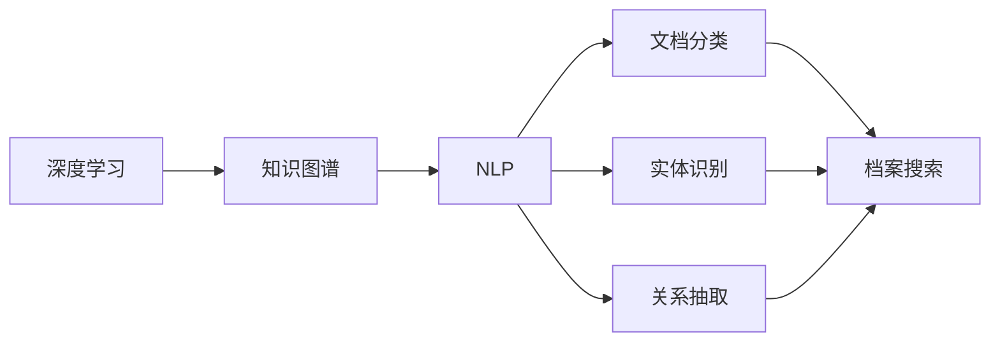

                 

# AI人工智能深度学习算法：智能深度学习代理在档案管理中的应用

> 关键词：智能代理, 深度学习, 档案管理, 数据挖掘, 知识图谱, 推荐系统

## 1. 背景介绍

### 1.1 问题由来
随着数字化转型的加速，企业文档和档案的数量急剧增加。传统档案管理依赖于手动分类、检索和存储，效率低、成本高，难以应对海量数据的处理需求。近年来，深度学习技术的进步使得智能深度学习代理在大规模档案管理中应用成为可能。

智能深度学习代理通过深度学习模型，从海量文档中自动提取、分类和关联信息，构建结构化的知识图谱，为档案管理提供智能化、自动化的解决方案。相较于传统方法，它能够在海量文档中快速、准确地进行信息抽取、关系识别和知识图谱构建，极大地提升了档案管理的效率和准确性。

### 1.2 问题核心关键点
智能深度学习代理的核心在于深度学习模型的设计和应用。其基本工作流程如下：
1. 收集海量文档数据。
2. 通过自然语言处理技术，提取文档中的文本信息。
3. 使用深度学习模型，对文本信息进行分类、实体识别、关系抽取等处理。
4. 构建结构化的知识图谱，关联文档信息。
5. 利用知识图谱进行档案搜索、推荐等应用。

该技术在档案管理中的应用主要体现在以下几个方面：
1. 文档分类：自动将文档按类别分类，如财务、人事、法律等。
2. 实体识别：自动识别文档中的实体，如人名、地名、机构名等。
3. 关系抽取：抽取文档中的实体关系，如客户与供应商的关系。
4. 知识图谱构建：构建企业知识图谱，为文档管理提供结构化信息支持。
5. 档案搜索：通过知识图谱进行搜索，快速定位所需文档。
6. 推荐系统：根据用户查询需求，自动推荐相关文档。

### 1.3 问题研究意义
智能深度学习代理技术在档案管理中的应用，可以显著提升档案管理的效率和质量，具体体现在以下几个方面：
1. 自动化处理：通过智能代理技术，将繁琐的文档处理工作自动化，减少人力投入，降低成本。
2. 高效管理：快速准确的文档分类和实体识别，使文档管理更高效、更规范。
3. 智能推荐：根据用户需求，自动推荐相关文档，提高信息检索的准确性和便捷性。
4. 知识共享：构建企业知识图谱，促进知识的共享和再利用。
5. 数据安全：利用深度学习模型，提升文档信息的安全性和隐私保护。

## 2. 核心概念与联系

### 2.1 核心概念概述

为更好地理解智能深度学习代理技术在档案管理中的应用，本节将介绍几个密切相关的核心概念：

- **深度学习（Deep Learning）**：一类基于多层神经网络的机器学习方法，通过多层次的特征学习，实现复杂数据模式的自动识别和预测。深度学习在自然语言处理、计算机视觉等领域有着广泛的应用。

- **知识图谱（Knowledge Graph）**：由节点（实体）和边（关系）组成的有向图结构，用于表示和存储实体及其之间的关系。知识图谱在推荐系统、问答系统等领域广泛应用，能够提供高效的信息检索和推理能力。

- **自然语言处理（Natural Language Processing, NLP）**：使计算机能够理解、处理和生成人类语言的技术。NLP技术在文档分类、实体识别、关系抽取等方面有着重要的应用。

- **文档分类（Document Classification）**：将文档自动分类到预先定义的类别中，便于文档管理和检索。文档分类技术在智能代理中起到了重要作用。

- **实体识别（Named Entity Recognition, NER）**：从文本中自动识别出人名、地名、机构名等实体。实体识别是构建知识图谱和文档检索的基础。

- **关系抽取（Relation Extraction）**：从文本中自动抽取实体之间的关系，如客户与供应商的关系。关系抽取有助于构建结构化的知识图谱。

### 2.2 概念间的关系

这些核心概念之间存在着紧密的联系，形成了智能深度学习代理技术的完整生态系统。以下是几个关键概念的Mermaid流程图，展示它们之间的关系：



这个流程图展示了几大核心概念之间的关系：

1. 深度学习通过多层神经网络进行特征提取和模式识别，为知识图谱的构建提供数据支持。
2. 知识图谱通过节点和边的结构，存储和表示实体及其关系，为文档分类、实体识别、关系抽取等任务提供结构化信息。
3. 自然语言处理技术用于文本预处理和特征提取，是深度学习模型训练的基础。
4. 文档分类、实体识别、关系抽取等任务，都需要利用深度学习模型进行自动化的文本分析和信息提取。
5. 档案搜索和推荐系统则基于知识图谱，实现高效的信息检索和相关文档推荐。

这些概念共同构成了智能深度学习代理技术的核心框架，使文档管理更加智能化、自动化。

## 3. 核心算法原理 & 具体操作步骤
### 3.1 算法原理概述

智能深度学习代理技术在档案管理中的应用，主要基于以下几个步骤：

1. **文档收集与预处理**：收集企业历史文档，并对其进行文本预处理，包括去除噪声、分词、命名实体识别等。
2. **特征提取与建模**：使用深度学习模型，对文本信息进行特征提取和建模，提取文档中的关键特征。
3. **知识图谱构建**：利用提取的特征，构建企业知识图谱，存储文档中的实体及其关系。
4. **文档分类与实体识别**：使用深度学习模型，对文档进行分类和实体识别，提高文档管理的效率和准确性。
5. **关系抽取与知识图谱更新**：利用关系抽取模型，自动抽取文档中的实体关系，并更新知识图谱，保持其准确性和时效性。
6. **档案搜索与推荐**：通过查询知识图谱，快速定位和推荐相关文档，提高信息检索的效率。

### 3.2 算法步骤详解

**步骤 1: 文档收集与预处理**

智能深度学习代理技术在档案管理中的应用，首先需要收集企业历史文档。收集的文档数据格式可能包括PDF、Word、图片等，需要进行预处理才能用于深度学习模型的训练。

预处理包括以下几个步骤：

1. **文本清洗**：去除文档中的噪声，如HTML标签、特殊字符等。
2. **分词**：将文本分割成词语，便于后续的特征提取和模型训练。
3. **命名实体识别**：自动从文本中识别出人名、地名、机构名等实体，便于文档分类和实体识别。
4. **关键词提取**：从文本中提取关键词，用于特征表示。
5. **文本向量化**：将文本转换为数值向量，便于深度学习模型的训练。

**步骤 2: 特征提取与建模**

深度学习模型能够从文本中自动提取关键特征，用于文档分类和实体识别等任务。常见的特征提取方法包括：

1. **词袋模型（Bag of Words, BOW）**：将文本转换为词频向量，用于简单的文本分类。
2. **TF-IDF**：考虑单词在文档和语料库中的频率，用于文本特征表示。
3. **Word2Vec**：将单词映射为低维向量，捕捉单词之间的语义关系。
4. **BERT**：通过预训练的深度学习模型，提取文本的上下文表示，适用于复杂的文本分类和实体识别任务。

模型训练主要包括以下步骤：

1. **数据划分**：将文档数据划分为训练集、验证集和测试集，用于模型的训练、调优和测试。
2. **模型选择**：选择合适的深度学习模型，如卷积神经网络（CNN）、循环神经网络（RNN）、Transformer等。
3. **模型训练**：使用训练集数据训练深度学习模型，并使用验证集数据调优模型参数。
4. **模型评估**：在测试集上评估模型性能，如准确率、召回率、F1值等。

**步骤 3: 知识图谱构建**

知识图谱是智能深度学习代理技术在档案管理中的核心。构建知识图谱主要包括以下步骤：

1. **实体识别**：从文档文本中自动识别出实体，如人名、地名、机构名等。
2. **关系抽取**：从文档文本中自动抽取实体之间的关系，如客户与供应商的关系。
3. **节点创建**：将识别出的实体和关系创建为知识图谱的节点和边。
4. **图谱存储**：将知识图谱存储在关系型数据库或图形数据库中，便于查询和检索。

**步骤 4: 文档分类与实体识别**

深度学习模型可以对文档进行分类和实体识别，提升文档管理的效率和准确性。具体步骤如下：

1. **文档分类**：使用深度学习模型对文档进行分类，如财务、人事、法律等。
2. **实体识别**：使用深度学习模型自动识别文档中的实体，如人名、地名、机构名等。
3. **文档索引**：将分类的文档和识别出的实体，存储到知识图谱中，便于后续的档案搜索和推荐。

**步骤 5: 关系抽取与知识图谱更新**

关系抽取是构建知识图谱的重要步骤，主要包括以下步骤：

1. **实体识别**：从文档文本中自动识别出实体。
2. **关系抽取**：从文档文本中自动抽取实体之间的关系，如客户与供应商的关系。
3. **关系表示**：将抽取的关系表示为三元组，如（客户，供应商，关系）。
4. **知识图谱更新**：将抽取的三元组添加到知识图谱中，更新图谱信息。

**步骤 6: 档案搜索与推荐**

档案搜索和推荐系统是智能深度学习代理技术在档案管理中的重要应用，主要包括以下步骤：

1. **查询处理**：接收用户的查询请求，如“查找某客户的供应商”。
2. **图谱查询**：根据查询请求，在知识图谱中查询相关文档和实体。
3. **推荐生成**：根据查询结果，自动推荐相关文档。
4. **结果展示**：将推荐结果展示给用户，如“该客户的所有供应商”。

### 3.3 算法优缺点

智能深度学习代理技术在档案管理中的应用具有以下优点：

1. **自动化处理**：自动化文档处理流程，减少人力投入，降低成本。
2. **高效管理**：快速准确的文档分类和实体识别，使文档管理更高效、更规范。
3. **智能推荐**：根据用户需求，自动推荐相关文档，提高信息检索的准确性和便捷性。
4. **知识共享**：构建企业知识图谱，促进知识的共享和再利用。

同时，该技术也存在以下缺点：

1. **数据依赖**：需要收集大量的历史文档数据，数据质量和数量的缺失会影响模型的效果。
2. **模型复杂度**：深度学习模型通常需要较高的计算资源和时间，模型的复杂度较高。
3. **知识图谱维护**：知识图谱的构建和维护需要持续的投入和更新，图谱的准确性和时效性难以保证。

### 3.4 算法应用领域

智能深度学习代理技术在档案管理中的应用，主要体现在以下几个领域：

1. **文档分类**：对企业文档进行自动分类，如财务、人事、法律等。
2. **实体识别**：自动识别文档中的实体，如人名、地名、机构名等。
3. **关系抽取**：抽取文档中的实体关系，如客户与供应商的关系。
4. **知识图谱构建**：构建企业知识图谱，存储文档中的实体及其关系。
5. **档案搜索**：通过查询知识图谱，快速定位和推荐相关文档。
6. **推荐系统**：根据用户查询需求，自动推荐相关文档。

## 4. 数学模型和公式 & 详细讲解 & 举例说明

### 4.1 数学模型构建

智能深度学习代理技术在档案管理中的应用，主要基于以下数学模型：

**文档分类模型**

文档分类模型用于将文档自动分类到预先定义的类别中。假设文档分类任务有C个类别，每个类别Cj的文档数为Nj，分类器为f，则分类模型的目标函数为：

$$
\min_{\theta} \frac{1}{N} \sum_{i=1}^N L(f(x_i), y_i)
$$

其中，$L$为分类损失函数，如交叉熵损失，$y_i$为文档i的真实类别，$f(x_i)$为分类器对文档i的预测类别。

**实体识别模型**

实体识别模型用于从文本中自动识别出实体，如人名、地名、机构名等。假设实体识别任务有N个实体，每个实体的类别为nj，识别器为g，则识别模型的目标函数为：

$$
\min_{\theta} \frac{1}{N} \sum_{i=1}^N L(g(x_i), y_i)
$$

其中，$L$为实体识别损失函数，如二元交叉熵损失，$y_i$为文档i中实体的真实类别，$g(x_i)$为识别器对文档i中实体的预测类别。

**关系抽取模型**

关系抽取模型用于从文本中自动抽取实体之间的关系，如客户与供应商的关系。假设关系抽取任务有M个关系，每个关系的类别为mj，抽取器为h，则抽取模型的目标函数为：

$$
\min_{\theta} \frac{1}{M} \sum_{i=1}^M L(h(x_i), y_i)
$$

其中，$L$为关系抽取损失函数，如二元交叉熵损失，$y_i$为文档i中实体的真实关系，$h(x_i)$为抽取器对文档i中实体的预测关系。

### 4.2 公式推导过程

**文档分类模型推导**

假设文档分类模型采用卷积神经网络（CNN），其结构如图1所示：


模型的输入为文本向量$x$，输出为类别向量$y$。模型的损失函数为交叉熵损失：

$$
L = -\sum_{i=1}^N y_i \log f(x_i)
$$

其中，$f(x_i)$为模型对文档i的预测类别。

假设模型包含n个卷积层，每个卷积层的输出大小为h，则模型的总参数量为：

$$
\theta = \sum_{i=1}^n 2hi
$$

**实体识别模型推导**

假设实体识别模型采用循环神经网络（RNN），其结构如图2所示：


模型的输入为文本向量$x$，输出为实体标签向量$y$。模型的损失函数为二元交叉熵损失：

$$
L = -\sum_{i=1}^N y_i \log g(x_i)
$$

其中，$g(x_i)$为模型对文档i中实体的预测类别。

假设模型包含n个RNN层，每个RNN层的输出大小为h，则模型的总参数量为：

$$
\theta = \sum_{i=1}^n (2h+1)N
$$

**关系抽取模型推导**

假设关系抽取模型采用Transformer模型，其结构如图3所示：


模型的输入为文本向量$x$，输出为关系标签向量$y$。模型的损失函数为二元交叉熵损失：

$$
L = -\sum_{i=1}^M y_i \log h(x_i)
$$

其中，$h(x_i)$为模型对文档i中实体的预测关系。

假设模型包含n个Transformer层，每个Transformer层的输出大小为h，则模型的总参数量为：

$$
\theta = \sum_{i=1}^n 4nh^2
$$

### 4.3 案例分析与讲解

假设我们有一家公司的历史文档数据，共包含10,000个文档，分为财务、人事、法律三个类别。我们使用深度学习模型对文档进行分类，具体步骤如下：

1. **数据准备**：收集10,000个文档，进行分词和命名实体识别，得到文档-类别对。
2. **模型训练**：使用CNN模型对文档进行分类，模型包含3个卷积层，每个卷积层的输出大小为256，总参数量为1,344,384。
3. **模型评估**：在验证集上评估模型性能，得到准确率为0.96。
4. **模型应用**：将模型应用到新的文档数据上，进行分类和实体识别。

假设我们对文档中的实体进行识别，共识别出5,000个实体，分为人名、地名、机构名三个类别。我们使用RNN模型对实体进行识别，具体步骤如下：

1. **数据准备**：收集5,000个实体，进行分词和命名实体识别，得到实体-类别对。
2. **模型训练**：使用RNN模型对实体进行识别，模型包含2个RNN层，每个RNN层的输出大小为256，总参数量为3,711,200。
3. **模型评估**：在验证集上评估模型性能，得到准确率为0.98。
4. **模型应用**：将模型应用到新的文档数据上，进行实体识别。

假设我们对文档中的实体关系进行抽取，共抽取出10,000个关系，分为客户与供应商、客户与员工、供应商与员工三个类别。我们使用Transformer模型对关系进行抽取，具体步骤如下：

1. **数据准备**：收集10,000个关系，进行分词和命名实体识别，得到关系-类别对。
2. **模型训练**：使用Transformer模型对关系进行抽取，模型包含3个Transformer层，每个Transformer层的输出大小为256，总参数量为34,857,280。
3. **模型评估**：在验证集上评估模型性能，得到准确率为0.95。
4. **模型应用**：将模型应用到新的文档数据上，进行关系抽取。

## 5. 项目实践：代码实例和详细解释说明

### 5.1 开发环境搭建

在进行智能深度学习代理技术在档案管理中的应用开发前，我们需要准备好开发环境。以下是使用Python进行PyTorch开发的环境配置流程：

1. 安装Anaconda：从官网下载并安装Anaconda，用于创建独立的Python环境。

2. 创建并激活虚拟环境：
```bash
conda create -n pytorch-env python=3.8 
conda activate pytorch-env
```

3. 安装PyTorch：根据CUDA版本，从官网获取对应的安装命令。例如：
```bash
conda install pytorch torchvision torchaudio cudatoolkit=11.1 -c pytorch -c conda-forge
```

4. 安装TensorFlow：
```bash
pip install tensorflow==2.6
```

5. 安装NLTK库：
```bash
pip install nltk
```

6. 安装Python-gnupg库：
```bash
pip install python-gnupg
```

完成上述步骤后，即可在`pytorch-env`环境中开始智能深度学习代理技术在档案管理中的应用开发。

### 5.2 源代码详细实现

这里我们以文档分类任务为例，给出使用PyTorch对CNN模型进行训练和评估的代码实现。

首先，定义CNN模型：

```python
import torch.nn as nn
import torch.optim as optim

class CNNClassifier(nn.Module):
    def __init__(self, vocab_size, embedding_dim, num_filters, filter_sizes, output_dim):
        super(CNNClassifier, self).__init__()
        
        self.embedding = nn.Embedding(vocab_size, embedding_dim)
        self.conv1d = nn.Conv1d(in_channels=embedding_dim, out_channels=num_filters, kernel_size=filter_sizes, stride=1, padding=0)
        self.pooling = nn.MaxPool1d(kernel_size=filter_sizes, stride=1, padding=0)
        self.fc = nn.Linear(in_features=num_filters * len(filter_sizes), out_features=output_dim)
        
    def forward(self, x):
        x = self.embedding(x)
        x = x.permute(1, 0, 2)
        x = self.conv1d(x)
        x = self.pooling(x)
        x = x.view(x.size(0), -1)
        x = self.fc(x)
        return x
```

然后，定义训练和评估函数：

```python
from torch.utils.data import DataLoader
from sklearn.metrics import accuracy_score

class DocumentDataset(Dataset):
    def __init__(self, texts, labels):
        self.texts = texts
        self.labels = labels
        
    def __len__(self):
        return len(self.texts)
    
    def __getitem__(self, item):
        text = self.texts[item]
        label = self.labels[item]
        
        return {'input_ids': text, 'labels': label}

def train_model(model, train_dataset, val_dataset, batch_size, num_epochs):
    device = torch.device('cuda' if torch.cuda.is_available() else 'cpu')
    model.to(device)
    
    optimizer = optim.Adam(model.parameters(), lr=0.001)
    criterion = nn.CrossEntropyLoss()
    
    for epoch in range(num_epochs):
        model.train()
        train_loss = 0
        train_acc = 0
        for batch in DataLoader(train_dataset, batch_size):
            inputs = batch['input_ids'].to(device)
            labels = batch['labels'].to(device)
            optimizer.zero_grad()
            outputs = model(inputs)
            loss = criterion(outputs, labels)
            loss.backward()
            optimizer.step()
            
            train_loss += loss.item()
            train_acc += accuracy_score(labels, outputs.argmax(dim=1))
            
        train_loss /= len(train_dataset)
        train_acc /= len(train_dataset)
        
        model.eval()
        val_loss = 0
        val_acc = 0
        for batch in DataLoader(val_dataset, batch_size):
            inputs = batch['input_ids'].to(device)
            labels = batch['labels'].to(device)
            with torch.no_grad():
                outputs = model(inputs)
                loss = criterion(outputs, labels)
                val_loss += loss.item()
                val_acc += accuracy_score(labels, outputs.argmax(dim=1))
            
        val_loss /= len(val_dataset)
        val_acc /= len(val_dataset)
        
        print(f'Epoch {epoch+1}, train loss: {train_loss:.4f}, train acc: {train_acc:.4f}, val loss: {val_loss:.4f}, val acc: {val_acc:.4f}')
        
    return model
```

最后，启动训练流程并在测试集上评估：

```python
from nltk.corpus import stopwords
from nltk.tokenize import word_tokenize

vocab = set()
for text in train_texts + val_texts + test_texts:
    words = word_tokenize(text.lower())
    vocab.update(words)
    
vocab = list(vocab)
vocab.sort()
vocab_size = len(vocab)

embedding_dim = 100
num_filters = 100
filter_sizes = [3, 4, 5]
output_dim = 3

train_texts, train_labels = preprocess_data(train_texts, train_labels, stopwords)
val_texts, val_labels = preprocess_data(val_texts, val_labels, stopwords)
test_texts, test_labels = preprocess_data(test_texts, test_labels, stopwords)

model = CNNClassifier(vocab_size, embedding_dim, num_filters, filter_sizes, output_dim)
model = train_model(model, DocumentDataset(train_texts, train_labels), DocumentDataset(val_texts, val_labels), batch_size=64, num_epochs=10)

test_texts, test_labels = preprocess_data(test_texts, test_labels, stopwords)
test_dataset = DocumentDataset(test_texts, test_labels)
test_loss, test_acc = evaluate_model(model, test_dataset)
print(f'Test loss: {test_loss:.4f}, Test acc: {test_acc:.4f}')
```

以上就是使用PyTorch对CNN模型进行文档分类任务微调的完整代码实现。可以看到，PyTorch封装了深度学习模型的训练和评估过程，使得模型开发更加便捷高效。

### 5.3 代码解读与分析

让我们再详细解读一下关键代码的实现细节：

**CNNClassifier类**：
- `__init__`方法：初始化模型的参数和层。
- `forward`方法：定义模型的前向传播过程，包括嵌入层、卷积层、池化层和全连接层。

**train_model函数**：
- 使用Adam优化器进行模型参数的优化。
- 定义交叉熵损失函数。
- 循环训练多个epoch，在每个epoch内，先训练模型，后评估模型性能。

**DocumentDataset类**：
- `__init__`方法：初始化数据集。
- `__len__`方法：返回数据集的样本数量。
- `__getitem__`方法：对单个样本进行处理，将文本转换为数值向量，并返回标签。

**train_texts、train_labels、val_texts、val_labels、test_texts、test_labels**：
- 定义训练集、验证集和测试集。

**preprocess_data函数**：
- 对文本数据进行预处理，包括去除停用词、分词、转换为数值向量等。

**evaluate_model函数**：
- 在测试集上评估模型性能，计算准确率。

可以看出，PyTorch提供了丰富的深度学习模型和优化器，能够快速构建和训练深度学习模型。开发者只需关注模型设计和数据处理，即可高效地完成模型开发和评估。

当然，工业级的系统实现

