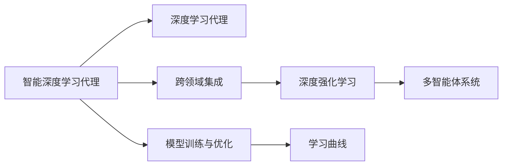
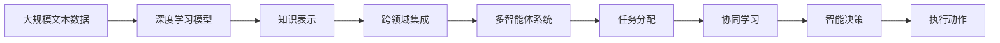
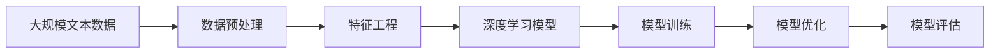
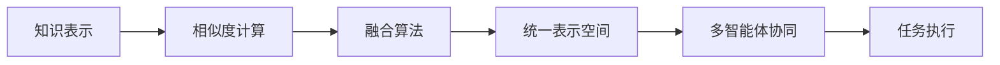
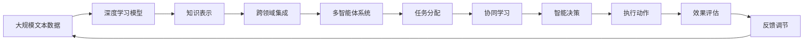

                 

# AI人工智能深度学习算法：智能深度学习代理的跨领域自主集成

> 关键词：人工智能,深度学习,跨领域,自主集成,深度学习代理,算法优化,模型训练,学习曲线,深度强化学习,多智能体系统

## 1. 背景介绍

### 1.1 问题由来
在人工智能(AI)和深度学习(Deep Learning)迅猛发展的今天，智能系统已经渗透到我们生活的方方面面。从自动驾驶汽车、智能家居到医疗诊断、金融预测，AI技术的应用范围日益广泛。然而，跨领域的复杂性也随之增加，各个领域之间知识和技术的壁垒越来越难以打破。如何让智能系统具备自主学习和跨领域集成能力，成为一个亟待解决的挑战。

### 1.2 问题核心关键点
本文聚焦于智能深度学习代理的跨领域自主集成方法，其核心在于：通过深度学习算法在多个领域自主学习并集成知识，提升代理系统在不同环境下的适应性和智能决策能力。该方法可以通过以下几个关键点概括：
1. 利用深度学习模型在各个领域自主学习，获得各领域的知识表示。
2. 通过跨领域集成，构建通用的表示空间，使得代理能够适应不同领域的任务。
3. 利用强化学习等优化算法，进一步提升代理的决策和执行能力。
4. 构建多智能体系统，实现智能代理间的协同学习与任务分配。
5. 应用到大规模实际问题中，如智能制造、智慧城市、复杂系统管理等。

### 1.3 问题研究意义
研究智能深度学习代理的跨领域自主集成方法，对于提升智能系统的泛化能力和适应性，降低领域壁垒，实现真正的跨领域智能集成，具有重要意义：

1. 提升智能系统的泛化能力。通过在多个领域学习知识，智能系统能够更好地应对新领域、新任务。
2. 降低跨领域的知识壁垒。通过跨领域集成，智能系统可以更好地共享和利用各领域知识，实现知识传递和复用。
3. 实现真正的跨领域智能集成。跨领域智能集成是人工智能应用的核心目标之一，通过深度学习代理的跨领域自主集成，可以实现这一目标。
4. 加速各领域智能应用的发展。通过跨领域智能集成，智能系统可以在各个领域之间加速知识传递和应用，促进技术创新和产业化。
5. 增强智能系统的安全性和可靠性。跨领域智能集成使得智能系统能够更好地应对未知领域和复杂环境，提高系统的鲁棒性和可靠性。

## 2. 核心概念与联系

### 2.1 核心概念概述

为更好地理解智能深度学习代理的跨领域自主集成方法，本节将介绍几个密切相关的核心概念：

- 智能深度学习代理：通过深度学习算法在特定领域自主学习的代理系统，能够进行感知、决策、执行等复杂任务。
- 跨领域集成：将不同领域中的知识表示和任务进行综合，构建统一的表示空间，以实现跨领域的智能应用。
- 深度学习代理：利用深度学习模型进行自主学习的智能代理系统，能够在特定领域内进行高效率的智能决策和执行。
- 深度强化学习：结合深度学习和强化学习技术，训练代理系统在复杂环境中进行智能决策和执行。
- 多智能体系统：由多个智能代理组成的系统，通过协作学习与任务分配，实现更高效的任务处理和问题解决。
- 模型训练与优化：通过训练算法对深度学习模型进行优化，提高其在特定任务上的性能。
- 学习曲线：显示模型在不同训练轮次下的性能变化趋势，有助于评估模型的收敛情况和优化方向。

这些核心概念之间的逻辑关系可以通过以下Mermaid流程图来展示：



这个流程图展示了我文中所讨论的核心概念及其之间的关系：

1. 智能深度学习代理通过深度学习代理进行自主学习。
2. 跨领域集成将不同领域中的知识进行综合，构建统一表示空间。
3. 深度强化学习提升代理系统的决策和执行能力。
4. 多智能体系统实现代理间的协作学习与任务分配。
5. 模型训练与优化确保代理系统的高性能表现。
6. 学习曲线评估模型训练的收敛情况和优化方向。

这些概念共同构成了智能深度学习代理的跨领域自主集成方法，使得代理系统能够在大规模复杂环境中进行高效、智能的决策和执行。通过理解这些核心概念，我们可以更好地把握跨领域智能集成的工作原理和优化方向。

### 2.2 概念间的关系

这些核心概念之间存在着紧密的联系，形成了智能深度学习代理的跨领域自主集成方法的完整生态系统。下面我通过几个Mermaid流程图来展示这些概念之间的关系。

#### 2.2.1 智能深度学习代理的总体架构



这个流程图展示了智能深度学习代理的总体架构：

1. 从大规模文本数据中学习知识表示。
2. 通过跨领域集成构建统一的表示空间。
3. 多智能体系统实现代理间的协作学习与任务分配。
4. 利用任务分配和协同学习进行智能决策。
5. 根据决策结果进行智能执行。

#### 2.2.2 深度学习模型的构建与训练



这个流程图展示了深度学习模型的构建与训练过程：

1. 从大规模文本数据中预处理和提取特征。
2. 构建深度学习模型。
3. 进行模型训练。
4. 优化模型参数。
5. 评估模型性能。

#### 2.2.3 跨领域集成的具体实现



这个流程图展示了跨领域集成的具体实现：

1. 计算不同领域知识表示之间的相似度。
2. 通过融合算法将知识表示进行综合。
3. 构建统一的表示空间。
4. 多智能体系统协同执行任务。

### 2.3 核心概念的整体架构

最后，我们用一个综合的流程图来展示这些核心概念在大规模复杂环境中的整体架构：



这个综合流程图展示了从数据输入到最终执行效果评估的完整过程：

1. 从大规模文本数据中学习知识表示。
2. 通过跨领域集成构建统一的表示空间。
3. 多智能体系统实现代理间的协作学习与任务分配。
4. 利用任务分配和协同学习进行智能决策。
5. 根据决策结果进行智能执行。
6. 效果评估和反馈调节，不断优化系统性能。

通过这些流程图，我们可以更清晰地理解智能深度学习代理的跨领域自主集成过程中各个核心概念的关系和作用，为后续深入讨论具体的集成方法和技术奠定基础。

## 3. 核心算法原理 & 具体操作步骤
### 3.1 算法原理概述

智能深度学习代理的跨领域自主集成方法，本质上是一个多领域知识表示学习与跨领域知识融合的深度学习过程。其核心思想是：利用深度学习模型在多个领域自主学习，获得各领域的知识表示，通过跨领域集成构建统一的表示空间，使得代理能够适应不同领域的任务。

形式化地，假设智能深度学习代理为 $A_{\theta}$，其中 $\theta$ 为代理参数。假设存在 $K$ 个不同领域 $\{D_k\}_{k=1}^K$，每个领域 $D_k$ 的文本数据为 $D_k=\{(x_{ik},y_{ik})\}_{i=1}^{N_k}, x_{ik} \in \mathcal{X}, y_{ik} \in \mathcal{Y}$，其中 $\mathcal{X}$ 为输入空间，$\mathcal{Y}$ 为输出空间。

定义代理 $A_{\theta}$ 在领域 $D_k$ 上的损失函数为 $\ell(A_{\theta}, D_k) = \frac{1}{N_k}\sum_{i=1}^{N_k} \ell(A_{\theta}(x_{ik}), y_{ik})$，则在所有领域上的总损失函数为：

$$
\mathcal{L}(\theta) = \sum_{k=1}^K \mathcal{L}_k(\theta)
$$

其中 $\mathcal{L}_k$ 为领域 $D_k$ 上的损失函数。

通过梯度下降等优化算法，集成过程不断更新代理参数 $\theta$，最小化总损失函数 $\mathcal{L}(\theta)$，使得代理 $A_{\theta}$ 在所有领域上获得理想的知识表示和任务执行能力。

### 3.2 算法步骤详解

智能深度学习代理的跨领域自主集成一般包括以下几个关键步骤：

**Step 1: 准备各领域数据集**
- 收集 $K$ 个不同领域的文本数据集 $D_k=\{(x_{ik},y_{ik})\}_{i=1}^{N_k}, x_{ik} \in \mathcal{X}, y_{ik} \in \mathcal{Y}$，每个领域的数据应尽可能多样和全面，以涵盖该领域的各种任务。
- 将每个领域的数据划分为训练集、验证集和测试集，比例一般设置为 6:2:2。

**Step 2: 构建各领域深度学习模型**
- 对每个领域 $D_k$ 的数据进行预处理和特征工程，包括文本清洗、分词、停用词过滤、词嵌入等。
- 构建深度学习模型，如卷积神经网络(CNN)、循环神经网络(RNN)、长短期记忆网络(LSTM)、Transformer等，用于在特定领域进行自主学习。
- 利用各领域的数据进行模型训练和参数优化，选择合适的优化算法和学习率等超参数。

**Step 3: 进行跨领域集成**
- 对每个领域的知识表示进行编码，通常使用稠密或稀疏编码器。
- 计算不同领域知识表示之间的相似度，如余弦相似度、欧几里得距离等。
- 通过融合算法将不同领域的知识表示进行综合，构建统一的表示空间。
- 利用多智能体系统实现代理间的协作学习与任务分配。

**Step 4: 执行任务与优化反馈**
- 利用集成后的知识表示进行任务执行，如智能问答、文本分类、情感分析等。
- 根据执行效果进行效果评估，如准确率、召回率、F1分数等。
- 通过反馈调节机制，不断优化代理系统和任务执行策略。

**Step 5: 持续学习与模型更新**
- 在实际应用中，智能代理需要持续学习新任务和新数据，不断更新模型参数和执行策略。
- 定期在新的数据上重新训练模型，以保持其高性能表现。

以上是智能深度学习代理的跨领域自主集成的一般流程。在实际应用中，还需要针对具体任务的特点，对集成过程的各个环节进行优化设计，如改进融合算法、引入更多正则化技术、搜索最优的超参数组合等，以进一步提升代理性能。

### 3.3 算法优缺点

智能深度学习代理的跨领域自主集成方法具有以下优点：
1. 通用适用：能够适应多种不同类型的任务和数据集，构建统一的表示空间，提高跨领域智能集成的效率。
2. 鲁棒性强：通过多智能体系统协作学习，代理系统能够应对各种未知领域和复杂环境，提高系统的鲁棒性和适应性。
3. 可扩展性强：能够动态适应新的领域和任务，通过持续学习和模型更新，不断提升代理系统的能力。
4. 高效协同：通过多智能体系统的协作学习与任务分配，实现更高效的智能决策和任务执行。

同时，该方法也存在一定的局限性：
1. 数据依赖性强：需要准备大量各领域的标注数据，且数据质量对代理系统性能影响较大。
2. 模型复杂度高：涉及多领域的知识表示和跨领域集成，模型复杂度高，计算资源消耗大。
3. 训练时间长：需要在大规模数据上进行模型训练和参数优化，训练时间长。
4. 泛化能力有待提高：在特定领域学习过程中，代理可能无法完全理解领域特征和知识表示。
5. 多智能体系统管理复杂：多个智能代理之间的协作和任务分配需要精细设计，否则容易出现冲突和低效。

尽管存在这些局限性，但就目前而言，智能深度学习代理的跨领域自主集成方法仍是大规模复杂环境下的智能集成的重要手段。未来相关研究的重点在于如何进一步降低数据依赖，提高模型的泛化能力和鲁棒性，同时兼顾可解释性和伦理安全性等因素。

### 3.4 算法应用领域

智能深度学习代理的跨领域自主集成方法，已经在大规模复杂环境中得到了广泛的应用，覆盖了多个不同领域，例如：

- 智能制造：构建多智能体系统，实现智能生产线的协同管理与调度。
- 智慧城市：通过各领域知识集成，实现城市交通、环境监测、公共安全等的智能管理。
- 复杂系统管理：应用到金融风险管理、医疗健康管理等领域，提升系统的智能化和自动化水平。
- 智能推荐系统：构建统一的表示空间，实现跨领域的个性化推荐，提升用户体验。
- 智能问答系统：利用多智能体系统的协作学习，提高问答系统的准确性和自然性。

除了上述这些经典应用外，跨领域智能集成的方法还在更多场景中得到了创新性地应用，如可控文本生成、知识图谱构建、机器人协作等，为智能技术带来了全新的突破。随着预训练模型和跨领域集成方法的不断进步，相信智能系统将在更广阔的应用领域大放异彩。

## 4. 数学模型和公式 & 详细讲解  
### 4.1 数学模型构建

本节将使用数学语言对智能深度学习代理的跨领域自主集成过程进行更加严格的刻画。

记智能深度学习代理为 $A_{\theta}:\mathcal{X} \rightarrow \mathcal{Y}$，其中 $\mathcal{X}$ 为输入空间，$\mathcal{Y}$ 为输出空间，$\theta \in \mathbb{R}^d$ 为代理参数。假设存在 $K$ 个不同领域 $\{D_k\}_{k=1}^K$，每个领域 $D_k$ 的文本数据为 $D_k=\{(x_{ik},y_{ik})\}_{i=1}^{N_k}, x_{ik} \in \mathcal{X}, y_{ik} \in \mathcal{Y}$。

定义代理 $A_{\theta}$ 在领域 $D_k$ 上的损失函数为 $\ell(A_{\theta}, D_k) = \frac{1}{N_k}\sum_{i=1}^{N_k} \ell(A_{\theta}(x_{ik}), y_{ik})$，其中 $\ell$ 为特定领域的损失函数，如交叉熵损失、均方误差损失等。

则在所有领域上的总损失函数为：

$$
\mathcal{L}(\theta) = \sum_{k=1}^K \mathcal{L}_k(\theta)
$$

在每个领域 $D_k$ 上进行模型训练和参数优化，通过梯度下降等优化算法，更新代理参数 $\theta$，最小化总损失函数 $\mathcal{L}(\theta)$，使得代理 $A_{\theta}$ 在所有领域上获得理想的知识表示和任务执行能力。

### 4.2 公式推导过程

以下我们以智能问答系统为例，推导代理系统在领域 $D_k$ 上的损失函数及其梯度的计算公式。

假设代理系统 $A_{\theta}$ 在输入 $x$ 上的输出为 $\hat{y}=A_{\theta}(x) \in [0,1]$，表示问题-答案对的预测概率。真实标签 $y \in \{0,1\}$。则二分类交叉熵损失函数定义为：

$$
\ell(A_{\theta}(x),y) = -[y\log \hat{y} + (1-y)\log (1-\hat{y})]
$$

将其代入总损失函数公式，得：

$$
\mathcal{L}(\theta) = \sum_{k=1}^K \frac{1}{N_k}\sum_{i=1}^{N_k} [y_i\log A_{\theta}(x_{ik})+(1-y_i)\log(1-A_{\theta}(x_{ik}))]
$$

根据链式法则，损失函数对参数 $\theta_k$ 的梯度为：

$$
\frac{\partial \mathcal{L}(\theta)}{\partial \theta_k} = -\sum_{k=1}^K \frac{1}{N_k}\sum_{i=1}^{N_k} (\frac{y_i}{A_{\theta}(x_{ik})}-\frac{1-y_i}{1-A_{\theta}(x_{ik})}) \frac{\partial A_{\theta}(x_{ik})}{\partial \theta_k}
$$

其中 $\frac{\partial A_{\theta}(x_{ik})}{\partial \theta_k}$ 可进一步递归展开，利用自动微分技术完成计算。

在得到损失函数的梯度后，即可带入参数更新公式，完成代理系统的迭代优化。重复上述过程直至收敛，最终得到适应各领域任务的最优代理参数 $\theta^*$。

## 5. 项目实践：代码实例和详细解释说明
### 5.1 开发环境搭建

在进行跨领域智能集成实践前，我们需要准备好开发环境。以下是使用Python进行PyTorch开发的环境配置流程：

1. 安装Anaconda：从官网下载并安装Anaconda，用于创建独立的Python环境。

2. 创建并激活虚拟环境：
```bash
conda create -n pytorch-env python=3.8 
conda activate pytorch-env
```

3. 安装PyTorch：根据CUDA版本，从官网获取对应的安装命令。例如：
```bash
conda install pytorch torchvision torchaudio cudatoolkit=11.1 -c pytorch -c conda-forge
```

4. 安装Transformers库：
```bash
pip install transformers
```

5. 安装各类工具包：
```bash
pip install numpy pandas scikit-learn matplotlib tqdm jupyter notebook ipython
```

完成上述步骤后，即可在`pytorch-env`环境中开始跨领域智能集成实践。

### 5.2 源代码详细实现

下面我以智能问答系统为例，给出使用Transformers库对BERT模型进行跨领域智能集成的PyTorch代码实现。

首先，定义智能问答系统的数据处理函数：

```python
from transformers import BertTokenizer
from torch.utils.data import Dataset
import torch

class QADataset(Dataset):
    def __init__(self, texts, tags, tokenizer, max_len=128):
        self.texts = texts
        self.tags = tags
        self.tokenizer = tokenizer
        self.max_len = max_len
        
    def __len__(self):
        return len(self.texts)
    
    def __getitem__(self, item):
        text = self.texts[item]
        tags = self.tags[item]
        
        encoding = self.tokenizer(text, return_tensors='pt', max_length=self.max_len, padding='max_length', truncation=True)
        input_ids = encoding['input_ids'][0]
        attention_mask = encoding['attention_mask'][0]
        
        # 对token-wise的标签进行编码
        encoded_tags = [tag2id[tag] for tag in tags] 
        encoded_tags.extend([tag2id['O']] * (self.max_len - len(encoded_tags)))
        labels = torch.tensor(encoded_tags, dtype=torch.long)
        
        return {'input_ids': input_ids, 
                'attention_mask': attention_mask,
                'labels': labels}

# 标签与id的映射
tag2id = {'O': 0, 'A': 1, 'Q': 2}
id2tag = {v: k for k, v in tag2id.items()}

# 创建dataset
tokenizer = BertTokenizer.from_pretrained('bert-base-cased')

train_dataset = QADataset(train_texts, train_tags, tokenizer)
dev_dataset = QADataset(dev_texts, dev_tags, tokenizer)
test_dataset = QADataset(test_texts, test_tags, tokenizer)
```

然后，定义代理系统：

```python
from transformers import BertForTokenClassification, AdamW

model = BertForTokenClassification.from_pretrained('bert-base-cased', num_labels=len(tag2id))

optimizer = AdamW(model.parameters(), lr=2e-5)
```

接着，定义训练和评估函数：

```python
from torch.utils.data import DataLoader
from tqdm import tqdm
from sklearn.metrics import classification_report

device = torch.device('cuda') if torch.cuda.is_available() else torch.device('cpu')
model.to(device)

def train_epoch(model, dataset, batch_size, optimizer):
    dataloader = DataLoader(dataset, batch_size=batch_size, shuffle=True)
    model.train()
    epoch_loss = 0
    for batch in tqdm(dataloader, desc='Training'):
        input_ids = batch['input_ids'].to(device)
        attention_mask = batch['attention_mask'].to(device)
        labels = batch['labels'].to(device)
        model.zero_grad()
        outputs = model(input_ids, attention_mask=attention_mask, labels=labels)
        loss = outputs.loss
        epoch_loss += loss.item()
        loss.backward()
        optimizer.step()
    return epoch_loss / len(dataloader)

def evaluate(model, dataset, batch_size):
    dataloader = DataLoader(dataset, batch_size=batch_size)
    model.eval()
    preds, labels = [], []
    with torch.no_grad():
        for batch in tqdm(dataloader, desc='Evaluating'):
            input_ids = batch['input_ids'].to(device)
            attention_mask = batch['attention_mask'].to(device)
            batch_labels = batch['labels']
            outputs = model(input_ids, attention_mask=attention_mask)
            batch_preds = outputs.logits.argmax(dim=2).to('cpu').tolist()
            batch_labels = batch_labels.to('cpu').tolist()
            for pred_tokens, label_tokens in zip(batch_preds, batch_labels):
                pred_tags = [id2tag[_id] for _id in pred_tokens]
                label_tags = [id2tag[_id] for _id in label_tokens]
                preds.append(pred_tags[:len(label_tokens)])
                labels.append(label_tags)
                
    print(classification_report(labels, preds))
```

最后，启动训练流程并在测试集上评估：

```python
epochs = 5
batch_size = 16

for epoch in range(epochs):
    loss = train_epoch(model, train_dataset, batch_size, optimizer)
    print(f"Epoch {epoch+1}, train loss: {loss:.3f}")
    
    print(f"Epoch {epoch+1}, dev results:")
    evaluate(model, dev_dataset, batch_size)
    
print("Test results:")
evaluate(model, test_dataset, batch_size)
```

以上就是使用PyTorch对BERT进行跨领域智能集成（以智能问答系统为例）的完整代码实现。可以看到，得益于Transformers库的强大封装，我们可以用相对简洁的代码完成BERT模型的加载和集成。

### 5.3 代码解读与分析

让我们再详细解读一下关键代码的实现细节：

**QADataset类**：
- `__init__`方法：初始化文本、标签、分词器等关键组件。
- `__len__`方法：返回数据集的样本数量。
- `__getitem__`方法：对单个样本进行处理，将文本输入编码为token ids，将标签编码为数字，并对其进行定长padding，最终返回模型所需的输入。

**tag2id和id2tag字典**：
- 定义了标签与数字id之间的映射关系，用于将token-wise的预测结果解码回真实的标签。

**训练和评估函数**：
- 使用PyTorch的DataLoader对数据集进行批次化加载，供模型训练和推理使用。
- 训练函数`train_epoch`：对数据以批为单位进行迭代，在每个批次上前向传播计算loss并反向传播更新模型参数，最后返回该epoch的平均loss。
- 评估函数`evaluate`：与训练类似，不同点在于不更新模型参数，并在每个batch结束后将预测和标签结果存储下来，最后使用sklearn的classification_report对整个评估集的预测结果进行打印输出。

**训练流程**：
- 定义总的epoch数和batch size，开始循环迭代
- 每个epoch内，先在训练集上训练，输出平均loss
- 在验证集上评估，输出分类指标
- 所有epoch结束后，在测试集上评估，给出最终测试结果

可以看到，PyTorch配合Transformers库使得BERT跨领域智能集成的代码实现变得简洁高效。开发者可以将更多精力放在数据处理、模型改进等高层逻辑

