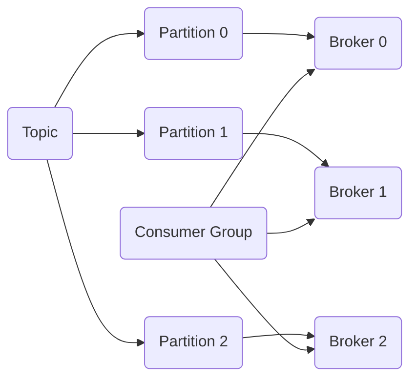

# Kafka Partition原理与代码实例讲解

## 1. 背景介绍
### 1.1 问题的由来
在大数据时代,数据的实时处理和分析变得越来越重要。Apache Kafka作为一个分布式的流处理平台,在数据的实时处理方面发挥着至关重要的作用。然而,对于很多初学者和开发者来说,理解Kafka的内部机制,尤其是Partition分区机制仍然是一个难点。

### 1.2 研究现状
目前,已经有很多关于Kafka原理的研究和讲解。但大部分都局限于比较浅显的原理介绍,缺乏对Partition分区机制更深入细致的剖析。同时,理论与实践结合不够紧密,缺乏实际的代码案例支撑,不利于读者对Kafka Partition的全面理解和掌握。

### 1.3 研究意义
深入研究Kafka Partition分区机制,对于优化Kafka的性能,提高系统的吞吐量和可靠性具有重要意义。同时,对Partition机制的深刻理解,也有助于开发者更好地使用Kafka,设计出高效可靠的流处理系统。

### 1.4 本文结构
本文将从Kafka Partition的基本概念出发,深入探讨其内部原理,并结合具体的代码实例进行讲解。内容涵盖Partition的创建、使用、再平衡等核心机制,力求理论与实践相结合,帮助读者全面掌握Kafka Partition。

## 2. 核心概念与联系
在Kafka中,Partition(分区)是最基本的数据存储单元。每个Topic可以划分为多个Partition,每个Partition又由一系列有序的、不可变的消息组成。Partition与Broker、Consumer Group等核心概念密切相关。



如上图所示:
- 一个Topic可以划分为多个Partition,每个Partition分布在不同的Broker上,从而实现负载均衡。
- 每个Consumer Group中的Consumer实例平均消费Topic的各个Partition,实现高吞吐和可扩展性。

## 3. 核心算法原理 & 具体操作步骤
### 3.1 算法原理概述
Kafka Partition分区机制的核心是将Topic划分为多个Partition,并将其分布到不同的Broker上。这个过程涉及Partition的创建、分配算法,以及Consumer Group对Partition的再平衡等。

### 3.2 算法步骤详解
1. Partition创建:
   - 创建Topic时,指定Partition数量。
   - 根据Partition数量和Broker数量,确定Partition到Broker的映射关系。
   - 将Partition均匀分布到各个Broker上。
2. 生产者发送消息:
   - 生产者根据分区算法(如Hash、Round-Robin等),确定消息发送到哪个Partition。
   - 将消息追加到对应Partition的本地日志中。
3. 消费者消费消息:
   - 消费者加入Consumer Group,并订阅Topic。
   - Consumer Group根据Partition数量和消费者数量,为每个消费者分配Partition。
   - 每个消费者从分配到的Partition中拉取消息进行消费。
4. 再平衡:
   - 当Consumer Group中消费者数量发生变化时,触发再平衡。
   - Group Coordinator重新为消费者分配Partition,尽量均匀分配。
   - 消费者从新分配的Partition中恢复消费,避免重复消费。

### 3.3 算法优缺点
- 优点:
  - 负载均衡:Partition分布在不同Broker上,实现负载均衡。
  - 高吞吐:消息分散在多个Partition,可并行读写,提高吞吐量。
  - 可扩展:增加Broker和Partition数量,可线性扩展系统性能。
- 缺点:
  - 复杂性:Partition机制增加了系统复杂性,如Partition再平衡。
  - 消息顺序:相同Key的消息可能分布在不同Partition,不保证顺序。

### 3.4 算法应用领域
Partition机制广泛应用于Kafka的数据存储、消息队列、流处理等各个方面,是Kafka实现高吞吐、高可用、可扩展的核心基石。

## 4. 数学模型和公式 & 详细讲解 & 举例说明
### 4.1 数学模型构建
我们可以用以下数学模型来描述Kafka Partition:

- 定义Topic $T$,Partition数量为$N$,Broker数量为$M$。
- 第$i$个Partition表示为$P_i$,其中$0 \leq i < N$。
- 第$j$个Broker表示为$B_j$,其中$0 \leq j < M$。
- Partition到Broker的映射关系表示为:$f: P_i \rightarrow B_j$。

### 4.2 公式推导过程
对于Partition到Broker的映射,一般采用Round-Robin算法,即:

$$f(P_i) = B_{i \bmod M}$$

其中,$i$为Partition编号,$M$为Broker数量。这个公式确保了Partition在Broker之间尽量均匀分布。

### 4.3 案例分析与讲解
举例说明,假设有一个Topic,4个Partition,3个Broker,则Partition到Broker的映射关系为:

- $P_0 \rightarrow B_0$
- $P_1 \rightarrow B_1$
- $P_2 \rightarrow B_2$
- $P_3 \rightarrow B_0$

可以看出,Partition在3个Broker上基本均匀分布,实现了负载均衡。

### 4.4 常见问题解答
- 问题1:Partition数量和Broker数量是否需要相等?
  - 答:不需要,Partition数量可以大于Broker数量,以实现更好的负载均衡。
- 问题2:Partition数量是否可以动态调整?
  - 答:可以,但调整Partition数量需要重新分配数据,较为复杂,建议提前规划好。

## 5. 项目实践：代码实例和详细解释说明
### 5.1 开发环境搭建
- JDK 8+
- Kafka 2.x
- Maven 3.x

### 5.2 源代码详细实现
下面是使用Kafka Java客户端创建Topic、发送和消费消息的示例代码:

```java
// 创建Topic
String topicName = "my-topic";
int partitionNum = 4;
short replicationFactor = 1;

Properties props = new Properties();
props.put("bootstrap.servers", "localhost:9092");
AdminClient admin = AdminClient.create(props);

NewTopic newTopic = new NewTopic(topicName, partitionNum, replicationFactor);
List<NewTopic> newTopics = new ArrayList<>();
newTopics.add(newTopic);
admin.createTopics(newTopics);

// 发送消息
Properties producerProps = new Properties();
producerProps.put("bootstrap.servers", "localhost:9092");
producerProps.put("key.serializer", "org.apache.kafka.common.serialization.StringSerializer");
producerProps.put("value.serializer", "org.apache.kafka.common.serialization.StringSerializer");

KafkaProducer<String, String> producer = new KafkaProducer<>(producerProps);

for (int i = 0; i < 10; i++) {
    ProducerRecord<String, String> record = new ProducerRecord<>(topicName, "key-" + i, "value-" + i);
    producer.send(record);
}

producer.close();

// 消费消息
Properties consumerProps = new Properties();
consumerProps.put("bootstrap.servers", "localhost:9092");
consumerProps.put("group.id", "my-group");
consumerProps.put("key.deserializer", "org.apache.kafka.common.serialization.StringDeserializer");
consumerProps.put("value.deserializer", "org.apache.kafka.common.serialization.StringDeserializer");

KafkaConsumer<String, String> consumer = new KafkaConsumer<>(consumerProps);
consumer.subscribe(Collections.singletonList(topicName));

while (true) {
    ConsumerRecords<String, String> records = consumer.poll(Duration.ofMillis(100));
    for (ConsumerRecord<String, String> record : records) {
        System.out.printf("Partition = %d, Offset = %d, Key = %s, Value = %s\n",
            record.partition(), record.offset(), record.key(), record.value());
    }
}
```

### 5.3 代码解读与分析
- 创建Topic:
  - 指定Topic名称、Partition数量、副本因子。
  - 使用AdminClient创建Topic。
- 发送消息:
  - 创建KafkaProducer,指定Broker地址和序列化器。
  - 创建ProducerRecord,指定Topic、Key、Value。
  - 发送消息到Kafka。
- 消费消息:
  - 创建KafkaConsumer,指定Broker地址、Group ID、反序列化器。
  - 订阅Topic。
  - 轮询消息,打印Partition、Offset、Key、Value等信息。

### 5.4 运行结果展示
运行Consumer后,可以看到类似如下输出:

```
Partition = 2, Offset = 0, Key = key-0, Value = value-0
Partition = 1, Offset = 0, Key = key-1, Value = value-1
Partition = 0, Offset = 0, Key = key-2, Value = value-2
Partition = 3, Offset = 0, Key = key-3, Value = value-3
...
```

可以看出,消息根据Key散列到不同的Partition中,实现了负载均衡。

## 6. 实际应用场景
Kafka Partition机制在很多实际场景中得到应用,例如:

- 日志收集:将不同服务器上的日志数据发送到Kafka的不同Partition,实现负载均衡和并行处理。
- 流式数据处理:将流式数据(如点击流、日志流)分区存储,结合流处理框架(如Spark Streaming、Flink)进行实时计算。
- 消息队列:作为高性能的消息队列中间件,利用Partition实现消息的发布和订阅。

### 6.4 未来应用展望
随着数据规模的不断增长,Kafka Partition机制在数据的存储、传输、计算等方面将扮演越来越重要的角色。未来Partition机制有望与新的存储和计算模型(如流批一体)深度结合,实现更加智能、高效的数据处理。

## 7. 工具和资源推荐
### 7.1 学习资源推荐
- Kafka官方文档:https://kafka.apache.org/documentation/
- Confluent Kafka教程:https://developer.confluent.io/
- Kafka权威指南(书籍)

### 7.2 开发工具推荐
- Kafka Tool:Kafka可视化管理工具
- Kafka Manager:Kafka集群管理工具
- Kafka Eagle:Kafka集群监控平台

### 7.3 相关论文推荐
- Kafka: a Distributed Messaging System for Log Processing
- Kafka Streams: A Lightweight, Easy-to-Use Stream Processing Library

### 7.4 其他资源推荐
- Kafka Summit:Kafka年度峰会,分享最新进展和实践案例
- Confluent Blog:Confluent官方博客,发布Kafka相关技术文章

## 8. 总结：未来发展趋势与挑战
### 8.1 研究成果总结
本文深入探讨了Kafka Partition分区机制的原理和实现,通过理论分析和代码实践,帮助读者全面掌握Partition机制。Partition作为Kafka的核心机制之一,在数据存储、负载均衡、并行处理等方面发挥着至关重要的作用。

### 8.2 未来发展趋势
未来,Kafka Partition机制将向着更加智能化、自动化的方向发展。一方面,Partition的数量和分布将根据数据特征和负载情况自动调整,实现动态伸缩;另一方面,Partition将与流批一体架构深度融合,支持更加灵活、高效的数据处理。

### 8.3 面临的挑战
尽管Partition机制已经相对成熟,但仍然面临一些挑战:

- 大规模集群下Partition再平衡的效率问题。
- 跨机房、跨区域部署下Partition的分布策略。
- Partition数据不均衡导致的负载不均问题。

这些都是未来Partition机制需要重点解决的难题。

### 8.4 研究展望
未来对Kafka Partition机制的研究,一方面要继续优化内部实现,如Partition分配算法、再平衡触发机制等;另一方面要拓展Partition的应用场景和融合方式,如与流批一体架构、Serverless计算等新型计算模式的结合。只有在理论和实践上不断创新,Partition机制才能更好地服务于海量数据处理的需求。

## 9. 附录：常见问题与解答
- Q: Partition数量是越多越好吗