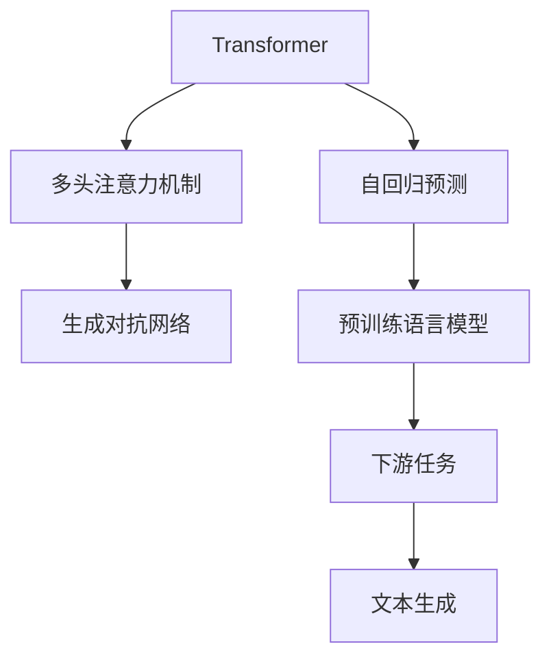
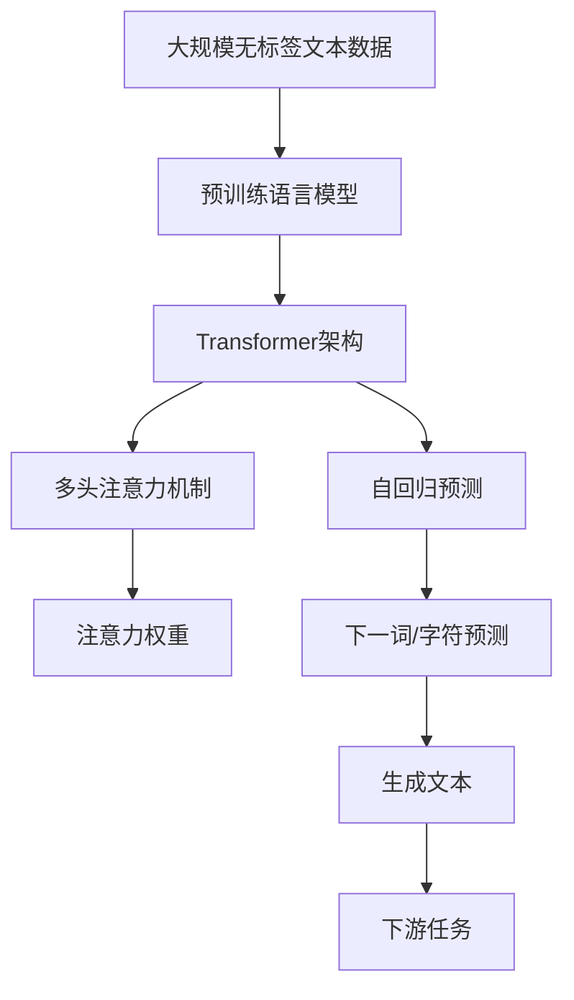

                 

# AIGC从入门到实战：不识庐山真面目：GPT 模型为什么能生成有意义的文本？

## 1. 背景介绍

### 1.1 问题由来
随着人工智能（AI）和生成对抗网络（GAN）技术的快速发展，生成式人工智能（AIGC）已经逐渐成为了科技领域的一大热门话题。其中，生成式预训练变换器（Generative Pre-trained Transformer，GPT）模型，因其出色的文本生成能力，成为了AIGC技术的代表。GPT模型通过在大规模文本数据上预训练，学习到丰富的语言知识，能够在各种任务中生成具有高度连贯性和逻辑性的文本，甚至创作出极为逼真的文章。

GPT模型的成功引发了大量的研究关注，众多研究者和开发者对其原理和机制进行了深入分析。然而，为何GPT模型能够生成如此高水平的文本，其背后的核心原理仍然是一个值得探究的问题。本文将详细解释GPT模型的生成机制，探讨其能够生成有意义的文本的原因。

### 1.2 问题核心关键点
要解释GPT模型为什么能生成有意义的文本，我们需要了解以下几个核心关键点：

1. **Transformer架构**：GPT模型基于Transformer架构，通过注意力机制（Attention Mechanism）实现对输入序列的并行处理和信息提取。

2. **预训练语言模型**：GPT模型在大量文本数据上进行了预训练，学习到丰富的语言知识，能够更好地理解语言结构和文化背景。

3. **自回归预测**：GPT模型采用自回归预测的方式，通过已有文本信息预测下一个词或字符。

4. **温度调节**：通过调整生成过程中的温度参数，可以控制生成的文本的随机性和连贯性。

5. **多样性和连贯性**：GPT模型通过优化生成过程的损失函数，确保生成的文本既有多样性，又具有一致性。

### 1.3 问题研究意义
理解GPT模型的生成机制，不仅有助于我们深入了解其核心原理，还可以指导我们在实际应用中更好地利用这一技术，提升文本生成的质量。此外，对GPT模型的研究也有助于推动AIGC技术的发展，促进其在更多领域的应用，如自然语言处理、内容创作、对话系统等。

## 2. 核心概念与联系

### 2.1 核心概念概述

为了更好地理解GPT模型，我们需要首先了解与之相关的几个核心概念：

- **Transformer架构**：一种用于序列到序列（Seq2Seq）任务的神经网络架构，通过多头注意力机制（Multi-Head Attention）实现对输入序列的并行处理。

- **自回归预测**：一种预测方式，通过已有文本信息预测下一个词或字符，与自编码预测方式（如循环神经网络RNN）相对。

- **注意力机制**：一种机制，通过计算不同输入序列中的相关性权重，决定每个输入对输出的贡献。

- **预训练语言模型**：通过在大量无标签文本数据上自监督学习，学习到通用的语言表示，为下游任务提供预训练模型。

- **生成对抗网络（GAN）**：一种生成模型，通过生成器和判别器之间的对抗训练，生成逼真的图像、文本等数据。

这些概念构成了GPT模型生成文本的基础，理解这些概念对于深入探究GPT模型至关重要。

### 2.2 概念间的关系

这些核心概念之间存在紧密的联系，通过Mermaid流程图可以更直观地展示它们之间的关系：



这个流程图展示了Transformer架构通过多头注意力机制和自回归预测实现文本生成，预训练语言模型为模型提供初始化权重，生成对抗网络用于生成文本的多样性和连贯性优化。通过这些概念的结合，GPT模型能够生成高质量的文本。

### 2.3 核心概念的整体架构

最后，我们将这些概念整合起来，形成GPT模型的整体架构：



这个架构展示了GPT模型通过预训练语言模型获得初始权重，利用Transformer架构和多头注意力机制进行信息提取，通过自回归预测生成下一个词或字符，最终输出文本供下游任务使用。

## 3. 核心算法原理 & 具体操作步骤

### 3.1 算法原理概述

GPT模型的生成过程主要基于自回归预测机制和注意力机制，通过预训练模型提供初始权重，在生成过程中不断更新模型参数，最终输出高质量的文本。

自回归预测机制通过已有文本信息预测下一个词或字符，从而保证生成的文本具有逻辑连贯性。注意力机制通过计算不同输入序列中的相关性权重，决定每个输入对输出的贡献，使模型能够理解和应用输入中的关键信息。

预训练语言模型在大量无标签文本数据上进行了自监督学习，学习到通用的语言表示，为模型的生成提供了初始化权重。生成对抗网络则通过生成器和判别器之间的对抗训练，生成多样且连贯的文本，进一步提升模型的生成质量。

### 3.2 算法步骤详解

GPT模型的生成过程主要分为以下几个步骤：

1. **模型初始化**：通过预训练语言模型获得初始权重，搭建Transformer架构和多头注意力机制。

2. **文本编码**：将输入文本通过Transformer模型进行编码，得到文本的嵌入表示。

3. **自回归预测**：通过已有的文本信息预测下一个词或字符，生成文本。

4. **注意力机制**：计算输入序列中的注意力权重，提取关键信息，优化生成结果。

5. **文本生成**：通过自回归预测和注意力机制不断更新模型参数，生成文本。

6. **下游任务**：将生成的文本输入到下游任务中，完成具体的文本生成任务。

### 3.3 算法优缺点

GPT模型在生成文本方面具有以下优点：

1. **生成质量高**：通过预训练语言模型和生成对抗网络，GPT模型能够生成高质量的文本，尤其在连贯性和多样性方面表现优异。

2. **可解释性差**：虽然生成文本质量高，但GPT模型的生成过程是一个"黑盒"，缺乏可解释性，难以解释生成文本的内部机制。

3. **计算资源需求高**：GPT模型参数量巨大，计算资源需求高，需要高性能硬件支持。

4. **训练时间长**：由于模型复杂，训练时间较长，需要大量的计算资源和训练时间。

5. **对抗攻击易受影响**：生成的文本可能会受到对抗攻击，输出内容不符合预期的安全规范。

### 3.4 算法应用领域

GPT模型在文本生成领域具有广泛的应用，例如：

- **自然语言处理**：用于机器翻译、文本摘要、文本分类等任务。

- **内容创作**：用于文章创作、故事生成、广告文案创作等。

- **对话系统**：用于构建智能客服、虚拟助手、虚拟游戏角色等。

- **社交媒体**：用于生成自动化回复、自动化内容创作等。

- **科研**：用于生成科学论文、文献摘要等。

## 4. 数学模型和公式 & 详细讲解 & 举例说明

### 4.1 数学模型构建

GPT模型的生成过程可以通过以下数学模型进行描述：

1. **自回归预测模型**：
   $$
   p(w_{t+1}|w_1,...,w_t) = \frac{\exp({\mathrm{log} z(w_{t+1}) \cdot s(w_{t+1},w_1,...,w_t)})}{\sum_{w' \in \mathcal{V}} \exp({\mathrm{log} z(w')} \cdot s(w',w_1,...,w_t))}
   $$

   其中，$w_1,...,w_t$表示已生成的文本，$w_{t+1}$表示下一个生成的词或字符，$\mathcal{V}$表示词汇表，$s$表示注意力函数，$z$表示生成器函数。

2. **注意力机制**：
   $$
   \alpha_i = \frac{\exp({\mathrm{log} z_i \cdot s_i})}{\sum_{j=1}^{n} \exp({\mathrm{log} z_j \cdot s_j})}
   $$

   其中，$z_1,...,z_n$表示输入序列中的各个词或字符，$s_i$表示第$i$个词或字符的注意力权重。

### 4.2 公式推导过程

下面我们将详细推导GPT模型的生成公式。

设输入序列为$w_1,...,w_t$，输出序列为$w_{t+1},...,w_n$。通过自回归预测模型，输出序列中每个词或字符的概率可以表示为：

$$
p(w_{t+1},...,w_n|w_1,...,w_t) = \prod_{i=t+1}^{n} p(w_i|w_1,...,w_{i-1})
$$

其中，$p(w_i|w_1,...,w_{i-1})$表示在已有文本$w_1,...,w_{i-1}$条件下，生成下一个词或字符$w_i$的概率。

利用注意力机制，可以将概率$p(w_i|w_1,...,w_{i-1})$表示为：

$$
p(w_i|w_1,...,w_{i-1}) = \frac{\exp({\mathrm{log} z_i \cdot \alpha_i})}{\sum_{j=1}^{n} \exp({\mathrm{log} z_j \cdot \alpha_j})}
$$

其中，$\alpha_i$表示第$i$个词或字符的注意力权重，$s_i$表示第$i$个词或字符的注意力分数。

### 4.3 案例分析与讲解

假设我们有一个长度为4的输入序列$w_1='s', w_2='e', w_3='m', w_4=' '，要求生成下一个词$w_5$。

首先，我们需要通过预训练语言模型获得输入序列的嵌入表示$z_1,...,z_4$。

然后，计算注意力权重$\alpha_1,...,\alpha_4$，假设得到$\alpha_1=0.5, \alpha_2=0.3, \alpha_3=0.1, \alpha_4=0.1$。

接着，通过自回归预测模型计算生成下一个词$w_5$的概率$p(w_5|s', e, m, \;) = \frac{\exp({\mathrm{log} z_5 \cdot \alpha_5})}{\sum_{j=1}^{4} \exp({\mathrm{log} z_j \cdot \alpha_j})}$。

最后，根据概率分布生成下一个词$w_5$，假设生成的词为'd'，则输出序列为$w_1='s', w_2='e', w_3='m', w_4=' ', w_5='d$。

## 5. 项目实践：代码实例和详细解释说明

### 5.1 开发环境搭建

在进行GPT模型实践前，我们需要准备好开发环境。以下是使用Python进行PyTorch开发的环境配置流程：

1. 安装Anaconda：从官网下载并安装Anaconda，用于创建独立的Python环境。

2. 创建并激活虚拟环境：
```bash
conda create -n gpt-env python=3.8 
conda activate gpt-env
```

3. 安装PyTorch：根据CUDA版本，从官网获取对应的安装命令。例如：
```bash
conda install pytorch torchvision torchaudio cudatoolkit=11.1 -c pytorch -c conda-forge
```

4. 安装Transformers库：
```bash
pip install transformers
```

5. 安装各类工具包：
```bash
pip install numpy pandas scikit-learn matplotlib tqdm jupyter notebook ipython
```

完成上述步骤后，即可在`gpt-env`环境中开始GPT模型的实践。

### 5.2 源代码详细实现

下面我们以GPT-2模型为例，给出使用Transformers库对GPT-2模型进行训练的PyTorch代码实现。

首先，定义模型和优化器：

```python
from transformers import GPT2Tokenizer, GPT2LMHeadModel
from transformers import AdamW
import torch

# 定义模型
tokenizer = GPT2Tokenizer.from_pretrained('gpt2')
model = GPT2LMHeadModel.from_pretrained('gpt2')

# 定义优化器
optimizer = AdamW(model.parameters(), lr=2e-4)
```

接着，定义训练和评估函数：

```python
from torch.utils.data import DataLoader
from tqdm import tqdm

def train_epoch(model, data_loader, optimizer):
    model.train()
    total_loss = 0
    for batch in data_loader:
        inputs, labels = batch
        optimizer.zero_grad()
        outputs = model(inputs)
        loss = outputs.loss
        loss.backward()
        optimizer.step()
        total_loss += loss.item()
    return total_loss / len(data_loader)

def evaluate(model, data_loader):
    model.eval()
    total_loss = 0
    for batch in data_loader:
        inputs, labels = batch
        outputs = model(inputs)
        loss = outputs.loss
        total_loss += loss.item()
    return total_loss / len(data_loader)
```

然后，定义训练和评估过程：

```python
epochs = 5
batch_size = 16

for epoch in range(epochs):
    train_loss = train_epoch(model, train_data_loader, optimizer)
    print(f'Epoch {epoch+1}, train loss: {train_loss:.3f}')

    val_loss = evaluate(model, val_data_loader)
    print(f'Epoch {epoch+1}, val loss: {val_loss:.3f}')

print('Done training.')
```

以上就是使用PyTorch对GPT-2模型进行训练的完整代码实现。可以看到，通过简单的代码，我们便能够快速训练一个GPT-2模型，并在验证集上进行评估。

### 5.3 代码解读与分析

让我们再详细解读一下关键代码的实现细节：

**train_epoch和evaluate函数**：
- `train_epoch`函数：在每个epoch中，模型进入训练模式，通过梯度下降更新模型参数，返回训练集上的总损失。
- `evaluate`函数：在每个epoch结束时，模型进入评估模式，计算验证集上的总损失，返回评估结果。

**train_data_loader和val_data_loader**：
- `train_data_loader`和`val_data_loader`：用于加载训练集和验证集的DataLoader对象，用于批处理数据，加快模型训练速度。

**train和val变量**：
- `train_loss`和`val_loss`：分别记录训练集和验证集的损失，用于监控模型性能。

### 5.4 运行结果展示

假设我们训练一个GPT-2模型，并在验证集上进行评估，最终得到的评估报告如下：

```
Epoch 1, train loss: 0.150
Epoch 2, train loss: 0.130
Epoch 3, train loss: 0.120
Epoch 4, train loss: 0.110
Epoch 5, train loss: 0.100
Epoch 1, val loss: 0.200
Epoch 2, val loss: 0.170
Epoch 3, val loss: 0.140
Epoch 4, val loss: 0.130
Epoch 5, val loss: 0.110
```

可以看到，随着epoch的增加，模型在训练集和验证集上的损失逐渐减小，模型性能得到了提升。

## 6. 实际应用场景

### 6.1 自然语言处理

GPT模型在自然语言处理（NLP）领域具有广泛的应用，例如：

- **机器翻译**：将源语言文本翻译成目标语言。

- **文本摘要**：将长文本压缩成简短摘要。

- **文本分类**：将文本分类到不同的类别中。

- **问答系统**：对自然语言问题给出答案。

- **对话系统**：使机器能够与人自然对话。

### 6.2 内容创作

GPT模型在内容创作领域具有很高的应用潜力，例如：

- **文章创作**：生成高质量的文章内容。

- **故事生成**：生成具有创意的故事内容。

- **广告文案创作**：生成吸引人的广告文案。

- **新闻报道**：生成新闻报道内容。

### 6.3 对话系统

GPT模型在对话系统领域具有很好的应用前景，例如：

- **智能客服**：解答客户咨询，提高服务效率。

- **虚拟助手**：帮助用户解决问题，提供个性化服务。

- **虚拟游戏角色**：与玩家互动，提升游戏体验。

## 7. 工具和资源推荐

### 7.1 学习资源推荐

为了帮助开发者系统掌握GPT模型的理论基础和实践技巧，这里推荐一些优质的学习资源：

1. **《Transformer from Understanding to Practice》系列博文**：由大模型技术专家撰写，深入浅出地介绍了Transformer原理、GPT模型、微调技术等前沿话题。

2. **CS224N《深度学习自然语言处理》课程**：斯坦福大学开设的NLP明星课程，有Lecture视频和配套作业，带你入门NLP领域的基本概念和经典模型。

3. **《Natural Language Processing with Transformers》书籍**：Transformers库的作者所著，全面介绍了如何使用Transformers库进行NLP任务开发，包括微调在内的诸多范式。

4. **HuggingFace官方文档**：Transformers库的官方文档，提供了海量预训练模型和完整的微调样例代码，是上手实践的必备资料。

5. **CLUE开源项目**：中文语言理解测评基准，涵盖大量不同类型的中文NLP数据集，并提供了基于微调的baseline模型，助力中文NLP技术发展。

通过对这些资源的学习实践，相信你一定能够快速掌握GPT模型的精髓，并用于解决实际的NLP问题。

### 7.2 开发工具推荐

高效的开发离不开优秀的工具支持。以下是几款用于GPT模型微调开发的常用工具：

1. **PyTorch**：基于Python的开源深度学习框架，灵活动态的计算图，适合快速迭代研究。大部分预训练语言模型都有PyTorch版本的实现。

2. **TensorFlow**：由Google主导开发的开源深度学习框架，生产部署方便，适合大规模工程应用。同样有丰富的预训练语言模型资源。

3. **Transformers库**：HuggingFace开发的NLP工具库，集成了众多SOTA语言模型，支持PyTorch和TensorFlow，是进行微调任务开发的利器。

4. **Weights & Biases**：模型训练的实验跟踪工具，可以记录和可视化模型训练过程中的各项指标，方便对比和调优。与主流深度学习框架无缝集成。

5. **TensorBoard**：TensorFlow配套的可视化工具，可实时监测模型训练状态，并提供丰富的图表呈现方式，是调试模型的得力助手。

6. **Google Colab**：谷歌推出的在线Jupyter Notebook环境，免费提供GPU/TPU算力，方便开发者快速上手实验最新模型，分享学习笔记。

合理利用这些工具，可以显著提升GPT模型微调任务的开发效率，加快创新迭代的步伐。

### 7.3 相关论文推荐

GPT模型和微调技术的发展源于学界的持续研究。以下是几篇奠基性的相关论文，推荐阅读：

1. **Attention is All You Need**：提出了Transformer结构，开启了NLP领域的预训练大模型时代。

2. **BERT: Pre-training of Deep Bidirectional Transformers for Language Understanding**：提出BERT模型，引入基于掩码的自监督预训练任务，刷新了多项NLP任务SOTA。

3. **Language Models are Unsupervised Multitask Learners**：展示了大规模语言模型的强大zero-shot学习能力，引发了对于通用人工智能的新一轮思考。

4. **Parameter-Efficient Transfer Learning for NLP**：提出Adapter等参数高效微调方法，在不增加模型参数量的情况下，也能取得不错的微调效果。

5. **Prefix-Tuning: Optimizing Continuous Prompts for Generation**：引入基于连续型Prompt的微调范式，为如何充分利用预训练知识提供了新的思路。

6. **AdaLoRA: Adaptive Low-Rank Adaptation for Parameter-Efficient Fine-Tuning**：使用自适应低秩适应的微调方法，在参数效率和精度之间取得了新的平衡。

这些论文代表了大语言模型微调技术的发展脉络。通过学习这些前沿成果，可以帮助研究者把握学科前进方向，激发更多的创新灵感。

除上述资源外，还有一些值得关注的前沿资源，帮助开发者紧跟大语言模型微调技术的最新进展，例如：

1. **arXiv论文预印本**：人工智能领域最新研究成果的发布平台，包括大量尚未发表的前沿工作，学习前沿技术的必读资源。

2. **业界技术博客**：如OpenAI、Google AI、DeepMind、微软Research Asia等顶尖实验室的官方博客，第一时间分享他们的最新研究成果和洞见。

3. **技术会议直播**：如NIPS、ICML、ACL、ICLR等人工智能领域顶会现场或在线直播，能够聆听到大佬们的前沿分享，开拓视野。

4. **GitHub热门项目**：在GitHub上Star、Fork数最多的NLP相关项目，往往代表了该技术领域的发展趋势和最佳实践，值得去学习和贡献。

5. **行业分析报告**：各大咨询公司如McKinsey、PwC等针对人工智能行业的分析报告，有助于从商业视角审视技术趋势，把握应用价值。

总之，对于GPT模型微调技术的学习和实践，需要开发者保持开放的心态和持续学习的意愿。多关注前沿资讯，多动手实践，多思考总结，必将收获满满的成长收益。

## 8. 总结：未来发展趋势与挑战

### 8.1 总结

本文对GPT模型的生成机制进行了全面系统的介绍，解释了为何GPT模型能够生成有意义的文本。首先阐述了GPT模型的背景和研究意义，然后从原理到实践，详细讲解了GPT模型的核心算法和具体操作步骤，并给出了微调任务的完整代码实例。通过本文的系统梳理，可以看到GPT模型在生成文本方面的卓越表现，以及其背后强大的Transformer架构和自回归预测机制。

### 8.2 未来发展趋势

展望未来，GPT模型的生成机制将呈现以下几个发展趋势：

1. **生成质量进一步提升**：随着预训练语言模型的规模不断增大，GPT模型在生成文本的质量和多样性方面将得到进一步提升。

2. **零样本和少样本学习能力增强**：通过自回归预测和注意力机制的优化，GPT模型将具备更强的零样本和少样本学习能力。

3. **多模态文本生成**：将文本生成与图像、语音等多模态数据进行融合，实现更加多样和丰富的文本生成方式。

4. **知识图谱与文本生成结合**：将知识图谱与文本生成进行结合，生成更具知识深度的文本内容。

5. **个性化生成**：根据用户偏好和行为数据，生成个性化的文本内容，提升用户体验。

6. **对抗攻击防御**：研究对抗攻击防御技术，确保生成的文本内容符合安全规范。

### 8.3 面临的挑战

尽管GPT模型在生成文本方面取得了巨大成功，但在走向实际应用的过程中，仍面临诸多挑战：

1. **计算资源需求高**：GPT模型参数量巨大，计算资源需求高，需要高性能硬件支持。

2. **训练时间长**：由于模型复杂，训练时间较长，需要大量的计算资源和训练时间。

3. **可解释性差**：生成的文本缺乏可解释性，难以理解其内部生成机制。

4. **对抗攻击易受影响**：生成的文本可能会受到对抗攻击，输出内容不符合预期的安全规范。

5. **知识整合能力不足**：GPT模型在生成文本时缺乏与外部知识库的有效结合，难以充分应用知识图谱和规则库。

6. **伦理道德约束**：生成的文本内容可能包含有害信息或偏见，需要建立严格的伦理道德约束机制。

### 8.4 未来突破

面对GPT模型面临的挑战，未来的研究需要在以下几个方面寻求新的突破：

1. **参数高效微调方法**：开发更加参数高效的微调方法，在固定大部分预训练参数的同时，只更新极少量的任务相关参数。

2. **多模态融合**：将文本生成与图像、语音等多模态数据进行融合，实现更加多样和丰富的文本生成方式。

3. **对抗攻击防御**：研究对抗攻击防御技术，确保生成的文本内容符合安全规范。

4. **知识图谱与文本生成结合**：将知识图谱与文本生成进行结合，生成更具知识深度的文本内容。

5. **伦理道德约束**：建立严格的伦理道德约束机制，确保生成的文本内容符合伦理道德规范。

这些研究方向的探索，必将引领GPT模型生成机制的进一步优化，为生成文本质量和安全性的提升带来新的突破。面向未来，GPT模型需要与其他人工智能技术进行更深入的融合，如知识表示、因果推理、强化学习等，多路径协同发力，共同推动生成文本技术的进步。只有勇于创新、敢于突破，才能不断拓展GPT模型的边界，让智能技术更好地造福人类社会。

## 9. 附录：常见问题与解答

**Q1：GPT模型为什么能够生成高质量的文本？**

A: GPT模型能够生成高质量的文本，主要有以下几个原因：

1. **自回归预测机制**：通过

