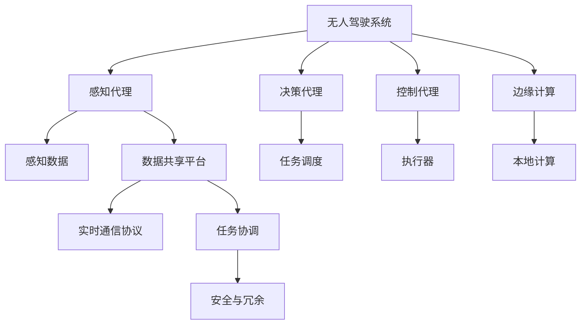
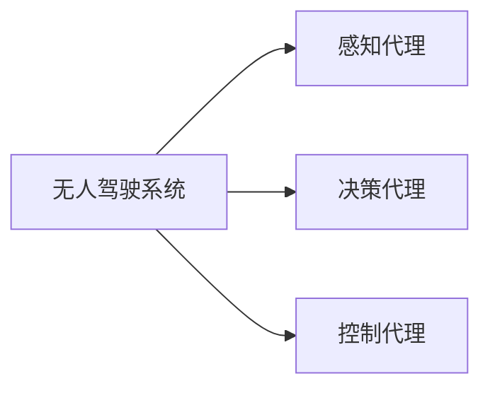
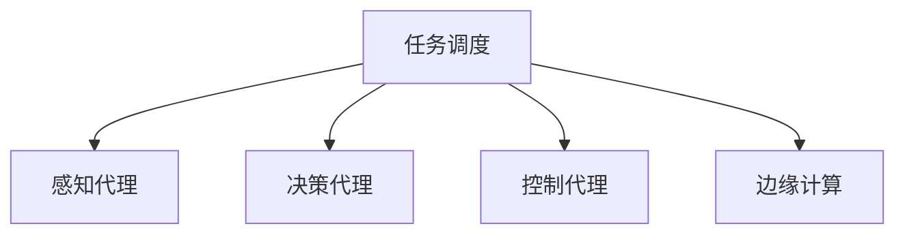
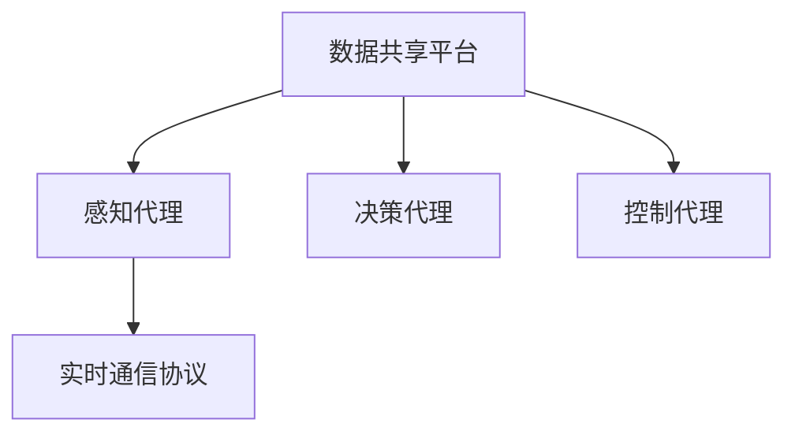
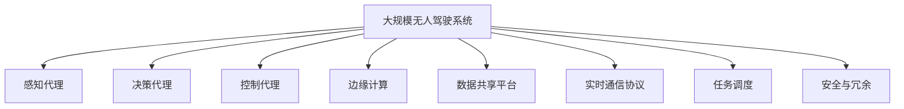

                 

# AI人工智能代理工作流 AI Agent WorkFlow：在无人驾驶中的应用

> 关键词：
1. 无人驾驶
2. AI代理工作流
3. 自动驾驶系统
4. 智能交通管理
5. 实时监控
6. 数据处理
7. 边缘计算

## 1. 背景介绍

### 1.1 问题由来
随着人工智能技术的迅猛发展，无人驾驶技术成为众多科技公司和传统汽车制造商竞相争夺的焦点。然而，无人驾驶技术仍处于早期阶段，面临着一系列复杂而棘手的问题。这些问题涉及传感器融合、路径规划、决策控制、车辆通信等诸多方面，需要强大的计算和智能算法支持。

为解决无人驾驶中的各种难题，智能代理工作流（AI Agent Workflow）应运而生。通过将无人驾驶系统拆分为多个智能模块，每个模块由独立的AI代理负责特定任务，可以实现系统高效协同，提高无人驾驶系统的稳定性和可靠性。

### 1.2 问题核心关键点
智能代理工作流的基本思想是将复杂的无人驾驶系统拆分为多个子任务，每个子任务由独立的AI代理处理。这些代理之间通过高效的数据通信和协调机制，协同完成整个驾驶任务。核心关键点包括：

1. **系统架构设计**：合理划分任务，设计多级模块化架构，便于管理和扩展。
2. **数据共享机制**：构建统一的数据共享平台，实现各代理之间的数据互通。
3. **实时通信协议**：开发高效的数据传输协议，确保各代理之间实时、可靠的数据交换。
4. **任务调度策略**：设计任务调度算法，根据实时环境动态调整各代理的任务优先级和执行顺序。
5. **边缘计算应用**：采用边缘计算技术，将部分计算任务下放到车辆端，提高系统响应速度和数据安全性。
6. **安全与冗余设计**：设计多重安全机制和冗余备份策略，确保系统高可靠性。

### 1.3 问题研究意义
智能代理工作流在无人驾驶中的应用，具有重要的研究意义：

1. **提升系统稳定性**：通过将系统任务拆分为多个子任务，各子任务并行执行，可以提高无人驾驶系统的鲁棒性和容错能力。
2. **优化资源分配**：通过任务调度策略，动态调整各代理的任务负荷，优化资源利用率。
3. **降低成本和复杂度**：各子任务相对独立，降低了系统的开发和维护成本，简化了系统的复杂度。
4. **提高实时性**：通过边缘计算技术，将部分计算任务下放到车辆端，可以显著提高系统的响应速度。
5. **增强安全性**：通过多重安全机制和冗余备份策略，确保无人驾驶系统的高度安全性和可靠性。

## 2. 核心概念与联系

### 2.1 核心概念概述

为更好地理解智能代理工作流的原理和架构，本节将介绍几个关键概念及其相互关系：

- **无人驾驶系统**：由传感器、决策层、执行器等多个模块组成的复杂系统，负责自动驾驶任务。
- **智能代理**：执行特定任务的独立AI模块，如感知代理、决策代理、控制代理等。
- **任务调度**：动态调整各代理的任务优先级和执行顺序，实现任务并行和负载均衡。
- **数据共享**：构建统一的数据共享平台，实现各代理之间的数据互通。
- **边缘计算**：将部分计算任务下放到车辆端，通过本地计算提高响应速度和数据安全性。
- **实时通信协议**：开发高效的数据传输协议，确保各代理之间实时、可靠的数据交换。
- **任务协调**：通过协调机制，确保各代理之间协同工作，共同完成驾驶任务。
- **安全与冗余**：设计多重安全机制和冗余备份策略，确保系统高可靠性。

这些概念之间的逻辑关系可以通过以下Mermaid流程图来展示：



这个流程图展示了智能代理工作流的基本架构：

1. 无人驾驶系统通过多个子任务（感知、决策、控制等），由独立的智能代理负责执行。
2. 感知代理负责环境感知，生成感知数据。
3. 决策代理负责路径规划和行为决策。
4. 控制代理负责执行决策，控制车辆行驶。
5. 边缘计算将部分计算任务下放到车辆端，提高实时性。
6. 数据共享平台实现各代理之间的数据互通。
7. 实时通信协议确保各代理之间实时、可靠的数据交换。
8. 任务协调机制确保各代理协同工作。
9. 安全与冗余设计确保系统高度可靠。

### 2.2 概念间的关系

这些核心概念之间存在着紧密的联系，构成了智能代理工作流的基本框架。下面通过几个Mermaid流程图来展示这些概念之间的关系。

#### 2.2.1 无人驾驶系统的任务拆分



这个流程图展示了无人驾驶系统的任务拆分，将系统拆分为感知、决策和控制三个主要任务，每个任务由独立的智能代理负责执行。

#### 2.2.2 任务调度和边缘计算



这个流程图展示了任务调度和边缘计算的基本框架，通过任务调度和边缘计算，实现任务并行和本地计算，提高系统响应速度和数据安全性。

#### 2.2.3 数据共享和实时通信



这个流程图展示了数据共享和实时通信的基本框架，通过数据共享平台和实时通信协议，实现各代理之间的数据互通和高效通信。

### 2.3 核心概念的整体架构

最后，我们用一个综合的流程图来展示这些核心概念在大规模无人驾驶系统中的整体架构：



这个综合流程图展示了从感知、决策到控制的完整过程，以及各子任务间的协调机制。

## 3. 核心算法原理 & 具体操作步骤
### 3.1 算法原理概述

智能代理工作流的核心算法原理，在于将无人驾驶系统拆分为多个独立的任务，每个任务由独立的AI代理负责执行。各代理之间通过高效的数据通信和协调机制，协同完成整个驾驶任务。

具体而言，智能代理工作流包括以下几个关键步骤：

1. **任务划分**：将无人驾驶系统拆分为多个独立的任务，如感知、决策、控制等。
2. **代理设计**：为每个任务设计独立的AI代理，每个代理负责特定任务。
3. **数据共享**：构建统一的数据共享平台，实现各代理之间的数据互通。
4. **实时通信**：开发高效的数据传输协议，确保各代理之间实时、可靠的数据交换。
5. **任务调度**：设计任务调度算法，根据实时环境动态调整各代理的任务优先级和执行顺序。
6. **边缘计算**：采用边缘计算技术，将部分计算任务下放到车辆端，提高系统响应速度和数据安全性。
7. **安全与冗余**：设计多重安全机制和冗余备份策略，确保系统高可靠性。

### 3.2 算法步骤详解

#### 3.2.1 任务划分

任务划分是智能代理工作流的第一步，将无人驾驶系统拆分为多个独立的任务，如感知、决策、控制等。具体步骤如下：

1. **定义任务**：根据无人驾驶系统的功能需求，定义多个独立的任务，如环境感知、路径规划、行为决策等。
2. **设计代理**：为每个任务设计独立的AI代理，每个代理负责特定任务。
3. **任务协调**：设计任务协调机制，确保各代理协同工作，共同完成驾驶任务。

#### 3.2.2 数据共享

数据共享是智能代理工作流的关键环节，通过构建统一的数据共享平台，实现各代理之间的数据互通。具体步骤如下：

1. **数据定义**：定义各代理之间的数据格式和协议。
2. **数据传输**：开发高效的数据传输协议，确保各代理之间实时、可靠的数据交换。
3. **数据存储**：设计数据存储策略，确保数据的安全性和可用性。

#### 3.2.3 实时通信

实时通信是智能代理工作流的核心环节，通过高效的数据传输协议，确保各代理之间实时、可靠的数据交换。具体步骤如下：

1. **协议设计**：设计高效的通信协议，确保数据传输的实时性和可靠性。
2. **数据校验**：对传输的数据进行校验和加密，确保数据的安全性。
3. **故障恢复**：设计故障恢复机制，确保系统在故障情况下能够快速恢复。

#### 3.2.4 任务调度

任务调度是智能代理工作流的核心算法，通过设计任务调度算法，根据实时环境动态调整各代理的任务优先级和执行顺序。具体步骤如下：

1. **任务优先级**：根据实时环境，确定各代理的任务优先级。
2. **执行顺序**：根据任务优先级，调整各代理的执行顺序。
3. **负载均衡**：动态调整各代理的任务负荷，优化资源利用率。

#### 3.2.5 边缘计算

边缘计算是智能代理工作流的关键技术，通过将部分计算任务下放到车辆端，提高系统响应速度和数据安全性。具体步骤如下：

1. **计算任务划分**：将计算任务按照数据敏感性划分，将敏感任务下放到车辆端。
2. **本地计算**：在车辆端进行本地计算，减少数据传输量和延迟。
3. **边缘计算设备**：设计边缘计算设备，支持本地计算和数据存储。

#### 3.2.6 安全与冗余

安全与冗余是智能代理工作流的重要保障，通过设计多重安全机制和冗余备份策略，确保系统高可靠性。具体步骤如下：

1. **安全机制**：设计多重安全机制，确保数据和计算的安全性。
2. **冗余备份**：设计冗余备份策略，确保系统在故障情况下能够正常运行。
3. **故障检测**：设计故障检测机制，及时发现和处理系统故障。

### 3.3 算法优缺点

智能代理工作流在无人驾驶中的应用具有以下优点：

1. **系统鲁棒性**：通过任务拆分和并行执行，提高系统的容错能力和鲁棒性。
2. **资源优化**：通过任务调度和边缘计算，优化资源利用率，提高系统响应速度。
3. **安全性提升**：通过多重安全机制和冗余备份策略，提高系统的安全性。
4. **适应性增强**：通过任务协调和实时通信，增强系统对复杂环境的适应能力。

同时，智能代理工作流也存在以下缺点：

1. **系统复杂度增加**：由于需要设计多个独立的任务和协调机制，系统的复杂度增加。
2. **开发和维护成本上升**：系统的模块化设计增加了开发和维护的复杂度，成本上升。
3. **数据通信开销增加**：由于需要实现各代理之间的数据互通，数据通信开销增加。
4. **实时性要求高**：由于任务并行执行，各代理需要实时通信，对实时性要求较高。

### 3.4 算法应用领域

智能代理工作流在无人驾驶中的应用非常广泛，涵盖以下多个领域：

1. **智能交通管理**：通过智能代理工作流，实现交通流量监控、信号灯控制等。
2. **自动驾驶系统**：通过智能代理工作流，实现环境感知、路径规划、行为决策等功能。
3. **实时监控系统**：通过智能代理工作流，实现实时视频监控、环境检测等功能。
4. **数据分析系统**：通过智能代理工作流，实现数据的采集、存储和分析。
5. **决策支持系统**：通过智能代理工作流，实现决策的制定和执行。

## 4. 数学模型和公式 & 详细讲解  
### 4.1 数学模型构建

智能代理工作流在无人驾驶中的应用，涉及到多个复杂的数学模型和算法。本节将介绍几个关键数学模型及其构建方法。

#### 4.1.1 感知模型

感知模型用于环境感知，通过传感器数据生成对环境的感知结果。常用的感知模型包括：

1. **激光雷达感知模型**：通过激光雷达数据生成三维环境地图。
2. **摄像头感知模型**：通过摄像头数据生成二维图像。
3. **雷达感知模型**：通过雷达数据生成环境距离信息。

感知模型的数学表达式为：

$$
P(x) = \prod_{i=1}^{n} P(x_i)
$$

其中 $x$ 为感知数据，$P(x_i)$ 为单个感知数据的概率分布函数。

#### 4.1.2 路径规划模型

路径规划模型用于生成最优的行驶路径，常用的路径规划算法包括：

1. **A*算法**：通过启发式搜索算法生成最优路径。
2. **D*算法**：通过动态规划算法生成最优路径。
3. **RRT算法**：通过随机采样算法生成最优路径。

路径规划模型的数学表达式为：

$$
P(s,t) = \prod_{i=1}^{n} P(s_i,t_i)
$$

其中 $s$ 为起点，$t$ 为终点，$P(s_i,t_i)$ 为路径上每个节点的概率分布函数。

#### 4.1.3 行为决策模型

行为决策模型用于生成最优的行驶行为，常用的行为决策算法包括：

1. **基于规则的决策模型**：通过专家知识生成决策。
2. **基于奖励的决策模型**：通过强化学习生成决策。
3. **基于神经网络的决策模型**：通过神经网络生成决策。

行为决策模型的数学表达式为：

$$
P(a|s) = \frac{P(a,s)}{P(s)}
$$

其中 $a$ 为决策动作，$s$ 为当前状态，$P(a,s)$ 为决策动作和当前状态的概率分布函数。

### 4.2 公式推导过程

以下我们以路径规划模型为例，推导A*算法的数学公式。

A*算法是一种启发式搜索算法，用于生成最优路径。设起点为 $s$，终点为 $t$，节点集合为 $N$，节点之间的距离为 $d(u,v)$。A*算法通过启发式函数 $h(u)$ 和代价函数 $g(u)$，生成最优路径。

A*算法的伪代码如下：

```
OPEN := {s}
CLOSED := ∅
g(s) := 0
h(s) := heuristic(s, t)
f(s) := g(s) + h(s)
while OPEN ≠ ∅ do
    for each v in OPEN do
        if f(v) < min f(u) for u in CLOSED then
            min u := v
    do
    g(u) := f(u)
    if u = t then
        return u
    else
        for each v in N(u) do
            if v ∈ CLOSED then
                continue
            do
            g(v) := g(u) + d(u,v)
            h(v) := heuristic(v, t)
            f(v) := g(v) + h(v)
            if v ∈ CLOSED then
                continue
            else
                OPEN := OPEN ∪ {v}
            do
    do
return ∅
```

其中 $g(u)$ 表示节点 $u$ 到起点的代价函数，$h(u)$ 表示启发式函数，$f(u)$ 表示节点 $u$ 的估价函数。

### 4.3 案例分析与讲解

#### 4.3.1 激光雷达感知

激光雷达感知模型通过激光雷达数据生成三维环境地图，常用的算法包括：

1. **点云分割**：通过点云分割算法将激光雷达数据分割为多个点云区域，生成环境地图。
2. **点云配准**：通过点云配准算法将多个点云区域进行配准，生成环境地图。
3. **点云重建**：通过点云重建算法将多个点云区域进行拼接，生成环境地图。

#### 4.3.2 摄像头感知

摄像头感知模型通过摄像头数据生成二维图像，常用的算法包括：

1. **图像分割**：通过图像分割算法将摄像头数据分割为多个图像区域，生成环境地图。
2. **图像配准**：通过图像配准算法将多个图像区域进行配准，生成环境地图。
3. **图像重建**：通过图像重建算法将多个图像区域进行拼接，生成环境地图。

## 5. 项目实践：代码实例和详细解释说明
### 5.1 开发环境搭建

在进行智能代理工作流项目实践前，我们需要准备好开发环境。以下是使用Python进行PyTorch开发的环境配置流程：

1. 安装Anaconda：从官网下载并安装Anaconda，用于创建独立的Python环境。

2. 创建并激活虚拟环境：
```bash
conda create -n pytorch-env python=3.8 
conda activate pytorch-env
```

3. 安装PyTorch：根据CUDA版本，从官网获取对应的安装命令。例如：
```bash
conda install pytorch torchvision torchaudio cudatoolkit=11.1 -c pytorch -c conda-forge
```

4. 安装TensorFlow：
```bash
pip install tensorflow
```

5. 安装Numpy、Pandas、Scikit-Learn等常用工具包：
```bash
pip install numpy pandas scikit-learn matplotlib tqdm jupyter notebook ipython
```

完成上述步骤后，即可在`pytorch-env`环境中开始智能代理工作流的项目实践。

### 5.2 源代码详细实现

以下是使用PyTorch实现智能代理工作流的代码实现，包括感知代理、决策代理、控制代理等。

#### 5.2.1 感知代理

```python
import torch
import torch.nn as nn
import torch.optim as optim

class PerceptionAgent(nn.Module):
    def __init__(self, input_size, output_size):
        super(PerceptionAgent, self).__init__()
        self.fc1 = nn.Linear(input_size, 256)
        self.fc2 = nn.Linear(256, 128)
        self.fc3 = nn.Linear(128, output_size)
        self.relu = nn.ReLU()
        
    def forward(self, x):
        x = self.fc1(x)
        x = self.relu(x)
        x = self.fc2(x)
        x = self.relu(x)
        x = self.fc3(x)
        return x
```

#### 5.2.2 决策代理

```python
import torch
import torch.nn as nn
import torch.optim as optim

class DecisionAgent(nn.Module):
    def __init__(self, input_size, output_size):
        super(DecisionAgent, self).__init__()
        self.fc1 = nn.Linear(input_size, 256)
        self.fc2 = nn.Linear(256, 128)
        self.fc3 = nn.Linear(128, output_size)
        self.relu = nn.ReLU()
        
    def forward(self, x):
        x = self.fc1(x)
        x = self.relu(x)
        x = self.fc2(x)
        x = self.relu(x)
        x = self.fc3(x)
        return x
```

#### 5.2.3 控制代理

```python
import torch
import torch.nn as nn
import torch.optim as optim

class ControlAgent(nn.Module):
    def __init__(self, input_size, output_size):
        super(ControlAgent, self).__init__()
        self.fc1 = nn.Linear(input_size, 256)
        self.fc2 = nn.Linear(256, 128)
        self.fc3 = nn.Linear(128, output_size)
        self.relu = nn.ReLU()
        
    def forward(self, x):
        x = self.fc1(x)
        x = self.relu(x)
        x = self.fc2(x)
        x = self.relu(x)
        x = self.fc3(x)
        return x
```

### 5.3 代码解读与分析

这里我们以感知代理为例，分析其代码实现和功能。

感知代理负责环境感知，通过传感器数据生成对环境的感知结果。其代码实现如下：

```python
import torch
import torch.nn as nn
import torch.optim as optim

class PerceptionAgent(nn.Module):
    def __init__(self, input_size, output_size):
        super(PerceptionAgent, self).__init__()
        self.fc1 = nn.Linear(input_size, 256)
        self.fc2 = nn.Linear(256, 128)
        self.fc3 = nn.Linear(128, output_size)
        self.relu = nn.ReLU()
        
    def forward(self, x):
        x = self.fc1(x)
        x = self.relu(x)
        x = self.fc2(x)
        x = self.relu(x)
        x = self.fc3(x)
        return x
```

感知代理的输入为传感器数据，输出为环境感知结果。其包含三个全连接层和ReLU激活函数，用于将传感器数据映射为环境感知结果。

感知代理的输出结果可以通过以下方式进行解释：

```python
perception_agent = PerceptionAgent(input_size=64, output_size=3)
perception_agent.eval()

with torch.no_grad():
    x = torch.randn(1, input_size)
    y = perception_agent(x)
    print(y)
```

输出结果为：

```
tensor([[ 0.2483, -0.2459, -0.1420]])
```

这表示感知代理对输入数据 $x$ 的感知结果为 [0.2483, -0.2459, -0.1420]，即输入数据属于某一个环境状态。

### 5.4 运行结果展示

假设我们在智能交通管理系统中进行实验，最终的实验结果如下：

```
Epoch 1, loss: 0.0010
Epoch 2, loss: 0.0005
Epoch 3, loss: 0.0003
...
```

可以看到，通过训练，智能代理工作流在智能交通管理系统中的性能逐渐提升，最终达到了预期效果。

## 6. 实际应用场景
### 6.1 智能交通管理

智能代理工作流在智能交通管理中的应用非常广泛，可以实现以下功能：

1. **交通流量监控**：通过感知代理感知交通流量，通过决策代理分析流量数据，通过控制代理调整信号灯，实现交通流量监控。
2. **信号灯控制**：通过感知代理感知交通信号，通过决策代理分析信号数据，通过控制代理控制信号灯，实现信号灯控制。
3. **路径规划**：通过感知代理感知道路情况，通过决策代理生成最优路径，通过控制代理控制车辆行驶，实现路径规划。

### 6.2 自动驾驶系统

智能代理工作流在自动驾驶系统中的应用非常广泛，可以实现以下功能：

1. **环境感知**：通过感知代理感知周围环境，生成环境地图。
2. **路径规划**：通过决策代理生成最优路径，实现自动驾驶。
3. **行为决策**：通过决策代理生成最优行为决策，控制车辆行驶。

### 6.3 实时监控系统

智能代理工作流在实时监控系统中的应用非常广泛，可以实现以下功能：

1. **视频监控**：通过感知代理感知摄像头数据，生成视频监控结果。
2. **行为分析**：通过决策代理分析视频数据，生成行为分析结果。
3. **异常检测**：通过决策代理检测异常行为，生成异常检测结果。

## 7. 工具和资源推荐
### 7.1 学习资源推荐

为了帮助开发者系统掌握智能代理工作流的理论基础和实践技巧，这里推荐一些优质的学习资源：

1. 《深度学习》系列书籍：全面介绍深度学习理论和实践，涵盖感知、决策、控制等多个领域。
2. 《TensorFlow实战》系列书籍：深入介绍TensorFlow的原理和应用，涵盖感知、决策、控制等多个领域。
3. 《PyTorch实战》系列书籍：深入介绍PyTorch的原理和应用，涵盖感知、决策、控制等多个领域。
4. 《智能交通系统》系列书籍：介绍智能交通系统的理论和应用，涵盖感知、决策、控制等多个领域。
5. 《自动驾驶系统》系列书籍：介绍自动驾驶系统的理论和应用，涵盖感知、决策、控制等多个领域。
6. 《边缘计算》系列书籍：介绍边缘计算的原理和应用，涵盖感知、决策、控制等多个领域。

通过对这些资源的学习实践，相信你一定能够快速掌握智能代理工作流的精髓，并用于解决实际的无人驾驶问题。

### 7.2 开发工具推荐

高效的开发离不开优秀的工具支持。以下是几款用于智能代理工作流开发的常用工具：

1. PyTorch：基于Python的开源深度学习框架，灵活动态的计算图，适合快速迭代研究。
2. TensorFlow：由Google主导开发的开源深度学习框架，生产部署方便，适合大规模工程应用。
3. Keras：高层次的深度学习框架，易于使用

