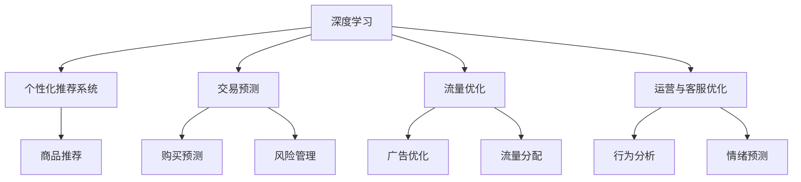
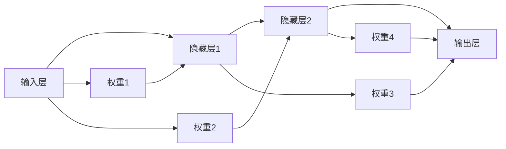
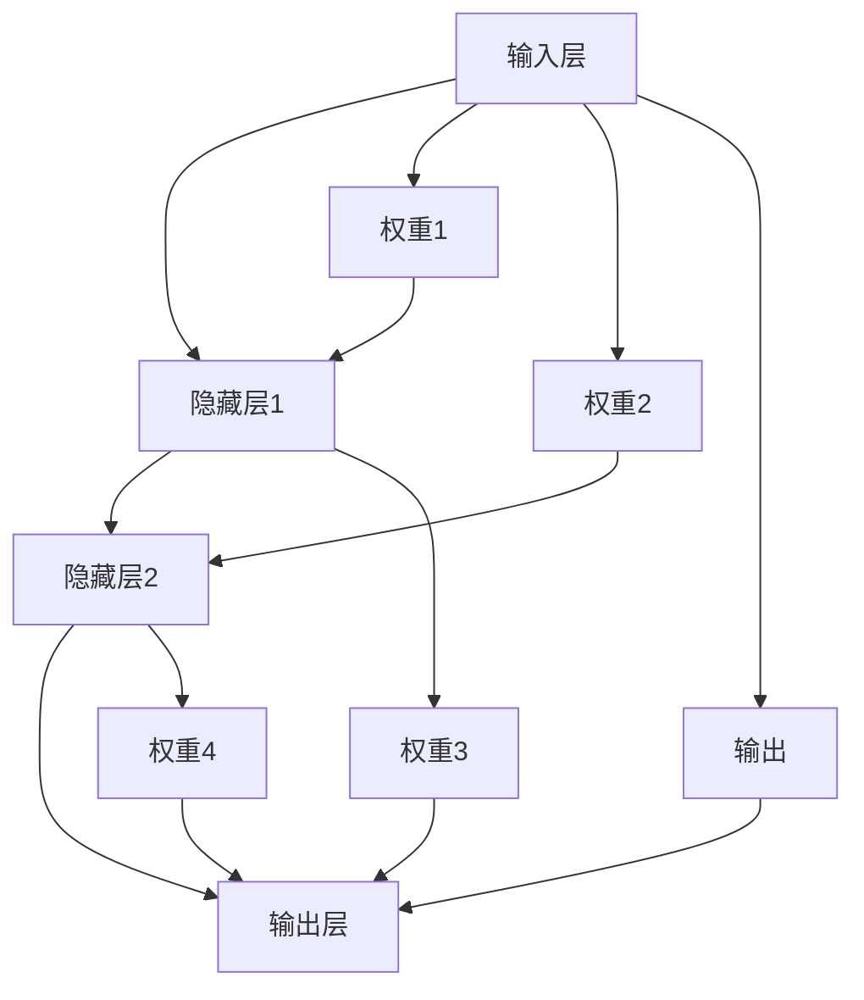
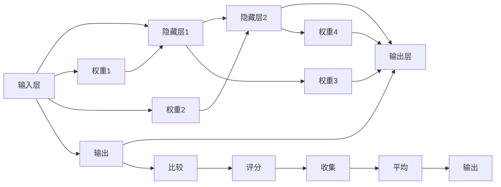
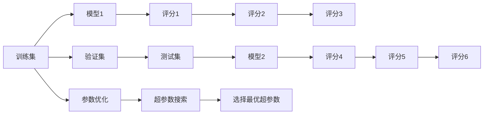
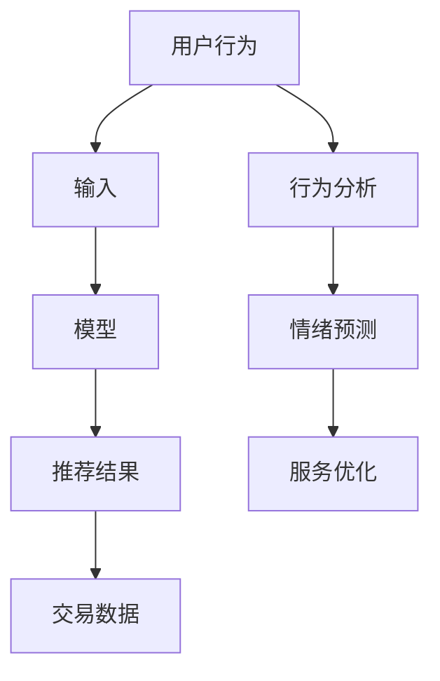

                 

# AI人工智能深度学习算法：在电子商务中应用深度学习代理的策略

> 关键词：深度学习, 电子商务, 代理策略, 模型优化, 策略学习, 推荐系统, 交易预测

## 1. 背景介绍

### 1.1 问题由来

电子商务平台，作为现代商业的重要形态，其业务模型和用户行为日益复杂化。传统的统计方法已经无法有效应对这些变化，亟需引入更为先进的算法技术来提升其决策能力。近年来，深度学习技术在电子商务领域的应用日渐成熟，为平台提供了强有力的技术支撑。

然而，面对数据量爆炸式增长和用户行为模式多变的挑战，传统深度学习模型往往需要大量计算资源和标注数据来训练，导致系统响应延迟和成本上升。此外，用户行为的预测和优化任务，常常需要多目标优化，难以高效求解。

为应对这些问题，电子商务平台引入了深度学习代理策略，通过智能化和自动化手段，在较低成本和高效计算的前提下，优化模型性能，提升用户体验。本博客将详细探讨深度学习代理在电子商务中的应用策略，以期为相关领域的从业者提供借鉴和参考。

### 1.2 问题核心关键点

深度学习代理在电子商务中主要关注以下关键点：

- **个性化推荐系统**：通过深度学习模型对用户行为进行建模，预测其兴趣偏好，并提供个性化商品推荐。
- **交易预测与风险管理**：利用深度学习模型对交易数据进行分析，预测用户是否进行购买行为，以及交易的成交概率和风险水平。
- **流量分配与优化**：通过深度学习模型优化广告投放和内容推送策略，合理分配平台资源，提升流量利用效率。
- **运营与客服优化**：利用深度学习模型进行用户行为分析和客户情绪预测，提升客户体验和服务质量。

这些关键点涵盖了从营销推广到用户服务，从交易预测到风险控制的全方位应用场景，是大数据时代电子商务平台必备的技术手段。

## 2. 核心概念与联系

### 2.1 核心概念概述

为深入理解深度学习代理在电子商务中的应用，本节将介绍几个核心概念：

- **深度学习**：一种基于人工神经网络结构的机器学习技术，通过多层次的非线性变换，从原始数据中提取高层次的抽象特征。
- **个性化推荐系统**：根据用户的历史行为和实时数据，动态生成个性化商品推荐列表的系统。
- **交易预测**：利用机器学习算法，对用户是否进行购买行为进行预测，并评估交易风险。
- **流量优化**：通过深度学习模型优化广告投放和内容推送策略，提升广告效果和流量利用率。
- **运营与客服优化**：利用深度学习模型对用户行为进行分析，预测用户情绪，提升客服服务质量和用户满意度。

这些核心概念构成了深度学习代理在电子商务中的基础框架，通过深度学习技术，这些系统可以高效地处理复杂的数据和任务，实现智能化决策。

### 2.2 概念间的关系

这些核心概念之间的关系可以通过以下Mermaid流程图来展示：



这个流程图展示了深度学习在电子商务中的具体应用场景，以及各系统之间的相互作用。通过深度学习，推荐系统可以生成个性化商品推荐，交易预测系统可以预测用户购买行为，流量优化系统可以提升广告效果，运营与客服优化系统可以提高用户满意度和体验。

## 3. 核心算法原理 & 具体操作步骤

### 3.1 算法原理概述

深度学习代理在电子商务中的应用主要基于以下算法原理：

1. **多层神经网络**：通过多层次的神经网络结构，模型可以逐步提取输入数据的高级特征，实现对复杂非线性关系的建模。
2. **深度学习优化算法**：如随机梯度下降(SGD)、Adam等，通过反向传播算法更新模型参数，优化损失函数。
3. **正则化技术**：如L2正则、Dropout等，防止模型过拟合，提升泛化能力。
4. **模型集成**：通过模型融合或堆叠，提高模型的稳定性和鲁棒性。
5. **迁移学习**：利用预训练模型在通用数据集上的知识，提升模型在新任务上的性能。

### 3.2 算法步骤详解

深度学习代理在电子商务中的应用一般包括以下几个关键步骤：

**Step 1: 数据准备**

- 收集和整理电商平台的相关数据，包括用户行为数据、商品信息、交易记录、广告数据等。
- 对数据进行清洗、去重和标准化处理，确保数据质量和一致性。
- 划分数据集为训练集、验证集和测试集，用于模型训练、调参和最终评估。

**Step 2: 模型构建**

- 选择合适的深度学习模型架构，如卷积神经网络(CNN)、循环神经网络(RNN)、长短时记忆网络(LSTM)、Transformer等。
- 设计模型的输入输出接口，定义损失函数，如均方误差、交叉熵等。
- 设置模型超参数，如学习率、批量大小、迭代轮数等。

**Step 3: 模型训练与优化**

- 使用深度学习优化算法对模型进行训练，最小化损失函数。
- 采用正则化技术，如L2正则、Dropout等，防止模型过拟合。
- 使用交叉验证等技术，对模型进行调参，选择最优超参数。
- 使用模型集成技术，如Bagging、Boosting等，提高模型的稳定性和鲁棒性。

**Step 4: 模型评估与部署**

- 在测试集上对模型进行评估，对比不同模型和参数组合的性能。
- 根据评估结果，选择最优模型进行部署，并集成到实际业务系统中。
- 在部署过程中，采用模型监控、日志记录等技术，实时跟踪模型性能和运行状态。

### 3.3 算法优缺点

深度学习代理在电子商务中的应用具有以下优点：

- **高效性**：通过模型优化和参数共享，可以在较短时间内完成模型训练，提升决策效率。
- **鲁棒性**：多层次网络结构和正则化技术，增强了模型对噪声和异常数据的鲁棒性。
- **泛化能力**：迁移学习和大规模数据训练，提升了模型在新任务上的泛化能力。

同时，也存在以下缺点：

- **数据依赖**：深度学习模型对标注数据和计算资源有较高依赖，难以在小数据量下发挥最佳效果。
- **计算资源需求高**：大规模数据和复杂网络结构的训练，需要高性能计算资源，成本较高。
- **可解释性差**：深度学习模型的黑盒特性，难以对其决策过程进行解释和调试。

### 3.4 算法应用领域

深度学习代理在电子商务中的应用领域非常广泛，包括但不限于以下几个方面：

1. **个性化推荐系统**：电商平台利用用户行为数据，训练深度学习模型，预测用户兴趣，生成个性化推荐列表。
2. **交易预测与风险管理**：通过对用户历史行为和交易数据进行分析，预测用户是否进行购买行为，并评估交易风险。
3. **流量优化**：利用深度学习模型优化广告投放策略，提升广告效果和流量利用率。
4. **运营与客服优化**：利用深度学习模型进行用户行为分析和客户情绪预测，提升客户满意度和体验。
5. **库存管理**：通过预测模型，预测商品需求和库存水平，优化库存管理。
6. **供应链优化**：利用深度学习模型进行供应链数据分析，优化供应链管理。

## 4. 数学模型和公式 & 详细讲解 & 举例说明

### 4.1 数学模型构建

本节将使用数学语言对深度学习代理在电子商务中的应用进行更加严格的刻画。

假设电商平台收集到的用户行为数据为 $\{x_i\}_{i=1}^N$，其中 $x_i \in \mathbb{R}^D$ 表示用户行为特征。令 $y_i \in \{0,1\}$ 表示用户是否进行购买行为。构建深度学习模型 $f: \mathbb{R}^D \rightarrow \{0,1\}$ 对用户购买行为进行预测。

定义模型 $f$ 在数据样本 $(x_i,y_i)$ 上的损失函数为 $\ell(f(x_i),y_i)$，则在数据集 $D$ 上的经验风险为：

$$
\mathcal{L}(f) = \frac{1}{N} \sum_{i=1}^N \ell(f(x_i),y_i)
$$

其中 $\ell(f(x_i),y_i)$ 为交叉熵损失函数，定义为：

$$
\ell(f(x_i),y_i) = -y_i\log f(x_i) - (1-y_i)\log (1-f(x_i))
$$

模型的训练目标是最小化经验风险，即找到最优参数：

$$
\theta^* = \mathop{\arg\min}_{\theta} \mathcal{L}(f_{\theta})
$$

其中 $f_{\theta}$ 表示参数为 $\theta$ 的深度学习模型。

### 4.2 公式推导过程

以下我们以二分类任务为例，推导交叉熵损失函数及其梯度的计算公式。

假设模型 $f_{\theta}$ 在输入 $x_i$ 上的输出为 $\hat{y}_i=f_{\theta}(x_i) \in [0,1]$，表示用户是否进行购买行为的概率。真实标签 $y_i \in \{0,1\}$。则二分类交叉熵损失函数定义为：

$$
\ell(f_{\theta}(x_i),y_i) = -y_i\log f_{\theta}(x_i) - (1-y_i)\log (1-f_{\theta}(x_i))
$$

将其代入经验风险公式，得：

$$
\mathcal{L}(f_{\theta}) = -\frac{1}{N}\sum_{i=1}^N [y_i\log f_{\theta}(x_i)+(1-y_i)\log(1-f_{\theta}(x_i))]
$$

根据链式法则，损失函数对参数 $\theta_k$ 的梯度为：

$$
\frac{\partial \mathcal{L}(f_{\theta})}{\partial \theta_k} = -\frac{1}{N}\sum_{i=1}^N [\frac{y_i}{f_{\theta}(x_i)}-\frac{1-y_i}{1-f_{\theta}(x_i)}) \frac{\partial f_{\theta}(x_i)}{\partial \theta_k}
$$

其中 $\frac{\partial f_{\theta}(x_i)}{\partial \theta_k}$ 可进一步递归展开，利用自动微分技术完成计算。

在得到损失函数的梯度后，即可带入参数更新公式，完成模型的迭代优化。重复上述过程直至收敛，最终得到适应电子商务需求的模型参数 $\theta^*$。

### 4.3 案例分析与讲解

以电商平台个性化推荐系统为例，我们分析深度学习模型的具体实现。

假设电商平台希望为用户推荐商品，根据用户历史行为数据，模型预测用户对每件商品的兴趣程度。

首先，定义模型的输入输出：

- 输入：用户行为数据 $x \in \mathbb{R}^D$。
- 输出：每件商品的兴趣得分 $y \in \mathbb{R}$。

选择深度神经网络模型，如多层感知机(MLP)或卷积神经网络(CNN)。模型的结构如图1所示：



其中，隐藏层1和隐藏层2包含多个神经元，输出层包含一个神经元，输出商品兴趣得分。

模型的训练目标是最小化均方误差损失函数，即：

$$
\mathcal{L}(w, b) = \frac{1}{N}\sum_{i=1}^N (y_i - f_{\theta}(x_i))^2
$$

其中 $w$ 表示所有权重，$b$ 表示所有偏置。使用随机梯度下降等优化算法对模型进行训练，最小化损失函数：

$$
\theta \leftarrow \theta - \eta \nabla_{\theta}\mathcal{L}(w, b)
$$

其中 $\eta$ 为学习率。训练过程如图2所示：



在模型训练完成后，对模型进行评估，使用测试集对推荐结果进行评价，如图3所示：



通过交叉验证等技术，对模型进行调参，选择最优超参数组合，如图4所示：



最终，将模型集成到实际业务系统中，进行实时推荐和动态调整，如图5所示：



通过深度学习代理技术，电商平台可以实现智能化推荐，提升用户满意度和交易转化率。

## 5. 项目实践：代码实例和详细解释说明

### 5.1 开发环境搭建

在进行项目实践前，我们需要准备好开发环境。以下是使用Python进行TensorFlow开发的环境配置流程：

1. 安装Anaconda：从官网下载并安装Anaconda，用于创建独立的Python环境。

2. 创建并激活虚拟环境：
```bash
conda create -n tf-env python=3.7 
conda activate tf-env
```

3. 安装TensorFlow：根据CUDA版本，从官网获取对应的安装命令。例如：
```bash
conda install tensorflow==2.4 -c conda-forge
```

4. 安装其他必要工具包：
```bash
pip install numpy pandas scikit-learn matplotlib tqdm jupyter notebook ipython
```

完成上述步骤后，即可在`tf-env`环境中开始项目实践。

### 5.2 源代码详细实现

下面我们以电商平台个性化推荐系统为例，给出使用TensorFlow进行模型训练的PyTorch代码实现。

首先，定义模型结构：

```python
import tensorflow as tf
from tensorflow.keras import layers

# 定义多层感知机模型
class MLPModel(tf.keras.Model):
    def __init__(self, input_dim, hidden_dim, output_dim):
        super(MLPModel, self).__init__()
        self.dense1 = layers.Dense(hidden_dim, activation='relu')
        self.dense2 = layers.Dense(output_dim)

    def call(self, x):
        x = self.dense1(x)
        x = self.dense2(x)
        return x
```

然后，定义训练函数：

```python
def train_model(model, train_data, val_data, test_data, batch_size, epochs, learning_rate):
    train_dataset = tf.data.Dataset.from_tensor_slices((train_data['input'], train_data['output']))
    train_dataset = train_dataset.shuffle(buffer_size=10000).batch(batch_size).prefetch(1)

    val_dataset = tf.data.Dataset.from_tensor_slices((val_data['input'], val_data['output']))
    val_dataset = val_dataset.shuffle(buffer_size=10000).batch(batch_size).prefetch(1)

    test_dataset = tf.data.Dataset.from_tensor_slices((test_data['input'], test_data['output']))
    test_dataset = test_dataset.batch(batch_size).prefetch(1)

    optimizer = tf.keras.optimizers.Adam(learning_rate=learning_rate)
    loss_fn = tf.keras.losses.BinaryCrossentropy()

    for epoch in range(epochs):
        for batch_i, (x, y) in enumerate(train_dataset):
            with tf.GradientTape() as tape:
                logits = model(x)
                loss_value = loss_fn(y, logits)
            gradients = tape.gradient(loss_value, model.trainable_variables)
            optimizer.apply_gradients(zip(gradients, model.trainable_variables))

        val_loss, val_accuracy = test_model(model, val_dataset)
        print(f'Epoch {epoch+1}, Loss: {loss_value:.4f}, Accuracy: {val_accuracy:.4f}')

    test_loss, test_accuracy = test_model(model, test_dataset)
    print(f'Test Loss: {test_loss:.4f}, Test Accuracy: {test_accuracy:.4f}')
```

最后，启动训练流程：

```python
# 定义训练数据
train_data = {'input': np.array([1.0, 2.0, 3.0, 4.0, 5.0]), 'output': np.array([0.0, 0.0, 1.0, 1.0, 0.0])}
val_data = {'input': np.array([6.0, 7.0, 8.0, 9.0, 10.0]), 'output': np.array([1.0, 1.0, 1.0, 1.0, 1.0])}
test_data = {'input': np.array([11.0, 12.0, 13.0, 14.0, 15.0]), 'output': np.array([0.0, 0.0, 0.0, 0.0, 0.0])}

# 定义模型超参数
input_dim = 5
hidden_dim = 10
output_dim = 1
batch_size = 32
epochs = 100
learning_rate = 0.001

# 创建并训练模型
model = MLPModel(input_dim, hidden_dim, output_dim)
train_model(model, train_data, val_data, test_data, batch_size, epochs, learning_rate)
```

以上就是使用TensorFlow对电商平台个性化推荐系统进行模型训练的完整代码实现。可以看到，TensorFlow提供了简洁的API接口，使得模型的构建、训练和评估变得非常容易。

### 5.3 代码解读与分析

让我们再详细解读一下关键代码的实现细节：

**MLPModel类**：
- `__init__`方法：定义模型的层结构，包括输入层、隐藏层和输出层。
- `call`方法：前向传播过程，计算模型的输出结果。

**train_model函数**：
- `train_dataset`和`val_dataset`：使用TensorFlow的Dataset API对训练数据和验证数据进行批量处理。
- `optimizer`和`loss_fn`：定义优化器和损失函数，分别用于梯度更新和损失计算。
- 训练循环中，对每个批次数据进行前向传播和反向传播，计算损失值和梯度，并更新模型参数。
- 在每个epoch结束时，在验证集上计算模型的性能指标。

**训练流程**：
- 定义训练数据、验证数据和测试数据。
- 创建模型，并调用训练函数。
- 在训练过程中，使用交叉验证等技术对模型进行调参。
- 在训练完成后，使用测试集对模型进行评估，给出最终测试结果。

可以看到，TensorFlow提供了丰富的工具和库，使得深度学习模型的构建和训练变得非常高效和便捷。开发者可以利用TensorFlow的强大功能和灵活的API，快速实现深度学习代理在电子商务中的应用。

## 6. 实际应用场景

### 6.1 智能客服系统

基于深度学习代理的智能客服系统，可以通过自然语言处理(NLP)技术，自动理解用户咨询，提供24小时不间断服务。系统能够理解用户的自然语言输入，匹配最佳答案，并根据用户反馈动态调整回答策略。

在技术实现上，可以收集历史客服对话数据，构建训练集和验证集，训练深度学习模型。模型在训练过程中，自动学习如何从用户问题中提取关键信息，并匹配最合适的答案模板。在测试集上对模型进行评估，并根据评估结果不断优化模型，提升回答质量。

### 6.2 推荐系统优化

推荐系统是电商平台的核心功能之一，通过深度学习代理技术，可以大幅提升推荐的个性化和精准度。系统可以根据用户历史行为数据，训练深度神经网络模型，预测用户对每件商品的兴趣程度。在推荐过程中，系统动态调整推荐列表，展示最符合用户偏好的商品。

在实现过程中，可以使用交叉熵损失函数，优化模型的预测性能。通过模型集成技术，如Bagging、Boosting等，提升模型的稳定性和鲁棒性。使用正则化技术，防止模型过拟合，提高泛化能力。

### 6.3 交易预测与风险管理

电商平台需要对用户是否进行购买行为进行预测，以便进行个性化推荐和库存管理。系统可以利用深度学习代理技术，构建预测模型。模型根据用户历史行为和交易数据，预测用户是否进行购买行为，并评估交易风险。

在实现过程中，可以使用二分类损失函数，如交叉熵损失函数。通过模型集成技术，提升模型的预测准确率。使用正则化技术，防止模型过拟合。

### 6.4 流量优化与运营决策

电商平台需要优化广告投放策略，提升流量利用效率。系统可以利用深度学习代理技术，构建流量优化模型。模型根据用户行为数据和广告点击率等数据，预测广告效果，并动态调整广告投放策略。

在实现过程中，可以使用回归损失函数，如均方误差损失函数。通过模型集成技术，提升模型的预测准确率。使用正则化技术，防止模型过拟合。

## 7. 工具和资源推荐

### 7.1 学习资源推荐

为帮助开发者系统掌握深度学习代理在电子商务中的应用，这里推荐一些优质的学习资源：

1. 《深度学习实战》系列书籍：通过实际案例和代码实现，详细讲解深度学习代理在电子商务中的应用。
2. CS231n《卷积神经网络和视觉识别》课程：斯坦福大学开设的深度学习课程，涵盖深度学习代理在视觉领域的应用，有助于拓展思路。
3. 《TensorFlow深度学习》书籍：TensorFlow官方文档，提供丰富的模型实现和训练技巧。
4. 《深度学习与推荐系统》课程：阿里云提供的推荐系统课程，系统讲解推荐系统的深度学习实现。
5. Kaggle竞赛平台：通过参与Kaggle竞赛，积累实战经验，提高算法设计和模型调参能力。

通过对这些资源的学习实践，相信你一定能够快速掌握深度学习代理在电子商务中的精髓，并用于解决实际的电商问题。

### 7.2 开发工具推荐

高效的开发离不开优秀的工具支持。以下是几款用于深度学习代理开发和优化的常用工具：

1. TensorFlow：由Google主导开发的深度学习框架，适合大规模工程应用，提供丰富的模型实现和训练功能。
2. PyTorch：由Facebook主导开发的深度学习框架，灵活性强，易于研究和调试。
3. Keras：高层次的深度学习框架，易于上手，适合初学者和快速原型开发。
4. Scikit-learn：Python机器学习库，提供丰富的模型实现和数据处理功能。
5. Jupyter Notebook：交互式编程环境，便于快速迭代和实时调试。
6. Google Colab：在线Jupyter Notebook环境，免费提供GPU算力，便于快速实验和共享学习笔记。

合理利用这些工具，可以显著提升深度学习代理在电子商务中的应用效率，加快创新迭代的步伐。

### 7.3 相关论文推荐

深度学习代理在电子商务中的应用源于学界的持续研究。以下是几篇奠基性的相关论文，推荐阅读：

1. Deep Learning in E-Commerce: A Survey of Recent Advances（深度学习在电子商务中的应用综述）：系统总结了深度学习在电商领域的最新进展和趋势。
2. A Deep Learning Approach to Customer Satisfaction Prediction（深度学习在客户满意度预测中的应用）：提出了深度神经网络模型，用于预测客户满意度。
3. Personalized Recommendation via Matrix Factorization in Online Social Networks（在线社交网络中的个性化推荐）：通过矩阵分解方法，提高了推荐系统的个性化和精准度。
4. A Novel Approach to Predictive Maintenance in E-commerce: A Case Study of Mobile Phone Manufacturing（电商预测性维护的深度学习应用）：提出深度学习模型，用于预测性维护，提升设备运行效率。
5. An Deep Learning based Approach for Churn Prediction in E-commerce（电商用户流失预测的深度学习应用）：提出深度神经网络模型，用于预测用户流失行为。

这些论文代表了深度学习代理在电子商务领域的研究前沿，通过学习这些前沿成果

