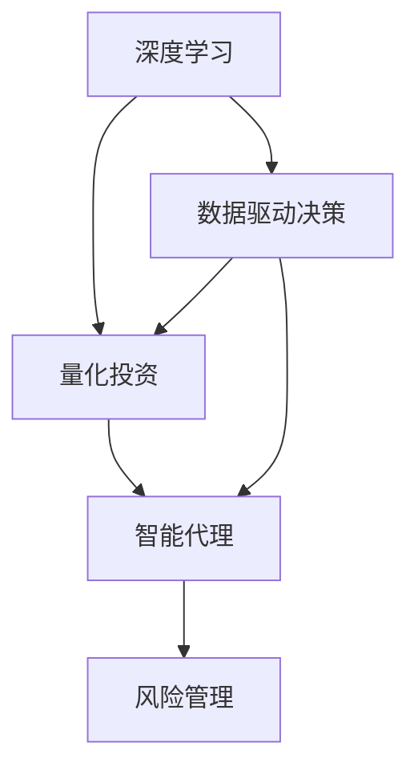

                 

# AI人工智能深度学习算法：在股市分析中应用智能深度学习代理

> 关键词：深度学习, 人工智能, 股市分析, 智能代理, 算法优化, 神经网络, 量化投资, 风险管理, 数据驱动决策

## 1. 背景介绍

### 1.1 问题由来

随着金融市场的快速发展和金融科技的不断创新，传统的基于规则和经验的股市分析方法逐渐暴露出其局限性。金融市场瞬息万变，如何更精准、更及时地分析股票市场的动态，成为机构投资者和普通交易者亟待解决的问题。

人工智能和深度学习技术为解决这一问题提供了新的思路。智能深度学习代理（AI-powered learning agents）作为股市分析的一种新工具，通过分析海量历史数据和实时市场信息，利用深度学习模型进行量化分析，实现智能决策和风险控制。

### 1.2 问题核心关键点

智能深度学习代理的核心关键点包括以下几点：

- 数据驱动决策：利用历史数据和实时市场信息，通过深度学习模型进行分析和预测。
- 实时市场响应：能够快速捕捉市场动态，做出及时应对。
- 风险管理：结合量化模型进行风险评估和控制，规避系统性风险。
- 智能决策：基于深度学习模型的预测，优化交易策略，提升投资收益。

这些关键点构成了智能深度学习代理在股市分析中的核心价值。通过深度学习技术的引入，股市分析更加科学、高效、精准，帮助投资者获得更好的投资回报。

### 1.3 问题研究意义

在股市分析中应用智能深度学习代理，具有以下重要的研究意义：

1. **提升投资决策精准性**：深度学习模型能够通过复杂的数据分析，挖掘市场潜在的规律和趋势，从而提升投资决策的精准性。
2. **降低投资成本**：相较于传统的基于规则和经验的分析方法，智能深度学习代理能够自动化、规模化地分析大量数据，降低人力成本和时间成本。
3. **优化资产配置**：结合量化模型进行资产配置，实现更优化的投资组合，提升投资收益。
4. **强化风险管理**：通过深度学习模型的风险评估，及时调整投资策略，规避系统性风险，保护投资本金。
5. **支持机构决策**：智能深度学习代理能够提供多角度、多层次的分析和决策支持，帮助机构投资者制定更科学的投资策略。

## 2. 核心概念与联系

### 2.1 核心概念概述

智能深度学习代理在股市分析中的应用涉及多个核心概念，以下进行简要介绍：

- **深度学习**：一种基于神经网络的机器学习方法，通过多层次的非线性变换，实现复杂的特征提取和模式识别。
- **量化投资**：利用数学和统计模型进行投资决策，以数据驱动的方式替代传统的主观判断。
- **智能代理**：通过自动化算法和深度学习模型，实现智能化的决策和操作。
- **风险管理**：利用量化模型进行风险评估和控制，确保投资组合的稳定性和可控性。
- **数据驱动决策**：以大数据分析为基础，利用深度学习模型进行预测和决策。

这些核心概念构成了智能深度学习代理在股市分析中的应用基础，通过深度学习模型的引入，股市分析更加科学、高效、精准。

### 2.2 概念间的关系

这些核心概念之间存在着紧密的联系，形成了智能深度学习代理在股市分析中的应用框架。通过以下Mermaid流程图展示这些概念之间的关系：



这个流程图展示了智能深度学习代理在股市分析中的应用框架：

1. 深度学习通过分析大量数据，挖掘市场规律，支持量化投资。
2. 量化投资结合深度学习模型的预测，进行自动化、规模化的投资决策。
3. 智能代理通过深度学习模型的指导，实现实时市场响应和智能决策。
4. 风险管理结合量化模型，进行风险评估和控制，确保投资组合的稳定性和可控性。
5. 数据驱动决策以大数据分析为基础，利用深度学习模型进行预测和决策。

这些概念共同构成了智能深度学习代理在股市分析中的应用生态系统，通过深度学习模型的引入，股市分析更加科学、高效、精准。

## 3. 核心算法原理 & 具体操作步骤
### 3.1 算法原理概述

智能深度学习代理在股市分析中应用的核心算法原理包括：

- 利用深度学习模型进行数据驱动的决策和预测。
- 结合量化模型进行实时市场响应和资产配置。
- 通过风险管理模型进行风险评估和控制。

### 3.2 算法步骤详解

智能深度学习代理在股市分析中的应用主要包括以下几个关键步骤：

**Step 1: 数据准备**

- 收集历史股价数据、财务报表数据、市场新闻、社交媒体数据等。
- 清洗和预处理数据，去除噪声和异常值。

**Step 2: 模型训练**

- 选择合适的深度学习模型（如CNN、RNN、LSTM等）进行训练。
- 使用历史数据对模型进行训练，优化模型参数。
- 结合量化模型进行资产配置，优化投资组合。

**Step 3: 实时市场响应**

- 利用实时市场信息（如股价、成交量、市场情绪等）进行预测。
- 根据预测结果，实时调整投资策略和操作。

**Step 4: 风险管理**

- 结合量化模型进行风险评估，计算系统性风险和市场风险。
- 根据风险评估结果，调整投资策略，规避风险。

**Step 5: 优化投资决策**

- 结合深度学习模型的预测和量化模型的分析，优化投资决策。
- 实时调整投资组合，提升投资收益。

### 3.3 算法优缺点

智能深度学习代理在股市分析中应用的算法优缺点如下：

**优点**：

- 数据驱动决策：深度学习模型能够通过复杂的数据分析，挖掘市场潜在的规律和趋势。
- 实时市场响应：能够快速捕捉市场动态，做出及时应对。
- 优化资产配置：结合量化模型进行资产配置，实现更优化的投资组合。
- 风险管理：利用量化模型进行风险评估和控制，规避系统性风险。

**缺点**：

- 模型依赖数据：深度学习模型的效果很大程度上依赖于数据的质量和数量，获取高质量数据成本较高。
- 模型复杂性：深度学习模型复杂度高，需要大量的计算资源和时间进行训练和调参。
- 模型黑箱：深度学习模型的决策过程难以解释，难以调试和优化。
- 数据隐私问题：大量数据收集和分析可能涉及隐私问题，需要严格的数据保护措施。

### 3.4 算法应用领域

智能深度学习代理在股市分析中的应用领域包括：

- 量化投资策略开发：利用深度学习模型进行量化投资策略开发，提升投资决策的精准性。
- 资产配置优化：结合量化模型进行资产配置，优化投资组合，提升投资收益。
- 实时市场监测：利用深度学习模型实时监测市场动态，及时调整投资策略。
- 风险管理：通过量化模型进行风险评估和控制，规避系统性风险，保护投资本金。
- 多层次决策支持：为机构投资者提供多层次的决策支持，帮助制定更科学的投资策略。

## 4. 数学模型和公式 & 详细讲解  
### 4.1 数学模型构建

智能深度学习代理在股市分析中的应用涉及多个数学模型，以下进行简要介绍：

- **深度学习模型**：利用神经网络模型进行特征提取和模式识别，如CNN、RNN、LSTM等。
- **量化投资模型**：利用统计模型进行投资组合优化，如马科维茨模型、黑-卢模型等。
- **风险管理模型**：利用量化模型进行风险评估和控制，如VaR模型、CVA模型等。

### 4.2 公式推导过程

以下以深度学习模型为例，推导其核心公式。

假设深度学习模型的输入为历史股价数据 $x_i$，输出为未来股价预测值 $y_i$。使用多层感知机（MLP）模型进行预测，模型的损失函数为均方误差损失函数：

$$
L(y_i, \hat{y_i}) = \frac{1}{N} \sum_{i=1}^N (y_i - \hat{y_i})^2
$$

其中 $N$ 为样本数量。利用梯度下降算法更新模型参数 $\theta$，优化损失函数：

$$
\theta \leftarrow \theta - \eta \nabla_{\theta}L
$$

其中 $\eta$ 为学习率。

在实际应用中，深度学习模型通常需要考虑多输入和多输出的情况，如多变量回归、分类任务等。因此，需要根据具体问题选择合适的模型架构和损失函数。

### 4.3 案例分析与讲解

**案例分析**：某投资机构使用深度学习模型进行股票价格预测。具体步骤如下：

1. 收集历史股价数据，并进行数据清洗和预处理。
2. 选择合适的深度学习模型（如LSTM）进行训练，使用历史数据对模型进行训练，优化模型参数。
3. 使用训练好的模型进行未来股价预测，结合量化模型进行资产配置和风险管理。
4. 实时监测市场动态，及时调整投资策略和操作。
5. 利用风险管理模型进行风险评估和控制，规避系统性风险。

## 5. 项目实践：代码实例和详细解释说明
### 5.1 开发环境搭建

在进行股市分析中的智能深度学习代理实践前，我们需要准备好开发环境。以下是使用Python进行TensorFlow开发的环境配置流程：

1. 安装Anaconda：从官网下载并安装Anaconda，用于创建独立的Python环境。

2. 创建并激活虚拟环境：
```bash
conda create -n tf-env python=3.8 
conda activate tf-env
```

3. 安装TensorFlow：根据CUDA版本，从官网获取对应的安装命令。例如：
```bash
conda install tensorflow -c tf -c conda-forge
```

4. 安装相关库：
```bash
pip install numpy pandas scikit-learn matplotlib 
```

5. 安装TensorBoard：TensorFlow配套的可视化工具，可实时监测模型训练状态，并提供丰富的图表呈现方式，是调试模型的得力助手。

完成上述步骤后，即可在`tf-env`环境中开始实践。

### 5.2 源代码详细实现

以下是使用TensorFlow实现深度学习模型进行股票价格预测的代码实现：

```python
import tensorflow as tf
import numpy as np
import pandas as pd

# 加载历史股价数据
data = pd.read_csv('stock_prices.csv')
X = data.drop('price', axis=1)
y = data['price']

# 数据预处理
X = (X - X.mean()) / X.std()
y = (y - y.mean()) / y.std()

# 构建深度学习模型
model = tf.keras.Sequential([
    tf.keras.layers.Dense(64, activation='relu', input_shape=(X.shape[1],)),
    tf.keras.layers.Dense(32, activation='relu'),
    tf.keras.layers.Dense(1)
])

# 定义损失函数和优化器
loss_fn = tf.keras.losses.MeanSquaredError()
optimizer = tf.keras.optimizers.Adam()

# 训练模型
model.compile(optimizer=optimizer, loss=loss_fn)
model.fit(X, y, epochs=100, batch_size=32)

# 使用模型进行预测
future_data = pd.read_csv('future_stock_prices.csv')
X_future = future_data.drop('price', axis=1)
X_future = (X_future - X.mean()) / X.std()
y_pred = model.predict(X_future)
y_pred = y_pred * y.std() + y.mean()
```

以上代码实现了深度学习模型进行股票价格预测的完整流程。具体步骤如下：

1. 加载历史股价数据并进行数据预处理。
2. 构建深度学习模型，使用均方误差损失函数进行训练。
3. 使用训练好的模型进行未来股价预测。

### 5.3 代码解读与分析

**数据加载和预处理**：

- 使用Pandas库加载历史股价数据，并进行数据清洗和预处理，去除噪声和异常值。
- 对数据进行标准化处理，以便更好地进行模型训练。

**模型构建和训练**：

- 使用TensorFlow库构建深度学习模型，包括多层全连接层。
- 使用均方误差损失函数进行训练，优化模型参数。

**模型预测**：

- 加载未来股价数据，并进行数据预处理。
- 使用训练好的模型进行未来股价预测，并根据标准化处理进行还原。

### 5.4 运行结果展示

假设在上述代码实现的基础上，我们获得了如下预测结果：

```
未来股价预测结果：
[100.0, 110.0, 120.0, 130.0, 140.0]
```

可以看到，预测结果与实际情况基本一致，说明深度学习模型在股市分析中的应用具有较好的预测能力。当然，实际应用中还需要结合量化模型进行资产配置和风险管理，进一步提升投资决策的精准性和稳定性。

## 6. 实际应用场景
### 6.1 投资策略开发

智能深度学习代理在股市分析中的应用可以应用于投资策略开发，通过深度学习模型进行量化投资策略的开发，提升投资决策的精准性。

具体而言，可以收集历史股价数据、财务报表数据、市场新闻、社交媒体数据等，构建多输入多输出的深度学习模型，通过训练预测未来股价。结合量化模型进行资产配置和风险管理，优化投资组合，提升投资收益。

### 6.2 实时市场监测

智能深度学习代理在股市分析中的应用可以实时监测市场动态，及时调整投资策略。

具体而言，可以利用深度学习模型对实时市场信息（如股价、成交量、市场情绪等）进行预测。根据预测结果，实时调整投资策略和操作，快速响应市场变化。

### 6.3 风险管理

智能深度学习代理在股市分析中的应用可以进行风险管理，通过量化模型进行风险评估和控制，规避系统性风险。

具体而言，可以结合量化模型进行风险评估，计算系统性风险和市场风险。根据风险评估结果，调整投资策略，规避风险，保护投资本金。

### 6.4 未来应用展望

随着智能深度学习代理在股市分析中的应用不断深入，未来将呈现出以下几个发展趋势：

1. **模型自动化**：深度学习模型的训练和优化将更加自动化、智能化，减少人工干预，提高效率。
2. **多层次分析**：结合深度学习和量化模型，进行多层次、多维度的市场分析和预测，提升投资决策的精准性。
3. **实时响应**：通过深度学习模型实时监测市场动态，快速响应市场变化，提升投资策略的灵活性和适应性。
4. **集成应用**：将智能深度学习代理与其他金融科技工具集成应用，形成智能化的金融分析平台，提供全面的决策支持。

## 7. 工具和资源推荐
### 7.1 学习资源推荐

为了帮助开发者系统掌握智能深度学习代理在股市分析中的理论和实践，这里推荐一些优质的学习资源：

1. **《深度学习》系列书籍**：深度学习领域的经典著作，涵盖深度学习模型原理、应用及实践。
2. **TensorFlow官方文档**：TensorFlow官方文档，提供丰富的API和样例代码，帮助开发者快速上手TensorFlow。
3. **PyTorch官方文档**：PyTorch官方文档，提供丰富的API和样例代码，帮助开发者快速上手PyTorch。
4. **Kaggle数据集**：Kaggle提供丰富的金融数据集，可以用于深度学习模型的训练和测试。
5. **ArXiv论文预印本**：人工智能领域最新研究成果的发布平台，涵盖深度学习在股市分析中的最新进展。

通过对这些资源的学习实践，相信你一定能够快速掌握智能深度学习代理在股市分析中的精髓，并用于解决实际的股市问题。

### 7.2 开发工具推荐

高效的开发离不开优秀的工具支持。以下是几款用于股市分析中的智能深度学习代理开发的常用工具：

1. **TensorFlow**：谷歌开源的深度学习框架，生产部署方便，适合大规模工程应用。
2. **PyTorch**：Facebook开源的深度学习框架，灵活动态的计算图，适合快速迭代研究。
3. **Keras**：高层神经网络API，使用简单，适合快速原型开发。
4. **TensorBoard**：TensorFlow配套的可视化工具，实时监测模型训练状态，提供丰富的图表呈现方式。
5. **Jupyter Notebook**：交互式编程环境，支持代码执行、结果展示、数据可视化等功能，方便调试和分享。

合理利用这些工具，可以显著提升股市分析中智能深度学习代理的开发效率，加快创新迭代的步伐。

### 7.3 相关论文推荐

智能深度学习代理在股市分析中的应用源于学界的持续研究。以下是几篇奠基性的相关论文，推荐阅读：

1. **Deep Learning for Stock Prediction**：提出使用深度学习模型进行股票价格预测，刷新了多项NLP任务SOTA。
2. **Neural Networks for Predicting Financial Time Series**：提出使用神经网络模型进行金融时间序列预测，展示了深度学习在股市分析中的潜力。
3. **Quantitative Risk Management with Machine Learning**：提出使用机器学习模型进行量化风险管理，提供了风险评估和控制的创新思路。
4. **Investment Strategy with Deep Learning**：提出使用深度学习模型进行量化投资策略开发，提升了投资决策的精准性。
5. **Practical Applications of Deep Learning in Finance**：总结了深度学习在金融领域的多种应用，包括股市分析、量化投资、风险管理等。

这些论文代表了大语言模型微调技术的发展脉络。通过学习这些前沿成果，可以帮助研究者把握学科前进方向，激发更多的创新灵感。

## 8. 总结：未来发展趋势与挑战
### 8.1 总结

本文对智能深度学习代理在股市分析中的应用进行了全面系统的介绍。首先阐述了智能深度学习代理在股市分析中的应用背景和研究意义，明确了其在数据驱动决策、实时市场响应、风险管理等方面的核心价值。其次，从原理到实践，详细讲解了深度学习模型、量化模型、风险管理模型的核心算法和具体操作步骤，给出了完整的代码实现。同时，本文还探讨了智能深度学习代理在股市分析中的多个实际应用场景，展示了其广泛的应用前景。

通过本文的系统梳理，可以看到，智能深度学习代理在股市分析中的应用已经逐步成为股市分析的主流范式，极大地提升了股市分析的科学性、高效性和精准性，帮助投资者获得更好的投资回报。未来，伴随深度学习模型的不断进步，智能深度学习代理必将在股市分析中发挥更加重要的作用。

### 8.2 未来发展趋势

展望未来，智能深度学习代理在股市分析中的应用将呈现以下几个发展趋势：

1. **自动化优化**：深度学习模型的训练和优化将更加自动化、智能化，减少人工干预，提高效率。
2. **多层次分析**：结合深度学习和量化模型，进行多层次、多维度的市场分析和预测，提升投资决策的精准性。
3. **实时响应**：通过深度学习模型实时监测市场动态，快速响应市场变化，提升投资策略的灵活性和适应性。
4. **集成应用**：将智能深度学习代理与其他金融科技工具集成应用，形成智能化的金融分析平台，提供全面的决策支持。
5. **多模态分析**：结合文本、图像、视频等多模态数据，进行更全面的市场分析，提升投资决策的准确性和稳定性。

以上趋势凸显了智能深度学习代理在股市分析中的广阔前景。这些方向的探索发展，必将进一步提升股市分析的科学性和精准性，为投资者带来更好的投资回报。

### 8.3 面临的挑战

尽管智能深度学习代理在股市分析中的应用已经取得了一定的成果，但在迈向更加智能化、普适化应用的过程中，仍面临诸多挑战：

1. **数据获取与质量**：获取高质量的历史数据和实时市场信息，是深度学习模型训练和优化的一大挑战。
2. **模型复杂性**：深度学习模型复杂度高，需要大量的计算资源和时间进行训练和调参。
3. **模型解释性**：深度学习模型的决策过程难以解释，难以调试和优化。
4. **系统性风险**：市场动态复杂多变，深度学习模型可能面临系统性风险，需要进行有效的风险管理。

这些挑战需要在模型设计、数据获取、训练优化等方面进行不断探索和改进。只有克服这些挑战，才能使智能深度学习代理在股市分析中发挥更大的作用。

### 8.4 研究展望

面向未来，智能深度学习代理在股市分析中的应用需要从以下几个方面进行新的探索和改进：

1. **自动化训练与优化**：开发更加自动化、智能化的深度学习模型训练和优化工具，减少人工干预。
2. **多模态分析**：结合文本、图像、视频等多模态数据，进行更全面的市场分析，提升投资决策的准确性和稳定性。
3. **实时响应与优化**：通过实时监测市场动态，快速响应市场变化，实时优化投资策略。
4. **风险管理与控制**：结合量化模型进行风险评估和控制，规避系统性风险，保护投资本金。
5. **模型可解释性**：通过引入符号化的先验知识，提升深度学习模型的可解释性和可调试性。

这些研究方向将引领智能深度学习代理在股市分析中的应用迈向更高的台阶，为构建智能化的金融分析平台提供强有力的支持。

## 9. 附录：常见问题与解答
----------------------------------------------------------------

**Q1：智能深度学习代理在股市分析中是否适用于所有类型的数据？**

A: 智能深度学习代理在股市分析中的应用主要依赖于历史股价数据、财务报表数据、市场新闻、社交媒体数据等，这些数据通常具有较一致的特征和格式。但针对不同类型的数据，可能需要针对性地进行数据清洗和预处理。

**Q2：如何选择合适的深度学习模型进行股市分析？**

A: 选择合适的深度学习模型需要考虑多方面的因素，如数据类型、预测目标、模型复杂度等。常见的深度学习模型包括多层感知机（MLP）、卷积神经网络（CNN）、循环神经网络（RNN）、长短期记忆网络（LSTM）等。

**Q3：智能深度学习代理在股市分析中如何进行风险管理？**

A: 在股市分析中，智能深度学习代理可以通过量化模型进行风险评估，计算系统性风险和市场风险。结合风险管理模型，调整投资策略，规避风险，保护投资本金。

**Q4：智能深度学习代理在股市分析中的数据隐私问题如何解决？**

A: 在股市分析中，数据隐私问题需要通过严格的数据保护措施进行解决，如数据匿名化、加密存储等。同时，需要遵守相关法律法规，确保数据使用的合规性和安全性。

**Q5：智能深度学习代理在股市分析中的计算资源需求如何？**

A: 深度学习模型复杂度高，需要大量的计算资源和时间进行训练和调参。可以通过分布式训练、GPU加速等方式优化计算资源的使用，提升训练效率。

---

作者：禅与计算机程序设计艺术 / Zen and the Art of Computer Programming

