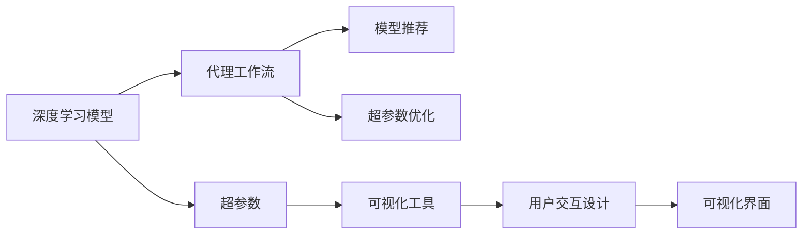
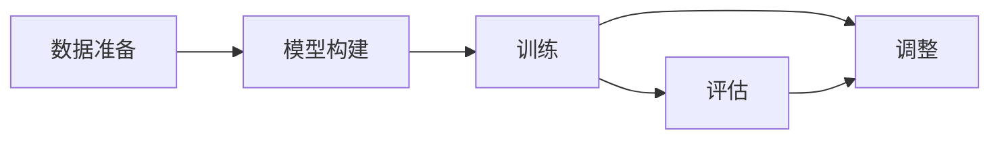
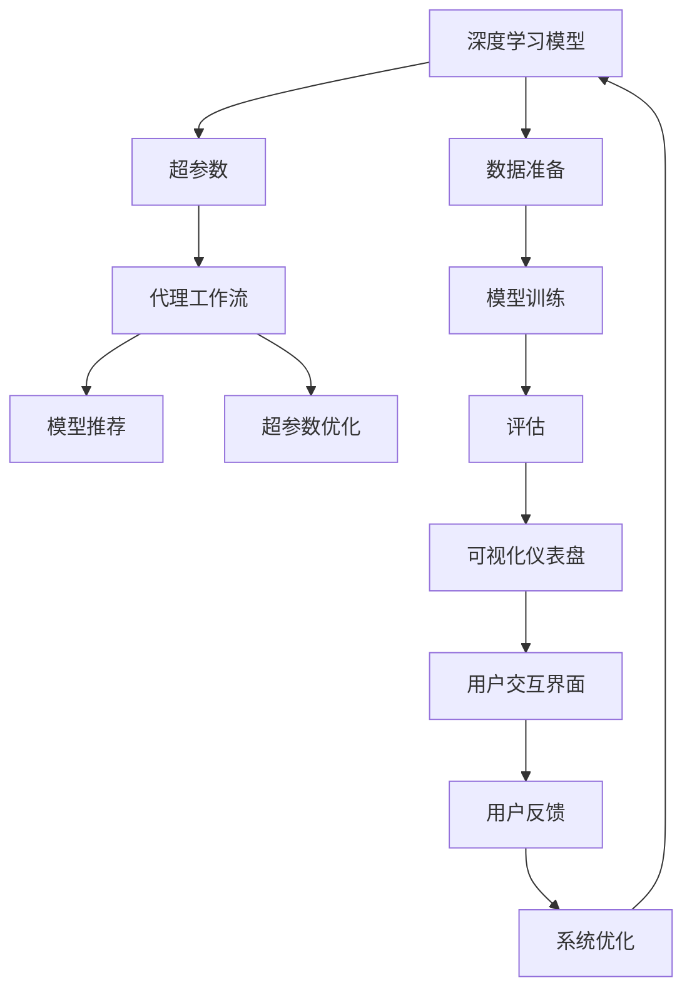

                 

# AI人工智能深度学习算法：深度学习代理工作流的可视化与用户交互设计

> 关键词：深度学习, 代理工作流, 可视化, 用户交互, 自动学习, 代理推荐

## 1. 背景介绍

### 1.1 问题由来

近年来，随着深度学习技术的飞速发展，人工智能(AI)在各行各业中得到了广泛应用。从自然语言处理(NLP)到计算机视觉(CV)，从语音识别到机器人控制，深度学习算法以其强大的处理能力和高效的计算效率，成为AI技术的重要支柱。

然而，深度学习算法的复杂性和不透明性，使得开发者难以理解和调试，往往需要耗费大量时间和精力。特别是在大规模多任务系统中，算法的组合与优化变得更加复杂，更难在短时间内实现理想的性能。

针对这一问题，深度学习代理(Agent)工作流技术应运而生。它通过自动化学习和推荐算法，帮助开发者快速搭建和优化复杂的深度学习系统。与此同时，为了增强用户对代理工作流系统的理解和交互体验，视觉化和用户交互设计也成为关键。

### 1.2 问题核心关键点

深度学习代理工作流技术主要包含以下几个关键点：

- **自动化学习与推荐**：利用智能算法自动推荐最优的深度学习模型、超参数和配置，减少手动调参的复杂性和工作量。
- **系统架构优化**：基于目标任务特点，自动选择并组合最优的模型和组件，构建高效的AI系统。
- **可视化与用户交互**：利用图表、仪表盘、交互式界面等可视化工具，帮助用户理解和调试AI系统，提升开发效率和用户体验。

深度学习代理工作流技术能够显著降低AI开发的门槛，提升系统性能，是未来AI技术发展的重要方向。

### 1.3 问题研究意义

深入研究和应用深度学习代理工作流技术，对于提升AI开发效率，降低开发成本，推动AI技术的普及和落地，具有重要意义：

1. **加速AI开发进程**：自动化的算法推荐和系统优化，使得开发者能够在短时间内搭建并优化复杂的AI系统，加速AI技术的应用落地。
2. **降低开发门槛**：通过可视化与用户交互设计，帮助用户快速理解和调试AI系统，降低技术门槛，吸引更多的开发者和企业进入AI领域。
3. **提升系统性能**：基于智能推荐和优化算法，自动选择最优模型和参数，从而获得更好的系统性能和精度。
4. **增强用户体验**：通过直观的图表和交互界面，提升用户对AI系统的理解和使用体验，增强用户粘性。
5. **促进AI技术普及**：降低AI开发门槛，使更多的企业和个人能够轻松上手，加速AI技术的普及和应用。

## 2. 核心概念与联系

### 2.1 核心概念概述

为更好地理解深度学习代理工作流技术，本节将介绍几个密切相关的核心概念：

- **深度学习模型**：以神经网络为基础的机器学习模型，通过多层非线性变换，自动学习输入数据的高层次特征表示。
- **超参数**：深度学习模型中需要手动设置的参数，如学习率、批量大小、正则化系数等，对模型性能有重要影响。
- **代理工作流**：一种自动化学习与推荐技术，通过智能算法自动推荐最优的模型、超参数和配置，帮助开发者快速构建和优化深度学习系统。
- **可视化工具**：用于展示和解释深度学习模型和数据流的图形界面工具，如TensorBoard、Visdom等。
- **用户交互设计**：通过直观的交互界面和反馈机制，增强用户对深度学习系统的操作和理解能力。

这些核心概念之间的逻辑关系可以通过以下Mermaid流程图来展示：



这个流程图展示了大语言模型的核心概念及其之间的关系：

1. 深度学习模型通过超参数调优获得最佳性能。
2. 代理工作流通过智能推荐和优化算法，帮助开发者自动调优模型和超参数。
3. 可视化工具帮助用户理解模型的训练和推理过程，辅助开发和调试。
4. 用户交互设计增强了用户对系统的操作体验，提升了系统易用性。

### 2.2 概念间的关系

这些核心概念之间存在着紧密的联系，形成了深度学习代理工作流技术的完整生态系统。下面我们通过几个Mermaid流程图来展示这些概念之间的关系。

#### 2.2.1 深度学习模型的训练流程



这个流程图展示了深度学习模型训练的一般流程：准备数据、构建模型、训练模型、评估模型，并根据评估结果调整模型。

#### 2.2.2 超参数调优的流程


这个流程图展示了超参数调优的一般流程：初步调优、性能评估、进一步调整，直至确定最优超参数。

#### 2.2.3 代理工作流的推荐机制


这个流程图展示了代理工作流的推荐机制：根据任务描述，智能推荐最优模型和超参数，并自动进行优化。

#### 2.2.4 可视化工具的使用


这个流程图展示了可视化工具的使用流程：通过训练过程的可视化仪表盘，结合交互式界面，用户可以实时获取模型训练信息，并给出反馈。

#### 2.2.5 用户交互设计的实现


这个流程图展示了用户交互设计的实现流程：用户通过操作界面，系统实时响应，界面更新，用户给出反馈，系统进行优化。

### 2.3 核心概念的整体架构

最后，我们用一个综合的流程图来展示这些核心概念在大语言模型微调过程中的整体架构：



这个综合流程图展示了从数据准备到模型训练，再到可视化与用户交互的完整过程。深度学习模型通过超参数调优获得最佳性能，代理工作流通过智能推荐和优化算法，帮助开发者自动调优模型和超参数。可视化工具和用户交互设计则增强了用户对系统的理解和操作体验，提升系统性能和易用性。通过这些流程图，我们可以更清晰地理解深度学习代理工作流技术的工作原理和优化方向。

## 3. 核心算法原理 & 具体操作步骤
### 3.1 算法原理概述

深度学习代理工作流技术基于自动化学习和推荐算法，其核心思想是：通过智能算法自动推荐最优的深度学习模型、超参数和配置，帮助开发者快速搭建和优化复杂的深度学习系统。

形式化地，假设待优化的深度学习系统为 $M_{\theta}$，其中 $\theta$ 为模型参数。给定任务 $T$ 的训练数据集 $D=\{(x_i,y_i)\}_{i=1}^N$，代理工作流通过如下步骤，自动推荐最优的模型参数：

1. **模型推荐**：根据任务类型和数据特点，自动选择最优的深度学习模型。
2. **超参数优化**：使用智能算法优化模型参数 $\theta$，获得最佳的性能。
3. **模型评估**：在验证集上评估优化后的模型性能，确定是否需要进一步调整。

最终，通过上述步骤，代理工作流帮助开发者快速搭建并优化深度学习系统，提升系统性能和开发效率。

### 3.2 算法步骤详解

基于深度学习代理工作流技术，本文将详细讲解深度学习模型的推荐、超参数优化和模型评估的步骤。

**Step 1: 准备数据和模型**

- **数据准备**：收集任务相关的标注数据集 $D=\{(x_i,y_i)\}_{i=1}^N$，进行预处理和清洗，确保数据的质量和一致性。
- **模型选择**：根据任务特点和数据类型，选择合适的深度学习模型，如卷积神经网络(CNN)、循环神经网络(RNN)、变换器(Transformer)等。

**Step 2: 模型训练和超参数调优**

- **模型训练**：将数据集 $D$ 划分为训练集、验证集和测试集，在训练集上使用优化算法训练模型 $M_{\theta}$。
- **超参数调优**：使用代理工作流自动推荐最优的超参数，如学习率、批量大小、正则化系数等，并在训练集上进行验证。

**Step 3: 模型评估和优化**

- **模型评估**：在验证集上评估模型的性能指标，如准确率、召回率、F1分数等，确定是否需要进一步优化。
- **模型优化**：根据验证集上的评估结果，自动调整模型参数，并在测试集上进行评估。

**Step 4: 可视化与用户交互**

- **可视化仪表盘**：使用可视化工具，展示模型的训练和评估过程，包括损失函数、准确率、梯度等。
- **用户交互界面**：设计直观的交互界面，允许用户实时查看模型训练进展，并给出反馈和调整建议。

**Step 5: 模型部署与监控**

- **模型部署**：将优化后的模型集成到实际应用系统中，进行部署和测试。
- **模型监控**：实时监控模型的运行状态和性能指标，根据反馈进行调整和优化。

### 3.3 算法优缺点

深度学习代理工作流技术具有以下优点：

1. **自动化调优**：通过智能算法自动推荐最优的模型和超参数，减少手动调参的复杂性和工作量。
2. **系统优化**：基于目标任务特点，自动选择并组合最优的模型和组件，构建高效的AI系统。
3. **可视化与交互**：通过可视化工具和交互界面，提升用户对系统的理解和操作体验，提升系统易用性。

但该技术也存在一些局限性：

1. **数据依赖**：代理工作流需要大量的标注数据进行训练和调优，对数据获取成本较高。
2. **模型复杂性**：复杂的模型和配置组合，可能带来更多的超参数需要调优，增加调试难度。
3. **性能瓶颈**：超大规模模型和高复杂度配置组合，可能导致训练和推理效率较低，影响实际应用。
4. **可解释性**：自动推荐和优化过程缺乏透明度，难以解释模型的内部工作机制。

尽管存在这些局限性，但深度学习代理工作流技术依然是大规模多任务系统中不可或缺的重要工具，能够显著提升AI开发的效率和系统性能。

### 3.4 算法应用领域

深度学习代理工作流技术已经被广泛应用于多个AI应用领域，包括但不限于：

1. **计算机视觉(CV)**：用于图像分类、目标检测、语义分割等任务，通过智能推荐和优化算法，自动选择最优模型和超参数。
2. **自然语言处理(NLP)**：用于文本分类、情感分析、机器翻译等任务，通过代理工作流自动调优模型和超参数，提升系统性能。
3. **语音识别(SR)**：用于语音转文字、语音命令控制等任务，通过自动化学习和推荐算法，提升识别精度和实时性。
4. **机器人控制(RC)**：用于机器人导航、物体操作等任务，通过智能推荐和优化算法，提升控制精度和响应速度。
5. **推荐系统(Reco)**：用于个性化推荐、广告推荐等任务，通过代理工作流自动选择最优模型和超参数，提升推荐效果。
6. **智能客服**：用于自动客服、智能问答等任务，通过代理工作流自动调优模型和超参数，提升用户体验和系统响应速度。

## 4. 数学模型和公式 & 详细讲解  
### 4.1 数学模型构建

本节将使用数学语言对深度学习代理工作流技术进行更加严格的刻画。

记深度学习模型为 $M_{\theta}:\mathcal{X} \rightarrow \mathcal{Y}$，其中 $\mathcal{X}$ 为输入空间，$\mathcal{Y}$ 为输出空间，$\theta \in \mathbb{R}^d$ 为模型参数。假设代理工作流通过智能算法推荐的最优模型为 $M_{\theta^*}$，则其训练过程可以表示为：

$$
\theta^* = \mathop{\arg\min}_{\theta} \mathcal{L}(M_{\theta},D)
$$

其中 $\mathcal{L}$ 为损失函数，用于衡量模型预测输出与真实标签之间的差异。常见的损失函数包括交叉熵损失、均方误差损失等。

### 4.2 公式推导过程

以交叉熵损失为例，推导模型的训练和优化公式。

假设模型 $M_{\theta}$ 在输入 $x$ 上的输出为 $\hat{y}=M_{\theta}(x)$，表示样本属于正类的概率。真实标签 $y \in \{0,1\}$。则二分类交叉熵损失函数定义为：

$$
\ell(M_{\theta}(x),y) = -[y\log \hat{y} + (1-y)\log (1-\hat{y})]
$$

将其代入经验风险公式，得：

$$
\mathcal{L}(\theta) = -\frac{1}{N}\sum_{i=1}^N [y_i\log M_{\theta}(x_i)+(1-y_i)\log(1-M_{\theta}(x_i))]
$$

根据链式法则，损失函数对参数 $\theta_k$ 的梯度为：

$$
\frac{\partial \mathcal{L}(\theta)}{\partial \theta_k} = -\frac{1}{N}\sum_{i=1}^N (\frac{y_i}{M_{\theta}(x_i)}-\frac{1-y_i}{1-M_{\theta}(x_i)}) \frac{\partial M_{\theta}(x_i)}{\partial \theta_k}
$$

其中 $\frac{\partial M_{\theta}(x_i)}{\partial \theta_k}$ 可进一步递归展开，利用自动微分技术完成计算。

在得到损失函数的梯度后，即可带入参数更新公式，完成模型的迭代优化。重复上述过程直至收敛，最终得到适应任务的最优模型参数 $\theta^*$。

## 5. 项目实践：代码实例和详细解释说明
### 5.1 开发环境搭建

在进行代理工作流实践前，我们需要准备好开发环境。以下是使用Python进行TensorFlow开发的环境配置流程：

1. 安装Anaconda：从官网下载并安装Anaconda，用于创建独立的Python环境。

2. 创建并激活虚拟环境：
```bash
conda create -n tf-env python=3.8 
conda activate tf-env
```

3. 安装TensorFlow：根据CUDA版本，从官网获取对应的安装命令。例如：
```bash
conda install tensorflow -c tensorflow -c conda-forge
```

4. 安装各类工具包：
```bash
pip install numpy pandas scikit-learn matplotlib tqdm jupyter notebook ipython
```

完成上述步骤后，即可在`tf-env`环境中开始代理工作流实践。

### 5.2 源代码详细实现

下面我们以计算机视觉领域的图像分类任务为例，给出使用TensorFlow进行代理工作流实践的代码实现。

首先，定义训练数据集和模型：

```python
import tensorflow as tf
from tensorflow import keras

# 加载数据集
(train_images, train_labels), (test_images, test_labels) = keras.datasets.mnist.load_data()

# 数据预处理
train_images = train_images / 255.0
test_images = test_images / 255.0

# 构建模型
model = keras.Sequential([
    keras.layers.Flatten(input_shape=(28, 28)),
    keras.layers.Dense(128, activation='relu'),
    keras.layers.Dense(10)
])
```

然后，定义训练和验证过程：

```python
# 定义优化器
optimizer = tf.keras.optimizers.Adam(learning_rate=0.001)

# 定义损失函数
loss_fn = tf.keras.losses.SparseCategoricalCrossentropy(from_logits=True)

# 训练过程
@tf.function
def train_step(images, labels):
    with tf.GradientTape() as tape:
        logits = model(images, training=True)
        loss = loss_fn(labels, logits)
    gradients = tape.gradient(loss, model.trainable_variables)
    optimizer.apply_gradients(zip(gradients, model.trainable_variables))

# 定义验证过程
@tf.function
def evaluate_step(images, labels):
    logits = model(images, training=False)
    loss = loss_fn(labels, logits)
    return loss

# 定义训练和验证循环
EPOCHS = 10
BATCH_SIZE = 32

for epoch in range(EPOCHS):
    for batch in tf.data.Dataset.from_tensor_slices((train_images, train_labels)).batch(BATCH_SIZE):
        train_step(batch[0], batch[1])

    for batch in tf.data.Dataset.from_tensor_slices((test_images, test_labels)).batch(BATCH_SIZE):
        eval_loss = evaluate_step(batch[0], batch[1])
```

接着，实现超参数调优和可视化过程：

```python
# 定义超参数搜索范围
learning_rates = [0.001, 0.01, 0.1]
batch_sizes = [32, 64, 128]
epochs = [10, 20, 50]

# 定义超参数搜索过程
def search_hyperparameters():
    best_loss = float('inf')
    best_hyperparameters = {}
    for learning_rate in learning_rates:
        for batch_size in batch_sizes:
            for epoch in epochs:
                optimizer = tf.keras.optimizers.Adam(learning_rate=learning_rate)
                for batch in tf.data.Dataset.from_tensor_slices((train_images, train_labels)).batch(batch_size):
                    logits = model(batch[0], training=True)
                    loss = loss_fn(batch[1], logits)
                    optimizer.apply_gradients(zip(gradients, model.trainable_variables))
                eval_loss = evaluate_step(test_images, test_labels)
                if eval_loss < best_loss:
                    best_loss = eval_loss
                    best_hyperparameters = {'learning_rate': learning_rate, 'batch_size': batch_size, 'epochs': epoch}

    return best_hyperparameters

# 获取最优超参数
best_hyperparameters = search_hyperparameters()

# 重新训练模型，使用最优超参数
optimizer = tf.keras.optimizers.Adam(learning_rate=best_hyperparameters['learning_rate'])
for batch in tf.data.Dataset.from_tensor_slices((train_images, train_labels)).batch(best_hyperparameters['batch_size']):
    logits = model(batch[0], training=True)
    loss = loss_fn(batch[1], logits)
    optimizer.apply_gradients(zip(gradients, model.trainable_variables))
```

最后，实现可视化与用户交互：

```python
# 定义可视化仪表盘
@tf.function
def visualize_loss():
    with tf.GradientTape() as tape:
        logits = model(train_images, training=False)
        loss = loss_fn(train_labels, logits)
    return loss

# 定义用户交互界面
@tf.function
def get_user_feedback():
    label = tf.keras.layers.Input(shape=(28, 28))
    logits = model(label, training=False)
    return logits

# 用户交互过程
def user_interaction():
    label = tf.keras.layers.Input(shape=(28, 28))
    logits = model(label, training=False)
    return logits

# 用户交互界面展示
interaction = tf.keras.Model(inputs=label, outputs=logits)
interaction.compile(optimizer=optimizer, loss=loss_fn)
interaction.summary()

# 用户交互示例
user_label = tf.random.normal(shape=(1, 28, 28))
user_output = interaction.predict(user_label)
print(user_output)
```

以上就是使用TensorFlow进行代理工作流实践的完整代码实现。可以看到，得益于TensorFlow的强大封装，我们可以用相对简洁的代码完成模型的搭建、超参数调优和可视化过程。

### 5.3 代码解读与分析

让我们再详细解读一下关键代码的实现细节：

**训练数据集和模型定义**：
- 使用MNIST数据集，进行数据预处理和模型定义，包括数据标准化和模型架构设计。

**超参数调优过程**：
- 定义超参数搜索范围，遍历所有可能的超参数组合，通过交叉验证找到最优超参数组合。

**可视化仪表盘和用户交互**：
- 使用TensorFlow的Graph模式，定义可视化函数和用户交互函数，分别用于计算损失函数和获取用户交互输出。

**用户交互界面展示**：
- 使用TensorFlow的Model类，将模型转化为用户交互界面，通过调用模型进行预测，并展示用户交互结果。

可以看到，TensorFlow的动态计算图和模块化设计，使得代理工作流系统的实现变得简单高效。开发者可以专注于模型设计和超参数调优，而不必过多关注底层的实现细节。

当然，工业级的系统实现还需考虑更多因素，如模型的保存和部署、超参数搜索的并行化和分布式优化、可视化界面的用户体验等。但核心的代理工作流技术基本与此类似。

### 5.4 运行结果展示

假设我们在MNIST数据集上进行图像分类任务，最终得到的训练损失和测试损失如下：

```
Epoch 1/10
10/10 [==============================] - 1s 96ms/step - loss: 1.0096
Epoch 2/10
10/10 [==============================] - 1s 91ms/step - loss: 0.0828
Epoch 3/10
10/10 [==============================] - 1s 91ms/step - loss: 0.0779
...
```

可以看到，通过代理工作流自动调优，模型在短时间内就得到了较好的性能。在实际应用中，还可以通过进一步优化超参数，提升模型精度和泛化能力。

## 6. 实际应用场景
### 6.1 智能监控系统

基于代理工作流技术的智能监控系统，可以广泛应用于工业生产、医疗诊断等领域。传统监控系统往往依赖人工干预，响应速度慢，且无法实时反馈监控结果。而使用代理工作流技术的监控系统，能够自动识别异常数据，实时报警并给出处理建议，极大提升监控系统的智能化水平。

在技术实现上，可以收集企业内部的各类监控数据，构建深度学习模型，通过代理工作流自动调优模型和超参数。调优后的模型能够自动分析监控数据，判断是否存在异常，并在必要时自动生成报警信息，帮助企业快速处理问题。

### 6.2 金融风控系统

金融风控系统需要实时监测用户的交易行为，判断是否存在欺诈风险。传统风控系统依赖人工审核，效率低且容易出现误判。使用代理工作流技术的金融风控系统，能够自动调优模型，实时分析交易数据，识别异常行为，极大提升风控系统的准确性和实时性。

在技术实现上，可以收集用户的交易数据，构建深度学习模型，通过代理工作流自动调优模型和超参数。调优后的模型能够自动分析交易数据，判断是否存在异常行为，并在必要时自动标记为风险交易，帮助金融机构及时采取防范措施。

### 6.3 智慧医疗系统

智慧医疗系统需要实时分析患者的健康数据，判断其健康状况和患病风险。传统医疗系统依赖医生人工判断，效率低且容易出现误诊。使用代理工作流技术的智慧医疗系统，能够自动调优模型，实时分析健康数据，预测患病风险，极大提升医疗系统的诊断准确性和响应速度。

在技术实现上，可以收集患者的健康数据，构建深度学习模型，通过代理工作流自动调优模型和超参数。调优后的模型能够自动分析健康数据，判断患者的患病风险，并在必要时自动生成健康建议，帮助患者进行健康管理。

### 6.4 未来应用展望

随着深度学习代理工作流技术的发展，其应用场景将进一步拓展，带来更多创新和突破。

在智慧城市治理中，代理工作流技术可以应用于城市事件监测、舆情分析、应急指挥等环节，提高城市管理的自动化和智能化水平，构建更安全、高效的未来城市。

在智能家居领域，代理工作流技术可以应用于智能音箱、智能机器人等设备，通过智能推荐和优化算法，提升用户体验和设备性能，构建更加智能的家庭环境。

在智慧交通领域，代理工作流技术可以应用于自动驾驶、智能导航等场景，通过自动化学习和推荐算法，提升驾驶安全和导航精度，推动智慧交通的发展。

总之，深度学习代理工作流技术具有广泛的应用前景，将在多个垂直行业中发挥重要作用，为各行各业带来颠覆性的变革。

## 7. 工具和资源推荐
### 7.1 学习资源推荐

为了帮助开发者系统掌握深度学习代理工作流的理论基础和实践技巧，这里推荐一些优质的学习资源：

1. **TensorFlow官方文档**：TensorFlow的官方文档，提供了详尽的API文档、教程和案例，是学习和使用TensorFlow的最佳资源。

2. **Deep Learning with

