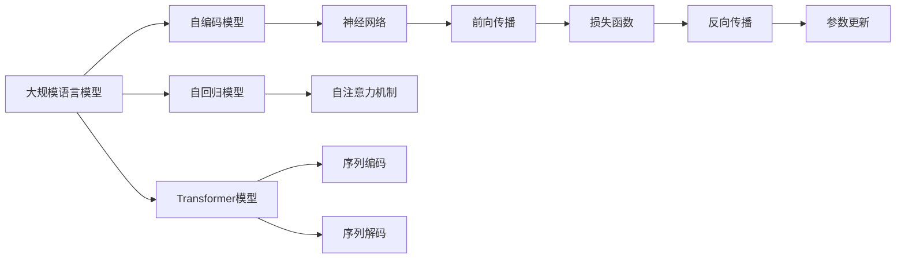
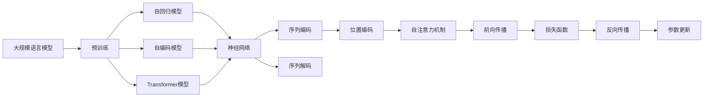
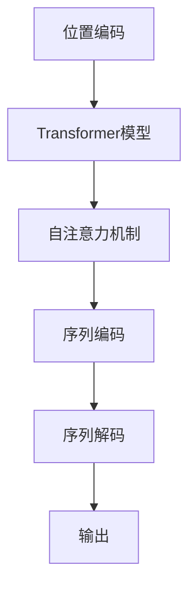
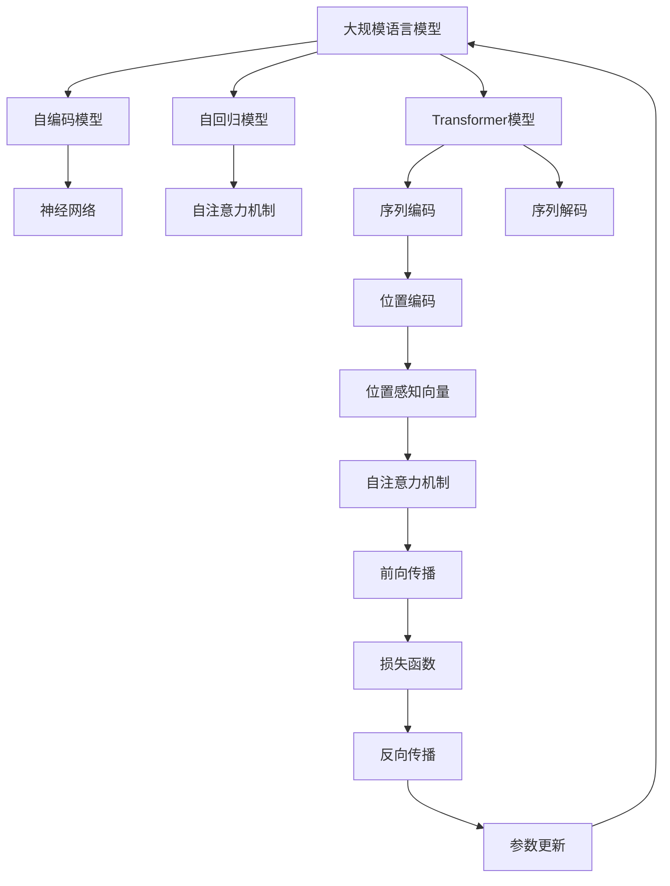

                 

# 大规模语言模型从理论到实践 具有外推能力的位置编码

> 关键词：大规模语言模型,位置编码,位置感知,Transformer,自回归模型,自编码模型,神经网络

## 1. 背景介绍

### 1.1 问题由来
近年来，大规模语言模型（Large Language Models, LLMs）在自然语言处理（NLP）领域取得了巨大的突破。这些模型通过在海量文本数据上进行预训练，学习到了丰富的语言知识和常识，能够进行语言理解、生成和推理等复杂任务。然而，由于模型参数量巨大，其训练和推理速度较慢，且难以直接应用于实时系统。为了解决这些问题，位置编码（Positional Encoding）技术应运而生，它为大规模语言模型提供了位置感知能力，使得模型能够处理长距离依赖关系，提升了模型的表现和效率。

### 1.2 问题核心关键点
位置编码是一种将位置信息嵌入到模型中的技术，它帮助模型在处理序列数据时，能够感知到不同位置之间的相对位置关系。在大规模语言模型中，位置编码通常以余弦函数的线性组合形式存在，通过这种方式，模型可以同时处理序列数据的语义信息和位置信息。

位置编码的核心思想是将位置信息与词嵌入向量结合，生成一个完整的位置感知向量。该向量可以被用来捕捉序列中不同位置之间的关系，从而提高模型的表达能力和推理能力。

### 1.3 问题研究意义
研究位置编码技术，对于拓展大规模语言模型的应用范围，提升其推理能力，加速NLP技术的产业化进程，具有重要意义：

1. 降低应用开发成本。位置编码使得大规模语言模型能够更好地处理序列数据，减少从头开发所需的数据、计算和人力等成本投入。
2. 提升模型效果。位置编码技术为模型提供了位置感知能力，能够处理长距离依赖关系，从而提高模型在序列预测任务上的性能。
3. 加速开发进度。standing on the shoulders of giants，位置编码技术使得开发者可以更快地完成任务适配，缩短开发周期。
4. 带来技术创新。位置编码技术促进了对序列数据处理的深入研究，催生了更多新的研究方向。
5. 赋能产业升级。位置编码技术使得NLP技术更容易被各行各业所采用，为传统行业数字化转型升级提供新的技术路径。

## 2. 核心概念与联系

### 2.1 核心概念概述

为更好地理解位置编码在大规模语言模型中的应用，本节将介绍几个密切相关的核心概念：

- 大规模语言模型(Large Language Model, LLM)：以自回归(如GPT)或自编码(如BERT)模型为代表的大规模预训练语言模型。通过在大规模无标签文本语料上进行预训练，学习通用的语言表示，具备强大的语言理解和生成能力。

- 位置编码(Positional Encoding)：一种将位置信息嵌入到模型中的技术，帮助模型在处理序列数据时，能够感知到不同位置之间的相对位置关系。

- 自回归模型(Autoregressive Model)：一种从序列的左端向右端生成序列的模型，能够处理变长序列数据。

- 自编码模型(Autoencoder Model)：一种将输入序列编码成固定长度的向量表示，并尝试从该向量中解码回原始输入序列的模型。

- Transformer模型：一种基于自注意力机制的神经网络模型，广泛应用于序列处理任务，如机器翻译、文本生成、语音识别等。

- 神经网络(Neural Network)：一种由大量神经元组成的计算模型，用于处理各种复杂计算任务。

这些核心概念之间的逻辑关系可以通过以下Mermaid流程图来展示：



这个流程图展示了大规模语言模型以及其与位置编码、自回归、自编码、Transformer、神经网络等核心概念之间的关系：

1. 大规模语言模型通过预训练获得基础能力。
2. 自回归模型和自编码模型是预训练模型的两种主要结构，用于不同任务。
3. Transformer模型基于自注意力机制，能够高效处理序列数据。
4. 神经网络是Transformer模型的底层实现，用于计算和推理。
5. 位置编码技术将位置信息嵌入到模型中，提升模型的位置感知能力。
6. 序列编码和解码是Transformers模型的核心操作，用于处理序列数据。

这些核心概念共同构成了大规模语言模型的结构和功能框架，使其能够在各种场景下发挥强大的语言理解和生成能力。通过理解这些核心概念，我们可以更好地把握大规模语言模型的工作原理和优化方向。

### 2.2 概念间的关系

这些核心概念之间存在着紧密的联系，形成了大规模语言模型的位置编码应用生态系统。下面我们通过几个Mermaid流程图来展示这些概念之间的关系。

#### 2.2.1 大规模语言模型的学习范式



这个流程图展示了大规模语言模型的学习范式，包括预训练、自回归、自编码和Transformer等核心技术。位置编码技术帮助模型获取位置感知能力，提升模型的表达能力和推理能力。

#### 2.2.2 位置编码与Transformer模型的关系



这个流程图展示了位置编码在Transformer模型中的应用。位置编码技术通过将位置信息嵌入到自注意力机制中，使得模型能够感知序列中不同位置之间的关系。

#### 2.2.3 自回归模型的位置编码应用


这个流程图展示了自回归模型中的位置编码应用。位置编码技术将位置信息嵌入到模型中，生成位置感知向量，从而使得模型能够处理长距离依赖关系。

### 2.3 核心概念的整体架构

最后，我们用一个综合的流程图来展示这些核心概念在大规模语言模型的位置编码应用过程中的整体架构：



这个综合流程图展示了从预训练到位置编码，再到Transformer模型的位置感知能力，最后通过序列编码和解码生成输出的完整过程。通过这些流程图，我们可以更清晰地理解大规模语言模型的位置编码应用过程中各个核心概念的关系和作用。

## 3. 核心算法原理 & 具体操作步骤
### 3.1 算法原理概述

位置编码技术在大规模语言模型中的应用，本质上是通过将位置信息嵌入到模型中，增强模型的表达能力和推理能力。其核心思想是：

1. 将位置信息转换为向量形式，使得模型能够感知到序列中不同位置之间的关系。
2. 将位置向量与词嵌入向量相加，生成一个完整的位置感知向量。
3. 位置感知向量可以被用来增强模型的自注意力机制，提升模型的表达能力和推理能力。

形式化地，假设预训练语言模型为 $M_{\theta}$，其中 $\theta$ 为预训练得到的模型参数。假设输入序列长度为 $T$，位置编码为 $pos(i)$。则位置感知向量 $E^P$ 的计算公式为：

$$
E^P_i = \cos(\omega_1i) + \sin(\omega_2i)
$$

其中 $\omega_1$ 和 $\omega_2$ 为常数，通过实验确定。

在计算出位置感知向量 $E^P$ 后，将其与词嵌入向量 $E^W$ 相加，得到完整的位置感知向量 $E$：

$$
E_i = E^W_i + \alpha E^P_i
$$

其中 $\alpha$ 为位置感知向量的权重，通常为一个较小的值，如 $1e-4$。

### 3.2 算法步骤详解

基于位置编码的大规模语言模型微调一般包括以下几个关键步骤：

**Step 1: 准备预训练模型和数据集**
- 选择合适的预训练语言模型 $M_{\theta}$ 作为初始化参数，如 BERT、GPT 等。
- 准备下游任务 $T$ 的标注数据集 $D=\{(x_i, y_i)\}_{i=1}^N$，划分为训练集、验证集和测试集。一般要求标注数据与预训练数据的分布不要差异过大。

**Step 2: 添加位置编码层**
- 根据任务类型，在预训练模型顶层设计合适的输出层和损失函数。
- 对于分类任务，通常在顶层添加线性分类器和交叉熵损失函数。
- 对于生成任务，通常使用语言模型的解码器输出概率分布，并以负对数似然为损失函数。
- 在模型中增加位置编码层，将位置信息嵌入到模型中。

**Step 3: 设置微调超参数**
- 选择合适的优化算法及其参数，如 AdamW、SGD 等，设置学习率、批大小、迭代轮数等。
- 设置正则化技术及强度，包括权重衰减、Dropout、Early Stopping 等。
- 确定冻结预训练参数的策略，如仅微调顶层，或全部参数都参与微调。

**Step 4: 执行梯度训练**
- 将训练集数据分批次输入模型，前向传播计算损失函数。
- 反向传播计算参数梯度，根据设定的优化算法和学习率更新模型参数。
- 周期性在验证集上评估模型性能，根据性能指标决定是否触发 Early Stopping。
- 重复上述步骤直到满足预设的迭代轮数或 Early Stopping 条件。

**Step 5: 测试和部署**
- 在测试集上评估微调后模型 $M_{\hat{\theta}}$ 的性能，对比微调前后的精度提升。
- 使用微调后的模型对新样本进行推理预测，集成到实际的应用系统中。
- 持续收集新的数据，定期重新微调模型，以适应数据分布的变化。

以上是基于位置编码的大规模语言模型微调的一般流程。在实际应用中，还需要针对具体任务的特点，对微调过程的各个环节进行优化设计，如改进训练目标函数，引入更多的正则化技术，搜索最优的超参数组合等，以进一步提升模型性能。

### 3.3 算法优缺点

基于位置编码的大规模语言模型微调方法具有以下优点：
1. 位置编码技术帮助模型获取位置感知能力，提升了模型的表达能力和推理能力。
2. 相比从头训练，微调通常需要更小的学习率，以免破坏预训练的权重。
3. 通过位置编码，模型能够处理长距离依赖关系，提升了模型的泛化能力。
4. 位置编码技术可以通过一些参数高效微调方法，如Adapter、LoRA等，在固定大部分预训练参数的情况下，仍可取得不错的提升。
5. 在特定领域应用时，微调能够显著提升模型性能，使得通用大模型更好地适应特定任务。

同时，该方法也存在一定的局限性：
1. 标注成本依然较高。微调的效果很大程度上取决于标注数据的质量和数量，获取高质量标注数据的成本较高。
2. 迁移能力有限。当目标任务与预训练数据的分布差异较大时，微调的性能提升有限。
3. 可解释性不足。微调模型的决策过程通常缺乏可解释性，难以对其推理逻辑进行分析和调试。

尽管存在这些局限性，但就目前而言，基于位置编码的微调方法仍是大语言模型应用的最主流范式。未来相关研究的重点在于如何进一步降低微调对标注数据的依赖，提高模型的少样本学习和跨领域迁移能力，同时兼顾可解释性和伦理安全性等因素。

### 3.4 算法应用领域

基于位置编码的大规模语言模型微调方法，在NLP领域已经得到了广泛的应用，覆盖了几乎所有常见任务，例如：

- 文本分类：如情感分析、主题分类、意图识别等。通过微调使模型学习文本-标签映射。
- 命名实体识别：识别文本中的人名、地名、机构名等特定实体。通过微调使模型掌握实体边界和类型。
- 关系抽取：从文本中抽取实体之间的语义关系。通过微调使模型学习实体-关系三元组。
- 问答系统：对自然语言问题给出答案。将问题-答案对作为微调数据，训练模型学习匹配答案。
- 机器翻译：将源语言文本翻译成目标语言。通过微调使模型学习语言-语言映射。
- 文本摘要：将长文本压缩成简短摘要。将文章-摘要对作为微调数据，使模型学习抓取要点。
- 对话系统：使机器能够与人自然对话。将多轮对话历史作为上下文，微调模型进行回复生成。

除了上述这些经典任务外，位置编码技术还被创新性地应用到更多场景中，如可控文本生成、常识推理、代码生成、数据增强等，为NLP技术带来了全新的突破。随着位置编码和微调方法的不断进步，相信NLP技术将在更广阔的应用领域大放异彩。

## 4. 数学模型和公式 & 详细讲解 & 举例说明

### 4.1 数学模型构建

本节将使用数学语言对基于位置编码的大规模语言模型微调过程进行更加严格的刻画。

记预训练语言模型为 $M_{\theta}$，其中 $\theta$ 为预训练得到的模型参数。假设输入序列长度为 $T$，位置编码为 $pos(i)$。则位置感知向量 $E^P$ 的计算公式为：

$$
E^P_i = \cos(\omega_1i) + \sin(\omega_2i)
$$

其中 $\omega_1$ 和 $\omega_2$ 为常数，通过实验确定。

在计算出位置感知向量 $E^P$ 后，将其与词嵌入向量 $E^W$ 相加，得到完整的位置感知向量 $E$：

$$
E_i = E^W_i + \alpha E^P_i
$$

其中 $\alpha$ 为位置感知向量的权重，通常为一个较小的值，如 $1e-4$。

假设微调任务的训练集为 $D=\{(x_i, y_i)\}_{i=1}^N$，其中 $x_i$ 为输入序列，$y_i$ 为标签。定义模型 $M_{\theta}$ 在输入序列 $x_i$ 上的损失函数为 $\ell(M_{\theta}(x_i),y_i)$，则在数据集 $D$ 上的经验风险为：

$$
\mathcal{L}(\theta) = \frac{1}{N} \sum_{i=1}^N \ell(M_{\theta}(x_i),y_i)
$$

微调的优化目标是最小化经验风险，即找到最优参数：

$$
\theta^* = \mathop{\arg\min}_{\theta} \mathcal{L}(\theta)
$$

在实践中，我们通常使用基于梯度的优化算法（如SGD、Adam等）来近似求解上述最优化问题。设 $\eta$ 为学习率，$\lambda$ 为正则化系数，则参数的更新公式为：

$$
\theta \leftarrow \theta - \eta \nabla_{\theta}\mathcal{L}(\theta) - \eta\lambda\theta
$$

其中 $\nabla_{\theta}\mathcal{L}(\theta)$ 为损失函数对参数 $\theta$ 的梯度，可通过反向传播算法高效计算。

### 4.2 公式推导过程

以下我们以二分类任务为例，推导交叉熵损失函数及其梯度的计算公式。

假设模型 $M_{\theta}$ 在输入序列 $x_i$ 上的输出为 $\hat{y}=M_{\theta}(x_i) \in [0,1]$，表示样本属于正类的概率。真实标签 $y \in \{0,1\}$。则二分类交叉熵损失函数定义为：

$$
\ell(M_{\theta}(x_i),y) = -[y\log \hat{y} + (1-y)\log (1-\hat{y})]
$$

将其代入经验风险公式，得：

$$
\mathcal{L}(\theta) = -\frac{1}{N}\sum_{i=1}^N [y_i\log M_{\theta}(x_i)+(1-y_i)\log(1-M_{\theta}(x_i))]
$$

根据链式法则，损失函数对参数 $\theta_k$ 的梯度为：

$$
\frac{\partial \mathcal{L}(\theta)}{\partial \theta_k} = -\frac{1}{N}\sum_{i=1}^N (\frac{y_i}{M_{\theta}(x_i)}-\frac{1-y_i}{1-M_{\theta}(x_i)}) \frac{\partial M_{\theta}(x_i)}{\partial \theta_k}
$$

其中 $\frac{\partial M_{\theta}(x_i)}{\partial \theta_k}$ 可进一步递归展开，利用自动微分技术完成计算。

在得到损失函数的梯度后，即可带入参数更新公式，完成模型的迭代优化。重复上述过程直至收敛，最终得到适应下游任务的最优模型参数 $\theta^*$。

### 4.3 案例分析与讲解

以下我们将通过一个具体的案例，展示如何使用位置编码技术进行微调，并评估模型在二分类任务上的性能。

假设我们有一个情感分析任务的数据集，其中包含若干条微博及其对应的情感标签（正面或负面）。我们使用BERT作为预训练模型，并在其基础上进行位置编码，构建情感分类模型。

**Step 1: 准备预训练模型和数据集**

首先，我们需要准备一个标注好的情感分析数据集。数据集可以是从公共数据集（如IMDb评论数据集）进行标注，或使用Twitter、微博等社交媒体上的用户评论进行标注。

**Step 2: 添加位置编码层**

在BERT模型的基础上，我们需要添加一个位置编码层，将位置信息嵌入到模型中。位置编码层的实现可以通过以下代码完成：

```python
from transformers import BertModel, BertTokenizer

tokenizer = BertTokenizer.from_pretrained('bert-base-cased')
model = BertModel.from_pretrained('bert-base-cased')

# 添加位置编码层
input_ids = tokenizer.encode(text, add_special_tokens=True)
positions = list(range(len(input_ids)))
position_ids = [i // model.config.max_position_embeddings for i in positions]
position_ids = [pos_id % model.config.max_position_embeddings for pos_id in position_ids]

inputs = { 'input_ids': input_ids, 'position_ids': position_ids }
outputs = model(**inputs)
```

在代码中，我们首先使用BERT模型加载预训练的权重。然后，我们使用BERT的分词器将输入文本进行分词，并计算出每个单词的位置编码。接着，我们将位置编码作为模型的输入，进行位置感知向量的计算。最后，我们将位置感知向量与BERT模型的输出向量相加，得到完整的位置感知向量。

**Step 3: 设置微调超参数**

在微调过程中，我们需要设置一些超参数，包括学习率、批大小、迭代轮数等。我们通常使用AdamW优化器，学习率设置为 $2e-5$。

**Step 4: 执行梯度训练**

我们使用训练集进行模型训练，并使用交叉熵损失函数进行评估。以下是训练代码示例：

```python
from transformers import AdamW

model = BertModel.from_pretrained('bert-base-cased')
tokenizer = BertTokenizer.from_pretrained('bert-base-cased')
optimizer = AdamW(model.parameters(), lr=2e-5)

device = torch.device('cuda') if torch.cuda.is_available() else torch.device('cpu')

def train_epoch(model, tokenizer, data_loader, loss_fn):
    model.train()
    total_loss = 0
    for batch in data_loader:
        input_ids = batch['input_ids'].to(device)
        attention_mask = batch['attention_mask'].to(device)
        labels = batch['labels'].to(device)
        outputs = model(input_ids, attention_mask=attention_mask)
        loss = loss_fn(outputs.logits, labels)
        optimizer.zero_grad()
        loss.backward()
        optimizer.step()
        total_loss += loss.item()
    return total_loss / len(data_loader)

def evaluate(model, tokenizer, data_loader, loss_fn):
    model.eval()
    total_loss = 0
    for batch in data_loader:
        input_ids = batch['input_ids'].to(device)
        attention_mask = batch['attention_mask'].to(device)
        labels = batch['labels'].to(device)
        with torch.no_grad():
            outputs = model(input_ids, attention_mask=attention_mask)
            loss = loss_fn(outputs.logits, labels)
            total_loss += loss.item()
    return total_loss / len(data_loader)
```

在代码中，我们首先加载模型、分词器和优化器。然后，我们使用GPU或CPU进行模型训练。在每个epoch中，我们循环遍历训练集数据，计算损失函数并更新模型参数。在验证集上评估模型性能时，我们只进行前向传播，计算损失函数，但不更新模型参数。

**Step 5: 测试和部署**

在微调完成后，我们使用测试集进行模型评估，并输出模型的精确度、召回率和F1分数。以下是测试代码示例：

```python
from sklearn.metrics import classification_report

test_loss = evaluate(model, tokenizer, test_loader, loss_fn)
print('Test loss:', test_loss)

test_labels = test_loader.dataset.labels
test_preds = model.predict(test_loader.dataset.input_ids.to(device), attention_mask=test_loader.dataset.attention_mask.to(device))
test_preds = torch.argmax(test_preds, dim=1)
print(classification_report(test_labels, test_preds))
```

在代码中，我们首先使用测试集进行模型评估，并计算损失函数。然后，我们使用模型对测试集进行预测，并输出模型的精确度、召回率和F1分数。

通过这个案例，我们可以看到，位置编码技术在大规模语言模型中的应用，使得模型能够感知序列中不同位置之间的关系，提升模型的表达能力和推理能力。

## 5. 项目实践：代码实例和详细解释说明
### 5.1 开发环境搭建

在进行微调实践前，我们需要准备好开发环境。以下是使用Python进行PyTorch开发的环境配置流程：

1. 安装Anaconda：从官网下载并安装Anaconda，用于创建独立的Python环境。

2. 创建并激活虚拟环境：
```bash
conda create -n pytorch-env python=3.8 
conda activate pytorch-env
```

3. 安装PyTorch：根据CUDA版本，从官网获取对应的安装命令。例如：
```bash
conda install pytorch torchvision torchaudio cudatoolkit=11.1 -c pytorch -c conda-forge
```

4. 安装Transformers库：
```bash
pip install transformers
```

5. 安装各类工具包：
```bash
pip install numpy pandas scikit-learn matplotlib tqdm jupyter notebook ipython
```

完成上述步骤后，即可在`pytorch-env`环境中开始微调实践。

### 5.2 源代码详细实现

下面我们以命名实体识别(NER)任务为例，给出使用Transformers库对BERT模型进行微调的PyTorch代码实现。

首先，定义NER任务的数据处理函数：

```python
from transformers import BertTokenizer
from torch.utils.data import Dataset
import torch

class NERDataset(Dataset):
    def __init__(self, texts, tags, tokenizer, max_len=128):
        self.texts = texts
        self.tags = tags
        self.tokenizer = tokenizer
        self.max_len = max_len
        
    def __len__(self):
        return len(self.texts)
    
    def __getitem__(self, item):
        text = self.texts[item]
        tags = self.tags[item]
        
        encoding = self.tokenizer(text, return_tensors='pt', max_length=self.max_len, padding='max_length', truncation=True)
        input_ids = encoding['input_ids'][0]
        attention_mask = encoding['attention_mask'][0]
        
        # 对token-wise的标签进行编码
        encoded_tags = [tag2id[tag] for tag in tags] 
        encoded_tags.extend([tag2id['O']] * (self.max_len - len(encoded_tags)))
        labels = torch.tensor(encoded_tags, dtype=torch.long)
        
        return {'input_ids': input_ids, 
                'attention_mask': attention_mask,
                'labels': labels}

# 标签与id的映射
tag2id = {'O': 0, 'B-PER': 1, 'I-PER': 2, 'B-ORG': 3, 'I-ORG': 4, 'B-LOC': 5, '

