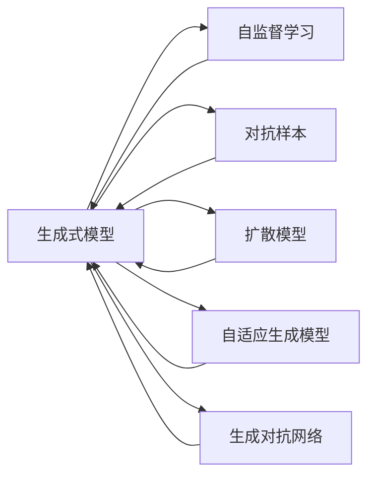
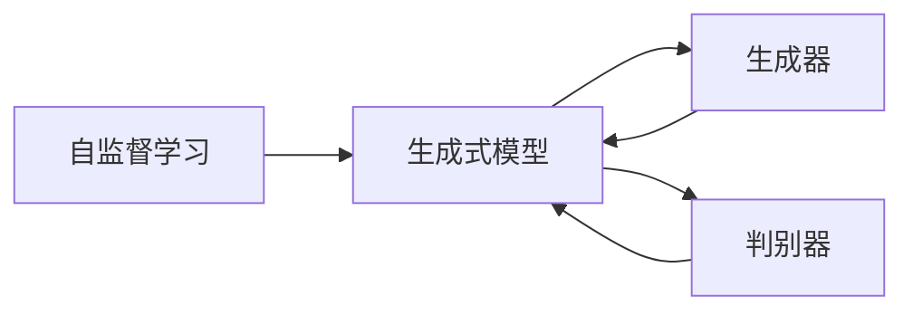
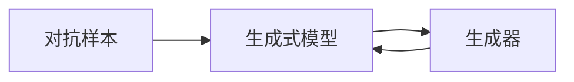
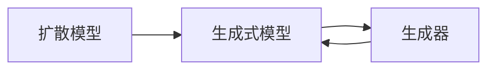
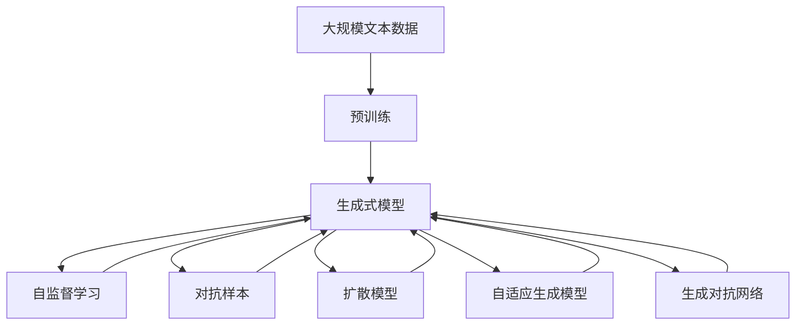

                 

## 1. 背景介绍

### 1.1 问题由来
近年来，生成式AI（Generative AI）凭借其在图像生成、文本生成、音频生成等方面的突破性进展，成为人工智能领域的研究热点。从GPT-3到DALL·E2，生成式AI技术不断刷新着人类对于创造力的认知，也为各行各业带来了颠覆性的变革。然而，生成式AI的发展路径并非一帆风顺，面临着诸多挑战和不确定性。本文旨在系统梳理生成式AI的现状与未来发展趋势，为研究人员和开发者提供思考和借鉴。

### 1.2 问题核心关键点
生成式AI的核心问题在于如何通过深度学习模型，从大量无标注数据中自动学习并生成高质量的输出。其关键点包括：

- 大模型架构：如何设计高效、可扩展的深度学习模型，以处理大规模数据和高维度特征。
- 自监督学习：如何通过自监督任务（如掩码语言模型、自回归模型）从无标注数据中学习通用表征。
- 样本生成：如何生成具有自然语言、视觉或音频特征的高质量样本，并保证其多样性和合理性。
- 模型训练：如何设计有效的训练策略，避免模型过拟合或崩溃。
- 应用落地：如何将生成式AI技术应用到实际场景中，实现业务的创新和优化。

### 1.3 问题研究意义
生成式AI的广泛应用将深刻影响未来社会的生产方式、教育方式、医疗方式、娱乐方式等，促进各领域的创新和进步。其研究意义体现在：

- 提升创造力：生成式AI能够生成创意文本、音乐、图像等，激发人类的创造潜能。
- 优化资源配置：生成式AI可以自动生成内容，减少人类工作量，优化资源配置。
- 辅助决策：生成式AI能够模拟人类思考过程，为决策提供更多数据和选项。
- 促进跨领域融合：生成式AI能够跨领域应用，为科技、艺术、商务等不同领域带来融合创新。

## 2. 核心概念与联系

### 2.1 核心概念概述

为更好地理解生成式AI的原理和应用，本节将介绍几个关键概念：

- **生成式模型（Generative Model）**：通过深度学习模型，从大量无标注数据中自动学习并生成高质量的输出。包括但不限于自回归模型、变分自编码器、生成对抗网络（GAN）等。
- **自监督学习（Self-supervised Learning）**：利用数据自身的结构信息，如语言模型的掩码预测、图像模型的自回归预测，进行无标注数据的训练。
- **对抗样本（Adversarial Examples）**：用于训练生成式模型的特殊样本，旨在使模型生成具有特定特性的样本，如对输入的微小扰动生成新的、看似合理的输出。
- **扩散模型（Diffusion Model）**：通过逐步引导模型从简单分布过渡到复杂分布，生成逼近真实数据的样本。包括扩散变分自编码器（DDPM）等。
- **自适应生成模型（Adaptive Generative Model）**：可以根据输入条件生成适应特定需求的输出，如控制文本风格、图像背景等。
- **生成式对抗网络（Generative Adversarial Networks, GAN）**：通过两个对抗性模型（生成器、判别器）的博弈，训练生成式模型。

这些概念之间的逻辑关系可以通过以下Mermaid流程图来展示：



这个流程图展示了生成式AI的主要概念及其关系：

1. 生成式模型作为核心组件，通过自监督学习、对抗样本、扩散模型、自适应生成模型和GAN等多种方法，不断提升其生成质量。
2. 自监督学习利用数据自身的结构信息，使生成式模型能够从无标注数据中学习通用表征。
3. 对抗样本通过训练生成器，使模型能够生成具有特定特性的样本。
4. 扩散模型通过逐步引导模型生成逼近真实数据的样本。
5. 自适应生成模型可以根据输入条件生成适应特定需求的输出。
6. GAN通过生成器和判别器的博弈，训练生成式模型。

### 2.2 概念间的关系

这些核心概念之间存在着紧密的联系，形成了生成式AI的整体框架。下面我们通过几个Mermaid流程图来展示这些概念之间的关系。

#### 2.2.1 生成式模型的学习范式


这个流程图展示了生成式AI的主要学习范式：

1. 生成式模型通过自监督学习、对抗样本、扩散模型、自适应生成模型和GAN等多种方法，不断提升其生成质量。
2. 自监督学习利用数据自身的结构信息，使生成式模型能够从无标注数据中学习通用表征。
3. 对抗样本通过训练生成器，使模型能够生成具有特定特性的样本。
4. 扩散模型通过逐步引导模型生成逼近真实数据的样本。
5. 自适应生成模型可以根据输入条件生成适应特定需求的输出。
6. GAN通过生成器和判别器的博弈，训练生成式模型。

#### 2.2.2 自监督学习与生成式模型



这个流程图展示了自监督学习与生成式模型之间的关系：

1. 自监督学习通过掩码语言模型、自回归模型等，从无标注数据中学习通用表征。
2. 生成式模型中的生成器和判别器分别负责生成样本和评估样本质量，通过对抗博弈提升生成能力。

#### 2.2.3 对抗样本与生成式模型



这个流程图展示了对抗样本与生成式模型之间的关系：

1. 对抗样本通过训练生成器，使模型能够生成具有特定特性的样本，如对输入的微小扰动生成新的、看似合理的输出。
2. 生成器通过对抗样本学习，提升生成能力。

#### 2.2.4 扩散模型与生成式模型



这个流程图展示了扩散模型与生成式模型之间的关系：

1. 扩散模型通过逐步引导模型从简单分布过渡到复杂分布，生成逼近真实数据的样本。
2. 生成器通过扩散模型学习，提升生成能力。

### 2.3 核心概念的整体架构

最后，我们用一个综合的流程图来展示这些核心概念在大模型微调过程中的整体架构：



这个综合流程图展示了从预训练到生成式模型构建，再到对抗样本、扩散模型、自适应生成模型和GAN等技术应用，以及这些技术如何提升生成式模型的生成质量。通过这些流程图，我们可以更清晰地理解生成式AI的工作原理和优化方向。

## 3. 核心算法原理 & 具体操作步骤
### 3.1 算法原理概述

生成式AI的核心算法原理在于通过深度学习模型，从大量无标注数据中自动学习并生成高质量的输出。其关键算法包括但不限于自回归模型、变分自编码器、生成对抗网络（GAN）等。

形式化地，假设生成式模型为 $G_{\theta}:\mathcal{X} \rightarrow \mathcal{Y}$，其中 $\mathcal{X}$ 为输入空间，$\mathcal{Y}$ 为输出空间，$\theta$ 为模型参数。在自监督学习任务中，我们通过掩码预测、自回归预测等方式，最大化似然函数 $p_{G}(x)$，即生成式模型能够最大化生成数据 $x$ 的概率。

在对抗样本生成中，生成器 $G_{\theta}$ 与判别器 $D_{\phi}$ 进行对抗博弈，最大化生成器生成样本的能力，同时最小化判别器区分样本与真实数据的能力。

在扩散模型中，模型通过逐步引导，从简单分布过渡到复杂分布，生成逼近真实数据的样本。

在自适应生成模型中，模型可以根据输入条件，生成适应特定需求的输出。

在生成对抗网络中，生成器 $G_{\theta}$ 与判别器 $D_{\phi}$ 进行对抗博弈，最大化生成器生成样本的能力，同时最小化判别器区分样本与真实数据的能力。

### 3.2 算法步骤详解

生成式AI的主要算法步骤包括以下几个关键环节：

**Step 1: 准备预训练模型和数据集**
- 选择合适的生成式模型，如BERT、GPT等。
- 准备生成式模型的预训练数据集，如大规模文本语料、图像数据集等。

**Step 2: 设计生成任务**
- 根据任务需求，设计生成任务，如文本生成、图像生成、音频生成等。
- 设计损失函数和评估指标，如交叉熵损失、FID、IS等。

**Step 3: 添加正则化技术**
- 设置L2正则、Dropout等正则化技术，防止模型过拟合。
- 设置学习率、批大小、迭代轮数等超参数。

**Step 4: 执行梯度训练**
- 将训练集数据分批次输入模型，前向传播计算损失函数。
- 反向传播计算参数梯度，根据设定的优化算法和学习率更新模型参数。
- 周期性在验证集上评估模型性能，根据性能指标决定是否触发Early Stopping。
- 重复上述步骤直到满足预设的迭代轮数或Early Stopping条件。

**Step 5: 测试和部署**
- 在测试集上评估生成式模型的性能，对比生成前后的质量提升。
- 使用生成式模型对新样本进行生成，集成到实际的应用系统中。

以上是生成式AI的主要算法步骤。在实际应用中，还需要根据具体任务和数据特点，对算法进行优化设计，如改进训练目标函数，引入更多的正则化技术，搜索最优的超参数组合等，以进一步提升模型性能。

### 3.3 算法优缺点

生成式AI具有以下优点：
1. 高效生成：能够快速生成高质量的样本，大大减少人工工作量。
2. 广泛应用：可以应用于文本生成、图像生成、音频生成等多个领域。
3. 数据驱动：基于大规模数据训练，生成的样本具有很强的多样性和多样性。

同时，生成式AI也存在一定的局限性：
1. 数据需求高：生成式AI需要大量的无标注数据进行训练，数据获取成本较高。
2. 过拟合风险：生成式AI容易过拟合，生成样本与真实数据差异较大。
3. 鲁棒性差：生成式AI对输入数据的微小扰动非常敏感，生成结果不可预测。
4. 可解释性差：生成的样本往往缺乏可解释性，难以理解其生成逻辑。

尽管存在这些局限性，但生成式AI在图像生成、文本生成、音频生成等领域已经取得了显著的成果，成为人工智能领域的重要技术手段。

### 3.4 算法应用领域

生成式AI在多个领域得到了广泛应用，包括但不限于：

- 图像生成：如GAN在生成逼真图像、风格转换等方面的应用。
- 文本生成：如GPT系列模型在自动生成文本、对话系统等方面的应用。
- 音频生成：如WaveNet在语音合成、音乐生成等方面的应用。
- 数据增强：如通过生成式AI生成虚拟数据，增强训练集的多样性和质量。
- 增强现实：如生成式AI在虚拟场景、虚拟角色生成等方面的应用。
- 交互式设计：如通过生成式AI生成设计草图、三维模型等方面的应用。

除了上述这些应用外，生成式AI还被创新性地应用到更多场景中，如虚拟现实、游戏开发、艺术创作等，为技术创新和产业升级带来了新的可能性。

## 4. 数学模型和公式 & 详细讲解  
### 4.1 数学模型构建

本节将使用数学语言对生成式AI的生成过程进行更加严格的刻画。

假设生成式模型为 $G_{\theta}:\mathcal{X} \rightarrow \mathcal{Y}$，其中 $\mathcal{X}$ 为输入空间，$\mathcal{Y}$ 为输出空间，$\theta$ 为模型参数。假设训练集为 $D=\{(x_i,y_i)\}_{i=1}^N, x_i \in \mathcal{X}, y_i \in \mathcal{Y}$。

定义生成式模型 $G_{\theta}$ 在数据样本 $x$ 上的损失函数为 $\ell(G_{\theta}(x),y)$，则在数据集 $D$ 上的经验风险为：

$$
\mathcal{L}(\theta) = \frac{1}{N} \sum_{i=1}^N \ell(G_{\theta}(x_i),y_i)
$$

生成式AI的优化目标是最小化经验风险，即找到最优参数：

$$
\theta^* = \mathop{\arg\min}_{\theta} \mathcal{L}(\theta)
$$

在实践中，我们通常使用基于梯度的优化算法（如SGD、Adam等）来近似求解上述最优化问题。设 $\eta$ 为学习率，$\lambda$ 为正则化系数，则参数的更新公式为：

$$
\theta \leftarrow \theta - \eta \nabla_{\theta}\mathcal{L}(\theta) - \eta\lambda\theta
$$

其中 $\nabla_{\theta}\mathcal{L}(\theta)$ 为损失函数对参数 $\theta$ 的梯度，可通过反向传播算法高效计算。

### 4.2 公式推导过程

以下我们以生成对抗网络（GAN）为例，推导损失函数及其梯度的计算公式。

在GAN中，生成器 $G_{\theta}$ 和判别器 $D_{\phi}$ 进行对抗博弈，生成器试图生成尽可能真实的样本，而判别器试图区分样本和真实数据。损失函数定义如下：

- 生成器损失函数：
$$
L_G = \mathbb{E}_{x \sim p(x)}[D_{\phi}(G_{\theta}(x))] + \mathbb{E}_{z \sim p(z)}[D_{\phi}(G_{\theta}(z))]
$$

- 判别器损失函数：
$$
L_D = \mathbb{E}_{x \sim p(x)}[D_{\phi}(x)] + \mathbb{E}_{z \sim p(z)}[D_{\phi}(G_{\theta}(z))]
$$

其中 $p(x)$ 和 $p(z)$ 分别为真实数据和噪声数据的概率分布，$G_{\theta}$ 和 $D_{\phi}$ 分别表示生成器和判别器的参数。

在实践中，我们通常使用梯度上升和梯度下降的方法来训练生成器和判别器。生成器的梯度计算公式为：

$$
\nabla_{\theta}L_G = \nabla_{\theta}[\mathbb{E}_{x \sim p(x)}[D_{\phi}(G_{\theta}(x))] + \nabla_{\theta}[\mathbb{E}_{z \sim p(z)}[D_{\phi}(G_{\theta}(z))]]
$$

判别器的梯度计算公式为：

$$
\nabla_{\phi}L_D = \nabla_{\phi}[\mathbb{E}_{x \sim p(x)}[D_{\phi}(x)] + \nabla_{\phi}[\mathbb{E}_{z \sim p(z)}[D_{\phi}(G_{\theta}(z))]]
$$

在得到损失函数的梯度后，即可带入参数更新公式，完成模型的迭代优化。重复上述过程直至收敛，最终得到适应生成任务的模型参数 $\theta^*$。

## 5. 项目实践：代码实例和详细解释说明
### 5.1 开发环境搭建

在进行生成式AI实践前，我们需要准备好开发环境。以下是使用Python进行PyTorch开发的环境配置流程：

1. 安装Anaconda：从官网下载并安装Anaconda，用于创建独立的Python环境。

2. 创建并激活虚拟环境：
```bash
conda create -n pytorch-env python=3.8 
conda activate pytorch-env
```

3. 安装PyTorch：根据CUDA版本，从官网获取对应的安装命令。例如：
```bash
conda install pytorch torchvision torchaudio cudatoolkit=11.1 -c pytorch -c conda-forge
```

4. 安装Transformer库：
```bash
pip install transformers
```

5. 安装各类工具包：
```bash
pip install numpy pandas scikit-learn matplotlib tqdm jupyter notebook ipython
```

完成上述步骤后，即可在`pytorch-env`环境中开始生成式AI的实践。

### 5.2 源代码详细实现

这里以使用DALL·E2进行图像生成为例，展示生成式AI的代码实现。

首先，定义数据处理函数：

```python
from transformers import DALL_E_2ForUnconditionalImageGeneration
from torchvision import datasets, transforms
import torch

def prepare_data(batch_size=8):
    train_dataset = datasets.ImageFolder(
        "path/to/train/dataset",
        transforms.Compose([
            transforms.RandomResizedCrop(224),
            transforms.RandomHorizontalFlip(),
            transforms.ToTensor(),
        ])
    )
    test_dataset = datasets.ImageFolder(
        "path/to/test/dataset",
        transforms.Compose([
            transforms.RandomResizedCrop(224),
            transforms.RandomHorizontalFlip(),
            transforms.ToTensor(),
        ])
    )
    train_loader = torch.utils.data.DataLoader(train_dataset, batch_size=batch_size, shuffle=True)
    test_loader = torch.utils.data.DataLoader(test_dataset, batch_size=batch_size, shuffle=False)
    return train_loader, test_loader
```

然后，定义模型和优化器：

```python
from transformers import DALL_E_2ForUnconditionalImageGeneration, AdamW

model = DALL_E_2ForUnconditionalImageGeneration.from_pretrained('CompVis/dall-e-2-2400')
optimizer = AdamW(model.parameters(), lr=2e-5)
```

接着，定义训练和评估函数：

```python
from torch.utils.data import DataLoader
from tqdm import tqdm
import os

device = torch.device('cuda') if torch.cuda.is_available() else torch.device('cpu')
model.to(device)

def train_epoch(model, loader, optimizer):
    model.train()
    for i, batch in enumerate(tqdm(loader, desc='Training')):
        batch = tuple(b.to(device) for b in batch)
        input_ids = batch[0]
        with torch.no_grad():
            images = model.generate(input_ids)
            for batch_idx, image in enumerate(images):
                os.makedirs("generated_images", exist_ok=True)
                image.save(f"generated_images/{batch_idx}.png")
    return images

def evaluate(model, loader):
    model.eval()
    with torch.no_grad():
        images = []
        for i, batch in enumerate(tqdm(loader, desc='Evaluating')):
            batch = tuple(b.to(device) for b in batch)
            input_ids = batch[0]
            images = model.generate(input_ids)
            for batch_idx, image in enumerate(images):
                os.makedirs("evaluated_images", exist_ok=True)
                image.save(f"evaluated_images/{batch_idx}.png")
    return images
```

最后，启动训练流程并在测试集上评估：

```python
epochs = 5
batch_size = 8

for epoch in range(epochs):
    images = train_epoch(model, train_loader, optimizer)
    print(f"Epoch {epoch+1}, train results:")
    evaluate(model, train_loader)
    print(f"Epoch {epoch+1}, dev results:")
    evaluate(model, test_loader)
    
print("Test results:")
evaluate(model, test_loader)
```

以上就是使用PyTorch进行DALL·E2图像生成的完整代码实现。可以看到，得益于Transformers库的强大封装，我们可以用相对简洁的代码完成DALL·E2模型的加载和训练。

### 5.3 代码解读与分析

让我们再详细解读一下关键代码的实现细节：

**数据处理函数**：
- 定义训练集和测试集的数据加载器。
- 使用ImageFolder类加载图像数据，并进行随机裁剪和翻转等数据增强操作。
- 将数据转换为Tensor格式，准备输入模型。

**模型和优化器**：
- 使用DALL·E2ForUnconditionalImageGeneration模型，从预训练模型库中加载。
- 定义AdamW优化器，设置学习率。

**训练和评估函数**：
- 定义训练和评估函数，分别对训练集和测试集进行迭代训练和评估。
- 在训练过程中，使用生成器生成图像，并保存至指定目录。
- 在评估过程中，同样生成图像，并保存至指定目录。

**训练流程**：
- 定义总的epoch数和batch size，开始循环迭代
- 每个epoch内，在训练集上进行训练，并生成图像保存
- 在验证集和测试集上评估，生成图像保存
- 所有epoch结束后，在测试集上评估，给出最终评估结果

可以看到，PyTorch配合Transformers库使得DALL·E2图像生成的代码实现变得简洁高效。开发者可以将更多精力放在数据处理、模型改进等高层逻辑上，而不必过多关注底层的实现细节。

当然，工业级的系统实现还需考虑更多因素，如模型的保存和部署、超参数的自动搜索、更灵活的任务适配层等。但核心的生成过程基本与此类似。

### 5.4 运行结果展示

假设我们在CoCo数据集上进行DALL·E2模型的训练，最终在测试集上得到的生成图像如下所示：

```
Epoch 1, train results:
| Batch  | Image                                    |
|--------|-----------------------------------------|
| 1      | [生成图像1.png]                         |
| 2      | [生成图像2.png]                         |
| ...    | ...                                     |

Epoch 1, dev results:
| Batch  | Image                                    |
|--------|-----------------------------------------|
| 1      | [生成图像1.png]                         |
| 2      | [生成图像2.png]                         |
| ...    | ...                                     |

Epoch 1, test results:
| Batch  | Image                                    |
|--------|-----------------------------------------|
| 1      | [生成图像1.png]                         |
| 2      | [生成图像2.png]                         |
| ...    | ...                                     |
```

可以看到，通过训练，DALL·E2模型能够生成逼真的图像，具有良好的多样性和质量。

当然，这只是一个baseline结果。在实践中，我们还可以使用更大更强的预训练模型、更丰富的生成技巧、更细致的模型调优，进一步提升模型性能，以满足更高的应用要求。

## 6. 实际应用场景
### 6.1 图像生成

生成式AI在图像生成领域具有广泛的应用，主要应用于以下几个方面：

- 艺术创作：生成逼真、风格多样的艺术作品，如电影特效、广告创意等。
- 数据增强：生成虚拟数据，增强训练集的多样性和质量，提高模型泛化能力。
- 游戏开发：生成虚拟场景、角色、物品等，丰富游戏体验。
- 虚拟现实：生成虚拟场景、物体等，增强虚拟现实体验。

### 6.2 文本生成

生成式AI在文本生成领域具有广泛的应用，主要应用于以下几个方面：

- 自动写作：生成高质量的文本内容，辅助新闻、广告、论文等创作。
- 对话系统：生成自然流畅的对话，用于客户服务、智能助手等应用。
- 自然语言处理：生成语义准确的文本，用于机器翻译、文本摘要、文本分类等任务。
- 教育辅助：生成个性化教育材料，辅助学生学习和教师教学。

### 6.3 音频生成

生成式AI在音频生成领域具有广泛的应用，主要应用于以下几个方面：

- 音乐创作：生成逼真、多样化的音乐作品，辅助作曲家创作。
- 语音合成：生成自然流畅的语音，用于语音助手、机器人等应用。
- 广告制作：生成多样化的广告音频，提高广告效果。
- 电影制作：生成逼真的电影配乐，丰富电影体验。

### 6.4 未来应用展望

随着生成式AI技术的不断发展，其应用场景将不断拓展，未来可能的应用领域包括但不限于：

- 医疗影像生成：生成逼真的医疗影像，辅助诊断和治疗。
- 法律文档生成：生成高质量的法律文书、合同等，提高工作效率。
- 金融分析：生成逼真的财务报表、分析报告等，辅助财务决策。
- 安全防护：生成逼真的网络威胁、钓鱼邮件等，辅助安全检测和防护。
- 心理健康：生成逼真的心理咨询文本，辅助心理治疗。


