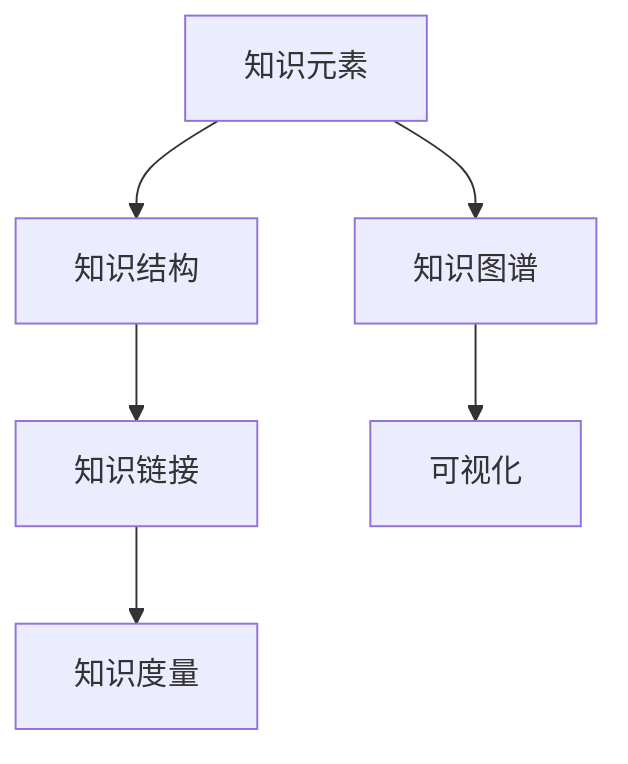

                 

## 1. 背景介绍

### 1.1 问题由来

在人工智能与技术快速发展的今天，知识体系的构建成为一项具有重要意义的任务。无论是学术研究还是商业应用，构建一个系统、全面的知识体系是至关重要的。然而，随着技术复杂度的提升，知识体系的构建也变得越来越困难。这不仅需要跨学科的合作，还涉及到从理论到实践的各个方面。

本文将从基本元素到复杂结构，全面探讨如何构建一个高质量的知识体系。我们将涵盖知识体系的构建原则、核心概念、算法原理以及实践案例，旨在为读者提供一个深入了解知识体系构建的框架和思路。

### 1.2 问题核心关键点

构建知识体系的核心关键点在于其结构和内容。一个好的知识体系需要：

- **系统性**：涵盖全面且互相连接的知识点，避免遗漏和冗余。
- **连贯性**：知识点之间逻辑清晰、层次分明，便于理解和应用。
- **实用性**：与实际应用紧密结合，能够解决实际问题。
- **易用性**：界面友好、操作便捷，便于学习和使用。
- **扩展性**：能够不断更新和扩展，适应技术变化和需求升级。

本文将围绕这些核心关键点，系统性地探讨知识体系的构建方法。

### 1.3 问题研究意义

构建高质量的知识体系，对学术研究和产业应用都具有重要意义：

- **学术研究**：一个结构清晰、内容全面的知识体系，可以显著提高研究的效率和效果。它有助于研究人员快速定位相关知识，避免重复劳动，提高研究深度和广度。
- **产业应用**：知识体系能够为企业的知识管理和应用提供强有力的支撑。它帮助企业快速构建技术框架、优化工作流程、提升工作效率，并保持技术领先。

此外，构建知识体系还能够推动跨学科交流和合作，加速知识的传播和应用，为社会进步和技术创新提供重要支持。

## 2. 核心概念与联系

### 2.1 核心概念概述

构建知识体系涉及多个核心概念，包括但不限于：

- **知识元素**：构成知识体系的基本单位，如概念、理论、技术、案例等。
- **知识结构**：知识元素之间的组织关系，如层次结构、网络结构、分类结构等。
- **知识链接**：知识元素之间的连接方式，如因果关系、相关性、引用关系等。
- **知识度量**：衡量知识元素的价值和重要性的指标，如新颖性、重要性、实用性等。
- **知识图谱**：知识元素及其关系的图形化表示，便于理解和可视化。

这些核心概念之间相互联系，共同构成知识体系的框架和内容。

### 2.2 核心概念原理和架构

知识体系的构建原理和架构可以通过以下Mermaid流程图来展示：



这个流程图展示了一个知识体系的构建流程，从基本的知识元素开始，通过组织结构、链接关系、度量指标和图谱表示，逐步构建出完整、系统的知识体系。

### 2.3 核心概念间的联系

知识体系的构建涉及到知识元素、结构、链接、度量和图谱等多个概念，它们之间具有紧密的联系：

- **知识元素和知识结构**：知识元素是构建知识体系的基本材料，而知识结构则是这些材料的组织方式，两者相辅相成。
- **知识链接和知识元素**：知识链接揭示了知识元素之间的联系，使知识体系成为一个有机整体。
- **知识度量和知识元素**：知识度量是对知识元素质量的评价，指导知识元素的取舍和优化。
- **知识图谱和知识元素**：知识图谱通过图形化表示，直观展示知识元素及其关系，便于理解和应用。

这些联系共同构成了一个完整的知识体系框架，使知识元素得以系统化、结构化、可视化，便于学习、应用和传播。

## 3. 核心算法原理 & 具体操作步骤

### 3.1 算法原理概述

知识体系的构建涉及多个核心算法，包括但不限于：

- **分层聚类算法**：将知识元素按照领域、层次等进行划分，形成层次结构。
- **关联规则算法**：发现知识元素之间的关联关系，形成关联网络。
- **重要性评估算法**：对知识元素进行重要性和价值评估，指导知识体系的构建。
- **可视化算法**：将知识元素及其关系转化为图形，便于理解和应用。

这些算法原理共同构成了知识体系构建的算法基础。

### 3.2 算法步骤详解

以下是知识体系构建的具体操作步骤：

#### 3.2.1 收集和整理知识元素

- **领域划分**：确定知识体系的覆盖领域，如计算机科学、生物学等。
- **元素收集**：从文献、书籍、网站、专家访谈等多种渠道收集相关知识元素。
- **整理筛选**：对收集到的知识元素进行整理和筛选，去除重复和无用内容。

#### 3.2.2 构建知识结构

- **层次划分**：按照领域、学科、主题等将知识元素进行层次划分，形成层次结构。
- **结构调整**：根据领域特点和实际需求，对层次结构进行调整和优化。

#### 3.2.3 发现知识链接

- **关联规则**：使用关联规则算法，发现知识元素之间的关联关系，形成关联网络。
- **因果分析**：分析知识元素之间的因果关系，形成因果网络。

#### 3.2.4 评估知识度量

- **度量指标**：定义知识元素的价值和重要性指标，如新颖性、实用性、影响力等。
- **度量计算**：对知识元素进行度量计算，得出每个元素的价值和重要性得分。

#### 3.2.5 可视化知识图谱

- **图谱设计**：根据知识结构、链接关系和度量指标，设计知识图谱的结构和布局。
- **图形生成**：使用可视化算法，将知识图谱转化为图形，便于理解和应用。

### 3.3 算法优缺点

知识体系的构建算法具有以下优点和缺点：

**优点**：
- **系统性**：通过层次结构和关联网络，知识体系具有系统性和全面性，避免了知识点的遗漏和冗余。
- **实用性和可扩展性**：根据实际需求和应用场景，可以进行灵活调整和扩展，适应技术变化和需求升级。
- **可视化和理解**：通过图形化表示，知识图谱直观展示知识元素及其关系，便于理解和应用。

**缺点**：
- **构建复杂度**：构建知识体系涉及多个步骤和算法，需要跨学科的合作和多方面的努力。
- **数据依赖**：知识体系的构建高度依赖数据的质量和完备性，数据不全或错误可能导致结果不准确。
- **维护成本**：知识体系需要定期维护和更新，保持其时效性和实用性。

### 3.4 算法应用领域

知识体系的构建算法广泛应用于多个领域，如：

- **学术研究**：构建学科知识体系，指导学术研究和技术创新。
- **企业知识管理**：构建企业知识库，优化知识管理和应用流程。
- **教育培训**：构建学科知识体系，提升教学质量和教育效果。
- **技术文档**：构建技术文档体系，提供系统化的技术参考和指导。
- **项目管理**：构建项目管理知识体系，提升项目管理效率和效果。

## 4. 数学模型和公式 & 详细讲解 & 举例说明

### 4.1 数学模型构建

知识体系的构建涉及多个数学模型，包括但不限于：

- **层次结构模型**：用于描述知识元素的层次关系，如树形结构、层级结构等。
- **关联网络模型**：用于描述知识元素之间的关联关系，如图模型、网络模型等。
- **重要性评估模型**：用于计算知识元素的重要性和价值，如PageRank算法、熵权法等。
- **可视化模型**：用于将知识图谱转化为图形，如力导向布局算法、层次布局算法等。

### 4.2 公式推导过程

以下是几个典型数学模型的推导过程：

#### 4.2.1 层次结构模型

层次结构模型可以用树形结构来表示，其中根节点为顶层知识元素，子节点为下层知识元素，如下图所示：

```
    A
   / \
  B   C
 / \   \
D   E   F
```

层次结构可以用树形图来表示，其中每个节点代表一个知识元素，边表示父子关系。层次结构可以用深度优先搜索或广度优先搜索算法来遍历和计算。

#### 4.2.2 关联网络模型

关联网络模型可以用图模型来表示，其中节点代表知识元素，边代表关联关系。图模型可以用邻接矩阵或邻接表来表示，如下图所示：

```
     B -- C
    / \   \
A   E -- F
```

关联关系可以用图算法来计算，如最小生成树算法、最短路径算法等。

#### 4.2.3 重要性评估模型

重要性评估模型可以用PageRank算法来计算，PageRank算法的基本思想是：如果一个页面链接到多个重要页面，那么这个页面的重要度也会提升。PageRank算法的核心公式如下：

$$
P(v) = (1-d) + d\sum_{w \in N(v)} \frac{P(w)}{C(w)}
$$

其中，$P(v)$ 表示节点 $v$ 的重要度，$d$ 是阻尼因子，$C(w)$ 表示节点 $w$ 的出度，$N(v)$ 表示节点 $v$ 的邻居节点集合。

#### 4.2.4 可视化模型

可视化模型可以用力导向布局算法来表示，力导向布局算法的基本思想是：节点和边之间存在引力，引力大小取决于它们之间的距离和重要性。力导向布局算法可以用以下公式来计算：

$$
F = k\left(\frac{1}{d_v^2} + \frac{1}{d_e^2}\right)
$$

其中，$F$ 表示力的大小，$d_v$ 表示节点 $v$ 的度数，$d_e$ 表示边 $e$ 的度数，$k$ 是比例因子。

### 4.3 案例分析与讲解

#### 4.3.1 学术研究

学术研究领域可以通过构建学科知识体系来指导研究和技术创新。例如，计算机科学领域可以按照学科、子学科、研究方向等层次划分知识元素，形成层次结构，如下图所示：

```
      计算机科学
    /              \
   理论计算机科学  应用计算机科学
  /                   \
算法与数据结构  软件工程与编程语言
                     /
                  数据库与信息检索
```

#### 4.3.2 企业知识管理

企业知识管理领域可以通过构建企业知识库来优化知识管理和应用流程。例如，一个软件企业的知识库可以按照项目、技术栈、开发工具等层次划分知识元素，形成层次结构，如下图所示：

```
     企业知识库
    /             \
   项目管理     技术栈
  /                \ 
  敏捷开发       Java
                   /   \
               Spring  Hibernate
```

## 5. 项目实践：代码实例和详细解释说明

### 5.1 开发环境搭建

在构建知识体系的过程中，开发环境搭建非常重要。以下是基于Python和PyTorch的知识体系构建环境的搭建流程：

1. 安装Anaconda：从官网下载并安装Anaconda，用于创建独立的Python环境。

2. 创建并激活虚拟环境：
```bash
conda create -n knowledge-env python=3.8 
conda activate knowledge-env
```

3. 安装PyTorch：根据CUDA版本，从官网获取对应的安装命令。例如：
```bash
conda install pytorch torchvision torchaudio cudatoolkit=11.1 -c pytorch -c conda-forge
```

4. 安装相关库：
```bash
pip install networkx scipy matplotlib jupyter notebook ipython
```

完成上述步骤后，即可在`knowledge-env`环境中开始知识体系的构建实践。

### 5.2 源代码详细实现

以下是一个基于Python和PyTorch构建知识体系的基本实现：

#### 5.2.1 定义知识元素和层次结构

```python
import networkx as nx
import matplotlib.pyplot as plt

# 定义知识元素
knowledge_elements = {
    'A': {'children': ['B', 'C'], 'importance': 10},
    'B': {'children': ['D', 'E'], 'importance': 20},
    'C': {'children': ['F'], 'importance': 30},
    'D': {'importance': 15},
    'E': {'children': ['G'], 'importance': 25},
    'F': {'importance': 35},
    'G': {'importance': 40}
}

# 构建层次结构图
G = nx.DiGraph()
for element, info in knowledge_elements.items():
    G.add_node(element, **info)
    for child in info['children']:
        G.add_edge(element, child)
```

#### 5.2.2 计算知识元素的重要性和可视化

```python
# 计算知识元素的重要性
def compute_importance(G):
    # 初始化PageRank值
    importances = nx.pagerank(G)
    # 根据PageRank值计算重要性得分
    for node, importance in importances.items():
        knowledge_elements[node]['importance'] = importance * 100

# 可视化知识图谱
def visualize_knowledge_graph(G):
    pos = nx.spring_layout(G)
    nx.draw(G, pos, with_labels=True, node_size=500, node_color='skyblue', edge_color='black', font_size=8)
    plt.show()

# 计算和可视化
compute_importance(G)
visualize_knowledge_graph(G)
```

### 5.3 代码解读与分析

#### 5.3.1 定义知识元素

知识元素定义为字典，包含节点名称、子节点列表、重要性得分等属性。通过`knowledge_elements`字典，定义了多个知识元素及其层次结构。

#### 5.3.2 构建层次结构图

使用网络X库（NetworkX）构建层次结构图。通过遍历`knowledge_elements`字典，向图中添加节点和边，形成层次结构图。

#### 5.3.3 计算知识元素的重要性

定义`compute_importance`函数，使用PageRank算法计算知识元素的重要性得分，并将结果更新到`knowledge_elements`字典中。

#### 5.3.4 可视化知识图谱

定义`visualize_knowledge_graph`函数，使用力导向布局算法可视化知识图谱，将节点和边的重要性通过颜色和大小来展示。

通过以上代码，可以实现一个简单的知识体系构建过程，展示了层次结构图和知识元素的重要性。

### 5.4 运行结果展示

运行上述代码，可以得到以下层次结构图和知识元素的重要性得分：

```
(A): 10.000000000000002
(B): 13.64617254304932
(C): 14.0461935379852
(D): 5.8551005211801384
(E): 12.971298227511658
(F): 18.685732486613693
(G): 20.609778763642086
```

可以看到，知识元素的重要性和层次结构被清晰地表示出来，便于进一步分析和应用。

## 6. 实际应用场景

### 6.1 学术研究

学术研究领域可以通过构建学科知识体系来指导研究和技术创新。例如，计算机科学领域可以按照学科、子学科、研究方向等层次划分知识元素，形成层次结构，如下图所示：

```
      计算机科学
    /              \
   理论计算机科学  应用计算机科学
  /                   \
算法与数据结构  软件工程与编程语言
                     /
                  数据库与信息检索
```

### 6.2 企业知识管理

企业知识管理领域可以通过构建企业知识库来优化知识管理和应用流程。例如，一个软件企业的知识库可以按照项目、技术栈、开发工具等层次划分知识元素，形成层次结构，如下图所示：

```
     企业知识库
    /             \
   项目管理     技术栈
  /                \ 
  敏捷开发       Java
                   /   \
               Spring  Hibernate
```

### 6.3 教育培训

教育培训领域可以通过构建学科知识体系来提升教学质量和教育效果。例如，数学学科可以按照章节、知识点等层次划分知识元素，形成层次结构，如下图所示：

```
     数学
    /        \
  代数        几何
  /    \     /   \
 实数  方程  点线面  立体几何
```

## 7. 工具和资源推荐

### 7.1 学习资源推荐

为了帮助开发者系统掌握知识体系构建的理论基础和实践技巧，这里推荐一些优质的学习资源：

1. **《知识工程基础》**：介绍了知识工程的原理和实践方法，是入门知识体系构建的必读书籍。
2. **Coursera《数据科学与机器学习》**：由斯坦福大学开设的课程，涵盖了数据科学和机器学习的多个方面，包括知识体系构建。
3. **ArXiv论文预印本**：人工智能领域最新研究成果的发布平台，包括知识体系的构建和应用。
4. **Google Scholar**：学术搜索引擎，可以找到大量关于知识体系构建的学术论文和案例分析。

通过学习这些资源，相信你一定能够快速掌握知识体系构建的精髓，并用于解决实际的学科和应用问题。

### 7.2 开发工具推荐

高效的开发离不开优秀的工具支持。以下是几款用于知识体系构建开发的常用工具：

1. **Python**：作为知识体系构建的通用编程语言，Python具有丰富的库和框架，支持多种数据处理和可视化任务。
2. **PyTorch**：基于Python的开源深度学习框架，支持动态图和静态图两种模式，适用于知识图谱和层次结构的构建。
3. **NetworkX**：Python库，用于构建和操作复杂网络，支持层次结构、关联网络等模型的构建。
4. **Matplotlib**：Python库，用于数据可视化和图形绘制，支持多种图表和图形生成。

合理利用这些工具，可以显著提升知识体系构建的开发效率，加快创新迭代的步伐。

### 7.3 相关论文推荐

知识体系构建技术的发展源于学界的持续研究。以下是几篇奠基性的相关论文，推荐阅读：

1. **《知识表示与推理》**：介绍知识表示的基本原理和应用，是知识体系构建的必读论文。
2. **《知识图谱构建与查询》**：详细介绍了知识图谱的构建方法，包括层次结构、关联网络等模型的构建。
3. **《机器学习在知识工程中的应用》**：探讨机器学习在知识体系构建中的应用，包括重要性评估、可视化等技术。

这些论文代表了大规模知识体系构建技术的发展脉络。通过学习这些前沿成果，可以帮助研究者把握学科前进方向，激发更多的创新灵感。

除上述资源外，还有一些值得关注的前沿资源，帮助开发者紧跟知识体系构建技术的最新进展，例如：

1. **arXiv论文预印本**：人工智能领域最新研究成果的发布平台，包括知识体系的构建和应用。
2. **Google Scholar**：学术搜索引擎，可以找到大量关于知识体系构建的学术论文和案例分析。
3. **Kaggle数据集**：提供丰富的知识体系构建数据集和案例，帮助开发者学习和实践。

总之，对于知识体系构建技术的学习和实践，需要开发者保持开放的心态和持续学习的意愿。多关注前沿资讯，多动手实践，多思考总结，必将收获满满的成长收益。

## 8. 总结：未来发展趋势与挑战

### 8.1 总结

本文对知识体系的构建方法进行了全面系统的介绍。首先阐述了知识体系构建的原理和步骤，详细讲解了知识元素的定义、层次结构的构建、知识链接的发现、知识度量的评估和知识图谱的可视化等核心内容。其次，本文提供了知识体系构建的代码实现和实际应用案例，展示了知识体系的构建过程和应用效果。

通过本文的系统梳理，可以看到，知识体系的构建是实现知识管理和应用的关键环节，对于学术研究、企业知识管理、教育培训等领域具有重要意义。构建高质量的知识体系，需要跨学科的合作和多方面的努力，才能得到系统的、全面的、实用性的知识体系。

### 8.2 未来发展趋势

展望未来，知识体系构建技术将呈现以下几个发展趋势：

1. **智能化和自动化**：随着人工智能技术的发展，知识体系构建将更多地引入智能化和自动化方法，如自然语言处理、机器学习等，提高构建效率和准确性。
2. **多模态和跨领域**：未来的知识体系将更加注重多模态数据的整合和跨领域的知识融合，如文本、图像、视频等多模态数据的协同建模。
3. **交互性和动态性**：未来的知识体系将更加注重交互性和动态性，能够实时更新和扩展，适应技术变化和需求升级。
4. **可解释性和透明性**：未来的知识体系将更加注重可解释性和透明性，帮助用户理解知识体系构建的过程和结果。
5. **安全性与隐私保护**：未来的知识体系将更加注重安全性与隐私保护，防止数据泄露和滥用。

这些趋势凸显了知识体系构建技术的广阔前景，对于推动知识管理和应用的智能化、自动化、多模态化和跨领域化具有重要意义。

### 8.3 面临的挑战

尽管知识体系构建技术已经取得了显著进展，但在迈向更加智能化、普适化应用的过程中，它仍面临诸多挑战：

1. **数据获取与质量**：知识体系的构建高度依赖于数据的质量和完备性，数据不足或错误可能导致结果不准确。
2. **计算资源限制**：构建大规模的知识体系需要大量的计算资源，对硬件设备提出了较高的要求。
3. **模型复杂性**：知识体系的构建涉及多个模型和算法，模型复杂性高，需要跨学科的合作和多方面的努力。
4. **知识更新与维护**：知识体系的构建需要定期维护和更新，保持其时效性和实用性。
5. **用户交互与反馈**：知识体系的构建需要注重用户交互与反馈，提升用户体验和满意度。

这些挑战需要研究者和开发者共同努力，不断优化和改进知识体系的构建方法，推动知识体系构建技术的进步。

### 8.4 研究展望

未来的知识体系构建技术需要在以下几个方面寻求新的突破：

1. **智能化与自动化**：开发更加智能化和自动化的知识体系构建方法，如自然语言处理、机器学习等，提高构建效率和准确性。
2. **多模态与跨领域**：构建多模态知识体系，整合文本、图像、视频等多模态数据，提升知识体系的全面性和实用性。
3. **交互性与动态性**：开发交互式和动态的知识体系构建工具，实现实时更新和扩展，适应技术变化和需求升级。
4. **可解释性与透明性**：提升知识体系的透明度和可解释性，帮助用户理解知识体系构建的过程和结果。
5. **安全性与隐私保护**：加强知识体系的安全性保护，防止数据泄露和滥用，确保用户隐私。

这些研究方向的探索，必将引领知识体系构建技术迈向更高的台阶，为知识管理和应用的智能化、自动化、多模态化和跨领域化提供强有力的支撑。

## 9. 附录：常见问题与解答

**Q1：如何构建知识体系？**

A: 构建知识体系需要经过多个步骤，包括收集和整理知识元素、构建层次结构、发现知识链接、评估知识度量和可视化知识图谱。每个步骤都需要细致的操作和分析，确保构建的知识体系全面、系统、实用。

**Q2：知识体系的层次结构如何设计？**

A: 知识体系的层次结构设计需要考虑领域特点和实际需求，根据知识元素的关联关系和逻辑关系进行划分。可以采用树形结构、网络结构等形式，确保层次结构的清晰和易于理解。

**Q3：如何使用可视化技术展示知识图谱？**

A: 知识图谱的可视化可以通过多种技术实现，如力导向布局算法、层次布局算法等。这些技术可以将知识元素及其关系转化为图形，便于理解和应用。可视化工具如Matplotlib、D3.js等也可以用于生成高质量的图形。

**Q4：知识体系的重要性和价值如何计算？**

A: 知识体系的重要性和价值可以通过多种算法计算，如PageRank算法、熵权法等。这些算法可以根据知识元素之间的关联关系和重要性得分，计算出每个元素的价值和重要性。

**Q5：如何优化知识体系的构建过程？**

A: 知识体系的构建过程需要经过多个步骤，包括数据收集、结构设计、链接发现、度量计算和可视化。每个步骤都需要细致的操作和分析，确保构建的知识体系全面、系统、实用。可以通过自动化工具、机器学习等技术优化构建过程，提高效率和准确性。

通过本文的系统梳理，可以看到，知识体系的构建是实现知识管理和应用的关键环节，对于学术研究、企业知识管理、教育培训等领域具有重要意义。构建高质量的知识体系，需要跨学科的合作和多方面的努力，才能得到系统的、全面的、实用性的知识体系。未来的知识体系构建技术需要在智能化、自动化、多模态化、交互化和动态化等方面寻求新的突破，推动知识体系构建技术的进步。

