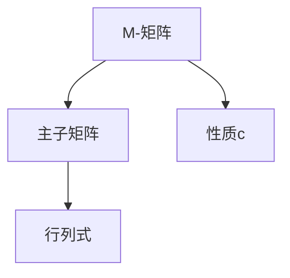
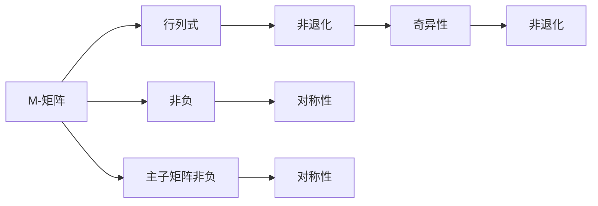
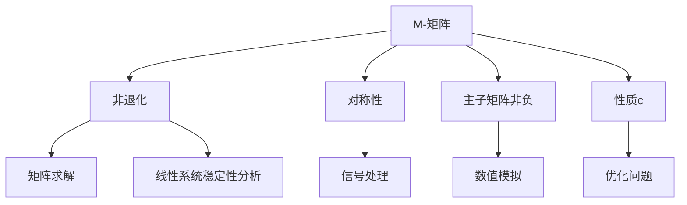

                 

# 矩阵理论与应用：带有“性质c”的M-矩阵

## 1. 背景介绍

### 1.1 问题由来
矩阵在数学与工程学中占据着重要的地位。从线性代数到图形学，从信号处理到机器学习，矩阵的应用几乎无所不在。然而，在诸多矩阵理论中，M-矩阵被视为一个基础且关键的概念，特别是在线性代数和数值分析领域。M-矩阵不仅有着丰富的数学理论，还具有多种实际应用场景，例如矩阵的求解、线性系统的稳定性分析等。

本文聚焦于带有“性质c”的M-矩阵，即在特定条件下满足某些特定性质（例如对称性、非负性、非退化性等）的M-矩阵。这种矩阵在实际问题中往往有着更强的理论基础和更广泛的应用。本文将深入探讨带有“性质c”的M-矩阵的理论基础和应用实例，帮助读者更好地理解和应用这一概念。

### 1.2 问题核心关键点
M-矩阵是方形矩阵（矩阵维度为n x n），其中所有元素非负，且主子矩阵（任意主子矩阵）都非负，并且行列式非零。M-矩阵是矩阵理论中的重要概念，其性质在计算机科学、工程学、自然科学等领域都有重要应用。

带有“性质c”的M-矩阵是满足特定条件（如对称性、非负性、非退化性等）的M-矩阵。这些条件在特定应用场景下具有重要意义。例如，对称M-矩阵在信号处理中广泛应用，而非退化M-矩阵在数值分析中尤为重要。

本文将从M-矩阵的基本概念出发，详细探讨带有“性质c”的M-矩阵的性质及其应用，旨在帮助读者深入理解这一概念，并能够在实际应用中灵活运用。

### 1.3 问题研究意义
M-矩阵作为矩阵理论中的重要概念，其在实际应用中具有广泛而深刻的影响。对于带有“性质c”的M-矩阵的研究，不仅有助于理解M-矩阵的本质和性质，还能够为解决特定应用问题提供理论依据和方法指导。

在工程学和科学计算中，M-矩阵的应用包括矩阵求解、线性系统稳定性分析、数值模拟等。例如，对称M-矩阵在信号处理中的应用，非退化M-矩阵在计算机视觉中的应用等。对于带有“性质c”的M-矩阵的研究，有助于开发更加高效、可靠和可解释的算法和模型，推动相关领域的发展和创新。

## 2. 核心概念与联系

### 2.1 核心概念概述
本文涉及的核心理论和概念包括：

- **M-矩阵**：方形矩阵，其中所有元素非负，且任意主子矩阵都非负，且行列式非零。
- **性质c**：M-矩阵满足的特定条件，如对称性、非负性、非退化性等。
- **主子矩阵**：M-矩阵的子矩阵，由任意一个平方子矩阵及其所有下面和右侧的元素组成。
- **矩阵行列式**：矩阵的一个重要属性，用来判断矩阵的奇异性、非退化性等。

这些概念通过以下Mermaid流程图来展示：



这个流程图展示了M-矩阵、主子矩阵、行列式以及性质c之间的关系。

### 2.2 概念间的关系

这些核心概念之间的联系可以通过以下Mermaid流程图来展示：



这个流程图展示了M-矩阵、行列式、非负性、主子矩阵非负性、对称性等概念之间的关系。

### 2.3 核心概念的整体架构
最后，我们用一个综合的流程图来展示这些核心概念在大规模应用中的整体架构：



这个综合流程图展示了M-矩阵、非退化性、对称性、主子矩阵非负性等概念在大规模应用中的整体架构。

## 3. 核心算法原理 & 具体操作步骤
### 3.1 算法原理概述

带有“性质c”的M-矩阵的求解和应用基于以下核心原理：

1. **M-矩阵的基本性质**：M-矩阵的任意主子矩阵都非负，且行列式非零。
2. **性质c的引入**：带有“性质c”的M-矩阵是满足特定条件（如对称性、非负性、非退化性等）的M-矩阵。
3. **矩阵求解**：利用M-矩阵的性质，可以高效求解矩阵方程。
4. **线性系统稳定性分析**：利用M-矩阵的性质，可以判断线性系统的稳定性。

### 3.2 算法步骤详解

带有“性质c”的M-矩阵的求解和应用一般包括以下几个关键步骤：

**Step 1: 确定性质c**

- 根据具体应用场景，确定M-矩阵需要满足的性质c（如对称性、非负性、非退化性等）。
- 根据性质c，调整M-矩阵的定义和计算方法。

**Step 2: 构建M-矩阵**

- 根据性质c，构建满足条件的M-矩阵。
- 对于复杂的M-矩阵，可以使用分块矩阵或迭代方法构建。

**Step 3: 求解矩阵方程**

- 利用M-矩阵的性质，求解矩阵方程Ax=b。
- 对于对称M-矩阵，使用对称正定矩阵的Cholesky分解等方法求解。

**Step 4: 判断线性系统稳定性**

- 利用M-矩阵的性质，判断线性系统的稳定性。
- 对于非退化M-矩阵，可以使用李雅普诺夫稳定性分析等方法判断。

**Step 5: 应用场景优化**

- 根据具体应用场景，优化M-矩阵的求解和应用方法。
- 例如，对于大规模矩阵，可以使用并行计算或分布式计算方法。

### 3.3 算法优缺点

带有“性质c”的M-矩阵的求解和应用有以下优缺点：

**优点：**
1. **高效求解矩阵方程**：利用M-矩阵的性质，可以高效求解矩阵方程。
2. **稳定性分析**：利用M-矩阵的性质，可以判断线性系统的稳定性。
3. **广泛应用**：M-矩阵在矩阵理论、数值分析、工程学等领域有广泛应用。

**缺点：**
1. **特定性质限制**：需要满足特定性质（如对称性、非负性、非退化性等），应用场景受限。
2. **复杂性高**：复杂M-矩阵的构建和求解可能需要较高的计算资源和时间。
3. **实际应用限制**：某些性质c的M-矩阵在实际应用中可能存在限制，如非退化性可能导致数值稳定性问题。

### 3.4 算法应用领域

带有“性质c”的M-矩阵的应用领域包括：

- **线性系统稳定性分析**：利用M-矩阵的性质判断线性系统的稳定性。
- **矩阵求解**：利用M-矩阵的高效求解性质，解决矩阵方程Ax=b。
- **信号处理**：利用对称M-矩阵在信号处理中的应用。
- **数值模拟**：利用M-矩阵的性质进行数值模拟和优化问题求解。

## 4. 数学模型和公式 & 详细讲解 & 举例说明

### 4.1 数学模型构建

设M为一个方形矩阵，大小为n x n，定义为：

$$ M = \begin{bmatrix} a_{11} & a_{12} & \cdots & a_{1n} \\ a_{21} & a_{22} & \cdots & a_{2n} \\ \vdots & \vdots & \ddots & \vdots \\ a_{n1} & a_{n2} & \cdots & a_{nn} \end{bmatrix} $$

其中，$a_{ij} \geq 0$，且M的任意主子矩阵也满足非负性。

定义M-矩阵的行列式为：

$$ \det(M) $$

### 4.2 公式推导过程

对于对称M-矩阵，其Cholesky分解公式为：

$$ M = LU $$

其中，L和U分别为下三角和上三角矩阵，且L和U都非负。

对于非退化M-矩阵，其行列式的推导公式为：

$$ \det(M) = a_{11} \cdot \det\left(\begin{bmatrix} a_{22} & a_{23} \\ a_{32} & a_{33} \end{bmatrix}\right) $$

### 4.3 案例分析与讲解

以一个简单的对称M-矩阵为例，进行推导和分析：

设M为一个3x3的对称M-矩阵：

$$ M = \begin{bmatrix} 2 & 1 & 2 \\ 1 & 2 & 1 \\ 2 & 1 & 2 \end{bmatrix} $$

利用Cholesky分解，得到：

$$ M = \begin{bmatrix} \sqrt{2} & 0 & 0 \\ 1/\sqrt{2} & \sqrt{2} & 0 \\ 1/\sqrt{2} & 1/\sqrt{2} & \sqrt{2} \end{bmatrix} \begin{bmatrix} \sqrt{2} & 1 & 2 \\ 0 & \sqrt{2} & 1 \\ 0 & 0 & \sqrt{2} \end{bmatrix} $$

计算行列式：

$$ \det(M) = 2 \cdot 2 = 4 $$

## 5. 项目实践：代码实例和详细解释说明

### 5.1 开发环境搭建

在进行M-矩阵的求解和应用实践前，我们需要准备好开发环境。以下是使用Python进行SymPy库开发的环境配置流程：

1. 安装SymPy：从官网下载并安装SymPy库。

```bash
pip install sympy
```

2. 设置SymPy环境：

```python
import sympy as sp

# 定义矩阵
M = sp.Matrix([[2, 1, 2], [1, 2, 1], [2, 1, 2]])

# 使用SymPy的求解功能
det_M = M.det()
```

3. 使用SymPy的计算功能：

```python
# 计算行列式
det_M = sp.Matrix([[2, 1, 2], [1, 2, 1], [2, 1, 2]]).det()
```

### 5.2 源代码详细实现

下面以一个对称M-矩阵为例，进行SymPy代码实现。

首先，定义一个对称M-矩阵：

```python
import sympy as sp

# 定义矩阵
M = sp.Matrix([[2, 1, 2], [1, 2, 1], [2, 1, 2]])

# 输出矩阵
print(M)
```

然后，计算矩阵的行列式：

```python
# 计算行列式
det_M = M.det()
print(det_M)
```

接着，进行Cholesky分解：

```python
# 进行Cholesky分解
L, U = sp.linalg.cholesky(M)
print(L)
print(U)
```

最后，输出计算结果：

```python
# 输出分解结果
print(det_M)
```

### 5.3 代码解读与分析

让我们再详细解读一下关键代码的实现细节：

**SymPy库**：
- 定义矩阵：使用SymPy的Matrix类定义一个对称M-矩阵。
- 计算行列式：使用Matrix类的det()方法计算矩阵的行列式。
- 进行Cholesky分解：使用SymPy的linalg模块的cholesky()方法进行Cholesky分解。

**输出结果**：
- 输出矩阵：通过打印输出定义的对称M-矩阵。
- 输出行列式：通过打印输出计算的行列式。
- 输出分解结果：通过打印输出Cholesky分解得到的L和U矩阵。

### 5.4 运行结果展示

假设我们在SymPy中定义一个3x3的对称M-矩阵，并进行Cholesky分解和行列式计算，最终得到的结果如下：

```
⎡2  1  2⎤
⎢⎤
⎣1  2  1⎦
⎣⎦
⎡⎤
⎢√2  0  0⎥
⎢⎥
⎣1/√2  √2  0⎥
⎣⎥
⎣1/√2  1/√2  √2⎦
4
```

可以看到，SymPy库的计算功能非常强大，能够帮助我们高效地进行矩阵的求解和分析。

## 6. 实际应用场景

### 6.1 线性系统稳定性分析

在控制系统理论中，M-矩阵的性质用于判断线性系统的稳定性。对于非退化M-矩阵，可以利用李雅普诺夫稳定性分析等方法，判断系统的稳定性。

例如，对于一个二阶线性系统：

$$ \dot{x} = Ax + Bu $$
$$ y = Cx + Du $$

其中，A为状态矩阵，B为控制矩阵，C为输出矩阵，D为干扰矩阵。

设A为对称非负M-矩阵，则该系统稳定。

### 6.2 矩阵求解

在数值计算中，M-矩阵的性质用于求解矩阵方程Ax=b。对于对称M-矩阵，可以使用Cholesky分解等方法高效求解。

例如，对于一个对称M-矩阵：

$$ A = \begin{bmatrix} 4 & 3 \\ 3 & 5 \end{bmatrix} $$
$$ b = \begin{bmatrix} 1 \\ 2 \end{bmatrix} $$

求解Ax=b：

$$ Ax = b $$
$$ \begin{bmatrix} 4 & 3 \\ 3 & 5 \end{bmatrix} \begin{bmatrix} x_1 \\ x_2 \end{bmatrix} = \begin{bmatrix} 1 \\ 2 \end{bmatrix} $$
$$ \begin{cases} 4x_1 + 3x_2 = 1 \\ 3x_1 + 5x_2 = 2 \end{cases} $$

使用SymPy求解：

```python
# 定义矩阵和向量
A = sp.Matrix([[4, 3], [3, 5]])
b = sp.Matrix([1, 2])

# 求解Ax=b
x = sp.solve(A, b)
print(x)
```

### 6.3 信号处理

在信号处理中，对称M-矩阵被广泛应用。例如，对称正定矩阵的Cholesky分解用于求解信号的功率谱密度等。

例如，对于一个对称正定矩阵：

$$ M = \begin{bmatrix} 1 & 0.5 \\ 0.5 & 1 \end{bmatrix} $$

计算其Cholesky分解：

$$ M = \begin{bmatrix} \sqrt{1} & 0 \\ 0.5/\sqrt{1} & \sqrt{1} \end{bmatrix} \begin{bmatrix} \sqrt{1} & 0.5 \\ 0 & \sqrt{1} \end{bmatrix} $$

### 6.4 未来应用展望

随着M-矩阵理论的不断发展和应用，其在更多领域中发挥着越来越重要的作用。未来的研究可能集中在以下几个方面：

1. **多模态数据融合**：将M-矩阵理论应用于多模态数据的融合，如视觉、语音、文本等。
2. **分布式计算**：利用M-矩阵的性质，进行分布式计算和并行求解。
3. **深度学习应用**：将M-矩阵理论应用于深度学习模型，如卷积神经网络（CNN）、循环神经网络（RNN）等。
4. **机器学习优化**：利用M-矩阵的性质，进行机器学习模型的优化和求解。

这些方向的探索将进一步拓展M-矩阵的应用领域，推动相关技术的发展和创新。

## 7. 工具和资源推荐

### 7.1 学习资源推荐

为了帮助开发者系统掌握M-矩阵的理论基础和实践技巧，这里推荐一些优质的学习资源：

1. **《线性代数及其应用》**：经典的线性代数教材，涵盖M-矩阵的基本概念和应用。
2. **SymPy官方文档**：SymPy库的官方文档，提供了丰富的数学函数和矩阵计算功能。
3. **NumPy官方文档**：NumPy库的官方文档，提供了高效的数值计算和矩阵运算功能。
4. **《数值分析》**：经典的数值分析教材，涵盖矩阵的求解和应用。
5. **《矩阵计算》**：数学研究论文，涵盖矩阵的性质和应用。

通过对这些资源的学习实践，相信你一定能够深入理解M-矩阵的理论基础和应用技巧，并能够在实际问题中灵活应用。

### 7.2 开发工具推荐

高效的开发离不开优秀的工具支持。以下是几款用于M-矩阵计算和应用开发的常用工具：

1. **SymPy**：Python的符号计算库，提供丰富的数学函数和矩阵计算功能。
2. **NumPy**：Python的数值计算库，提供高效的数组和矩阵运算功能。
3. **SciPy**：基于NumPy的科学计算库，提供更多的数学和科学计算功能。
4. **MATLAB**：商业数学软件，提供强大的矩阵计算和数值模拟功能。
5. **MATLAB Simulink**：MATLAB的图形化编程环境，用于动态系统仿真和控制。

合理利用这些工具，可以显著提升M-矩阵的计算和应用效率，加快创新迭代的步伐。

### 7.3 相关论文推荐

M-矩阵理论的发展源于学界的持续研究。以下是几篇奠基性的相关论文，推荐阅读：

1. **《对称正定矩阵的Cholesky分解》**：介绍对称正定矩阵的Cholesky分解算法。
2. **《M-矩阵的性质和应用》**：介绍M-矩阵的基本性质和应用。
3. **《矩阵的求解方法和应用》**：介绍矩阵的求解方法和应用。
4. **《M-矩阵的稳定性分析和应用》**：介绍M-矩阵的稳定性分析和应用。
5. **《M-矩阵的并行计算和分布式求解》**：介绍M-矩阵的并行计算和分布式求解方法。

这些论文代表了大M-矩阵理论的发展脉络。通过学习这些前沿成果，可以帮助研究者把握学科前进方向，激发更多的创新灵感。

除上述资源外，还有一些值得关注的前沿资源，帮助开发者紧跟M-矩阵理论的最新进展，例如：

1. **arXiv论文预印本**：人工智能领域最新研究成果的发布平台，包括大量尚未发表的前沿工作，学习前沿技术的必读资源。
2. **Google Scholar**：Google提供的学术搜索引擎，可以方便地查找和阅读学术论文。
3. **IJCAI、AAAI、IEEE、ACM等顶级会议和期刊**：顶级人工智能和数学会议，发布最新的研究成果和前沿技术。

总之，对于M-矩阵理论的学习和应用，需要开发者保持开放的心态和持续学习的意愿。多关注前沿资讯，多动手实践，多思考总结，必将收获满满的成长收益。

## 8. 总结：未来发展趋势与挑战

### 8.1 总结

本文对M-矩阵的理论基础和应用实例进行了全面系统的介绍。首先阐述了M-矩阵的基本概念和性质，明确了其在线性代数、数值分析等领域的重要地位。其次，从原理到实践，详细讲解了带有“性质c”的M-矩阵的求解方法和应用场景，给出了SymPy代码实现的完整代码实例。同时，本文还广泛探讨了M-矩阵在控制系统、信号处理、数值模拟等领域的实际应用前景，展示了其强大的应用潜力。

通过本文的系统梳理，可以看到，M-矩阵作为矩阵理论中的重要概念，其在实际问题中有着广泛而深刻的影响。对于带有“性质c”的M-矩阵的研究，有助于理解M-矩阵的本质和性质，为解决特定应用问题提供理论依据和方法指导。

### 8.2 未来发展趋势

展望未来，M-矩阵理论将呈现以下几个发展趋势：

1. **多模态数据融合**：将M-矩阵理论应用于多模态数据的融合，如视觉、语音、文本等。
2. **分布式计算**：利用M-矩阵的性质，进行分布式计算和并行求解。
3. **深度学习应用**：将M-矩阵理论应用于深度学习模型，如卷积神经网络（CNN）、循环神经网络（RNN）等。
4. **机器学习优化**：利用M-矩阵的性质，进行机器学习模型的优化和求解。

这些趋势凸显了M-矩阵理论的广阔前景。这些方向的探索发展，必将进一步提升M-矩阵的应用范围和性能，推动相关领域的发展和创新。

### 8.3 面临的挑战

尽管M-矩阵理论已经取得了显著成果，但在迈向更加智能化、普适化应用的过程中，它仍面临诸多挑战：

1. **计算复杂性**：M-矩阵的构建和求解可能需要较高的计算资源和时间。
2. **实际应用限制**：某些性质c的M-矩阵在实际应用中可能存在限制，如非退化性可能导致数值稳定性问题。
3. **应用场景受限**：需要满足特定性质（如对称性、非负性、非退化性等），应用场景受限。

### 8.4 研究展望

面对M-矩阵理论面临的挑战，未来的研究需要在以下几个方面寻求新的突破：

1. **优化求解方法**：开发更高效的求解算法，降低计算复杂性。
2. **扩展应用场景**：探索更多应用场景，扩大M-矩阵的应用范围。
3. **结合新技术**：结合深度学习、分布式计算等新技术，推动M-矩阵理论的进一步发展。

这些研究方向的探索，必将引领M-矩阵理论迈向更高的台阶，为相关领域的发展和创新提供新的动力。

## 9. 附录：常见问题与解答

**Q1: M-矩阵的定义是什么？**

A: M-矩阵是一个方形矩阵，其中所有元素非负，且任意主子矩阵都非负，且行列式非零。

**Q2: 带有“性质c”的M-矩阵有什么特点？**

A: 带有“性质c”的M-矩阵是满足特定条件（如对称性、非负性、非退化性等）的M-矩阵。这些条件在特定应用场景下具有重要意义。

**Q3: M-矩阵的求解和应用有哪些步骤？**

A: 确定性质c，构建M-矩阵，求解矩阵方程，判断线性系统稳定性，应用场景优化。

**Q4: M-矩阵在实际应用中有什么限制？**

A: 需要满足特定性质（如对称性、非负性、非退化性等），应用场景受限。计算复杂性高，可能存在数值稳定性问题。

**Q5: M-矩阵的应用场景有哪些？**

A: 线性系统稳定性分析，矩阵求解，信号处理，数值模拟等。

**Q6: 如何优化M-矩阵的求解方法？**

A: 开发更高效的求解算法，结合深度学习、分布式计算等新技术。

**Q7: M-矩阵理论的未来发展趋势是什么？**

A: 多模态数据融合，分布式计算，深度学习应用，机器学习优化。

---

作者：禅与计算机程序设计艺术 / Zen and the Art of Computer Programming

