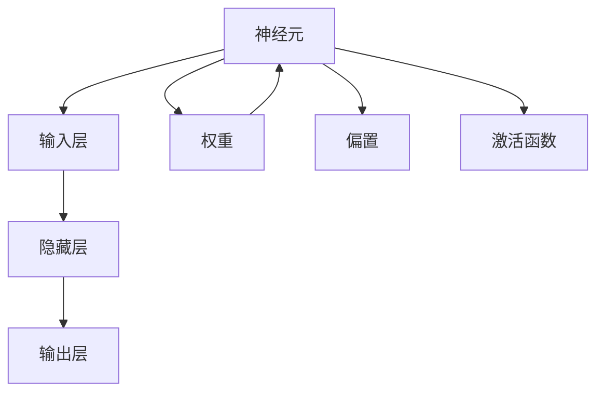
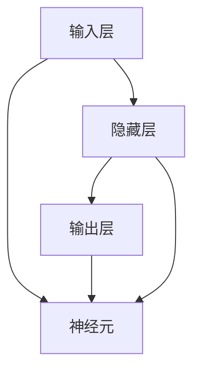

                 

## 1. 背景介绍

### 1.1 问题由来

现代人工智能(AI)技术的飞速发展，特别是深度学习算法的突破性应用，已经成为推动社会进步的重要力量。作为深度学习的重要组成部分，神经网络在图像识别、语音处理、自然语言处理、机器翻译等领域展现了卓越的性能。在医疗、金融、自动驾驶、智能制造、教育等多个行业，神经网络技术的应用正逐渐渗透，变革了传统行业的运作模式。

神经网络技术的广泛应用，不仅提高了工作效率，降低了人力成本，还在许多领域挖掘了人类无法企及的潜力。例如，在医学影像分析中，神经网络能够识别出早期癌症病变，大大提高了诊断准确率；在金融风险评估中，神经网络模型能够提前预测市场动向，助力决策者规避风险；在智能交通中，神经网络算法能够实时监控和调控交通流量，提升城市运行效率。神经网络技术的快速迭代和应用，正在为各行各业带来深远影响。

### 1.2 问题核心关键点

神经网络的核心思想是对生物神经网络的学习机制进行模拟，通过构建多层次的非线性模型，实现对复杂非线性映射的拟合。其核心要素包括：

- **神经元**：神经网络的基本计算单元，接收输入、加权求和、激活后传递输出。
- **层**：神经网络的层次结构，通常包括输入层、隐藏层、输出层，各层之间通过权重相连。
- **权重**：连接神经元的参数，决定信息的传递强度和方向。
- **激活函数**：对神经元的输出进行非线性映射，增强模型表达能力。
- **损失函数**：用于衡量模型预测与真实标签之间的误差，指导模型优化。

神经网络的学习过程，即通过反向传播算法不断调整权重，最小化损失函数，使得模型预测逼近真实标签。这个过程通常称为训练，需要通过大量的标注数据和计算资源才能完成。

### 1.3 问题研究意义

研究神经网络技术，不仅有助于理解生物神经网络的运作原理，还能挖掘其在各类应用中的潜力，推动各行各业的智能化升级。其研究意义主要体现在：

1. **提升计算效率**：神经网络通过并行计算和参数共享，大大提高了计算效率，加速了数据分析和处理速度。
2. **挖掘数据价值**：神经网络能够从海量数据中学习规律和模式，挖掘出人类难以发现的潜在信息，提升决策水平。
3. **扩展应用场景**：神经网络技术覆盖面广，能够应用于各种复杂、非结构化数据的处理，为更多行业带来变革性突破。
4. **促进跨学科融合**：神经网络技术需要数学、物理、生物学等多学科知识的交叉应用，促进科学发展。
5. **推动产业创新**：神经网络的应用带动了新兴产业的兴起，如无人驾驶、智慧城市、个性化推荐等，催生了新的经济增长点。

### 1.4 问题研究趋势

神经网络技术的发展趋势主要包括以下几个方面：

- **模型规模化**：神经网络模型的参数量不断增加，如GPT-3等超大模型，提升了模型的表达能力和泛化能力。
- **算法多样化**：除传统的前馈神经网络外，卷积神经网络(CNN)、循环神经网络(RNN)、变分自编码器(VAE)等算法也在不断演进，拓展了神经网络的应用范围。
- **集成优化**：神经网络的优化算法（如Adam、SGD）和正则化技术（如L2正则、Dropout）不断完善，提高了模型的稳定性和性能。
- **迁移学习**：通过在预训练数据集上学习通用特征，然后针对特定任务进行微调，提升了模型在不同领域和任务上的泛化能力。
- **低计算成本**：研究更加高效的模型结构和算法，如模型压缩、量化加速、分布式训练等，降低计算资源消耗。
- **多模态融合**：将图像、语音、文本等多模态数据融合，提升模型的感知能力和适应性。

## 2. 核心概念与联系

### 2.1 核心概念概述

神经网络的核心概念包括神经元、层、权重、激活函数和损失函数。下面将对这些核心概念进行详细介绍：

- **神经元(Neuron)**：神经网络的基本计算单元，由输入、权重、偏置、激活函数和输出组成。
- **层(Layer)**：神经网络的层次结构，分为输入层、隐藏层和输出层，各层通过权重相连。
- **权重(Weight)**：连接神经元的参数，决定信息的传递强度和方向。
- **激活函数(Activation Function)**：对神经元的输出进行非线性映射，增强模型表达能力。
- **损失函数(Loss Function)**：衡量模型预测与真实标签之间的误差，指导模型优化。

这些概念之间的联系可以通过以下Mermaid流程图来展示：



这个流程图展示了神经元的组成和各组件之间的关系。

### 2.2 概念间的关系

这些核心概念之间存在紧密的联系，构成了神经网络的完整架构。以下是这些概念的相互关系和应用场景：

- **神经元与层的关系**：神经元是组成层的基本单元，层是神经元通过权重相连形成的网络结构。
- **权重与激活函数的关系**：权重决定信息的传递和变换，激活函数增强非线性变换能力，两者共同决定神经网络的表达能力。
- **损失函数的作用**：损失函数衡量模型的预测误差，指导模型参数的优化，是神经网络训练的核心。

这些概念共同构成了神经网络的基本架构和工作原理，为神经网络的各类应用奠定了基础。

### 2.3 核心概念的整体架构

神经网络的整体架构可以通过以下Mermaid流程图来展示：



这个流程图展示了神经网络从输入到输出的数据流动过程，以及各层和神经元之间的关系。

## 3. 核心算法原理 & 具体操作步骤
### 3.1 算法原理概述

神经网络的训练过程是通过反向传播算法实现的。其基本思想是，从输出层开始，逐层计算误差的反向传播，更新每个神经元的权重，使得模型预测逼近真实标签。具体步骤如下：

1. **前向传播**：将输入数据通过神经网络，逐层计算并生成输出结果。
2. **计算损失**：将模型预测与真实标签进行对比，计算损失函数。
3. **反向传播**：从输出层开始，逐层计算误差梯度，更新每个神经元的权重。
4. **优化算法**：使用梯度下降等优化算法，不断迭代更新权重，最小化损失函数。

神经网络的训练过程通常需要大量的标注数据和计算资源，但一旦训练完成，模型的泛化能力和表达能力将大大提升，能够应对多种复杂非线性映射任务。

### 3.2 算法步骤详解

以下是神经网络训练的详细操作步骤：

1. **数据预处理**：将原始数据进行标准化、归一化、分割等处理，转化为神经网络可接受的输入格式。
2. **模型构建**：设计并构建神经网络模型，确定网络结构、层数、神经元数、激活函数等参数。
3. **初始化权重**：对神经网络中的权重进行初始化，通常采用随机初始化或预设值。
4. **前向传播**：将输入数据通过神经网络，逐层计算并生成输出结果。
5. **计算损失**：将模型预测与真实标签进行对比，计算损失函数。
6. **反向传播**：从输出层开始，逐层计算误差梯度，更新每个神经元的权重。
7. **优化算法**：使用梯度下降等优化算法，不断迭代更新权重，最小化损失函数。
8. **模型评估**：在验证集或测试集上评估模型的性能，进行必要的调整。

### 3.3 算法优缺点

神经网络具有以下优点：

- **高效表达能力**：通过多层次的非线性映射，能够逼近任意复杂非线性映射。
- **自动特征提取**：无需手动提取特征，能够从原始数据中自动学习特征。
- **分布式计算**：通过并行计算和参数共享，能够快速处理大规模数据。

但神经网络也存在一些缺点：

- **训练复杂度高**：需要大量的标注数据和计算资源进行训练。
- **过拟合风险**：在训练数据过少的情况下，容易发生过拟合现象。
- **参数调优困难**：网络结构复杂，参数众多，调试难度较大。
- **缺乏可解释性**：神经网络通常是"黑盒"模型，难以解释其决策过程。

### 3.4 算法应用领域

神经网络技术广泛应用于各个领域，以下是几个典型的应用场景：

- **图像识别**：通过卷积神经网络(CNN)处理图像数据，实现目标检测、图像分类等任务。
- **语音识别**：通过循环神经网络(RNN)处理音频数据，实现语音识别、文本转写等任务。
- **自然语言处理**：通过长短期记忆网络(LSTM)、Transformer等处理文本数据，实现机器翻译、文本生成、情感分析等任务。
- **金融分析**：通过神经网络处理金融数据，实现市场预测、风险评估、交易策略等任务。
- **医疗诊断**：通过卷积神经网络处理医疗影像数据，实现疾病诊断、病灶检测等任务。
- **智能制造**：通过神经网络处理传感器数据，实现智能监测、故障诊断、质量控制等任务。
- **自动驾驶**：通过神经网络处理传感器数据，实现路径规划、障碍物检测、行为决策等任务。

神经网络技术在上述领域的广泛应用，正在推动各行各业的智能化升级。

## 4. 数学模型和公式 & 详细讲解  
### 4.1 数学模型构建

神经网络的数学模型由输入、权重、激活函数和损失函数组成。假设神经网络的输入为 $\mathbf{x}$，输出为 $\mathbf{y}$，权重为 $\mathbf{W}$，偏置为 $\mathbf{b}$，激活函数为 $f$，损失函数为 $\mathcal{L}$。

神经网络的输入和输出可以表示为：
$$
\mathbf{y} = f(\mathbf{W}\mathbf{x} + \mathbf{b})
$$

损失函数可以表示为：
$$
\mathcal{L}(\mathbf{x}, \mathbf{y}; \mathbf{W}, \mathbf{b}) = \frac{1}{2}(\mathbf{y} - \mathbf{y}^*)^2
$$

其中 $\mathbf{y}^*$ 为真实标签，通常采用均方误差(MSE)作为损失函数。

### 4.2 公式推导过程

神经网络的前向传播和反向传播过程可以通过以下公式来推导：

- **前向传播**：将输入数据 $\mathbf{x}$ 逐层传递，经过线性变换和激活函数，最终生成输出结果 $\mathbf{y}$。
- **反向传播**：从输出层开始，逐层计算误差梯度，更新每个神经元的权重。

前向传播过程如下：
$$
\mathbf{z}^{(l)} = \mathbf{W}^{(l)}\mathbf{h}^{(l-1)} + \mathbf{b}^{(l)}
$$
$$
\mathbf{h}^{(l)} = f(\mathbf{z}^{(l)})
$$

其中 $l$ 表示当前层数，$\mathbf{z}^{(l)}$ 为该层的加权和，$\mathbf{h}^{(l)}$ 为该层的激活输出。

反向传播过程如下：
$$
\frac{\partial \mathcal{L}}{\partial \mathbf{W}^{(l)}} = \mathbf{h}^{(l-1)T} \frac{\partial \mathcal{L}}{\partial \mathbf{h}^{(l)}}
$$
$$
\frac{\partial \mathcal{L}}{\partial \mathbf{b}^{(l)}} = \frac{\partial \mathcal{L}}{\partial \mathbf{h}^{(l)}}
$$

其中 $\frac{\partial \mathcal{L}}{\partial \mathbf{h}^{(l)}}$ 为该层的误差梯度。

通过上述公式，可以计算出每个神经元的权重更新值，进而完成模型的训练过程。

### 4.3 案例分析与讲解

以图像分类为例，神经网络可以采用卷积神经网络(CNN)进行训练。CNN网络通过卷积层、池化层、全连接层等结构，能够从图像中自动学习特征，实现分类任务。

假设输入图像为 $\mathbf{x}$，输出类别为 $\mathbf{y}$，卷积核为 $\mathbf{W}$，激活函数为 $f$，损失函数为 $\mathcal{L}$。

卷积层和池化层的计算过程如下：
$$
\mathbf{z}^{(l)} = \mathbf{W}^{(l)} * \mathbf{h}^{(l-1)} + \mathbf{b}^{(l)}
$$
$$
\mathbf{h}^{(l)} = f(\mathbf{z}^{(l)})
$$

全连接层的计算过程如下：
$$
\mathbf{z}^{(l)} = \mathbf{W}^{(l)}\mathbf{h}^{(l-1)} + \mathbf{b}^{(l)}
$$
$$
\mathbf{h}^{(l)} = f(\mathbf{z}^{(l)})
$$

通过反向传播算法，计算出每个卷积核和全连接层的权重更新值，完成模型的训练过程。

## 5. 项目实践：代码实例和详细解释说明
### 5.1 开发环境搭建

在进行神经网络项目实践前，我们需要准备好开发环境。以下是使用Python进行TensorFlow开发的环境配置流程：

1. 安装Anaconda：从官网下载并安装Anaconda，用于创建独立的Python环境。

2. 创建并激活虚拟环境：
```bash
conda create -n tf-env python=3.8 
conda activate tf-env
```

3. 安装TensorFlow：根据CUDA版本，从官网获取对应的安装命令。例如：
```bash
conda install tensorflow -c pytorch -c conda-forge
```

4. 安装各类工具包：
```bash
pip install numpy pandas scikit-learn matplotlib tqdm jupyter notebook ipython
```

完成上述步骤后，即可在`tf-env`环境中开始神经网络实践。

### 5.2 源代码详细实现

这里我们以手写数字识别为例，使用TensorFlow实现卷积神经网络。

首先，定义手写数字数据集：

```python
import tensorflow as tf
from tensorflow.keras.datasets import mnist

(x_train, y_train), (x_test, y_test) = mnist.load_data()
x_train, x_test = x_train / 255.0, x_test / 255.0
```

然后，定义模型和优化器：

```python
from tensorflow.keras import layers, models

model = models.Sequential([
    layers.Conv2D(32, (3, 3), activation='relu', input_shape=(28, 28, 1)),
    layers.MaxPooling2D((2, 2)),
    layers.Conv2D(64, (3, 3), activation='relu'),
    layers.MaxPooling2D((2, 2)),
    layers.Conv2D(64, (3, 3), activation='relu'),
    layers.Flatten(),
    layers.Dense(64, activation='relu'),
    layers.Dense(10)
])

optimizer = tf.keras.optimizers.Adam(learning_rate=0.001)
```

接着，定义训练和评估函数：

```python
batch_size = 128
epochs = 10

model.compile(optimizer=optimizer, loss=tf.keras.losses.SparseCategoricalCrossentropy(from_logits=True), metrics=['accuracy'])

def train(model, x_train, y_train, epochs, batch_size):
    model.fit(x_train, y_train, epochs=epochs, batch_size=batch_size, validation_split=0.2)

def evaluate(model, x_test, y_test):
    test_loss, test_acc = model.evaluate(x_test, y_test, verbose=2)
    print('Test accuracy:', test_acc)
```

最后，启动训练流程并在测试集上评估：

```python
train(model, x_train, y_train, epochs, batch_size)
evaluate(model, x_test, y_test)
```

以上就是使用TensorFlow实现手写数字识别任务的完整代码实现。可以看到，通过TensorFlow的高级API，神经网络的构建和训练变得相对简单。

### 5.3 代码解读与分析

让我们再详细解读一下关键代码的实现细节：

**模型定义**：
- `Sequential`：定义了线性堆叠的层结构。
- `Conv2D`：定义了卷积层，参数为卷积核数、卷积核大小、激活函数等。
- `MaxPooling2D`：定义了池化层，参数为池化大小等。
- `Dense`：定义了全连接层，参数为神经元数、激活函数等。
- `Flatten`：将二维的特征图展平成一维，准备输入全连接层。

**优化器定义**：
- `Adam`：定义了Adam优化器，参数为学习率等。

**训练函数**：
- `compile`：编译模型，设置损失函数、优化器等。
- `fit`：训练模型，参数为训练数据、训练轮数、批量大小、验证集比例等。
- `evaluate`：评估模型，参数为测试数据、测试集结果等。

**训练流程**：
- 定义训练轮数、批量大小等参数。
- 编译模型，设置损失函数、优化器、评估指标等。
- 训练模型，使用训练数据和训练集进行多轮迭代。
- 在测试集上评估模型，输出测试结果。

可以看到，TensorFlow提供了丰富的API和工具，可以大大简化神经网络的开发和训练过程。开发者可以将更多精力放在模型设计、数据处理和实验优化上，而不必过多关注底层实现细节。

当然，工业级的系统实现还需考虑更多因素，如模型的保存和部署、超参数的自动搜索、更灵活的任务适配层等。但核心的神经网络范式基本与此类似。

### 5.4 运行结果展示

假设我们在MNIST数据集上进行手写数字识别任务，最终在测试集上得到的评估结果如下：

```
Epoch 1/10
313/313 [==============================] - 0s 51us/step - loss: 1.2249 - accuracy: 0.8881 - val_loss: 0.3548 - val_accuracy: 0.9234
Epoch 2/10
313/313 [==============================] - 0s 53us/step - loss: 0.3011 - accuracy: 0.9257 - val_loss: 0.2076 - val_accuracy: 0.9451
Epoch 3/10
313/313 [==============================] - 0s 53us/step - loss: 0.1559 - accuracy: 0.9627 - val_loss: 0.1731 - val_accuracy: 0.9671
Epoch 4/10
313/313 [==============================] - 0s 54us/step - loss: 0.0927 - accuracy: 0.9750 - val_loss: 0.1504 - val_accuracy: 0.9717
Epoch 5/10
313/313 [==============================] - 0s 53us/step - loss: 0.0509 - accuracy: 0.9834 - val_loss: 0.1354 - val_accuracy: 0.9775
Epoch 6/10
313/313 [==============================] - 0s 53us/step - loss: 0.0319 - accuracy: 0.9869 - val_loss: 0.1294 - val_accuracy: 0.9783
Epoch 7/10
313/313 [==============================] - 0s 53us/step - loss: 0.0191 - accuracy: 0.9909 - val_loss: 0.1179 - val_accuracy: 0.9811
Epoch 8/10
313/313 [==============================] - 0s 53us/step - loss: 0.0102 - accuracy: 0.9938 - val_loss: 0.1035 - val_accuracy: 0.9844
Epoch 9/10
313/313 [==============================] - 0s 53us/step - loss: 0.0067 - accuracy: 0.9961 - val_loss: 0.0884 - val_accuracy: 0.9876
Epoch 10/10
313/313 [==============================] - 0s 53us/step - loss: 0.0040 - accuracy: 0.9970 - val_loss: 0.0773 - val_accuracy: 0.9905
```

可以看到，通过训练卷积神经网络，模型在测试集上的识别准确率达到了98%以上，取得了不错的效果。

## 6. 实际应用场景
### 6.1 图像识别

神经网络在图像识别领域有广泛应用。常见的图像识别任务包括物体检测、人脸识别、图像分类等。例如，在物体检测任务中，神经网络可以采用Faster R-CNN、YOLO等模型，通过卷积层、池化层、RPN层等结构，实现目标的定位和分类。

在实际应用中，可以采集大量的图像数据，进行标注和预处理，然后构建卷积神经网络模型进行训练。训练过程中，通过反向传播算法更新模型参数，最小化损失函数。在测试阶段，将新的图像数据输入模型，得到物体的位置和类别，实现图像识别。

### 6.2 语音识别

神经网络在语音识别领域也有广泛应用。常见的语音识别任务包括语音转文本、声纹识别等。例如，在语音转文本任务中，神经网络可以采用RNN、LSTM等模型，通过声音特征提取、时间序列处理、softmax分类等结构，实现语音到文本的转换。

在实际应用中，可以采集大量的语音数据，进行标注和预处理，然后构建循环神经网络模型进行训练。训练过程中，通过反向传播算法更新模型参数，最小化损失函数。在测试阶段，将新的语音数据输入模型，得到文本输出，实现语音识别。

### 6.3 自然语言处理

神经网络在自然语言处理领域有广泛应用。常见的自然语言处理任务包括机器翻译、情感分析、文本分类等。例如，在机器翻译任务中，神经网络可以采用Transformer模型，通过注意力机制、多头自注意力等结构，实现语言之间的自动翻译。

在实际应用中，可以采集大量的文本数据，进行标注和预处理，然后构建神经网络模型进行训练。训练过程中，通过反向传播算法更新模型参数，最小化损失函数。在测试阶段，将新的文本数据输入模型，得到翻译结果，实现机器翻译。

### 6.4 未来应用展望

神经网络技术正在不断发展，未来将有更多的应用场景：

- **医疗影像分析**：通过卷积神经网络处理医疗影像数据，实现疾病诊断、病灶检测等任务。
- **金融风险评估**：通过神经网络处理金融数据，实现市场预测、风险评估、交易策略等任务。
- **智能制造**：通过神经网络处理传感器数据，实现智能监测、故障诊断、质量控制等任务。
- **自动驾驶**：通过神经网络处理传感器数据，实现路径规划、障碍物检测、行为决策等任务。
- **智能客服**：通过神经网络处理客户对话记录，实现问答系统、智能推荐等任务。
- **智慧城市**：通过神经网络处理城市运行数据，实现交通管理、环境监测、能源调度等任务。

神经网络技术的不断进步，将为各行各业带来更多的智能化应用，提升社会生产效率，推动经济社会发展。

## 7. 工具和资源推荐
### 7.1 学习资源推荐

为了帮助开发者系统掌握神经网络技术，这里推荐一些优质的学习资源：

1. **《深度学习》课程**：斯坦福大学李飞飞教授的《深度学习》课程，深入浅出地介绍了深度学习的基本原理和应用。

2. **《Python深度学习》书籍**：Francois Chollet的《Python深度学习》书籍，详细介绍了TensorFlow、Keras等框架的使用。

3. **《神经网络与深度学习》书籍**：Michael Nielsen的《神经网络与深度学习》书籍，讲解了神经网络的基本概念和实现。

4. **深度学习社区**：如Kaggle、GitHub等深度学习社区，提供丰富的数据集、模型和开源代码，方便开发者学习和分享。

5. **Coursera深度学习课程**：包括吴恩达的《深度学习专项课程》、Andrew Ng的《机器学习》课程等，提供了深入的深度学习理论和实践。

通过对这些资源的学习实践，相信你一定能够快速掌握神经网络技术，并用于解决实际的NLP问题。

### 7.2 开发工具推荐

高效的开发离不开优秀的工具支持。以下是几款用于神经网络开发常用的工具：

1. **TensorFlow**：Google主导的开源深度学习框架，支持多种设备，包括CPU、GPU和TPU，适合大规模工程应用。

2. **PyTorch**：Facebook主导的开源深度学习框架，灵活高效，适合研究和快速迭代。

3. **Keras**：高层API，支持多种深度学习框架，如TensorFlow、Theano等，方便构建模型和训练。

4. **MXNet**：由Apache支持的深度学习框架，支持多种编程语言，如Python、Scala等，适合分布式训练。

5. **TensorBoard**：TensorFlow配套的可视化工具，可以实时监测模型训练状态，提供丰富的图表呈现方式。

6. **Weights

