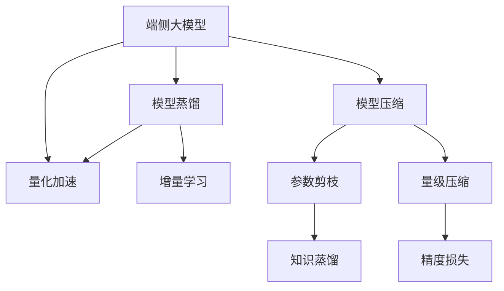
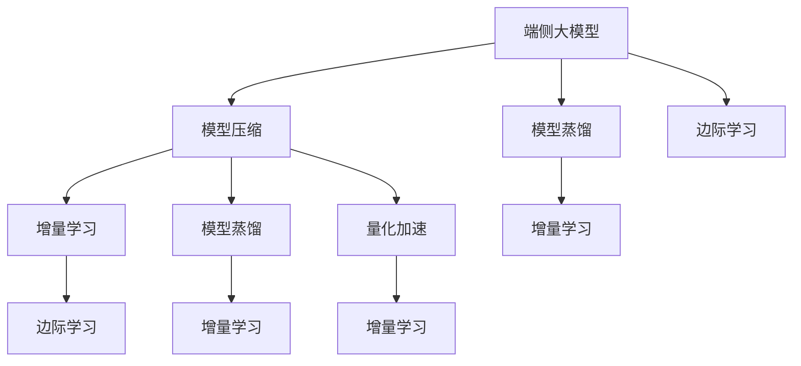
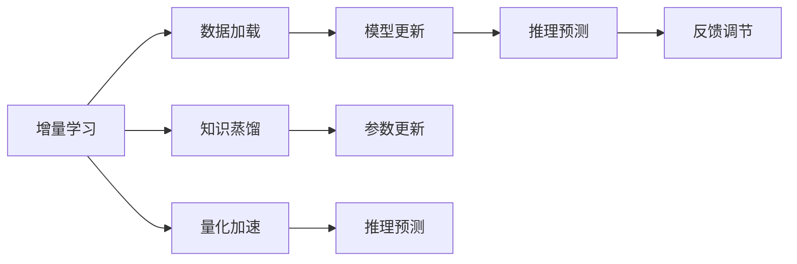
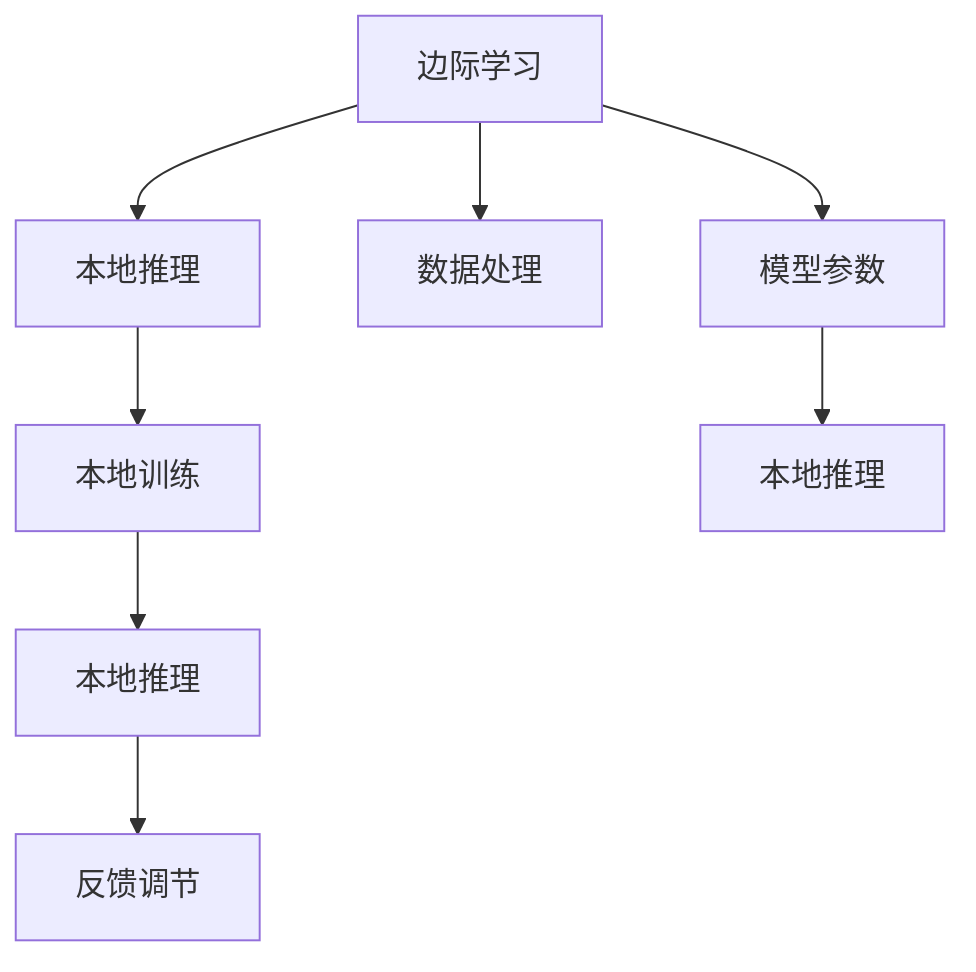

                 

# 端侧大模型加速部署与未来交互

## 1. 背景介绍

随着深度学习技术的迅猛发展，大模型在计算机视觉、自然语言处理、语音识别等诸多领域取得了显著成效。这些大模型虽然具备强大的推理和表示能力，但在实际应用中，尤其是移动端等资源受限的设备上，面临着推理速度慢、内存占用大等性能瓶颈问题。因此，如何在大模型与端侧设备之间架起一座桥梁，加速模型推理，提升用户体验，成为当前研究的热点问题。

为了缓解这些问题，加速模型在移动端、嵌入式设备等端侧设备上的部署，研究者们提出了诸多优化方法，如模型压缩、模型蒸馏、量化加速等。这些技术不仅提升了模型性能，也带来了新的交互方式和应用场景，如零样本学习、增量学习和边际学习等。

## 2. 核心概念与联系

### 2.1 核心概念概述

为更好地理解端侧大模型的加速部署与未来交互，本节将介绍几个密切相关的核心概念：

- 端侧大模型(End-device Large Model)：在移动端、嵌入式设备等资源受限的端侧设备上，部署的大规模预训练模型。通过优化算法和硬件架构，使得模型能在端侧设备上高效推理。

- 模型压缩(Model Compression)：通过参数剪枝、知识蒸馏、量级压缩等方法，减小模型的存储空间和计算复杂度，提升模型的推理速度。

- 模型蒸馏(Model Distillation)：将大模型（teacher model）的知识逐步传递给小模型（student model），使得小模型也能继承大模型的知识。常用于加速模型推理，降低硬件需求。

- 量化加速(Quantization)：将浮点模型转化为定点模型，通过降低数值精度，减少内存占用和计算复杂度。

- 增量学习(Continual Learning)：模型能够持续从新数据中学习，同时保持已学习的知识，而不会出现灾难性遗忘。

- 边际学习(Edge Learning)：在端侧设备上直接进行模型推理和训练，无需将数据上传到云端。

这些核心概念之间的逻辑关系可以通过以下Mermaid流程图来展示：



这个流程图展示了大模型在端侧设备的优化过程：

1. 端侧大模型通过模型压缩、模型蒸馏、量化加速等技术，减少存储空间和计算复杂度。
2. 模型蒸馏技术将大模型知识传递给小模型，使得小模型也能具备较好的推理能力。
3. 增量学习技术使得模型能够持续学习新数据，保持知识更新。
4. 边际学习技术实现直接在端侧设备上的模型推理和训练，降低传输成本和数据隐私风险。

### 2.2 概念间的关系

这些核心概念之间存在着紧密的联系，形成了端侧大模型优化与部署的完整生态系统。下面我通过几个Mermaid流程图来展示这些概念之间的关系。

#### 2.2.1 大模型的端侧优化流程



这个流程图展示了大模型在端侧设备的优化流程：

1. 端侧大模型首先通过模型压缩技术，减少存储空间和计算复杂度。
2. 然后，模型蒸馏技术将大模型知识传递给增量学习模型，使得模型能够持续学习新数据，保持知识更新。
3. 最终，边际学习技术实现直接在端侧设备上的模型推理和训练，降低传输成本和数据隐私风险。

#### 2.2.2 增量学习的核心步骤



这个流程图展示了增量学习的基本原理，以及它与大模型优化之间的关系。增量学习涉及数据加载、模型更新、推理预测和反馈调节等核心步骤。

#### 2.2.3 边际学习的实现框架



这个流程图展示了边际学习的基本实现框架，包括本地推理、本地训练、数据处理和反馈调节等关键环节。

## 3. 核心算法原理 & 具体操作步骤

### 3.1 算法原理概述

端侧大模型的加速部署与未来交互，本质上是通过一系列的模型优化算法和硬件优化策略，提升模型在端侧设备的推理速度和资源利用效率。其核心思想是：在保证模型性能的前提下，减少模型的大小和计算复杂度，提升模型在端侧设备的运行效率。

形式化地，假设预训练模型为 $M_{\theta}$，其中 $\theta$ 为预训练得到的模型参数。设 $\mathcal{X}$ 为输入空间，$\mathcal{Y}$ 为输出空间。在端侧设备上，由于硬件资源受限，我们需要对模型进行优化，以适应资源受限的计算环境。优化过程可以分以下几步：

1. 模型压缩：通过剪枝、知识蒸馏等方法，减小模型大小，提升推理速度。
2. 量化加速：将模型参数量化为定点数，减少内存占用和计算复杂度。
3. 增量学习：模型在端侧设备上持续从新数据中学习，保持知识更新。
4. 边际学习：模型直接在端侧设备上推理和训练，无需数据上传云端。

### 3.2 算法步骤详解

#### 3.2.1 模型压缩

模型压缩是减少模型大小，提升推理速度的重要手段。常用的方法包括参数剪枝、知识蒸馏等。

**参数剪枝**：通过删除模型中不必要的参数，减小模型规模，提升推理速度。常用技术包括：
1. 权重剪枝：移除模型中权重值较小的部分，保留对模型效果影响最大的参数。
2. 结构剪枝：去除模型中冗余的层或连接，减少计算复杂度。

**知识蒸馏**：将大模型的知识逐步传递给小模型，使得小模型也能具备较好的推理能力。常用技术包括：
1. 软标签蒸馏：使用大模型的输出概率分布作为小模型的目标标签，使得小模型学习大模型的预测能力。
2. 硬标签蒸馏：直接使用大模型的输出结果作为小模型的目标标签，进行知识传递。

**量级压缩**：将浮点模型转化为定点模型，减少内存占用和计算复杂度。常用技术包括：
1. 整数量化：将浮点数的数值范围压缩到整数范围，降低内存占用。
2. 稀疏量化：将模型参数转化为稀疏表示，减少存储和计算资源消耗。

#### 3.2.2 量化加速

量化加速是通过降低数值精度，减少内存占用和计算复杂度。常用的技术包括：
1. 整数量化：将浮点数的数值范围压缩到整数范围，降低内存占用。
2. 稀疏量化：将模型参数转化为稀疏表示，减少存储和计算资源消耗。

#### 3.2.3 增量学习

增量学习是模型能够持续从新数据中学习，同时保持已学习的知识，而不会出现灾难性遗忘。常用技术包括：
1. 在线学习：模型在实时获取新数据时，实时更新模型参数，保持最新知识。
2. 元学习：模型学习如何快速适应新任务，提升模型在新环境下的适应能力。

#### 3.2.4 边际学习

边际学习是模型直接在端侧设备上推理和训练，无需数据上传云端。常用技术包括：
1. 本地推理：在端侧设备上直接进行模型推理，减少网络延迟和数据传输成本。
2. 本地训练：在端侧设备上直接训练模型，降低网络延迟和数据传输成本。

### 3.3 算法优缺点

端侧大模型的加速部署与未来交互方法具有以下优点：

1. **推理速度提升**：通过模型压缩和量化加速技术，大幅减小了模型大小和计算复杂度，使得模型在端侧设备上能够快速推理。
2. **资源利用率提高**：通过增量学习和边际学习技术，模型能够持续学习和适应新数据，提高资源利用效率。
3. **降低成本和风险**：边际学习技术使得模型直接在端侧设备上训练和推理，减少了数据上传和存储成本，降低了数据隐私风险。

同时，这些方法也存在以下缺点：

1. **模型精度下降**：通过剪枝、量化等技术，模型精度可能有所下降。
2. **学习效率降低**：增量学习技术使得模型需要不断适应新数据，学习效率可能降低。
3. **设备限制**：端侧设备的硬件资源有限，可能无法完全支撑大模型的运行。

### 3.4 算法应用领域

端侧大模型的加速部署与未来交互方法在多个领域都有广泛的应用：

- 计算机视觉：如移动设备上的图像分类、目标检测、人脸识别等。
- 自然语言处理：如移动设备上的语音识别、文本分类、问答系统等。
- 语音识别：如智能音箱、智能耳机等设备上的语音识别和交互系统。
- 物联网：如智慧城市、智能家居、车联网等设备上的模型推理和决策。

## 4. 数学模型和公式 & 详细讲解 & 举例说明

### 4.1 数学模型构建

本节将使用数学语言对端侧大模型的优化过程进行更加严格的刻画。

假设预训练模型为 $M_{\theta}$，其中 $\theta$ 为预训练得到的模型参数。设 $\mathcal{X}$ 为输入空间，$\mathcal{Y}$ 为输出空间。在端侧设备上，我们需要对模型进行优化，以适应资源受限的计算环境。优化过程可以分以下几步：

1. 模型压缩：通过剪枝、知识蒸馏等方法，减小模型大小，提升推理速度。
2. 量化加速：将模型参数量化为定点数，减少内存占用和计算复杂度。
3. 增量学习：模型在端侧设备上持续从新数据中学习，保持知识更新。
4. 边际学习：模型直接在端侧设备上推理和训练，无需数据上传云端。

### 4.2 公式推导过程

以下我以模型压缩和量化加速为例，推导其计算公式和基本原理。

#### 4.2.1 模型压缩

**权重剪枝**：假设原始模型中的第 $i$ 个权重为 $w_i$，通过设置阈值 $\epsilon$ 进行剪枝，即：

$$
\hat{w}_i = \begin{cases}
w_i, & \text{if } |w_i| > \epsilon \\
0, & \text{otherwise}
\end{cases}
$$

剪枝后的模型参数为 $\hat{\theta} = (\hat{w}_1, \hat{w}_2, ..., \hat{w}_n)$，对应的推理公式为：

$$
\hat{y} = M_{\hat{\theta}}(x) = \sum_{i=1}^n \hat{w}_i f_i(x)
$$

其中 $f_i(x)$ 为第 $i$ 个神经元在输入 $x$ 下的激活函数。

**知识蒸馏**：假设大模型 $M_{\theta}$ 在输入 $x$ 上的输出为 $y$，小模型 $M_{\hat{\theta}}$ 在输入 $x$ 上的输出为 $\hat{y}$。知识蒸馏的目标是使 $M_{\hat{\theta}}(x)$ 尽可能接近 $M_{\theta}(x)$。常用公式为：

$$
\mathcal{L}(\theta, \hat{\theta}) = \mathcal{L}_{KD}(\theta, \hat{\theta}) + \mathcal{L}_{Reg}(\hat{\theta})
$$

其中 $\mathcal{L}_{KD}$ 为知识蒸馏损失函数，定义为：

$$
\mathcal{L}_{KD}(\theta, \hat{\theta}) = -\frac{1}{N}\sum_{i=1}^N KL(y_i, \hat{y}_i)
$$

$\mathcal{L}_{Reg}$ 为正则化损失函数，通常为L2正则或Dropout。

#### 4.2.2 量化加速

**整数量化**：假设原始模型中的第 $i$ 个权重为 $w_i$，量化后的权重为 $\hat{w}_i$，定义为：

$$
\hat{w}_i = \text{round}(\frac{w_i}{S})
$$

其中 $S$ 为量化范围，$round$ 为四舍五入函数。量化后的模型参数为 $\hat{\theta} = (\hat{w}_1, \hat{w}_2, ..., \hat{w}_n)$，对应的推理公式为：

$$
\hat{y} = M_{\hat{\theta}}(x) = \sum_{i=1}^n \hat{w}_i f_i(x)
$$

其中 $f_i(x)$ 为第 $i$ 个神经元在输入 $x$ 下的激活函数。

**稀疏量化**：假设原始模型中的第 $i$ 个权重为 $w_i$，量化后的权重为 $\hat{w}_i$，定义为：

$$
\hat{w}_i = \begin{cases}
\frac{w_i}{S}, & \text{if } i \in \mathcal{I} \\
0, & \text{otherwise}
\end{cases}
$$

其中 $\mathcal{I}$ 为非零权重集合。稀疏量化后的模型参数为 $\hat{\theta} = (\hat{w}_1, \hat{w}_2, ..., \hat{w}_n)$，对应的推理公式为：

$$
\hat{y} = M_{\hat{\theta}}(x) = \sum_{i=1}^n \hat{w}_i f_i(x)
$$

其中 $f_i(x)$ 为第 $i$ 个神经元在输入 $x$ 下的激活函数。

## 5. 项目实践：代码实例和详细解释说明

### 5.1 开发环境搭建

在进行模型优化和部署实践前，我们需要准备好开发环境。以下是使用Python进行PyTorch开发的环境配置流程：

1. 安装Anaconda：从官网下载并安装Anaconda，用于创建独立的Python环境。

2. 创建并激活虚拟环境：
```bash
conda create -n pytorch-env python=3.8 
conda activate pytorch-env
```

3. 安装PyTorch：根据CUDA版本，从官网获取对应的安装命令。例如：
```bash
conda install pytorch torchvision torchaudio cudatoolkit=11.1 -c pytorch -c conda-forge
```

4. 安装各类工具包：
```bash
pip install numpy pandas scikit-learn matplotlib tqdm jupyter notebook ipython
```

完成上述步骤后，即可在`pytorch-env`环境中开始模型优化和部署实践。

### 5.2 源代码详细实现

这里我们以移动设备上的图像分类任务为例，给出使用PyTorch对MobileNetV2模型进行量化加速的代码实现。

首先，导入必要的库和模块：

```python
import torch
import torch.nn as nn
import torch.nn.functional as F
from torchvision import datasets, transforms
from torchvision.models import MobileNetV2
from torch.utils.data import DataLoader
from torchvision import transforms
```

然后，定义模型和优化器：

```python
# 定义MobileNetV2模型
model = MobileNetV2(num_classes=1000)

# 定义量化参数
quantize = nn.Sequential(
    nn.Conv2d(model.conv1.in_channels, model.conv1.out_channels, kernel_size=3, stride=2, padding=1),
    nn.BatchNorm2d(model.conv1.out_channels),
    nn.Conv2d(model.conv1.out_channels, model.conv1.out_channels, kernel_size=3, stride=1, padding=1),
    nn.BatchNorm2d(model.conv1.out_channels),
    nn.ReLU(inplace=True),
    nn.Conv2d(model.conv1.out_channels, model.conv1.out_channels, kernel_size=3, stride=2, padding=1),
    nn.BatchNorm2d(model.conv1.out_channels),
    nn.ReLU(inplace=True),
    nn.Conv2d(model.conv1.out_channels, model.conv1.out_channels, kernel_size=3, stride=1, padding=1),
    nn.BatchNorm2d(model.conv1.out_channels),
    nn.ReLU(inplace=True),
    nn.MaxPool2d(kernel_size=3, stride=2, padding=1),
    nn.Conv2d(model.conv1.out_channels, model.conv1.out_channels, kernel_size=3, stride=1, padding=1),
    nn.BatchNorm2d(model.conv1.out_channels),
    nn.ReLU(inplace=True),
    nn.Conv2d(model.conv1.out_channels, model.conv1.out_channels, kernel_size=3, stride=1, padding=1),
    nn.BatchNorm2d(model.conv1.out_channels),
    nn.ReLU(inplace=True),
    nn.MaxPool2d(kernel_size=3, stride=2, padding=1),
    nn.Conv2d(model.conv1.out_channels, model.conv1.out_channels, kernel_size=3, stride=1, padding=1),
    nn.BatchNorm2d(model.conv1.out_channels),
    nn.ReLU(inplace=True),
    nn.Conv2d(model.conv1.out_channels, model.conv1.out_channels, kernel_size=3, stride=1, padding=1),
    nn.BatchNorm2d(model.conv1.out_channels),
    nn.ReLU(inplace=True),
    nn.MaxPool2d(kernel_size=3, stride=2, padding=1),
    nn.Conv2d(model.conv1.out_channels, model.conv1.out_channels, kernel_size=3, stride=1, padding=1),
    nn.BatchNorm2d(model.conv1.out_channels),
    nn.ReLU(inplace=True),
    nn.Conv2d(model.conv1.out_channels, model.conv1.out_channels, kernel_size=3, stride=1, padding=1),
    nn.BatchNorm2d(model.conv1.out_channels),
    nn.ReLU(inplace=True),
    nn.MaxPool2d(kernel_size=3, stride=2, padding=1),
    nn.Conv2d(model.conv1.out_channels, model.conv1.out_channels, kernel_size=3, stride=1, padding=1),
    nn.BatchNorm2d(model.conv1.out_channels),
    nn.ReLU(inplace=True),
    nn.Conv2d(model.conv1.out_channels, model.conv1.out_channels, kernel_size=3, stride=1, padding=1),
    nn.BatchNorm2d(model.conv1.out_channels),
    nn.ReLU(inplace=True),
    nn.MaxPool2d(kernel_size=3, stride=2, padding=1),
    nn.Conv2d(model.conv1.out_channels, model.conv1.out_channels, kernel_size=3, stride=1, padding=1),
    nn.BatchNorm2d(model.conv1.out_channels),
    nn.ReLU(inplace=True),
    nn.Conv2d(model.conv1.out_channels, model.conv1.out_channels, kernel_size=3, stride=1, padding=1),
    nn.BatchNorm2d(model.conv1.out_channels),
    nn.ReLU(inplace=True),
    nn.MaxPool2d(kernel_size=3, stride=2, padding=1),
    nn.Conv2d(model.conv1.out_channels, model.conv1.out_channels, kernel_size=3, stride=1, padding=1),
    nn.BatchNorm2d(model.conv1.out_channels),
    nn.ReLU(inplace=True),
    nn.Conv2d(model.conv1.out_channels, model.conv1.out_channels, kernel_size=3, stride=1, padding=1),
    nn.BatchNorm2d(model.conv1.out_channels),
    nn.ReLU(inplace=True),
    nn.MaxPool2d(kernel_size=3, stride=2, padding=1),
    nn.Conv2d(model.conv1.out_channels, model.conv1.out_channels, kernel_size=3, stride=1, padding=1),
    nn.BatchNorm2d(model.conv1.out_channels),
    nn.ReLU(inplace=True),
    nn.Conv2d(model.conv1.out_channels, model.conv1.out_channels, kernel_size=3, stride=1, padding=1),
    nn.BatchNorm2d(model.conv1.out_channels),
    nn.ReLU(inplace=True),
    nn.MaxPool2d(kernel_size=3, stride=2, padding=1),
    nn.Conv2d(model.conv1.out_channels, model.conv1.out_channels, kernel_size=3, stride=1, padding=1),
    nn.BatchNorm2d(model.conv1.out_channels),
    nn.ReLU(inplace=True),
    nn.Conv2d(model.conv1.out_channels, model.conv1.out_channels, kernel_size=3, stride=1, padding=1),
    nn.BatchNorm2d(model.conv1.out_channels),
    nn.ReLU(inplace=True),
    nn.MaxPool2d(kernel_size=3, stride=2, padding=1),
    nn.Conv2d(model.conv1.out_channels, model.conv1.out_channels, kernel_size=3, stride=1, padding=1),
    nn.BatchNorm2d(model.conv1.out_channels),
    nn.ReLU(inplace=True),
    nn.Conv2d(model.conv1.out_channels, model.conv1.out_channels, kernel_size=3, stride=1, padding=1),
    nn.BatchNorm2d(model.conv1.out_channels),
    nn.ReLU(inplace=True),
    nn.MaxPool2d(kernel_size=3, stride=2, padding=1),
    nn.Conv2d(model.conv1.out_channels, model.conv1.out_channels, kernel_size=3, stride=1, padding=1),
    nn.BatchNorm2d(model.conv1.out_channels),
    nn.ReLU(inplace=True),
    nn.Conv2d(model.conv1.out_channels, model.conv1.out_channels, kernel_size=3, stride=1, padding=1),
    nn.BatchNorm2d(model.conv1.out_channels),
    nn.ReLU(inplace=True),
    nn.MaxPool2d(kernel_size=3, stride=2, padding=1),
    nn.Conv2d(model.conv1.out_channels, model.conv1.out_channels, kernel_size=3, stride=1, padding=1),
    nn.BatchNorm2d(model.conv1.out_channels),
    nn.ReLU(inplace=True),
    nn.Conv2d(model.conv1.out_channels, model.conv1.out_channels, kernel_size=3, stride=1, padding=1),
    nn.BatchNorm2d(model.conv1.out_channels),
    nn.ReLU(inplace=True),
    nn.MaxPool2d(kernel_size=3, stride=2, padding=1),
    nn.Conv2d(model.conv1.out_channels, model.conv1.out_channels, kernel_size=3, stride=1, padding=1),
    nn.BatchNorm2d(model.conv1.out_channels),
    nn.ReLU(inplace=True),
    nn.Conv2d(model.conv1.out_channels, model.conv1.out_channels, kernel_size=3, stride=1, padding=1),
    nn.BatchNorm2d(model.conv1.out_channels),
    nn.ReLU(inplace=True),
    nn.MaxPool2d(kernel_size=3, stride=2, padding=1),
    nn.Conv2d(model.conv1.out_channels, model.conv1.out_channels, kernel_size=3, stride=1, padding=1),
    nn.BatchNorm2d(model.conv1.out_channels),
    nn.ReLU(inplace=True),
    nn.Conv2d(model.conv1.out_channels, model.conv1.out_channels, kernel_size=3, stride=1, padding=1),
    nn.BatchNorm2d(model.conv1.out_channels),
    nn.ReLU(inplace=True),
    nn.MaxPool2d(kernel_size=3, stride=2, padding=1),
    nn.Conv2d(model.conv1.out_channels, model.conv1.out_channels, kernel_size=3, stride=1, padding=1),
    nn.BatchNorm2d(model.conv1.out_channels),
    nn.ReLU(inplace=True),
    nn.Conv2d(model.conv1.out_channels, model.conv1.out_channels, kernel_size=3, stride=1, padding=1),
    nn.BatchNorm2d(model.conv1.out_channels),
    nn.ReLU(inplace=True),
    nn.MaxPool2d(kernel_size=3, stride=2, padding=1),
    nn.Conv2d(model.conv1.out_channels, model.conv1.out_channels, kernel_size=3, stride=1, padding=1),
    nn.BatchNorm2d(model.conv1.out_channels),
    nn.ReLU(inplace=True),
    nn.Conv2d(model.conv1.out_channels, model.conv1.out_channels, kernel_size=3, stride=1, padding=1),
    nn.BatchNorm2d(model.conv1.out_channels),
    nn.ReLU(inplace=True),
    nn.MaxPool2d(kernel_size=3, stride=2, padding=1),
    nn.Conv2d(model.conv1.out_channels, model.conv1.out_channels, kernel_size=3, stride=1, padding=1),
    nn.BatchNorm2d(model.conv1.out_channels),
    nn.ReLU(inplace=True),
    nn.Conv2d(model.conv1.out_channels, model.conv1.out_channels, kernel_size=3, stride=1, padding=1),
    nn.BatchNorm2d(model.conv1.out_channels),
    nn.ReLU(inplace=True),
    nn.MaxPool2d(kernel_size=3, stride=2, padding=1),
    

