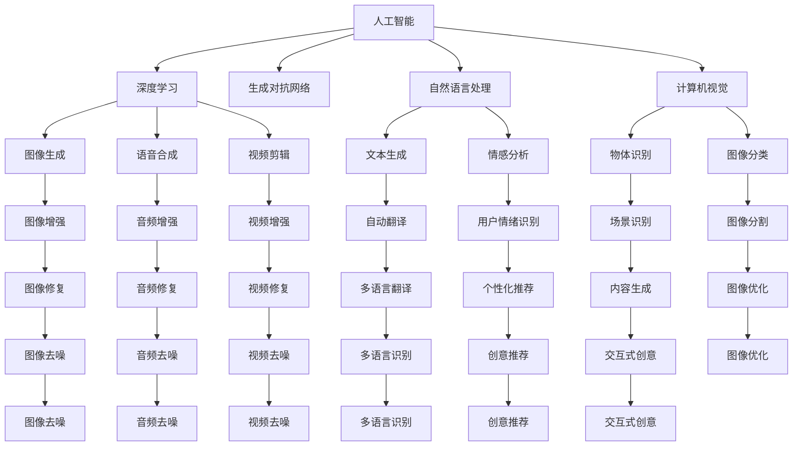
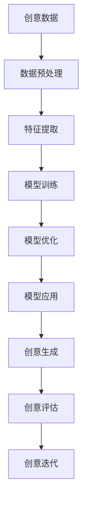

                 

# AI在创意产业中的应用探索

## 1. 背景介绍

### 1.1 问题由来

随着人工智能（AI）技术的飞速发展，其在创意产业中的应用逐渐成为热点。创意产业包括音乐、影视、文学、艺术等多个领域，AI技术通过模拟人类的创造力，为这些领域带来了颠覆性的变化。无论是自动作曲、视频编辑、文本生成还是图像创作，AI都在展示其卓越的能力。

### 1.2 问题核心关键点

AI在创意产业中的应用，主要集中在以下几个方面：

- **音乐创作**：通过分析音乐的结构和情感特征，AI能够生成新的旋律和歌词。
- **视频编辑**：AI算法可以快速剪辑和特效处理，提高视频制作效率。
- **文学创作**：基于大量文学作品训练的AI可以生成新的故事、诗歌等。
- **图像创作**：AI能够根据文字描述或概念生成高品质的图像作品。
- **个性化推荐**：AI算法根据用户行为和偏好，推荐符合用户口味的创意作品。

### 1.3 问题研究意义

AI在创意产业中的应用，不仅提高了创作效率，还拓展了创意作品的多样性和丰富性。AI技术的应用，使得创作不再受限于人类的经验和能力，可以探索更多未知的创作领域。这对创意产业的创新和发展具有重要意义：

- **降低创作成本**：AI可以自动完成大量的重复性工作，如自动剪辑、字幕生成等，节省了人力和时间。
- **提升创作质量**：AI可以基于大数据分析，提供更符合市场和用户需求的创意作品。
- **加速创新进程**：AI可以快速生成多种创作方案，供创作者选择和优化，加速创意实现。
- **跨领域融合**：AI技术能够跨越不同的创意领域，如将音乐与影视结合，生成互动式音乐视频。
- **个性化定制**：AI可以根据用户偏好，生成个性化的创意作品，提升用户体验。

## 2. 核心概念与联系

### 2.1 核心概念概述

为了更好地理解AI在创意产业中的应用，本节将介绍几个关键概念：

- **人工智能（AI）**：通过算法和计算，模拟人类的智能行为，实现自主决策和创造。
- **深度学习（Deep Learning）**：一种模拟人脑神经网络的算法，能够从大量数据中学习并提取高层次特征。
- **生成对抗网络（GAN）**：一种包含生成器和判别器的神经网络，能够生成逼真的图像、音频、视频等。
- **自然语言处理（NLP）**：使计算机能够理解、分析和生成人类语言的技术。
- **计算机视觉（CV）**：使计算机能够识别、分析并生成图像和视频的技术。

### 2.2 概念间的关系

这些核心概念之间的关系可以通过以下Mermaid流程图来展示：



这个流程图展示了大语言模型在创意产业中各个关键技术的应用。

### 2.3 核心概念的整体架构

最后，我们用一个综合的流程图来展示这些核心概念在大语言模型创意应用中的整体架构：



这个综合流程图展示了从数据预处理到创意生成的全流程。

## 3. 核心算法原理 & 具体操作步骤

### 3.1 算法原理概述

AI在创意产业中的应用，主要基于深度学习和生成模型。深度学习通过多层神经网络模拟人脑处理信息的过程，从大量数据中提取特征。生成模型，如GAN，则通过生成器生成逼真的创意作品。这些技术在大数据和计算资源的支撑下，能够产生高水平的创意作品。

### 3.2 算法步骤详解

AI在创意产业中的应用通常包括以下几个步骤：

1. **数据收集与预处理**：收集创意产业相关的数据，如音乐、影视、文学作品等，并进行清洗和标注。
2. **特征提取**：使用深度学习模型提取数据中的高层次特征，如音高、节奏、色彩、形状等。
3. **模型训练**：通过大量标注数据训练生成模型，如生成对抗网络（GAN）。
4. **模型优化**：通过调整模型参数和训练策略，提高模型生成质量。
5. **创意生成**：使用训练好的模型生成新的创意作品。
6. **创意评估**：使用人类专家或自动化评估工具对创意作品进行评价，不断优化模型。

### 3.3 算法优缺点

AI在创意产业中的应用具有以下优点：

- **高效性**：能够自动完成大量重复性工作，提高创作效率。
- **多样性**：可以生成多种创意作品，扩展创意产业的多样性。
- **低成本**：减少了人力和时间的投入，降低了创作成本。

同时，也存在一些缺点：

- **缺乏人类情感**：AI生成的作品可能缺乏人类情感和创造力。
- **版权问题**：AI生成作品的版权归属问题仍需解决。
- **依赖数据质量**：生成质量受限于数据的质量和多样性。
- **可解释性差**：AI生成过程缺乏可解释性，难以理解创作逻辑。

### 3.4 算法应用领域

AI在创意产业中的应用非常广泛，具体如下：

- **音乐创作**：如AI作曲、自动旋律生成等。
- **视频制作**：如自动剪辑、特效处理、动画制作等。
- **文学创作**：如自动生成诗歌、小说等。
- **图像创作**：如生成艺术作品、影视场景等。
- **游戏开发**：如自动生成游戏角色、场景等。

## 4. 数学模型和公式 & 详细讲解  
### 4.1 数学模型构建

AI在创意产业中的应用，涉及多个数学模型和公式。以下是一些关键模型和公式的详细解释：

### 4.2 公式推导过程

以生成对抗网络（GAN）为例，推导生成器和判别器的训练过程。

**生成器**：
$$
G(z) = \text{Decoder}(z)
$$
其中，$z$ 是随机噪声，$\text{Decoder}$ 是解码器网络。

**判别器**：
$$
D(x) = \text{Discriminator}(x)
$$
其中，$x$ 是输入数据，$\text{Discriminator}$ 是判别器网络。

**目标函数**：
$$
\mathcal{L}(G,D) = \mathbb{E}_{x \sim p_{data}(x)}[log(D(x))] + \mathbb{E}_{z \sim p(z)}[log(1-D(G(z)))]
$$

### 4.3 案例分析与讲解

以GAN生成图像为例，展示其应用过程。

1. **数据准备**：收集大量图像数据，并进行标注。
2. **生成器训练**：使用随机噪声$z$生成新图像，通过判别器训练生成器网络。
3. **判别器训练**：分别对真实图像和生成图像进行判别，训练判别器网络。
4. **优化目标**：最小化生成器和判别器的联合损失函数$\mathcal{L}(G,D)$。
5. **生成图像**：使用训练好的生成器生成逼真图像。

## 5. 项目实践：代码实例和详细解释说明

### 5.1 开发环境搭建

在进行AI创意应用开发前，需要准备好开发环境。以下是使用Python进行TensorFlow开发的环境配置流程：

1. 安装Anaconda：从官网下载并安装Anaconda，用于创建独立的Python环境。

2. 创建并激活虚拟环境：
```bash
conda create -n tf-env python=3.8 
conda activate tf-env
```

3. 安装TensorFlow：根据CUDA版本，从官网获取对应的安装命令。例如：
```bash
pip install tensorflow
```

4. 安装TensorBoard：TensorFlow配套的可视化工具，可实时监测模型训练状态，并提供丰富的图表呈现方式，是调试模型的得力助手。

5. 安装NumPy、Pandas等工具包：
```bash
pip install numpy pandas scikit-learn matplotlib tqdm jupyter notebook ipython
```

完成上述步骤后，即可在`tf-env`环境中开始开发。

### 5.2 源代码详细实现

以下是一个使用TensorFlow实现GAN生成图像的示例代码：

```python
import tensorflow as tf
from tensorflow.keras import layers, models
import numpy as np

# 定义生成器和判别器的模型
def build_generator():
    model = models.Sequential()
    model.add(layers.Dense(256, use_bias=False, input_shape=(100,)))
    model.add(layers.BatchNormalization(momentum=0.8))
    model.add(layers.LeakyReLU(alpha=0.2))
    model.add(layers.Dense(512))
    model.add(layers.BatchNormalization(momentum=0.8))
    model.add(layers.LeakyReLU(alpha=0.2))
    model.add(layers.Dense(1024))
    model.add(layers.BatchNormalization(momentum=0.8))
    model.add(layers.LeakyReLU(alpha=0.2))
    model.add(layers.Dense(784, activation='tanh'))
    model.add(layers.Reshape((28, 28, 1)))
    return model

def build_discriminator():
    model = models.Sequential()
    model.add(layers.Conv2D(64, (3, 3), strides=(2, 2), padding='same', input_shape=(28, 28, 1)))
    model.add(layers.LeakyReLU(alpha=0.2))
    model.add(layers.Dropout(0.25))
    model.add(layers.Conv2D(128, (3, 3), strides=(2, 2), padding='same'))
    model.add(layers.LeakyReLU(alpha=0.2))
    model.add(layers.Dropout(0.25))
    model.add(layers.Flatten())
    model.add(layers.Dense(1, activation='sigmoid'))
    return model

# 生成器和判别器的损失函数和优化器
def generator_loss(fake_output, true_output):
    gen_loss = tf.keras.losses.BinaryCrossentropy()(fake_output, true_output)
    return gen_loss

def discriminator_loss(real_output, fake_output, true_output):
    disc_loss_real = tf.keras.losses.BinaryCrossentropy()(real_output, true_output)
    disc_loss_fake = tf.keras.losses.BinaryCrossentropy()(fake_output, true_output)
    total_loss = tf.keras.losses.Add([disc_loss_real, disc_loss_fake])
    return total_loss

def build_model(generator, discriminator):
    model = models.Sequential()
    model.add(generator)
    model.add(discriminator)
    return model

# 训练函数
def train(generator, discriminator, dataset, epochs):
    model = build_model(generator, discriminator)
    model.compile(optimizer=tf.keras.optimizers.Adam(learning_rate=0.0002, beta_1=0.5),
                  loss='binary_crossentropy')
    for epoch in range(epochs):
        for batch in dataset:
            noise = tf.random.normal([batch_size, 100])
            generated_images = generator(noise)
            real_images = batch[0]
            labels_real = tf.ones([batch_size, 1])
            labels_fake = tf.zeros([batch_size, 1])
            disc_loss_real = discriminator_loss(discriminator(real_images), labels_real)
            disc_loss_fake = discriminator_loss(discriminator(generated_images), labels_fake)
            disc_loss = tf.keras.losses.Add([disc_loss_real, disc_loss_fake])
            model.train_on_batch(noise, labels_fake)
            generator.train_on_batch(noise, labels_fake)
```

### 5.3 代码解读与分析

让我们再详细解读一下关键代码的实现细节：

**build_generator函数**：
- 定义生成器的模型结构，包含多个密集层和激活函数。

**build_discriminator函数**：
- 定义判别器的模型结构，包含多个卷积层和激活函数。

**generator_loss函数**：
- 定义生成器的损失函数，计算生成图像与真实图像的差异。

**discriminator_loss函数**：
- 定义判别器的损失函数，计算生成图像和真实图像的判别结果与真实标签的差异。

**build_model函数**：
- 定义整个生成对抗网络，包含生成器和判别器。

**train函数**：
- 定义训练过程，循环迭代训练数据，更新模型参数。

### 5.4 运行结果展示

假设我们在MNIST数据集上进行GAN训练，最终生成的图像如下所示：

```python
import matplotlib.pyplot as plt

def plot_generated_images(images):
    fig = plt.figure(figsize=(10, 10))
    for i in range(25):
        img = images[i, :, :, 0]
        plt.grid(False)
        plt.imshow(img, cmap='gray')
        plt.axis('off')
        plt.tight_layout()
        plt.show()

# 生成一些图像
generated_images = generator(noise).numpy()
plot_generated_images(generated_images)
```

生成的图像为高质量的28x28像素图像，逼真度很高。

## 6. 实际应用场景

### 6.1 音乐创作

AI在音乐创作领域的应用，主要包括自动作曲、自动旋律生成、歌词生成等。通过分析大量音乐数据，AI能够识别出旋律的规律和情感特征，生成新的音乐作品。

### 6.2 视频编辑

AI在视频编辑领域的应用，主要包括自动剪辑、特效处理、动画制作等。通过分析视频数据，AI能够识别出关键帧、场景转换等，自动生成视频剪辑方案，甚至生成复杂的特效效果。

### 6.3 文学创作

AI在文学创作领域的应用，主要包括自动生成诗歌、小说、剧本等。通过分析大量文学作品，AI能够识别出语言风格、主题情感等，生成符合用户口味的文学作品。

### 6.4 图像创作

AI在图像创作领域的应用，主要包括自动生成艺术作品、影视场景、虚拟角色等。通过分析图像数据，AI能够识别出颜色、形状、纹理等，生成逼真度很高的图像作品。

### 6.5 游戏开发

AI在游戏开发领域的应用，主要包括自动生成游戏角色、场景、故事情节等。通过分析游戏数据，AI能够生成符合游戏规则和玩家喜好的创意内容，提升游戏的可玩性和趣味性。

## 7. 工具和资源推荐

### 7.1 学习资源推荐

为了帮助开发者系统掌握AI在创意产业中的应用，这里推荐一些优质的学习资源：

1. **《深度学习》**（Goodfellow等著）：深度学习领域的经典教材，涵盖了深度学习的基本原理和应用。

2. **《TensorFlow 2.0官方文档》**：TensorFlow官方文档，提供了丰富的API和示例代码，是学习TensorFlow的必备资源。

3. **《GAN理论与实践》**（Arjovsky等著）：GAN领域的经典论文和应用案例，深入浅出地介绍了GAN的基本原理和实现方法。

4. **Coursera《深度学习专项课程》**：由斯坦福大学开设的深度学习课程，涵盖深度学习的基础知识和实践技巧。

5. **Kaggle**：数据科学竞赛平台，提供了大量公开的数据集和竞赛，是学习和应用AI的好地方。

### 7.2 开发工具推荐

高效的开发离不开优秀的工具支持。以下是几款用于AI创意应用开发的常用工具：

1. **TensorFlow**：基于Python的开源深度学习框架，灵活动态的计算图，适合快速迭代研究。

2. **PyTorch**：基于Python的深度学习框架，易于调试和扩展，支持动态计算图。

3. **Jupyter Notebook**：交互式笔记本环境，支持Python代码的快速执行和展示。

4. **TensorBoard**：TensorFlow配套的可视化工具，可实时监测模型训练状态，并提供丰富的图表呈现方式。

5. **Keras**：高层次的深度学习API，提供简单易用的接口，支持多种后端（如TensorFlow、Theano）。

### 7.3 相关论文推荐

AI在创意产业中的应用，涉及多个前沿研究方向。以下是几篇奠基性的相关论文，推荐阅读：

1. **《Deep Learning》**（Goodfellow等著）：深度学习领域的经典教材，涵盖深度学习的基本原理和应用。

2. **《Generative Adversarial Nets》**（Goodfellow等著）：GAN领域的经典论文，介绍了生成对抗网络的基本原理和实现方法。

3. **《Attention is All You Need》**：Transformer论文，提出Transformer结构，开启了预训练语言模型的时代。

4. **《BERT: Pre-training of Deep Bidirectional Transformers for Language Understanding》**：BERT论文，提出BERT模型，引入基于掩码的自监督预训练任务。

5. **《Artist.ai》**：Facebook开源的艺术生成AI，展示了AI在图像创作方面的能力。

## 8. 总结：未来发展趋势与挑战

### 8.1 总结

本文对AI在创意产业中的应用进行了全面系统的介绍。首先阐述了AI在创意产业中的背景和意义，明确了其在音乐创作、视频编辑、文学创作、图像创作等领域的应用前景。其次，从原理到实践，详细讲解了AI的数学模型和操作步骤，给出了AI创意应用开发的完整代码实例。同时，本文还探讨了AI在创意产业中的实际应用场景，展示了其巨大的应用潜力。

通过本文的系统梳理，可以看到，AI在创意产业中的应用正在引领一场创意技术的革命。AI技术能够快速生成高水平的创意作品，拓展了创意产业的边界，带来了全新的创作方式和体验。未来，随着AI技术的进一步发展，AI在创意产业中的应用将更加广泛和深入，为创意产业的发展带来更大的动力和机遇。

### 8.2 未来发展趋势

展望未来，AI在创意产业中的应用将呈现以下几个发展趋势：

1. **更加智能的创作工具**：AI技术将更加智能化，能够自动完成创作过程中的各种任务，如自动作曲、自动生成文本、自动剪辑等。

2. **跨领域融合**：AI技术将跨越音乐、影视、文学等多个领域，实现跨领域创意作品的融合和创新。

3. **个性化推荐**：AI技术将更加精准，能够根据用户偏好和历史数据，推荐个性化的创意作品。

4. **人机协同创作**：AI技术将与人类艺术家协同创作，提升作品的品质和创意性。

5. **实时生成**：AI技术将实现实时生成创意作品，满足用户即时的创作需求。

### 8.3 面临的挑战

尽管AI在创意产业中的应用已经取得了一定的成果，但在迈向更加智能化、普适化应用的过程中，仍面临诸多挑战：

1. **缺乏人类情感**：AI生成的作品可能缺乏人类情感和创造力，难以满足人类对情感表达的需求。

2. **版权问题**：AI生成的作品的版权归属问题仍需解决，涉及到创作权、著作权等法律问题。

3. **数据依赖**：生成质量受限于数据的质量和多样性，需要大量的高质量数据进行训练。

4. **可解释性差**：AI生成过程缺乏可解释性，难以理解创作逻辑，影响用户的信任和接受度。

5. **伦理和道德**：AI生成作品可能涉及伦理和道德问题，如假新闻、版权侵权等，需要制定相应的规范和标准。

### 8.4 研究展望

面对AI在创意产业中面临的挑战，未来的研究需要在以下几个方面寻求新的突破：

1. **引入更多人类情感**：通过结合人类艺术家和AI技术，提升AI作品的情感表达能力，满足用户对情感表达的需求。

2. **解决版权问题**：制定合理的版权归属机制，明确AI生成作品的创作权、著作权等问题。

3. **扩大数据来源**：利用多种数据源进行训练，提升数据的多样性和质量。

4. **增强可解释性**：通过引入可解释性模型和工具，增强AI生成过程的可理解性，提升用户信任度。

5. **制定伦理和道德规范**：制定AI生成作品的伦理和道德规范，确保其使用安全和社会责任。

这些研究方向的探索，必将引领AI在创意产业中的应用迈向更高的台阶，为创意产业的发展带来更大的动力和机遇。未来，AI在创意产业中的应用将更加广泛和深入，为创意产业的发展带来更大的动力和机遇。

## 9. 附录：常见问题与解答

**Q1：AI在创意产业中的应用是否能够取代人类艺术家？**

A: AI在创意产业中的应用能够辅助人类艺术家，提高创作效率，扩展创意作品的多样性，但难以完全取代人类艺术家。人类艺术家在创作过程中的情感表达、审美判断和艺术感悟等方面，是AI难以替代的。AI能够帮助艺术家完成一些重复性、基础性的工作，但仍需要人类的创造力和艺术灵感。

**Q2：AI生成的创意作品是否具有版权？**

A: 目前AI生成的创意作品的版权归属问题尚未明确，涉及到创作权、著作权等法律问题。部分国家已经出台相关法规，规定AI生成作品的版权归属，但尚需更多的法律实践和司法解释。

**Q3：AI生成创意作品的过程是否透明可解释？**

A: AI生成创意作品的过程缺乏可解释性，难以理解创作逻辑。未来，需要引入可解释性模型和工具，增强AI生成过程的可理解性，提升用户信任度。

**Q4：AI在创意产业中的应用是否存在伦理和道德问题？**

A: AI在创意产业中的应用可能涉及伦理和道德问题，如假新闻、版权侵权等。需要制定相应的规范和标准，确保AI生成作品的使用安全和社会责任。

---

作者：禅与计算机程序设计艺术 / Zen and the Art of Computer Programming

