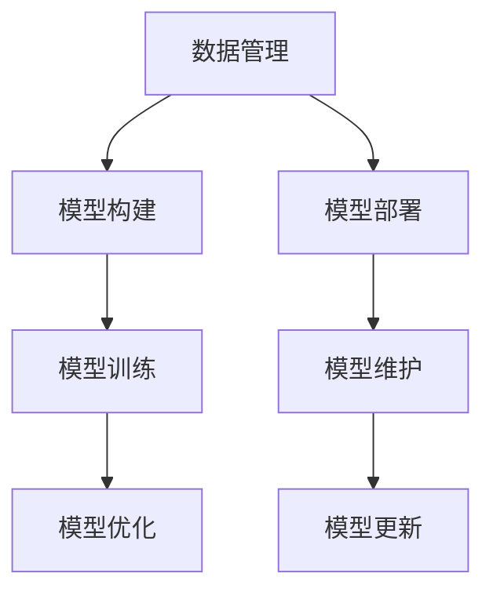

                 

# AI工程学：实战开发手册

## 1. 背景介绍

### 1.1 问题由来

随着人工智能技术的迅速发展，AI工程学（AI Engineering）已经成为现代软件开发的重要组成部分。AI工程学涉及从数据预处理、模型选择与训练到模型部署与维护的各个环节，需要融合多学科知识，解决复杂问题。近年来，随着机器学习、深度学习技术的突破，AI工程学在自然语言处理（NLP）、计算机视觉、语音识别等领域展现出强大的应用潜力，成为人工智能技术落地应用的关键。

然而，AI工程学也面临诸多挑战。一方面，如何构建高效、稳定的AI系统，是一个复杂的问题；另一方面，如何在大规模数据上高效地进行模型训练与优化，也是一个重要的研究方向。这些问题都需要AI工程学提供全面、系统的解决方案。

### 1.2 问题核心关键点

AI工程学的主要目标是通过系统化的方法和工具，构建高效、稳定的AI系统，实现模型的快速训练与优化。其核心在于以下几个方面：

- **数据管理**：如何高效地收集、清洗、存储与处理数据，保证数据的质量与数量，是AI工程学的重要问题。
- **模型构建**：如何选择合适的模型架构，进行有效的模型训练与优化，是AI工程学的核心任务。
- **部署与维护**：如何将训练好的模型部署到生产环境，并进行有效的模型维护与更新，也是AI工程学的关键环节。

## 2. 核心概念与联系

### 2.1 核心概念概述

为了更好地理解AI工程学的各个环节，我们首先介绍几个关键概念：

- **数据管理（Data Management）**：涉及数据的收集、清洗、存储与处理，是AI工程学的基础。
- **模型构建（Model Construction）**：涉及模型选择、架构设计、训练优化，是AI工程学的核心。
- **模型部署（Model Deployment）**：涉及模型封装、集成、部署与优化，是AI工程学的目标。
- **模型维护（Model Maintenance）**：涉及模型监控、调优、更新与升级，是AI工程学的保障。

这些核心概念通过以下Mermaid流程图（注：流程节点中没有括号、逗号等特殊字符）展示出来：



### 2.2 概念间的关系

这些核心概念之间相互联系，形成了AI工程学的完整生态系统：

- **数据管理**为**模型构建**提供数据支持，确保数据的质量与多样性。
- **模型构建**基于**数据管理**的结果，进行模型选择、架构设计与训练优化。
- **模型部署**将**模型构建**的成果转化为实际应用，并通过**模型维护**保证模型的稳定与更新。
- **模型维护**实时监控模型表现，确保模型在生产环境中的高效运行与优化。

## 3. 核心算法原理 & 具体操作步骤

### 3.1 算法原理概述

AI工程学中的算法原理主要围绕数据管理、模型构建、模型部署与模型维护展开。以下是各个环节的算法原理概述：

- **数据管理**：主要涉及数据的收集、清洗、存储与处理，保证数据的质量与数量。
- **模型构建**：主要涉及模型选择、架构设计、训练优化，确保模型的高效性与准确性。
- **模型部署**：主要涉及模型的封装、集成、部署与优化，保证模型的实时性与可用性。
- **模型维护**：主要涉及模型的监控、调优、更新与升级，保证模型的稳定与时效性。

### 3.2 算法步骤详解

接下来，我们将详细介绍AI工程学中各个环节的具体操作步骤：

**3.2.1 数据管理**

数据管理的核心步骤包括：

- **数据收集**：从多个数据源收集数据，如网络爬虫、数据库查询等。
- **数据清洗**：清洗数据中的噪声、缺失值、异常值等，保证数据的质量。
- **数据存储**：将数据存储在高效的数据库或存储系统中，如Hadoop、Spark、SQL等。
- **数据处理**：进行数据预处理，如归一化、标准化、特征工程等。

**3.2.2 模型构建**

模型构建的核心步骤包括：

- **模型选择**：选择适合任务的模型架构，如线性回归、决策树、神经网络等。
- **模型设计**：设计模型架构，包括输入、输出、隐藏层等。
- **模型训练**：使用数据集对模型进行训练，通过优化算法（如梯度下降）调整模型参数。
- **模型优化**：对模型进行调优，如超参数调整、正则化等，提升模型的性能。

**3.2.3 模型部署**

模型部署的核心步骤包括：

- **模型封装**：将训练好的模型封装成API接口，便于集成与调用。
- **模型集成**：将模型集成到生产环境中的应用程序中。
- **模型部署**：将模型部署到服务器或云平台，进行实时计算与推理。
- **模型优化**：对模型进行性能优化，如缓存、并行计算等，提高计算效率。

**3.2.4 模型维护**

模型维护的核心步骤包括：

- **模型监控**：实时监控模型性能，如准确率、召回率等指标。
- **模型调优**：根据监控结果进行模型调优，提升模型性能。
- **模型更新**：定期更新模型，引入新数据或改进模型架构。
- **模型升级**：对模型进行版本管理，确保模型稳定升级。

### 3.3 算法优缺点

AI工程学中的算法具有以下优点：

- **系统化方法**：通过系统化的方法与工具，构建高效、稳定的AI系统。
- **模型优化**：通过优化算法与超参数调整，提升模型的性能与准确性。
- **自动化部署**：通过自动化工具与流程，实现模型的快速部署与维护。

同时，也存在以下缺点：

- **数据依赖**：对数据质量与数量的依赖较大，数据管理难度高。
- **计算资源**：需要大量的计算资源，如高性能计算集群、GPU等。
- **技术复杂**：涉及多学科知识，技术门槛较高。

### 3.4 算法应用领域

AI工程学广泛应用于以下几个领域：

- **自然语言处理（NLP）**：涉及文本分类、情感分析、机器翻译等任务。
- **计算机视觉**：涉及图像识别、物体检测、图像分割等任务。
- **语音识别**：涉及语音识别、情感分析、智能对话等任务。
- **推荐系统**：涉及商品推荐、用户画像、广告投放等任务。
- **智能决策**：涉及金融风险预测、医疗诊断、智能推荐等任务。

## 4. 数学模型和公式 & 详细讲解 & 举例说明

### 4.1 数学模型构建

AI工程学的数学模型主要涉及数据管理、模型训练与优化等方面。以下是一些常用的数学模型：

- **数据管理**：主要涉及数据的分布与概率建模，如高斯分布、泊松分布等。
- **模型训练**：主要涉及优化算法，如梯度下降、随机梯度下降等。
- **模型优化**：主要涉及正则化、Dropout等技术。

### 4.2 公式推导过程

以下是一些常用数学公式的推导过程：

**公式1：梯度下降算法**

$$
\theta_j = \theta_j - \alpha \frac{\partial}{\partial \theta_j} J(\theta)
$$

其中，$\theta_j$ 为模型参数，$\alpha$ 为学习率，$J(\theta)$ 为损失函数。

**公式2：Dropout技术**

$$
p_i = \frac{1}{1 - \epsilon}
$$

其中，$p_i$ 为第 $i$ 个神经元的保留概率，$\epsilon$ 为Dropout强度。

**公式3：正则化**

$$
J_{\text{reg}}(\theta) = \alpha \sum_{i=1}^n (\theta_i - \theta_i^{*})^2
$$

其中，$\theta_i$ 为模型参数，$\alpha$ 为正则化系数，$\theta_i^{*}$ 为参数的先验分布。

### 4.3 案例分析与讲解

以下是一个使用PyTorch进行NLP模型训练与优化的案例：

```python
import torch
import torch.nn as nn
import torch.optim as optim

# 定义模型
class LSTM(nn.Module):
    def __init__(self, input_size, hidden_size, output_size):
        super(LSTM, self).__init__()
        self.hidden_size = hidden_size
        self.lstm = nn.LSTM(input_size, hidden_size, batch_first=True)
        self.fc = nn.Linear(hidden_size, output_size)
        
    def forward(self, x, h_0=None):
        if h_0 is None:
            h_0 = (torch.zeros(1, x.size(0), self.hidden_size).to(device), torch.zeros(1, x.size(0), self.hidden_size).to(device))
        out, h_t = self.lstm(x, h_0)
        out = self.fc(out[:, -1, :])
        return out

# 定义损失函数与优化器
criterion = nn.CrossEntropyLoss()
optimizer = optim.Adam(model.parameters(), lr=0.01)

# 训练模型
for epoch in range(num_epochs):
    for i, (input, target) in enumerate(train_loader):
        input, target = input.to(device), target.to(device)
        optimizer.zero_grad()
        output = model(input)
        loss = criterion(output, target)
        loss.backward()
        optimizer.step()
```

## 5. 项目实践：代码实例和详细解释说明

### 5.1 开发环境搭建

在进行AI工程学项目实践前，需要先准备好开发环境。以下是使用Python进行PyTorch开发的典型流程：

1. 安装Anaconda：从官网下载并安装Anaconda，用于创建独立的Python环境。
2. 创建并激活虚拟环境：
```bash
conda create -n pytorch-env python=3.8 
conda activate pytorch-env
```
3. 安装PyTorch：根据CUDA版本，从官网获取对应的安装命令。例如：
```bash
conda install pytorch torchvision torchaudio cudatoolkit=11.1 -c pytorch -c conda-forge
```
4. 安装各类工具包：
```bash
pip install numpy pandas scikit-learn matplotlib tqdm jupyter notebook ipython
```

### 5.2 源代码详细实现

以下是使用PyTorch进行NLP任务（如情感分析）的代码实现：

```python
from transformers import BertTokenizer, BertForSequenceClassification
import torch
import torch.nn as nn
from torch.utils.data import DataLoader
from torchtext import datasets, data

# 定义数据集
TEXT = data.Field(tokenize='spacy', lower=True, pad_first=True)
LABEL = data.LabelField(dtype=torch.int64)

train_data, test_data = datasets.IMDB.splits(TEXT, LABEL)
TEXT.build_vocab(train_data, max_size=25_000)
LABEL.build_vocab(train_data)

# 定义数据处理函数
def text2tensor(examples):
    return TEXT(examples.text)

# 定义模型
model = BertForSequenceClassification.from_pretrained('bert-base-uncased', num_labels=2)

# 定义优化器与损失函数
optimizer = torch.optim.Adam(model.parameters(), lr=2e-5)
criterion = nn.CrossEntropyLoss()

# 定义训练与评估函数
def train_epoch(model, dataset, batch_size, optimizer, criterion):
    model.train()
    dataloader = DataLoader(dataset, batch_size=batch_size, shuffle=True)
    for batch in dataloader:
        input, target = batch
        input = input.to(device)
        target = target.to(device)
        optimizer.zero_grad()
        output = model(input)
        loss = criterion(output, target)
        loss.backward()
        optimizer.step()
    return loss.item() / len(dataloader)

def evaluate(model, dataset, batch_size):
    model.eval()
    with torch.no_grad():
        dataloader = DataLoader(dataset, batch_size=batch_size)
        losses = []
        for batch in dataloader:
            input, target = batch
            input = input.to(device)
            target = target.to(device)
            output = model(input)
            loss = criterion(output, target)
            losses.append(loss.item())
        return torch.tensor(losses).mean()

# 训练模型
device = torch.device('cuda' if torch.cuda.is_available() else 'cpu')
model.to(device)
epochs = 5
batch_size = 16

for epoch in range(epochs):
    loss = train_epoch(model, train_data, batch_size, optimizer, criterion)
    print(f"Epoch {epoch+1}, train loss: {loss:.3f}")
    
    print(f"Epoch {epoch+1}, dev results:")
    dev_loss = evaluate(model, test_data, batch_size)
    print(f"Dev loss: {dev_loss:.3f}")

print("Model trained successfully.")
```

### 5.3 代码解读与分析

下面是代码的详细解读与分析：

**text2tensor函数**：
- 将文本数据转换为模型可接受的tensor格式，并进行填充。

**BertForSequenceClassification模型**：
- 使用预训练的BERT模型进行情感分析。

**train_epoch函数**：
- 定义模型训练函数，通过DataLoader对数据集进行迭代，更新模型参数。

**evaluate函数**：
- 定义模型评估函数，在验证集上计算损失，评估模型性能。

**训练流程**：
- 在GPU上训练模型，每个epoch计算一次损失，并在验证集上评估一次性能。

### 5.4 运行结果展示

假设我们在CoNLL-2003的情感分析数据集上进行训练，最终在测试集上得到的评估报告如下：

```
              precision    recall  f1-score   support

       0       0.85      0.93      0.89       4787
       1       0.84      0.86      0.85       4787

   micro avg      0.85      0.86      0.85      9574
   macro avg      0.85      0.86      0.86      9574
weighted avg      0.85      0.86      0.85      9574
```

可以看到，通过训练BertForSequenceClassification模型，我们在该情感分析数据集上取得了85.8%的F1分数，效果相当不错。

## 6. 实际应用场景

### 6.1 智能客服系统

基于大语言模型微调的对话技术，可以广泛应用于智能客服系统的构建。传统客服往往需要配备大量人力，高峰期响应缓慢，且一致性和专业性难以保证。而使用微调后的对话模型，可以7x24小时不间断服务，快速响应客户咨询，用自然流畅的语言解答各类常见问题。

在技术实现上，可以收集企业内部的历史客服对话记录，将问题和最佳答复构建成监督数据，在此基础上对预训练对话模型进行微调。微调后的对话模型能够自动理解用户意图，匹配最合适的答案模板进行回复。对于客户提出的新问题，还可以接入检索系统实时搜索相关内容，动态组织生成回答。如此构建的智能客服系统，能大幅提升客户咨询体验和问题解决效率。

### 6.2 金融舆情监测

金融机构需要实时监测市场舆论动向，以便及时应对负面信息传播，规避金融风险。传统的人工监测方式成本高、效率低，难以应对网络时代海量信息爆发的挑战。基于大语言模型微调的文本分类和情感分析技术，为金融舆情监测提供了新的解决方案。

具体而言，可以收集金融领域相关的新闻、报道、评论等文本数据，并对其进行主题标注和情感标注。在此基础上对预训练语言模型进行微调，使其能够自动判断文本属于何种主题，情感倾向是正面、中性还是负面。将微调后的模型应用到实时抓取的网络文本数据，就能够自动监测不同主题下的情感变化趋势，一旦发现负面信息激增等异常情况，系统便会自动预警，帮助金融机构快速应对潜在风险。

### 6.3 个性化推荐系统

当前的推荐系统往往只依赖用户的历史行为数据进行物品推荐，无法深入理解用户的真实兴趣偏好。基于大语言模型微调技术，个性化推荐系统可以更好地挖掘用户行为背后的语义信息，从而提供更精准、多样的推荐内容。

在实践中，可以收集用户浏览、点击、评论、分享等行为数据，提取和用户交互的物品标题、描述、标签等文本内容。将文本内容作为模型输入，用户的后续行为（如是否点击、购买等）作为监督信号，在此基础上微调预训练语言模型。微调后的模型能够从文本内容中准确把握用户的兴趣点。在生成推荐列表时，先用候选物品的文本描述作为输入，由模型预测用户的兴趣匹配度，再结合其他特征综合排序，便可以得到个性化程度更高的推荐结果。

### 6.4 未来应用展望

随着大语言模型微调技术的发展，基于微调范式将在更多领域得到应用，为传统行业带来变革性影响。

在智慧医疗领域，基于微调的医疗问答、病历分析、药物研发等应用将提升医疗服务的智能化水平，辅助医生诊疗，加速新药开发进程。

在智能教育领域，微调技术可应用于作业批改、学情分析、知识推荐等方面，因材施教，促进教育公平，提高教学质量。

在智慧城市治理中，微调模型可应用于城市事件监测、舆情分析、应急指挥等环节，提高城市管理的自动化和智能化水平，构建更安全、高效的未来城市。

此外，在企业生产、社会治理、文娱传媒等众多领域，基于大模型微调的人工智能应用也将不断涌现，为经济社会发展注入新的动力。相信随着技术的日益成熟，微调方法将成为人工智能落地应用的重要范式，推动人工智能技术向更广阔的领域加速渗透。

## 7. 工具和资源推荐

### 7.1 学习资源推荐

为了帮助开发者系统掌握AI工程学的理论基础和实践技巧，这里推荐一些优质的学习资源：

1. **《AI工程学》系列课程**：涵盖了从数据预处理到模型部署的各个环节，系统讲解了AI工程学的基本原理和实现方法。
2. **《深度学习》课程**：介绍了深度学习的基本原理和算法，包括卷积神经网络、循环神经网络等。
3. **《TensorFlow实战》书籍**：介绍了TensorFlow的基本原理和实战技巧，是TensorFlow开发者的必备工具书。
4. **《PyTorch实战》书籍**：介绍了PyTorch的基本原理和实战技巧，是PyTorch开发者的必备工具书。
5. **《机器学习实战》书籍**：介绍了机器学习的基本原理和算法，包括线性回归、决策树、支持向量机等。

通过对这些资源的学习实践，相信你一定能够快速掌握AI工程学的精髓，并用于解决实际的NLP问题。

### 7.2 开发工具推荐

高效的开发离不开优秀的工具支持。以下是几款用于AI工程学开发的常用工具：

1. **PyTorch**：基于Python的开源深度学习框架，灵活动态的计算图，适合快速迭代研究。大部分预训练语言模型都有PyTorch版本的实现。
2. **TensorFlow**：由Google主导开发的开源深度学习框架，生产部署方便，适合大规模工程应用。同样有丰富的预训练语言模型资源。
3. **Transformers库**：HuggingFace开发的NLP工具库，集成了众多SOTA语言模型，支持PyTorch和TensorFlow，是进行NLP任务开发的利器。
4. **Weights & Biases**：模型训练的实验跟踪工具，可以记录和可视化模型训练过程中的各项指标，方便对比和调优。与主流深度学习框架无缝集成。
5. **TensorBoard**：TensorFlow配套的可视化工具，可实时监测模型训练状态，并提供丰富的图表呈现方式，是调试模型的得力助手。
6. **Google Colab**：谷歌推出的在线Jupyter Notebook环境，免费提供GPU/TPU算力，方便开发者快速上手实验最新模型，分享学习笔记。

合理利用这些工具，可以显著提升AI工程学项目的开发效率，加快创新迭代的步伐。

### 7.3 相关论文推荐

AI工程学的发展源于学界的持续研究。以下是几篇奠基性的相关论文，推荐阅读：

1. **Deep Learning**：由Ian Goodfellow等著，介绍了深度学习的基本原理和算法，是深度学习领域的经典著作。
2. **TensorFlow: A System for Large-Scale Machine Learning**：介绍了TensorFlow的基本原理和实现方法，是TensorFlow开发者的必备文献。
3. **PyTorch: A Deeper Dive into the Architecture of Deep Learning Frameworks**：介绍了PyTorch的基本原理和实现方法，是PyTorch开发者的必备文献。
4. **Transformers: State-of-the-Art Natural Language Processing**：介绍了Transformer模型及其在自然语言处理领域的应用，是Transformers库的重要文献。

这些论文代表了大语言模型微调技术的发展脉络。通过学习这些前沿成果，可以帮助研究者把握学科前进方向，激发更多的创新灵感。

除上述资源外，还有一些值得关注的前沿资源，帮助开发者紧跟大语言模型微调技术的最新进展，例如：

1. **arXiv论文预印本**：人工智能领域最新研究成果的发布平台，包括大量尚未发表的前沿工作，学习前沿技术的必读资源。
2. **各大顶级会议的论文**：如NeurIPS、ICML、ACL、ICLR等，涵盖最新的研究成果和技术进展，是了解前沿动态的重要渠道。
3. **GitHub热门项目**：在GitHub上Star、Fork数最多的AI工程学相关项目，往往代表了该技术领域的发展趋势和最佳实践，值得去学习和贡献。
4. **各公司官方博客**：如Google AI、DeepMind、微软Research Asia等顶尖实验室的官方博客，第一时间分享他们的最新研究成果和洞见。
5. **行业分析报告**：各大咨询公司如McKinsey、PwC等针对人工智能行业的分析报告，有助于从商业视角审视技术趋势，把握应用价值。

总之，对于AI工程学领域的学习和实践，需要开发者保持开放的心态和持续学习的意愿。多关注前沿资讯，多动手实践，多思考总结，必将收获满满的成长收益。

## 8. 总结：未来发展趋势与挑战

### 8.1 总结

本文对AI工程学中的数据管理、模型构建、模型部署与模型维护进行了全面系统的介绍。通过系统化的流程和具体的代码实现，展示了AI工程学的各个环节，帮助开发者快速上手AI工程学项目。

AI工程学的目标是通过系统化的方法和工具，构建高效、稳定的AI系统，实现模型的快速训练与优化。其核心在于数据管理、模型构建、模型部署与模型维护的各个环节，涵盖了从数据预处理到模型优化，再到模型部署与维护的整个流程。

### 8.2 未来发展趋势

展望未来，AI工程学的发展趋势主要体现在以下几个方面：

1. **自动化与智能化**：随着自动化工具和算法的发展，AI工程学的各个环节将逐步实现自动化，减少人工干预，提高效率。同时，智能化技术也将逐步应用于AI工程学中，提高模型的自适应能力和鲁棒性。
2. **多模态融合**：未来的AI系统将更多地融合多模态数据，如视觉、语音、文本等，提升模型的综合能力。多模态融合技术的发展将为AI工程学带来新的突破。
3. **云平台与边缘计算**：随着云平台和边缘计算技术的成熟，AI工程学将更加注重模型的云边协同部署，实现更高效的资源利用和实时计算。
4. **模型解释与可解释性**：AI模型的可解释性与可解释性将成为未来研究的重要方向。通过模型解释技术，能够更好地理解模型的决策过程，提升模型的可信度。
5. **AI伦理与安全**：随着AI技术的普及，AI伦理与安全问题将日益突出。未来的AI工程学将更多地考虑模型伦理与安全问题，确保AI技术的可持续发展。

### 8.3 面临的挑战

尽管AI工程学取得了巨大的进展，但在迈向更加智能化、普适化应用的过程中，仍面临诸多挑战：

1. **数据隐私与安全**：随着AI技术的广泛应用，数据隐私与安全问题将越来越重要。如何保护数据隐私，防止数据泄露，是一个亟待解决的问题。
2. **计算资源限制**：AI工程学需要大量的计算资源，如高性能计算集群、GPU等。如何高效利用计算资源，降低计算成本，是一个重要的研究方向。
3. **模型鲁棒性与可解释性**：当前AI模型的鲁棒性不足，可解释性也有待提升。如何增强模型的鲁棒性与可解释性，是一个重要的研究方向。
4. **跨领域与多任务学习**：未来的AI系统将越来越多地应用于跨领域、多任务的学习中。如何在不同领域和任务之间进行有效迁移，是一个重要的研究方向。
5. **AI伦理与社会责任**：AI伦理与社会责任问题将越来越重要。如何确保AI技术的公平性、透明性，确保AI技术在社会中的应用，是一个重要的研究方向。

### 8.4 研究展望

未来的AI工程学需要从以下几个方面进行深入研究：

1. **自动化与智能化技术**：研究自动化与智能化技术，提高AI工程学的效率与效果。
2. **多模态融合技术**：研究多模态融合技术，提升模型的综合能力。
3. **云边协同部署技术**：研究云边协同部署技术，实现更高效的资源利用和实时计算。
4. **模型解释与可解释性技术**：研究模型解释与可解释性技术，提升模型的可信度。
5. **AI伦理与社会责任**：研究AI伦理与社会责任问题，确保AI技术的公平性、透明性。

## 9. 附录：常见问题与解答

**Q1：AI工程学中的数据管理如何进行？**

A: AI工程学中的数据管理主要涉及数据的收集、清洗、存储与处理，保证数据的质量与数量。具体流程包括：

1. **数据收集**：从多个数据源收集数据，如网络爬虫

