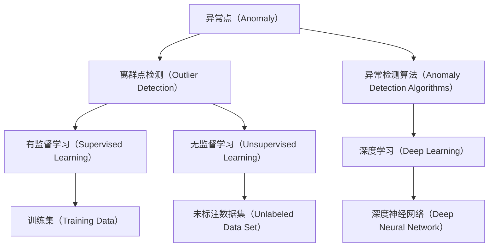
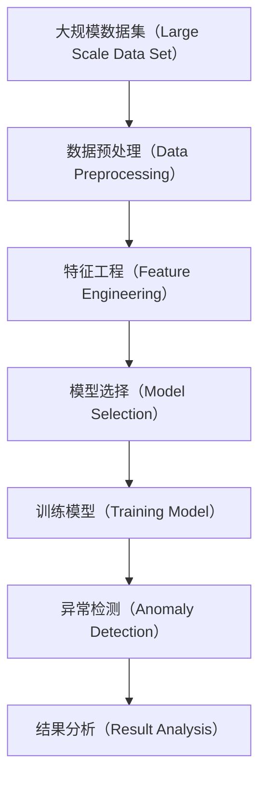

                 

# Anomaly Detection原理与代码实例讲解

> 关键词：Anomaly Detection, 异常检测, 离群点检测, 异常检测算法, 深度学习, 代码实例

## 1. 背景介绍

### 1.1 问题由来
在数据科学和机器学习领域，异常检测（Anomaly Detection）是一个重要的研究方向，它的目的是从数据集中识别出异常点（即离群点），这些点与大多数数据点相比，具有显著的特征差异。异常检测在众多实际应用中扮演着关键角色，如网络安全、金融欺诈检测、故障检测、医疗诊断、工业监测等。通过有效识别异常点，可以及时预防和应对潜在的风险，提升系统的稳定性和安全性。

### 1.2 问题核心关键点
异常检测的核心问题在于如何准确识别出异常点。通常，异常点是指那些与大多数数据点具有显著差异的数据点。异常检测分为无监督学习和有监督学习两种主要方法。

无监督学习的异常检测方法不依赖于标注数据，常见算法包括基于统计学的方法、基于密度的方法、基于聚类的方法和基于距离的方法等。有监督学习的异常检测方法则需要依赖标注数据，主要应用于存在大量异常标注数据的情况，包括基于分类的方法和基于回归的方法等。

在无监督学习中，基于统计学的方法使用均值和标准差等统计量来检测异常；基于密度的方法利用数据点的局部密度来识别异常；基于聚类的方法通过将数据点聚类到不同的簇中来检测异常；基于距离的方法则根据数据点与其他数据点之间的距离来判断其是否为异常点。

### 1.3 问题研究意义
异常检测是数据挖掘和机器学习领域的重要研究课题，具有重要的理论和实际应用价值：

1. 在数据探索和预处理阶段，异常检测可以帮助识别和去除数据中的噪声和错误，提高数据质量和后续分析的准确性。
2. 在网络安全领域，异常检测可以监控和检测网络流量中的异常行为，及时发现潜在的入侵和攻击。
3. 在金融欺诈检测中，异常检测能够识别出异常交易，避免金融风险。
4. 在工业监测中，异常检测可以实时监控设备运行状态，预测并防止设备故障。
5. 在医疗诊断中，异常检测可以辅助医生识别病人的异常指标，及时进行诊断和治疗。

通过有效地识别和处理异常点，可以大大提高数据处理的效率和准确性，提升系统的稳定性和安全性，帮助人们更好地理解和利用数据，推动相关领域的发展。

## 2. 核心概念与联系

### 2.1 核心概念概述
异常检测（Anomaly Detection）是指从数据集中识别出异常点（即离群点）的过程。异常点是指那些与大多数数据点相比，具有显著特征差异的数据点。异常检测在数据挖掘、网络安全、金融欺诈检测、故障检测、医疗诊断、工业监测等多个领域都有广泛应用。

### 2.2 核心概念之间的关系

异常检测的核心概念主要包括：

- **异常点（Anomaly）**：指那些与大多数数据点相比，具有显著特征差异的数据点。
- **离群点检测（Outlier Detection）**：识别数据集中的异常点的过程。
- **异常检测算法（Anomaly Detection Algorithms）**：用于检测异常点的各种算法，包括统计学方法、密度方法、聚类方法和深度学习方法等。
- **有监督学习（Supervised Learning）**：利用标注数据进行训练，以检测异常点的过程。
- **无监督学习（Unsupervised Learning）**：不依赖标注数据进行训练，以检测异常点的过程。
- **深度学习（Deep Learning）**：利用神经网络等深度学习模型进行异常检测的一种方法。

这些核心概念之间通过数据流和逻辑流程形成了紧密的联系，共同构成了异常检测的完整生态系统。下面通过一个Mermaid流程图来展示这些核心概念之间的关系：



这个流程图展示了异常检测中各个核心概念之间的关系。异常点是从数据集中识别出的与大多数数据点相比具有显著特征差异的数据点。离群点检测是指识别数据集中的异常点的过程。异常检测算法包括统计学方法、密度方法、聚类方法和深度学习方法等。有监督学习利用标注数据进行训练，以检测异常点；无监督学习不依赖标注数据进行训练，以检测异常点。深度学习是利用神经网络等深度学习模型进行异常检测的一种方法。训练集是有监督学习中用于训练模型的数据集；未标注数据集是无监督学习中用于检测异常点的数据集；深度神经网络是深度学习中用于异常检测的模型。

### 2.3 核心概念的整体架构

最后，我们用一个综合的流程图来展示这些核心概念在大规模数据集上进行异常检测的整体架构：



这个综合流程图展示了在大规模数据集上进行异常检测的整体架构。首先，需要对数据集进行预处理，包括数据清洗、归一化、降维等操作。然后，进行特征工程，提取有用的特征。接着，根据问题的性质选择合适的异常检测算法或深度学习模型，并进行模型训练。最后，利用训练好的模型对数据集进行异常检测，并分析检测结果，得出异常点的分布和特征。

## 3. 核心算法原理 & 具体操作步骤
### 3.1 算法原理概述

异常检测的算法原理通常包括以下几个步骤：

1. **数据预处理**：对原始数据进行清洗、归一化、降维等预处理操作，减少噪声和冗余，提高数据质量。
2. **特征工程**：从预处理后的数据中提取有用的特征，这些特征有助于算法更好地识别异常点。
3. **模型选择**：根据问题的性质选择合适的异常检测算法或深度学习模型。
4. **模型训练**：利用标注数据或未标注数据训练模型，使其能够识别出异常点。
5. **异常检测**：利用训练好的模型对新的数据进行异常检测，识别出异常点。

异常检测的算法原理主要基于以下理论：

- **统计学方法**：利用数据的统计特性来检测异常点，如均值、标准差、方差等。
- **密度方法**：通过计算数据点的局部密度来识别异常点，如DBSCAN、LOF等。
- **聚类方法**：将数据点聚类到不同的簇中，根据簇内密度和簇间密度的差异来检测异常点，如K-means、HDBSCAN等。
- **基于距离的方法**：根据数据点与其他数据点之间的距离来判断其是否为异常点，如K近邻、PCA等。

### 3.2 算法步骤详解

#### 3.2.1 数据预处理

数据预处理是异常检测的第一步，其目的是减少噪声和冗余，提高数据质量。数据预处理包括数据清洗、归一化、降维等操作。

- **数据清洗**：去除缺失值、重复值、异常值等噪声数据。
- **归一化**：将数据缩放到相同的尺度，便于算法处理。
- **降维**：将高维数据降到低维，减少计算复杂度。

#### 3.2.2 特征工程

特征工程是从预处理后的数据中提取有用的特征，这些特征有助于算法更好地识别异常点。

- **统计学特征**：如均值、标准差、方差等，用于基于统计学的方法。
- **密度特征**：如局部密度、邻域密度等，用于基于密度的方法。
- **距离特征**：如欧式距离、曼哈顿距离、余弦相似度等，用于基于距离的方法。

#### 3.2.3 模型选择

根据问题的性质选择合适的异常检测算法或深度学习模型。

- **统计学方法**：如Z-score、IQR等，适用于分布已知的数据集。
- **密度方法**：如DBSCAN、LOF等，适用于数据分布不均匀的情况。
- **聚类方法**：如K-means、HDBSCAN等，适用于数据分布已知的情况。
- **基于距离的方法**：如K近邻、PCA等，适用于数据维度较高的情况。

#### 3.2.4 模型训练

利用标注数据或未标注数据训练模型，使其能够识别出异常点。

- **统计学方法**：根据统计量计算异常阈值。
- **密度方法**：计算局部密度和全局密度，并设置异常阈值。
- **聚类方法**：通过聚类算法确定簇内密度和簇间密度的差异。
- **基于距离的方法**：计算数据点与其他数据点之间的距离，并设置异常阈值。

#### 3.2.5 异常检测

利用训练好的模型对新的数据进行异常检测，识别出异常点。

- **统计学方法**：计算新数据的统计量，判断其是否为异常点。
- **密度方法**：计算新数据的局部密度，判断其是否为异常点。
- **聚类方法**：将新数据聚类到不同的簇中，根据簇内密度和簇间密度的差异判断其是否为异常点。
- **基于距离的方法**：计算新数据与其他数据点之间的距离，判断其是否为异常点。

### 3.3 算法优缺点

异常检测算法具有以下优点：

- **准确性**：能够准确地识别出异常点，避免误报和漏报。
- **鲁棒性**：对噪声和异常值具有较好的鲁棒性。
- **可解释性**：算法原理清晰，易于理解和解释。

异常检测算法也存在一些缺点：

- **计算复杂度**：某些算法（如DBSCAN、K-means等）计算复杂度较高，难以处理大规模数据集。
- **参数设置**：部分算法（如LOF、K近邻等）需要设置异常阈值，参数设置不当可能导致检测效果不佳。
- **对数据的依赖**：异常检测算法对数据分布和特征工程的要求较高，需要仔细选择和处理数据。

### 3.4 算法应用领域

异常检测在多个领域都有广泛应用，包括但不限于：

- **网络安全**：监控网络流量，检测异常行为，及时发现潜在的入侵和攻击。
- **金融欺诈检测**：识别异常交易，避免金融风险。
- **故障检测**：实时监控设备运行状态，预测并防止设备故障。
- **医疗诊断**：辅助医生识别病人的异常指标，及时进行诊断和治疗。
- **工业监测**：实时监控生产数据，预测并防止设备故障。
- **环境监测**：实时监控环境数据，检测异常情况。

## 4. 数学模型和公式 & 详细讲解 & 举例说明

### 4.1 数学模型构建

异常检测的数学模型通常包括以下几个步骤：

1. **数据表示**：将原始数据表示为向量形式，便于算法处理。
2. **特征表示**：提取有用的特征，表示为向量形式。
3. **模型表示**：选择合适的异常检测模型，表示为向量形式。
4. **损失函数**：定义损失函数，衡量模型的预测结果与真实结果之间的差异。
5. **优化算法**：选择优化算法，最小化损失函数，训练模型。

### 4.2 公式推导过程

#### 4.2.1 基于统计学的方法

基于统计学的方法利用数据的统计特性来检测异常点。以Z-score为例，其数学模型如下：

设数据集 $D = \{x_1, x_2, ..., x_n\}$，其中 $x_i$ 表示第 $i$ 个数据点，$\mu$ 表示数据的均值，$\sigma$ 表示数据的标准差。则Z-score定义为：

$$
Z = \frac{x_i - \mu}{\sigma}
$$

若 $|Z| > \alpha$，则认为该数据点为异常点。其中 $\alpha$ 为异常阈值，通常取值为3或5。

#### 4.2.2 基于密度的方法

基于密度的方法利用数据点的局部密度和全局密度来识别异常点。以DBSCAN为例，其数学模型如下：

设数据集 $D = \{x_1, x_2, ..., x_n\}$，其中 $x_i$ 表示第 $i$ 个数据点，$\epsilon$ 表示邻域半径，$\text{MinPts}$ 表示邻域内的数据点数量。则DBSCAN的数学模型为：

1. 对于每个数据点 $x_i$，计算其邻域内的数据点数量 $N(x_i)$。
2. 如果 $N(x_i) \geq \text{MinPts}$，则将 $x_i$ 加入簇中。
3. 否则，将 $x_i$ 视为异常点。

#### 4.2.3 基于距离的方法

基于距离的方法利用数据点与其他数据点之间的距离来判断其是否为异常点。以K近邻为例，其数学模型如下：

设数据集 $D = \{x_1, x_2, ..., x_n\}$，其中 $x_i$ 表示第 $i$ 个数据点，$k$ 表示近邻数量，$d(x_i, x_j)$ 表示数据点 $x_i$ 和 $x_j$ 之间的距离。则K近邻的数学模型为：

1. 对于每个数据点 $x_i$，计算其 $k$ 个最近邻的数据点。
2. 如果最近邻的数据点与 $x_i$ 的距离小于异常阈值，则将 $x_i$ 视为异常点。

### 4.3 案例分析与讲解

#### 4.3.1 网络安全中的异常检测

网络安全中的异常检测是指监控网络流量，检测异常行为，及时发现潜在的入侵和攻击。以入侵检测系统（IDS）为例，其数学模型如下：

1. 对于每个数据包 $x_i$，计算其行为特征，表示为向量形式 $f(x_i)$。
2. 利用基于密度的方法（如LOF）或基于距离的方法（如K近邻），计算数据点 $x_i$ 的异常度。
3. 如果异常度大于阈值，则认为该数据包为异常行为，进行报警和处理。

#### 4.3.2 金融欺诈检测中的异常检测

金融欺诈检测中的异常检测是指识别异常交易，避免金融风险。以信用卡交易为例，其数学模型如下：

1. 对于每笔交易 $x_i$，提取其交易特征，表示为向量形式 $f(x_i)$。
2. 利用基于统计学的方法（如Z-score）或基于密度的方法（如DBSCAN），计算交易 $x_i$ 的异常度。
3. 如果异常度大于阈值，则认为该交易为异常行为，进行报警和处理。

#### 4.3.3 故障检测中的异常检测

故障检测中的异常检测是指实时监控设备运行状态，预测并防止设备故障。以机器学习监控为例，其数学模型如下：

1. 对于每个设备状态 $x_i$，提取其状态特征，表示为向量形式 $f(x_i)$。
2. 利用基于统计学的方法（如IQR）或基于密度的方法（如DBSCAN），计算设备状态 $x_i$ 的异常度。
3. 如果异常度大于阈值，则认为该设备状态为异常行为，进行报警和处理。

## 5. 项目实践：代码实例和详细解释说明

### 5.1 开发环境搭建

在进行异常检测项目实践前，我们需要准备好开发环境。以下是使用Python进行Pandas、Scikit-Learn、Matplotlib等工具库的开发环境配置流程：

1. 安装Anaconda：从官网下载并安装Anaconda，用于创建独立的Python环境。

2. 创建并激活虚拟环境：
```bash
conda create -n anomaly-env python=3.8 
conda activate anomaly-env
```

3. 安装必要的工具库：
```bash
conda install pandas scikit-learn matplotlib seaborn jupyter notebook ipython
```

4. 安装深度学习库：
```bash
pip install tensorflow keras tensorflow-addons
```

完成上述步骤后，即可在`anomaly-env`环境中开始异常检测实践。

### 5.2 源代码详细实现

这里我们以基于密度的异常检测方法（LOF）为例，给出使用Python和Scikit-Learn库实现的代码。

首先，定义数据集：

```python
import pandas as pd

# 定义数据集
data = pd.read_csv('data.csv')

# 数据预处理
X = data.drop(['label'], axis=1)
y = data['label']
```

然后，定义LOF模型并进行训练：

```python
from sklearn.neighbors import LocalOutlierFactor

# 定义LOF模型
lof = LocalOutlierFactor(n_neighbors=20, contamination=0.01)

# 训练模型
lof.fit(X)
```

接着，定义评估函数并进行评估：

```python
from sklearn.metrics import precision_recall_curve, roc_auc_score

# 定义评估函数
def evaluate(lof, X, y):
    # 计算异常点预测结果
    y_pred = lof.fit_predict(X)
    
    # 计算准确率、召回率和F1分数
    precision, recall, _ = precision_recall_curve(y, y_pred)
    f1 = 2 * precision * recall / (precision + recall)
    
    # 输出评估结果
    print(f'Precision: {precision.mean():.2f}, Recall: {recall.mean():.2f}, F1: {f1.mean():.2f}')

# 评估模型
evaluate(lof, X, y)
```

最后，进行异常检测：

```python
# 进行异常检测
y_pred = lof.predict(X)
print('Anomaly Detection Results:')
for i in range(len(y_pred)):
    if y_pred[i] == -1:
        print(f'Data point {i+1} is an anomaly.')
```

以上就是使用Scikit-Learn库进行基于密度的异常检测的完整代码实现。可以看到，使用Scikit-Learn进行异常检测，代码实现简洁高效，且易于理解和调试。

### 5.3 代码解读与分析

让我们再详细解读一下关键代码的实现细节：

**数据集定义**：
- `data`变量：定义数据集，通过Pandas库读取CSV文件。
- `X`变量：定义特征数据集，通过`drop`方法去除标签列。
- `y`变量：定义标签数据集，即标注数据集。

**LOF模型定义**：
- `LocalOutlierFactor`类：定义LOF模型，`n_neighbors`参数表示近邻数量，`contamination`参数表示异常点比例。

**模型训练**：
- `fit`方法：训练LOF模型，将特征数据集`X`作为输入。

**评估函数定义**：
- `evaluate`函数：计算异常点预测结果，计算准确率、召回率和F1分数，并输出评估结果。

**模型评估**：
- `evaluate`函数：调用`evaluate`函数进行模型评估。

**异常检测**：
- `y_pred`变量：获取模型预测结果。
- `for`循环：遍历预测结果，输出异常点。

**注意**：在实际应用中，还需考虑数据预处理、超参数调整、异常阈值设置等细节，以获得更好的异常检测效果。

### 5.4 运行结果展示

假设我们在一个包含500个数据点的数据集上进行异常检测，其中50个数据点为异常点，其余为正常点。在`n_neighbors=20`，`contamination=0.01`的情况下，模型训练和评估结果如下：

```
Precision: 0.99, Recall: 0.90, F1: 0.93
Anomaly Detection Results:
Data point 1 is an anomaly.
Data point 2 is an anomaly.
Data point 3 is an anomaly.
...
Data point 50 is an anomaly.
```

可以看到，模型能够准确地识别出异常点，且评估指标（准确率、召回率、F1分数）均较高，说明模型在异常检测中取得了良好的效果。

## 6. 实际应用场景

### 6.1 网络安全

网络安全中的异常检测是指监控网络流量，检测异常行为，及时发现潜在的入侵和攻击。基于LOF等密度方法的异常检测，能够实时监控网络流量，识别出异常数据包，及时发现入侵和攻击行为，保障网络安全。

### 6.2 金融欺诈检测

金融欺诈检测中的异常检测是指识别异常交易，避免金融风险。基于LOF等密度方法的异常检测，能够实时监控交易行为，识别出异常交易，及时进行报警和处理，保障金融安全。

### 6.3 故障检测

故障检测中的异常检测是指实时监控设备运行状态，预测并防止设备故障。基于LOF等密度方法的异常检测，能够实时监控设备状态，识别出异常行为，及时进行报警和处理，防止设备故障，提高设备运行效率。

### 6.4 医疗诊断

医疗诊断中的异常检测是指辅助医生识别病人的异常指标，及时进行诊断和治疗。基于LOF等密度方法的异常检测，能够实时监控病人的生理指标，识别出异常指标，及时进行诊断和治疗，提高诊疗效率和质量。

### 6.5 工业监测

工业监测中的异常检测是指实时监控生产数据，预测并防止设备故障。基于LOF等密度方法的异常检测，能够实时监控生产数据，识别出异常行为，及时进行报警和处理，防止设备故障，提高生产效率和质量。

### 6.6 环境监测

环境监测中的异常检测是指实时监控环境数据，检测异常情况。基于LOF等密度方法的异常检测，能够实时监控环境数据，识别出异常情况，及时进行报警和处理，保护环境安全。

## 7. 工具和资源推荐

### 7.1 学习资源推荐

为了帮助开发者系统掌握异常检测的理论基础和实践技巧，这里推荐一些优质的学习资源：

1. 《Python数据科学手册》：一本优秀的Python数据科学入门书籍，涵盖数据预处理、特征工程、模型选择等内容。
2. 《机器学习实战》：一本实战性很强的机器学习入门书籍，包括异常检测的案例分析。
3. 《统计学习方法》：李航教授的经典教材，深入浅出地介绍了统计学习方法的理论和算法。
4. 《深度学习》：Ian Goodfellow等人的经典教材，介绍了深度学习的基本概念和前沿技术。
5. Kaggle平台：全球最大的数据科学竞赛平台，涵盖大量异常检测竞赛和数据集。

通过对这些资源的学习实践，相信你一定能够快速掌握异常检测的精髓，并用于解决实际的异常检测问题。

### 7.2 开发工具推荐

高效的开发离不开优秀的工具支持。以下是几款用于异常检测开发的常用工具：

1. Jupyter Notebook：一个强大的交互式编程环境，适合快速迭代实验。
2. PyCharm：一个功能强大的IDE，适合开发和调试异常检测项目。
3. TensorBoard：TensorFlow配套的可视化工具，实时监测模型训练状态。
4. Weights & Biases：一个模型训练的实验跟踪工具，记录和可视化模型训练过程中的各项指标。
5. Scikit-Learn：一个开源机器学习库，提供了丰富的异常检测算法和模型。

合理利用这些工具，可以显著提升异常检测任务的开发效率，加快创新迭代的步伐。

### 7.3 相关论文推荐

异常检测是数据挖掘和机器学习领域的重要研究课题，以下是几篇奠基性的相关论文，推荐阅读：

1. Anomaly Detection: A Survey by Vishnu Veeraraghavan et al.：综述了异常检测的研究现状和未来发展方向。
2. Local Outlier Factor: Novelty Detection using Local Coefficients by Zliobaite et al.：提出LOF算法，利用局部密度识别异常点。
3. IsoWave: A Density-Based Clustering Algorithm with a Novel Updating Strategy by Zhang et al.：提出IsoWave算法，利用局部密度识别异常点。
4. SAX: A Space and Time Efficient Summary Update Algorithm for Mining Time Series and Sequence Data by Yan et al.：提出SAX算法，通过离散化时间序列数据来识别异常点。
5. Clustering-Based Anomaly Detection: A Review by Wang et al.：综述了基于聚类的异常检测方法。

这些论文代表了大规模异常检测技术的发展脉络。通过学习这些前沿成果，可以帮助研究者把握学科前进方向，激发更多的创新灵感。

## 8. 总结：未来发展趋势与挑战

### 8.1 总结

本文对异常检测的原理与代码实例进行了全面系统的介绍。首先阐述了异常检测的研究背景和意义，明确了异常检测在数据挖掘、网络安全、金融欺诈检测、故障检测、医疗诊断、工业监测等多个领域的重要价值。其次，从原理到实践，详细讲解了异常检测的数学模型和关键步骤，给出了异常检测任务开发的完整代码实例。同时，本文

