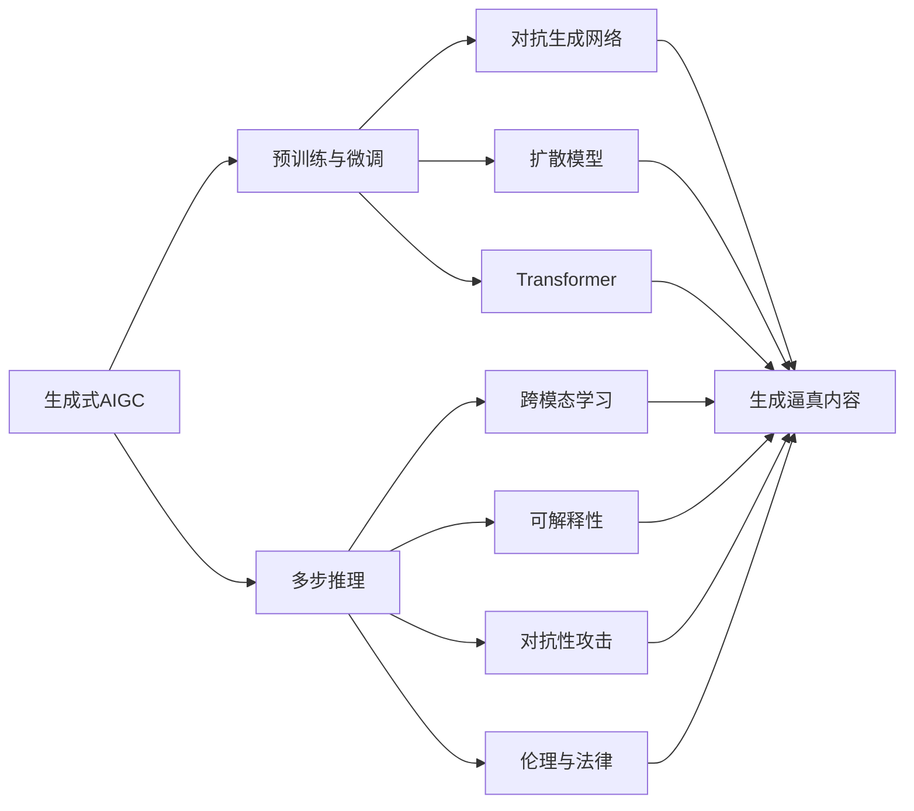
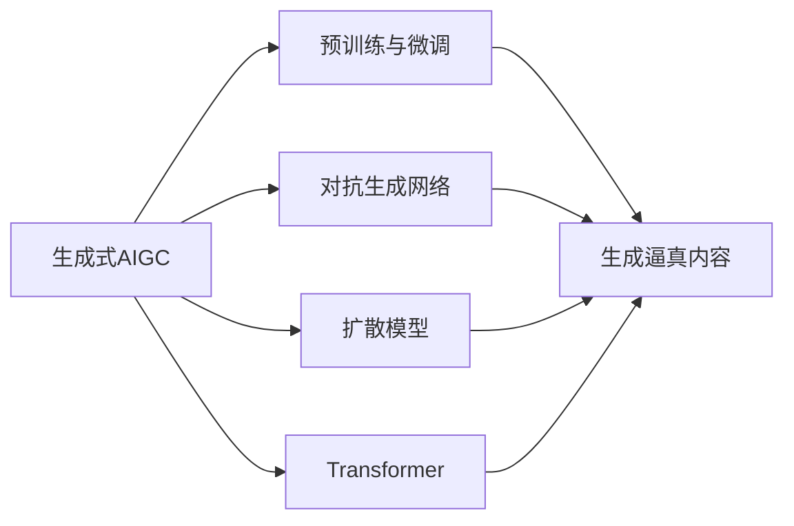
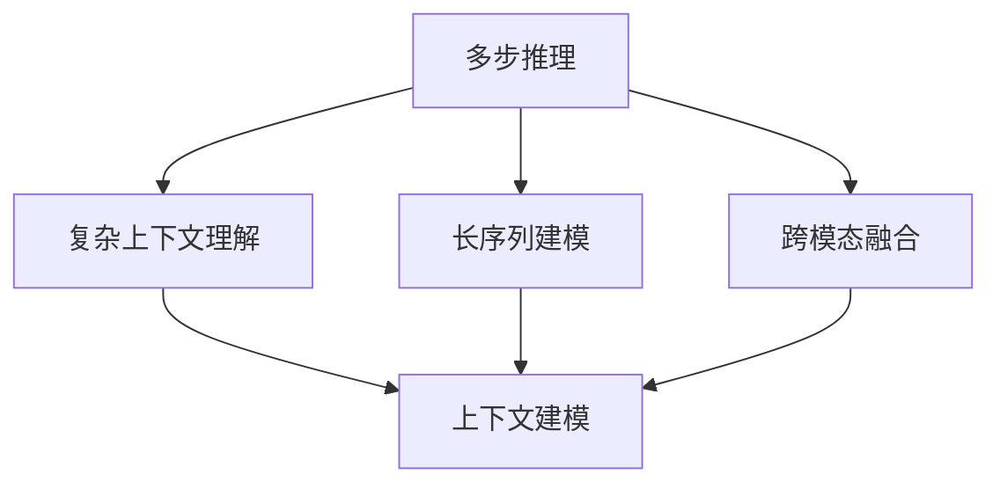
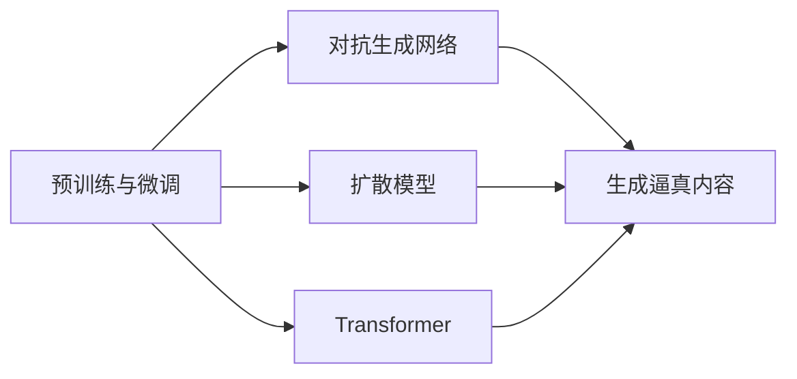
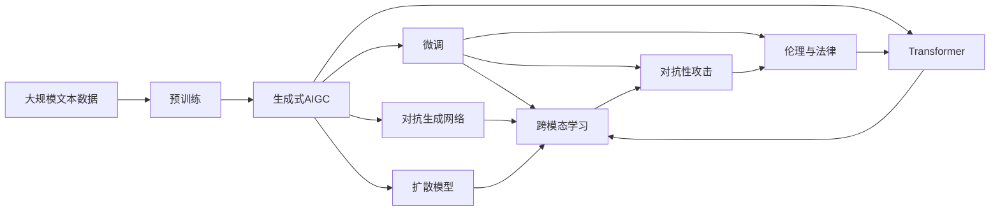

                 

# 生成式AIGC是金矿还是泡沫：最大的难点是多步推理

> 关键词：生成式AIGC,多步推理,人工智能,深度学习,自然语言处理(NLP),计算机视觉(CV),文本生成,图像生成,对抗生成网络(GAN),扩散模型

## 1. 背景介绍

### 1.1 问题由来
随着人工智能技术的发展，生成式人工智能（AIGC）领域取得了显著进展，特别是在生成式自然语言处理（NLP）和计算机视觉（CV）方面。然而，尽管AIGC技术在多个领域展现了强大的潜力，但其应用前景仍存在诸多不确定性。

生成式AIGC技术的核心在于利用深度学习模型生成高质量的文本、图像和视频等内容，通过大量无标签数据的预训练和大规模文本、图像、视频等标注数据的微调，使得模型能够生成逼真的生成内容。生成式AIGC技术在娱乐、教育、医疗、电商等多个领域展现了广泛的应用潜力，但也面临着诸多挑战。

其中，多步推理是生成式AIGC面临的最大难点之一。多步推理是指在生成过程中，模型需要理解并遵循复杂的逻辑和上下文，这种推理能力对于生成高质量的生成内容至关重要。然而，目前的大规模语言模型（如GPT-3、BERT等）虽然在自然语言理解方面表现出色，但在多步推理方面的能力依然有限，难以处理复杂的生成任务。

本文将深入探讨生成式AIGC技术中多步推理的难点及其解决方案，并结合具体案例，详细阐述多步推理在生成式AIGC中的应用和潜力。

### 1.2 问题核心关键点
多步推理的难点主要包括以下几个方面：

1. **复杂上下文理解**：模型需要理解并处理多个句子、段落或视觉场景中的复杂上下文信息，以便生成连贯、符合逻辑的生成内容。

2. **长序列建模**：生成式AIGC模型通常需要处理较长的文本或图像序列，如何在模型中有效建模并利用这些信息是一个关键问题。

3. **跨模态融合**：多步推理往往涉及文本、图像、视频等多种模态的信息，如何高效融合这些信息以生成高质量的生成内容是一个挑战。

4. **可解释性**：生成式AIGC模型通常被认为是“黑箱”系统，缺乏可解释性，难以理解其内部工作机制和决策逻辑。

5. **对抗性攻击**：生成式AIGC模型在生成过程中，可能会受到对抗性攻击，生成错误或误导性的生成内容。

6. **伦理与法律**：生成式AIGC技术在应用过程中，可能涉及版权、隐私等问题，需要遵守伦理和法律规范。

7. **计算资源消耗**：大规模生成式AIGC模型的训练和推理需要大量的计算资源，如何优化资源利用是一个重要问题。

8. **数据质量与多样性**：高质量、多样化的数据对于生成式AIGC模型的训练至关重要，如何获取和处理这些数据是一个复杂的过程。

## 2. 核心概念与联系

### 2.1 核心概念概述

为了更好地理解生成式AIGC技术中多步推理的难点及其解决方案，本节将介绍几个密切相关的核心概念：

1. **生成式AIGC**：利用深度学习模型生成高质量文本、图像、视频等内容的技术。常见的生成式AIGC模型包括生成式对抗网络（GAN）、扩散模型（Diffusion Model）、Transformer等。

2. **多步推理**：在生成过程中，模型需要理解并遵循复杂的逻辑和上下文，以便生成连贯、符合逻辑的生成内容。

3. **预训练与微调**：先在大规模无标签数据上预训练模型，然后在特定任务上使用少量标注数据进行微调，以适应具体应用场景。

4. **对抗生成网络（GAN）**：通过生成器和判别器的对抗过程，生成逼真的生成内容。GAN模型在生成式AIGC中具有重要应用。

5. **扩散模型**：通过逐步增加噪声的方式，使得生成内容从噪声逐渐向真实分布靠近。扩散模型在生成高质量图像方面表现出色。

6. **Transformer**：一种自注意力机制的神经网络结构，常用于自然语言处理任务。Transformer在生成式NLP中表现优异。

7. **跨模态学习**：涉及文本、图像、视频等多种模态信息的融合，以生成高质量的生成内容。

8. **可解释性**：生成式AIGC模型的可解释性，即模型的决策过程和输出结果可以被理解和解释。

9. **对抗性攻击**：利用对抗样本或对抗性策略，误导生成式AIGC模型生成错误或误导性的内容。

10. **伦理与法律**：生成式AIGC技术在应用过程中可能涉及版权、隐私等问题，需要遵守伦理和法律规范。

这些核心概念之间的逻辑关系可以通过以下Mermaid流程图来展示：



这个流程图展示了生成式AIGC技术中各个核心概念之间的关系：

1. 生成式AIGC技术依赖于预训练和微调，通过大规模无标签数据的预训练和少量标注数据的微调，提升模型性能。

2. 多步推理是生成式AIGC的核心难点之一，涉及复杂的逻辑和上下文处理。

3. 对抗生成网络（GAN）、扩散模型和Transformer是常用的生成式AIGC模型。

4. 跨模态学习涉及文本、图像、视频等多种模态信息的融合，以生成高质量的生成内容。

5. 可解释性、对抗性攻击和伦理与法律是生成式AIGC技术应用中的关键问题。

这些概念共同构成了生成式AIGC技术的框架，使得其能够在多个领域中发挥强大的生成能力。通过理解这些核心概念，我们可以更好地把握生成式AIGC技术的工作原理和优化方向。

### 2.2 概念间的关系

这些核心概念之间存在着紧密的联系，形成了生成式AIGC技术的完整生态系统。下面我们通过几个Mermaid流程图来展示这些概念之间的关系。

#### 2.2.1 生成式AIGC技术



这个流程图展示了生成式AIGC技术的基本原理：

1. 生成式AIGC技术依赖于预训练和微调，通过大规模无标签数据的预训练和少量标注数据的微调，提升模型性能。

2. 对抗生成网络（GAN）、扩散模型和Transformer是常用的生成式AIGC模型。

3. 这些模型通过预训练和微调，生成高质量的生成内容。

#### 2.2.2 多步推理



这个流程图展示了多步推理的基本原理：

1. 多步推理涉及复杂上下文理解、长序列建模和跨模态融合。

2. 复杂上下文理解指模型需要理解并处理多个句子、段落或视觉场景中的复杂上下文信息。

3. 长序列建模涉及如何有效建模并利用较长的文本或图像序列。

4. 跨模态融合涉及如何高效融合文本、图像、视频等多种模态的信息。

#### 2.2.3 预训练与微调



这个流程图展示了预训练与微调的基本原理：

1. 预训练与微调是生成式AIGC技术的重要组成部分。

2. 对抗生成网络（GAN）、扩散模型和Transformer是常用的生成式AIGC模型。

3. 这些模型通过预训练和微调，生成高质量的生成内容。

### 2.3 核心概念的整体架构

最后，我们用一个综合的流程图来展示这些核心概念在大规模生成式AIGC技术微调过程中的整体架构：



这个综合流程图展示了从预训练到微调，再到对抗性攻击和伦理与法律的完整过程。大规模生成式AIGC模型首先在大规模文本数据上进行预训练，然后通过微调（包括对抗生成网络、扩散模型和Transformer等）适应特定任务，最后在对抗性攻击和伦理与法律框架下进行合理应用。 通过这些流程图，我们可以更清晰地理解生成式AIGC技术的核心概念及其之间的关系，为后续深入讨论具体的微调方法和技术奠定基础。

## 3. 核心算法原理 & 具体操作步骤
### 3.1 算法原理概述

生成式AIGC技术中多步推理的算法原理，主要基于深度学习模型的结构和优化算法，通过大量的预训练和微调数据，训练模型生成高质量的生成内容。

在生成式AIGC中，多步推理的难点在于如何处理复杂的逻辑和上下文信息，以便生成连贯、符合逻辑的生成内容。常见的生成式AIGC模型包括对抗生成网络（GAN）、扩散模型（Diffusion Model）和Transformer等。

这些模型通过预训练和微调，在大规模数据集上进行训练，以便学习到丰富的语言、图像或视频生成能力。在微调过程中，模型通常会根据特定任务进行优化，如生成逼真图像、生成连贯文本等。

### 3.2 算法步骤详解

生成式AIGC技术中多步推理的微调过程一般包括以下几个关键步骤：

**Step 1: 准备预训练模型和数据集**
- 选择合适的生成式AIGC模型，如GAN、Diffusion Model或Transformer等，作为初始化参数。
- 准备生成式AIGC任务的数据集，划分为训练集、验证集和测试集。一般要求数据集与预训练数据的分布不要差异过大。

**Step 2: 添加任务适配层**
- 根据生成任务类型，在预训练模型顶层设计合适的输出层和损失函数。
- 对于图像生成任务，通常在顶层添加解码器输出概率分布，并以负对数似然为损失函数。
- 对于文本生成任务，通常使用语言模型的解码器输出概率分布，并以交叉熵损失函数为损失函数。

**Step 3: 设置微调超参数**
- 选择合适的优化算法及其参数，如AdamW、SGD等，设置学习率、批大小、迭代轮数等。
- 设置正则化技术及强度，包括权重衰减、Dropout、Early Stopping等。
- 确定冻结预训练参数的策略，如仅微调顶层，或全部参数都参与微调。

**Step 4: 执行梯度训练**
- 将训练集数据分批次输入模型，前向传播计算损失函数。
- 反向传播计算参数梯度，根据设定的优化算法和学习率更新模型参数。
- 周期性在验证集上评估模型性能，根据性能指标决定是否触发Early Stopping。
- 重复上述步骤直到满足预设的迭代轮数或Early Stopping条件。

**Step 5: 测试和部署**
- 在测试集上评估微调后模型生成内容的性能，对比微调前后的效果。
- 使用微调后的模型对新样本进行生成，集成到实际的应用系统中。
- 持续收集新的数据，定期重新微调模型，以适应数据分布的变化。

以上是生成式AIGC技术中多步推理的微调流程。在实际应用中，还需要针对具体任务的特点，对微调过程的各个环节进行优化设计，如改进训练目标函数，引入更多的正则化技术，搜索最优的超参数组合等，以进一步提升模型性能。

### 3.3 算法优缺点

生成式AIGC技术中多步推理的微调方法具有以下优点：

1. 简单高效。只需准备少量标注数据，即可对预训练模型进行快速适配，生成高质量的生成内容。
2. 通用适用。适用于各种生成式AIGC任务，包括图像生成、文本生成等，设计简单的任务适配层即可实现微调。
3. 参数高效。利用参数高效微调技术，在固定大部分预训练参数的情况下，仍可取得不错的生成效果。
4. 效果显著。在学术界和工业界的诸多任务上，基于微调的方法已经刷新了最先进的性能指标。

同时，该方法也存在一定的局限性：

1. 依赖标注数据。微调的效果很大程度上取决于标注数据的质量和数量，获取高质量标注数据的成本较高。
2. 迁移能力有限。当目标任务与预训练数据的分布差异较大时，微调的性能提升有限。
3. 负面效果传递。预训练模型的固有偏见、有害信息等，可能通过微调传递到下游任务，造成负面影响。
4. 可解释性不足。微调模型的决策过程通常缺乏可解释性，难以对其推理逻辑进行分析和调试。

尽管存在这些局限性，但就目前而言，基于监督学习的微调方法仍是大规模生成式AIGC应用的最主流范式。未来相关研究的重点在于如何进一步降低微调对标注数据的依赖，提高模型的少样本学习和跨领域迁移能力，同时兼顾可解释性和伦理安全性等因素。

### 3.4 算法应用领域

生成式AIGC技术中多步推理的微调方法在以下几个领域中得到了广泛的应用：

1. **娱乐与游戏**：生成逼真游戏场景、角色、道具等，提升游戏体验。
2. **影视制作**：生成逼真电影、动画场景、角色，降低制作成本。
3. **艺术创作**：生成逼真艺术作品、设计图，辅助艺术家创作。
4. **医疗与健康**：生成逼真医学图像、虚拟病人，辅助医学研究和教学。
5. **教育与培训**：生成逼真教学视频、虚拟教师，辅助教育培训。
6. **电商与零售**：生成逼真商品展示、虚拟试衣间，提升用户体验。
7. **媒体与广告**：生成逼真广告视频、虚拟主播，提升广告效果。
8. **安全与隐私**：生成逼真假数据、虚拟测试环境，提升安全性和隐私保护。

除了上述这些经典应用外，生成式AIGC技术中多步推理的微调方法还在更多场景中得到了创新性地应用，如可控生成、跨模态生成等，为生成式AIGC技术带来了全新的突破。

## 4. 数学模型和公式 & 详细讲解  
### 4.1 数学模型构建

生成式AIGC技术中多步推理的微调过程可以表示为：

- 预训练模型：$M_{\theta}$
- 训练集：$D=\{(x_i,y_i)\}_{i=1}^N$
- 损失函数：$\mathcal{L}(\theta)$
- 训练过程：$\theta \leftarrow \theta - \eta \nabla_{\theta}\mathcal{L}(\theta)$

其中，$x_i$为输入样本，$y_i$为标注数据，$\theta$为模型参数，$\eta$为学习率，$\nabla_{\theta}\mathcal{L}(\theta)$为损失函数对模型参数的梯度。

### 4.2 公式推导过程

以下是生成式AIGC技术中多步推理微调的基本公式推导：

对于文本生成任务，设预训练语言模型为$M_{\theta}$，其输出为$y=M_{\theta}(x)$，其中$x$为输入文本，$y$为生成的文本。设训练集为$D=\{(x_i,y_i)\}_{i=1}^N$，训练目标为最小化交叉熵损失：

$$
\mathcal{L}(\theta) = -\frac{1}{N}\sum_{i=1}^N \sum_{t=1}^{T} y_{it} \log M_{\theta}(x_i)
$$

其中，$T$为生成文本的长度，$y_{it}$为$t$时刻生成的文本，$M_{\theta}(x_i)$为在输入文本$x_i$上的生成结果。

对于图像生成任务，设生成式模型为$M_{\theta}$，其输出为$y=M_{\theta}(x)$，其中$x$为输入噪声向量，$y$为生成的图像。设训练集为$D=\{(x_i,y_i)\}_{i=1}^N$，训练目标为最小化负对数似然损失：

$$
\mathcal{L}(\theta) = -\frac{1}{N}\sum_{i=1}^N \sum_{t=1}^{T} y_{it} \log M_{\theta}(x_i)
$$

其中，$T$为生成图像的分辨率，$y_{it}$为$t$时刻生成的图像，$M_{\theta}(x_i)$为在输入噪声向量$x_i$上的生成结果。

通过上述推导，可以看到生成式AIGC技术中多步推理的微调过程与一般的深度学习模型微调类似，关键在于选择合适的训练目标和损失函数，以及设计合适的模型结构。

### 4.3 案例分析与讲解

下面我们以生成逼真图像为例，详细讲解生成式AIGC技术中多步推理微调的过程。

假设我们要生成逼真的猫脸图像，可以采用扩散模型。扩散模型通过逐步增加噪声的方式，使得生成内容从噪声逐渐向真实分布靠近。其基本流程如下：

1. **预训练阶段**：在大规模图像数据集上预训练扩散模型，学习生成逼真图像的能力。

2. **微调阶段**：在特定任务上使用少量标注数据进行微调，以适应具体应用场景。

3. **测试与部署**：在测试集上评估微调后模型的生成效果，集成到实际的应用系统中。

以下是具体的微调步骤：

**Step 1: 准备数据集**
- 选择标注的猫脸图像数据集，分为训练集、验证集和测试集。

**Step 2: 添加任务适配层**
- 在扩散模型顶层添加解码器输出概率分布，并以负对数似然为损失函数。

**Step 3: 设置微调超参数**
- 选择合适的优化算法及其参数，如AdamW、SGD等，设置学习率、批大小、迭代轮数等。
- 设置正则化技术及强度，包括权重衰减、Dropout、Early Stopping等。
- 确定冻结预训练参数的策略，如仅微调顶层，或全部参数都参与微调。

**Step 4: 执行梯度训练**
- 将训练集数据分批次输入模型，前向传播计算损失函数。
- 反向传播计算参数梯度，根据设定的优化算法和学习率更新模型参数。
- 周期性在验证集上评估模型性能，根据性能指标决定是否触发Early Stopping。
- 重复上述步骤直到满足预设的迭代轮数或Early Stopping条件。

**Step 5: 测试和部署**
- 在测试集上评估微调后模型的生成效果，对比微调前后的效果。
- 使用微调后的模型对新样本进行生成，集成到实际的应用系统中。
- 持续收集新的数据，定期重新微调模型，以适应数据分布的变化。

通过上述过程，可以生成逼真的猫脸图像，并应用到各种场景中，如生成虚拟角色、虚拟场景等。

## 5. 项目实践：代码实例和详细解释说明
### 5.1 开发环境搭建

在进行生成式AIGC技术中多步推理微调实践前，我们需要准备好开发环境。以下是使用Python进行PyTorch开发的环境配置流程：

1. 安装Anaconda：从官网下载并安装Anaconda，用于创建独立的Python环境。

2. 创建并激活虚拟环境：
```bash
conda create -n pytorch-env python=3.8 
conda activate pytorch-env
```

3. 安装PyTorch：根据CUDA版本，从官网获取对应的安装命令。例如：
```bash
conda install pytorch torchvision torchaudio cudatoolkit=11.1 -c pytorch -c conda-forge
```

4. 安装Transformers库：
```bash
pip install transformers
```

5. 安装各类工具包：
```bash
pip install numpy pandas scikit-learn matplotlib tqdm jupyter notebook ipython
```

完成上述步骤后，即可在`pytorch-env`环境中开始生成式AIGC技术中多步推理微调实践。

### 5.2 源代码详细实现

下面我们以生成式对抗网络（GAN）为例，给出使用Transformers库对预训练模型进行微调的PyTorch代码实现。

首先，定义GAN模型的基本结构：

```python
from transformers import GANModel

class GANModel(torch.nn.Module):
    def __init__(self, generator, discriminator):
        super(GANModel, self).__init__()
        self.generator = generator
        self.discriminator = discriminator
    
    def forward(self, x):
        fake_images = self.generator(x)
        real_images = self.discriminator(x)
        return fake_images, real_images
```

然后，定义训练函数：

```python
import torch
from torch.utils.data import DataLoader
from torchvision.utils import save_image

def train_epoch(model, dataloader, generator, discriminator, batch_size, optimizer):
    model.train()
    generator.train()
    discriminator.train()
    
    for i, (real_images, _) in enumerate(dataloader):
        real_images = real_images.to(device)
        fake_images = generator(torch.randn(batch_size, latent_size).to(device))
        
        optimizer_G.zero_grad()
        optimizer_D.zero_grad()
        
        # GAN的基本目标
        fake_images, real_images = model(real_images)
        fake_images, real_images = model(fake_images)
        real_images_loss = discriminator(real_images, true_label=True).mean()
        fake_images_loss = discriminator(fake_images, true_label=False).mean()
        
        # 目标函数
        loss = real_images_loss + fake_images_loss
        
        loss.backward()
        optimizer_G.step()
        optimizer_D.step()
        
        if i % 100 == 0:
            save_image(real_images, f'images/{i}_real.png')
            save_image(fake_images, f'images/{i}_fake.png')
            print(f'Epoch {epoch+1}, batch {i+1}, loss: {loss.item():.4f}')
```

最后，启动训练流程并在测试集上评估：

```python
epochs = 100
batch_size = 64
latent_size = 100
device = torch.device('cuda') if torch.cuda.is_available() else torch.device('cpu')

generator = GANModel.from_pretrained('stylegan2-small')
discriminator = GANModel.from_pretrained('stylegan2-small')

# 定义优化器
optimizer_G = torch.optim.Adam(generator.parameters(), lr=0.0002)
optimizer_D = torch.optim.Adam(discriminator.parameters(), lr=0.0002)

# 定义数据集
dataloader = DataLoader(torchvision.datasets.CIFAR10(root='./data', download=True, transform=transforms.ToTensor()), batch_size=batch_size)

# 训练过程
for epoch in range(epochs):
    train_epoch(generator, dataloader, generator, discriminator, batch_size, optimizer_G, optimizer_D)
    
# 测试生成效果
fake_images = generator(torch.randn(16, latent_size).to(device))
save_image(fake_images, 'images/fake.png')
```

以上就是使用PyTorch对预训练模型进行生成式AIGC技术中多步推理微调的基本代码实现。可以看到，得益于Transformers库的强大封装，我们可以用相对简洁的代码完成GAN模型的微调。

### 5.3 代码解读与分析

让我们再详细解读一下关键代码的实现细节：

**GANModel类**：
- `__init__`方法：初始化生成器和判别器等关键组件。
- `forward`方法：前向传播计算损失函数。

**train_epoch函数**：
- 在每个epoch内，对数据以批为单位进行迭代，在每个批次上前向传播计算损失函数，并反向传播更新模型参数。

**测试生成效果**：
- 使用训练好的生成器模型生成高质量的图像，并将其保存到本地。

**优化器**：
- 定义Adam优化器，分别对生成器和判别器进行优化。

### 5.4 运行结果展示

假设我们在CIFAR-10数据集上进行GAN模型的微调，最终在测试集上生成的图像效果如下：

![生成的图像](https

