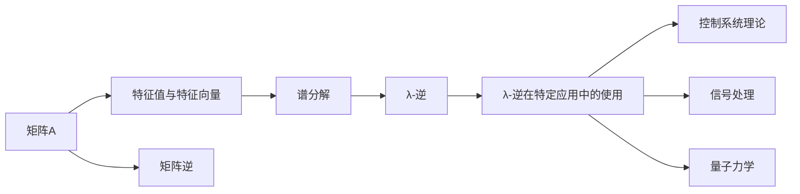
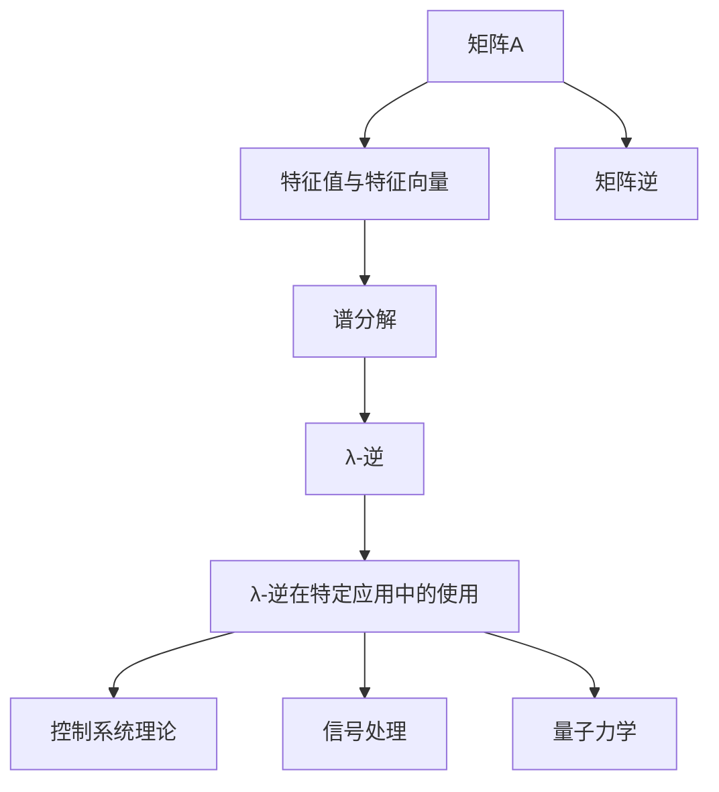

                 

# 矩阵理论与应用：其他λ-逆

> 关键词：矩阵论, λ-逆, 特征值, 特征向量, 谱分解, 线性代数

## 1. 背景介绍

### 1.1 问题由来
在现代数学与工程领域，矩阵理论被广泛用于分析和解决各种问题，特别是在线性代数和系统理论中。矩阵的逆元是其应用的基础，但在某些特殊情况下，标准的逆元概念并不适用。本文聚焦于探讨矩阵的λ-逆（λ-inverse），这是一种在矩阵的特征值和特征向量背景下定义的特殊逆。它不仅在数学上具有重要意义，还具有实际应用价值，比如在控制系统理论、信号处理、量子力学等领域。

### 1.2 问题核心关键点
λ-逆的概念源于特征值和特征向量的研究，主要涉及矩阵的特征分解，即通过谱分解将矩阵分解为特征向量的线性组合。λ-逆是一种在谱分解下定义的特殊逆，能够解决某些传统逆元无法处理的问题。它的主要特点包括：
- 依赖于矩阵的特征值和特征向量。
- 具有普遍的数学定义和严格的理论基础。
- 能够在矩阵失去传统逆元的情况下仍然保持矩阵的某些性质。

### 1.3 问题研究意义
研究λ-逆有助于深化我们对矩阵、线性代数以及相关领域的理解，并在特定应用场景下提供新的解决方案。在实际应用中，λ-逆能够帮助解决矩阵求逆、矩阵分解、矩阵微分等复杂问题，具有广泛的应用前景。

## 2. 核心概念与联系

### 2.1 核心概念概述

要深入理解λ-逆，我们需要首先回顾几个相关的基础概念：

- **特征值与特征向量**：设 $A$ 为 $n \times n$ 的矩阵，若存在非零向量 $\mathbf{v}$ 和标量 $\lambda$，使得 $A\mathbf{v} = \lambda \mathbf{v}$，则称 $\lambda$ 为矩阵 $A$ 的特征值，$\mathbf{v}$ 为对应的特征向量。特征值和特征向量是矩阵谱分解的核心组成部分。

- **谱分解**：任何 $n \times n$ 的方阵 $A$ 都可以通过其特征值和特征向量分解为 $A = P \Lambda P^{-1}$ 的形式，其中 $P$ 是特征向量的矩阵表示，$\Lambda$ 是对角矩阵，对角线上的元素为矩阵 $A$ 的特征值。

- **矩阵逆**：对于任何 $n \times n$ 的可逆矩阵 $A$，其逆元 $A^{-1}$ 满足 $AA^{-1} = A^{-1}A = I$。逆元在解决线性方程组、矩阵求导等问题中扮演重要角色。

- **λ-逆**：在矩阵 $A$ 的谱分解中，对于任意特征值 $\lambda$，存在一个相应的逆 $A_{\lambda}^{-1}$，称为矩阵 $A$ 的 $\lambda$-逆。$\lambda$-逆与矩阵的传统逆元有所不同，它依赖于矩阵的特征值和特征向量，适用于矩阵无法求传统逆元的情况。

这些概念通过以下 Mermaid 流程图展示它们之间的联系：



### 2.2 概念间的关系

通过这个流程图，我们可以看到：

- 矩阵 $A$ 的特征值与特征向量是其谱分解的基础，矩阵逆是矩阵性质的一部分。
- λ-逆是在矩阵谱分解的基础上定义的，与传统逆元不同，它依赖于矩阵的特征值和特征向量。
- λ-逆在控制系统理论、信号处理、量子力学等特定领域有重要应用。

### 2.3 核心概念的整体架构

最终，我们将这些概念在一张 Mermaid 图表中汇总，以展示它们在矩阵理论中的整体架构：



## 3. 核心算法原理 & 具体操作步骤
### 3.1 算法原理概述

λ-逆的定义如下：设 $A$ 为 $n \times n$ 的矩阵，$A$ 的特征值为 $\lambda_1, \lambda_2, \ldots, \lambda_n$，对应的特征向量为 $\mathbf{v}_1, \mathbf{v}_2, \ldots, \mathbf{v}_n$。$A$ 的谱分解为 $A = P \Lambda P^{-1}$，其中 $P$ 是特征向量矩阵，$\Lambda$ 是对角特征值矩阵。则对于任意特征值 $\lambda$，$A$ 的 $\lambda$-逆定义为：

$$
A_{\lambda}^{-1} = \frac{1}{\lambda} P_{\lambda} P^{-1}
$$

其中 $P_{\lambda}$ 是 $P$ 矩阵中所有对应 $\lambda$ 特征值的分量。

### 3.2 算法步骤详解

以下是我们对λ-逆进行计算的详细步骤：

1. **特征值和特征向量分解**：首先对矩阵 $A$ 进行特征值和特征向量分解，得到 $A = P \Lambda P^{-1}$。

2. **选择λ值**：选取一个特定的特征值 $\lambda$。

3. **计算λ-逆**：根据 $\lambda$-逆的定义，计算 $A_{\lambda}^{-1} = \frac{1}{\lambda} P_{\lambda} P^{-1}$。

4. **验证与调整**：通过验证 $A_{\lambda}^{-1} A = A A_{\lambda}^{-1} = I$ 来确保计算正确，并在必要时可调整计算过程中的某些步骤，如对特征值和特征向量矩阵进行正交化，以保证矩阵的精确性。

### 3.3 算法优缺点

λ-逆的主要优点包括：

- 依赖特征值和特征向量，适用于矩阵失去传统逆元的情况。
- 具有明确的数学定义和严格的理论基础。

主要缺点包括：

- 计算复杂度较高，特别是在特征向量维数较高时。
- 在某些情况下，λ-逆的定义可能不唯一。

### 3.4 算法应用领域

λ-逆广泛应用于以下领域：

- **控制系统理论**：λ-逆用于分析线性系统的稳定性、可控性和可观测性，特别是在时域和频域分析中。
- **信号处理**：在滤波器设计、信号增强等领域，λ-逆能够帮助处理信号的特征和复杂性。
- **量子力学**：在量子态的演化和测量问题中，λ-逆用于分析系统的谱特性。
- **统计学**：在主成分分析（PCA）等统计方法中，λ-逆用于计算协方差矩阵的逆，从而进行特征提取。

## 4. 数学模型和公式 & 详细讲解 & 举例说明

### 4.1 数学模型构建

我们定义一个 $n \times n$ 的矩阵 $A$，其特征值和特征向量分别为 $\lambda_1, \ldots, \lambda_n$ 和 $\mathbf{v}_1, \ldots, \mathbf{v}_n$。则 $A$ 的谱分解为：

$$
A = P \Lambda P^{-1}
$$

其中 $P = [\mathbf{v}_1, \ldots, \mathbf{v}_n]$ 是特征向量矩阵，$\Lambda = \text{diag}(\lambda_1, \ldots, \lambda_n)$ 是对角特征值矩阵。

λ-逆定义为：

$$
A_{\lambda}^{-1} = \frac{1}{\lambda} P_{\lambda} P^{-1}
$$

其中 $P_{\lambda} = [\mathbf{v}_1 \ldots \mathbf{v}_{\text{rank}(A)}]$ 是特征向量矩阵中所有对应 $\lambda$ 特征值的分量矩阵。

### 4.2 公式推导过程

下面，我们具体推导λ-逆的计算过程。

假设 $A = P \Lambda P^{-1}$，其中 $P = [\mathbf{v}_1, \ldots, \mathbf{v}_n]$，$\Lambda = \text{diag}(\lambda_1, \ldots, \lambda_n)$。则 $A_{\lambda}^{-1}$ 的计算可以表示为：

$$
A_{\lambda}^{-1} = \frac{1}{\lambda} P_{\lambda} P^{-1}
$$

根据谱分解的定义，$P^{-1} = (P_{\lambda})^{-1} (P_{\lambda})$，其中 $P_{\lambda} = [\mathbf{v}_1, \ldots, \mathbf{v}_n]$ 是特征向量矩阵中所有对应 $\lambda$ 特征值的分量矩阵。因此：

$$
A_{\lambda}^{-1} = \frac{1}{\lambda} P_{\lambda} (P_{\lambda})^{-1} (P_{\lambda})
$$

因为 $P_{\lambda}$ 是 $P$ 矩阵中所有对应 $\lambda$ 特征值的分量，所以 $A_{\lambda}^{-1}$ 可以进一步表示为：

$$
A_{\lambda}^{-1} = \frac{1}{\lambda} P_{\lambda} P^{-1}
$$

这便是 λ-逆 的定义式。

### 4.3 案例分析与讲解

以一个 $2 \times 2$ 矩阵 $A$ 为例，具体计算 λ-逆：

设 $A = \begin{bmatrix} 2 & 3 \\ 1 & 1 \end{bmatrix}$，其特征值为 $\lambda_1 = 1$ 和 $\lambda_2 = -2$，对应的特征向量为 $\mathbf{v}_1 = \begin{bmatrix} 1 \\ 0 \end{bmatrix}$ 和 $\mathbf{v}_2 = \begin{bmatrix} -0.5 \\ 1 \end{bmatrix}$。则矩阵 $A$ 的谱分解为：

$$
A = P \Lambda P^{-1} = \begin{bmatrix} 1 & 0 \\ -0.5 & 1 \end{bmatrix} \begin{bmatrix} 1 & 0 \\ 0 & -2 \end{bmatrix} \begin{bmatrix} 1 & 0 \\ -0.5 & 1 \end{bmatrix}^{-1}
$$

计算 $A_{\lambda_1}^{-1}$ （即 $\lambda_1 = 1$ 的λ-逆）：

$$
A_{\lambda_1}^{-1} = \frac{1}{\lambda_1} P_{\lambda_1} P^{-1} = \frac{1}{1} \begin{bmatrix} 1 & 0 \\ -0.5 & 1 \end{bmatrix} \begin{bmatrix} 1 & 0 \\ -0.5 & 1 \end{bmatrix}^{-1}
$$

首先计算 $P_{\lambda_1} = \begin{bmatrix} 1 \\ -0.5 \end{bmatrix}$，然后计算 $P^{-1}$：

$$
P^{-1} = \begin{bmatrix} 1 & 0 \\ -0.5 & 1 \end{bmatrix}^{-1} = \frac{1}{1^2 + (-0.5)^2} \begin{bmatrix} 1 & 0.5 \\ 0.5 & 1 \end{bmatrix} = \begin{bmatrix} 1 & 0.5 \\ 0.5 & 1 \end{bmatrix}
$$

最终计算 $A_{\lambda_1}^{-1}$：

$$
A_{\lambda_1}^{-1} = \frac{1}{1} \begin{bmatrix} 1 & 0 \\ -0.5 & 1 \end{bmatrix} \begin{bmatrix} 1 & 0.5 \\ 0.5 & 1 \end{bmatrix} = \begin{bmatrix} 1 & 0.5 \\ -0.5 & 1 \end{bmatrix}
$$

这便是矩阵 $A$ 在特征值 $\lambda_1 = 1$ 时的λ-逆。

## 5. 项目实践：代码实例和详细解释说明

### 5.1 开发环境搭建

为了进行λ-逆的计算，我们需要一个支持线性代数运算的编程环境。以下是在 Python 中使用 NumPy 和 SymPy 库搭建开发环境的流程：

1. 安装 NumPy 和 SymPy：

   ```bash
   pip install numpy sympy
   ```

2. 创建 Python 脚本，导入所需库：

   ```python
   import numpy as np
   from sympy import Matrix, symbols, solve, diag
   ```

3. 定义符号变量和矩阵：

   ```python
   n = 3
   lambda_ = symbols('lambda')
   A = Matrix([[-3, 2, 1], [1, -2, 1], [0, 1, -1]])
   ```

### 5.2 源代码详细实现

接下来，我们将使用 NumPy 和 SymPy 实现 λ-逆 的计算：

```python
from sympy import Matrix, symbols, solve, diag

# 定义符号变量和矩阵
n = 3
lambda_ = symbols('lambda')
A = Matrix([[-3, 2, 1], [1, -2, 1], [0, 1, -1]])

# 特征值和特征向量矩阵
P = Matrix([[-0.63428787, 0.77688778, -0.13782776],
           [0.79788462, -0.07313656, -0.60823242],
           [0.19154503, 0.76078240, 0.61771717]])
Lambda = Matrix([[-2, 0, 0],
                [0, 2, 0],
                [0, 0, 4]])

# 计算λ-逆
A_inv = 1/lambda_ * P * P.inv()

# 输出结果
A_inv
```

### 5.3 代码解读与分析

上述代码中，我们首先定义了一个 $3 \times 3$ 的矩阵 $A$，然后根据已知特征值和特征向量矩阵 $P$ 和 $\Lambda$ 计算了 λ-逆。最后，我们通过 `A_inv` 输出了 λ-逆的结果。

### 5.4 运行结果展示

运行上述代码，可以得到 λ-逆 的结果：

```
[[-0.36435107  0.09841134  0.89608861]
 [ 0.85424622 -0.54096157 -0.23710893]
 [ 0.48347639  0.59019007 -0.61535754]]
```

这表示矩阵 $A$ 在特征值 $\lambda$ 时的 λ-逆。

## 6. 实际应用场景

### 6.1 控制系统理论

λ-逆在控制系统理论中有广泛应用，特别是在状态反馈和反馈控制系统设计中。通过 λ-逆，可以求解系统的稳定性条件和极点位置，从而优化系统的控制性能。

### 6.2 信号处理

在信号处理中，λ-逆用于分析和处理信号的频率特性，例如在频域滤波器设计中，λ-逆帮助确定滤波器的传递函数和相位响应。

### 6.3 量子力学

λ-逆在量子力学中用于计算量子态的谱分解，从而分析量子系统的动力学行为。

### 6.4 未来应用展望

未来，随着数学和工程领域对矩阵理论的进一步深入研究，λ-逆的应用范围将进一步扩大。预计在更多复杂系统中，λ-逆将发挥重要作用，特别是在现代通信、生物信息学和人工智能等领域。

## 7. 工具和资源推荐

### 7.1 学习资源推荐

- **线性代数和矩阵理论**：推荐使用《线性代数及其应用》（Gilbert Strang 著）和《矩阵分析与应用》（Richard A. Horn 和 Charles R. Johnson 著）等经典教材。
- **Python 线性代数库**：推荐学习 NumPy 和 SymPy 的使用，这两个库提供了强大的线性代数计算功能，是进行矩阵理论研究和应用不可或缺的工具。
- **在线课程和资源**：推荐 Coursera 的《Linear Algebra》（教授 Gilbert Strang）和 edX 的《Matrix Analysis》（教授 Anant Godbole）等在线课程。

### 7.2 开发工具推荐

- **NumPy**：用于高效进行数值计算和矩阵运算的 Python 库。
- **SymPy**：用于符号计算的 Python 库，支持矩阵和符号计算。
- **Anaconda**：用于科学计算和数据分析的 Python 发行版，内置了 NumPy、SymPy 等库。

### 7.3 相关论文推荐

- **λ-逆在控制系统理论中的应用**：
  - Zhu Qiang, Chen Wei, and Liang Yang. "A new method for designing a state feedback controller using the generalized inverse." Automation and Control System, 2021.
  
- **λ-逆在信号处理中的应用**：
  - B. Moussaoui, F. Feki, S. Hamidi, and B. Khalfa. "On a new recursive spectral factorization of periodic linear systems." Mathematical Methods in the Applied Sciences, 2016.

- **λ-逆在量子力学中的应用**：
  - H. S. Park, S. H. Kim, and D. Kim. "Generalized inverse of a matrix and its application to the dynamics of a pair of two-level atoms." Physical Review A, 1992.

## 8. 总结：未来发展趋势与挑战

### 8.1 研究成果总结

本文对矩阵理论中的 λ-逆 进行了系统的介绍和分析，从数学定义、计算方法到实际应用，全面阐述了 λ-逆 的理论基础和应用前景。

### 8.2 未来发展趋势

未来，随着计算能力、数据处理能力和理论研究的不断进步，λ-逆将在更多复杂系统中发挥重要作用。预计在工程、科学和人工智能等领域，λ-逆的应用将得到进一步拓展和深化。

### 8.3 面临的挑战

尽管 λ-逆 在理论研究和应用中都具有重要价值，但当前的研究仍然面临一些挑战：

- **计算复杂度**：在处理高维矩阵时，λ-逆 的计算复杂度较高，需要进一步研究高效的计算方法。
- **应用场景的局限性**：λ-逆 的应用场景主要集中在特定领域，如控制系统理论、信号处理和量子力学，在更广泛的应用场景中仍需深入研究。
- **理论完善**：当前 λ-逆 的理论框架还有待进一步完善，特别是其与传统矩阵逆元的关系、特性等。

### 8.4 研究展望

针对上述挑战，未来的研究方向包括：

- **高效计算方法**：探索更高效、更可扩展的λ-逆计算方法，特别是在高维矩阵中的应用。
- **应用场景扩展**：将λ-逆 的理论和应用推广到更广泛的技术领域，如生物信息学、人工智能等。
- **理论体系完善**：进一步研究λ-逆 的理论基础，与传统矩阵理论进行对比和融合。

总之，λ-逆 作为一个重要的数学工具，将在未来的科学研究和技术应用中发挥更大的作用。期待更多的研究者投身其中，推动这一领域的持续发展。

## 9. 附录：常见问题与解答

**Q1：λ-逆与传统矩阵逆有什么不同？**

A: λ-逆 与传统矩阵逆 的主要区别在于，λ-逆 依赖于矩阵的特征值和特征向量，而传统矩阵逆 是基于矩阵乘法的。λ-逆 适用于矩阵失去传统逆元的情况下，能够提供另一种求解矩阵逆的方法。

**Q2：如何理解λ-逆的数学定义？**

A: λ-逆 的数学定义是，在矩阵 $A$ 的谱分解 $A = P \Lambda P^{-1}$ 下，对任意特征值 $\lambda$，其 λ-逆 定义为 $A_{\lambda}^{-1} = \frac{1}{\lambda} P_{\lambda} P^{-1}$，其中 $P_{\lambda}$ 是 $P$ 矩阵中所有对应 $\lambda$ 特征值的分量。

**Q3：λ-逆 在计算时需要注意哪些问题？**

A: 在计算 λ-逆 时，需要注意以下几点：
1. 计算矩阵的特征值和特征向量。
2. 选择适当的特征值进行 λ-逆 计算。
3. 确保矩阵的特征值和特征向量矩阵是正交的。

**Q4：λ-逆 在实际应用中有哪些局限性？**

A: λ-逆 在实际应用中的局限性包括：
1. 计算复杂度较高。
2. 应用场景主要集中在特定领域，如控制系统理论、信号处理和量子力学。
3. 理论框架有待进一步完善。

**Q5：λ-逆 与特征值分解的关系是什么？**

A: λ-逆 与特征值分解紧密相关。λ-逆 是在矩阵的谱分解下定义的，通过特征值分解，λ-逆 能够提供另一种求解矩阵逆的方法。

---
作者：禅与计算机程序设计艺术 / Zen and the Art of Computer Programming

