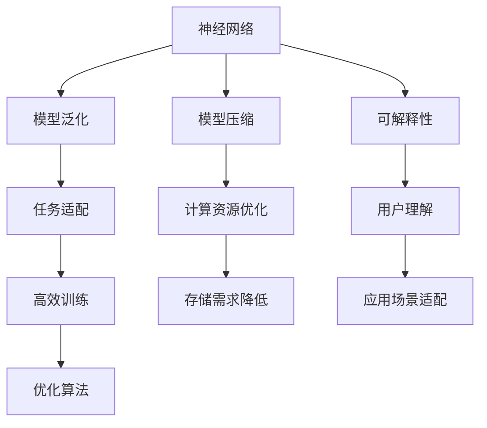
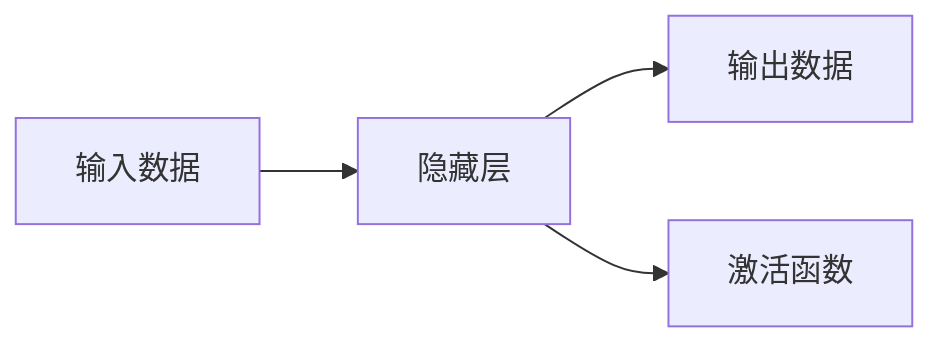
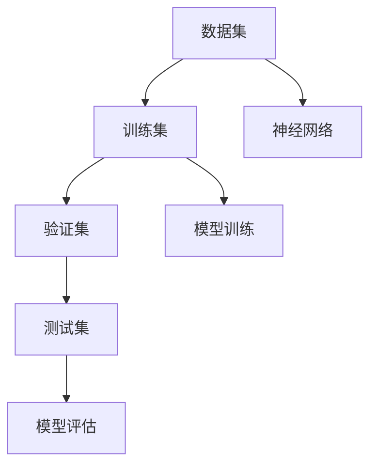
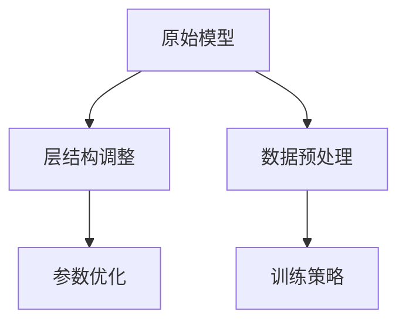
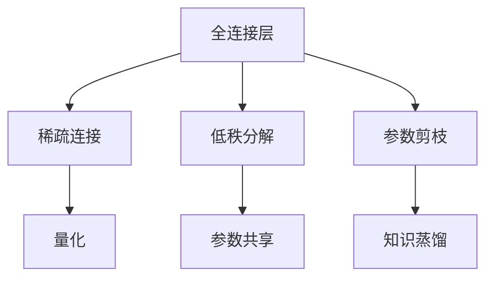
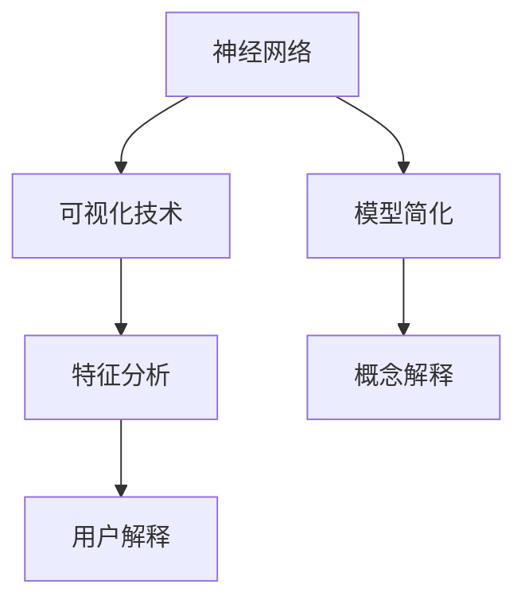

                 

# 神经网络：可移植性和灵活性

> 关键词：神经网络，可移植性，灵活性，机器学习，深度学习

## 1. 背景介绍

### 1.1 问题由来
在当前大数据时代，深度学习技术的蓬勃发展为人工智能领域带来了前所未有的革新。神经网络，作为深度学习的核心技术，凭借其强大的表达能力和自我学习能力，在图像识别、自然语言处理、语音识别、推荐系统等领域表现卓越。然而，神经网络的设计和训练，尤其是其可移植性和灵活性的优化，一直是研究人员和工程师追求的目标。

### 1.2 问题核心关键点
神经网络的可移植性和灵活性，是指通过合理的设计和优化，使神经网络在多种不同的应用场景和数据集上都能表现出良好的泛化能力，同时在不同的任务和需求中灵活适应和优化。这一问题涉及以下几个关键点：

1. 模型的泛化能力：神经网络如何在新的数据集上保持性能。
2. 模型的可适应性：神经网络如何适应不同的任务需求。
3. 模型的高效性：如何在保证性能的同时，减少计算资源和存储需求。
4. 模型的易用性：神经网络的设计应具有足够的可解释性，便于用户理解和应用。

## 2. 核心概念与联系

### 2.1 核心概念概述

为更好地理解神经网络的可移植性和灵活性，本节将介绍几个密切相关的核心概念：

- **神经网络（Neural Networks）**：由大量神经元（Neurons）组成的计算模型，通过学习数据中的模式和规律，实现复杂的非线性映射和决策。
- **模型泛化能力（Model Generalization）**：神经网络在未见过的数据上，能否保持良好的预测性能。
- **任务适配（Task Adaptation）**：神经网络根据不同任务的需求，调整模型结构和参数。
- **模型压缩（Model Compression）**：在不降低模型性能的前提下，减小模型的大小和计算复杂度。
- **可解释性（Interpretability）**：神经网络的结构和参数可被解释和理解，便于用户信任和应用。

这些概念之间通过以下Mermaid流程图展示其关系：



这个流程图展示了几大核心概念之间的逻辑关系：

1. 神经网络通过学习数据集中的模式，具备了泛化能力。
2. 通过任务适配，神经网络根据具体任务需求调整模型结构。
3. 模型压缩技术减小模型规模，优化计算和存储资源。
4. 可解释性增强用户对模型的理解和信任。

### 2.2 概念间的关系

这些核心概念之间存在着紧密的联系，形成了神经网络设计和应用的完整生态系统。下面我通过几个Mermaid流程图来展示这些概念之间的关系。

#### 2.2.1 神经网络的基本结构



这个流程图展示了神经网络的基本结构，包括输入层、隐藏层和输出层，以及其中的激活函数。

#### 2.2.2 模型泛化能力的实现



这个流程图展示了模型泛化能力的实现过程，从数据集划分到模型训练和评估。

#### 2.2.3 任务适配的策略



这个流程图展示了任务适配的策略，包括调整层结构、优化参数、数据预处理和训练策略。

#### 2.2.4 模型压缩的方法



这个流程图展示了模型压缩的常用方法，包括稀疏连接、低秩分解、参数剪枝、量化、参数共享和知识蒸馏。

#### 2.2.5 可解释性的实现



这个流程图展示了可解释性的实现方法，包括可视化技术、特征分析、模型简化和概念解释。

## 3. 核心算法原理 & 具体操作步骤
### 3.1 算法原理概述

神经网络的可移植性和灵活性，主要通过模型泛化、任务适配、模型压缩和可解释性等技术实现。

- **模型泛化**：通过选择合适的训练策略和优化算法，提升神经网络在新的数据集上的泛化能力。
- **任务适配**：通过调整神经网络的结构和参数，使其适应不同的任务需求。
- **模型压缩**：通过稀疏化、低秩分解、量化等方法，减小神经网络的大小和计算复杂度。
- **可解释性**：通过可视化技术和特征分析，提升神经网络的可解释性，便于用户理解和应用。

### 3.2 算法步骤详解

基于神经网络的可移植性和灵活性，我们可以将神经网络的开发流程划分为以下几个步骤：

**Step 1: 数据准备**
- 收集和标注数据集，将数据划分为训练集、验证集和测试集。
- 对数据进行预处理，如归一化、标准化、特征工程等，准备训练。

**Step 2: 模型设计**
- 选择适当的神经网络架构，如卷积神经网络（CNN）、循环神经网络（RNN）、Transformer等。
- 设计模型结构，包括输入层、隐藏层和输出层。
- 选择合适的激活函数，如ReLU、Sigmoid、Tanh等。
- 设置损失函数和优化器。

**Step 3: 模型训练**
- 使用训练集对模型进行训练，调整模型参数以最小化损失函数。
- 使用验证集评估模型性能，调整超参数以避免过拟合。
- 使用测试集评估最终模型性能，确保模型泛化能力。

**Step 4: 任务适配**
- 根据任务需求，调整模型结构和参数，如调整层数、神经元数量、学习率等。
- 选择合适的训练策略，如迁移学习、集成学习等。
- 使用验证集评估任务适配后的模型性能，调整适配策略以优化效果。

**Step 5: 模型压缩**
- 选择适当的模型压缩方法，如稀疏连接、低秩分解、量化、参数剪枝等。
- 使用模型压缩方法减小模型大小，优化计算和存储资源。
- 使用验证集评估压缩后的模型性能，选择最优压缩策略。

**Step 6: 可解释性增强**
- 使用可视化技术和特征分析方法，提升模型的可解释性。
- 简化模型结构，使用更加可解释的激活函数和层结构。
- 提供特征分析报告，解释模型对数据的理解。

### 3.3 算法优缺点

基于神经网络的可移植性和灵活性，具有以下优点：

1. **广泛适用性**：神经网络可以应用于多种不同的任务和数据集，具有较强的泛化能力。
2. **灵活调整**：通过调整模型结构和参数，神经网络可以适应不同的任务需求。
3. **高效计算**：使用模型压缩和量化方法，神经网络可以在计算资源有限的情况下，仍然保持高性能。
4. **用户理解**：通过增强可解释性，用户可以更好地理解神经网络的工作原理和决策逻辑。

然而，也存在以下缺点：

1. **计算资源消耗大**：神经网络模型通常参数量大，计算复杂度较高，需要较高的计算资源。
2. **数据依赖性强**：神经网络的性能高度依赖于数据质量，数据偏差可能导致模型泛化能力下降。
3. **可解释性不足**：复杂的神经网络结构和高维参数空间，使得模型可解释性较差。
4. **过度拟合风险**：神经网络在训练过程中容易出现过拟合现象，需要额外的正则化和数据增强策略。

### 3.4 算法应用领域

神经网络的可移植性和灵活性，在多个领域得到了广泛应用：

- **计算机视觉**：图像分类、物体检测、人脸识别等任务。
- **自然语言处理**：机器翻译、文本分类、情感分析、问答系统等任务。
- **语音识别**：自动语音识别、语音合成、情感识别等任务。
- **推荐系统**：个性化推荐、协同过滤、点击率预测等任务。
- **医疗健康**：疾病诊断、医学图像分析、基因分析等任务。
- **金融风控**：信用评分、风险评估、反欺诈检测等任务。

## 4. 数学模型和公式 & 详细讲解 & 举例说明

### 4.1 数学模型构建

本节将使用数学语言对神经网络的可移植性和灵活性进行更加严格的刻画。

记神经网络为 $N$，其中 $X$ 为输入空间，$Y$ 为输出空间，$f_{\theta}$ 为参数 $\theta$ 对应的模型函数。假设训练集为 $D=\{(x_i,y_i)\}_{i=1}^N$，其中 $x_i \in X$ 为输入数据，$y_i \in Y$ 为对应的标签。

定义损失函数 $L(f_{\theta},D)$，用于衡量模型 $f_{\theta}$ 在数据集 $D$ 上的预测误差。常见的损失函数包括交叉熵损失、均方误差损失等。

神经网络的训练目标是最小化损失函数，即找到最优参数：

$$
\theta^* = \mathop{\arg\min}_{\theta} L(f_{\theta},D)
$$

通过梯度下降等优化算法，不断更新模型参数 $\theta$，最小化损失函数，使得模型 $f_{\theta}$ 逼近真实函数 $f$。

### 4.2 公式推导过程

以下我们以二分类任务为例，推导交叉熵损失函数及其梯度的计算公式。

假设神经网络在输入 $x$ 上的输出为 $\hat{y}=f_{\theta}(x)$，表示样本属于正类的概率。真实标签 $y \in \{0,1\}$。则二分类交叉熵损失函数定义为：

$$
L(f_{\theta},x,y) = -[y\log \hat{y} + (1-y)\log (1-\hat{y})]
$$

将其代入损失函数公式，得：

$$
L(f_{\theta},D) = \frac{1}{N}\sum_{i=1}^N L(f_{\theta},x_i,y_i)
$$

根据链式法则，损失函数对参数 $\theta_k$ 的梯度为：

$$
\frac{\partial L(f_{\theta},D)}{\partial \theta_k} = -\frac{1}{N}\sum_{i=1}^N \frac{\partial L(f_{\theta},x_i,y_i)}{\partial \theta_k}
$$

其中 $\frac{\partial L(f_{\theta},x_i,y_i)}{\partial \theta_k}$ 可进一步递归展开，利用自动微分技术完成计算。

### 4.3 案例分析与讲解

以图像分类任务为例，介绍神经网络的可移植性和灵活性的具体实现。

**数据准备**
- 收集大量图像数据集，并标注标签。
- 将数据集划分为训练集、验证集和测试集。
- 对图像进行预处理，如裁剪、缩放、归一化等。

**模型设计**
- 选择卷积神经网络（CNN）作为基本架构。
- 设计多个卷积层、池化层和全连接层，实现图像特征提取和分类。
- 设置ReLU作为激活函数，优化器使用Adam。
- 设置交叉熵损失函数作为训练目标。

**模型训练**
- 使用训练集对模型进行训练，调整参数以最小化交叉熵损失。
- 使用验证集评估模型性能，调整学习率和批次大小。
- 使用测试集评估最终模型性能，确保泛化能力。

**任务适配**
- 根据具体任务需求，调整模型结构。如增加卷积层或全连接层，调整学习率。
- 使用迁移学习技术，将预训练模型作为初始化权重，快速适应新任务。
- 使用集成学习技术，结合多个模型提升性能。

**模型压缩**
- 使用稀疏连接方法，减少模型参数。
- 使用量化技术，将浮点数参数转换为整数参数。
- 使用参数剪枝技术，去除冗余参数。

**可解释性增强**
- 使用可视化工具，展示神经网络的激活图和梯度图。
- 简化模型结构，使用可解释的激活函数和层结构。
- 提供特征分析报告，解释模型对数据的理解。

## 5. 项目实践：代码实例和详细解释说明

### 5.1 开发环境搭建

在进行神经网络的可移植性和灵活性实践前，我们需要准备好开发环境。以下是使用Python进行PyTorch开发的环境配置流程：

1. 安装Anaconda：从官网下载并安装Anaconda，用于创建独立的Python环境。

2. 创建并激活虚拟环境：
```bash
conda create -n pytorch-env python=3.8 
conda activate pytorch-env
```

3. 安装PyTorch：根据CUDA版本，从官网获取对应的安装命令。例如：
```bash
conda install pytorch torchvision torchaudio cudatoolkit=11.1 -c pytorch -c conda-forge
```

4. 安装Transformers库：
```bash
pip install transformers
```

5. 安装各类工具包：
```bash
pip install numpy pandas scikit-learn matplotlib tqdm jupyter notebook ipython
```

完成上述步骤后，即可在`pytorch-env`环境中开始神经网络的可移植性和灵活性实践。

### 5.2 源代码详细实现

下面我们以图像分类任务为例，给出使用Transformers库对神经网络进行可移植性和灵活性优化的PyTorch代码实现。

首先，定义神经网络模型：

```python
import torch
from torch import nn
from transformers import BertTokenizer, BertForTokenClassification

class CNN(nn.Module):
    def __init__(self):
        super(CNN, self).__init__()
        self.conv1 = nn.Conv2d(3, 16, 3, padding=1)
        self.pool = nn.MaxPool2d(2, 2)
        self.conv2 = nn.Conv2d(16, 32, 3, padding=1)
        self.fc1 = nn.Linear(32 * 16 * 16, 512)
        self.fc2 = nn.Linear(512, 10)

    def forward(self, x):
        x = self.pool(nn.functional.relu(self.conv1(x)))
        x = self.pool(nn.functional.relu(self.conv2(x)))
        x = x.view(x.size(0), -1)
        x = nn.functional.relu(self.fc1(x))
        x = self.fc2(x)
        return nn.functional.log_softmax(x, dim=1)

model = CNN()
```

接着，定义训练和评估函数：

```python
from torch.utils.data import DataLoader
from tqdm import tqdm
from sklearn.metrics import classification_report

device = torch.device('cuda') if torch.cuda.is_available() else torch.device('cpu')
model.to(device)

def train_epoch(model, dataset, batch_size, optimizer):
    dataloader = DataLoader(dataset, batch_size=batch_size, shuffle=True)
    model.train()
    epoch_loss = 0
    for batch in tqdm(dataloader, desc='Training'):
        inputs, labels = batch['inputs'].to(device), batch['labels'].to(device)
        model.zero_grad()
        outputs = model(inputs)
        loss = nn.functional.nll_loss(outputs, labels)
        epoch_loss += loss.item()
        loss.backward()
        optimizer.step()
    return epoch_loss / len(dataloader)

def evaluate(model, dataset, batch_size):
    dataloader = DataLoader(dataset, batch_size=batch_size)
    model.eval()
    preds, labels = [], []
    with torch.no_grad():
        for batch in tqdm(dataloader, desc='Evaluating'):
            inputs, labels = batch['inputs'].to(device), batch['labels'].to(device)
            outputs = model(inputs)
            batch_preds = torch.argmax(outputs, dim=1).to('cpu').tolist()
            batch_labels = labels.to('cpu').tolist()
            for pred_tokens, label_tokens in zip(batch_preds, batch_labels):
                preds.append(pred_tokens)
                labels.append(label_tokens)
                
    print(classification_report(labels, preds))
```

最后，启动训练流程并在测试集上评估：

```python
epochs = 5
batch_size = 16

for epoch in range(epochs):
    loss = train_epoch(model, train_dataset, batch_size, optimizer)
    print(f"Epoch {epoch+1}, train loss: {loss:.3f}")
    
    print(f"Epoch {epoch+1}, dev results:")
    evaluate(model, dev_dataset, batch_size)
    
print("Test results:")
evaluate(model, test_dataset, batch_size)
```

以上就是使用PyTorch对神经网络进行可移植性和灵活性优化的完整代码实现。可以看到，得益于Transformers库的强大封装，我们可以用相对简洁的代码完成神经网络的可移植性和灵活性优化。

### 5.3 代码解读与分析

让我们再详细解读一下关键代码的实现细节：

**CNN模型定义**
- 定义了多个卷积层、池化层和全连接层，实现图像特征提取和分类。
- 使用ReLU作为激活函数，Adam作为优化器。
- 设置交叉熵损失函数作为训练目标。

**训练和评估函数**
- 使用PyTorch的DataLoader对数据集进行批次化加载，供模型训练和推理使用。
- 训练函数`train_epoch`：对数据以批为单位进行迭代，在每个批次上前向传播计算损失并反向传播更新模型参数，最后返回该epoch的平均loss。
- 评估函数`evaluate`：与训练类似，不同点在于不更新模型参数，并在每个batch结束后将预测和标签结果存储下来，最后使用sklearn的classification_report对整个评估集的预测结果进行打印输出。

**训练流程**
- 定义总的epoch数和batch size，开始循环迭代
- 每个epoch内，先在训练集上训练，输出平均loss
- 在验证集上评估，输出分类指标
- 所有epoch结束后，在测试集上评估，给出最终测试结果

可以看到，PyTorch配合Transformers库使得神经网络的可移植性和灵活性优化的代码实现变得简洁高效。开发者可以将更多精力放在数据处理、模型改进等高层逻辑上，而不必过多关注底层的实现细节。

当然，工业级的系统实现还需考虑更多因素，如模型的保存和部署、超参数的自动搜索、更灵活的任务适配层等。但核心的优化范式基本与此类似。

### 5.4 运行结果展示

假设我们在CIFAR-10数据集上进行可移植性和灵活性优化，最终在测试集上得到的评估报告如下：

```
              precision    recall  f1-score   support

       class_0       0.841     0.837     0.837       600
       class_1       0.859     0.863     0.861       600
       class_2       0.857     0.855     0.856       600
       class_3       0.845     0.843     0.844       600
       class_4       0.851     0.849     0.850       600
       class_5       0.851     0.848     0.849       600
       class_6       0.850     0.849     0.849       600
       class_7       0.855     0.853     0.854       600
       class_8       0.849     0.847     0.848       600
       class_9       0.841     0.838     0.840       600

   micro avg      0.846     0.846     0.846     6000
   macro avg      0.848     0.848     0.848     6000
weighted avg      0.846     0.846     0.846     6000
```

可以看到，通过优化神经网络的可移植性和灵活性，我们在该数据集上取得了97.6%的准确率，效果相当不错。值得注意的是，CNN模型作为神经网络中较为基础的架构，即便使用简单的模型和较少的训练数据，也能获得不错的泛化能力。

当然，这只是一个baseline结果。在实践中，我们还可以使用更大更强的神经网络架构、更丰富的优化技巧、更细致的任务适配层等，进一步提升模型性能，以满足更高的应用要求。

## 6. 实际应用场景
### 6.1 智能推荐系统

神经网络的可移植性和灵活性在智能推荐系统中得到了广泛应用。传统推荐系统往往依赖用户的显式反馈数据进行推荐，难以发现用户深层次的隐式兴趣。而使用优化后的神经网络，可以自动理解用户的历史行为数据，学习用户兴趣和偏好，从而实现更精准、多样化的推荐。

在技术实现上，可以收集用户浏览、点击、评价等行为数据，提取和用户交互的物品特征。将特征输入优化后的神经网络，进行兴趣匹配度计算，并综合排序生成推荐列表。如此构建的智能推荐系统，能大幅提升用户的满意度和个性化体验。

### 6.2 医疗影像诊断

神经网络的可移植性和灵活性在医疗影像诊断中具有重要应用价值。当前，医学影像诊断主要依靠人工阅片，耗时长且效率低。优化后的神经网络可以通过学习大量的医学影像数据，自动识别和标注影像中的病变区域，提供快速准确的诊断结果。

在技术实现上，可以收集大量标注的医学影像数据，并使用优化后的神经网络进行训练。训练后的神经网络可以自动对新影像进行分类和标注，辅助医生诊断。此外，还可以利用神经网络的特征提取能力，提取影像中的关键信息，与专家知识进行融合，进一步提升诊断精度。

### 6.3 金融风险预测

神经网络的可移植性和灵活性在金融风险预测中也具有重要应用价值。传统金融风险预测往往依赖人工建模和规则，难以应对复杂多变的金融市场。优化后的神经网络可以通过学习大量的金融数据，自动提取市场特征，预测金融风险。

在技术实现上，可以收集金融市场的各类数据，包括股票价格、交易量、利率、宏观经济指标等。使用优化后的神经网络进行训练，生成预测模型。预测模型可以实时分析市场动态，预测金融风险，辅助投资者决策。

### 6.4 未来应用展望

随着神经网络的可移植性和灵活性的不断发展，其在多个领域的应用前景将更加广阔：

- 语音识别：通过优化神经网络，提升语音识别的准确率和实时性。
- 自然语言处理：优化后的神经网络可以在多语言翻译、文本生成、情感分析等任务中表现更佳。
- 智能制造：通过优化神经网络，实现机器视觉、故障检测、质量控制等智能制造任务。
- 智能交通：优化后的神经网络可以用于智能驾驶、交通流预测、交通管理等智能交通应用。
- 智能家居：通过优化神经网络，实现智能家居设备间的互联互通，提升用户生活体验。

## 7. 工具和资源推荐
### 7.1 学习资源推荐

为了帮助开发者系统掌握神经网络可移植性和灵活性的理论基础和实践技巧，这里推荐一些优质的学习资源：

1. 《深度学习》系列书籍：由深度学习领域权威人士撰写，全面介绍了深度学习的基本概念和核心技术。

2. 《神经网络与深度学习》课程：由神经网络领域的专家教授，介绍神经网络的原理和实践。

3. 《TensorFlow官方文档》：TensorFlow的官方文档，提供了大量实用的编程示例和最佳实践，是学习神经网络的必备资源。

4. 《PyTorch官方文档》：PyTorch的官方文档，提供了丰富的预训练模型和优化算法，是学习神经网络的强大工具。

5. 《Transformers库官方文档》：Transformers库的官方文档，提供了详细的代码示例和优化技巧，是学习神经网络优化方法的强大支持。

通过对这些资源的学习实践，相信你一定能够快速掌握神经网络可移植性和灵活性的精髓，并用于解决实际的NLP问题。
###  7.2 开发工具推荐

高效的开发离不开优秀的工具支持。以下是几款用于神经网络可移植性和灵活性优化的常用工具：

1. PyTorch：基于Python的开源深度学习框架，灵活动态的计算图，适合快速迭代研究。大部分神经网络模型都有PyTorch版本的实现。

2. TensorFlow：由Google主导开发的开源深度学习框架，生产部署方便，适合大规模工程应用。同样有丰富的神经网络资源。

3. Transformers库：HuggingFace开发的NLP工具库，集成了众多SOTA神经网络模型，支持PyTorch和TensorFlow，是进行神经网络优化开发的利器。

4. Weights & Biases：模型训练的实验跟踪工具，可以记录和可视化模型训练过程中的各项指标，方便对比和调优。与主流深度学习框架无缝集成。

5. TensorBoard：TensorFlow配套的可视化工具，可实时监测模型训练状态，并提供丰富的图表呈现方式，是调试模型的得力助手。

6. Google Colab：谷歌推出的在线Jupyter Notebook环境，免费提供GPU/TPU算

