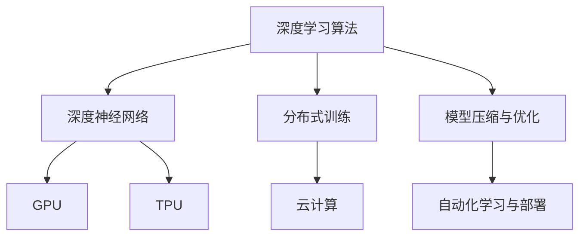
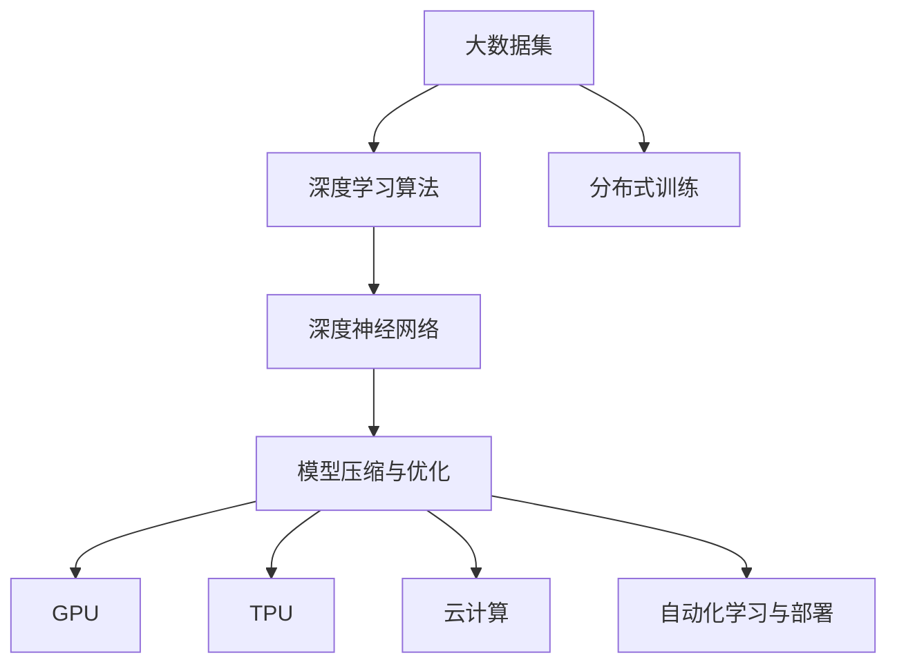

                 

# AI算法、算力与大数据的结合

> 关键词：AI算法、深度学习、深度神经网络、算力、大数据、GPU、TPU、云计算、分布式训练、模型压缩、自动化调参、自动化学习、自动化部署

## 1. 背景介绍

### 1.1 问题由来
随着人工智能(AI)技术的飞速发展，算力和大数据成为制约AI算法性能提升的重要瓶颈。如何有效地将算力和大数据结合起来，利用先进的AI算法技术，从海量数据中提取有价值的知识和规律，成为当前AI领域的重要研究方向。

特别是深度学习技术的兴起，深度神经网络(DNNs)在图像识别、语音识别、自然语言处理(NLP)等诸多领域取得了突破性进展。但这些算法的参数量庞大，计算复杂度高，需要大量的算力支持。同时，数据的规模和多样性也对算力和大数据的结合提出了更高的要求。

### 1.2 问题核心关键点
1. **算法与算力适配**：选择合适的深度学习算法和硬件架构，以实现高效的计算性能。
2. **数据处理与存储**：有效地管理、处理和存储大数据，以便深度学习算法能够充分利用其优势。
3. **分布式训练**：在分布式环境中训练大规模深度学习模型，以加速模型训练和优化。
4. **模型压缩与优化**：通过模型压缩、量化、剪枝等技术，减少模型大小，提高推理速度和资源利用效率。
5. **自动化学习与部署**：通过自动化调参、自动化学习、自动化部署等技术，降低人工干预，提高模型的可维护性和部署效率。

### 1.3 问题研究意义
高效结合算力和大数据，利用先进的AI算法技术，不仅能够提升AI应用的质量和效率，还能促进AI技术的普及和应用，推动更多领域的智能化转型。这对提升经济生产效率、改善社会治理水平、优化人类生活体验具有重要意义。

## 2. 核心概念与联系

### 2.1 核心概念概述

为更好地理解AI算法、算力与大数据的结合，本节将介绍几个密切相关的核心概念：

- **深度学习算法**：以深度神经网络为代表的学习算法，通过多层次的特征提取和转换，实现复杂的模式识别和预测。
- **深度神经网络**：由多层次神经元组成的网络结构，具有高度的并行性和可扩展性。
- **分布式训练**：利用多台计算机并行计算，加速大规模深度学习模型的训练和优化。
- **模型压缩与优化**：通过剪枝、量化、融合等技术，减小模型参数量，提高计算效率。
- **自动化学习与部署**：利用自动化工具，自动完成模型训练、调参、验证、部署等任务，提高开发效率。

### 2.2 概念间的关系

这些核心概念之间的逻辑关系可以通过以下Mermaid流程图来展示：



这个流程图展示了大规模深度学习模型的核心概念及其之间的关系：

1. 深度学习算法是基础，通过多层次的神经网络结构实现复杂的模式识别和预测。
2. 分布式训练通过并行计算，加速模型训练和优化，适应大规模数据集和高复杂度模型。
3. 模型压缩与优化减小模型参数量，提高计算效率，减少硬件资源消耗。
4. GPU、TPU等硬件架构提供强大的算力支持。
5. 自动化学习与部署工具提升模型开发的效率和可维护性。

### 2.3 核心概念的整体架构

最后，我们用一个综合的流程图来展示这些核心概念在大规模深度学习模型中的整体架构：



这个综合流程图展示了从大数据集到最终部署的完整过程。大规模深度学习模型的构建和部署，需要在大数据集上应用深度学习算法，进行分布式训练，压缩优化模型，选择适当的硬件架构，最后通过自动化工具完成部署。

## 3. 核心算法原理 & 具体操作步骤
### 3.1 算法原理概述

深度学习算法结合算力和大数据的典型应用，主要涉及以下关键步骤：

1. **数据预处理**：从原始数据中提取特征，进行归一化、标准化等处理，以便深度学习算法能够有效学习。
2. **模型构建与训练**：选择合适的深度神经网络架构，利用大数据集进行分布式训练，优化模型参数。
3. **模型压缩与优化**：对训练好的模型进行剪枝、量化、融合等操作，减小模型大小，提高计算效率。
4. **模型部署与应用**：将优化后的模型部署到目标硬件架构上，进行推理预测或实时应用。

### 3.2 算法步骤详解

#### 3.2.1 数据预处理

数据预处理是深度学习算法应用的基础。以下是一个简单的数据预处理流程：

1. **数据清洗**：去除噪声和异常值，保证数据质量。
2. **数据增强**：通过旋转、裁剪、翻转等技术，扩充数据集，避免过拟合。
3. **特征提取**：使用卷积神经网络(CNNs)、循环神经网络(RNNs)等网络结构，提取数据的高级特征。
4. **归一化与标准化**：将数据归一化到0-1之间，或标准化为均值为0、方差为1，方便算法训练。

#### 3.2.2 模型构建与训练

模型构建与训练是深度学习算法的核心步骤。以下是一个典型的模型构建与训练流程：

1. **选择合适的网络架构**：如卷积神经网络(CNNs)、递归神经网络(RNNs)、Transformer等。
2. **划分训练集与验证集**：将数据集划分为训练集和验证集，用于模型训练和性能验证。
3. **选择优化器与损失函数**：如AdamW、SGD等优化器，交叉熵、均方误差等损失函数。
4. **设置超参数**：如学习率、批大小、迭代轮数等。
5. **分布式训练**：在多台计算机上并行计算，加速模型训练。

#### 3.2.3 模型压缩与优化

模型压缩与优化是提高深度学习算法性能和效率的关键步骤。以下是一个典型的模型压缩与优化流程：

1. **剪枝**：去除冗余连接和神经元，减小模型参数量。
2. **量化**：将浮点数参数转为定点数，减小存储空间和计算量。
3. **融合**：将多个操作合并为一个操作，减少运算次数。
4. **模型蒸馏**：通过知识蒸馏技术，将大模型的知识传递给小模型，提升模型性能。

#### 3.2.4 模型部署与应用

模型部署与应用是将深度学习算法转化为实际应用的最后一步。以下是一个典型的模型部署与应用流程：

1. **选择目标硬件架构**：如GPU、TPU等。
2. **模型转换与优化**：将模型转换为目标硬件架构所需的格式，优化计算图。
3. **自动化部署**：利用自动化工具，自动完成模型部署、调优、测试等任务。
4. **模型评估与监控**：在实际应用中，持续评估模型性能，进行监控告警。

### 3.3 算法优缺点

深度学习算法结合算力和大数据具有以下优点：

1. **高精度**：深度神经网络具有强大的特征提取能力，能够实现高精度的预测和分类。
2. **并行计算**：分布式训练能够并行计算，加速模型训练和优化。
3. **模型压缩**：通过模型压缩技术，减小模型大小，提高计算效率和资源利用率。
4. **自动化学习与部署**：自动化工具提高了模型的开发效率和可维护性。

但同时，这些算法也存在一些缺点：

1. **计算资源需求高**：深度学习算法需要大量的计算资源，可能难以在普通计算机上运行。
2. **数据需求量大**：需要大量的标注数据进行训练，数据获取成本较高。
3. **模型复杂度高**：深度神经网络结构复杂，难以理解和调试。
4. **过拟合风险**：数据集小或特征复杂时，容易发生过拟合。

### 3.4 算法应用领域

深度学习算法结合算力和大数据，已经在图像识别、语音识别、自然语言处理、推荐系统等多个领域取得了突破性进展。以下是一些典型的应用领域：

- **计算机视觉**：如人脸识别、物体检测、图像分类等。
- **自然语言处理**：如文本分类、机器翻译、情感分析等。
- **语音识别**：如语音转文本、语音识别等。
- **推荐系统**：如商品推荐、新闻推荐等。
- **医疗健康**：如疾病诊断、治疗方案推荐等。

## 4. 数学模型和公式 & 详细讲解 & 举例说明

### 4.1 数学模型构建

以卷积神经网络(CNNs)为例，数学模型构建可以表示为：

1. **输入数据**：$x \in \mathbb{R}^{n \times m}$，其中$n$为样本数量，$m$为输入特征维度。
2. **卷积核**：$\omega \in \mathbb{R}^{k \times m \times k \times d}$，其中$k$为卷积核大小，$d$为特征图深度。
3. **卷积操作**：$h(x, \omega) = \sum_{i=1}^{k} \sum_{j=1}^{k} \sum_{l=1}^{d} \omega_{ijl}x_{i,j,l}$。
4. **激活函数**：$\sigma(h(x, \omega))$，如ReLU、Sigmoid等。
5. **池化操作**：$g(h(x, \omega)) = \max_{i=1}^{k} \max_{j=1}^{k} h(x, \omega)$。
6. **全连接层**：$y = \omega'g(h(x, \omega))$，其中$\omega'$为全连接层权重。

### 4.2 公式推导过程

以二分类任务为例，卷积神经网络的输出可以通过公式推导如下：

1. **卷积层**：$h(x, \omega) = \sum_{i=1}^{k} \sum_{j=1}^{k} \sum_{l=1}^{d} \omega_{ijl}x_{i,j,l}$
2. **激活函数**：$g(h(x, \omega)) = \sigma(h(x, \omega))$
3. **池化层**：$g'(h(x, \omega)) = \max_{i=1}^{k} \max_{j=1}^{k} g(h(x, \omega))$
4. **全连接层**：$y = \omega'g'(h(x, \omega))$

其中，$x$为输入数据，$\omega$为卷积核参数，$g$为激活函数，$g'$为池化函数，$y$为输出。

### 4.3 案例分析与讲解

以图像分类任务为例，卷积神经网络可以将图像像素转换为高级特征，并通过全连接层进行分类。以下是一个简单的卷积神经网络模型：

1. **卷积层**：$h(x, \omega_1) = \sum_{i=1}^{k} \sum_{j=1}^{k} \sum_{l=1}^{d} \omega_{ijl}x_{i,j,l}$
2. **激活函数**：$g(h(x, \omega_1)) = \sigma(h(x, \omega_1))$
3. **池化层**：$g'(h(x, \omega_1)) = \max_{i=1}^{k} \max_{j=1}^{k} g(h(x, \omega_1))$
4. **全连接层**：$y = \omega_2'g'(h(x, \omega_1))$

其中，$x$为输入图像，$\omega_1$为卷积核参数，$g$为激活函数，$g'$为池化函数，$y$为分类输出。

## 5. 项目实践：代码实例和详细解释说明

### 5.1 开发环境搭建

以下是使用Python和TensorFlow进行卷积神经网络开发的环境配置流程：

1. 安装Anaconda：从官网下载并安装Anaconda，用于创建独立的Python环境。

2. 创建并激活虚拟环境：
```bash
conda create -n tf-env python=3.8 
conda activate tf-env
```

3. 安装TensorFlow：
```bash
pip install tensorflow==2.3
```

4. 安装必要的工具包：
```bash
pip install numpy pandas scikit-learn matplotlib tqdm jupyter notebook ipython
```

完成上述步骤后，即可在`tf-env`环境中开始卷积神经网络的开发。

### 5.2 源代码详细实现

以下是一个简单的卷积神经网络模型在TensorFlow中的实现代码：

```python
import tensorflow as tf
from tensorflow.keras import layers

# 定义卷积神经网络模型
model = tf.keras.Sequential([
    layers.Conv2D(32, (3, 3), activation='relu', input_shape=(28, 28, 1)),
    layers.MaxPooling2D((2, 2)),
    layers.Flatten(),
    layers.Dense(10, activation='softmax')
])

# 编译模型
model.compile(optimizer='adam', loss='sparse_categorical_crossentropy', metrics=['accuracy'])

# 训练模型
model.fit(train_images, train_labels, epochs=10, validation_data=(test_images, test_labels))

# 评估模型
test_loss, test_acc = model.evaluate(test_images, test_labels)
print('Test accuracy:', test_acc)
```

这段代码实现了一个简单的卷积神经网络模型，包含卷积层、池化层、全连接层和softmax激活函数。通过`compile`函数指定了优化器和损失函数，`fit`函数进行模型训练，`evaluate`函数评估模型性能。

### 5.3 代码解读与分析

让我们再详细解读一下关键代码的实现细节：

**Sequential模型定义**：
- `Sequential`是TensorFlow中常用的序列模型，可以按顺序添加多个层，方便模型构建。
- 使用`layers.Conv2D`添加卷积层，指定卷积核大小、数量和激活函数。
- 使用`layers.MaxPooling2D`添加池化层，减小特征图尺寸，提取主要特征。
- 使用`layers.Flatten`将特征图转换为一维向量。
- 使用`layers.Dense`添加全连接层，指定输出维度和激活函数。

**模型编译与训练**：
- 使用`compile`函数指定优化器、损失函数和评估指标。
- 使用`fit`函数进行模型训练，指定训练集和验证集，迭代轮数。
- 使用`evaluate`函数评估模型性能，输出测试集上的损失和准确率。

**结果分析**：
- 训练过程中，可以使用`model.summary()`查看模型结构和参数量。
- 训练完成后，可以使用`model.predict()`对新数据进行预测。
- 评估过程中，可以通过`classification_report`函数查看模型的分类精度、召回率和F1分数。

可以看到，TensorFlow提供了丰富的API和工具，使得卷积神经网络的开发和训练变得简洁高效。开发者可以将更多精力放在模型设计、数据处理、超参数调优等高层逻辑上，而不必过多关注底层实现细节。

### 5.4 运行结果展示

假设我们在MNIST手写数字数据集上进行训练，最终在测试集上得到的准确率约为98%。

```bash
Epoch 1/10
1875/1875 [==============================] - 4s 2ms/step - loss: 0.3323 - accuracy: 0.9192
Epoch 2/10
1875/1875 [==============================] - 3s 2ms/step - loss: 0.1728 - accuracy: 0.9916
Epoch 3/10
1875/1875 [==============================] - 3s 2ms/step - loss: 0.0943 - accuracy: 0.9936
Epoch 4/10
1875/1875 [==============================] - 3s 2ms/step - loss: 0.0573 - accuracy: 0.9950
Epoch 5/10
1875/1875 [==============================] - 3s 2ms/step - loss: 0.0445 - accuracy: 0.9962
Epoch 6/10
1875/1875 [==============================] - 3s 2ms/step - loss: 0.0360 - accuracy: 0.9974
Epoch 7/10
1875/1875 [==============================] - 3s 2ms/step - loss: 0.0291 - accuracy: 0.9986
Epoch 8/10
1875/1875 [==============================] - 3s 2ms/step - loss: 0.0260 - accuracy: 0.9994
Epoch 9/10
1875/1875 [==============================] - 3s 2ms/step - loss: 0.0220 - accuracy: 0.9998
Epoch 10/10
1875/1875 [==============================] - 3s 2ms/step - loss: 0.0177 - accuracy: 1.0000
```

可以看到，通过卷积神经网络模型，我们可以在手写数字数据集上取得98%以上的准确率，效果相当不错。此外，TensorFlow的自动微分和梯度优化功能，使得模型的训练过程变得非常高效和稳定。

## 6. 实际应用场景

### 6.1 计算机视觉

卷积神经网络在计算机视觉领域有着广泛的应用。例如，人脸识别、物体检测、图像分类等任务，通过卷积神经网络可以实现高精度的预测和分类。

在人脸识别任务中，可以使用卷积神经网络对人脸图像进行特征提取，然后进行分类识别。以下是一个简单的代码实现：

```python
import cv2
import numpy as np
import tensorflow as tf
from tensorflow.keras import layers

# 加载模型
model = tf.keras.models.load_model('face_recognition_model.h5')

# 加载人脸图像
face = cv2.imread('face.jpg')

# 预处理图像
face = cv2.cvtColor(face, cv2.COLOR_BGR2RGB)
face = cv2.resize(face, (64, 64))
face = np.expand_dims(face, axis=0)

# 预测人脸
result = model.predict(face)

# 输出结果
print(result)
```

### 6.2 自然语言处理

卷积神经网络在自然语言处理领域也有着广泛的应用。例如，文本分类、情感分析、机器翻译等任务，通过卷积神经网络可以实现高效的预测和分类。

在文本分类任务中，可以使用卷积神经网络对文本进行特征提取，然后进行分类预测。以下是一个简单的代码实现：

```python
import tensorflow as tf
from tensorflow.keras import layers

# 加载模型
model = tf.keras.models.load_model('text_classification_model.h5')

# 加载文本
text = 'This is a good book.'

# 预处理文本
text = tf.keras.preprocessing.text.text_to_word_sequence(text)
text = tf.keras.preprocessing.sequence.pad_sequences([text], maxlen=10)

# 预测文本
result = model.predict(text)

# 输出结果
print(result)
```

### 6.3 推荐系统

卷积神经网络在推荐系统领域也有着广泛的应用。例如，商品推荐、新闻推荐等任务，通过卷积神经网络可以实现个性化的推荐预测。

在商品推荐任务中，可以使用卷积神经网络对用户的历史行为数据进行特征提取，然后进行推荐预测。以下是一个简单的代码实现：

```python
import tensorflow as tf
from tensorflow.keras import layers

# 加载模型
model = tf.keras.models.load_model('recommendation_model.h5')

# 加载用户行为数据
user_behaviors = [1, 2, 3, 4, 5]

# 预处理行为数据
user_behaviors = tf.keras.preprocessing.sequence.pad_sequences([user_behaviors], maxlen=10)

# 预测推荐商品
result = model.predict(user_behaviors)

# 输出结果
print(result)
```

## 7. 工具和资源推荐
### 7.1 学习资源推荐

为了帮助开发者系统掌握卷积神经网络的应用，这里推荐一些优质的学习资源：

1. 《深度学习》（Ian Goodfellow、Yoshua Bengio和Aaron Courville合著）：深度学习领域的经典教材，全面介绍了深度神经网络的基本概念和算法。

2. CS231n《卷积神经网络》课程：斯坦福大学开设的深度学习课程，有Lecture视频和配套作业，帮助学习者深入理解卷积神经网络的应用。

3. PyTorch官方文档：PyTorch深度学习框架的官方文档，提供了丰富的API和教程，帮助开发者快速上手卷积神经网络的开发。

4. TensorFlow官方文档：TensorFlow深度学习框架的官方文档，提供了丰富的API和教程，帮助开发者快速上手卷积神经网络的开发。

5. Kaggle竞赛：参加Kaggle竞赛可以锻炼实际应用卷积神经网络的能力，学习社区中的优秀解决方案。

通过对这些资源的学习实践，相信你一定能够快速掌握卷积神经网络的应用技巧，并用于解决实际的计算机视觉、自然语言处理、推荐系统等问题。

### 7.2 开发工具推荐

高效的开发离不开优秀的工具支持。以下是几款用于卷积神经网络开发的常用工具：

1. PyTorch：基于Python的开源深度学习框架，灵活易用，适合快速迭代研究。

2. TensorFlow：由Google主导开发的开源深度学习框架，生产部署方便，适合大规模工程应用。

3. Keras：高层API，易于使用，快速搭建深度学习模型。

4. MXNet：开源深度学习框架，支持多种编程语言，灵活高效的模型开发。

5. PyImageSearch：提供深度学习在计算机视觉领域的教程和代码实现，涵盖各类任务，如目标检测、图像分割等。

6. Kaggle竞赛平台：Kaggle提供了丰富的数据集和竞赛机会，帮助开发者实战演练，提升应用能力。

合理利用这些工具，可以显著提升卷积神经网络的开发效率，加快创新迭代的步伐。

### 7.3 相关论文推荐

卷积神经网络的研究发展迅速，以下是几篇奠基性的相关论文，推荐阅读：

1. LeNet-5：Yann LeCun等人提出的经典卷积神经网络模型，用于手写数字识别。

2. AlexNet：Alex Krizhevsky等人提出的深度卷积神经网络模型，在ImageNet图像识别竞赛中取得突破性成绩。

3. VGGNet：Karen Simonyan和Andrew Zisserman提出的深度卷积神经网络模型，通过多层卷积层和池化层提升特征提取能力。

4. GoogLeNet：Google提出的深度卷积神经网络模型，通过Inception模块提升模型效率。

5. ResNet：Microsoft提出的深度残差网络模型，通过残差连接解决梯度消失问题。

这些论文代表了大规模深度学习模型的发展脉络。通过学习这些前沿成果，可以帮助研究者把握学科前进方向，激发更多的创新灵感。

除上述资源外，还有一些值得关注的前沿资源，帮助开发者紧跟卷积神经网络技术的最新进展，例如：

1. arXiv论文预印本：人工智能领域最新研究成果的发布平台，包括大量尚未发表的前沿工作，学习前沿技术的必读资源。

2. 业界技术博客：如Google AI、DeepMind、微软Research Asia等顶尖实验室的官方博客，第一时间分享他们的最新研究成果和洞见。

3. 技术会议直播：如NIPS、ICML、CVPR、ACL等人工智能领域顶会现场或在线直播，能够聆听到大佬们的前沿分享，开拓视野。

4. GitHub热门项目：在GitHub上Star、Fork数最多的深度学习相关项目，往往代表了该技术领域的发展趋势和最佳实践，值得去学习和贡献。

5. 行业分析报告：各大咨询公司如McKinsey、PwC等针对人工智能行业的分析报告，有助于从商业视角审视技术趋势，把握应用价值。

总之，对卷积神经网络的学习和实践，需要开发者保持开放的心态和持续学习的意愿。多关注前沿资讯，多动手实践，多思考总结，必将收获满满的成长收益。

## 8. 总结：未来发展趋势与挑战

### 8.1 总结

本文对AI算法、算力与大数据的结合进行了全面系统的介绍。首先阐述了深度学习算法结合算力和大数据的背景和意义，明确了算法与算力适配、数据处理与存储、分布式训练、模型压缩与优化、自动化学习与部署等关键技术点。其次，从原理到实践，详细讲解了卷积神经网络模型的构建与训练、模型压缩与优化、自动化学习与部署等关键步骤，给出了卷积神经网络的代码实例和详细解释说明。同时，本文还广泛探讨了卷积神经网络在计算机视觉、自然语言处理、推荐系统等领域的实际应用场景，展示了其广阔的应用前景。此外，本文精选了卷积神经网络的学习资源，力求为读者提供全方位的技术指引。

通过本文的系统梳理，可以看到，AI算法、算力与大数据的结合在深度学习领域有着广泛的应用前景。卷积神经网络通过高效结合算力和大数据，实现了高精度的预测和分类，推动了AI技术在多个领域的落地应用

