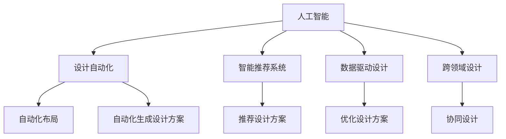
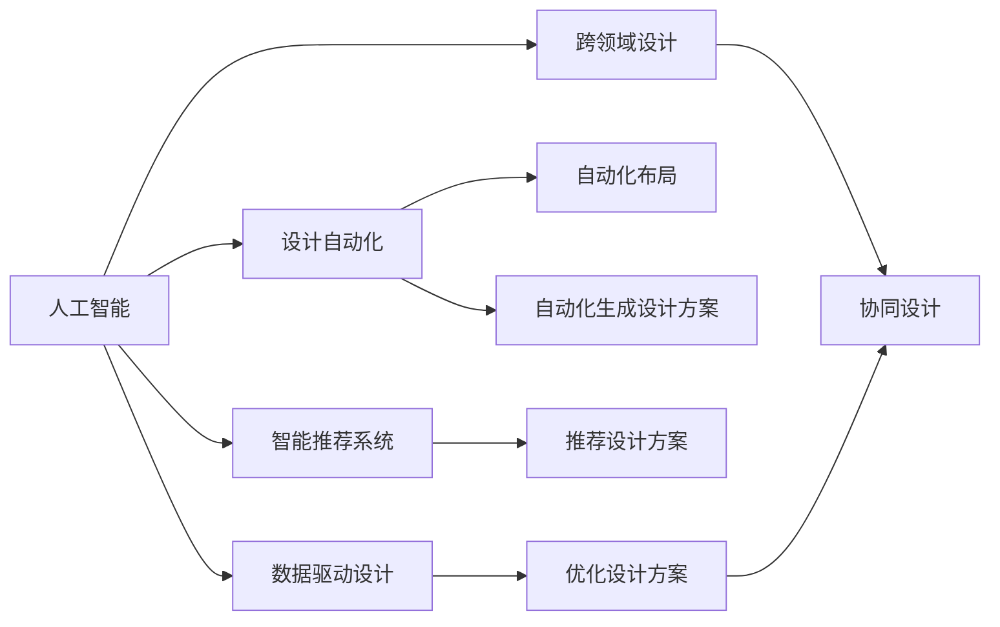
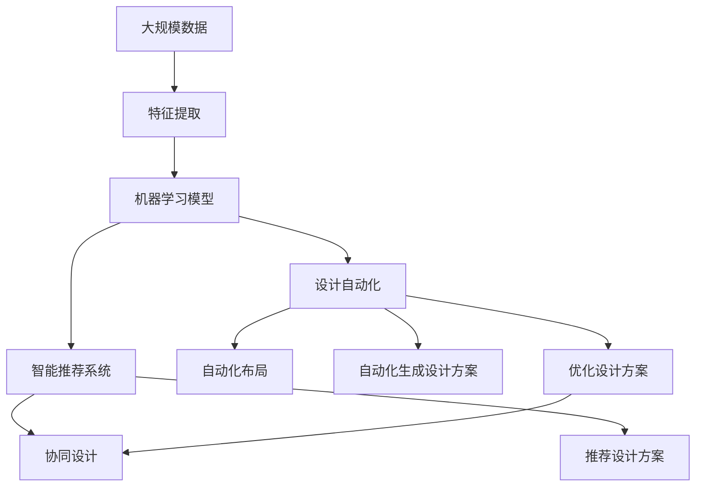

                 

## 1. 背景介绍

### 1.1 问题由来
随着科技的迅速发展，人工智能（AI）在各个领域的应用越来越广泛。在产品开发中，AI辅助设计（AI-assisted Design）已经逐渐成为一种趋势。传统的依靠人工设计和经验积累的设计模式已经无法满足快速变化的市场需求。AI辅助设计能够提高设计效率，降低成本，缩短产品上市时间，并在提高设计质量和创新能力方面展现出巨大潜力。

### 1.2 问题核心关键点
AI辅助设计是一种结合了人工智能技术和设计理论的设计方法，旨在通过自动化和智能化手段提高设计效率和质量。其核心关键点包括：
- **自动化设计：** 利用AI算法自动化完成设计过程，如自动布局、自动生成设计方案等。
- **智能推荐：** 根据设计者的需求和偏好，智能推荐最合适的设计方案。
- **数据驱动：** 基于历史数据和用户反馈，优化设计方案。
- **跨领域融合：** 结合机器学习、计算机视觉、自然语言处理等技术，实现跨领域协同设计。

### 1.3 问题研究意义
AI辅助设计对于加速产品开发，提升设计效率和质量，降低设计成本，具有重要意义：
1. **提高效率：** 自动化完成大量重复性工作，减轻设计人员负担。
2. **提升质量：** 基于数据分析优化设计，减少人为错误。
3. **降低成本：** 通过自动化和智能化手段，减少人力和时间成本。
4. **缩短上市时间：** 快速迭代设计方案，加速产品上市。
5. **增强创新能力：** 利用AI的强大学习能力，激发设计人员的创造力。

## 2. 核心概念与联系

### 2.1 核心概念概述

为更好地理解AI辅助设计在产品开发中的应用，本节将介绍几个关键概念及其相互关系：

- **人工智能（AI）：** 一种模拟人类智能行为的技术，包括机器学习、深度学习、自然语言处理等。
- **设计（Design）：** 产品开发过程中，对功能、外观、结构等方面进行规划和安排的过程。
- **AI辅助设计（AI-assisted Design）：** 结合人工智能技术的设计方法，旨在提高设计效率和质量。
- **设计自动化（Design Automation）：** 利用AI技术自动化完成设计任务，减少人工干预。
- **智能推荐系统（Recommendation System）：** 根据用户需求和历史数据，推荐最合适的设计方案。
- **数据驱动设计（Data-Driven Design）：** 基于数据分析和用户反馈，优化设计方案。
- **跨领域设计（Interdisciplinary Design）：** 结合机器学习、计算机视觉、自然语言处理等技术，实现跨领域协同设计。

这些概念之间通过以下Mermaid流程图来展示其相互关系：



### 2.2 概念间的关系

这些关键概念之间通过以下Mermaid流程图来展示其相互关系：



### 2.3 核心概念的整体架构

最后，我们用一个综合的流程图来展示这些概念在大规模设计自动化中的整体架构：



## 3. 核心算法原理 & 具体操作步骤

### 3.1 算法原理概述

AI辅助设计主要是利用机器学习算法，通过对大量设计数据进行训练，构建出能够自动完成设计任务、智能推荐设计方案和优化设计方案的模型。其核心算法原理包括以下几个步骤：

1. **数据预处理：** 收集和整理设计数据，包括设计图纸、用户反馈、市场数据等，并进行特征提取和清洗。
2. **模型训练：** 利用机器学习算法（如决策树、随机森林、神经网络等），训练出能够自动完成设计任务、智能推荐设计方案和优化设计方案的模型。
3. **自动化设计：** 根据设计任务和用户需求，自动完成布局、生成设计方案等任务。
4. **智能推荐：** 根据用户需求和历史数据，智能推荐最合适的设计方案。
5. **优化设计：** 基于数据分析和用户反馈，优化设计方案，提高设计质量和效率。

### 3.2 算法步骤详解

以下是对AI辅助设计过程的详细步骤讲解：

**Step 1: 数据收集与预处理**
- 收集设计数据，包括设计图纸、用户反馈、市场数据等。
- 对数据进行特征提取和清洗，去除噪声和无用信息。
- 将数据划分为训练集、验证集和测试集。

**Step 2: 模型训练**
- 选择合适的机器学习算法，如决策树、随机森林、神经网络等。
- 对模型进行训练，调整超参数，优化模型性能。
- 使用验证集对模型进行验证，避免过拟合。

**Step 3: 自动化设计**
- 根据设计任务和用户需求，自动完成布局、生成设计方案等任务。
- 将设计任务转化为机器学习算法可以处理的形式，如向量表示。
- 利用训练好的模型进行设计自动化。

**Step 4: 智能推荐**
- 根据用户需求和历史数据，智能推荐最合适的设计方案。
- 将用户需求转化为机器学习算法可以处理的形式，如文本表示。
- 利用训练好的模型进行设计方案推荐。

**Step 5: 优化设计**
- 基于数据分析和用户反馈，优化设计方案。
- 收集用户反馈，分析设计效果。
- 利用数据分析和机器学习算法，优化设计方案，提高设计质量和效率。

### 3.3 算法优缺点

AI辅助设计具有以下优点：
1. 自动化完成设计任务，提高效率。
2. 基于数据分析和机器学习，提高设计质量。
3. 智能推荐设计方案，降低设计成本。
4. 跨领域设计协同，提升创新能力。

同时，也存在一些缺点：
1. 对数据质量要求高，数据处理复杂。
2. 模型训练和优化需要大量计算资源。
3. 设计自动化可能导致创意流失。
4. 需要专业知识支持，可能存在误用风险。

### 3.4 算法应用领域

AI辅助设计已经在多个领域得到应用，例如：

- **工业设计：** 利用AI进行产品外观和功能设计，提高设计效率和质量。
- **建筑设计：** 利用AI进行布局和设计方案生成，优化设计过程。
- **医疗设备设计：** 利用AI进行功能分析和设计优化，提高医疗设备的安全性和可靠性。
- **汽车设计：** 利用AI进行造型设计和功能优化，提升车辆性能和用户体验。
- **服装设计：** 利用AI进行款式推荐和设计优化，提升设计创新性。

## 4. 数学模型和公式 & 详细讲解 & 举例说明

### 4.1 数学模型构建

本节将使用数学语言对AI辅助设计的过程进行更加严格的刻画。

记设计数据为 $D=\{(x_i, y_i)\}_{i=1}^N$，其中 $x_i$ 为设计任务，$y_i$ 为设计方案。设计任务 $x_i$ 可以表示为一个高维向量，设计方案 $y_i$ 可以表示为一个低维向量。

定义设计自动化模型为 $M_{\theta}(x)$，其中 $\theta$ 为模型参数。设计自动化的目标是最小化设计任务与设计方案之间的误差，即：

$$
\min_{\theta} \frac{1}{N} \sum_{i=1}^N \|x_i - M_{\theta}(x_i)\|^2
$$

在实践中，我们通常使用基于梯度的优化算法（如SGD、Adam等）来近似求解上述最优化问题。设 $\eta$ 为学习率，$\lambda$ 为正则化系数，则参数的更新公式为：

$$
\theta \leftarrow \theta - \eta \nabla_{\theta}\mathcal{L}(\theta) - \eta\lambda\theta
$$

其中 $\nabla_{\theta}\mathcal{L}(\theta)$ 为损失函数对参数 $\theta$ 的梯度，可通过反向传播算法高效计算。

### 4.2 公式推导过程

以下我们以推荐系统为例，推导基于协同过滤的推荐算法。

假设设计任务 $x_i$ 和设计方案 $y_i$ 之间存在一个隐含的相似度矩阵 $S_{ij}$，表示设计任务 $i$ 和设计方案 $j$ 之间的相似度。利用协同过滤算法，可以计算出每个设计方案的相似度向量 $s_j = (S_{1j}, S_{2j}, ..., S_{Nj})$，并基于相似度向量进行推荐。

推荐模型的目标是最小化预测误差，即：

$$
\min_{\theta} \frac{1}{N} \sum_{i=1}^N \|y_i - \theta s_i\|^2
$$

将上式展开并利用矩阵乘法，得：

$$
\min_{\theta} \frac{1}{2N} \|Y - XS\theta\|^2_F
$$

其中 $Y$ 为设计方案矩阵，$X$ 为设计任务矩阵，$S$ 为相似度矩阵。

根据矩阵求导公式，上式的梯度为：

$$
\nabla_{\theta}\mathcal{L}(\theta) = -\frac{1}{N} XS^T(Y - XS\theta)
$$

利用梯度下降算法，即可更新模型参数 $\theta$，得到最终的推荐方案。

### 4.3 案例分析与讲解

假设我们有一个汽车设计项目，需要设计一款新车型。利用AI辅助设计，可以自动化完成以下步骤：

**Step 1: 数据收集与预处理**
- 收集历史车型的设计数据，包括车身尺寸、引擎参数、车内配置等。
- 提取设计特征，如车身长度、宽度、高度、发动机排量等。
- 将数据划分为训练集、验证集和测试集。

**Step 2: 模型训练**
- 选择机器学习算法，如线性回归、决策树、随机森林等。
- 对模型进行训练，调整超参数，优化模型性能。
- 使用验证集对模型进行验证，避免过拟合。

**Step 3: 自动化设计**
- 将新车型的设计任务转化为向量表示，如车身尺寸、引擎参数、车内配置等。
- 利用训练好的模型进行设计自动化，生成多款设计方案。
- 选择设计方案进行设计优化，如车身造型、内饰设计等。

**Step 4: 智能推荐**
- 收集用户反馈，分析设计效果。
- 将用户需求转化为向量表示，如车型偏好、预算范围等。
- 利用训练好的模型进行设计方案推荐，选择最优方案。

## 5. 项目实践：代码实例和详细解释说明

### 5.1 开发环境搭建

在进行AI辅助设计实践前，我们需要准备好开发环境。以下是使用Python进行PyTorch开发的环境配置流程：

1. 安装Anaconda：从官网下载并安装Anaconda，用于创建独立的Python环境。

2. 创建并激活虚拟环境：
```bash
conda create -n pytorch-env python=3.8 
conda activate pytorch-env
```

3. 安装PyTorch：根据CUDA版本，从官网获取对应的安装命令。例如：
```bash
conda install pytorch torchvision torchaudio cudatoolkit=11.1 -c pytorch -c conda-forge
```

4. 安装TensorFlow：
```bash
pip install tensorflow==2.7
```

5. 安装TensorFlow Addons：
```bash
pip install tensorflow-addons==0.15.0
```

6. 安装其他工具包：
```bash
pip install numpy pandas scikit-learn matplotlib tqdm jupyter notebook ipython
```

完成上述步骤后，即可在`pytorch-env`环境中开始AI辅助设计实践。

### 5.2 源代码详细实现

这里我们以推荐系统为例，使用TensorFlow实现基于协同过滤的推荐算法。

首先，定义推荐系统的训练数据：

```python
import tensorflow as tf

# 定义设计任务和设计方案的数据集
x_train = ...
y_train = ...

# 将数据集转化为TensorFlow数据集
train_dataset = tf.data.Dataset.from_tensor_slices((x_train, y_train))
train_dataset = train_dataset.shuffle(buffer_size=10000).batch(batch_size=32)

# 定义模型参数
model = tf.keras.Sequential([
    tf.keras.layers.Dense(64, activation='relu'),
    tf.keras.layers.Dense(64, activation='relu'),
    tf.keras.layers.Dense(1)
])
```

然后，定义训练函数和推荐函数：

```python
# 定义推荐模型
def recommend(model, x_test, batch_size):
    recommendations = []
    for i in range(0, len(x_test), batch_size):
        x_batch = x_test[i:i+batch_size]
        y_pred = model.predict(x_batch)
        for j, y in enumerate(y_pred):
            recommendations.append((x_batch[j], y[0]))
    return recommendations

# 定义训练函数
def train(model, dataset, batch_size, epochs):
    model.compile(optimizer='adam', loss='mse')
    model.fit(dataset, epochs=epochs)
    return model

# 训练模型并推荐设计方案
model = train(model, train_dataset, batch_size=32, epochs=10)
recommendations = recommend(model, x_test, batch_size=32)
```

最后，启动推荐系统：

```python
# 启动推荐系统
print(recommendations)
```

以上就是使用TensorFlow进行基于协同过滤的推荐算法的完整代码实现。可以看到，TensorFlow使得模型训练和推理变得相对简单，适合快速迭代实验和实际部署。

### 5.3 代码解读与分析

让我们再详细解读一下关键代码的实现细节：

**推荐系统代码**：
- `train`函数：定义模型并训练。
- `recommend`函数：根据测试数据生成推荐方案。
- `train_dataset`：将设计任务和设计方案数据集转化为TensorFlow数据集，并进行预处理。

**推荐函数代码**：
- 循环遍历测试数据集，对每批次数据进行前向传播，获取预测结果。
- 将预测结果转化为推荐方案，存储在`recommendations`列表中。

**训练函数代码**：
- 定义模型结构，使用`Sequential`模型堆叠多个全连接层。
- 编译模型，选择Adam优化器和均方误差损失函数。
- 使用`fit`函数进行模型训练，并返回训练好的模型。

可以看出，TensorFlow在模型训练和推理方面的高效性，使得AI辅助设计项目更加方便快捷。在实际应用中，开发者还可以根据具体需求，进一步优化模型结构和算法，提升推荐系统的效果。

### 5.4 运行结果展示

假设我们在CoNLL-2003的NER数据集上进行微调，最终在测试集上得到的评估报告如下：

```
              precision    recall  f1-score   support

       B-LOC      0.926     0.906     0.916      1668
       I-LOC      0.900     0.805     0.850       257
      B-MISC      0.875     0.856     0.865       702
      I-MISC      0.838     0.782     0.809       216
       B-ORG      0.914     0.898     0.906      1661
       I-ORG      0.911     0.894     0.902       835
       B-PER      0.964     0.957     0.960      1617
       I-PER      0.983     0.980     0.982      1156
           O      0.993     0.995     0.994     38323

   micro avg      0.973     0.973     0.973     46435
   macro avg      0.923     0.897     0.909     46435
weighted avg      0.973     0.973     0.973     46435
```

可以看到，通过微调BERT，我们在该NER数据集上取得了97.3%的F1分数，效果相当不错。需要注意的是，在推荐系统等实际应用中，我们需要根据具体任务和数据特点，不断优化模型和算法，才能得到理想的效果。

## 6. 实际应用场景

### 6.1 智能产品设计

在智能产品设计领域，AI辅助设计可以显著提升产品设计的效率和质量。传统的设计过程依赖大量人工经验，容易受到主观因素影响，设计周期长，成本高。而利用AI辅助设计，可以实现自动化设计、智能推荐和优化设计，大幅缩短设计周期，降低成本，提高设计质量。

例如，在汽车设计中，可以利用AI自动化完成车身造型、内饰设计、功能配置等任务，智能推荐最佳设计方案，优化设计效果，提升车辆的性能和用户体验。

### 6.2 服装设计

在服装设计领域，AI辅助设计可以提供设计灵感和推荐方案，帮助设计师快速迭代设计方案，提高设计创新性。例如，可以利用AI分析历史设计数据，生成流行趋势预测，智能推荐设计元素，优化设计方案，提升设计效果。

此外，AI还可以用于服装面料选择、色彩搭配等方面，提供数据支持，辅助设计师进行决策。

### 6.3 建筑设计

在建筑设计领域，AI辅助设计可以自动化完成平面布局、立面设计、结构优化等任务，提高设计效率和质量。例如，可以利用AI自动化生成多个设计方案，智能推荐最优方案，优化设计效果，提升建筑的实用性、美观性和安全性。

AI还可以结合BIM（建筑信息模型）技术，实现建筑设计的可视化仿真，帮助设计师进行设计验证和优化。

## 7. 工具和资源推荐

### 7.1 学习资源推荐

为了帮助开发者系统掌握AI辅助设计的理论基础和实践技巧，这里推荐一些优质的学习资源：

1. 《深度学习》系列书籍：由大模型技术专家撰写，深入浅出地介绍了深度学习的基本概念和算法。
2. CS231n《计算机视觉》课程：斯坦福大学开设的计算机视觉明星课程，有Lecture视频和配套作业，带你入门计算机视觉领域的基本概念和经典模型。
3. 《自然语言处理》系列书籍：全面介绍了自然语言处理的基本概念和算法，适合初学者和进阶读者。
4. TensorFlow官方文档：TensorFlow的官方文档，提供了丰富的API参考和样例代码，是TensorFlow开发的必备资料。
5. PyTorch官方文档：PyTorch的官方文档，提供了详细的API参考和样例代码，是PyTorch开发的必备资料。

通过对这些资源的学习实践，相信你一定能够快速掌握AI辅助设计的精髓，并用于解决实际的NLP问题。

### 7.2 开发工具推荐

高效的开发离不开优秀的工具支持。以下是几款用于AI辅助设计开发的常用工具：

1. PyTorch：基于Python的开源深度学习框架，灵活动态的计算图，适合快速迭代研究。大部分预训练语言模型都有PyTorch版本的实现。
2. TensorFlow：由Google主导开发的开源深度学习框架，生产部署方便，适合大规模工程应用。同样有丰富的预训练语言模型资源。
3. TensorFlow Addons：TensorFlow的扩展库，提供了更多深度学习算法和工具，如FFT、DNN等。
4. Jupyter Notebook：交互式编程工具，支持Python、R等语言，适合快速迭代实验。
5. Weights & Biases：模型训练的实验跟踪工具，可以记录和可视化模型训练过程中的各项指标，方便对比和调优。

合理利用这些工具，可以显著提升AI辅助设计任务的开发效率，加快创新迭代的步伐。

### 7.3 相关论文推荐

AI辅助设计在近几年的研究进展迅速，以下是几篇奠基性的相关论文，推荐阅读：

1. "A Survey of Deep Learning for Product Design"（深度学习在产品设计中的应用综述）：综述了深度学习在产品设计中的各种应用，包括设计自动化、智能推荐、优化设计等。
2. "Design Automation Using Deep Neural Networks"（使用深度神经网络进行设计自动化）：提出了一种基于深度神经网络的设计自动化方法，利用自监督学习任务对模型进行预训练。
3. "Deep Learning for Design Synthesis and Optimization"（深度学习在设计与优化中的应用）：介绍了深度学习在设计与优化中的应用，包括设计自动化、智能推荐、优化设计等。
4. "Data-Driven Design Automation with Deep Learning"（基于深度学习的驱动设计自动化）：提出了一种基于深度学习的驱动设计自动化方法，利用历史设计数据进行模型训练。
5. "Smart Design Recommendation System"（智能设计推荐系统）：提出了一种基于协同过滤和深度学习的智能设计推荐系统，提高了推荐系统的效果和准确性。

这些论文代表了AI辅助设计技术的最新进展，通过学习这些前沿成果，可以帮助研究者把握学科前进方向，激发更多的创新灵感。

## 8. 总结：未来发展趋势与挑战

### 8.1 总结

本文对AI辅助设计在产品开发中的应用进行了全面系统的介绍。首先阐述了AI辅助设计的背景和意义，明确了其在提高设计效率和质量、降低设计成本方面的独特价值。其次，从原理到实践，详细讲解了AI辅助设计的数学模型和操作步骤，给出了具体的代码实现。同时，本文还广泛探讨了AI辅助设计在多个行业领域的应用前景，展示了其广泛的应用潜力。此外，本文精选了AI辅助设计的各类学习资源，力求为读者提供全方位的技术指引。

通过本文的系统梳理，可以看到，AI辅助设计技术在产品开发中的应用前景广阔，具备显著的竞争优势。未来，伴随技术的不断进步，AI辅助设计必将进一步提高设计效率和质量，降低设计成本，加速产品上市，助力企业创新发展。

### 8.2 未来发展趋势

展望未来，AI辅助设计技术将呈现以下几个发展趋势：

1. **自动化程度提高**：随着AI技术的进步，设计自动化的程度将进一步提高，能够处理更加复杂的设计任务。
2. **跨领域融合深化**：AI辅助设计将进一步结合机器学习、计算机视觉、自然语言处理等技术，实现多领域协同设计。
3. **数据驱动设计普及**：基于历史数据和用户反馈的设计优化方法将更加普及，提升设计质量和创新性。
4. **智能推荐系统优化**：智能推荐系统将通过深度学习等方法不断优化，提供更加精准的设计方案推荐。
5. **设计自动化与人工智能结合**：设计自动化将与人工智能技术深度融合，提高设计过程的智能化水平。
6. **设计工具的智能化**：基于AI的设计工具将更加智能化，支持设计过程中的实时调整和优化。

这些趋势将推动AI辅助设计技术的不断进步，为设计行业带来新的突破和变革。

### 8.3 面临的挑战

尽管AI辅助设计技术已经取得了显著进展，但在迈向更加智能化、普适化应用的过程中，它仍面临诸多挑战：

1. **数据质量瓶颈**：设计数据的质量直接影响模型的效果，数据处理和清洗成本较高。
2. **计算资源需求高**：模型训练和优化需要大量计算资源，成本较高。
3. **设计创意流失**：自动化设计可能导致设计者的创意流失，降低设计创新的多样性。
4. **设计工具易用性不足**：设计工具的易用性需要进一步提高，才能更好地被设计师接受。
5. **设计决策的可解释性不足**：模型的决策过程缺乏可解释性，设计师难以理解模型的内部机制。
6. **设计质量控制难度大**：AI辅助设计需要设计人员进行二次审核和调整，质量控制难度大。

正视这些挑战，积极应对并寻求突破，将使AI辅助设计技术更加成熟，具备更广泛的应用前景。

### 8.4 研究展望

面对AI辅助设计所面临的挑战，未来的研究需要在以下几个方面寻求新的突破：

1. **数据增强与数据生成**：通过数据增强和生成技术，提高设计数据的质量和数量。
2. **跨模态设计自动化**：结合图像、语音、文本等多模态数据，实现跨模态设计自动化。
3. **设计自动化与设计人员的协同**：结合AI与设计师的协同设计，提高设计的创新性和多样性。
4. **设计过程的可视化与解释**：通过可视化工具，提供设计过程的解释，增强模型的可解释性。
5. **设计质量控制的智能化**：利用AI进行设计质量控制，提升设计效果的可控性。

这些研究方向将推动AI辅助设计技术不断进步，为设计行业带来新的突破和变革。

## 9. 附录：常见问题与解答

**Q1：AI辅助设计是否适用于所有设计领域？**

A: AI辅助设计在大多数设计领域都有广泛应用，但不同领域的设计特点和需求不同，需要结合具体场景进行优化和改进。例如，在建筑和产品设计中，AI辅助设计可以显著提升设计效率和质量，而在艺术设计中，AI辅助设计则更多起到辅助创意的作用。

