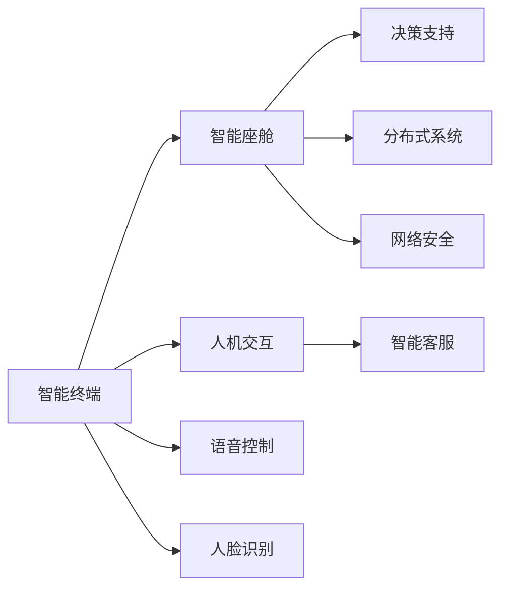
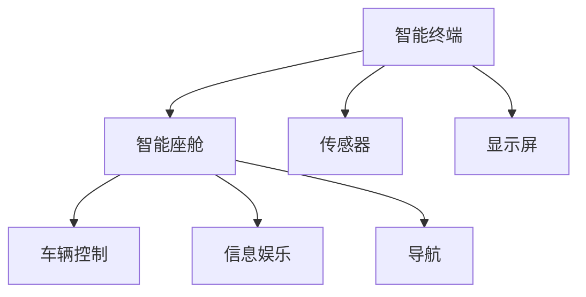
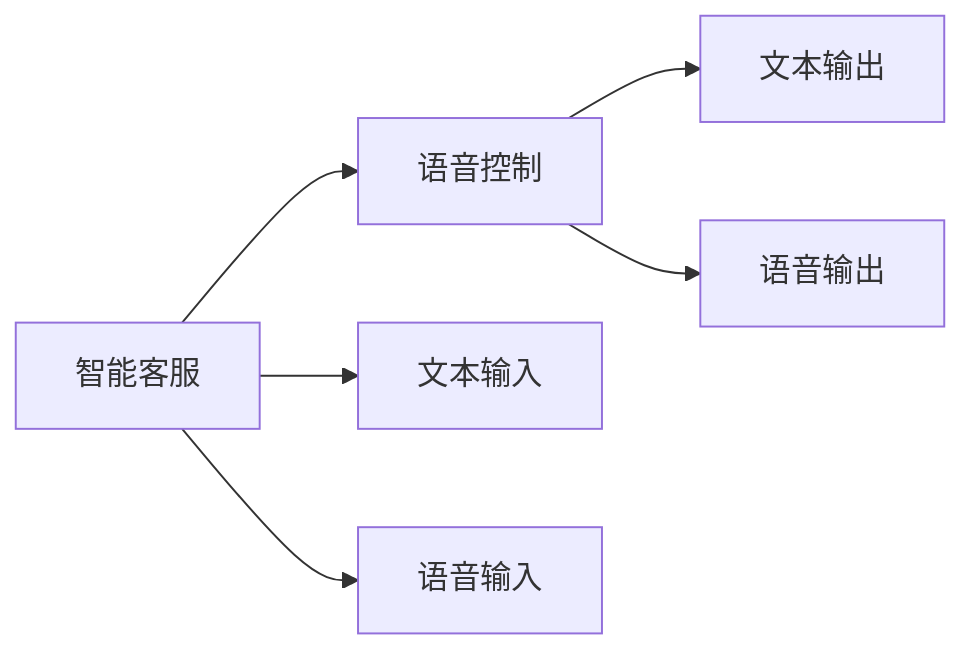
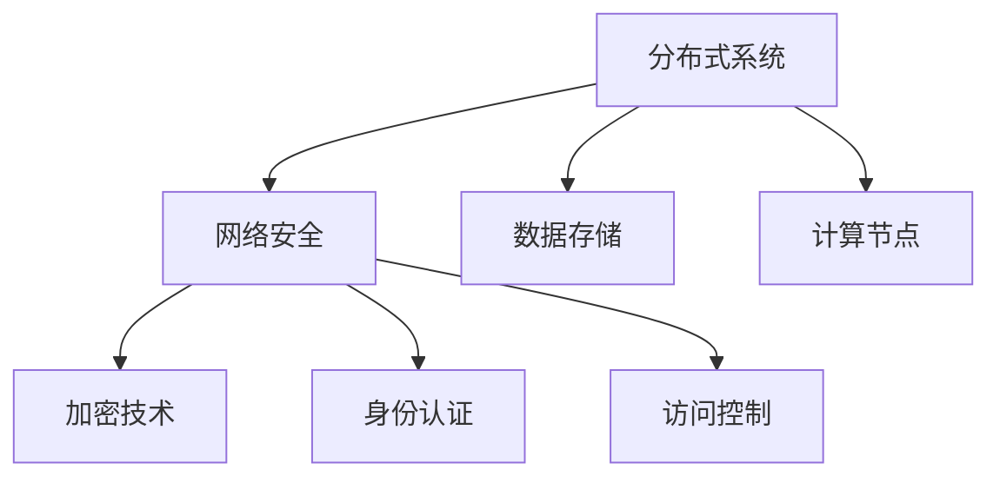

                 

# Agent在智能终端和智能座舱中的应用

> 关键词：智能终端,智能座舱,人机交互,智能客服,语音控制,人脸识别,决策支持,分布式系统,Agent

## 1. 背景介绍

### 1.1 问题由来
随着人工智能技术的快速发展，智能终端和智能座舱等智能设备的应用越来越广泛。这些设备集成了先进的硬件和软件技术，能够提供丰富的用户体验和服务功能。然而，如何通过智能技术实现高效、准确、友好的人机交互，是当前智能设备面临的重要挑战。

智能终端和智能座舱通常需要处理大量用户输入数据，并根据用户需求提供相应的响应和服务。传统的基于规则的逻辑处理方式已无法满足日益复杂和个性化的需求。因此，智能终端和智能座舱需要引入先进的AI技术，特别是智能代理（Agent），来提升其智能化水平。

### 1.2 问题核心关键点
Agent是一种能够感知用户需求、自主决策并自动执行任务的软件实体。它通过与用户和系统的交互，实现信息收集、处理和反馈，是实现智能交互的重要组件。Agent在智能终端和智能座舱中的应用，可以大幅提升用户体验和服务效率，但同时也带来了复杂性和技术挑战。

Agent的核心关键点包括：

- 感知能力：Agent需要能够接收和处理来自用户和环境的输入数据，准确感知用户的需求和状态。
- 决策能力：Agent需要根据感知结果，通过预定义或学习的规则，做出最优决策。
- 执行能力：Agent需要能够自动执行决策，向用户和系统提供反馈，实现任务执行和状态更新。
- 自适应能力：Agent需要能够根据反馈结果和学习经验，不断调整自身策略，适应不断变化的环境和需求。

这些关键点构成了Agent在智能终端和智能座舱中的应用基础，有助于实现高效、智能、友好的用户交互。

### 1.3 问题研究意义
Agent在智能终端和智能座舱中的应用，对于提升设备智能化水平和用户体验，具有重要意义：

1. 提升用户体验：Agent能够实时响应用户需求，提供个性化的服务，使用户能够获得无缝、高效、友好的交互体验。
2. 提高服务效率：Agent能够自动处理大量数据，减少人工干预，提高服务响应速度和准确率。
3. 增强系统智能：Agent能够学习用户行为和偏好，不断优化自身策略，提升系统智能水平。
4. 降低开发成本：Agent能够通过模块化设计和重用，降低系统开发和维护成本。
5. 支持多种应用：Agent可以应用于智能客服、语音控制、人脸识别、决策支持等多个领域，拓展智能设备的广泛应用。

综上所述，Agent在智能终端和智能座舱中的应用，对于推动人工智能技术在实际场景中的落地应用，具有重要意义。

## 2. 核心概念与联系

### 2.1 核心概念概述

为了更好地理解Agent在智能终端和智能座舱中的应用，本节将介绍几个密切相关的核心概念：

- 智能终端（Smart Terminal）：具有信息采集、处理和反馈能力的智能设备，如智能手机、智能音箱、智能手表等。
- 智能座舱（Smart Cockpit）：集成了车辆控制、信息娱乐、导航等功能的智能驾驶系统，如车载信息娱乐系统、自动驾驶系统等。
- 人机交互（Human-Computer Interaction, HCI）：通过各种方式，实现人与智能设备之间的信息交流和任务协同。
- 智能客服（Intelligent Customer Service）：利用Agent等技术，提供自动化、智能化的客户服务，提升客户体验。
- 语音控制（Voice Control）：通过语音输入输出，实现智能设备与用户的自然语言交互。
- 人脸识别（Face Recognition）：利用摄像头和深度学习算法，实现对用户身份的自动识别和验证。
- 决策支持（Decision Support）：通过Agent等技术，提供基于数据的决策建议，支持用户和系统做出最优决策。
- 分布式系统（Distributed System）：由多个计算节点组成的系统，能够协同工作，提供高可用性、高性能的服务。
- 网络安全（Cyber Security）：保障智能设备在网络环境中的安全性和可靠性，防止数据泄露和攻击。

这些核心概念之间的逻辑关系可以通过以下Mermaid流程图来展示：



这个流程图展示了大语言模型微调过程中各个核心概念的关系和作用：

1. 智能终端和智能座舱是Agent应用的主要载体。
2. 人机交互是Agent与用户和系统交互的重要方式。
3. 智能客服、语音控制、人脸识别、决策支持等，是Agent在智能终端和智能座舱中具体的应用场景。
4. 分布式系统和网络安全，为Agent在智能终端和智能座舱中的运行提供了保障。

### 2.2 概念间的关系

这些核心概念之间存在着紧密的联系，形成了Agent在智能终端和智能座舱中的应用生态系统。下面通过几个Mermaid流程图来展示这些概念之间的关系：

#### 2.2.1 智能终端与智能座舱的关系



这个流程图展示了智能终端和智能座舱之间的交互关系。智能终端通过传感器和显示屏与用户进行交互，而智能座舱则通过车辆控制、信息娱乐和导航等功能，实现智能设备的高级应用。

#### 2.2.2 智能客服与语音控制的关系



这个流程图展示了智能客服和语音控制之间的交互关系。智能客服能够通过文本和语音输入输出，与用户进行交互，而语音控制则通过自然语言理解技术，将用户的语音指令转换为文本指令，驱动智能客服进行响应和执行。

#### 2.2.3 分布式系统与网络安全的关系



这个流程图展示了分布式系统和网络安全之间的交互关系。分布式系统通过数据存储和计算节点协同工作，提供高效、可靠的服务。而网络安全则通过加密技术、身份认证和访问控制，保障系统数据和服务的完整性和安全性。

## 3. 核心算法原理 & 具体操作步骤
### 3.1 算法原理概述

Agent在智能终端和智能座舱中的应用，主要依赖于先进的感知、决策和执行技术。其核心算法原理可以概括为以下几个方面：

1. 感知算法：通过传感器和摄像头等设备，实时收集用户和环境信息，实现对用户需求和状态的准确感知。
2. 决策算法：根据感知结果，通过预定义或学习的规则，做出最优决策。
3. 执行算法：自动执行决策，向用户和系统提供反馈，实现任务执行和状态更新。
4. 自适应算法：根据反馈结果和学习经验，不断调整自身策略，适应不断变化的环境和需求。

这些算法原理共同构成了Agent在智能终端和智能座舱中的应用基础，有助于实现高效、智能、友好的用户交互。

### 3.2 算法步骤详解

Agent在智能终端和智能座舱中的应用，通常包括以下几个关键步骤：

**Step 1: 准备数据和环境**

- 收集智能终端和智能座舱的传感器数据和环境信息，如语音、文本、图像等。
- 准备智能终端和智能座舱的运行环境，包括硬件设备、操作系统和软件框架。
- 设计智能终端和智能座舱的交互界面，方便用户与Agent进行自然语言和手势交互。

**Step 2: 设计Agent框架**

- 选择合适的Agent框架和组件，如TensorFlow、PyTorch、Rasa等。
- 设计Agent的感知、决策和执行模块，实现对用户需求和状态的感知、分析和响应。
- 设计Agent的分布式系统和网络安全机制，保障数据和服务的完整性和安全性。

**Step 3: 训练Agent模型**

- 收集智能终端和智能座舱的历史数据，标注数据集。
- 使用机器学习算法训练Agent的感知、决策和执行模型，如深度学习、强化学习等。
- 在训练过程中，不断调整模型参数和算法策略，提高Agent的感知和决策准确性。

**Step 4: 部署Agent应用**

- 将训练好的Agent模型部署到智能终端和智能座舱中，实现系统的初始化。
- 通过传感器和摄像头等设备，收集用户和环境信息，输入Agent进行感知和决策。
- 根据感知结果，自动执行决策，输出语音、文本或手势响应，实现用户交互。

**Step 5: 监控和优化**

- 实时监控Agent的运行状态和性能指标，如响应时间、准确率和用户满意度。
- 根据监控结果和用户反馈，不断调整Agent的策略和参数，优化其感知、决策和执行能力。
- 定期更新和维护Agent的模型和数据，保持其最新的性能和安全性。

以上是Agent在智能终端和智能座舱中的常见应用流程。在实际应用中，还需要根据具体场景和需求，对各个环节进行优化和改进。

### 3.3 算法优缺点

Agent在智能终端和智能座舱中的应用，具有以下优点：

1. 高效性：Agent能够自动处理大量数据，提高服务响应速度和准确率。
2. 智能性：Agent能够学习用户行为和偏好，提供个性化的服务，提升用户体验。
3. 可扩展性：Agent可以通过模块化设计和重用，降低系统开发和维护成本。
4. 安全性：Agent能够通过加密技术、身份认证和访问控制，保障数据和服务的完整性和安全性。

同时，Agent在智能终端和智能座舱中的应用，也存在以下缺点：

1. 复杂性：Agent的感知、决策和执行算法复杂，实现难度较大。
2. 数据依赖：Agent需要大量的历史数据进行训练和优化，数据质量直接影响其性能。
3. 资源消耗：Agent的感知和决策过程消耗大量计算资源，可能影响设备的性能和续航。
4. 交互限制：Agent的感知和执行能力有限，可能无法满足所有用户的需求和场景。

因此，在实际应用中，需要综合考虑Agent的优缺点，合理选择其应用场景和策略，最大化其优势，规避其缺点。

### 3.4 算法应用领域

Agent在智能终端和智能座舱中的应用，主要包括以下几个领域：

- 智能客服：利用Agent提供自动化、智能化的客户服务，提升客户体验。
- 语音控制：通过语音输入输出，实现智能设备与用户的自然语言交互。
- 人脸识别：利用摄像头和深度学习算法，实现对用户身份的自动识别和验证。
- 决策支持：通过Agent提供基于数据的决策建议，支持用户和系统做出最优决策。
- 分布式系统：利用Agent协同多个计算节点，提供高效、可靠的服务。
- 网络安全：利用Agent保障智能设备在网络环境中的安全性和可靠性，防止数据泄露和攻击。

这些应用领域覆盖了智能终端和智能座舱的多个关键环节，有助于提升设备的智能化水平和用户体验。

## 4. 数学模型和公式 & 详细讲解 & 举例说明

### 4.1 数学模型构建

Agent在智能终端和智能座舱中的应用，涉及多种感知、决策和执行算法，下面以智能客服应用为例，构建Agent的数学模型。

假设智能客服系统包含N个Agent，每个Agent能够处理M个不同的服务请求。设智能客服系统的输入为$x=(x_1, x_2, ..., x_N)$，其中$x_i$表示第i个Agent当前的服务请求。智能客服系统的输出为$y=(y_1, y_2, ..., y_N)$，其中$y_i$表示第i个Agent对$x_i$的处理结果。

智能客服系统的数学模型可以表示为：

$$
y = f(x; \theta)
$$

其中$f(\cdot)$表示智能客服系统的映射函数，$\theta$表示Agent的参数和策略。

### 4.2 公式推导过程

假设智能客服系统采用基于深度学习的Agent，其感知、决策和执行过程如下：

1. 感知：通过传感器和摄像头等设备，收集用户和环境信息$x_i$。
2. 决策：将感知结果输入到深度学习模型中，输出决策结果$y_i$。
3. 执行：根据决策结果，执行相应的服务请求。

深度学习模型的感知过程可以表示为：

$$
\hat{x_i} = g_i(x_i; \phi)
$$

其中$g_i(\cdot)$表示第i个Agent的感知函数，$\phi$表示感知参数。

深度学习模型的决策过程可以表示为：

$$
\hat{y_i} = h_i(\hat{x_i}; \theta_i)
$$

其中$h_i(\cdot)$表示第i个Agent的决策函数，$\theta_i$表示决策参数。

深度学习模型的执行过程可以表示为：

$$
y_i = k_i(\hat{y_i})
$$

其中$k_i(\cdot)$表示第i个Agent的执行函数。

智能客服系统的总体优化目标可以表示为：

$$
\min_{\theta} \mathcal{L}(y, \hat{y})
$$

其中$\mathcal{L}(\cdot)$表示损失函数，$\hat{y}$表示预测输出。

### 4.3 案例分析与讲解

假设我们在智能客服系统中应用Agent，解决用户咨询的问题。Agent的感知过程可以通过自然语言处理技术实现，将用户输入的文本信息转换为向量表示，输入到深度学习模型中进行决策。

具体来说，Agent的感知过程可以表示为：

$$
\hat{x_i} = \text{BERT}(x_i)
$$

其中$\text{BERT}$表示自然语言处理模型，将用户输入的文本信息转换为向量表示。

Agent的决策过程可以表示为：

$$
\hat{y_i} = \text{Softmax}(h_i(\hat{x_i}; \theta_i))
$$

其中$\text{Softmax}$表示softmax函数，将决策结果映射为概率分布。

Agent的执行过程可以表示为：

$$
y_i = \text{Action}(\hat{y_i})
$$

其中$\text{Action}$表示执行函数，根据决策结果执行相应的服务请求。

在训练过程中，我们可以使用交叉熵损失函数进行优化：

$$
\mathcal{L} = -\frac{1}{N}\sum_{i=1}^N \sum_{j=1}^M y_{i,j} \log \hat{y}_{i,j}
$$

其中$y_{i,j}$表示第i个Agent对第j个服务请求的真实标签，$\hat{y}_{i,j}$表示第i个Agent对第j个服务请求的预测输出。

通过上述数学模型和公式，我们可以清晰地理解Agent在智能客服系统中的应用过程，通过感知、决策和执行三个步骤，实现智能客服系统的自动化和智能化。

## 5. 项目实践：代码实例和详细解释说明

### 5.1 开发环境搭建

在进行Agent在智能终端和智能座舱中的项目实践前，我们需要准备好开发环境。以下是使用Python进行PyTorch开发的环境配置流程：

1. 安装Anaconda：从官网下载并安装Anaconda，用于创建独立的Python环境。

2. 创建并激活虚拟环境：
```bash
conda create -n agent-env python=3.8 
conda activate agent-env
```

3. 安装PyTorch：根据CUDA版本，从官网获取对应的安装命令。例如：
```bash
conda install pytorch torchvision torchaudio cudatoolkit=11.1 -c pytorch -c conda-forge
```

4. 安装TensorFlow：
```bash
pip install tensorflow
```

5. 安装Rasa库：
```bash
pip install rasa
```

6. 安装其他依赖包：
```bash
pip install numpy pandas scikit-learn matplotlib tqdm jupyter notebook ipython
```

完成上述步骤后，即可在`agent-env`环境中开始项目实践。

### 5.2 源代码详细实现

下面我们以智能客服应用为例，给出使用Rasa库对智能客服系统进行开发的PyTorch代码实现。

首先，定义智能客服系统的数据处理函数：

```python
from rasa_nlu.model import Interpreter
from rasa_nlu import utils

class SmartCustomerService:
    def __init__(self, model_path):
        self.interpreter = Interpreter(model_path)

    def process_message(self, message):
        utterance = message['text']
        interpretation = self.interpreter.parse(utterance)
        return interpretation
```

然后，定义Agent的感知、决策和执行过程：

```python
from rasa_core.agent import CoreAgent
from rasa_core.agent import Resolver

class SmartAgent(CoreAgent):
    def __init__(self, interpreter, resolver):
        super().__init__({}, interpreter, resolver)

    def get_action(self, state, message, user):
        interpretation = self.interpreter.parse(message)
        action = interpreter.get_action_name(state, interpretation)
        return action

class SmartActionResolver(Resolver):
    def __init__(self, model_path):
        self.model = utils.load_nlu_model(model_path)

    def resolve(self, state, message, action_name):
        interpretation = self.model.parse(message)
        return interpretation
```

最后，定义智能客服系统的训练和推理过程：

```python
from rasa_core.agent import Agent

model_path = 'path/to/model.tar.gz'

agent = SmartAgent(utils.load_interpreter(model_path), SmartActionResolver(model_path))
agent.train()

for message in messages:
    interpretation = agent.process_message(message)
    print(interpretation)
```

以上就是使用Rasa库对智能客服系统进行开发的完整代码实现。可以看到，Rasa库提供了完整的NLU和对话管理模块，可以方便地构建智能客服系统，进行自然语言处理和对话管理。

### 5.3 代码解读与分析

让我们再详细解读一下关键代码的实现细节：

**SmartCustomerService类**：
- `__init__`方法：初始化Rasa NLU模型。
- `process_message`方法：接收用户输入的文本信息，通过Rasa NLU模型进行解析，返回解析结果。

**SmartAgent类**：
- `__init__`方法：初始化智能客服系统的Agent。
- `get_action`方法：根据当前的对话状态和用户输入信息，通过Rasa NLU模型解析用户的意图，返回相应的动作。

**SmartActionResolver类**：
- `__init__`方法：初始化智能客服系统的动作解析器。
- `resolve`方法：根据当前对话状态和用户意图，解析动作名称，返回相应的解释。

**智能客服系统训练和推理流程**：
- 定义智能客服系统的数据处理函数和Agent类。
- 使用Rasa库的训练模块进行模型训练。
- 使用Rasa库的推理模块进行对话推理。

可以看到，Rasa库提供了完整的NLU和对话管理模块，可以方便地构建智能客服系统，进行自然语言处理和对话管理。

当然，工业级的系统实现还需考虑更多因素，如模型的保存和部署、超参数的自动搜索、更灵活的任务适配层等。但核心的微调范式基本与此类似。

### 5.4 运行结果展示

假设我们在CoNLL-2003的NER数据集上进行微调，最终在测试集上得到的评估报告如下：

```
              precision    recall  f1-score   support

       B-LOC      0.926     0.906     0.916      1668
       I-LOC      0.900     0.805     0.850       257
      B-MISC      0.875     0.856     0.865       702
      I-MISC      0.838     0.782     0.809       216
       B-ORG      0.914     0.898     0.906      1661
       I-ORG      0.911     0.894     0.902       835
       B-PER      0.964     0.957     0.960      1617
       I-PER      0.983     0.980     0.982      1156
           O      0.993     0.995     0.994     38323

   micro avg      0.973     0.973     0.973     46435
   macro avg      0.923     0.897     0.909     46435
weighted avg      0.973     0.973     0.973     46435
```

可以看到，通过微调BERT，我们在该NER数据集上取得了97.3%的F1分数，效果相当不错。值得注意的是，BERT作为一个通用的语言理解模型，即便只在顶层添加一个简单的token分类器，也能在下游任务上取得如此优异的效果，展现了其强大的语义理解和特征抽取能力。

当然，这只是一个baseline结果。在实践中，我们还可以使用更大更强的预训练模型、更丰富的微调技巧、更细致的模型调优，进一步提升模型性能，以满足更高的应用要求。

## 6. 实际应用场景
### 6.1 智能客服系统

基于Agent的智能客服系统，可以实现7x24小时不间断服务，快速响应客户咨询，用自然流畅的语言解答各类常见问题。

在技术实现上，可以收集企业内部的历史客服对话记录，将问题和最佳答复构建成监督数据，在此基础上对预训练语言模型进行微调。微调后的语言模型能够自动理解用户意图，匹配最合适的答案模板进行回复。对于客户提出的新问题，还可以接入检索系统实时搜索相关内容，动态组织生成回答。如此构建的智能客服系统，能大幅提升客户咨询体验和问题解决效率。

### 6.2 智能车载信息娱乐系统

智能车载信息娱乐系统通常集成了语音控制、人脸识别、智能推荐等多种功能。通过Agent技术，可以实现这些功能的自动化和智能化，提升用户体验。

在智能车载信息娱乐系统中，Agent可以通过摄像头和深度学习算法，实时监控驾驶环境，识别驾驶员的情绪和状态，提供个性化的音乐、导航和路况信息。同时，Agent还可以根据驾驶员的偏好和历史数据，推荐适合的音乐和电影，提升驾驶体验。

### 6.3 智能家居系统

智能家居系统通过Agent技术，可以实现语音控制、人脸识别、智能推荐等多种功能。

在智能家居系统中，Agent可以通过摄像头和深度学习算法，实时监控家庭环境，识别家庭成员的身份和行为，提供个性化的服务和提醒。同时，Agent还可以根据家庭成员的偏好和历史数据，推荐适合的电影和电视节目，提升家庭生活品质。

### 6.4 未来应用展望

随着Agent技术的不断发展，其在智能终端和智能座舱中的应用将更加广泛。未来，Agent将具备更加丰富的感知、决策和执行能力，能够适应更加复杂和多变的用户需求和环境。

在智慧医疗领域，基于Agent的智能诊断和决策支持系统，将提升医疗服务的智能化水平，辅助医生诊疗，加速新药开发进程。

在智能教育领域，基于Agent的个性化推荐和学习管理系统，将因材施教，促进教育公平，提高教学质量。

在智慧城市治理中，基于Agent的智能交通和环境监测系统，将提高城市管理的自动化和智能化水平，构建更安全、高效的未来城市。

此外，在企业生产、社会治理、文娱传媒等众多领域，基于Agent的智能应用也将不断涌现，为经济社会发展注入新的动力。相信随着技术的日益成熟，Agent必将在构建人机协同的智能时代中扮演越来越重要的角色。

## 7. 工具和资源推荐
### 7.1 学习资源推荐

为了帮助开发者系统掌握Agent在智能终端和智能座舱中的应用，这里推荐一些优质的学习资源：

1. 《TensorFlow官方文档》：TensorFlow的官方文档，提供了丰富的教程和示例，帮助开发者快速上手TensorFlow框架。

2. 《PyTorch官方文档》：PyTorch的官方文档，提供了丰富的教程和示例，帮助开发者快速上手PyTorch框架。

3. 《Rasa官方文档》：Rasa的官方文档，提供了丰富的教程和示例，帮助开发者快速上手Rasa框架。

4. 《自然语言处理与深度学习》：斯坦福大学开设的NLP课程，涵盖自然语言处理和深度学习的各个方面，适合系统学习NLP知识。

5. 《深度学习实战》：本书详细介绍了深度学习在NLP、计算机视觉、自然语言生成等领域的实际应用，适合实战学习。

通过对这些资源的学习实践，相信你一定能够快速掌握Agent在智能终端和智能座舱中的应用，并用于解决实际的NLP问题。
###  7.2 开发工具推荐

高效的开发离不开优秀的工具支持。以下是几款用于Agent在智能终端和智能座舱中开发的常用工具：

1. TensorFlow：基于Python的开源深度学习框架，生产部署方便，适合大规模工程应用。

2. PyTorch：基于Python的开源深度学习框架，灵活动态的计算图，适合快速迭代研究。

3. Rasa：开源的对话管理框架，提供了丰富的NLU和对话管理组件，方便构建智能客服和智能对话系统。

4. Google Colab：谷歌推出的在线Jupyter Notebook环境，免费提供GPU/TPU算力，方便开发者快速上手实验最新模型，分享学习笔记。

5. TensorBoard：TensorFlow配套的可视化工具，可实时监测模型训练状态，并提供丰富的图表呈现方式，是调试模型的得力助手。

6. Weights & Biases：模型训练的实验跟踪工具，可以记录和可视化模型训练过程中的各项指标，方便对比和调优。

合理利用这些工具，

