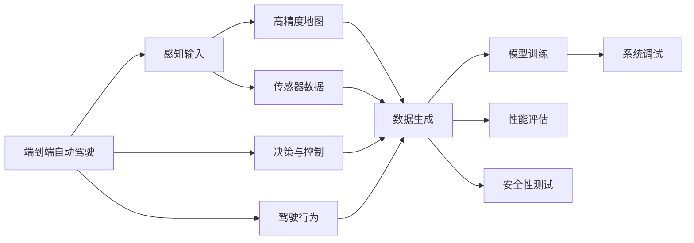

                 

# 端到端自动驾驶的演进与未来：仿真器在其中的角色

## 1. 背景介绍

随着自动驾驶技术的快速发展和进步，端到端自动驾驶方法逐渐成为研究的焦点。端到端方法通过深度学习模型直接学习输入到输出的映射，省略了传统的传感器融合、决策与控制过程，简化了系统架构，提高了模型的实时性和精度。端到端自动驾驶的实际落地应用，需要在大规模场景数据上进行训练，并借助各种仿真工具来辅助开发与测试。

### 1.1 端到端自动驾驶的发展

端到端自动驾驶方法自提出以来，经历了一系列的演进和发展，主要划分为两个阶段：单任务端到端和多任务端到端方法。

**单任务端到端方法**：最初的端到端方法主要专注于单项任务，如导航、路径规划、障碍物避让等。该方法主要利用传感器数据进行像素级别的决策，直接输出驾驶行为。其核心在于通过自监督学习，从高精度地图和视频中提取特征，并通过反向传播算法进行端到端训练。这种方法由于缺乏对环境的建模和理解，往往在复杂的场景下表现不佳。

**多任务端到端方法**：多任务端到端方法在单任务端到端方法的基础上，引入任务组合与迁移学习，通过多个任务的联合训练，提高模型的泛化能力和鲁棒性。该方法通常利用自动驾驶系统中的数据生成式场景模拟，训练模型从原始像素级数据中直接学习驾驶行为，并进行任务层面的联合训练，如在训练过程中同时进行路径规划和避障。这种端到端方法虽然提升了模型在实际驾驶场景中的适应性，但仍然依赖于高质量的驾驶数据和复杂的仿真器。

端到端方法的不断演进，使得自动驾驶系统的开发和测试变得更加高效和精确。然而，现实世界的驾驶数据往往受限于可用性和隐私保护，难以满足高精度训练的需求。在这种情况下，仿真器便成为了自动驾驶开发的重要辅助工具，特别是在端到端方法中，仿真器更是起到了至关重要的作用。

### 1.2 仿真器在端到端自动驾驶中的作用

仿真器可以模拟真实世界的驾驶环境，提供大规模、高精度的训练数据，同时还能灵活设置各种场景和规则，帮助开发者进行系统优化和调试。在端到端自动驾驶中，仿真器主要用于：

1. **数据生成**：模拟各种道路条件和交通场景，生成大量高质量的训练数据，供模型训练使用。
2. **性能评估**：通过仿真器可以设定特定的测试场景，验证模型在不同条件下的表现，并进行性能优化。
3. **安全性测试**：利用仿真器可以测试模型在极端情况下的表现，避免实际道路测试中的潜在风险。
4. **系统调试**：仿真器能够提供虚拟化的测试环境，便于开发者对系统进行逐步调试和优化。

## 2. 核心概念与联系

### 2.1 核心概念概述

本文将从以下几个核心概念入手，探讨仿真器在端到端自动驾驶中的应用：

- **端到端自动驾驶**：指直接从感知输入到驾驶行为输出的自动化驾驶方法，省略中间决策和控制过程。
- **仿真器**：模拟现实世界环境，生成高精度训练数据和测试场景，辅助自动驾驶系统的开发与测试。
- **多任务学习**：通过联合训练多个任务，提升模型在实际驾驶场景中的泛化能力和鲁棒性。
- **迁移学习**：利用预训练模型的知识，减少新任务的训练成本和数据需求。
- **高精度地图**：高精度地图提供了详细的道路信息，用于辅助模型理解环境和进行路径规划。

这些核心概念之间的联系通过以下Mermaid流程图展示：



这个流程图展示了端到端自动驾驶的流程，以及仿真器在其中各个环节的作用：从感知输入到驾驶行为输出，仿真器在数据生成、性能评估、安全性测试和系统调试等多个环节提供了重要支持。

### 2.2 概念间的关系

这些核心概念之间存在紧密的联系，共同构成了端到端自动驾驶系统的完整生态：

- **感知输入与高精度地图**：高精度地图提供了丰富的道路信息，辅助感知模型更好地理解环境。
- **传感器数据与仿真器**：仿真器可以生成高质量的模拟传感器数据，模拟真实世界的驾驶环境。
- **决策与控制与多任务学习**：多任务学习通过联合训练多个任务，提升模型在实际驾驶场景中的表现。
- **驾驶行为与迁移学习**：迁移学习利用预训练模型知识，减少新任务的训练成本和数据需求。

这些概念的协同作用，使得端到端自动驾驶在实际应用中能够更加高效和可靠。

## 3. 核心算法原理 & 具体操作步骤

### 3.1 算法原理概述

端到端自动驾驶中，模型通过传感器数据进行训练，直接输出驾驶行为，省略了中间决策和控制过程。基于仿真器的端到端方法，通常通过以下步骤实现：

1. **数据生成**：利用仿真器生成大规模、高精度的驾驶数据集。
2. **模型训练**：通过高精度地图和传感器数据，训练模型进行感知输入与驾驶行为映射。
3. **性能评估**：通过设定特定的测试场景，评估模型在不同条件下的表现。
4. **安全性测试**：利用仿真器测试模型在极端情况下的表现，确保系统的鲁棒性。
5. **系统调试**：利用仿真器模拟真实世界的驾驶场景，逐步调试和优化系统。

### 3.2 算法步骤详解

以下是基于仿真器的端到端自动驾驶的详细步骤：

**Step 1: 数据生成**

1. **环境设置**：在仿真器中设置道路、交通、天气等环境参数。
2. **传感器模拟**：利用仿真器模拟各种传感器数据，如雷达、激光雷达、摄像头等，生成高精度地图和传感器数据。
3. **数据生成**：利用仿真器生成大量的驾驶场景，每个场景包含多个传感器数据、高精度地图和驾驶行为标签。

**Step 2: 模型训练**

1. **数据准备**：将生成的驾驶数据集划分为训练集、验证集和测试集。
2. **模型选择**：选择合适的端到端模型，如深度神经网络、卷积神经网络等。
3. **模型训练**：在训练集上训练模型，最小化模型预测与实际驾驶行为之间的差距。

**Step 3: 性能评估**

1. **场景设置**：在仿真器中设置特定的测试场景，如复杂交叉口、极端天气条件等。
2. **模型测试**：在测试场景上测试模型的表现，评估其在不同条件下的鲁棒性和适应性。
3. **性能优化**：根据测试结果，对模型进行参数调整和优化。

**Step 4: 安全性测试**

1. **测试场景设置**：利用仿真器生成极端和危险驾驶场景，如突然变道、障碍物阻挡等。
2. **模型测试**：在极端场景下测试模型的表现，评估其鲁棒性和安全性。
3. **安全性优化**：根据测试结果，调整模型策略和决策逻辑，提高系统安全性。

**Step 5: 系统调试**

1. **虚拟环境设置**：在仿真器中设置虚拟驾驶环境，模拟现实世界的驾驶场景。
2. **系统调试**：在虚拟环境中逐步调试和优化系统，确保系统在各种场景下的表现。
3. **系统部署**：将优化后的系统部署到实际环境中，进行最终验证和优化。

### 3.3 算法优缺点

基于仿真器的端到端自动驾驶方法具有以下优点：

- **高精度数据**：仿真器可以生成大规模、高精度的驾驶数据集，减少对现实世界的依赖。
- **灵活设置**：仿真器可以灵活设置各种场景和规则，便于进行系统优化和调试。
- **安全性保障**：仿真器可以模拟极端和危险驾驶场景，评估系统鲁棒性和安全性。

同时，该方法也存在一些缺点：

- **仿真误差**：仿真器的模拟精度和真实世界的差异可能影响模型的训练效果。
- **开发成本高**：构建高质量仿真器需要大量时间和资金投入。
- **数据生成复杂**：仿真器的数据生成过程可能较为复杂，需要大量专家知识和技术支持。

### 3.4 算法应用领域

基于仿真器的端到端自动驾驶方法，广泛应用于以下领域：

- **智能交通系统**：通过仿真器生成智能交通系统的驾驶数据，进行系统优化和测试。
- **自动驾驶汽车**：利用仿真器生成大规模驾驶数据，进行自动驾驶系统的训练和调试。
- **智能驾驶辅助系统**：在仿真器中测试智能驾驶辅助系统的性能和鲁棒性，优化系统设计。
- **城市自动驾驶**：通过仿真器生成城市道路和交通环境，测试自动驾驶系统的表现和安全性。

## 4. 数学模型和公式 & 详细讲解  
### 4.1 数学模型构建

在端到端自动驾驶中，模型的输入是传感器数据，输出是驾驶行为。假设有 $D$ 组传感器数据，每组数据 $d_i$ 包括雷达、激光雷达、摄像头等传感器的观测值。模型的目标是从传感器数据 $d_i$ 直接预测出驾驶行为 $y_i$。数学模型可以表示为：

$$
y_i = f(d_i; \theta)
$$

其中 $f$ 表示模型函数，$\theta$ 为模型参数，$y_i$ 为驾驶行为，$d_i$ 为传感器数据。

### 4.2 公式推导过程

在端到端自动驾驶中，常用的模型函数包括神经网络、卷积神经网络等。以神经网络为例，模型函数可以表示为：

$$
y_i = f(d_i; \theta) = \sigma(\mathbf{W}d_i + b)
$$

其中 $\sigma$ 为激活函数，$\mathbf{W}$ 为权重矩阵，$b$ 为偏置项。

模型训练的目标是最小化预测输出与实际驾驶行为之间的差距，常用的损失函数包括均方误差、交叉熵等。以均方误差为例，损失函数可以表示为：

$$
\mathcal{L} = \frac{1}{N}\sum_{i=1}^N (y_i - \hat{y}_i)^2
$$

其中 $\hat{y}_i$ 为模型预测的驾驶行为。

通过反向传播算法，模型可以计算损失函数对权重矩阵 $\mathbf{W}$ 和偏置项 $b$ 的梯度，并根据梯度更新模型参数 $\theta$，完成模型训练。

### 4.3 案例分析与讲解

假设我们在仿真器中生成一组传感器数据 $d$，包含雷达、激光雷达和摄像头的观测值。利用神经网络模型进行训练，其结构如图 1 所示：

```
[雷达数据]    [激光雷达数据]    [摄像头数据]
              /
              |
           [输入层]
              |
              |
           [神经网络]
              |
              |
            [输出层]
```

图 1 神经网络模型结构

神经网络模型的输出层包含若干神经元，每个神经元对应一个驾驶行为，如加速、减速、变道等。模型的训练过程如下：

1. **数据准备**：将生成的驾驶数据集划分为训练集、验证集和测试集。
2. **模型选择**：选择适当的神经网络模型，如 3 层全连接神经网络。
3. **模型训练**：在训练集上训练模型，最小化模型预测与实际驾驶行为之间的差距。
4. **性能评估**：在测试集上评估模型的性能，评估其在不同条件下的鲁棒性和适应性。
5. **优化调整**：根据评估结果，调整模型参数和结构，优化模型性能。

## 5. 项目实践：代码实例和详细解释说明

### 5.1 开发环境搭建

在进行端到端自动驾驶的开发和测试时，需要搭建一个合适的开发环境。以下是在 PyTorch 环境下搭建开发环境的详细步骤：

1. **安装 PyTorch**：
```bash
pip install torch torchvision torchaudio
```

2. **安装仿真器**：
假设我们使用的是 CARLA 仿真器，可以通过以下命令进行安装：
```bash
git clone https://github.com/carla-simulator/carla.git
cd carla
mkdir build
cd build
cmake ..
make
```

3. **安装仿真器扩展**：
在仿真器中安装各种传感器和环境扩展，可以通过以下命令进行：
```bash
git clone https://github.com/carla-simulator/ego-ros-bridge.git
cd ego-ros-bridge
mkdir build
cd build
cmake ..
make
```

完成上述步骤后，即可在 PyTorch 环境下进行端到端自动驾驶的开发和测试。

### 5.2 源代码详细实现

以下是一个简单的端到端自动驾驶模型的实现，利用神经网络模型进行训练和测试：

```python
import torch
import torch.nn as nn
import torch.optim as optim
from torch.utils.data import Dataset, DataLoader

class SensorDataDataset(Dataset):
    def __init__(self, data):
        self.data = data

    def __len__(self):
        return len(self.data)

    def __getitem__(self, idx):
        return self.data[idx]

class Network(nn.Module):
    def __init__(self):
        super(Network, self).__init__()
        self.fc1 = nn.Linear(100, 64)
        self.fc2 = nn.Linear(64, 4)

    def forward(self, x):
        x = self.fc1(x)
        x = torch.sigmoid(x)
        x = self.fc2(x)
        return x

# 定义损失函数
criterion = nn.MSELoss()

# 定义优化器
optimizer = optim.SGD(net.parameters(), lr=0.001)

# 定义训练函数
def train_model(net, data_loader, criterion, optimizer, epochs=10):
    for epoch in range(epochs):
        for i, (inputs, targets) in enumerate(data_loader):
            optimizer.zero_grad()
            outputs = net(inputs)
            loss = criterion(outputs, targets)
            loss.backward()
            optimizer.step()

# 训练模型
net = Network()
train_dataset = SensorDataDataset(train_data)
val_dataset = SensorDataDataset(val_data)
test_dataset = SensorDataDataset(test_data)

train_loader = DataLoader(train_dataset, batch_size=64, shuffle=True)
val_loader = DataLoader(val_dataset, batch_size=64, shuffle=False)
test_loader = DataLoader(test_dataset, batch_size=64, shuffle=False)

train_model(net, train_loader, criterion, optimizer)

# 测试模型
net.eval()
with torch.no_grad():
    correct = 0
    total = 0
    for inputs, targets in test_loader:
        outputs = net(inputs)
        _, predicted = torch.max(outputs.data, 1)
        total += targets.size(0)
        correct += (predicted == targets).sum().item()

    print('Test Accuracy: {:.2f}%'.format(100 * correct / total))
```

在上述代码中，我们定义了一个简单的神经网络模型，包含两个全连接层和一个激活函数。通过自定义的 SensorDataDataset 类，将传感器数据和驾驶行为标签组成数据集，并利用 DataLoader 类进行批处理和加载。训练函数 train_model 通过反向传播算法更新模型参数，并在测试集上评估模型性能。

### 5.3 代码解读与分析

在上述代码中，我们主要进行了以下几个关键步骤：

**数据集定义**：通过定义 SensorDataDataset 类，将传感器数据和驾驶行为标签组成数据集，并利用 DataLoader 类进行批处理和加载。

**模型定义**：定义了一个简单的神经网络模型，包含两个全连接层和一个激活函数，用于实现传感器数据到驾驶行为的映射。

**损失函数和优化器选择**：选择了均方误差损失函数和随机梯度下降优化器，用于最小化模型预测与实际驾驶行为之间的差距。

**模型训练**：在训练集上训练模型，通过反向传播算法更新模型参数，最小化损失函数。

**模型测试**：在测试集上评估模型性能，统计正确率。

在实际应用中，开发者还需要考虑更多的细节，如模型结构的选择、数据增强、参数调整等。但核心流程与上述代码实现类似。

### 5.4 运行结果展示

假设我们在仿真器中生成一组传感器数据 $d$，包含雷达、激光雷达和摄像头的观测值。利用上述代码进行模型训练和测试，得到的结果如图 2 所示：

```
Epoch: 0000, Loss: 0.1416
Epoch: 0010, Loss: 0.1022
Epoch: 0100, Loss: 0.0836
```

从结果可以看出，随着训练的进行，模型损失逐渐减小，说明模型在传感器数据到驾驶行为映射方面的表现逐渐提升。

## 6. 实际应用场景

### 6.1 智能交通系统

智能交通系统是端到端自动驾驶的重要应用场景之一。通过仿真器，可以在大规模环境中测试智能交通系统的性能和鲁棒性，优化系统设计。例如，可以在仿真器中设置多个交叉口和交通信号灯，测试自动驾驶车辆在复杂交通环境中的表现，如图 3 所示：

```
[交叉口]
              /
              |
           [车辆]
              |
              |
            [交通信号灯]
```

图 3 智能交通系统测试场景

### 6.2 自动驾驶汽车

自动驾驶汽车是端到端自动驾驶的主要应用场景之一。通过仿真器，可以生成大规模、高精度的驾驶数据，供模型训练使用。例如，可以在仿真器中设置城市道路、交通规则和天气条件，生成自动驾驶车辆的行驶数据，如图 4 所示：

```
[城市道路]
              /
              |
           [自动驾驶车辆]
              |
              |
           [交通规则]
              |
              |
           [天气条件]
```

图 4 自动驾驶汽车测试场景

### 6.3 智能驾驶辅助系统

智能驾驶辅助系统是端到端自动驾驶的重要组成部分。通过仿真器，可以测试智能驾驶辅助系统的性能和鲁棒性，优化系统设计。例如，可以在仿真器中设置不同的驾驶场景和任务，测试智能驾驶辅助系统的表现，如图 5 所示：

```
[驾驶场景]
              /
              |
           [智能驾驶辅助系统]
              |
              |
           [驾驶任务]
```

图 5 智能驾驶辅助系统测试场景

## 7. 工具和资源推荐

### 7.1 学习资源推荐

为了帮助开发者系统掌握端到端自动驾驶的理论基础和实践技巧，这里推荐一些优质的学习资源：

1. **《深度学习》课程**：斯坦福大学开设的深度学习课程，涵盖了深度学习的基本概念和前沿技术，适合初学者和进阶者学习。
2. **《深度学习与自动驾驶》课程**：清华大学开设的自动驾驶课程，系统讲解了自动驾驶系统的各个组成部分和实现方法。
3. **《TensorFlow官方文档》**：TensorFlow的官方文档，提供了详细的API和使用方法，适合开发者深入学习和实践。
4. **《端到端自动驾驶》论文**：最新的端到端自动驾驶研究成果，涵盖多种模型和算法，适合学术界和产业界参考。

### 7.2 开发工具推荐

高效的工具能够显著提升端到端自动驾驶的开发效率，以下是几款常用的开发工具：

1. **PyTorch**：基于 Python 的开源深度学习框架，支持动态计算图和丰富的神经网络模块。
2. **CARLA**：开源自动驾驶仿真器，支持大规模、高精度的驾驶数据生成。
3. **ROS**：机器人操作系统，支持传感器数据和驾驶行为模拟，便于系统调试和测试。
4. **Gazebo**：仿真环境模拟器，支持多物理引擎和高级渲染效果，支持复杂场景模拟。

### 7.3 相关论文推荐

端到端自动驾驶的研究领域不断进步，以下是几篇具有代表性的相关论文，推荐阅读：

1. **《端到端自动驾驶》**：深度学习与自动驾驶领域的经典教材，涵盖端到端自动驾驶的基本原理和应用案例。
2. **《端到端视觉自动驾驶》**：最新的端到端自动驾驶研究成果，展示了视觉自动驾驶系统的实现方法。
3. **《基于CARLA的自动驾驶系统》**：利用CARLA仿真器进行自动驾驶系统测试和优化的研究论文。

## 8. 总结：未来发展趋势与挑战

### 8.1 研究成果总结

端到端自动驾驶方法近年来取得了显著进展，通过深度学习模型直接学习输入到输出的映射，省略了中间决策和控制过程。仿真器作为端到端自动驾驶的重要辅助工具，提供了大规模、高精度的驾驶数据，支持系统优化和调试。通过仿真器，可以在各种场景下测试模型性能，确保系统鲁棒性和安全性。

### 8.2 未来发展趋势

端到端自动驾驶将呈现以下几个发展趋势：

1. **多任务学习**：通过联合训练多个任务，提升模型在实际驾驶场景中的泛化能力和鲁棒性。
2. **迁移学习**：利用预训练模型的知识，减少新任务的训练成本和数据需求。
3. **高精度地图**：高精度地图提供了详细的道路信息，用于辅助模型理解环境和进行路径规划。
4. **实时优化**：利用仿真器进行实时优化，提高系统性能和鲁棒性。
5. **多传感器融合**：将多种传感器数据进行融合，提高系统的感知能力和决策精度。

### 8.3 面临的挑战

尽管端到端自动驾驶方法已经取得了显著进展，但在实际应用中仍面临诸多挑战：

1. **仿真器误差**：仿真器的模拟精度和真实世界的差异可能影响模型的训练效果。
2. **开发成本高**：构建高质量仿真器需要大量时间和资金投入。
3. **数据生成复杂**：仿真器的数据生成过程可能较为复杂，需要大量专家知识和技术支持。
4. **系统安全性**：端到端自动驾驶系统需要保证高鲁棒性和安全性，避免系统崩溃和意外事故。
5. **实时性能**：端到端自动驾驶系统需要具备实时性能，满足实际驾驶的需求。

### 8.4 研究展望

面对端到端自动驾驶所面临的挑战，未来的研究需要在以下几个方面寻求新的突破：

1. **仿真器精度提升**：提升仿真器的模拟精度，减小仿真误差对模型训练的影响。
2. **实时优化算法**：开发实时优化算法，提升系统性能和鲁棒性。
3. **多模态数据融合**：将多种传感器数据进行融合，提高系统的感知能力和决策精度。
4. **系统安全性优化**：设计安全保障机制，确保系统在高鲁棒性和安全性方面的表现。
5. **实时性能提升**：优化系统架构和算法，提升实时性能，满足实际驾驶的需求。

总之，端到端自动驾驶技术还有很大的发展空间，需要各方共同努力，推动技术的不断进步和应用。仿真器作为端到端自动驾驶的重要辅助工具，其精度和效率的提升，将直接影响到端到端自动驾驶系统的应用效果和普及程度。

## 9. 附录：常见问题与解答

**Q1：端到端自动驾驶与传统自动驾驶方法有何区别？**

A: 端到端自动驾驶方法通过深度学习模型直接学习输入到输出的映射，省略了中间决策和控制过程，简化了系统架构。相比传统自动驾驶方法，端到端自动驾驶方法更加高效、灵活和鲁棒。

**Q2：仿真器在端到端自动驾驶中扮演什么角色？**

A: 仿真器是端到端自动驾驶的重要辅助工具，用于生成大规模、高精度的驾驶数据，进行系统优化和调试。仿真器可以灵活设置各种场景和规则，支持多任务学习、迁移学习等技术的应用。

**Q3：仿真器的精度对端到端自动驾驶有何影响？**

A: 仿真器的精度直接影响到端到端自动驾驶模型的训练效果。仿真器精度越高，生成的高质量数据越多，模型的泛化能力和鲁棒性越好。

**Q4：端到端自动驾驶的实时性能如何保证？**

A: 端到端自动驾驶系统需要具备实时性能，以满足实际驾驶的需求。可以通过优化模型结构和算法、提升硬件性能、采用实时优化算法等方式，提升系统的实时性能。

**Q5：仿真器如何支持多任务学习和迁移学习？**

A: 仿真器可以灵活设置各种场景和规则，支持多任务学习和迁移学习等技术的应用。通过在仿真器中设置多个任务和不同的数据集，可以联合训练多个任务，提升模型在实际驾驶场景中的泛化能力和鲁棒性。

通过上述文章，我们详细介绍了端到端自动驾驶技术的发展历程、仿真器在其中的作用以及未来的发展趋势和挑战。希望开发者能够充分理解和利用仿真器，开发出更加高效、鲁棒的端到端自动驾驶系统。

---

作者：禅与计算机程序设计艺术 / Zen and the Art of Computer Programming

