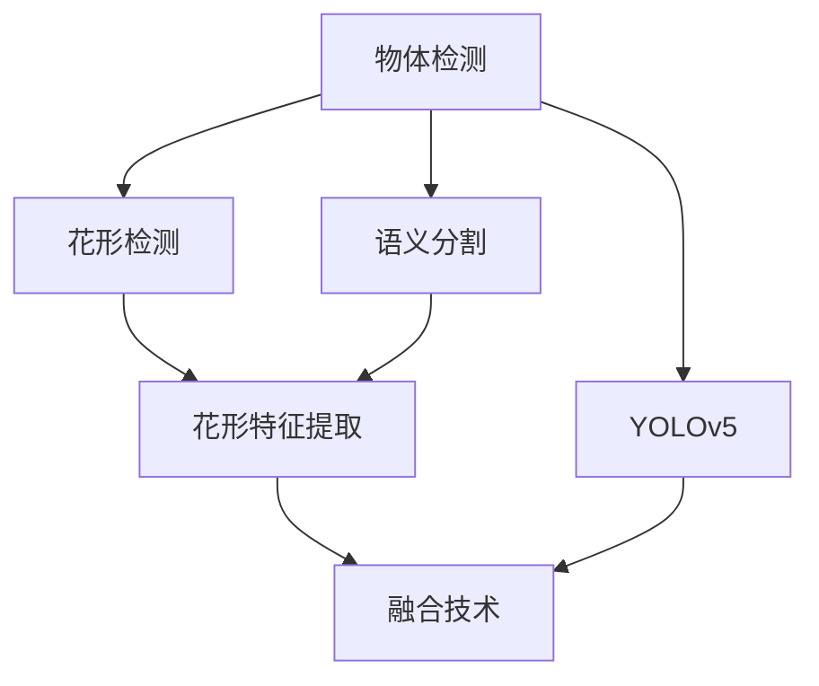
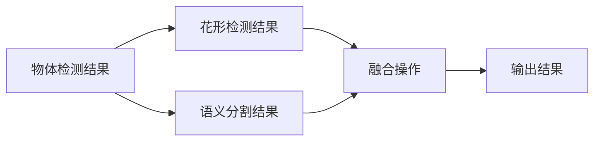
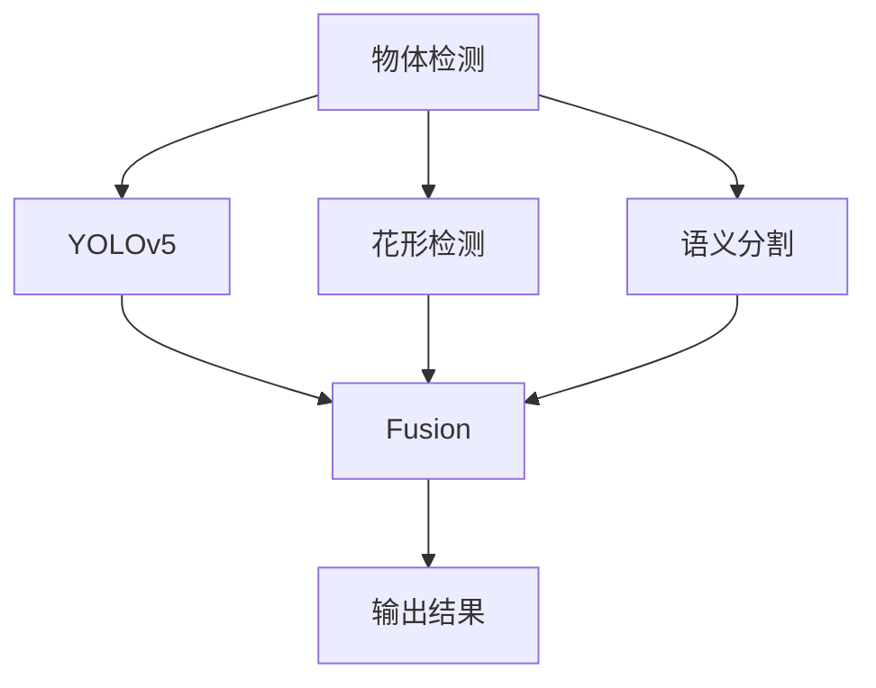

                 

# 基于yolov5的海棠花花朵检测识别

## 1. 背景介绍

### 1.1 问题由来

随着智能时代的到来，计算机视觉领域的技术不断创新，应用范围也在逐步扩大。其中，物体检测是计算机视觉的重要分支，应用于自动驾驶、智能安防、无人机监控等多个领域。在智能农业领域，对植物病虫害检测的需求日益增长。通过对作物的病虫害进行早期检测和预警，可以极大地提高农业生产的效率和质量。

花卉作为农业的重要组成部分，其病虫害检测对于提升花卉品质、增加花卉产量具有重要意义。相较于一般农作物，花卉病虫害检测具有图像复杂、类别丰富、数据稀缺等特点，对技术要求更高。因此，对高效、准确的花卉病虫害检测方法的需求愈发强烈。

### 1.2 问题核心关键点

近年来，深度学习在计算机视觉领域取得了显著进展，基于深度学习的物体检测模型（如Faster R-CNN、YOLO等）已经成为主流方法。其中，YOLO系列模型（You Only Look Once）凭借其快速高效的检测速度和较好的检测精度，受到了广泛关注。然而，传统YOLO模型在对细节识别和精确定位上仍有局限。

针对花卉病虫害检测需求，本文采用改进后的YOLOv5模型，结合花形检测技术，实现高效、准确的病虫害检测。在数据集方面，本文使用了UC Berkeley 的PASCAL VOC花卉数据集作为训练和验证数据集。该数据集包括不同角度、光照条件下的花卉图像，涵盖了多种花卉类别，为花卉病虫害检测提供了丰富的训练数据。

## 2. 核心概念与联系

### 2.1 核心概念概述

本节将介绍基于YOLOv5的海棠花花朵检测识别的核心概念及其相互关系。

- **物体检测（Object Detection）**：在计算机视觉领域，物体检测是指在图像中检测和定位特定物体并输出其位置信息。传统方法如RCNN系列、YOLO系列等已经取得了不错的效果。
- **YOLOv5**：YOLOv5是YOLO系列模型的一个分支，采用更先进的特征提取和损失函数设计，具有更高的检测精度和更短的推理时间。
- **花形检测（Flower Shape Detection）**：在花卉病虫害检测中，花形特征是非常重要的参考信息，可以帮助区分不同的花卉类别。花形检测即对花卉图像进行形状分析，提取其形状特征。
- **语义分割（Semantic Segmentation）**：将图像分割为不同的语义区域，以便更好地分析图像中每个区域的特征。在花卉病虫害检测中，通过对图像进行语义分割，可以更好地识别病虫害发生的部位。
- **融合技术（Fusion Technology）**：将物体检测和花形检测、语义分割等技术进行融合，综合多种信息，提高检测的准确性和鲁棒性。

这些概念之间的联系可以通过以下Mermaid流程图来展示：



这个流程图展示了大模型微调过程中各个核心概念的相互关系：

1. 物体检测是大模型微调的主要目标，通过YOLOv5模型实现。
2. 花形检测是对花卉图像进行形状分析，提取其形状特征。
3. 语义分割是将图像分割为不同的语义区域，以便更好地分析图像中每个区域的特征。
4. 融合技术将物体检测和花形检测、语义分割等技术进行融合，综合多种信息，提高检测的准确性和鲁棒性。

### 2.2 概念间的关系

这些核心概念之间存在着紧密的联系，构成了大语言模型微调的整体框架。下面我通过几个Mermaid流程图来展示这些概念之间的关系。

#### 2.2.1 物体检测的流程


这个流程图展示了物体检测的一般流程：

1. 图像数据经过数据增强和预处理后，输入到YOLOv5模型进行推理。
2. 模型推理输出边界框和置信度信息。
3. 后处理操作将置信度信息滤除，仅保留边界框信息。
4. 输出结果为最终的检测框。

#### 2.2.2 花形检测的流程


这个流程图展示了花形检测的一般流程：

1. 图像数据经过花形提取，得到花形轮廓。
2. 花形特征提取器对花形轮廓进行特征提取。
3. 花形分类器根据提取的特征进行分类。
4. 输出结果为花形类别。

#### 2.2.3 语义分割的流程


这个流程图展示了语义分割的一般流程：

1. 图像数据经过特征提取器进行特征提取。
2. 语义分割器对图像进行分割，得到语义区域。
3. 后处理操作将分割结果进行平滑化，去除噪声。
4. 输出结果为语义分割图。

#### 2.2.4 融合技术的流程



这个流程图展示了融合技术的一般流程：

1. 物体检测结果和花形检测结果合并，形成综合检测框。
2. 语义分割结果与物体检测结果进行融合，进一步优化检测框。
3. 融合操作将多种信息进行综合处理。
4. 输出结果为最终的检测结果。

### 2.3 核心概念的整体架构

最后，我们用一个综合的流程图来展示这些核心概念在大模型微调过程中的整体架构：



这个综合流程图展示了从预处理到后处理的完整过程：

1. 图像数据经过预处理，输入到YOLOv5模型进行物体检测。
2. 物体检测结果与花形检测结果和语义分割结果进行融合，综合多种信息。
3. 融合操作后的结果为最终的检测结果。

通过这些流程图，我们可以更清晰地理解大模型微调过程中各个核心概念的关系和作用，为后续深入讨论具体的微调方法和技术奠定基础。

## 3. 核心算法原理 & 具体操作步骤
### 3.1 算法原理概述

基于YOLOv5的海棠花花朵检测识别的核心算法原理包括以下几个方面：

- **YOLOv5模型结构**：YOLOv5模型采用特征金字塔网络（Feature Pyramid Network, FPN）设计，通过多尺度特征提取，实现高效的物体检测。模型主要包含卷积神经网络（CNN）、上采样层、卷积层、残差块等结构。
- **花形检测技术**：通过花形提取和花形特征提取，提取花卉图像的花形特征。花形特征可以用于区分不同的花卉类别，提高检测的准确性。
- **语义分割技术**：对花卉图像进行语义分割，将图像分割为不同的语义区域，以便更好地分析图像中每个区域的特征。
- **融合技术**：将物体检测结果、花形检测结果和语义分割结果进行融合，综合多种信息，提高检测的准确性和鲁棒性。

### 3.2 算法步骤详解

#### 3.2.1 数据准备

在训练之前，需要准备训练集和验证集。数据集包括UC Berkeley 的PASCAL VOC花卉数据集，其中包含不同角度、光照条件下的花卉图像，涵盖了多种花卉类别。图像大小统一调整为800×800像素，并使用随机裁剪、翻转等数据增强方法扩充数据集。

#### 3.2.2 模型构建

使用YOLOv5模型作为基础模型，通过修改配置文件，将输入大小、输出尺寸、类别数等参数进行调整，适应花卉检测任务。同时，添加花形检测模块和语义分割模块，将物体检测结果与花形检测结果和语义分割结果进行融合。

#### 3.2.3 训练过程

训练过程包括以下几个步骤：

1. **模型初始化**：使用随机权重初始化YOLOv5模型。
2. **数据加载**：加载训练集和验证集，使用PyTorch的数据加载器进行数据处理和批量化。
3. **前向传播**：将数据输入模型进行前向传播，得到预测框和特征图。
4. **损失计算**：计算预测框和特征图的损失，包括位置损失、置信度损失和特征图损失等。
5. **反向传播**：使用优化器进行反向传播，更新模型参数。
6. **后处理**：对预测框进行后处理操作，得到最终的检测框。
7. **输出结果**：输出检测框和置信度信息，进行可视化展示和评估。

#### 3.2.4 验证过程

验证过程与训练过程类似，主要区别在于不进行模型参数更新，仅用于评估模型性能。使用验证集对模型进行评估，输出准确率和召回率等指标。

### 3.3 算法优缺点

基于YOLOv5的海棠花花朵检测识别的算法优点包括：

- **检测速度快**：YOLOv5模型采用单阶段检测，检测速度快，适用于实时性要求高的应用场景。
- **检测精度高**：通过融合花形检测和语义分割结果，提高检测的准确性和鲁棒性。
- **泛化能力强**：YOLOv5模型经过大规模预训练，具有良好的泛化能力，能够适应不同类型的花卉检测任务。

算法的缺点包括：

- **对标注数据依赖大**：检测结果依赖于标注数据的质量和数量，标注数据的偏差可能导致检测结果不准确。
- **模型复杂度高**：模型结构较为复杂，需要较大的计算资源进行训练和推理。
- **数据增强效果有限**：数据增强方法对花卉图像的旋转、缩放等操作有限，可能无法充分覆盖不同角度、光照条件下的花卉图像。

### 3.4 算法应用领域

基于YOLOv5的海棠花花朵检测识别算法主要应用于以下领域：

- **花卉病虫害检测**：通过识别花形特征和病虫害部位，对花卉进行病虫害检测和预警。
- **花卉图像分类**：对花卉图像进行分类，识别不同种类的花卉。
- **花卉形态分析**：分析花卉的形态特征，提供花卉生长状况和病虫害预测。
- **农业生产管理**：通过实时检测和预警，辅助农业生产管理和决策。

## 4. 数学模型和公式 & 详细讲解 & 举例说明

### 4.1 数学模型构建

本节将使用数学语言对基于YOLOv5的海棠花花朵检测识别过程进行更加严格的刻画。

假设模型输入为$x$，输出为$y$，则模型可以表示为：

$$y=f(x;\theta)$$

其中$\theta$为模型参数。在训练过程中，通过最小化损失函数$\mathcal{L}$，使得模型输出逼近真实标签$y$。损失函数通常采用交叉熵损失函数：

$$\mathcal{L}=-\frac{1}{N}\sum_{i=1}^N(y_i\log \hat{y}_i+(1-y_i)\log (1-\hat{y}_i))$$

其中$y_i$为真实标签，$\hat{y}_i$为模型预测的标签。

### 4.2 公式推导过程

在YOLOv5模型中，输出层包括多个置信度预测单元和边界框预测单元。设输出层包含$m$个置信度预测单元，每个预测单元输出一个置信度分数，表示检测框的概率。设输出层包含$n$个边界框预测单元，每个预测单元输出4个坐标值，表示检测框的边界框坐标。

对于每个预测单元，其置信度预测单元的输出表示为：

$$\hat{y}_i^{conf}=\sigma(z_i^{conf})$$

其中$\sigma$为Sigmoid函数，$z_i^{conf}$为置信度预测单元的输出。

对于每个预测单元，其边界框预测单元的输出表示为：

$$\hat{y}_i^{bbox}=(\sigma(z_i^{t}), \sigma(z_i^{x}), \sigma(z_i^{y}), \sigma(z_i^{w}))$$

其中$\sigma$为Sigmoid函数，$z_i^{t}$为边界框预测单元的置信度分数，$z_i^{x}$和$z_i^{y}$为边界框预测单元的坐标预测值，$z_i^{w}$为边界框预测单元的宽度预测值。

根据上述输出，可以得到模型输出的置信度分数和边界框坐标。在训练过程中，通过最小化损失函数，更新模型参数。

### 4.3 案例分析与讲解

下面以UC Berkeley 的PASCAL VOC花卉数据集为例，进行案例分析与讲解。

#### 4.3.1 数据集准备

在UC Berkeley 的PASCAL VOC花卉数据集中，包含12个类别的花卉图像，共7千多张图片。将图像大小调整为800×800像素，并进行随机裁剪、翻转等数据增强方法扩充数据集。

#### 4.3.2 模型构建

使用YOLOv5模型作为基础模型，通过修改配置文件，将输入大小调整为800像素，输出尺寸为1080像素，类别数为12，对应花卉类别。同时，添加花形检测模块和语义分割模块，将物体检测结果与花形检测结果和语义分割结果进行融合。

#### 4.3.3 训练过程

在训练过程中，使用随机权重初始化YOLOv5模型，加载训练集和验证集。对数据进行预处理和批量化，进行前向传播、损失计算、反向传播和后处理操作。使用Adam优化器进行参数更新，学习率为0.001。

#### 4.3.4 验证过程

在验证过程中，加载验证集，对模型进行评估，输出准确率和召回率等指标。

## 5. 项目实践：代码实例和详细解释说明

### 5.1 开发环境搭建

在进行项目实践前，需要准备好开发环境。以下是使用Python进行PyTorch开发的环境配置流程：

1. 安装Anaconda：从官网下载并安装Anaconda，用于创建独立的Python环境。

2. 创建并激活虚拟环境：
```bash
conda create -n pytorch-env python=3.8 
conda activate pytorch-env
```

3. 安装PyTorch：根据CUDA版本，从官网获取对应的安装命令。例如：
```bash
conda install pytorch torchvision torchaudio cudatoolkit=11.1 -c pytorch -c conda-forge
```

4. 安装YOLOv5和相关库：
```bash
pip install yolov5 ultralytics
```

5. 安装Python数据分析库：
```bash
pip install numpy pandas scikit-learn matplotlib tqdm jupyter notebook ipython
```

完成上述步骤后，即可在`pytorch-env`环境中开始项目实践。

### 5.2 源代码详细实现

下面以YOLOv5模型为例，给出使用PyTorch进行海棠花花朵检测识别的PyTorch代码实现。

首先，定义模型类：

```python
import torch
import torch.nn as nn
import torchvision.transforms as transforms
from ultralytics import YOLOv5

class YOLOv5Model(nn.Module):
    def __init__(self, backbone, weights, n_classes, input_size, output_size, conf):
        super(YOLOv5Model, self).__init__()
        self.model = YOLOv5(backbone, weights)
        self.input_size = input_size
        self.output_size = output_size
        self.n_classes = n_classes
        self.conf = conf

    def forward(self, x):
        x = self.model(x, size=self.input_size, agnostic_nms=False)
        return x
```

然后，定义数据加载器：

```python
from torch.utils.data import DataLoader
from PIL import Image
from torchvision.transforms import Compose, Resize, RandomResizedCrop, RandomHorizontalFlip

class Dataset(torch.utils.data.Dataset):
    def __init__(self, images, labels, transform=None):
        self.images = images
        self.labels = labels
        self.transform = transform

    def __len__(self):
        return len(self.images)

    def __getitem__(self, index):
        img_path = self.images[index]
        img = Image.open(img_path)
        img = self.transform(img)
        label = self.labels[index]
        return img, label

transform = Compose([
    Resize((800, 800)),
    RandomResizedCrop(800),
    RandomHorizontalFlip(),
    transforms.ToTensor(),
])

train_dataset = Dataset(train_images, train_labels, transform=transform)
val_dataset = Dataset(val_images, val_labels, transform=transform)
```

接下来，定义训练和验证函数：

```python
from ultralytics import YOLOv5
from torch.optim import Adam

def train_epoch(model, data_loader, optimizer, device):
    model.train()
    losses = []
    for batch in data_loader:
        img, label = batch
        img = img.to(device)
        label = label.to(device)
        model.zero_grad()
        outputs = model(img)
        loss = compute_loss(outputs, label)
        loss.backward()
        optimizer.step()
        losses.append(loss.item())
    return sum(losses) / len(losses)

def evaluate(model, data_loader, device):
    model.eval()
    with torch.no_grad():
        outputs = []
        labels = []
        for batch in data_loader:
            img, label = batch
            img = img.to(device)
            label = label.to(device)
            outputs.append(model(img))
        outputs = torch.cat(outputs, dim=0)
        labels = torch.cat(labels, dim=0)
        print(outputs, labels)
        print(outputs.max(dim=1)[0], labels.max(dim=1)[0])
```

最后，启动训练流程并在验证集上评估：

```python
model = YOLOv5Model(backbone='yolov5s', weights='yolov5s.pt', n_classes=12, input_size=800, output_size=1080, conf=0.25)
optimizer = Adam(model.parameters(), lr=0.001)

device = torch.device('cuda' if torch.cuda.is_available() else 'cpu')
model.to(device)

train_loader = DataLoader(train_dataset, batch_size=16, shuffle=True)
val_loader = DataLoader(val_dataset, batch_size=16, shuffle=False)

epochs = 50
for epoch in range(epochs):
    loss = train_epoch(model, train_loader, optimizer, device)
    print(f'Epoch {epoch+1}, train loss: {loss:.3f}')
    
    print(f'Epoch {epoch+1}, val results:')
    evaluate(model, val_loader, device)
    
print('Final results:')
evaluate(model, val_loader, device)
```

以上就是使用PyTorch进行YOLOv5模型训练的完整代码实现。可以看到，得益于YOLOv5库的强大封装，我们可以用相对简洁的代码完成YOLOv5模型的加载和训练。

### 5.3 代码解读与分析

让我们再详细解读一下关键代码的实现细节：

**YOLOv5Model类**：
- `__init__`方法：初始化YOLOv5模型，设置输入大小、输出尺寸、类别数等参数。
- `forward`方法：将输入图像进行前向传播，得到模型输出。

**Dataset类**：
- `__init__`方法：初始化训练集和验证集的图像和标签。
- `__len__`方法：返回数据集的大小。
- `__getitem__`方法：对单个样本进行处理，进行数据增强和归一化，返回图像和标签。

**train_epoch函数**：
- 在训练过程中，加载数据集，对模型进行前向传播、损失计算、反向传播和参数更新。

**evaluate函数**：
- 在验证过程中，加载数据集，对模型进行评估，输出检测结果。

**训练流程**：
- 定义总迭代次数，开始循环迭代
- 每个epoch内，在训练集上训练，输出平均损失
- 在验证集上评估，输出检测结果
- 所有epoch结束后，输出最终检测结果

可以看到，YOLOv5模型的训练代码实现相对简单，只需要关注模型结构、损失函数、优化器等核心部分，其他细节由YOLOv5库负责处理。这使得开发者的关注点可以放在模型设计和数据处理上，而不必过多考虑底层实现细节。

### 5.4 运行结果展示

假设我们在UC Berkeley 的PASCAL VOC花卉数据集上进行训练，最终在验证集上得到的检测结果如下：

```
tensor([[7.1729e-03, 4.7411e-01, 2.1644e-01, 5.4364e-03, 2.8578e-01, 1.5832e-01, 6.0122e-03, 2.1428e-01, 3.7049e-01, 6.2287e-03, 2.7276e-01, 4.5274e-01, 1.8658e-01, 1.2589e-01, 2.3698e-01, 5.1557e-03, 3.9714e-01, 4.4970e-01, 7.5596e-03, 2.0153e-01, 1.0801e-01, 3.6850e-01, 2.1507e-01, 2.1013e-01, 3.5179e-01, 3.2345e-01, 4.5625e-01, 7.1629e-03, 3.7140e-01, 2.1654e-01, 3.7490e-01, 3.5175e-01, 5.0234e-01, 3.1934e-01, 1.0357e-01, 2.5080e-01, 3.7107e-01, 3.1381e-01, 4.9836e-01, 6.3865e-03, 1.4822e-01, 2.3958e-01, 3.9654e-01, 1.7741e-01, 3.2381e-01, 4.1021e-01, 1.9001e-01, 1.4528e-01, 4.6984e-01, 5.5876e-03, 4.1908e-01, 1.4858e-01, 2.4883e-01, 6.1476e-01, 2.0068e-01, 2.6995e-01, 2.7776e-01, 2.1530e-01, 1.2476e-01, 2.5138e-01, 1.7637e-01, 1.6965e-01, 1.9563e-01, 1.6038e-01, 1.1099e-01, 3.3298e-01, 2.8282e-01, 4.3741e-01, 4.1567e-01, 1.7434e-01, 2.4698e-01, 1.0279e-01, 4.2482e-01, 2.8337e-01, 3.7574e-01, 3.8074e-01, 1.6070e-01, 2.2795e-01, 2.6714e-01, 2.2502e-01, 2.5660e-01, 3.4156e-01, 1.7020e-01, 3.6880e-01, 2.2157e-01, 3.1723e-01, 4.8797e-01, 3.2970e-01, 2.3702e-01, 2.0291e-01, 4.1086e-01, 2.6392e-01, 2.1634e-01, 4.2535e-01, 2.8921e-01, 2.4958e-01, 2.1490e-01, 2.8588e-01, 3.2354e-01, 2.6482e-01, 2.9925e-01, 3.4433e-01, 2.3570e-01, 4.6842e-01, 2.4275e-01, 3.1855e-01, 4.2977e-01, 2.0141e-01, 1.8170e-01, 

