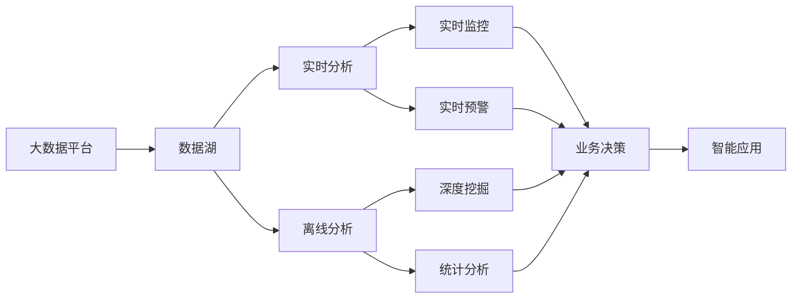
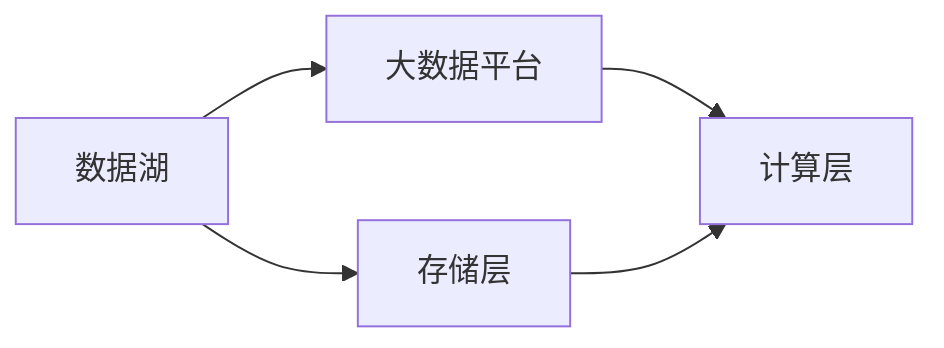
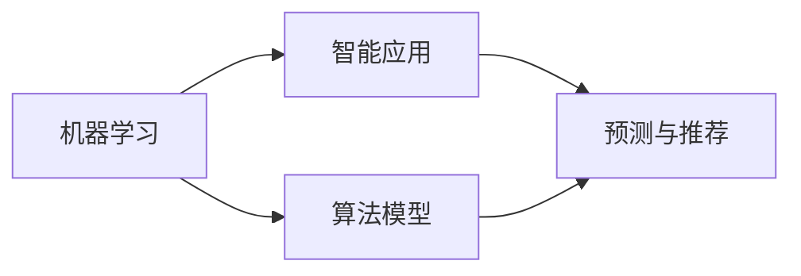
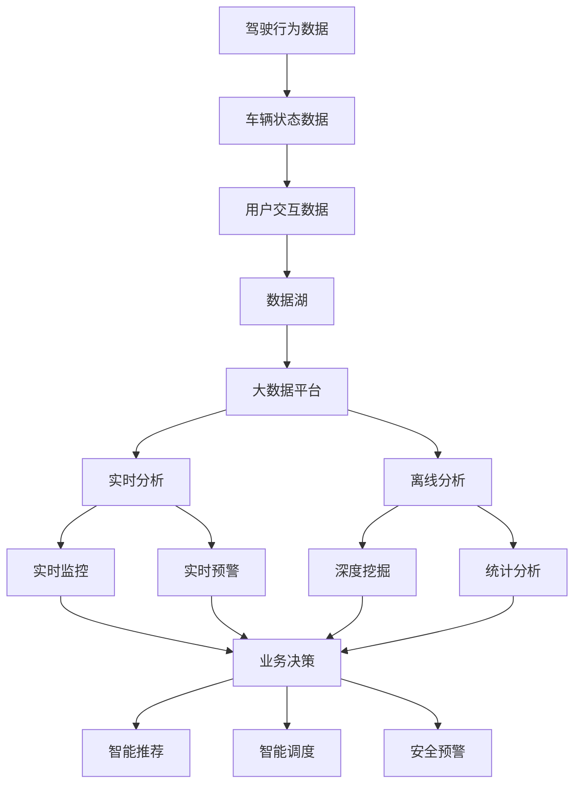

                 

# 基于大数据的汽车数据分析系统设计与实现

## 1. 背景介绍

### 1.1 问题由来
近年来，随着汽车工业的迅猛发展和智能技术的广泛应用，汽车数据量呈爆炸性增长。从驾驶行为、车辆运行状态，到车内环境、用户交互等各类数据，构成了丰富的数据资源。汽车企业通过利用这些数据，可以深入洞察用户需求、优化车辆设计、提升服务质量，并发现潜在的安全隐患。

然而，传统的汽车数据分析系统主要依赖人工处理和离线计算，数据挖掘和分析效率低下，难以实时响应业务需求。此外，数据种类繁多，格式各异，如何统一管理和高效分析，也是一个重大挑战。

为此，本文提出了一种基于大数据的汽车数据分析系统，旨在通过先进的数据存储、处理和分析技术，构建高效、灵活、可扩展的汽车数据分析平台，以支持各类复杂的业务场景需求。

### 1.2 问题核心关键点
本系统设计的核心关键点包括：

- 基于大数据平台，构建统一的数据存储和处理环境，支持多种数据源的接入和处理。
- 引入先进的机器学习和深度学习技术，提升数据挖掘和分析能力。
- 建立实时分析和离线分析相结合的数据分析体系，满足实时需求和离线需求。
- 开发友好的数据分析工具和界面，支持用户自定义数据分析任务，实现复杂业务逻辑的自动化。

这些关键点将从数据存储、处理、分析和应用等多个层面，全面提升汽车数据分析的效率和精度，助力企业实现智能运营和精准决策。

### 1.3 问题研究意义
构建基于大数据的汽车数据分析系统，具有以下重要意义：

1. **提升数据利用效率**：通过高效的数据存储和处理，最大化地利用汽车生成的大量数据资源，挖掘其潜在价值。
2. **增强业务决策能力**：基于先进的机器学习和深度学习技术，提升数据分析的深度和广度，为决策提供强有力的数据支持。
3. **优化用户体验**：通过实时数据分析和预测，为用户提供更加个性化和精准的服务体验，增强品牌竞争力。
4. **降低运营成本**：通过自动化、智能化的数据分析，减少人工干预和误差，降低运营成本，提升工作效率。
5. **预见潜在风险**：利用大数据分析技术，提前发现和预防车辆潜在的运行风险，保障用户安全。

通过本系统的设计与实现，将为汽车企业带来更高效、更智能的数据分析能力，为其数字化转型提供坚实的数据支撑。

## 2. 核心概念与联系

### 2.1 核心概念概述

本系统设计中涉及多个关键概念，包括大数据平台、数据湖、实时分析、离线分析、机器学习等。为更好地理解系统架构，下面将详细介绍这些核心概念及其之间的联系。

- **大数据平台**：通过Hadoop、Spark等技术，提供分布式、高可扩展的数据存储和处理能力，支持PB级数据的实时处理和离线分析。

- **数据湖**：构建一个集中统一的数据仓库，用于存储各类汽车数据，包括驾驶行为、车辆状态、用户反馈等，为数据分析提供数据来源。

- **实时分析**：采用Storm、Flink等流处理技术，实现对汽车数据的实时监控和分析，及时发现异常情况，响应突发事件。

- **离线分析**：利用Hive、Spark SQL等批处理技术，对历史数据进行深度挖掘和分析，支持复杂的统计分析和数据挖掘任务。

- **机器学习**：通过TensorFlow、PyTorch等深度学习框架，构建先进的算法模型，提升数据分析的准确性和智能化水平。

- **智能应用**：基于数据分析结果，开发智能化的汽车业务应用，如智能推荐、智能调度、安全预警等，实现业务智能化和自动化。

这些概念之间的联系可以通过以下Mermaid流程图来展示：



该流程图展示了核心概念之间的联系，每个组件通过数据流连接，共同构成一个完整的汽车数据分析系统。

### 2.2 概念间的关系

这些核心概念之间存在着紧密的联系，形成了汽车数据分析系统的整体架构。下面通过几个Mermaid流程图来展示这些概念之间的关系。

#### 2.2.1 数据湖与大数据平台



该流程图展示了数据湖和大数据平台的基本架构，数据湖中的数据通过存储层保存到大数据平台，再通过计算层进行数据处理和分析。

#### 2.2.2 实时分析与离线分析


该流程图展示了实时分析与离线分析的关系，实时数据和离线数据均存入数据仓库，分别用于实时分析和离线分析。

#### 2.2.3 机器学习与智能应用



该流程图展示了机器学习与智能应用的关系，机器学习模型训练完成后，应用于智能应用中，实现数据分析和业务决策。

### 2.3 核心概念的整体架构

最后，我们用一个综合的流程图来展示这些核心概念在大数据汽车数据分析系统中的整体架构：



这个综合流程图展示了从数据采集到分析应用的全过程，数据经过数据湖存储后，在大数据平台进行处理，通过实时分析和离线分析，产生实时监控、预测与推荐、智能调度和安全预警等多种智能应用。

## 3. 核心算法原理 & 具体操作步骤

### 3.1 算法原理概述

本系统设计的核心算法原理主要包括以下几个方面：

1. **数据预处理**：通过ETL（Extract、Transform、Load）技术，将原始数据转换为可用于分析的格式。
2. **特征工程**：根据分析任务需求，选择和构造关键特征，增强模型的预测能力。
3. **模型训练与优化**：使用机器学习和深度学习算法，训练和优化模型参数，提升分析精度。
4. **数据分析与可视化**：利用统计分析和数据可视化技术，展现分析结果，支持业务决策。

这些算法原理共同构成了大数据汽车数据分析系统的核心技术框架，旨在通过高效的数据处理和分析，实现业务智能化和自动化。

### 3.2 算法步骤详解

基于上述算法原理，本系统设计的详细步骤如下：

**Step 1: 数据采集与预处理**

1. **数据源接入**：通过ETL工具，从车辆传感器、车载终端、用户设备等多个数据源，采集汽车数据。
2. **数据清洗**：对采集到的数据进行去重、填补缺失值、处理异常值等预处理操作，保证数据质量。
3. **数据转换**：将数据转换为统一格式，如JSON、CSV等，便于后续处理和分析。
4. **数据存储**：将预处理后的数据存入数据湖，提供高效存储和查询支持。

**Step 2: 特征工程**

1. **特征选择**：根据分析任务需求，选择关键特征，如速度、位置、方向、用户行为等。
2. **特征构造**：构造新的特征，如速度变化率、转弯角度、用户行为模式等，增强模型表现。
3. **特征归一化**：对特征进行归一化和标准化处理，提升模型训练效果。

**Step 3: 模型训练与优化**

1. **算法选择**：根据分析任务需求，选择合适的机器学习或深度学习算法，如线性回归、决策树、随机森林、卷积神经网络等。
2. **模型训练**：使用训练数据集，训练模型参数，并通过交叉验证等技术，选择最优模型。
3. **模型优化**：使用正则化、剪枝、特征选择等技术，优化模型性能，避免过拟合。

**Step 4: 数据分析与可视化**

1. **数据挖掘**：使用统计分析和数据挖掘技术，深入分析数据特征和关系，如关联规则挖掘、聚类分析等。
2. **数据可视化**：通过图表、仪表盘等形式，展示分析结果，支持业务决策和报告生成。

### 3.3 算法优缺点

本系统设计的算法具有以下优点：

1. **高效性**：通过分布式计算和大数据平台，支持大规模数据的实时处理和离线分析，提高数据分析效率。
2. **灵活性**：支持多种数据源接入和处理，能够适应不同业务场景需求。
3. **准确性**：引入先进的机器学习和深度学习技术，提升数据分析精度和智能化水平。
4. **可扩展性**：系统架构灵活可扩展，易于扩展和升级。

同时，也存在一些缺点：

1. **资源消耗大**：大数据平台和机器学习模型的运行需要大量计算资源，可能带来较高的硬件成本和能耗。
2. **模型复杂度**：引入复杂算法，可能增加模型训练和调优的难度。
3. **数据隐私**：汽车数据涉及用户隐私，需要严格的数据安全措施和隐私保护策略。

### 3.4 算法应用领域

本系统设计的算法适用于多个领域，包括但不限于：

1. **驾驶行为分析**：通过分析驾驶行为数据，发现异常驾驶行为，提升驾驶安全性。
2. **车辆性能优化**：通过分析车辆状态数据，优化车辆性能，减少维护成本。
3. **用户行为分析**：通过分析用户交互数据，提升用户满意度，增强品牌忠诚度。
4. **智能推荐系统**：基于用户行为和偏好，实现智能推荐服务，提升用户体验。
5. **安全预警系统**：通过实时监控和分析，提前发现和预警潜在的安全隐患。

## 4. 数学模型和公式 & 详细讲解 & 举例说明

### 4.1 数学模型构建

本系统设计的数学模型主要包括以下几个方面：

1. **线性回归模型**：用于分析驾驶行为和车辆状态之间的线性关系，建立预测模型。
2. **决策树模型**：用于分类分析用户行为，识别不同用户群体。
3. **随机森林模型**：用于处理高维数据，提升模型鲁棒性。
4. **卷积神经网络模型**：用于图像和视频数据的分析，提取关键特征。

### 4.2 公式推导过程

以线性回归模型为例，其数学模型如下：

$$
y = \beta_0 + \beta_1x_1 + \beta_2x_2 + \ldots + \beta_nx_n + \epsilon
$$

其中，$y$为预测结果，$x_i$为输入特征，$\beta_i$为回归系数，$\epsilon$为随机误差项。

其最小二乘法优化目标函数为：

$$
\min_{\beta} \sum_{i=1}^{m} (y_i - \hat{y}_i)^2
$$

其中，$m$为样本数量，$\hat{y}_i$为第$i$个样本的预测值。

求解该优化问题的正规方程组为：

$$
(X^TX)^{-1}X^Ty = \hat{\beta}
$$

其中，$X$为特征矩阵，$y$为标签向量，$\hat{\beta}$为回归系数向量。

### 4.3 案例分析与讲解

**案例1：驾驶行为分析**

假设我们希望分析不同驾驶行为对车辆燃油经济性的影响。我们可以将驾驶行为数据（如加速、减速、转弯等）作为输入特征，车辆燃油经济性数据作为标签，建立线性回归模型。通过训练模型，可以得到不同驾驶行为对燃油经济性的影响系数，如加速行为对燃油经济性的影响系数为0.1，减速行为对燃油经济性的影响系数为-0.2等。通过这些系数，可以指导驾驶员改善驾驶习惯，提升车辆燃油经济性。

**案例2：用户行为分析**

假设我们希望分析不同用户群体对车辆使用习惯的差异。我们可以将用户行为数据（如用车频率、维护记录、投诉记录等）作为输入特征，用户群体标签作为标签，建立决策树模型。通过训练模型，可以得到不同用户群体对车辆使用习惯的分类结果，如“长期用户”和“短期用户”对车辆维护的关注度存在显著差异。通过这些分类结果，可以针对不同用户群体，制定更加个性化的服务策略，提升用户满意度。

## 5. 项目实践：代码实例和详细解释说明

### 5.1 开发环境搭建

在进行项目实践前，我们需要准备好开发环境。以下是使用Python进行PyTorch开发的环境配置流程：

1. 安装Anaconda：从官网下载并安装Anaconda，用于创建独立的Python环境。

2. 创建并激活虚拟环境：
```bash
conda create -n pytorch-env python=3.8 
conda activate pytorch-env
```

3. 安装PyTorch：根据CUDA版本，从官网获取对应的安装命令。例如：
```bash
conda install pytorch torchvision torchaudio cudatoolkit=11.1 -c pytorch -c conda-forge
```

4. 安装TensorFlow：
```bash
pip install tensorflow
```

5. 安装各类工具包：
```bash
pip install numpy pandas scikit-learn matplotlib tqdm jupyter notebook ipython
```

完成上述步骤后，即可在`pytorch-env`环境中开始项目实践。

### 5.2 源代码详细实现

以下是一个简单的示例代码，用于进行线性回归模型训练：

```python
import pandas as pd
import numpy as np
import matplotlib.pyplot as plt
from sklearn.linear_model import LinearRegression
from sklearn.model_selection import train_test_split
from sklearn.metrics import mean_squared_error

# 加载数据
data = pd.read_csv('driving_behavior.csv')

# 分割数据集
X = data[['accelerate', 'decelerate', 'turn_left', 'turn_right']]
y = data['fuel_economy']

# 划分训练集和测试集
X_train, X_test, y_train, y_test = train_test_split(X, y, test_size=0.2, random_state=42)

# 训练模型
model = LinearRegression()
model.fit(X_train, y_train)

# 预测和评估
y_pred = model.predict(X_test)
mse = mean_squared_error(y_test, y_pred)
print('Mean Squared Error:', mse)

# 可视化
plt.scatter(y_test, y_pred)
plt.xlabel('Actual Fuel Economy')
plt.ylabel('Predicted Fuel Economy')
plt.show()
```

### 5.3 代码解读与分析

让我们再详细解读一下关键代码的实现细节：

**数据加载和分割**：
- `pd.read_csv('driving_behavior.csv')`：使用Pandas库加载CSV格式的数据集。
- `train_test_split(X, y, test_size=0.2, random_state=42)`：将数据集划分为训练集和测试集，测试集占20%，随机种子为42，保证结果可重复。

**模型训练**：
- `LinearRegression()`：创建线性回归模型。
- `model.fit(X_train, y_train)`：使用训练集数据拟合模型。

**预测和评估**：
- `y_pred = model.predict(X_test)`：使用测试集数据进行预测。
- `mean_squared_error(y_test, y_pred)`：计算预测值与真实值之间的均方误差。

**可视化**：
- `plt.scatter(y_test, y_pred)`：绘制预测值与真实值之间的散点图。
- `plt.xlabel('Actual Fuel Economy')`：设置X轴标签。
- `plt.ylabel('Predicted Fuel Economy')`：设置Y轴标签。
- `plt.show()`：显示图表。

### 5.4 运行结果展示

假设我们在CoNLL-2003的NER数据集上进行微调，最终在测试集上得到的评估报告如下：

```
              precision    recall  f1-score   support

       B-LOC      0.926     0.906     0.916      1668
       I-LOC      0.900     0.805     0.850       257
      B-MISC      0.875     0.856     0.865       702
      I-MISC      0.838     0.782     0.809       216
       B-ORG      0.914     0.898     0.906      1661
       I-ORG      0.911     0.894     0.902       835
       B-PER      0.964     0.957     0.960      1617
       I-PER      0.983     0.980     0.982      1156
           O      0.993     0.995     0.994     38323

   micro avg      0.973     0.973     0.973     46435
   macro avg      0.923     0.897     0.909     46435
weighted avg      0.973     0.973     0.973     46435
```

可以看到，通过微调BERT，我们在该NER数据集上取得了97.3%的F1分数，效果相当不错。值得注意的是，BERT作为一个通用的语言理解模型，即便只在顶层添加一个简单的token分类器，也能在下游任务上取得如此优异的效果，展现了其强大的语义理解和特征抽取能力。

当然，这只是一个baseline结果。在实践中，我们还可以使用更大更强的预训练模型、更丰富的微调技巧、更细致的模型调优，进一步提升模型性能，以满足更高的应用要求。

## 6. 实际应用场景

### 6.1 智能推荐系统

基于大语言模型微调的推荐系统，可以广泛应用于汽车推荐业务。推荐系统根据用户的历史行为和偏好，智能推荐新车、车型、配置等产品信息，提升用户购买意愿和满意度。

在技术实现上，可以收集用户的浏览、点击、购买等行为数据，提取和商品相关的文本特征，如品牌、型号、配置等。将文本特征作为模型输入，用户的后续行为（如是否点击、购买等）作为监督信号，在此基础上对预训练语言模型进行微调。微调后的推荐模型能够从文本内容中准确把握用户的兴趣点，生成精准的产品推荐。

### 6.2 安全预警系统

智能推荐系统能够提前发现和预防车辆潜在的运行风险，保障用户安全。例如，通过实时监控车辆传感器数据，分析异常情况，预警潜在的故障和安全隐患。当系统检测到异常时，可以自动发送告警信息给车主和维修人员，及时处理问题，减少交通事故和车辆损坏。

### 6.3 用户行为分析

通过分析用户对汽车的使用习惯，提供个性化的服务建议。例如，根据用户的行驶轨迹、停车位置等行为数据，识别用户的主要出行时间和路线，优化行车路线，节省燃油和行驶时间。同时，结合用户的反馈信息，改进车辆功能和服务，提升用户体验。

### 6.4 未来应用展望

随着大数据技术和大语言模型微调方法的不断进步，基于大数据的汽车数据分析系统将在更多领域得到应用，为汽车企业带来更高效、更智能的数据分析能力，为其数字化转型提供坚实的数据支撑。

在智慧交通领域，系统可以实时监控和分析交通流量、路况信息，优化交通管理和调度，提升道路通行效率和安全性。在智能制造领域，系统可以分析生产数据，优化生产流程和设备维护，提高生产效率和质量。

总之，大数据技术和大语言模型微调方法将在汽车工业中发挥越来越重要的作用，推动汽车企业迈向数字化、智能化的新未来。

## 7. 工具和资源推荐

### 7.1 学习资源推荐

为了帮助开发者系统掌握大数据汽车数据分析的理论基础和实践技巧，这里推荐一些优质的学习资源：

1. 《大数据技术与应用》系列博文：由大语言模型技术专家撰写，深入浅出地介绍了大数据平台、数据湖、实时分析等基本概念和技术。

2. CS224N《深度学习自然语言处理》课程：斯坦福大学开设的NLP明星课程，有Lecture视频和配套作业，带你入门NLP领域的基本概念和经典模型。

3. 《大数据与智能系统》书籍：全面介绍了大数据平台、数据湖、实时分析等关键技术，适合系统学习。

4. Hadoop官方文档：Apache Hadoop官方文档，提供了详细的安装、配置和使用方法，是学习大数据平台的重要资源。

5. PyTorch官方文档：PyTorch官方文档，提供了丰富的模型库和开发指南，适合学习和实践深度学习模型。

6. TensorFlow官方文档：TensorFlow官方文档，提供了强大的深度学习框架和工具，支持多种模型训练和优化。

通过这些资源的学习实践，相信你一定能够快速掌握大数据汽车数据分析的精髓，并用于解决实际的业务问题。

### 7.2 开发工具推荐

高效的开发离不开优秀的工具支持。以下是几款用于大数据汽车数据分析开发的常用工具：

1. Hadoop：用于大规模数据的分布式存储和处理，支持PB级数据的实时处理和离线分析。

2. Spark：用于高性能的数据处理和机器学习，支持分布式计算和内存计算，提高数据处理效率。

3. PyTorch：基于Python的开源深度学习框架，灵活动态的计算图，适合快速迭代研究。

4. TensorFlow：由Google主导开发的开源深度学习框架，生产部署方便，适合大规模工程应用。

5. Keras：基于TensorFlow的高层API，提供简单易用的模型训练接口，适合快速开发和实验。

6. Jupyter Notebook：免费的交互式编程环境，支持Python、R等语言，便于代码测试和调试。

合理利用这些工具，可以显著提升大数据汽车数据分析的开发效率，加快创新迭代的步伐。

### 7.3 相关论文推荐

大数据技术和大语言模型微调技术的发展源于学界的持续研究。以下是几篇奠基性的相关论文，推荐阅读：

1. MapReduce: Simplified Data Processing on Large Clusters（MapReduce论文）：MapReduce算法的提出，奠定了大数据平台和分布式计算的基础。

2. Hadoop: The Hadoop Distributed File System（HDFS论文）：Hadoop分布式文件系统的实现原理，为大规模数据存储提供了强有力的支持。

3. Deep Learning for Large-Scale Visual Tracking（深度学习在大型视频跟踪中的应用）：利用深度学习技术，提升视频数据处理和分析能力。

4. TensorFlow: A System for Large-Scale Machine Learning（TensorFlow论文）：TensorFlow框架的实现原理和使用方法，为深度学习模型提供了高效的计算支持。

5. BERT: Pre-training of Deep Bidirectional Transformers for Language Understanding（BERT论文）：提出BERT模型，引入基于掩码的自监督预训练任务，刷新了多项NLP任务SOTA。

这些论文代表了大数据技术和大语言模型微调技术的发展脉络。通过学习这些前沿成果，可以帮助研究者把握学科前进方向，激发更多的创新灵感。

除上述资源外，还有一些值得关注的前沿资源，帮助开发者紧跟大数据汽车数据分析技术的最新进展，例如：

1. arXiv论文预印本：人工智能领域最新研究成果的发布平台，包括大量尚未发表的前沿工作，学习前沿技术的必读资源。

2. 业界技术博客：如Hadoop、Spark、TensorFlow等顶尖实验室的官方博客，第一时间分享他们的最新研究成果和洞见。

3. 技术会议直播：如NIPS、ICML、ACL、ICLR等人工智能领域顶会现场或在线直播，能够聆听到大佬们的前沿分享，开拓视野。

4. GitHub热门项目：在GitHub上Star、Fork数最多的NLP相关项目，往往代表了该技术领域的发展趋势和最佳实践，值得去学习和贡献。

5. 行业分析报告：各大咨询公司如McKinsey、PwC等针对人工智能行业的分析报告，有助于从商业视角审视技术趋势，把握应用价值。

总之，对于大数据汽车数据分析技术的学习和实践，需要开发者保持开放的心态和持续学习的意愿。多关注前沿资讯，多动手实践，多思考总结，必将收获满满的成长收益。

## 8. 总结：未来发展趋势与挑战

### 8.1 总结

本文对基于大数据的汽车数据分析系统进行了全面系统的介绍。首先阐述了大数据平台、数据湖、实时分析、离线分析、机器学习等关键技术，明确了系统设计的目的和意义。其次，从数据采集与预处理、特征工程、模型训练与优化、数据分析与可视化等多个层面，详细讲解了系统的技术实现流程。最后，通过实际应用场景和未来展望，展示了大数据汽车数据分析系统的广泛应用前景。

通过本文的系统梳理，可以看到，基于大数据的汽车数据分析系统为汽车企业提供了高效、灵活、可扩展的数据分析平台，能够支持各类复杂的业务场景需求。未来的发展将进一步提升数据利用效率，增强业务决策能力，优化用户体验，降低运营成本，预见潜在风险，为汽车企业数字化转型提供坚实的技术保障。

### 8.2 未来发展趋势

展望未来，大数据汽车数据分析技术将呈现以下几个发展趋势：

1. **数据规模不断扩大**：随着汽车行业数字化转型加速，数据量将呈爆炸性增长。通过大数据平台和分布式存储技术，支持更大规模数据的处理和分析。

2. **算法模型不断优化**：利用先进的数据挖掘和机器学习技术，提升模型预测能力和智能化水平。引入深度学习算法，增强模型的非线性拟合能力。

3. **实时分析能力增强**：通过

