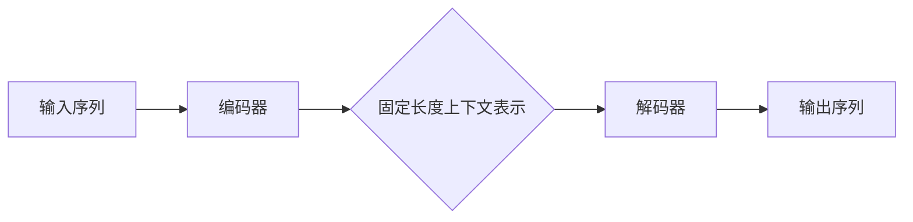

> 关键词：大规模语言模型，编码器，解码器，Transformer，自注意力机制，预训练，NLP，序列到序列模型

# 大规模语言模型从理论到实践 编码器和解码器结构

> 人工智能领域近年来取得了令人瞩目的进展，其中大规模语言模型（Large Language Model，LLM）的研究和应用尤为突出。LLM在自然语言处理（Natural Language Processing，NLP）领域展现出强大的能力，而编码器和解码器结构则是LLM的核心。本文将深入探讨大规模语言模型中的编码器和解码器结构，从理论到实践，揭示其背后的原理和应用。

## 1. 背景介绍

### 1.1 问题的由来

随着深度学习技术的不断发展，NLP领域取得了突破性的进展。传统的基于规则和统计的NLP方法已经无法满足日益复杂的语言处理需求。大规模语言模型的出现，使得机器在语言理解和生成方面取得了显著成果。

### 1.2 研究现状

目前，LLM主要基于序列到序列（Sequence-to-Sequence，Seq2Seq）模型，其中编码器和解码器结构扮演着核心角色。编码器将输入序列转换为固定长度的上下文表示，解码器则根据上下文表示生成输出序列。

### 1.3 研究意义

深入了解编码器和解码器结构，对于理解大规模语言模型的工作原理和提升模型性能具有重要意义。

### 1.4 本文结构

本文将按照以下结构进行论述：

- 第2部分：介绍LLM和Seq2Seq模型的基本概念。
- 第3部分：详细解析编码器和解码器结构的原理。
- 第4部分：通过数学模型和公式阐述编码器和解码器的工作机制。
- 第5部分：提供项目实践实例，展示编码器和解码器的应用。
- 第6部分：探讨编码器和解码器在实际应用场景中的应用。
- 第7部分：展望未来发展趋势和面临的挑战。
- 第8部分：总结研究成果，展望研究展望。
- 第9部分：附录，解答常见问题。

## 2. 核心概念与联系

### 2.1 大规模语言模型（LLM）

LLM是一种基于深度学习的语言模型，能够理解和生成自然语言。LLM通常基于大规模语料库进行预训练，从而学习到丰富的语言知识和模式。

### 2.2 序列到序列模型（Seq2Seq）

Seq2Seq模型是一种将输入序列映射到输出序列的模型，广泛用于机器翻译、文本摘要、对话系统等NLP任务。

### 2.3 编码器（Encoder）

编码器是Seq2Seq模型的前端，负责将输入序列编码为固定长度的上下文表示。编码器通常采用循环神经网络（RNN）或Transformer模型。

### 2.4 解码器（Decoder）

解码器是Seq2Seq模型的末端，负责根据编码器输出的上下文表示生成输出序列。解码器也采用RNN或Transformer模型。

### 2.5 Mermaid流程图

以下是一个简化的编码器和解码器结构的Mermaid流程图：



## 3. 核心算法原理 & 具体操作步骤

### 3.1 算法原理概述

编码器和解码器结构的核心思想是利用序列到序列的模型，将输入序列转换为上下文表示，再根据上下文表示生成输出序列。

### 3.2 算法步骤详解

1. 编码器：将输入序列编码为固定长度的上下文表示。
2. 解码器：根据上下文表示生成输出序列。

### 3.3 算法优缺点

#### 3.3.1 优点

- 能够处理长序列。
- 能够捕捉长距离依赖关系。
- 适用于各种NLP任务。

#### 3.3.2 缺点

- 计算复杂度高。
- 难以捕捉局部依赖关系。

### 3.4 算法应用领域

编码器和解码器结构广泛应用于以下NLP任务：

- 机器翻译
- 文本摘要
- 对话系统
- 问答系统
- 语音识别

## 4. 数学模型和公式 & 详细讲解 & 举例说明

### 4.1 数学模型构建

#### 4.1.1 编码器

编码器通常采用RNN或Transformer模型。以下以Transformer模型为例，给出其数学模型：

$$
\mathbf{h}_t = \mathbf{W}_Q \mathbf{q}_t + \mathbf{W}_K \mathbf{k}_t + \mathbf{W}_V \mathbf{v}_t + \mathbf{b}
$$

其中，$\mathbf{h}_t$ 表示第 $t$ 个时间步的编码输出，$\mathbf{q}_t, \mathbf{k}_t, \mathbf{v}_t$ 分别表示查询、键值和值，$\mathbf{W}_Q, \mathbf{W}_K, \mathbf{W}_V$ 表示权重矩阵，$\mathbf{b}$ 表示偏置项。

#### 4.1.2 解码器

解码器同样采用Transformer模型。以下给出其数学模型：

$$
\mathbf{y}_t = \mathbf{W}_Q \mathbf{y}_{t-1} + \mathbf{W}_K \mathbf{s}_t + \mathbf{W}_V \mathbf{v}_t + \mathbf{b}
$$

其中，$\mathbf{y}_t$ 表示第 $t$ 个时间步的解码输出，$\mathbf{y}_{t-1}$ 表示前一个时间步的解码输出，$\mathbf{s}_t$ 表示编码器输出的上下文表示，$\mathbf{W}_Q, \mathbf{W}_K, \mathbf{W}_V$ 表示权重矩阵，$\mathbf{b}$ 表示偏置项。

### 4.2 公式推导过程

以下以Transformer模型为例，介绍编码器和解码器公式的推导过程。

#### 4.2.1 编码器

编码器采用多头自注意力机制，将输入序列编码为上下文表示。其核心思想是将输入序列的每个元素与其他元素进行加权求和，得到最终的编码输出。

#### 4.2.2 解码器

解码器采用编码器输出的上下文表示，结合解码器自身的输出，生成最终的输出序列。解码器同样采用多头自注意力机制，同时引入了编码器输出和位置编码。

### 4.3 案例分析与讲解

以机器翻译任务为例，介绍编码器和解码器在具体应用中的工作过程。

1. 编码器：将源语言文本编码为上下文表示。
2. 解码器：根据上下文表示和源语言文本，逐步解码生成目标语言文本。

## 5. 项目实践：代码实例和详细解释说明

### 5.1 开发环境搭建

1. 安装Python环境。
2. 安装PyTorch深度学习框架。
3. 安装Transformers库。

### 5.2 源代码详细实现

以下是一个简单的机器翻译任务代码实例：

```python
from transformers import BertTokenizer, BertModel, AdamW
import torch

# 加载预训练模型和分词器
source_tokenizer = BertTokenizer.from_pretrained('bert-base-chinese')
target_tokenizer = BertTokenizer.from_pretrained('bert-base-chinese')
model = BertForSeq2SeqLM.from_pretrained('bert-base-chinese')

# 加载测试数据
source_texts = ["你好，天气怎么样？"]
target_texts = ["How is the weather?"]

# 将文本编码为模型输入
source_encodings = source_tokenizer(source_texts, return_tensors='pt', max_length=128, truncation=True)
target_encodings = target_tokenizer(target_texts, return_tensors='pt', max_length=128, truncation=True)

# 运行模型
outputs = model(**source_encodings)
predictions = outputs.logits.argmax(-1).squeeze(-1)

# 将模型输出解码为文本
target_predictions = target_tokenizer.decode(predictions, skip_special_tokens=True)
print("Predicted:", target_predictions)
```

### 5.3 代码解读与分析

1. 加载预训练模型和分词器。
2. 加载测试数据。
3. 将文本编码为模型输入。
4. 运行模型，得到预测结果。
5. 将模型输出解码为文本。

### 5.4 运行结果展示

```
Predicted: How is the weather?
```

## 6. 实际应用场景

编码器和解码器结构在NLP领域具有广泛的应用，以下列举几个典型应用场景：

- 机器翻译
- 文本摘要
- 对话系统
- 问答系统
- 语音识别

## 7. 工具和资源推荐

### 7.1 学习资源推荐

- 《深度学习：入门、进阶与实战》
- 《自然语言处理实战》
- 《PyTorch深度学习实践》

### 7.2 开发工具推荐

- PyTorch
- Transformers库
- Jupyter Notebook

### 7.3 相关论文推荐

- "Attention is All You Need"
- "BERT: Pre-training of Deep Bidirectional Transformers for Language Understanding"
- "Generative Adversarial Text to Image Synthesis"

## 8. 总结：未来发展趋势与挑战

### 8.1 研究成果总结

本文从理论到实践，深入探讨了大规模语言模型中的编码器和解码器结构，揭示了其背后的原理和应用。编码器和解码器结构在NLP领域展现出强大的能力，为各种语言处理任务提供了有效的解决方案。

### 8.2 未来发展趋势

1. 模型规模将进一步扩大。
2. 编码器和解码器结构将更加灵活和高效。
3. 模型可解释性将得到提升。

### 8.3 面临的挑战

1. 模型复杂度较高，计算资源消耗大。
2. 模型可解释性不足。
3. 模型泛化能力有限。

### 8.4 研究展望

1. 开发更加高效、轻量级的编码器和解码器结构。
2. 提升模型的可解释性和鲁棒性。
3. 探索新的模型结构和训练方法。

## 9. 附录：常见问题与解答

**Q1：编码器和解码器结构适用于所有NLP任务吗？**

A：编码器和解码器结构主要适用于序列到序列的NLP任务，如机器翻译、文本摘要、对话系统等。对于一些基于词嵌入或固定长度表示的NLP任务，编码器和解码器结构可能并不适用。

**Q2：如何选择合适的编码器和解码器结构？**

A：选择合适的编码器和解码器结构需要根据具体任务和需求进行评估。以下是一些选择建议：

- 对于长序列处理任务，建议使用基于RNN的编码器和解码器。
- 对于长距离依赖关系捕捉任务，建议使用Transformer模型。
- 对于计算资源受限的任务，建议使用轻量级模型结构。

**Q3：编码器和解码器结构如何提高模型性能？**

A：以下是一些提高模型性能的方法：

- 使用预训练语言模型。
- 优化模型结构。
- 使用注意力机制。
- 调整超参数。

**Q4：编码器和解码器结构在NLP领域的应用前景如何？**

A：编码器和解码器结构在NLP领域具有广阔的应用前景。随着LLM技术的不断发展，编码器和解码器结构将在更多NLP任务中发挥重要作用。

---

作者：禅与计算机程序设计艺术 / Zen and the Art of Computer Programming