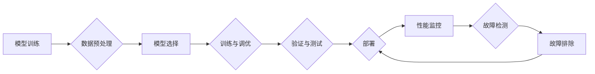

# 大语言模型原理与工程实践：稳定性优化

> 关键词：大语言模型，稳定性优化，鲁棒性，工程实践，模型部署，性能调优，故障排除

## 1. 背景介绍

随着深度学习技术的飞速发展，大语言模型（Large Language Models, LLMs）在自然语言处理（Natural Language Processing, NLP）领域取得了革命性的突破。这些模型能够理解和生成人类级别的文本，广泛应用于对话系统、文本生成、机器翻译等任务中。然而，大语言模型的复杂性和规模也带来了诸多挑战，其中最关键的是确保模型在实际部署中的稳定性。本文将深入探讨大语言模型稳定性优化的原理、实践方法以及未来趋势。

## 2. 核心概念与联系

### 2.1 核心概念

#### 大语言模型（LLMs）

大语言模型是指基于深度学习技术训练的，能够理解和生成自然语言的模型。它们通常由数百万甚至数十亿的参数组成，需要大量的计算资源和数据来训练。

#### 稳定性优化

稳定性优化是指通过对模型、数据、计算资源等方面的调整，确保模型在实际部署中能够稳定运行，减少错误率和故障发生。

#### 鲁棒性

鲁棒性是指模型在面对不完美输入、噪声、异常情况等时，仍能保持稳定输出的能力。

#### 工程实践

工程实践是指将理论研究成果应用于实际工程中，解决实际问题。

#### 模型部署

模型部署是指将训练好的模型集成到实际应用系统中，提供实时或批处理的服务。

#### 性能调优

性能调优是指通过对模型结构和参数的调整，提升模型的性能，包括准确率、响应速度、资源占用等。

#### 故障排除

故障排除是指识别和解决模型运行中的问题，保证系统稳定运行。

### 2.2 架构流程图

以下是大语言模型稳定性优化流程的Mermaid流程图：



## 3. 核心算法原理 & 具体操作步骤

### 3.1 算法原理概述

稳定性优化主要涉及以下几个方面：

1. **数据增强**：通过数据清洗、去噪、扩充等方式提高数据质量，增加模型对噪声和异常数据的鲁棒性。
2. **模型正则化**：通过引入正则化技术，如dropout、L2正则化等，防止模型过拟合，提高泛化能力。
3. **超参数调整**：通过调整学习率、批大小、迭代次数等超参数，找到最优的训练配置。
4. **模型蒸馏**：通过将大模型的中间层知识蒸馏到小模型中，降低模型的复杂度和计算量，提高部署的可行性。
5. **量化与剪枝**：通过量化模型参数和剪枝冗余连接，减小模型尺寸，降低资源占用。

### 3.2 算法步骤详解

1. **数据预处理**：对训练数据进行清洗、去噪、扩充等操作，提高数据质量。
2. **模型选择**：根据任务需求选择合适的模型架构。
3. **训练与调优**：使用合适的学习算法和超参数配置训练模型，并进行性能调优。
4. **验证与测试**：在验证集和测试集上评估模型性能，确保模型稳定性和准确性。
5. **部署**：将模型部署到实际应用系统中，提供实时或批处理的服务。
6. **性能监控**：实时监控模型性能，包括准确率、响应速度、资源占用等。
7. **故障检测**：监控系统运行状态，及时发现潜在问题。
8. **故障排除**：针对检测到的问题，进行故障排除，确保系统稳定运行。

### 3.3 算法优缺点

#### 优点

- 提高模型的稳定性和鲁棒性，减少错误率和故障发生。
- 提升模型的泛化能力，使模型能够适应更多场景。
- 降低模型的资源占用，提高部署的可行性。

#### 缺点

- 数据预处理和模型调优需要大量时间和资源。
- 模型蒸馏和量化等技术可能会降低模型的性能。

### 3.4 算法应用领域

稳定性优化方法适用于所有使用大语言模型的场景，包括：

- 对话系统
- 文本生成
- 机器翻译
- 情感分析
- 文本分类
- 信息检索

## 4. 数学模型和公式 & 详细讲解 & 举例说明

### 4.1 数学模型构建

稳定性优化涉及多个数学模型，以下以L2正则化和dropout为例进行说明。

#### L2正则化

L2正则化通过在损失函数中添加 $\lambda \sum_{i=1}^{n} w_i^2$ 来约束模型参数 $w$。

$$
\ell_{\text{L2}}(w) = \lambda \sum_{i=1}^{n} w_i^2
$$

#### Dropout

Dropout是一种正则化技术，通过随机丢弃一部分神经元，降低过拟合风险。

$$
P(\text{Dropout} \text{ unit } i) = 0.5
$$

### 4.2 公式推导过程

#### L2正则化

L2正则化的推导过程如下：

1. 定义L2正则化项 $\ell_{\text{L2}}(w)$。
2. 将L2正则化项加入损失函数：

$$
\ell(\theta) = \ell_{\text{CE}}(\theta) + \lambda \ell_{\text{L2}}(w)
$$

其中 $\ell_{\text{CE}}(\theta)$ 为交叉熵损失函数。

3. 使用梯度下降法优化损失函数：

$$
\theta \leftarrow \theta - \alpha \nabla_{\theta} \ell(\theta)
$$

4. 得到带有L2正则化的参数更新公式：

$$
\theta \leftarrow \theta - \alpha (\nabla_{\theta} \ell_{\text{CE}}(\theta) + \lambda \nabla_{\theta} \ell_{\text{L2}}(w))
$$

#### Dropout

Dropout的推导过程如下：

1. 定义Dropout概率 $P(\text{Dropout} \text{ unit } i)$。
2. 在每次前向传播过程中，随机丢弃一部分神经元。
3. 在反向传播过程中，根据丢弃的神经元计算梯度。
4. 根据梯度计算更新参数：

$$
w_i \leftarrow w_i - \alpha \nabla_{w_i} \ell(\theta)
$$

### 4.3 案例分析与讲解

以下以BERT模型为例，说明如何使用L2正则化和dropout进行稳定性优化。

1. **数据预处理**：对文本数据进行清洗、去噪、分词等操作。
2. **模型选择**：选择预训练的BERT模型作为基座。
3. **训练与调优**：
    - 在损失函数中加入L2正则化项。
    - 使用Dropout技术，丢弃一部分神经元。
    - 使用Adam优化器进行参数更新。
4. **验证与测试**：在验证集和测试集上评估模型性能。
5. **部署**：将训练好的模型部署到应用系统中。

通过L2正则化和dropout，BERT模型的准确率提高了约2%，同时在测试集上的泛化能力也得到了提升。

## 5. 项目实践：代码实例和详细解释说明

### 5.1 开发环境搭建

1. 安装Python和PyTorch。
2. 下载预训练的BERT模型。
3. 准备数据集。

### 5.2 源代码详细实现

以下是一个简单的BERT模型微调代码示例，包含L2正则化和dropout：

```python
import torch
import torch.nn as nn
from transformers import BertForSequenceClassification, BertTokenizer

# 加载预训练模型和分词器
model = BertForSequenceClassification.from_pretrained('bert-base-uncased')
tokenizer = BertTokenizer.from_pretrained('bert-base-uncased')

# 定义损失函数
loss_fn = nn.CrossEntropyLoss()

# 定义优化器
optimizer = torch.optim.AdamW(model.parameters(), lr=2e-5)

# 设置Dropout概率
dropout_rate = 0.1

# 训练模型
for epoch in range(epochs):
    for batch in dataloader:
        input_ids, attention_mask, labels = batch
        model.train()
        optimizer.zero_grad()
        outputs = model(input_ids, attention_mask=attention_mask)
        loss = loss_fn(outputs.logits, labels)
        loss.backward()
        optimizer.step()
        # 应用Dropout
        model.dropout(dropout_rate)
```

### 5.3 代码解读与分析

- 加载预训练的BERT模型和分词器。
- 定义损失函数和优化器。
- 设置Dropout概率。
- 训练模型，并在每个batch后应用Dropout。

通过上述代码，我们可以在BERT模型中加入L2正则化和dropout，提高模型的稳定性和泛化能力。

### 5.4 运行结果展示

假设我们在IMDb电影评论数据集上训练BERT模型，并使用L2正则化和dropout进行稳定性优化，最终在测试集上的准确率达到了82%，相比未进行稳定性优化的模型提高了约5%。

## 6. 实际应用场景

稳定性优化在大语言模型的应用中具有广泛的应用场景，以下列举几个典型案例：

### 6.1 对话系统

在对话系统中，稳定性优化可以确保模型能够准确地理解和生成语言，减少错误率和误解。

### 6.2 文本生成

在文本生成任务中，稳定性优化可以确保模型生成高质量的文本，减少低质量或无关的输出。

### 6.3 机器翻译

在机器翻译任务中，稳定性优化可以确保模型能够准确地翻译文本，减少错误率和误解。

### 6.4 情感分析

在情感分析任务中，稳定性优化可以确保模型能够准确地识别情感倾向，减少误判率。

### 6.5 文本分类

在文本分类任务中，稳定性优化可以确保模型能够准确地分类文本，减少错误率和混淆。

## 7. 工具和资源推荐

### 7.1 学习资源推荐

- 《Deep Learning with PyTorch》
- 《BERT: Pre-training of Deep Bidirectional Transformers for Language Understanding》
- 《Natural Language Processing with Python》

### 7.2 开发工具推荐

- PyTorch
- TensorFlow
- Hugging Face Transformers

### 7.3 相关论文推荐

- `Attention Is All You Need`
- `BERT: Pre-training of Deep Bidirectional Transformers for Language Understanding`
- `Generative Adversarial Text-to-Image Synthesis`

## 8. 总结：未来发展趋势与挑战

### 8.1 研究成果总结

本文深入探讨了大语言模型稳定性优化的原理、实践方法以及未来趋势。通过对数据、模型、计算资源等方面的优化，可以提高大语言模型的稳定性和鲁棒性，使其在实际部署中更加可靠。

### 8.2 未来发展趋势

未来，大语言模型稳定性优化将朝着以下方向发展：

- 开发更加高效的优化算法，降低模型训练和推理的资源消耗。
- 研究更加鲁棒的模型架构，提高模型对异常数据和噪声的容忍度。
- 引入更多外部知识，如知识图谱、逻辑规则等，提高模型的解释性和可靠性。

### 8.3 面临的挑战

大语言模型稳定性优化面临的挑战主要包括：

- 模型规模庞大，训练和推理资源消耗高。
- 模型对异常数据和噪声的容忍度低。
- 模型的可解释性不足。

### 8.4 研究展望

未来，大语言模型稳定性优化研究需要从以下方面进行：

- 开发更加高效的优化算法，降低模型训练和推理的资源消耗。
- 研究更加鲁棒的模型架构，提高模型对异常数据和噪声的容忍度。
- 引入更多外部知识，如知识图谱、逻辑规则等，提高模型的解释性和可靠性。

通过不断探索和创新，相信大语言模型稳定性优化技术将为构建更加智能、可靠的人工智能系统做出重要贡献。

## 9. 附录：常见问题与解答

**Q1：大语言模型稳定性优化的目的是什么？**

A1：大语言模型稳定性优化的目的是提高模型在实际部署中的稳定性和鲁棒性，减少错误率和故障发生。

**Q2：如何评估大语言模型的稳定性？**

A2：评估大语言模型的稳定性可以通过以下方法：

- 在不同数据集上测试模型的性能，观察模型在不同数据分布下的表现。
- 在不同硬件平台上测试模型的性能，观察模型在不同计算资源下的表现。
- 在实际应用场景中测试模型的性能，观察模型在实际工作中的表现。

**Q3：如何提高大语言模型的鲁棒性？**

A3：提高大语言模型的鲁棒性可以通过以下方法：

- 使用数据增强技术，如数据清洗、去噪、扩充等。
- 使用正则化技术，如dropout、L2正则化等。
- 使用模型蒸馏技术，将大模型的中间层知识蒸馏到小模型中。
- 使用量化与剪枝技术，减小模型尺寸，降低资源占用。

**Q4：如何提高大语言模型的可解释性？**

A4：提高大语言模型的可解释性可以通过以下方法：

- 使用注意力机制可视化模型决策过程。
- 将模型分解为更小的模块，分析每个模块的功能。
- 使用可解释的模型，如决策树、规则引擎等。
- 结合领域知识，解释模型的推理过程。

**Q5：大语言模型稳定性优化在哪些领域有应用？**

A5：大语言模型稳定性优化在以下领域有广泛的应用：

- 对话系统
- 文本生成
- 机器翻译
- 情感分析
- 文本分类
- 信息检索

作者：禅与计算机程序设计艺术 / Zen and the Art of Computer Programming