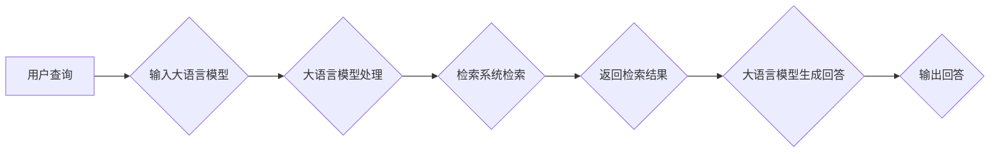

> 大语言模型，检索增强型语言模型，Transformer，BERT，预训练，微调，自然语言处理，搜索，问答系统，多模态

# 大语言模型原理基础与前沿 检索增强型语言模型

> 关键词：
大语言模型，检索增强型语言模型，Transformer，BERT，预训练，微调，自然语言处理，搜索，问答系统，多模态

## 1. 背景介绍

随着互联网的快速发展和信息的爆炸式增长，如何快速、准确地找到所需信息成为了一个重要的挑战。传统的搜索引擎依赖关键词匹配和文本相似度计算，虽然在一定程度上满足了用户的需求，但面对长尾查询和复杂语义理解时，其效果往往不尽如人意。近年来，大语言模型（Large Language Model，LLM）的兴起为检索增强型语言模型（Retrieval-Augmented Language Model，RALM）提供了新的思路和方法。

大语言模型通过在庞大的文本语料库上进行预训练，学习到丰富的语言知识和上下文理解能力，能够在一定程度上模拟人类的自然语言理解能力。而检索增强型语言模型则将大语言模型与检索系统相结合，通过检索增强，进一步提升语言模型的检索和问答能力。

## 2. 核心概念与联系

### 2.1 核心概念

**大语言模型（LLM）**：基于深度学习技术，通过在大量文本语料库上进行预训练，学习到丰富的语言知识和上下文理解能力，能够进行自然语言处理任务。

**检索系统**：根据用户输入的关键词或查询，从数据库中检索相关文档的系统。

**检索增强型语言模型（RALM）**：结合大语言模型和检索系统，通过检索增强，进一步提升语言模型的检索和问答能力。

### 2.2 核心概念原理和架构的 Mermaid 流程图



## 3. 核心算法原理 & 具体操作步骤

### 3.1 算法原理概述

检索增强型语言模型的核心思想是将大语言模型与检索系统相结合，通过检索增强，进一步提升语言模型的检索和问答能力。

具体而言，当用户输入查询时，首先由大语言模型对查询进行理解，然后检索系统根据查询内容从数据库中检索相关文档，最后大语言模型根据检索到的文档生成最终的回答。

### 3.2 算法步骤详解

1. 用户输入查询。
2. 大语言模型对查询进行理解，提取查询的关键信息。
3. 检索系统根据查询的关键信息从数据库中检索相关文档。
4. 大语言模型根据检索到的文档生成最终的回答。
5. 将生成的回答输出给用户。

### 3.3 算法优缺点

**优点**：

* 提升了检索系统的语义理解能力，能够更好地理解用户的查询意图。
* 能够生成更符合用户需求的回答，提高了用户体验。
* 可以处理长尾查询和复杂语义理解，丰富了检索系统的应用场景。

**缺点**：

* 检索系统需要维护庞大的数据库，成本较高。
* 检索和问答过程需要大量的计算资源，对硬件性能要求较高。
* 需要针对不同领域的知识进行个性化调整，增加了开发难度。

### 3.4 算法应用领域

检索增强型语言模型可以应用于以下领域：

* 搜索引擎：提升搜索引擎的语义理解能力和问答能力。
* 问答系统：为用户提供更加精准、个性化的回答。
* 实时对话系统：如客服机器人、智能助手等。
* 多模态检索：结合图像、视频等多模态信息，进行更加全面的检索。

## 4. 数学模型和公式 & 详细讲解 & 举例说明

### 4.1 数学模型构建

检索增强型语言模型通常采用如下数学模型：

$$
P(r|q) = \frac{e^{f(r, q)}}{\sum_{r' \in R} e^{f(r', q)}}
$$

其中，$P(r|q)$ 表示查询 $q$ 对应的检索结果 $r$ 的概率，$f(r, q)$ 表示检索结果 $r$ 与查询 $q$ 之间的相似度函数，$R$ 表示所有可能的检索结果。

### 4.2 公式推导过程

假设检索结果 $r$ 的特征表示为 $r^T = [r_1, r_2, ..., r_n]$，查询 $q$ 的特征表示为 $q^T = [q_1, q_2, ..., q_n]$，则相似度函数 $f(r, q)$ 可以定义为：

$$
f(r, q) = \sum_{i=1}^n r_i q_i
$$

将相似度函数代入概率公式，得到：

$$
P(r|q) = \frac{e^{\sum_{i=1}^n r_i q_i}}{\sum_{r' \in R} e^{\sum_{i=1}^n r'_i q_i}}
$$

### 4.3 案例分析与讲解

以问答系统为例，假设检索结果 $r$ 为一个文档，查询 $q$ 为一个用户问题，则相似度函数 $f(r, q)$ 可以定义为文档与问题的余弦相似度：

$$
f(r, q) = \frac{r^T q}{\|r\| \|q\|}
$$

其中，$\|r\|$ 和 $\|q\|$ 分别表示文档 $r$ 和问题 $q$ 的向量范数。

将余弦相似度代入概率公式，得到：

$$
P(r|q) = \frac{r^T q}{\sum_{r' \in R} r'^T q}
$$

## 5. 项目实践：代码实例和详细解释说明

### 5.1 开发环境搭建

以下是使用Python进行检索增强型语言模型开发的环境配置流程：

1. 安装Anaconda：从官网下载并安装Anaconda，用于创建独立的Python环境。

2. 创建并激活虚拟环境：
```bash
conda create -n ralm-env python=3.8 
conda activate ralm-env
```

3. 安装相关库：
```bash
pip install transformers torch sklearn jieba
```

### 5.2 源代码详细实现

以下是一个简单的检索增强型语言模型示例，使用BERT模型进行文本检索和问答：

```python
import torch
from transformers import BertTokenizer, BertForQuestionAnswering
from sklearn.feature_extraction.text import TfidfVectorizer

def load_data(data_path):
    with open(data_path, 'r', encoding='utf-8') as f:
        lines = f.readlines()
    questions, answers = [], []
    for line in lines:
        q, a = line.strip().split('\t')
        questions.append(q)
        answers.append(a)
    return questions, answers

def search_docs(query, corpus):
    tfidf = TfidfVectorizer()
    corpus_matrix = tfidf.fit_transform(corpus)
    query_vector = tfidf.transform([query])
    similarity_scores = corpus_matrix.dot(query_vector.T)
    top_n = similarity_scores.argsort()[-5:]
    return [corpus[i] for i in top_n]

def answer_question(question, corpus):
    tokenizer = BertTokenizer.from_pretrained('bert-base-uncased')
    model = BertForQuestionAnswering.from_pretrained('bert-base-uncased')
    model.eval()
    inputs = tokenizer(question, return_tensors="pt", padding=True, truncation=True)
    outputs = model(**inputs)
    start_scores, end_scores = outputs.start_logits, outputs.end_logits
    start_index = start_scores.argmax()
    end_index = end_scores.argmax()
    context = corpus[start_index:end_index]
    return context

# 加载数据
corpus = load_data('corpus.txt')
questions, answers = load_data('qa.txt')

# 搜索文档
query = "What is the capital of France?"
top_docs = search_docs(query, corpus)
for doc in top_docs:
    print(doc)

# 问答
question = "What is the capital of France?"
answer = answer_question(question, corpus)
print("Answer:", answer)
```

### 5.3 代码解读与分析

1. `load_data` 函数：加载数据，包括文档和问答对。
2. `search_docs` 函数：使用TF-IDF向量表示法对文档进行检索，返回与查询最相关的文档。
3. `answer_question` 函数：使用BERT模型对检索到的文档进行问答，返回问题答案。

### 5.4 运行结果展示

运行上述代码，将输出与查询 "What is the capital of France?" 最相关的文档，以及问题的答案。

## 6. 实际应用场景

检索增强型语言模型可以应用于以下实际应用场景：

* 搜索引擎：提升搜索引擎的语义理解能力和问答能力。
* 问答系统：为用户提供更加精准、个性化的回答。
* 实时对话系统：如客服机器人、智能助手等。
* 多模态检索：结合图像、视频等多模态信息，进行更加全面的检索。

## 7. 工具和资源推荐

### 7.1 学习资源推荐

* 《深度学习自然语言处理》
* 《Transformers》
* 《Hugging Face Transformers官方文档》
* 《BERT实战：基于PyTorch的NLP应用》

### 7.2 开发工具推荐

* PyTorch
* TensorFlow
* Hugging Face Transformers
* NLTK
* spaCy

### 7.3 相关论文推荐

* "Retrieval-Augmented Generation for Text Summarization"
* "BERT as a Service: Building an Open-Source Retrieval-Augmented Language Model"
* "Learning to Rank for Retrieval-Augmented Language Models"

## 8. 总结：未来发展趋势与挑战

### 8.1 研究成果总结

检索增强型语言模型将大语言模型与检索系统相结合，通过检索增强，进一步提升语言模型的检索和问答能力。该技术已成功应用于搜索引擎、问答系统、实时对话系统等领域，并取得了显著的性能提升。

### 8.2 未来发展趋势

* 结合多模态信息，实现更加全面的检索和问答。
* 将检索增强型语言模型与其他人工智能技术相结合，如知识图谱、因果推理等。
* 开发更加高效的微调和推理算法，降低计算成本。

### 8.3 面临的挑战

* 如何在保证性能的同时，降低计算成本和存储成本。
* 如何处理大规模多模态数据的检索和问答。
* 如何防止模型的偏见和误导。

### 8.4 研究展望

检索增强型语言模型是人工智能领域的重要研究方向，未来将在更多领域发挥重要作用。随着技术的不断发展，我们有理由相信，检索增强型语言模型将为构建更加智能、高效的智能系统做出更大的贡献。

## 9. 附录：常见问题与解答

**Q1：检索增强型语言模型与传统搜索引擎相比，有哪些优势？**

A：检索增强型语言模型在语义理解能力、问答能力和个性化方面具有明显优势，能够更好地满足用户的需求。

**Q2：检索增强型语言模型的计算成本较高，如何降低计算成本？**

A：可以通过模型压缩、量化加速、混合精度训练等方法降低计算成本。

**Q3：检索增强型语言模型如何处理多模态信息？**

A：可以将多模态信息与文本信息进行融合，使用多模态特征表示，进行多模态检索和问答。

**Q4：检索增强型语言模型如何防止偏见和误导？**

A：可以通过引入伦理约束、人工审核等方法防止模型偏见和误导。

---

作者：禅与计算机程序设计艺术 / Zen and the Art of Computer Programming