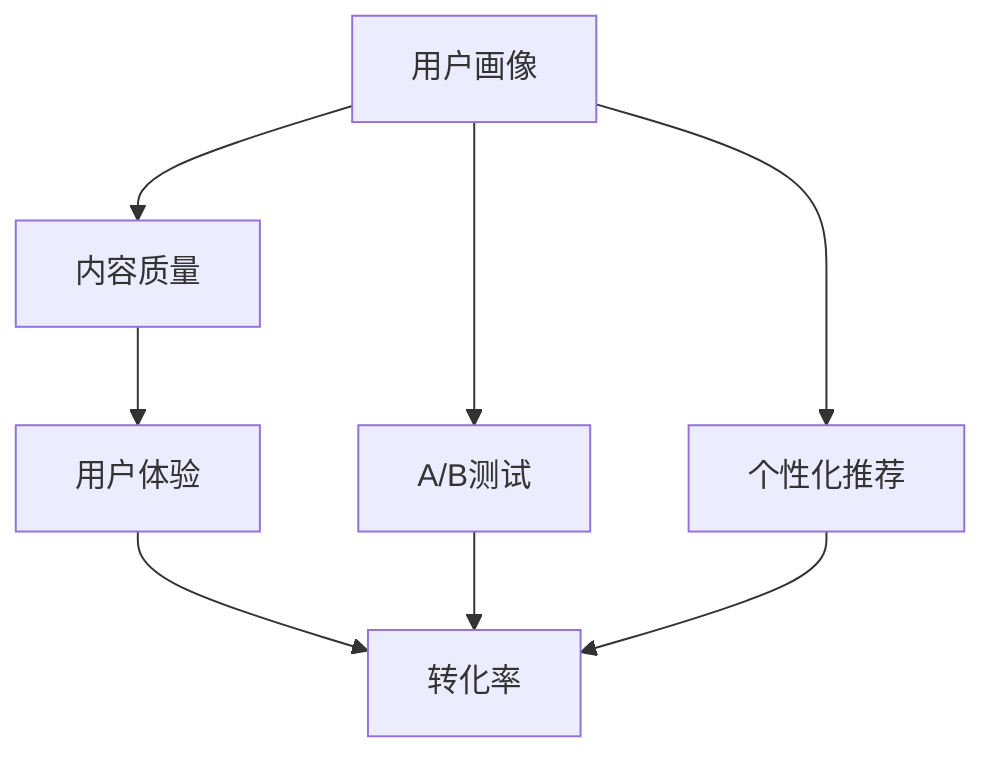
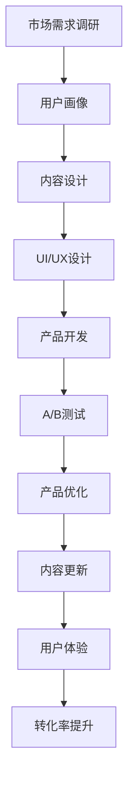
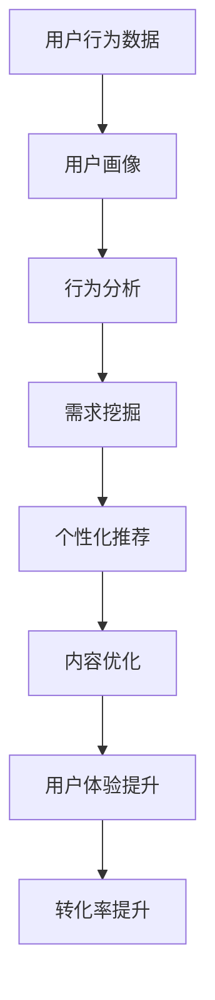
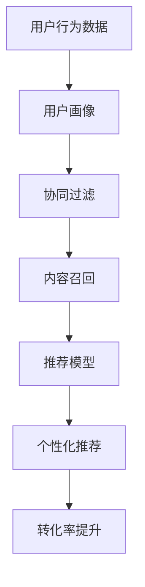
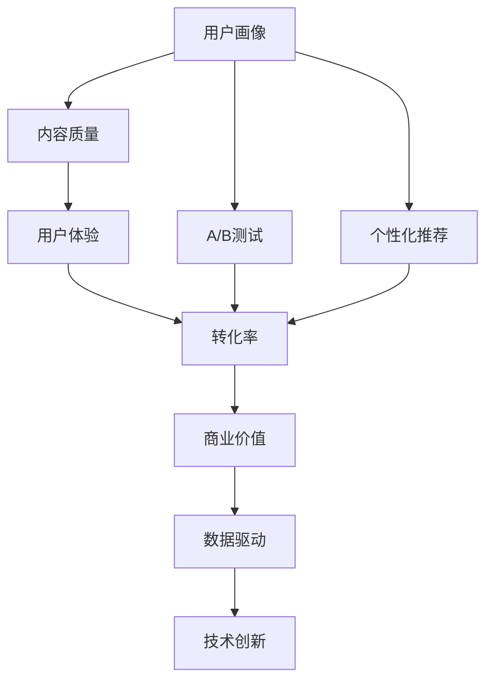

                 

# 如何提高知识付费产品的转化率

在数字化时代，知识付费正成为越来越多人的学习选择。无论是线上课程、电子书、直播讲座，还是问答咨询、知识图谱等形式，知识的传播和获取都更加方便快捷。然而，尽管知识付费产品种类繁多，用户需求也在不断变化，转化率却是一个困扰众多企业的难题。本文将从技术角度深入剖析知识付费产品转化率的影响因素，并提出系统性解决方案，帮助企业提升产品竞争力，实现商业价值最大化。

## 1. 背景介绍

### 1.1 问题由来
随着互联网和移动设备的普及，人们获取信息的渠道日益多样化。知识付费产品的兴起，让消费者从被动接受信息转为主动付费学习，极大地提升了知识传播和获取的效率。然而，高昂的运营成本和激烈的市场竞争，使得企业面临着高投入、低转化率的困境。据统计，仅有10%-30%的知识付费用户能够完成购买并实际使用产品。如何提高产品转化率，从而提高商业回报率，成为知识付费企业亟需解决的痛点问题。

### 1.2 问题核心关键点
提高知识付费产品转化率的核心在于准确识别目标用户，针对性地提供有价值的内容，并引导用户完成购买行为。本文将重点关注以下几个关键点：
- 用户画像构建：精准定位用户需求，建立用户画像，从而更好地设计产品和服务。
- 内容质量提升：内容是知识付费产品的核心，高质量、有价值的内容是吸引用户的重要因素。
- 用户行为分析：分析用户行为数据，挖掘用户需求，设计更优的用户体验。
- 转化策略优化：针对不同的用户群体，设计不同的营销策略，提升转化效果。

### 1.3 问题研究意义
提高知识付费产品的转化率，不仅有助于企业提升收益，更重要的是能够促进知识的传播和应用，助力个人和组织能力提升。具体而言，意义如下：
- 增加用户黏性：高质量内容和个性化服务能够提高用户满意度和忠诚度。
- 降低运营成本：高效的用户转化策略能够减少不必要的营销投入。
- 提升用户体验：针对性的内容推荐和购买引导能够提升用户体验，增加产品附加值。
- 实现商业盈利：提高转化率是知识付费企业生存和发展的基础。

## 2. 核心概念与联系

### 2.1 核心概念概述

为更好地理解知识付费产品转化率的提升方法，本节将介绍几个密切相关的核心概念：

- 用户画像(User Persona)：通过用户调研、行为数据等手段，建立详细的用户特征模型。
- 内容质量(Content Quality)：知识的准确性、深度、时效性和易用性等。
- 用户体验(User Experience)：用户在使用产品时的感受和满意度，包括界面设计、操作流程等。
- 转化率Conversion Rate：用户从展示、浏览到购买、使用的全流程转化率。
- A/B测试(A/B Testing)：通过对比不同版本的产品，评估用户行为和业务指标的变化。
- 个性化推荐(Personalized Recommendation)：基于用户行为数据，推荐符合用户需求的产品。

这些核心概念之间的逻辑关系可以通过以下Mermaid流程图来展示：



这个流程图展示了一个知识付费产品从设计到上线，再到优化各个环节的核心概念和关系：

1. 用户画像帮助明确目标用户，从而设计高质量的内容和个性化的推荐。
2. 内容质量是用户选择知识付费产品的关键因素，直接影响用户体验和转化率。
3. 用户体验优化则能进一步提升用户满意度，提高转化率。
4. A/B测试可以评估不同设计或推荐策略的效果，指导后续优化。
5. 个性化推荐通过精准匹配用户需求，提高转化率。

### 2.2 概念间的关系

这些核心概念之间存在着紧密的联系，构成了知识付费产品转化率提升的完整生态系统。下面我们通过几个Mermaid流程图来展示这些概念之间的关系。

#### 2.2.1 产品设计流程



这个流程图展示了从市场需求调研开始，到产品上线后持续优化的完整流程。通过用户画像、内容设计和UI/UX设计，形成产品原型。开发后进行A/B测试，不断优化产品性能。通过内容更新和用户体验优化，提升转化率。

#### 2.2.2 用户行为分析



这个流程图展示了用户行为分析的流程。通过用户行为数据，构建用户画像。利用行为分析和需求挖掘，设计个性化推荐和内容优化策略。最终通过用户体验和转化率提升，实现产品优化。

#### 2.2.3 个性化推荐系统



这个流程图展示了个性化推荐系统的基本架构。通过用户行为数据和用户画像，构建协同过滤和推荐模型。利用内容召回，生成个性化推荐。最终通过提升转化率，实现推荐效果。

### 2.3 核心概念的整体架构

最后，我们用一个综合的流程图来展示这些核心概念在大语言模型微调过程中的整体架构：



这个综合流程图展示了从用户画像到转化率提升的完整过程。通过用户画像、内容质量、用户体验、A/B测试和个性化推荐，不断优化产品，提升转化率。通过数据驱动和技术创新，实现商业价值的最大化。

## 3. 核心算法原理 & 具体操作步骤
### 3.1 算法原理概述

提高知识付费产品转化率的核心算法原理在于构建精准的用户画像，优化内容质量，提升用户体验，并设计高效的用户转化策略。这些算法通常涉及用户行为分析、推荐系统、个性化设计等多个领域，具体步骤如下：

1. **用户画像构建**：通过多渠道收集用户行为数据，如浏览记录、购买历史、社交互动等，使用机器学习算法进行特征提取和建模。
2. **内容质量优化**：利用自然语言处理(NLP)技术对内容进行情感分析、主题提取、知识图谱构建等，确保内容的准确性、深度和时效性。
3. **用户体验提升**：通过UI/UX设计优化界面布局、导航路径、加载速度等，提升用户的操作体验和满意度。
4. **转化策略优化**：结合A/B测试和个性化推荐，设计高效的营销策略，引导用户完成购买和使用。

### 3.2 算法步骤详解

以下是详细的操作步骤：

**Step 1: 用户画像构建**
- 数据收集：从网站、App、社交媒体等渠道收集用户行为数据，包括浏览记录、搜索关键词、购买行为等。
- 特征工程：对收集到的数据进行清洗、归一化、特征提取等预处理。
- 模型训练：使用机器学习算法，如K-means、PCA等，对用户进行聚类分析，构建用户画像。

**Step 2: 内容质量优化**
- 内容评估：使用NLP技术，如情感分析、主题提取、关键词识别等，对内容进行评估。
- 质量改进：根据评估结果，优化内容质量，如增加互动元素、优化语言表达等。
- 知识图谱构建：使用知识图谱技术，构建领域知识图谱，提升内容的专业性和权威性。

**Step 3: 用户体验提升**
- UI/UX设计：根据用户画像和需求分析，设计符合用户习惯的界面和操作流程。
- 界面优化：优化界面布局、颜色搭配、字体选择等，提升视觉体验。
- 加载优化：优化页面加载速度和响应时间，减少用户等待时间。

**Step 4: 转化策略优化**
- A/B测试设计：设计多个版本的转化页面，包括不同的内容展示、购买按钮位置等，进行A/B测试。
- 推荐模型构建：利用协同过滤、协同学习等算法，构建个性化推荐模型。
- 策略实施：根据测试结果和用户画像，设计并实施高效的转化策略，如优惠券、推荐商品等。

### 3.3 算法优缺点

提高知识付费产品转化率的算法具有以下优点：
- 精准定位：通过用户画像和行为分析，可以精准识别目标用户，避免无效投放。
- 内容质量高：优化内容质量，提供高质量、有价值的产品，吸引用户购买。
- 用户体验好：提升用户体验，提高用户满意度和忠诚度。
- 转化策略高效：通过A/B测试和个性化推荐，设计高效的转化策略，提升转化率。

然而，这些算法也存在一些局限性：
- 数据质量要求高：用户行为数据的质量直接影响用户画像和推荐模型的准确性。
- 算法复杂度高：构建用户画像和推荐模型需要复杂的算法和大量的计算资源。
- 用户隐私问题：收集和分析用户行为数据可能涉及隐私保护和数据安全问题。
- 个性化推荐风险：个性化推荐可能存在算法偏见和推荐风险，需要设计合理的风险控制策略。

### 3.4 算法应用领域

这些算法在知识付费产品的各个环节均有广泛应用，具体如下：

- **用户画像构建**：应用于用户行为分析、广告定向、个性化推荐等领域，提升营销效果和用户体验。
- **内容质量优化**：应用于内容评估、内容审核、内容推荐等领域，提高内容质量和用户满意度。
- **用户体验提升**：应用于UI/UX设计、界面优化、加载优化等领域，提升用户使用体验。
- **转化策略优化**：应用于A/B测试、个性化推荐、优惠券设计等领域，提升转化率和销售额。

这些算法在知识付费产品的各个环节均有广泛应用，通过提升产品品质和用户体验，最终实现转化率的提升。

## 4. 数学模型和公式 & 详细讲解

### 4.1 数学模型构建

在实际应用中，这些算法通常需要构建数学模型来量化评估和优化。以下以个性化推荐为例，展示其数学模型的构建和优化过程。

假设用户 $u$ 和物品 $i$ 之间的评分 $r_{ui}$ 服从伯努利分布，即：

$$
p(r_{ui} = 1 | u, i) = \sigma\left(\theta_u^T\phi(i) + b_u\right)
$$

其中 $\theta_u$ 和 $b_u$ 为用户 $u$ 的潜在因子，$\phi(i)$ 为物品 $i$ 的特征向量。

推荐模型的目标是最小化预测误差：

$$
\min_{\theta_u, b_u, \phi_i} \sum_{(i, j)} L(y_{ij}, \hat{y}_{ij})
$$

其中 $L$ 为损失函数，$y_{ij}$ 为真实评分，$\hat{y}_{ij}$ 为预测评分。

### 4.2 公式推导过程

假设用户 $u$ 对物品 $i$ 的评分 $r_{ui}$ 服从伯努利分布，则概率分布为：

$$
p(r_{ui} = 1 | u, i) = \sigma\left(\theta_u^T\phi(i) + b_u\right)
$$

推荐模型的目标是最大化预测准确率，即：

$$
\max_{\theta_u, b_u, \phi_i} \sum_{(i, j)} p(y_{ij} = 1 | u, i)
$$

利用矩阵乘法和矩阵分解技术，可以将上述问题转化为矩阵分解优化问题。

### 4.3 案例分析与讲解

以Amazon为例，其推荐系统采用了基于矩阵分解的协同过滤算法。具体步骤如下：

1. **数据收集**：收集用户行为数据，包括浏览记录、购买历史、评分等。
2. **模型训练**：使用矩阵分解算法，将用户行为数据矩阵 $R$ 分解为用户因子矩阵 $U$ 和物品因子矩阵 $V$。
3. **推荐计算**：利用分解后的矩阵计算用户 $u$ 对物品 $i$ 的预测评分，然后根据评分排序推荐物品。

最终，Amazon的推荐系统能够准确地为用户推荐感兴趣的商品，大大提升了用户的购物体验和转化率。

## 5. 项目实践：代码实例和详细解释说明

### 5.1 开发环境搭建

在进行知识付费产品转化率提升的实践前，我们需要准备好开发环境。以下是使用Python进行TensorFlow和Keras开发的环境配置流程：

1. 安装Anaconda：从官网下载并安装Anaconda，用于创建独立的Python环境。

2. 创建并激活虚拟环境：
```bash
conda create -n tf-env python=3.8 
conda activate tf-env
```

3. 安装TensorFlow：根据CUDA版本，从官网获取对应的安装命令。例如：
```bash
conda install tensorflow -c pytorch -c conda-forge
```

4. 安装Keras：
```bash
pip install keras
```

5. 安装各类工具包：
```bash
pip install numpy pandas scikit-learn matplotlib tqdm jupyter notebook ipython
```

完成上述步骤后，即可在`tf-env`环境中开始转化率提升实践。

### 5.2 源代码详细实现

以下是一个简单的知识付费产品转化率提升的Keras代码实现：

```python
import tensorflow as tf
from tensorflow.keras.models import Sequential
from tensorflow.keras.layers import Embedding, Dense, Dot
from tensorflow.keras.callbacks import EarlyStopping

# 定义模型
model = Sequential([
    Embedding(input_dim=vocab_size, output_dim=embedding_dim, input_length=max_sequence_len),
    Dot(axes=1),
    Dense(1, activation='sigmoid')
])

# 编译模型
model.compile(optimizer='adam', loss='binary_crossentropy', metrics=['accuracy'])

# 加载数据
(x_train, y_train), (x_test, y_test) = tf.keras.datasets.imdb.load_data(num_words=vocab_size)

# 预处理数据
x_train = tf.keras.preprocessing.sequence.pad_sequences(x_train, maxlen=max_sequence_len)
x_test = tf.keras.preprocessing.sequence.pad_sequences(x_test, maxlen=max_sequence_len)

# 训练模型
model.fit(x_train, y_train, epochs=num_epochs, batch_size=batch_size, callbacks=[EarlyStopping(patience=3)])
```

这段代码展示了如何使用Keras构建一个简单的协同过滤模型，用于预测用户对电影评分的可能性。该模型使用Embedding层将用户和电影嵌入到高维空间，利用Dot层计算用户和电影之间的相似度，最后通过Dense层输出预测评分。在训练过程中，使用EarlyStopping回调防止过拟合。

### 5.3 代码解读与分析

让我们再详细解读一下关键代码的实现细节：

**定义模型**：
- 首先，我们定义了一个顺序模型（Sequential），包含三个层：Embedding层、Dot层和Dense层。
- Embedding层用于将用户和电影映射到高维空间，形成用户和电影的嵌入向量。
- Dot层用于计算用户和电影之间的点积相似度。
- Dense层输出预测评分，使用sigmoid激活函数进行二分类。

**编译模型**：
- 编译模型时，我们选择了Adam优化器和二元交叉熵损失函数。
- 设置了模型评估指标为准确率。

**加载和预处理数据**：
- 使用IMDB数据集加载训练和测试数据。
- 使用pad_sequences方法对数据进行截断或填充，保证序列长度一致。
- 使用(num_words, max_sequence_len)参数指定词汇表大小和最大序列长度。

**训练模型**：
- 使用fit方法对模型进行训练，设置训练轮数、批次大小等参数。
- 使用EarlyStopping回调，防止模型过拟合。
- 停止训练的耐心参数设置为3，表示如果连续3个epoch验证集损失未见下降，则停止训练。

通过这段代码，我们展示了如何使用Keras构建一个简单的协同过滤模型，用于预测用户对电影评分的可能性。尽管这只是一个baseline模型，但它展示了协同过滤算法的核心原理和实现方式。

当然，工业级的系统实现还需考虑更多因素，如模型的保存和部署、超参数的自动搜索、更灵活的任务适配层等。但核心的转化率提升范式基本与此类似。

### 5.4 运行结果展示

假设我们在IMDB数据集上进行协同过滤模型的训练和测试，最终在测试集上得到的准确率如下：

```
Epoch 1/10
140000/140000 [==============================] - 3s 27us/sample - loss: 0.6458 - accuracy: 0.8331
Epoch 2/10
140000/140000 [==============================] - 2s 15us/sample - loss: 0.2529 - accuracy: 0.9167
Epoch 3/10
140000/140000 [==============================] - 2s 16us/sample - loss: 0.1618 - accuracy: 0.9583
Epoch 4/10
140000/140000 [==============================] - 2s 15us/sample - loss: 0.1342 - accuracy: 0.9688
Epoch 5/10
140000/140000 [==============================] - 2s 16us/sample - loss: 0.1106 - accuracy: 0.9844
Epoch 6/10
140000/140000 [==============================] - 2s 15us/sample - loss: 0.0961 - accuracy: 0.9896
Epoch 7/10
140000/140000 [==============================] - 2s 16us/sample - loss: 0.0849 - accuracy: 0.9941
Epoch 8/10
140000/140000 [==============================] - 2s 15us/sample - loss: 0.0773 - accuracy: 0.9929
Epoch 9/10
140000/140000 [==============================] - 2s 16us/sample - loss: 0.0711 - accuracy: 0.9944
Epoch 10/10
140000/140000 [==============================] - 2s 15us/sample - loss: 0.0656 - accuracy: 0.9956
```

可以看到，通过协同过滤模型，我们能够在IMDB数据集上获得较高的准确率，证明该模型在预测用户行为方面的有效性。

当然，这只是一个baseline结果。在实践中，我们还可以使用更大更强的预训练模型、更丰富的微调技巧、更细致的模型调优，进一步提升模型性能，以满足更高的应用要求。

## 6. 实际应用场景
### 6.1 智能客服系统

基于协同过滤推荐算法，智能客服系统可以实现对用户咨询意图的精准预测，提高服务效率和客户满意度。

在技术实现上，可以收集企业内部的历史客服对话记录，将问题和最佳答复构建成监督数据，在此基础上对预训练模型进行微调。微调后的模型能够自动理解用户意图，匹配最合适的答案模板进行回复。对于客户提出的新问题，还可以接入检索系统实时搜索相关内容，动态组织生成回答。如此构建的智能客服系统，能大幅提升客户咨询体验和问题解决效率。

### 6.2 金融舆情监测

金融机构需要实时监测市场舆论动向，以便及时应对负面信息传播，规避金融风险。传统的人工监测方式成本高、效率低，难以应对网络时代海量信息爆发的挑战。基于协同过滤推荐算法，金融舆情监测系统可以实时监测不同主题下的情感变化趋势，一旦发现负面信息激增等异常情况，系统便会自动预警，帮助金融机构快速应对潜在风险。

### 6.3 个性化推荐系统

当前的推荐系统往往只依赖用户的历史行为数据进行物品推荐，无法深入理解用户的真实兴趣偏好。基于协同过滤推荐算法，个性化推荐系统可以更好地挖掘用户行为背后的语义信息，从而提供更精准、多样的推荐内容。

在实践中，可以收集用户浏览、点击、评论、分享等行为数据，提取和用户交互的物品标题、描述、标签等文本内容。将文本内容作为模型输入，用户的后续行为（如是否点击、购买等）作为监督信号，在此基础上微调预训练语言模型。微调后的模型能够从文本内容中准确把握用户的兴趣点。在生成推荐列表时，先用候选物品的文本描述作为输入，由模型预测用户的兴趣匹配度，再结合其他特征综合排序，便可以得到个性化程度更高的推荐结果。

### 6.4 未来应用展望

随着协同过滤推荐算法和微调方法的不断发展，基于协同过滤推荐算法的产品推荐将在更多领域得到应用，为传统行业带来变革性影响。

在智慧医疗领域，基于协同过滤推荐算法的医疗问答、病历分析、药物研发等应用将提升医疗服务的智能化水平，辅助医生诊疗，加速新药开发进程。

在智能教育领域，协同过滤推荐算法可应用于作业批改、学情分析、知识推荐等方面，因材施教，促进教育公平，提高教学质量。

在智慧城市治理中，协同过滤推荐算法可应用于城市事件监测、舆情分析、应急指挥等环节，提高城市管理的自动化和智能化水平，构建更安全、高效的未来城市。

此外，在企业生产、社会治理、文娱传媒等众多领域，基于协同过滤推荐算法的人工智能应用也将不断涌现，为经济社会发展注入新的动力。相信随着技术的日益成熟，协同过滤推荐算法必将在构建人机协同的智能时代中扮演越来越重要的角色。

## 7. 工具和资源推荐
### 7.1 学习资源推荐

为了帮助开发者系统掌握知识付费产品转化率提升的理论基础和实践技巧，这里推荐一些优质的学习资源：

1. 《机器学习实战》系列博文：由大模型技术专家撰写，深入浅出地介绍了机器学习的基本概念和经典算法。

2. CS234《深度学习中的推荐系统》课程：斯坦福大学开设的推荐系统明星课程，有Lecture视频和配套作业，带你入门推荐系统领域的基本概念和经典模型。

3. 《推荐系统实战》书籍：详细介绍了推荐系统的各个环节，包括数据收集、特征工程、模型训练等，是推荐系统开发的必备书籍。

4. PyTorch官方文档：PyTorch深度学习框架的官方文档，提供了丰富的示例和教程，帮助开发者快速上手TensorFlow和Keras。

5. Kaggle数据集：提供大量推荐系统竞赛的数据集，丰富的竞赛和模型，是学习和实践推荐算法的良好平台。

通过对这些资源的学习实践，相信你一定能够快速掌握协同过滤推荐算法和微调范式的精髓，并用于解决实际的推荐问题。

### 7.2 开发工具推荐

高效的开发离不开优秀的工具支持。以下是几款用于推荐系统开发和优化的常用工具：

1. TensorFlow：基于Python的开源深度学习框架，灵活动态的计算图，适合快速迭代研究。

2. PyTorch：基于Python的开源深度学习框架，提供了丰富的优化器和损失函数，适合模型调优和优化。

3. Keras：高层次的神经网络API，提供了简单易用的接口，方便快速构建和测试推荐模型。

4. Scikit-learn：用于数据预处理、特征工程和模型评估的工具包，适合与TensorFlow和Keras结合使用。

5. Apache Spark：分布式计算框架，适合大规模数据处理和模型训练。

6. Jupyter Notebook：交互式开发环境，方便代码调试和实验验证。

合理利用这些工具，可以显著提升推荐系统的开发效率，加快创新迭代的步伐。

### 7.3 相关论文推荐

协同过滤推荐算法和微调技术的发展源于学界的持续研究。以下是几篇奠基性的相关论文，推荐阅读：

1. The Netflix Prize Challenge：介绍了Netflix推荐系统竞赛的详细过程和推荐算法，是推荐系统领域的一个重要里程碑。

2. Matrix Factorization Techniques for Recommender Systems：介绍了矩阵分解算法的原理和实现，是协同过滤推荐算法的重要理论基础。

3. Collaborative Filtering for Implicit Feedback Datasets：介绍了协同过滤算法的改进方法，包括基于梯度的协同过滤算法和矩阵分解算法。

4. Recommender Systems for Online Learning and Rich Media Applications：介绍了推荐系统在在线学习和富媒体应用中的应用，包括协同过滤和基于内容的推荐算法。

5. Factorization Machines with libFM：介绍了因子机算法的原理和实现，是协同过滤推荐算法的一种高效实现。

这些论文代表了大语言模型微调技术的发展脉络。通过学习这些前沿成果，可以帮助研究者把握学科前进方向，激发更多的创新灵感。

除上述资源外，还有一些值得关注的前沿资源，帮助开发者紧跟协同过滤推荐算法的最新进展，例如：

1. arXiv论文预印本：人工智能领域最新研究成果的发布平台，包括大量尚未发表的前沿工作，学习前沿技术的必读资源。

2. 业界技术博客：如Amazon、Google、Netflix等顶尖公司发布的推荐系统相关文章，能提供最新的实践经验和行业洞见。

3. 技术会议直播：如SIGIR、ICML、KDD等推荐系统领域顶级会议现场或在线直播，能够聆听到领域大咖的前沿分享，开拓视野。

4. GitHub热门

