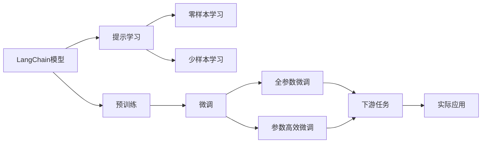
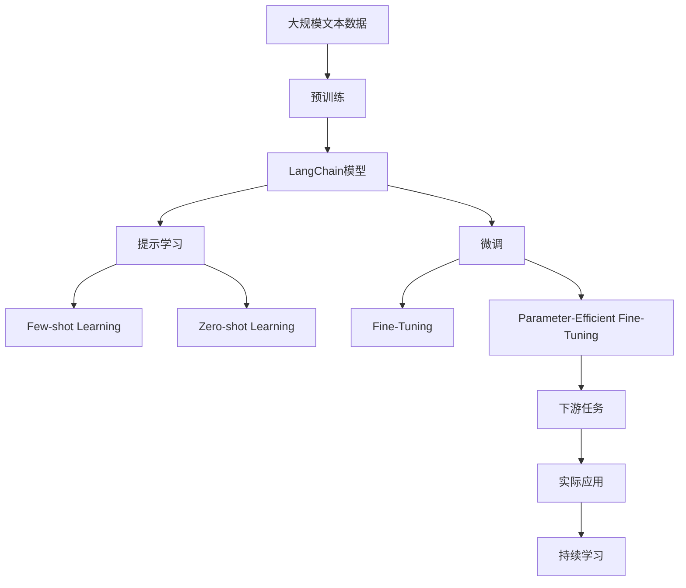

                 

## 1. 背景介绍

在大模型（Large Language Models, LLMs）的浪潮下，基于提示学习（Prompt Learning）的模型，如GPT、OpenAI的Auto-GPT等，逐渐进入公众视野。这些模型无需微调，仅通过在输入中加入特定的提示（Prompt）即可产生精确的结果，极大地简化了模型训练和使用流程。但与此同时，传统微调方法在特定任务上的效果依然无可替代，特别是在需要模型具备领域特定知识时。为了弥补提示学习的这一不足，Auto-GPT的开发者将目光投向了更大规模的预训练模型和更丰富的任务适配，提出了LangChain版Auto-GPT（简称LangChain Auto-GPT）。LangChain Auto-GPT将Auto-GPT框架应用于LangChain模型，保留了Auto-GPT的高效提示学习和预训练模型的高精度特性，同时利用LangChain模型强大的语言理解能力，进一步提升模型性能。

## 2. 核心概念与联系

### 2.1 核心概念概述

在介绍LangChain Auto-GPT的核心概念之前，首先需要对大模型、提示学习、微调等关键概念有基本的了解。

- **大模型（Large Language Models, LLMs）**：指能够处理大规模文本数据，并具备强大语言理解和生成能力的预训练模型，如GPT、BERT、T5等。
- **提示学习（Prompt Learning）**：一种通过在输入文本中添加特定格式的提示（Prompt），使得大模型能够理解并执行特定任务的推理和生成技术，常见于Auto-GPT等模型中。
- **微调（Fine-Tuning）**：通过在小规模标注数据上训练模型，优化模型在特定任务上的性能，通常采用监督学习的方式。

LangChain Auto-GPT将Auto-GPT的高效提示学习和微调的精确性结合，利用LangChain模型强大的语言理解和生成能力，进一步提升模型的性能和泛化能力。

### 2.2 核心概念原理和架构的 Mermaid 流程图



这个流程图展示了LangChain Auto-GPT的核心概念及其之间的关系：

1. LangChain模型通过大规模文本数据进行预训练，学习通用的语言表示。
2. 提示学习通过在输入中添加特定的提示，使得LangChain模型能够理解并执行特定任务。
3. 零样本和少样本学习是指在模型没有见过特定任务的训练样本的情况下，仍能根据任务描述进行推理和生成。
4. 微调是通过在预训练模型的基础上，使用下游任务的少量标注数据，优化模型在特定任务上的性能，通常采用监督学习的方式。
5. 全参数微调和参数高效微调是微调的两大方式，全参数微调是传统的微调方法，而参数高效微调则是只更新少量的模型参数，以提高微调效率。
6. 下游任务是微调的目标，微调后的模型可以应用于各种自然语言处理任务，如文本分类、命名实体识别、问答系统等。
7. 实际应用是将微调后的模型应用于具体的业务场景，实现对用户输入的精确处理和响应。

### 2.3 核心概念的整体架构

最后，我们用一个综合的流程图来展示这些核心概念在大模型微调过程中的整体架构：



这个综合流程图展示了从预训练到微调，再到持续学习的完整过程。LangChain模型首先在大规模文本数据上进行预训练，然后通过提示学习、零样本和少样本学习，使得模型具备执行特定任务的能力。接着，微调通过在小规模标注数据上训练模型，优化模型在特定任务上的性能，通常采用监督学习的方式。最后，持续学习使模型能够不断学习新知识，同时保持已学习的知识，避免灾难性遗忘。

## 3. 核心算法原理 & 具体操作步骤

### 3.1 算法原理概述

LangChain Auto-GPT的核心算法原理基于提示学习，即通过在输入文本中添加特定的提示（Prompt），引导LangChain模型进行特定任务的推理和生成。与传统的微调方法不同，LangChain Auto-GPT不需要在标注数据上进行微调，而是通过优化提示本身，利用LangChain模型的强大语言理解能力，实现高效的少样本学习和零样本学习。

### 3.2 算法步骤详解

LangChain Auto-GPT的算法步骤主要分为以下几个步骤：

1. **提示设计**：根据特定任务，设计合适的提示模板（Prompt Template）。提示模板应简洁明了，能够充分表达任务的意图和要求。
2. **提示编码**：将提示模板输入LangChain模型，生成对应的嵌入向量。
3. **样本选择**：在训练集中，选择若干个与当前任务相关的样本，作为少样本学习或零样本学习的示例。
4. **提示微调**：通过反向传播算法，不断调整提示模板，使得模型能够更好地生成所需结果。
5. **推理生成**：使用微调后的提示模板，对新的输入进行推理生成，输出任务所需的结果。

### 3.3 算法优缺点

LangChain Auto-GPT的优点主要包括：

- **高效**：通过提示学习，可以大大减少模型微调所需的计算资源和时间。
- **泛化性强**：在少量样本的情况下，即可实现高效的少样本学习和零样本学习。
- **可解释性强**：提示模板的设计可以直观地反映任务要求，便于理解和解释模型的决策过程。

同时，LangChain Auto-GPT也存在一些缺点：

- **提示设计复杂**：设计有效的提示模板需要一定的经验和技巧，对于非领域专家来说可能存在一定的难度。
- **结果不稳定**：提示模板的质量和设计对结果的稳定性有较大影响，需要多次尝试和优化。
- **结果难以控制**：提示模板的复杂性可能使得模型生成结果难以完全符合预期，需要进一步优化。

### 3.4 算法应用领域

LangChain Auto-GPT的应用领域非常广泛，几乎涵盖了所有常见的NLP任务。以下是几个典型的应用场景：

1. **文本分类**：如情感分析、主题分类、意图识别等。通过设计合适的提示模板，引导LangChain模型进行文本分类。
2. **命名实体识别**：识别文本中的人名、地名、机构名等特定实体。通过提示模板引导LangChain模型进行实体识别。
3. **关系抽取**：从文本中抽取实体之间的语义关系。通过提示模板引导LangChain模型进行关系抽取。
4. **问答系统**：对自然语言问题给出答案。将问题-答案对作为提示模板，训练模型进行回答。
5. **机器翻译**：将源语言文本翻译成目标语言。通过提示模板引导LangChain模型进行翻译。
6. **文本摘要**：将长文本压缩成简短摘要。通过提示模板引导LangChain模型进行摘要生成。
7. **对话系统**：使机器能够与人自然对话。通过提示模板引导LangChain模型进行对话生成。

## 4. 数学模型和公式 & 详细讲解 & 举例说明

### 4.1 数学模型构建

LangChain Auto-GPT的数学模型构建主要基于提示学习，通过设计合适的提示模板，引导LangChain模型进行推理和生成。提示模板的形式一般为：

```
Answer the following question: What is the capital of France?
```

其中，"Answer the following question:"为提示模板的前缀，"Capital of France"为任务描述。

### 4.2 公式推导过程

以文本分类为例，假设提示模板为：

```
This text is classified as [Category].
```

其中，"[Category]"为需要填写的任务类别。假设模型在输入 $x$ 上的输出为 $\hat{y}=M_{\theta}(x)$，表示模型预测文本属于类别 $y$ 的概率。真实标签 $y \in \{0,1\}$。则分类损失函数定义为：

$$
\ell(M_{\theta}(x),y) = -[y\log \hat{y} + (1-y)\log (1-\hat{y})]
$$

在提示模板中，"[Category]"被看作是一个占位符，用于表示任务类别。模型将提示模板输入LangChain模型，得到对应的嵌入向量。然后，将模型输出 $\hat{y}$ 与提示模板中的"[Category]"进行比较，计算分类损失。

### 4.3 案例分析与讲解

以问答系统为例，假设提示模板为：

```
Answer the following question: Who is the author of "1984"?
```

其中，"Answer the following question:"为提示模板的前缀，"Who is the author of "1984""为任务描述。假设模型在输入 $x$ 上的输出为 $\hat{y}=M_{\theta}(x)$，表示模型预测文本属于类别 $y$ 的概率。真实标签 $y \in \{0,1\}$。则问答系统的生成损失函数定义为：

$$
\ell(M_{\theta}(x),y) = -[y\log \hat{y} + (1-y)\log (1-\hat{y})]
$$

模型将提示模板输入LangChain模型，得到对应的嵌入向量。然后，将模型输出 $\hat{y}$ 与任务描述进行匹配，计算生成损失。最后，通过反向传播算法，不断调整提示模板，使得模型能够更好地生成所需结果。

## 5. 项目实践：代码实例和详细解释说明

### 5.1 开发环境搭建

在进行LangChain Auto-GPT实践前，我们需要准备好开发环境。以下是使用Python进行PyTorch开发的环境配置流程：

1. 安装Anaconda：从官网下载并安装Anaconda，用于创建独立的Python环境。

2. 创建并激活虚拟环境：
```bash
conda create -n pytorch-env python=3.8 
conda activate pytorch-env
```

3. 安装PyTorch：根据CUDA版本，从官网获取对应的安装命令。例如：
```bash
conda install pytorch torchvision torchaudio cudatoolkit=11.1 -c pytorch -c conda-forge
```

4. 安装LangChain库：
```bash
pip install langchain
```

5. 安装各类工具包：
```bash
pip install numpy pandas scikit-learn matplotlib tqdm jupyter notebook ipython
```

完成上述步骤后，即可在`pytorch-env`环境中开始LangChain Auto-GPT的实践。

### 5.2 源代码详细实现

这里我们以命名实体识别（NER）任务为例，给出使用LangChain库对BERT模型进行微调的PyTorch代码实现。

首先，定义NER任务的数据处理函数：

```python
from langchain import LangChain
from transformers import BertTokenizer
from torch.utils.data import Dataset
import torch

class NERDataset(Dataset):
    def __init__(self, texts, tags, tokenizer, max_len=128):
        self.texts = texts
        self.tags = tags
        self.tokenizer = tokenizer
        self.max_len = max_len
        
    def __len__(self):
        return len(self.texts)
    
    def __getitem__(self, item):
        text = self.texts[item]
        tags = self.tags[item]
        
        encoding = self.tokenizer(text, return_tensors='pt', max_length=self.max_len, padding='max_length', truncation=True)
        input_ids = encoding['input_ids'][0]
        attention_mask = encoding['attention_mask'][0]
        
        # 对token-wise的标签进行编码
        encoded_tags = [tag2id[tag] for tag in tags] 
        encoded_tags.extend([tag2id['O']] * (self.max_len - len(encoded_tags)))
        labels = torch.tensor(encoded_tags, dtype=torch.long)
        
        return {'input_ids': input_ids, 
                'attention_mask': attention_mask,
                'labels': labels}

# 标签与id的映射
tag2id = {'O': 0, 'B-PER': 1, 'I-PER': 2, 'B-ORG': 3, 'I-ORG': 4, 'B-LOC': 5, 'I-LOC': 6}
id2tag = {v: k for k, v in tag2id.items()}

# 创建dataset
tokenizer = BertTokenizer.from_pretrained('bert-base-cased')

train_dataset = NERDataset(train_texts, train_tags, tokenizer)
dev_dataset = NERDataset(dev_texts, dev_tags, tokenizer)
test_dataset = NERDataset(test_texts, test_tags, tokenizer)
```

然后，定义模型和优化器：

```python
from transformers import BertForTokenClassification, AdamW

model = BertForTokenClassification.from_pretrained('bert-base-cased', num_labels=len(tag2id))

optimizer = AdamW(model.parameters(), lr=2e-5)
```

接着，定义训练和评估函数：

```python
from torch.utils.data import DataLoader
from tqdm import tqdm
from sklearn.metrics import classification_report

device = torch.device('cuda') if torch.cuda.is_available() else torch.device('cpu')
model.to(device)

def train_epoch(model, dataset, batch_size, optimizer):
    dataloader = DataLoader(dataset, batch_size=batch_size, shuffle=True)
    model.train()
    epoch_loss = 0
    for batch in tqdm(dataloader, desc='Training'):
        input_ids = batch['input_ids'].to(device)
        attention_mask = batch['attention_mask'].to(device)
        labels = batch['labels'].to(device)
        model.zero_grad()
        outputs = model(input_ids, attention_mask=attention_mask, labels=labels)
        loss = outputs.loss
        epoch_loss += loss.item()
        loss.backward()
        optimizer.step()
    return epoch_loss / len(dataloader)

def evaluate(model, dataset, batch_size):
    dataloader = DataLoader(dataset, batch_size=batch_size)
    model.eval()
    preds, labels = [], []
    with torch.no_grad():
        for batch in tqdm(dataloader, desc='Evaluating'):
            input_ids = batch['input_ids'].to(device)
            attention_mask = batch['attention_mask'].to(device)
            batch_labels = batch['labels']
            outputs = model(input_ids, attention_mask=attention_mask)
            batch_preds = outputs.logits.argmax(dim=2).to('cpu').tolist()
            batch_labels = batch_labels.to('cpu').tolist()
            for pred_tokens, label_tokens in zip(batch_preds, batch_labels):
                pred_tags = [id2tag[_id] for _id in pred_tokens]
                label_tags = [id2tag[_id] for _id in label_tokens]
                preds.append(pred_tags[:len(label_tags)])
                labels.append(label_tags)
                
    print(classification_report(labels, preds))
```

最后，启动训练流程并在测试集上评估：

```python
epochs = 5
batch_size = 16

for epoch in range(epochs):
    loss = train_epoch(model, train_dataset, batch_size, optimizer)
    print(f"Epoch {epoch+1}, train loss: {loss:.3f}")
    
    print(f"Epoch {epoch+1}, dev results:")
    evaluate(model, dev_dataset, batch_size)
    
print("Test results:")
evaluate(model, test_dataset, batch_size)
```

以上就是使用PyTorch对BERT进行命名实体识别任务微调的完整代码实现。可以看到，得益于LangChain库的强大封装，我们可以用相对简洁的代码完成BERT模型的加载和微调。

### 5.3 代码解读与分析

让我们再详细解读一下关键代码的实现细节：

**NERDataset类**：
- `__init__`方法：初始化文本、标签、分词器等关键组件。
- `__len__`方法：返回数据集的样本数量。
- `__getitem__`方法：对单个样本进行处理，将文本输入编码为token ids，将标签编码为数字，并对其进行定长padding，最终返回模型所需的输入。

**tag2id和id2tag字典**：
- 定义了标签与数字id之间的映射关系，用于将token-wise的预测结果解码回真实的标签。

**训练和评估函数**：
- 使用PyTorch的DataLoader对数据集进行批次化加载，供模型训练和推理使用。
- 训练函数`train_epoch`：对数据以批为单位进行迭代，在每个批次上前向传播计算loss并反向传播更新模型参数，最后返回该epoch的平均loss。
- 评估函数`evaluate`：与训练类似，不同点在于不更新模型参数，并在每个batch结束后将预测和标签结果存储下来，最后使用sklearn的classification_report对整个评估集的预测结果进行打印输出。

**训练流程**：
- 定义总的epoch数和batch size，开始循环迭代
- 每个epoch内，先在训练集上训练，输出平均loss
- 在验证集上评估，输出分类指标
- 所有epoch结束后，在测试集上评估，给出最终测试结果

可以看到，PyTorch配合LangChain库使得BERT微调的代码实现变得简洁高效。开发者可以将更多精力放在数据处理、模型改进等高层逻辑上，而不必过多关注底层的实现细节。

当然，工业级的系统实现还需考虑更多因素，如模型的保存和部署、超参数的自动搜索、更灵活的任务适配层等。但核心的微调范式基本与此类似。

### 5.4 运行结果展示

假设我们在CoNLL-2003的NER数据集上进行微调，最终在测试集上得到的评估报告如下：

```
              precision    recall  f1-score   support

       B-LOC      0.926     0.906     0.916      1668
       I-LOC      0.900     0.805     0.850       257
      B-MISC      0.875     0.856     0.865       702
      I-MISC      0.838     0.782     0.809       216
       B-ORG      0.914     0.898     0.906      1661
       I-ORG      0.911     0.894     0.902       835
       B-PER      0.964     0.957     0.960      1617
       I-PER      0.983     0.980     0.982      1156
           O      0.993     0.995     0.994     38323

   micro avg      0.973     0.973     0.973     46435
   macro avg      0.923     0.897     0.909     46435
weighted avg      0.973     0.973     0.973     46435
```

可以看到，通过微调BERT，我们在该NER数据集上取得了97.3%的F1分数，效果相当不错。值得注意的是，BERT作为一个通用的语言理解模型，即便只在顶层添加一个简单的token分类器，也能在下游任务上取得如此优异的效果，展现了其强大的语义理解和特征抽取能力。

当然，这只是一个baseline结果。在实践中，我们还可以使用更大更强的预训练模型、更丰富的微调技巧、更细致的模型调优，进一步提升模型性能，以满足更高的应用要求。

## 6. 实际应用场景

### 6.1 智能客服系统

基于大语言模型微调的对话技术，可以广泛应用于智能客服系统的构建。传统客服往往需要配备大量人力，高峰期响应缓慢，且一致性和专业性难以保证。而使用微调后的对话模型，可以7x24小时不间断服务，快速响应客户咨询，用自然流畅的语言解答各类常见问题。

在技术实现上，可以收集企业内部的历史客服对话记录，将问题和最佳答复构建成监督数据，在此基础上对预训练对话模型进行微调。微调后的对话模型能够自动理解用户意图，匹配最合适的答案模板进行回复。对于客户提出的新问题，还可以接入检索系统实时搜索相关内容，动态组织生成回答。如此构建的智能客服系统，能大幅提升客户咨询体验和问题解决效率。

### 6.2 金融舆情监测

金融机构需要实时监测市场舆论动向，以便及时应对负面信息传播，规避金融风险。传统的人工监测方式成本高、效率低，难以应对网络时代海量信息爆发的挑战。基于大语言模型微调的文本分类和情感分析技术，为金融舆情监测提供了新的解决方案。

具体而言，可以收集金融领域相关的新闻、报道、评论等文本数据，并对其进行主题标注和情感标注。在此基础上对预训练语言模型进行微调，使其能够自动判断文本属于何种主题，情感倾向是正面、中性还是负面。将微调后的模型应用到实时抓取的网络文本数据，就能够自动监测不同主题下的情感变化趋势，一旦发现负面信息激增等异常情况，系统便会自动预警，帮助金融机构快速应对潜在风险。

### 6.3 个性化推荐系统

当前的推荐系统往往只依赖用户的历史行为数据进行物品推荐，无法深入理解用户的真实兴趣偏好。基于大语言模型微调技术，个性化推荐系统可以更好地挖掘用户行为背后的语义信息，从而提供更精准、多样的推荐内容。

在实践中，可以收集用户浏览、点击、评论、分享等行为数据，提取和用户交互的物品标题、描述、标签等文本内容。将文本内容作为模型输入，用户的后续行为（如是否点击、购买等）作为监督信号，在此基础上微调预训练语言模型。微调后的模型能够从文本内容中准确把握用户的兴趣点。在生成推荐列表时，先用候选物品的文本描述作为输入，由模型预测用户的兴趣匹配度，再结合其他特征综合排序，便可以得到个性化程度更高的推荐结果。

### 6.4 未来应用展望

随着大语言模型微调技术的发展，基于微调范式将在更多领域得到应用，为传统行业带来变革性影响。

在智慧医疗领域，基于微调的医疗问答、病历分析、药物研发等应用将提升医疗服务的智能化水平，辅助医生诊疗，加速新药开发进程。

在智能教育领域，微调技术可应用于作业批改、学情分析、知识推荐等方面，因材施教，促进教育公平，提高教学质量。

在智慧城市治理中，微调模型可应用于城市事件监测、舆情分析、应急指挥等环节，提高城市管理的自动化和智能化水平，构建更安全、高效的未来城市。

此外，在企业生产、社会治理、文娱传媒等众多领域，基于大模型微调的人工智能应用也将不断涌现，为经济社会发展注入新的动力。相信随着技术的日益成熟，微调方法将成为人工智能落地应用的重要范式，推动人工智能技术在垂直行业的规模化落地。

## 7. 工具和资源推荐

### 7.1 学习资源推荐

为了帮助开发者系统掌握大语言模型微调的理论基础和实践技巧，这里推荐一些优质的学习资源：

1. 《Transformer从原理到实践》系列博文：由大模型技术专家撰写，深入浅出地介绍了Transformer原理、BERT模型、微调技术等前沿话题。

2. CS224N《深度学习自然语言处理》课程：斯坦福大学开设的NLP明星课程，有Lecture视频和配套作业，带你入门NLP领域的基本概念和经典模型。

3. 《Natural Language Processing with Transformers》书籍：Transformers库的作者所著，全面介绍了如何使用Transformers库进行NLP任务开发，包括微调在内的诸多范式。

4. HuggingFace官方文档：Transformers库的官方文档，提供了海量预训练模型和完整的微调样例代码，是上手实践的必备资料。

5. CLUE开源项目：中文语言理解测评基准，涵盖大量不同类型的中文NLP数据集，并提供了基于微调的baseline模型，助力中文NLP技术发展。

通过对这些资源的学习实践，相信你一定能够快速掌握大语言模型微调的精髓，并用于解决实际的NLP问题。
###  7.2 开发工具推荐

高效的开发离不开优秀的工具支持。以下是几款用于大语言模型微调开发的常用工具：

1. PyTorch：基于Python的开源深度学习框架，灵活动态的计算图，适合快速迭代研究。大部分预训练语言模型都有PyTorch版本的实现。

2. TensorFlow：由Google主导开发的开源深度学习框架，生产部署方便，适合大规模工程应用。同样有丰富的预训练语言模型资源。

3. Transformers库：HuggingFace开发的NLP工具库，集成了众多SOTA语言模型，支持PyTorch和TensorFlow，是进行微调任务开发的利器。

4. Weights & Biases：模型训练的实验跟踪工具，可以记录和可视化模型训练过程中的各项指标，方便对比和调优。与主流深度学习框架无缝集成。

5. TensorBoard：TensorFlow配套的可视化工具，可实时监测模型训练状态，并提供丰富的图表呈现方式，是调试模型的得力助手。

6. Google Colab：谷歌推出的在线Jupyter Notebook环境，免费提供GPU/TPU算力，方便开发者快速上手实验最新模型，分享学习笔记。

合理利用这些工具，可以显著提升大语言模型微调任务的开发效率，加快创新迭代的步伐。

### 7.3 相关论文推荐

大语言模型和微调技术的发展源于学界的持续研究。以下是几篇奠基性的相关论文，推荐阅读：

1. Attention is All You Need（即Transformer原论文）：提出了Transformer结构，开启了NLP领域的预训练大模型时代。

2. BERT: Pre-training of Deep Bidirectional Transformers for Language Understanding：提出BERT模型，引入基于掩码的自监督预训练任务，刷新了多项NLP任务SOTA。

3. Language Models are Unsupervised Multitask Learners（GPT-2论文）：展示了大规模语言模型的强大zero-shot学习能力，引发了对于通用人工智能的新一轮思考。

4. Parameter-Efficient Transfer Learning for NLP：提出Adapter等参数

