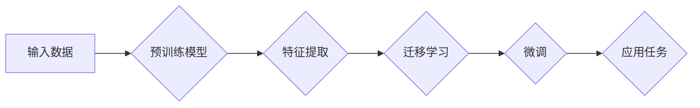

> 开源模型，中国AI，深度学习，预训练，迁移学习，人工智能应用

# 开源模型在中国AI应用中的作用

随着深度学习技术的迅猛发展，人工智能（AI）已经渗透到各行各业，成为推动社会进步的重要力量。在这个过程中，开源模型发挥了不可或缺的作用。本文将探讨开源模型在中国AI应用中的重要作用，分析其原理、实践、应用场景以及未来发展趋势。

## 1. 背景介绍

近年来，深度学习在图像识别、语音识别、自然语言处理等领域取得了突破性进展。然而，深度学习模型的训练和部署过程复杂，需要大量的计算资源和专业知识。为了降低AI应用门槛，开源模型应运而生。

开源模型是指将深度学习模型的设计、实现和训练过程公开，供全球开发者免费使用和修改。这些模型通常基于大量的数据集进行预训练，具有良好的通用性和迁移能力。

## 2. 核心概念与联系

### 2.1 核心概念

- **深度学习（Deep Learning）**：一种利用深层神经网络模拟人脑处理信息的方法，通过学习大量数据来提取特征和模式。
- **预训练（Pre-training）**：在特定领域或任务上对模型进行预先训练，使其具备一定的通用性，降低后续微调的难度。
- **迁移学习（Transfer Learning）**：利用在特定领域预训练的模型，将其应用于其他相关领域，以提高新任务的性能。
- **开源模型**：将深度学习模型的设计、实现和训练过程公开，供全球开发者免费使用和修改。

### 2.2 架构流程图



## 3. 核心算法原理 & 具体操作步骤

### 3.1 算法原理概述

开源模型的核心原理是通过预训练和迁移学习来降低AI应用门槛。预训练模型在大量无标注数据上学习通用的特征表示，而迁移学习则将预训练模型应用于特定领域，通过微调来适应新任务。

### 3.2 算法步骤详解

1. **数据准备**：收集相关领域的大量数据，用于预训练模型。
2. **预训练**：在无标注数据上训练模型，提取通用特征表示。
3. **迁移学习**：将预训练模型应用于特定领域，通过微调来适应新任务。
4. **微调**：在标注数据上进一步训练模型，优化模型参数。
5. **应用**：将微调后的模型应用于实际任务，如图像识别、语音识别等。

### 3.3 算法优缺点

**优点**：

- 降低AI应用门槛：开源模型提供现成的预训练模型和工具，开发者无需从头开始，可以快速构建AI应用。
- 提高效率：预训练模型学习到的通用特征表示，可以加速后续微调过程。
- 促进创新：开源模型鼓励开发者进行改进和创新，推动AI技术发展。

**缺点**：

- 需要大量数据：预训练模型需要大量数据来学习通用特征表示。
- 模型选择困难：开源模型种类繁多，开发者需要根据具体任务选择合适的模型。
- 知识产权问题：开源模型可能存在知识产权问题，需要开发者注意相关法律法规。

### 3.4 算法应用领域

开源模型在以下领域得到广泛应用：

- **图像识别**：如人脸识别、物体检测、图像分类等。
- **语音识别**：如语音转文字、语音识别、语音合成等。
- **自然语言处理**：如机器翻译、文本分类、情感分析等。
- **推荐系统**：如商品推荐、电影推荐、新闻推荐等。

## 4. 数学模型和公式 & 详细讲解 & 举例说明

### 4.1 数学模型构建

深度学习模型通常由多个神经网络层组成，其中最常见的是卷积神经网络（CNN）和循环神经网络（RNN）。以下是一个简单的CNN数学模型：

$$
\hat{y} = f(W^{[L]} \cdot \sigma(W^{[L-1]} \cdot \sigma(\ldots \sigma(W^{[2]} \cdot \sigma(W^{[1]} \cdot x) + b^{[1]}) + \ldots + b^{[L-1]})) + b^{[L]})
$$

其中：

- $\hat{y}$ 是模型的预测输出。
- $W^{[l]}$ 是第 $l$ 层的权重。
- $b^{[l]}$ 是第 $l$ 层的偏置。
- $\sigma$ 是激活函数，如ReLU、Sigmoid等。
- $f$ 是输出函数，如softmax等。

### 4.2 公式推导过程

以ReLU激活函数为例，其导数为：

$$
\sigma'(x) = \begin{cases} 
0 & \text{if } x < 0 \\
1 & \text{if } x \geq 0 
\end{cases}
$$

### 4.3 案例分析与讲解

以下是一个使用开源模型进行图像分类的案例：

1. **数据准备**：收集大量图像数据，如CIFAR-10数据集。
2. **预训练**：使用VGG19模型在ImageNet数据集上进行预训练，提取图像特征。
3. **迁移学习**：将预训练的VGG19模型应用于CIFAR-10数据集，通过微调来适应新任务。
4. **微调**：在CIFAR-10数据集上进一步训练模型，优化模型参数。
5. **应用**：将微调后的模型应用于新的图像分类任务。

## 5. 项目实践：代码实例和详细解释说明

### 5.1 开发环境搭建

1. 安装Anaconda，创建Python虚拟环境。
2. 安装TensorFlow或PyTorch等深度学习框架。
3. 安装必要的库，如Keras、OpenCV等。

### 5.2 源代码详细实现

以下是一个使用TensorFlow和Keras实现图像分类的代码示例：

```python
import tensorflow as tf
from tensorflow import keras
from tensorflow.keras.models import Sequential
from tensorflow.keras.layers import Conv2D, MaxPooling2D, Flatten, Dense, Dropout

# 加载数据
(x_train, y_train), (x_test, y_test) = keras.datasets.cifar10.load_data()

# 数据预处理
x_train = x_train.astype('float32') / 255.0
x_test = x_test.astype('float32') / 255.0
y_train = keras.utils.to_categorical(y_train, 10)
y_test = keras.utils.to_categorical(y_test, 10)

# 构建模型
model = Sequential([
    Conv2D(32, (3, 3), activation='relu', input_shape=(32, 32, 3)),
    MaxPooling2D((2, 2)),
    Conv2D(64, (3, 3), activation='relu'),
    MaxPooling2D((2, 2)),
    Flatten(),
    Dense(64, activation='relu'),
    Dropout(0.5),
    Dense(10, activation='softmax')
])

# 编译模型
model.compile(optimizer='adam', loss='categorical_crossentropy', metrics=['accuracy'])

# 训练模型
model.fit(x_train, y_train, batch_size=32, epochs=10, validation_data=(x_test, y_test))

# 评估模型
test_loss, test_acc = model.evaluate(x_test, y_test)
print(f'Test accuracy: {test_acc:.4f}')
```

### 5.3 代码解读与分析

该代码使用CIFAR-10数据集进行图像分类。首先，加载并预处理数据，将图像数据归一化到0-1范围内，并将标签转换为one-hot编码。然后，构建一个包含卷积层、池化层、全连接层和Dropout层的神经网络模型。接着，编译模型，设置优化器、损失函数和评价指标。最后，训练模型，并在测试集上评估模型性能。

## 6. 实际应用场景

### 6.1 图像识别

开源模型在图像识别领域得到广泛应用，例如：

- **人脸识别**：用于身份验证、安防监控等场景。
- **物体检测**：用于自动驾驶、工业质检等场景。
- **图像分类**：用于图像搜索、内容审核等场景。

### 6.2 语音识别

开源模型在语音识别领域也取得显著成果，例如：

- **语音转文字**：用于实时字幕、语音助手等场景。
- **语音识别**：用于智能客服、语音导航等场景。
- **语音合成**：用于语音助手、语音动画等场景。

### 6.3 自然语言处理

开源模型在自然语言处理领域也有广泛应用，例如：

- **机器翻译**：用于跨语言沟通、多语言内容创作等场景。
- **文本分类**：用于垃圾邮件过滤、情感分析等场景。
- **问答系统**：用于智能客服、知识库等场景。

## 7. 工具和资源推荐

### 7.1 学习资源推荐

- 《深度学习》（Goodfellow、Bengio、Courville著）
- 《神经网络与深度学习》（邱锡鹏著）
- 《PyTorch深度学习实战》（贾华著）

### 7.2 开发工具推荐

- TensorFlow
- PyTorch
- Keras
- OpenCV

### 7.3 相关论文推荐

- "ImageNet Classification with Deep Convolutional Neural Networks"（Alex Krizhevsky et al.）
- "AlexNet: Image Classification with Deep Convolutional Neural Networks"（Alex Krizhevsky et al.）
- "VGGNet: Very Deep Convolutional Networks for Large-Scale Image Recognition"（Karen Simonyan and Andrew Zisserman）
- "GoogLeNet: Going Deeper with Convolutions"（Christian Szegedy et al.）

## 8. 总结：未来发展趋势与挑战

### 8.1 研究成果总结

开源模型在中国AI应用中发挥着重要作用，降低了AI应用门槛，提高了AI应用的效率。开源模型的发展推动了AI技术的创新和应用，为中国AI产业的崛起提供了重要支持。

### 8.2 未来发展趋势

- **模型轻量化**：开发更轻量级的模型，降低对计算资源的依赖。
- **模型可解释性**：提高模型的可解释性，增强用户对AI的信任。
- **多模态学习**：融合文本、图像、语音等多模态信息，提升AI的感知和理解能力。
- **知识增强**：将知识图谱、领域知识等引入模型，提高AI的推理能力。

### 8.3 面临的挑战

- **数据质量**：数据质量对模型性能至关重要，需要建立高质量的数据集。
- **算力资源**：深度学习模型的训练和推理需要大量的算力资源。
- **人才短缺**：AI领域需要大量具备专业知识的人才。

### 8.4 研究展望

开源模型将继续发挥重要作用，推动中国AI产业的发展。未来，需要进一步加强数据质量、算力资源和人才培养，以应对挑战，实现AI技术的持续创新和应用。

## 9. 附录：常见问题与解答

**Q1：什么是开源模型？**

A：开源模型是指将深度学习模型的设计、实现和训练过程公开，供全球开发者免费使用和修改。

**Q2：开源模型有什么优势？**

A：开源模型具有以下优势：

- 降低AI应用门槛
- 提高效率
- 促进创新

**Q3：如何选择合适的开源模型？**

A：选择合适的开源模型需要考虑以下因素：

- 任务的类型
- 数据的规模和分布
- 模型的性能和效率

**Q4：开源模型有哪些常见问题？**

A：开源模型可能存在以下问题：

- 数据质量
- 算力资源
- 知识产权

**Q5：如何解决开源模型的问题？**

A：解决开源模型的问题需要：

- 提高数据质量
- 提升算力资源
- 加强人才培养

作者：禅与计算机程序设计艺术 / Zen and the Art of Computer Programming