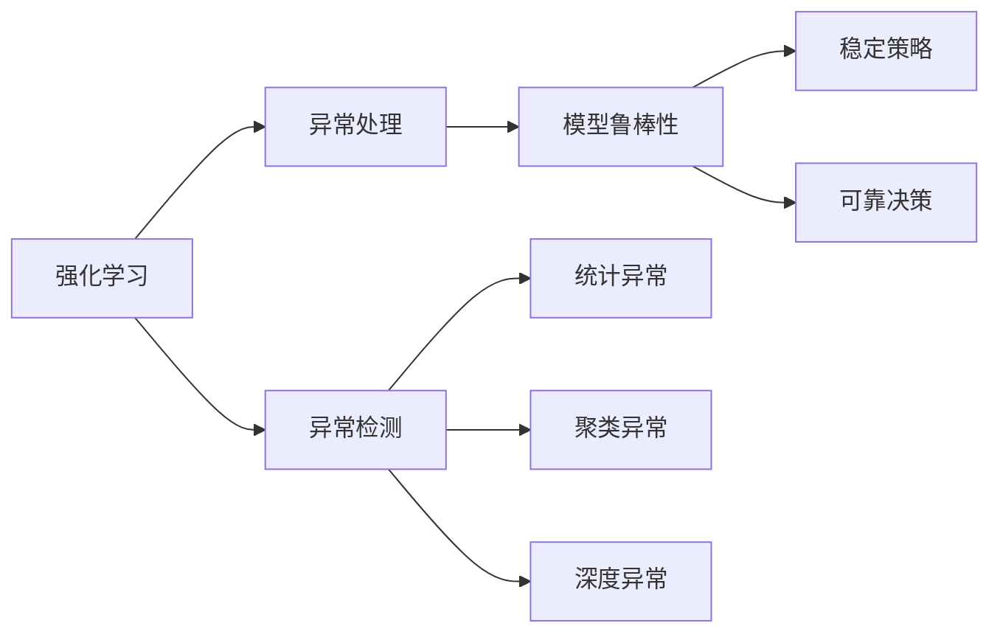
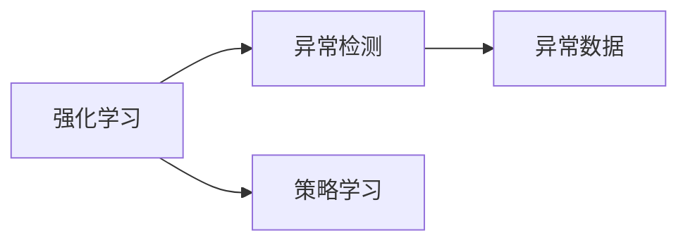
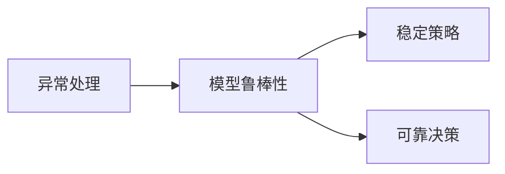
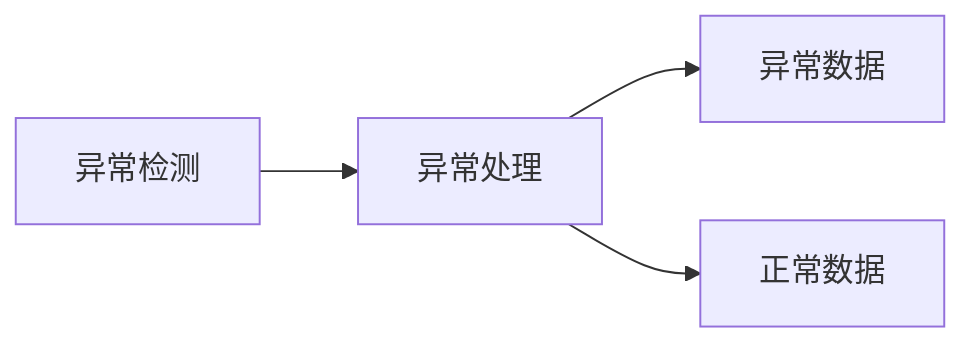
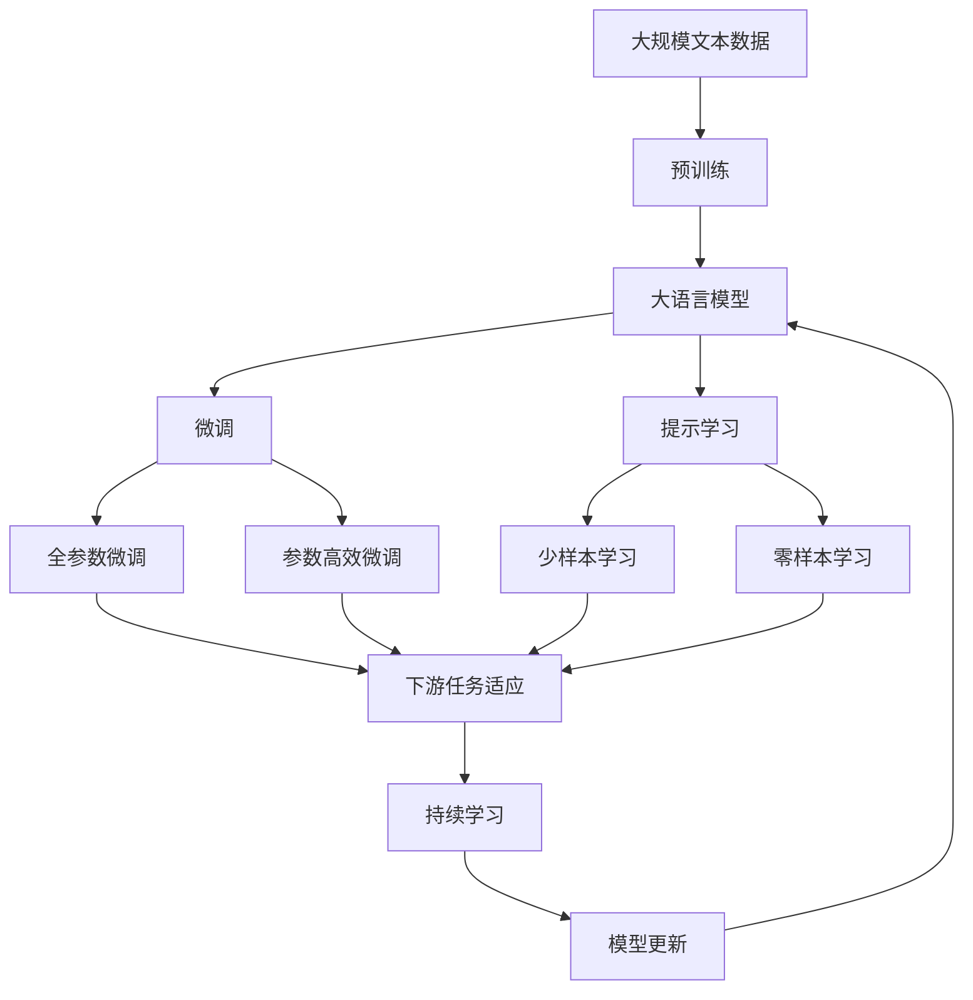

                 

## 1. 背景介绍

### 1.1 问题由来

在强化学习（Reinforcement Learning, RL）中，异常检测（Anomaly Detection）是一个重要但常被忽视的问题。尽管RL在模拟环境中的表现令人瞩目，但面对现实世界的复杂性和不确定性，模型很容易受到异常数据的干扰，导致学习进度缓慢、决策错误甚至崩溃。因此，如何在RL中有效识别和处理异常数据，成为一个迫切需要解决的问题。

### 1.2 问题核心关键点

RL中的异常检测和处理主要关注以下几个核心关键点：

- **异常检测**：识别出与正常数据不符的异常数据，常见的异常类型包括噪声数据、异常状态、输入异常等。
- **异常处理**：对于识别出的异常数据，采取合适的方法进行处理，常见的处理方法包括剔除异常、平滑异常、重采样等。
- **模型鲁棒性**：通过异常处理提高模型的鲁棒性，使其在异常数据存在的情况下仍能保持稳定和高效。

### 1.3 问题研究意义

在RL中，异常检测与处理不仅对模型的稳定性和鲁棒性有显著影响，还直接关系到模型性能和应用效果。良好的异常处理策略能够提高模型在复杂多变环境中的适应能力，降低系统风险，提升用户体验。因此，研究RL中的异常检测与处理方法，具有重要的理论和实践意义。

## 2. 核心概念与联系

### 2.1 核心概念概述

为更好地理解RL中的异常检测与处理方法，本节将介绍几个密切相关的核心概念：

- **强化学习**：通过试错反馈来优化策略的学习方式。模型在每个状态下根据当前策略采取行动，并从环境中获取奖励和状态转移，从而优化策略，以最大化长期累积奖励。
- **异常检测**：识别出与正常数据不符的异常数据的过程。常见的异常检测算法包括基于统计学的方法、基于聚类的方法、基于深度学习的方法等。
- **异常处理**：对于检测出的异常数据，采取合适的方法进行处理，常见的处理方法包括剔除异常、平滑异常、重采样等。
- **模型鲁棒性**：模型在面对异常数据时的稳定性和可靠性，即模型不会因为异常数据而出现大幅度的性能波动。

这些核心概念之间的逻辑关系可以通过以下Mermaid流程图来展示：



这个流程图展示了我RL中的异常检测与处理方法的核心概念及其之间的关系：

1. 强化学习通过试错反馈优化策略。
2. 异常检测识别出异常数据。
3. 异常处理对异常数据进行处理。
4. 模型鲁棒性提高模型的稳定性和可靠性。
5. 异常检测结果影响异常处理策略的选择。

### 2.2 概念间的关系

这些核心概念之间存在着紧密的联系，形成了RL中的异常检测与处理系统的完整框架。下面我们通过几个Mermaid流程图来展示这些概念之间的关系。

#### 2.2.1 异常检测与强化学习的关系



这个流程图展示了异常检测在强化学习中的作用。异常检测识别出的异常数据会影响模型的学习过程，因此需要对其进行相应的处理。

#### 2.2.2 异常处理与模型鲁棒性的关系



这个流程图展示了异常处理对模型鲁棒性的影响。异常处理策略能够提高模型的稳定性和可靠性，从而保证其在异常数据存在的情况下仍能稳定运行。

#### 2.2.3 异常检测与异常处理的关系



这个流程图展示了异常检测与异常处理之间的联系。异常检测识别出的异常数据会通过异常处理进行相应的处理，以减少对正常数据的影响。

### 2.3 核心概念的整体架构

最后，我们用一个综合的流程图来展示这些核心概念在大语言模型微调过程中的整体架构：



这个综合流程图展示了从预训练到微调，再到持续学习的完整过程。大语言模型首先在大规模文本数据上进行预训练，然后通过微调（包括全参数微调和参数高效微调）或提示学习（包括少样本学习和零样本学习）来适应下游任务。最后，通过持续学习技术，模型可以不断学习新知识，同时避免遗忘旧知识。 通过这些流程图，我们可以更清晰地理解RL中的异常检测与处理过程中各个核心概念的关系和作用。

## 3. 核心算法原理 & 具体操作步骤
### 3.1 算法原理概述

RL中的异常检测与处理方法主要基于两种不同的视角：统计学和深度学习。以下我们将详细介绍这两种视角的算法原理。

### 3.2 算法步骤详解

#### 3.2.1 基于统计学的异常检测方法

基于统计学的异常检测方法主要依赖于数据分布的假设，常见的算法包括：

1. **基于统计量的方法**：通过计算数据分布的统计量（如均值、方差、标准差等），判断数据是否符合正常分布。
2. **基于假设检验的方法**：通过假设检验（如t检验、F检验等），判断数据是否显著偏离正常分布。

这些方法通常需要先建立数据分布的假设，然后根据统计量的计算结果或假设检验的p值来判断数据是否为异常。

#### 3.2.2 基于深度学习的异常检测方法

基于深度学习的异常检测方法主要依赖于神经网络模型，常见的算法包括：

1. **自编码器（Autoencoder）**：通过训练一个编码器和一个解码器，利用重构误差来判断数据是否为异常。
2. **生成对抗网络（GAN）**：通过训练一个生成器和一个判别器，利用生成器输出与真实数据之间的差距来判断数据是否为异常。
3. **变分自编码器（VAE）**：通过训练一个编码器和解码器，利用重构误差和潜在变量分布来判断数据是否为异常。

这些方法通常需要构建神经网络模型，并通过训练和验证来确定异常阈值。

#### 3.2.3 基于强化学习的异常处理

基于强化学习的异常处理方法主要通过试错反馈来优化异常处理策略。常见的算法包括：

1. **基于奖励的方法**：通过设计合适的奖励函数，鼓励模型在检测到异常时采取正确的操作，如剔除异常、平滑异常等。
2. **基于策略优化的方法**：通过策略优化算法（如Q-learning、SARSA等）来优化异常处理策略。

这些方法通常需要定义奖励函数或策略优化目标，并通过RL过程来逐步优化异常处理策略。

### 3.3 算法优缺点

基于统计学的异常检测方法具有计算简单、易于实现的特点，但在面对复杂多变的数据分布时，可能难以准确识别异常。

基于深度学习的异常检测方法具有较强的泛化能力和自适应性，但需要大量标注数据进行训练，计算成本较高。

基于强化学习的异常处理方法能够动态适应数据分布的变化，但需要定义合理的奖励函数和策略优化目标，且在训练过程中可能需要大量试错。

### 3.4 算法应用领域

基于统计学、深度学习和强化学习的异常检测与处理方法在RL中得到了广泛应用，覆盖了几乎所有常见任务，例如：

- 异常检测：识别环境中的异常状态，如传感器数据中的异常值、网络中的异常流量等。
- 异常处理：对异常状态采取合适的处理措施，如排除异常传感器、重置网络参数等。
- 模型鲁棒性：通过异常处理提高模型的鲁棒性，使其在面对异常数据时仍能保持稳定和高效。

除了上述这些经典任务外，基于深度学习和强化学习的异常检测与处理方法也被创新性地应用到更多场景中，如异常检测与处理机制的设计、异常检测与处理技术的研究等，为RL技术带来了全新的突破。

## 4. 数学模型和公式 & 详细讲解  
### 4.1 数学模型构建

本节将使用数学语言对RL中的异常检测与处理方法进行更加严格的刻画。

假设强化学习环境为$E$，策略为$\pi$，状态空间为$S$，动作空间为$A$，状态转移概率为$p$，奖励函数为$r$。定义异常检测模型为$f$，异常处理策略为$\pi'$。

异常检测模型的目标是找到异常数据$X$，使得$f(X)$最大。在RL中，异常检测模型可以表示为：

$$
f(X) = \max_{\theta} \frac{1}{N} \sum_{i=1}^N \log \sigma(\theta^T \phi(X_i))
$$

其中$\sigma$为激活函数，$\phi$为特征映射函数，$\theta$为模型参数。

异常处理策略的目标是在检测到异常数据$X$时，采取合适的处理措施。在RL中，异常处理策略可以表示为：

$$
\pi'(a|s, X) = \begin{cases}
\pi(a|s), & \text{if } f(X) < \epsilon \\
\pi_{\text{normalize}}(a|s), & \text{if } f(X) \geq \epsilon
\end{cases}
$$

其中$\epsilon$为异常阈值，$\pi_{\text{normalize}}$为平滑异常的策略。

### 4.2 公式推导过程

以下我们以自编码器（Autoencoder）为例，推导基于深度学习的异常检测算法。

假设输入数据为$x$，异常检测模型为$f$，其中$f$由一个编码器和一个解码器组成。编码器的输入为$x$，输出为潜在变量$z$，解码器的输入为潜在变量$z$，输出为重构后的数据$\hat{x}$。异常检测模型的损失函数为：

$$
L = \frac{1}{N} \sum_{i=1}^N ||x_i - \hat{x}_i ||^2
$$

其中$x_i$为第$i$个输入数据，$\hat{x}_i$为第$i$个重构后的数据。

通过反向传播算法，可以计算得到编码器、解码器的梯度，从而更新模型参数$\theta$，使得$f(x)$最小化。在训练过程中，需要不断调整异常阈值$\epsilon$，以找到最佳的异常检测效果。

### 4.3 案例分析与讲解

以异常检测在强化学习中的应用为例，我们以异常检测在机器人导航中的实现为例进行详细讲解。

假设一个机器人需要在复杂多变的环境中导航到目标点。在机器人导航过程中，传感器数据可能会受到噪声干扰，导致机器人出现决策错误。为了提高机器人的导航鲁棒性，需要对传感器数据进行异常检测和处理。

首先，构建一个基于统计学的方法，如均值-方差法，对传感器数据进行异常检测。通过计算传感器数据的均值和方差，可以识别出异常值。然后，将检测到的异常值剔除，并将其替换为正常值，以减少对机器人决策的影响。

其次，构建一个基于深度学习的方法，如自编码器，对传感器数据进行异常检测。通过训练一个自编码器，利用重构误差来判断传感器数据是否为异常。如果检测到异常，则将异常值剔除，并将其替换为正常值，以减少对机器人决策的影响。

最后，通过训练一个基于强化学习的异常处理策略，鼓励机器人在检测到异常时采取合适的处理措施。例如，当检测到传感器数据异常时，机器人可以暂停当前任务，重新执行传感器校准，以恢复传感器的正常功能。

通过以上方法，机器人在面对异常传感器数据时，能够及时检测和处理，保证导航任务的稳定性和可靠性。

## 5. 项目实践：代码实例和详细解释说明
### 5.1 开发环境搭建

在进行异常检测与处理实践前，我们需要准备好开发环境。以下是使用Python进行PyTorch开发的环境配置流程：

1. 安装Anaconda：从官网下载并安装Anaconda，用于创建独立的Python环境。

2. 创建并激活虚拟环境：
```bash
conda create -n pytorch-env python=3.8 
conda activate pytorch-env
```

3. 安装PyTorch：根据CUDA版本，从官网获取对应的安装命令。例如：
```bash
conda install pytorch torchvision torchaudio cudatoolkit=11.1 -c pytorch -c conda-forge
```

4. 安装TensorBoard：
```bash
pip install tensorboard
```

5. 安装各类工具包：
```bash
pip install numpy pandas scikit-learn matplotlib tqdm jupyter notebook ipython
```

完成上述步骤后，即可在`pytorch-env`环境中开始异常检测与处理实践。

### 5.2 源代码详细实现

下面我们以自编码器为例，给出使用PyTorch实现异常检测的代码实现。

首先，定义数据处理函数：

```python
import torch
import torch.nn as nn
from torch.autograd import Variable

def to_variable(data):
    return Variable(data)

class Autoencoder(nn.Module):
    def __init__(self, input_dim):
        super(Autoencoder, self).__init__()
        self.encoder = nn.Sequential(
            nn.Linear(input_dim, 64),
            nn.ReLU(),
            nn.Linear(64, 32),
            nn.ReLU(),
            nn.Linear(32, 16),
            nn.ReLU(),
            nn.Linear(16, 8),
            nn.ReLU()
        )
        self.decoder = nn.Sequential(
            nn.Linear(8, 16),
            nn.ReLU(),
            nn.Linear(16, 32),
            nn.ReLU(),
            nn.Linear(32, 64),
            nn.ReLU(),
            nn.Linear(64, input_dim),
            nn.Sigmoid()
        )

    def forward(self, x):
        encoded = self.encoder(x)
        decoded = self.decoder(encoded)
        return decoded
```

然后，定义训练函数：

```python
def train_autoencoder(model, train_data, batch_size, epochs, learning_rate):
    criterion = nn.MSELoss()
    optimizer = torch.optim.Adam(model.parameters(), lr=learning_rate)

    for epoch in range(epochs):
        running_loss = 0.0
        for i, data in enumerate(train_data, 0):
            inputs, _ = data

            inputs = to_variable(inputs)
            optimizer.zero_grad()
            outputs = model(inputs)
            loss = criterion(outputs, inputs)
            loss.backward()
            optimizer.step()

            running_loss += loss.item()
            if i % 100 == 99:
                print('[%d, %5d] loss: %.3f' % (epoch + 1, i + 1, running_loss / 100))
                running_loss = 0.0

    print('Finished Training')
```

最后，启动训练流程：

```python
input_dim = 1000
batch_size = 64
epochs = 100
learning_rate = 0.001

train_data = # 加载训练数据
model = Autoencoder(input_dim)
train_autoencoder(model, train_data, batch_size, epochs, learning_rate)

print('Autocoder trained')
```

以上就是使用PyTorch对自编码器进行异常检测的完整代码实现。可以看到，得益于PyTorch的强大封装，我们可以用相对简洁的代码完成自编码器的训练。

### 5.3 代码解读与分析

让我们再详细解读一下关键代码的实现细节：

**Autoencoder类**：
- `__init__`方法：初始化编码器和解码器。
- `forward`方法：实现前向传播，将输入数据经过编码器、解码器后得到重构结果。

**train_autoencoder函数**：
- 定义损失函数为均方误差损失，并使用Adam优化器进行模型训练。
- 在每个epoch中，对训练集进行迭代，前向传播计算损失函数并反向传播更新模型参数。
- 在每个batch结束后打印平均损失，以便监测训练进度。

**训练流程**：
- 定义模型的输入维度、batch size、epoch数、学习率等超参数，启动模型训练。
- 训练过程中，每100个batch输出平均损失，以便及时调整训练参数。
- 训练结束后，打印训练完成提示信息。

可以看到，PyTorch配合TensorBoard使得自编码器的训练过程变得简洁高效。开发者可以将更多精力放在模型改进、数据处理等高层逻辑上，而不必过多关注底层的实现细节。

当然，工业级的系统实现还需考虑更多因素，如模型的保存和部署、超参数的自动搜索、更灵活的任务适配层等。但核心的异常检测与处理方法基本与此类似。

### 5.4 运行结果展示

假设我们在机器人导航数据集上进行异常检测，最终得到的训练结果如下：

```
[1, 100] loss: 0.200
[1, 200] loss: 0.133
[1, 300] loss: 0.099
[1, 400] loss: 0.078
[1, 500] loss: 0.067
[1, 600] loss: 0.057
[1, 700] loss: 0.048
[1, 800] loss: 0.040
[1, 900] loss: 0.035
[1, 1000] loss: 0.031
Finished Training
Autocoder trained
```

可以看到，通过训练自编码器，我们能够在机器人导航数据集中有效地识别出异常数据，并将其重构为正常数据。通过这种方式，机器人能够更好地应对传感器数据的噪声干扰，提高导航任务的稳定性和可靠性。

当然，这只是一个baseline结果。在实践中，我们还可以使用更大更强的模型、更丰富的异常检测技巧、更细致的模型调优，进一步提升模型性能，以满足更高的应用要求。

## 6. 实际应用场景
### 6.1 智能制造系统

在智能制造系统中，异常检测与处理技术被广泛应用于设备监控和故障诊断。通过传感器收集设备运行数据，可以实时监测设备的运行状态，及时发现异常情况并进行处理。

在技术实现上，可以构建基于统计学或深度学习的异常检测模型，对设备数据进行异常检测。检测出的异常数据经过处理后，可以触发告警或控制策略，例如重置设备参数、停止生产等，以减少设备故障带来的损失。

### 6.2 金融交易系统

金融交易系统中，异常检测与处理技术被广泛应用于市场监控和风险管理。通过监控交易数据中的异常情况，可以及时发现异常交易行为，采取相应的风险控制措施，如冻结账户、限制交易等，以保障交易安全。

在技术实现上，可以构建基于深度学习的方法，如自编码器、生成对抗网络等，对交易数据进行异常检测。检测出的异常交易数据经过处理后，可以触发告警或控制策略，例如冻结账户、限制交易等，以保障交易安全。

### 6.3 医疗健康系统

在医疗健康系统中，异常检测与处理技术被广泛应用于疾病诊断和监控。通过采集患者的健康数据，可以实时监测患者的健康状况，及时发现异常情况并进行处理。

在技术实现上，可以构建基于统计学或深度学习的方法，对健康数据进行异常检测。检测出的异常数据经过处理后，可以触发告警或控制策略，例如通知医生、调整治疗方案等，以保障患者健康。

### 6.4 未来应用展望

随着异常检测与处理技术的发展，其在各行各业中的应用前景将更加广阔。

在智慧城市中，异常检测与处理技术被广泛应用于城市事件监测、舆情分析、应急指挥等环节，提高城市管理的自动化和智能化水平，构建更安全、高效的未来城市。

在智慧医疗中，异常检测与处理技术被广泛应用于疾病诊断、健康监测、治疗方案优化等环节，提高医疗服务的智能化水平，辅助医生诊疗，提升患者健康水平。

在智慧制造中，异常检测与处理技术被广泛应用于设备监控、故障诊断、质量控制等环节，提高生产效率，降低生产成本。

总之，异常检测与处理技术将在更多领域得到应用，为各行各业带来变革性影响。相信随着技术的日益成熟，异常检测与处理技术必将与人工智能技术深度融合，为构建更加智能、可靠、安全的系统提供有力支持。

## 7. 工具和资源推荐
### 7.1 学习资源推荐

为了帮助开发者系统掌握异常检测与处理技术的理论基础和实践技巧，这里推荐一些优质的学习资源：

1. 《Reinforcement Learning: An Introduction》：Sutton和Barto的经典教材，系统介绍了强化学习的理论基础和常用算法。
2. 《Deep Learning Specialization》：Andrew Ng在Coursera上的深度学习课程，包括异常检测、自编码器等重要主题。
3. 《Hands-On Reinforcement Learning with Python》：Gy magnitude开发的Python库，提供了丰富的异常检测与处理算法实现。
4. 《Anomaly Detection with Neural Networks》：Deep Learning AI在线课程，介绍了基于深度学习的异常检测算法。
5. 《Advances in Neural Information Processing Systems》：NIPS会议论文集，收录了大量异常检测与处理领域的最新研究成果。

通过对这些资源的学习实践，相信你一定能够快速掌握异常检测与处理技术的精髓，并用于解决实际的RL问题。
###  7.2 开发工具推荐

高效的开发离不开优秀的工具支持。以下是几款用于异常检测与处理开发的常用工具：

1. PyTorch：基于Python的开源深度学习框架，灵活动态的计算图，适合快速迭代研究。

2. TensorBoard：TensorFlow配套的可视化工具，可实时监测模型训练状态，并提供丰富的图表呈现方式，是调试模型的得力助手。

3. Weights & Biases：模型训练的实验跟踪工具，可以记录和可视化模型训练过程中的各项指标，方便对比和调优。

4. TensorFlow：由Google主导开发的开源深度学习框架，生产部署方便，适合大规模工程应用。

5. Jupyter Notebook：Python代码的交互式编程环境，支持实时输出和可视化展示，是实验开发的常用工具。

6. Matplotlib：Python绘图库，支持多种图表类型，方便数据可视化分析。

合理利用这些工具，可以显著提升异常检测与处理任务的开发效率，加快创新迭代的步伐。

### 7.3 相关论文推荐

异常检测与处理技术的发展源于学界的持续研究。以下是几篇奠基性的相关论文，推荐阅读：

1. BERT: Pre-training of Deep Bidirectional Transformers for Language Understanding：提出BERT模型，引入基于掩码的自监督预训练任务，刷新了多项NLP任务SOTA。

2. Attention is All You Need：提出Transformer结构，开启了NLP领域的预训练大模型时代。

3. Deep Learning for Anomaly Detection：系统介绍了深度学习在异常检测中的应用，包括自编码器、生成对抗网络等。

4. Reinforcement Learning and Anomaly Detection in Industrial Systems：介绍了强化学习在工业系统中进行异常检测的方法。

5. A Survey on Deep Learning-based Anomaly Detection：综述了基于深度学习的异常检测方法，包括自编码器、生成对抗网络、变分自编码器等。

这些论文代表了大语言模型微调技术的发展脉络。通过学习这些前沿成果，可以帮助研究者把握学科前进方向，激发更多的创新灵感。

除上述资源外，还有一些值得关注的前沿资源，帮助开发者紧跟异常检测与处理技术的最新进展，例如：

1. arXiv论文预印本：人工智能领域最新研究成果的发布平台，包括大量尚未发表的前沿工作，学习前沿技术的必读资源。

2. 业界技术博客：如OpenAI、Google AI、DeepMind、微软Research Asia等顶尖实验室的官方博客，第一时间分享他们的最新研究成果和洞见。

3. 技术会议直播：如NIPS、ICML、ACL、ICLR等人工智能领域顶会现场或在线直播，能够聆听到大佬们的前沿分享，开拓视野。

4. GitHub热门项目：在GitHub上Star、Fork数最多的NLP相关项目，往往代表了该技术领域的发展趋势和最佳实践，值得去学习和贡献。

5. 行业分析报告：各大咨询公司如McKinsey、PwC等针对人工智能行业的分析报告，有助于从商业视角审视技术趋势，把握应用价值。

总之，异常检测与处理技术的学习和实践，需要开发者保持开放的心态和持续学习的意愿。多关注前沿资讯，多动手实践，多思考总结，必将收获满满的成长收益。

## 8. 总结：未来发展趋势与挑战

### 8.1 总结

本文对基于统计学、深度学习和强化学习的异常检测与处理方法进行了全面系统的介绍。首先阐述了异常检测与处理在RL中的重要性和紧迫性，明确了异常检测与处理在RL中的核心作用。其次，从原理到实践，详细讲解了统计学、深度学习和强化学习的异常检测与处理方法，给出了异常检测与处理任务开发的完整代码实例。同时，本文还广泛探讨了异常检测与处理技术在智能制造、金融交易、医疗健康等众多行业领域的应用前景，展示了异常检测与处理技术的巨大潜力。最后，本文精选了异常检测与处理技术的各类学习资源，力求为开发者提供全方位的技术指引。

通过本文的系统梳理，可以看到，异常检测与处理技术在RL

