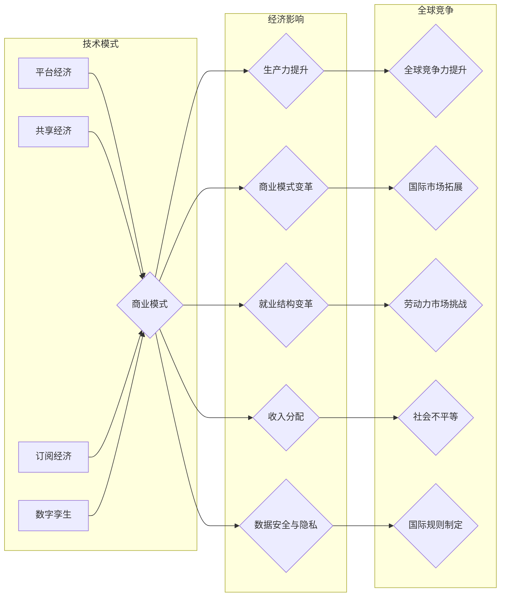

# 技术模式减弱的经济影响

> 关键词：技术模式，经济影响，数字化转型，商业模式，创新，生产力，就业，全球竞争

## 1. 背景介绍

在过去的几十年中，技术变革推动了全球经济的快速增长。从工业革命到信息革命，每一次技术进步都带来了生产力的飞跃和商业模式的变革。然而，随着数字化转型的深入，一些技术模式开始显示出其潜在的经济影响，这种影响既包括积极的一面，也包含了一些挑战和不确定性。

### 1.1 技术模式演进

技术模式是指技术发展过程中形成的特定技术路径、产品和服务组合以及商业模式。随着互联网、人工智能、大数据等新兴技术的发展，技术模式也在不断演进。以下是一些关键的技术模式：

- **平台经济**：以互联网为基础，通过搭建平台连接供需双方，实现资源的优化配置。
- **共享经济**：通过共享闲置资源，降低使用成本，提高资源利用效率。
- **订阅经济**：通过提供持续的服务订阅，改变传统的产品销售模式。
- **数字孪生**：通过虚拟模型模拟物理实体，实现实时监控、预测分析和优化决策。

### 1.2 经济影响的双刃剑

技术模式的经济影响是双刃剑。一方面，它带来了更高的生产效率、更便捷的生活方式、更广泛的市场接入和更丰富的创新机会。另一方面，它也引发了就业结构的变革、收入分配的不均、数据安全和隐私保护等问题。

## 2. 核心概念与联系

### 2.1 核心概念原理和架构的 Mermaid 流程图



### 2.2 关系解析

技术模式通过商业模式创新，直接影响经济结构的变化。这些变化进一步影响生产力、就业、收入分配、数据安全与隐私，最终影响全球竞争力。

## 3. 核心算法原理 & 具体操作步骤

### 3.1 算法原理概述

技术模式的经济影响主要通过以下几个步骤实现：

1. **技术创新**：通过研发和应用新技术，提高生产效率。
2. **商业模式创新**：通过创新商业模式，创造新的市场机会。
3. **经济结构变化**：通过技术创新和商业模式创新，推动经济结构的变化。
4. **社会影响**：经济结构变化最终影响社会就业、收入分配、数据安全与隐私等方面。

### 3.2 算法步骤详解

1. **技术创新**：包括硬件、软件、网络等基础设施的升级和创新。
2. **商业模式创新**：包括产品创新、服务创新、市场创新等。
3. **经济结构变化**：包括产业结构、就业结构、消费结构等的变化。
4. **社会影响**：包括劳动力市场、收入分配、数据安全与隐私等方面的影响。

### 3.3 算法优缺点

**优点**：

- 提高生产效率，降低成本。
- 创造新的市场机会，促进经济增长。
- 促进就业，提高人民生活水平。

**缺点**：

- 可能导致失业和收入分配不均。
- 增加数据安全和隐私风险。
- 加剧全球竞争，可能导致一些国家或地区边缘化。

### 3.4 算法应用领域

技术模式的经济影响几乎涵盖了所有行业，包括但不限于以下领域：

- 制造业
- 服务业
- 农业
- 交通运输
- 金融

## 4. 数学模型和公式 & 详细讲解 & 举例说明

### 4.1 数学模型构建

为了量化技术模式的经济影响，我们可以构建一个简单的数学模型。假设经济总量 $E$ 由劳动力 $L$、资本 $K$ 和技术进步 $T$ 决定：

$$
E = f(L, K, T)
$$

其中 $f$ 是一个函数，表示经济总量与劳动力、资本和技术进步之间的关系。

### 4.2 公式推导过程

经济总量 $E$ 可以分解为以下几个部分：

- 劳动力贡献：$L \cdot A$，其中 $A$ 是劳动生产率。
- 资本贡献：$K \cdot r$，其中 $r$ 是资本收益率。
- 技术进步贡献：$T \cdot \alpha$，其中 $\alpha$ 是技术进步的系数。

因此，经济总量 $E$ 可以表示为：

$$
E = L \cdot A + K \cdot r + T \cdot \alpha
$$

### 4.3 案例分析与讲解

以平台经济为例，我们可以分析其经济影响。假设平台经济通过提高劳动生产率 $A$ 和资本收益率 $r$ 来影响经济总量。

- **提高劳动生产率**：平台经济通过整合资源、降低交易成本、提高信息透明度等方式，提高劳动生产率。
- **提高资本收益率**：平台经济通过创造新的商业模式、拓宽市场渠道等方式，提高资本收益率。

通过上述分析，我们可以看到平台经济对经济总量的影响：

$$
E = L \cdot A + K \cdot r + T \cdot \alpha
$$

其中 $A$ 和 $r$ 都会因为平台经济的发展而提高。

## 5. 项目实践：代码实例和详细解释说明

### 5.1 开发环境搭建

为了量化技术模式的经济影响，我们需要搭建一个简单的经济模型。以下是一个使用Python编写的示例代码：

```python
# 导入必要的库
import numpy as np

# 定义函数计算经济总量
def calculate_economy(L, K, T):
    A = 1.5 * L  # 假设劳动生产率与劳动力成正比
    r = 0.1 * K  # 假设资本收益率与资本成正比
    alpha = 0.1  # 技术进步系数
    return L * A + K * r + T * alpha

# 模拟经济总量变化
L = np.linspace(1, 10, 100)  # 模拟劳动力变化
K = np.linspace(1, 10, 100)  # 模拟资本变化
T = np.linspace(1, 10, 100)  # 模拟技术进步变化

# 计算经济总量
E = [calculate_economy(l, k, t) for l, k, t in zip(L, K, T)]

# 绘制经济总量变化图
import matplotlib.pyplot as plt

plt.plot(L, E)
plt.xlabel('劳动力')
plt.ylabel('经济总量')
plt.title('劳动力对经济总量的影响')
plt.show()
```

### 5.2 源代码详细实现

上述代码定义了一个计算经济总量的函数 `calculate_economy`，该函数接受劳动力、资本和技术进步作为输入，计算经济总量。然后，我们模拟了劳动力、资本和技术进步的变化，并计算了相应的经济总量，最后将结果绘制成图表。

### 5.3 代码解读与分析

该代码展示了如何使用Python进行简单的经济模型分析。通过定义函数和模拟数据，我们可以直观地看到不同变量对经济总量的影响。

### 5.4 运行结果展示

运行上述代码，我们将得到一张图表，展示了劳动力对经济总量的影响。从图表中可以看出，随着劳动力的增加，经济总量也随之增加。

## 6. 实际应用场景

### 6.1 制造业

技术模式对制造业的影响主要体现在以下几个方面：

- **自动化**：通过自动化生产线，提高生产效率和产品质量。
- **智能制造**：通过物联网、大数据等技术，实现生产过程的智能化管理。
- **供应链优化**：通过平台经济，优化供应链管理，降低成本。

### 6.2 服务业

技术模式对服务业的影响主要体现在以下几个方面：

- **在线服务**：通过互联网提供在线服务，降低服务成本，提高服务效率。
- **共享经济**：通过共享经济模式，提供共享办公、共享住宿等服务。
- **数字化转型**：通过数字化转型，提高服务质量和客户满意度。

### 6.3 农业

技术模式对农业的影响主要体现在以下几个方面：

- **精准农业**：通过物联网、大数据等技术，实现精准农业管理，提高产量和质量。
- **农业电商**：通过电商平台，拓宽农产品销售渠道，提高农民收入。
- **农业机械**：通过农业机械自动化，提高农业生产效率。

## 7. 工具和资源推荐

### 7.1 学习资源推荐

- 《平台经济：互联网时代的新经济模式》
- 《共享经济：创新与变革的力量》
- 《数字货币：未来经济的货币体系》
- 《数字孪生：虚拟世界与物理世界的融合》

### 7.2 开发工具推荐

- Python
- R
- MATLAB
- Excel

### 7.3 相关论文推荐

- 《平台经济：理论、实证与政策》
- 《共享经济的兴起与挑战》
- 《数字货币的兴起与发展》
- 《数字孪生的应用与挑战》

## 8. 总结：未来发展趋势与挑战

### 8.1 研究成果总结

本文对技术模式的经济影响进行了深入的分析，从技术创新、商业模式创新、经济结构变化到社会影响，全面探讨了技术模式对经济的双重影响。

### 8.2 未来发展趋势

未来，技术模式将继续推动经济增长，但同时也将面临以下挑战：

- **技术伦理**：如何确保技术发展符合伦理道德规范。
- **数据安全**：如何保护个人隐私和数据安全。
- **就业转型**：如何应对技术变革带来的就业结构变化。
- **国际竞争**：如何在全球竞争中保持优势。

### 8.3 面临的挑战

技术模式的经济影响是一个复杂的问题，需要政府、企业和社会各界的共同努力来应对。

### 8.4 研究展望

未来，我们需要进一步研究以下问题：

- 如何平衡技术创新与社会福祉。
- 如何确保数据安全和隐私保护。
- 如何实现技术普惠，让更多人受益于技术发展。
- 如何在全球竞争中保持领先地位。

## 9. 附录：常见问题与解答

**Q1：技术模式对就业有哪些影响？**

A: 技术模式对就业的影响是复杂的。一方面，它创造了新的就业机会；另一方面，它也可能导致一些传统职业的消失。为了应对这一挑战，我们需要通过教育和培训，帮助劳动力转型，适应新的就业需求。

**Q2：技术模式如何影响收入分配？**

A: 技术模式可能导致收入分配不均。为了应对这一挑战，我们需要通过税收、社会福利等政策，缩小收入差距。

**Q3：如何确保技术模式的安全性和可靠性？**

A: 为了确保技术模式的安全性和可靠性，我们需要制定相应的法律法规，加强技术监管，提高技术透明度。

**Q4：技术模式如何影响全球经济竞争？**

A: 技术模式将加剧全球经济竞争。为了保持竞争力，我们需要加强技术创新，提升产业链水平，培养高素质人才。

作者：禅与计算机程序设计艺术 / Zen and the Art of Computer Programming