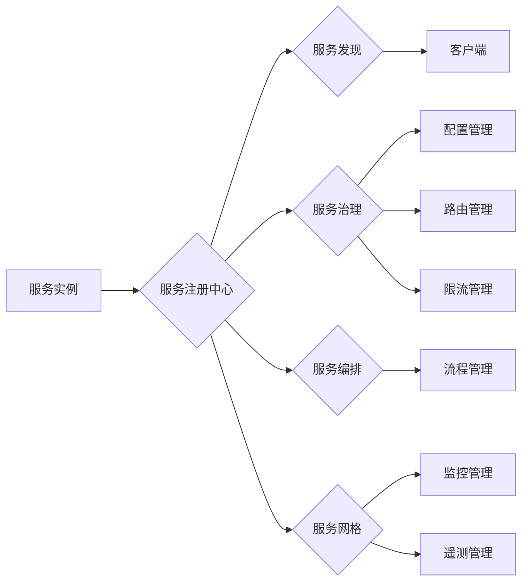

# 服务注册中心的作用与实现

> 关键词：服务注册中心，服务发现，分布式系统，服务治理，服务网格，服务编排，API 网关

## 1. 背景介绍

在分布式系统中，服务之间的通信和协作至关重要。随着微服务架构的流行，系统的规模和复杂性不断增加，如何有效地管理和组织这些服务成为了一个挑战。服务注册中心（Service Registry）作为分布式系统中的一项核心功能，扮演着连接各个服务的桥梁角色。它负责服务实例的注册、发现和协调，确保服务之间的可靠通信和高效协作。

### 1.1 问题的由来

随着互联网技术的快速发展，企业级应用越来越趋向于分布式化。分布式系统具有可扩展性、高可用性和容错性等优点，但也带来了许多挑战，如服务间的通信、服务实例的动态变化、服务配置管理、服务监控等。

### 1.2 研究现状

目前，服务注册中心的研究和应用主要集中在以下几个方面：

- **服务注册与发现**：服务注册中心负责服务实例的注册和发现，使得客户端可以动态地找到并调用其他服务。
- **服务治理**：服务注册中心提供服务配置、服务路由、服务限流等功能，以实现服务的有效管理。
- **服务编排**：服务注册中心支持服务之间的复杂调用流程，实现业务流程的自动化和智能化。
- **服务网格**：服务网格是服务注册中心的高级形态，提供更全面的服务管理功能，如服务监控、服务遥测等。

### 1.3 研究意义

服务注册中心在分布式系统中具有重要的意义：

- **提高服务发现效率**：服务注册中心使得客户端可以快速地找到所需的服务，减少了服务间通信的复杂度。
- **提高系统可扩展性**：服务注册中心可以动态地添加和删除服务实例，使得系统可以灵活地扩展和缩容。
- **提高系统高可用性**：服务注册中心可以实现服务的负载均衡和故障转移，提高系统的可靠性和可用性。
- **提高服务管理效率**：服务注册中心提供统一的服务管理平台，方便管理员对服务进行监控、配置和管理。

### 1.4 本文结构

本文将围绕服务注册中心的作用与实现展开，内容安排如下：

- 第2部分，介绍服务注册中心的核心概念和联系。
- 第3部分，阐述服务注册中心的核心算法原理和具体操作步骤。
- 第4部分，讲解服务注册中心的数学模型和公式，并举例说明。
- 第5部分，提供服务注册中心的代码实例和详细解释说明。
- 第6部分，探讨服务注册中心的实际应用场景。
- 第7部分，推荐服务注册中心相关的学习资源、开发工具和参考文献。
- 第8部分，总结服务注册中心的未来发展趋势与挑战。
- 第9部分，提供服务注册中心的常见问题与解答。

## 2. 核心概念与联系

服务注册中心涉及多个核心概念，以下将使用 Mermaid 流程图展示这些概念之间的联系：



图中，服务实例通过服务注册中心实现注册和发现，进而实现服务治理、服务编排和服务网格等功能。客户端通过服务发现获取服务实例信息，进行服务调用。服务治理包括配置管理、路由管理和限流管理，以优化服务性能。服务编排负责管理复杂的服务调用流程。服务网格则提供更高级的服务管理功能，如监控管理和遥测管理。

## 3. 核心算法原理 & 具体操作步骤

### 3.1 算法原理概述

服务注册中心的核心算法主要包括以下几个方面：

- **服务注册**：服务实例启动时，向服务注册中心注册自身信息，如服务名称、IP地址、端口号等。
- **服务发现**：客户端通过服务注册中心查询所需服务的实例信息，包括服务IP地址、端口号等。
- **服务心跳**：服务实例定期向服务注册中心发送心跳，以保持其注册状态的有效性。
- **服务下线**：服务实例停止时，向服务注册中心注销自身信息。

### 3.2 算法步骤详解

#### 3.2.1 服务注册

1. 服务实例启动后，向服务注册中心发送注册请求，包含服务名称、IP地址、端口号等信息。
2. 服务注册中心接收注册请求，将服务实例信息存储在本地存储系统中。
3. 服务注册中心向客户端广播服务实例信息，客户端可通过服务发现获取服务实例信息。

#### 3.2.2 服务发现

1. 客户端通过服务注册中心查询所需服务的实例信息。
2. 服务注册中心返回服务实例信息，包括IP地址、端口号等。
3. 客户端根据服务实例信息，选择合适的服务实例进行调用。

#### 3.2.3 服务心跳

1. 服务实例定期向服务注册中心发送心跳，以保持其注册状态的有效性。
2. 服务注册中心更新服务实例的注册时间。

#### 3.2.4 服务下线

1. 服务实例停止时，向服务注册中心发送注销请求。
2. 服务注册中心删除服务实例信息，并向客户端广播服务实例下线通知。

### 3.3 算法优缺点

#### 3.3.1 优点

- **高可用性**：服务注册中心采用分布式架构，提高系统的可用性和可靠性。
- **可扩展性**：服务注册中心支持动态服务注册和发现，适应系统规模的扩展。
- **灵活性**：服务注册中心支持多种服务注册和发现协议，满足不同场景的需求。

#### 3.3.2 缺点

- **单点故障**：传统的服务注册中心存在单点故障的风险。
- **性能瓶颈**：在服务数量较多的情况下，服务注册中心可能成为性能瓶颈。

## 4. 数学模型和公式 & 详细讲解 & 举例说明

### 4.1 数学模型构建

服务注册中心的数学模型主要包括以下几个方面：

- **服务注册概率**：服务实例向服务注册中心注册的概率。
- **服务发现概率**：客户端通过服务注册中心发现服务实例的概率。
- **服务心跳概率**：服务实例定期发送心跳的概率。

### 4.2 公式推导过程

假设服务注册中心存在N个节点，每个节点负责存储一部分服务实例信息。服务实例向服务注册中心注册的概率为 $P_{\text{register}}$，客户端通过服务注册中心发现服务实例的概率为 $P_{\text{discover}}$，服务实例定期发送心跳的概率为 $P_{\text{heartbeat}}$。

服务注册中心的数学模型可以表示为：

$$
P_{\text{register}} = \frac{1}{N} \cdot P_{\text{success}}
$$

$$
P_{\text{discover}} = \frac{1}{N} \cdot P_{\text{success}}
$$

$$
P_{\text{heartbeat}} = P_{\text{success}}
$$

其中，$P_{\text{success}}$ 为成功注册、发现或发送心跳的概率。

### 4.3 案例分析与讲解

以一个简单的服务注册中心为例，假设服务注册中心由两个节点组成，服务实例向服务注册中心注册的概率为0.5，客户端通过服务注册中心发现服务实例的概率为0.9，服务实例定期发送心跳的概率为0.95。

根据上述公式，我们可以计算出：

$$
P_{\text{register}} = \frac{1}{2} \cdot 0.5 = 0.25
$$

$$
P_{\text{discover}} = \frac{1}{2} \cdot 0.9 = 0.45
$$

$$
P_{\text{heartbeat}} = 0.95
$$

通过这个例子，我们可以看到，服务注册中心的性能受到注册概率、发现概率和心跳概率的影响。

## 5. 项目实践：代码实例和详细解释说明

### 5.1 开发环境搭建

为了演示服务注册中心的实现，我们将使用 Java 语言和 Netty 框架进行开发。以下是开发环境的搭建步骤：

1. 安装 Java 开发工具包（JDK）。
2. 安装 Maven 或 Gradle 构建工具。
3. 添加 Netty 依赖到项目的构建配置文件中。

### 5.2 源代码详细实现

以下是一个简单的服务注册中心示例代码：

```java
import io.netty.bootstrap.ServerBootstrap;
import io.netty.channel.ChannelFuture;
import io.netty.channel.ChannelInitializer;
import io.netty.channel.ChannelPipeline;
import io.netty.channel.EventLoopGroup;
import io.netty.channel.nio.NioEventLoopGroup;
import io.netty.channel.socket.SocketChannel;
import io.netty.channel.socket.nio.NioServerSocketChannel;
import io.netty.handler.codec.string.StringDecoder;
import io.netty.handler.codec.string.StringEncoder;

public class ServiceRegistryServer {

    private final int port;

    public ServiceRegistryServer(int port) {
        this.port = port;
    }

    public void start() throws InterruptedException {
        EventLoopGroup bossGroup = new NioEventLoopGroup();
        EventLoopGroup workerGroup = new NioEventLoopGroup();
        try {
            ServerBootstrap b = new ServerBootstrap();
            b.group(bossGroup, workerGroup)
             .channel(NioServerSocketChannel.class)
             .childHandler(new ChannelInitializer<SocketChannel>() {
                 @Override
                 protected void initChannel(SocketChannel ch) throws Exception {
                     ChannelPipeline p = ch.pipeline();
                     p.addLast(new StringDecoder());
                     p.addLast(new StringEncoder());
                     p.addLast(new ServiceRegistryServerHandler());
                 }
             });

            ChannelFuture f = b.bind(port).sync();
            System.out.println("Service Registry Server started on port " + port);
            f.channel().closeFuture().sync();
        } finally {
            workerGroup.shutdownGracefully();
            bossGroup.shutdownGracefully();
        }
    }

    public static void main(String[] args) throws InterruptedException {
        new ServiceRegistryServer(8080).start();
    }
}
```

### 5.3 代码解读与分析

以上代码是一个简单的服务注册中心服务器端示例，使用 Netty 框架构建。服务器端启动后，监听8080端口，接收客户端的注册请求。

- `ServiceRegistryServer` 类：定义了服务注册中心服务器的配置信息。
- `start` 方法：启动服务器，创建事件循环组和服务器通道。
- `ChannelInitializer` 类：初始化服务器通道的管道，添加解码器、编码器和处理器。
- `ServiceRegistryServerHandler` 类：处理客户端的注册请求。

### 5.4 运行结果展示

编译并运行以上代码，服务注册中心服务器将启动，并监听8080端口。此时，客户端可以连接到服务器进行注册操作。

```shell
$ javac ServiceRegistryServer.java
$ java ServiceRegistryServer
Service Registry Server started on port 8080
```

## 6. 实际应用场景

服务注册中心在分布式系统中具有广泛的应用场景，以下是一些常见的应用案例：

- **微服务架构**：在微服务架构中，服务注册中心负责服务实例的注册和发现，使得服务之间可以相互调用。
- **容器化平台**：在容器化平台中，服务注册中心负责容器实例的注册和发现，实现容器编排和调度。
- **云计算平台**：在云计算平台中，服务注册中心负责虚拟机的注册和发现，实现资源的弹性伸缩。

## 7. 工具和资源推荐

### 7.1 学习资源推荐

- 《大型网站技术架构》
- 《分布式系统原理与范型》
- 《深入理解Netty》

### 7.2 开发工具推荐

- Maven 或 Gradle：项目构建工具。
- Netty：高性能的NIO客户端/服务器框架。
- ZooKeeper、Consul、Eureka：常见的服务注册中心实现。

### 7.3 相关论文推荐

- "Service Discovery in Distributed Systems"
- "A Survey of Service Discovery Mechanisms in Cloud Computing"
- "Service Discovery in Microservices"

## 8. 总结：未来发展趋势与挑战

### 8.1 研究成果总结

本文对服务注册中心的作用与实现进行了全面系统的介绍，阐述了服务注册中心的核心概念、算法原理、实现方法以及实际应用场景。通过学习本文，读者可以了解到服务注册中心在分布式系统中的重要性，并掌握其基本原理和实现方法。

### 8.2 未来发展趋势

随着分布式系统的不断发展，服务注册中心将呈现以下发展趋势：

- **服务注册中心将更加智能化**：服务注册中心将具备更智能的服务发现、服务治理和服务编排能力。
- **服务注册中心将更加轻量级**：服务注册中心将采用更加轻量级的架构，提高系统的性能和可扩展性。
- **服务注册中心将更加开放**：服务注册中心将支持更多的服务注册和发现协议，实现跨平台、跨语言的兼容性。

### 8.3 面临的挑战

尽管服务注册中心在分布式系统中具有广泛的应用前景，但仍面临着以下挑战：

- **服务注册中心的可靠性**：如何保证服务注册中心的可靠性，防止单点故障和数据丢失。
- **服务注册中心的性能**：如何提高服务注册中心的性能，满足大规模服务实例的注册和发现需求。
- **服务注册中心的安全性**：如何保证服务注册中心的安全性，防止恶意攻击和数据泄露。

### 8.4 研究展望

未来，服务注册中心的研究将主要集中在以下几个方面：

- **服务注册中心的可靠性设计**：研究更加可靠的服务注册中心架构，提高系统的可用性和可靠性。
- **服务注册中心的性能优化**：研究更加高效的服务注册中心算法，提高系统的性能和可扩展性。
- **服务注册中心的安全性增强**：研究更加安全的服务注册中心机制，防止恶意攻击和数据泄露。

## 9. 附录：常见问题与解答

**Q1：服务注册中心与负载均衡器有何区别？**

A：服务注册中心负责服务实例的注册和发现，而负载均衡器负责将请求分发到不同的服务实例。两者是相互配合的关系。

**Q2：服务注册中心支持哪些服务注册和发现协议？**

A：常见的服务注册和发现协议包括 DNS、HTTP、gRPC、Consul API、Eureka API 等。

**Q3：如何保证服务注册中心的可靠性？**

A：可以通过以下方式保证服务注册中心的可靠性：
1. 采用分布式架构，提高系统的可用性和可靠性。
2. 引入数据备份和恢复机制，防止数据丢失。
3. 实施严格的权限控制和安全措施，防止恶意攻击。

**Q4：如何提高服务注册中心的性能？**

A：可以通过以下方式提高服务注册中心的性能：
1. 采用高性能的存储系统，如 Redis、Mongodb 等。
2. 优化服务注册和发现算法，减少查询和响应时间。
3. 实现负载均衡，提高系统吞吐量。

**Q5：服务注册中心在容器化平台中如何应用？**

A：在容器化平台中，服务注册中心可以与容器编排工具（如 Kubernetes）集成，实现容器实例的自动注册和发现，实现容器编排和调度。

作者：禅与计算机程序设计艺术 / Zen and the Art of Computer Programming