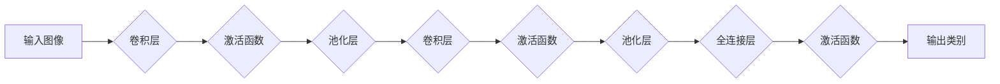

> 人工智能, 图像识别, ImageNet, 深度学习, 卷积神经网络, 神经网络, 计算机视觉

# 李飞飞的ImageNet与AI图像识别

### 1. 背景介绍

图像识别作为计算机视觉领域的一个核心任务，自从计算机视觉诞生以来就一直是研究的热点。然而，在2009年之前，图像识别领域的研究进展缓慢，主要原因是缺乏大规模的、高质量的标注数据集以及有效的算法模型。2009年，李飞飞教授领导的团队发布了ImageNet数据集，为AI图像识别领域带来了革命性的变化，极大地推动了深度学习技术在图像识别领域的应用。

### 2. 核心概念与联系

#### 2.1 核心概念

- **ImageNet数据集**：由Caltech和MIT于2009年创建，是目前最权威、规模最大的视觉数据库。它包含超过1400万张图片，涵盖22,000个类别，是目前图像识别领域广泛使用的标准数据集之一。
- **深度学习**：一种机器学习技术，通过模拟人脑神经网络结构，使用多层神经网络对数据进行特征学习和分类。
- **卷积神经网络（CNN）**：一种特殊的深度学习模型，特别适用于图像识别任务，通过卷积层提取图像特征，并逐步提升特征的表达能力。

#### 2.2 核心概念原理和架构的 Mermaid 流程图



### 3. 核心算法原理 & 具体操作步骤

#### 3.1 算法原理概述

ImageNet图像识别的核心算法基于深度学习，特别是卷积神经网络（CNN）。CNN通过模仿人类视觉系统的结构，通过多层卷积和池化操作提取图像特征，并最终通过全连接层进行分类。

#### 3.2 算法步骤详解

1. **数据预处理**：对ImageNet数据集中的图片进行缩放、裁剪、翻转等预处理操作，以增加数据集的多样性。
2. **模型构建**：构建一个多层的卷积神经网络，包括卷积层、池化层和全连接层。
3. **训练**：使用ImageNet数据集中的标注数据进行模型训练，通过反向传播算法不断优化模型参数。
4. **测试**：使用测试集评估模型的性能，包括准确率、召回率和F1分数等指标。

#### 3.3 算法优缺点

**优点**：

- **高精度**：深度学习模型在ImageNet图像识别任务上取得了非常高的准确率。
- **泛化能力强**：深度学习模型能够通过学习大量的数据，具有很好的泛化能力。
- **可扩展性**：可以通过增加网络层数或调整网络结构来提升模型的性能。

**缺点**：

- **计算量大**：深度学习模型的训练需要大量的计算资源。
- **数据标注成本高**：需要大量的标注数据来训练深度学习模型。
- **模型复杂度高**：深度学习模型的参数数量庞大，难以进行解释。

#### 3.4 算法应用领域

ImageNet图像识别算法在许多领域都有广泛的应用，包括：

- **自动驾驶**：用于识别道路上的交通标志、行人、车辆等。
- **医疗影像分析**：用于诊断疾病，如乳腺癌、皮肤癌等。
- **安防监控**：用于识别嫌疑人、异常行为等。
- **内容审核**：用于识别有害内容，如暴力、色情等。

### 4. 数学模型和公式 & 详细讲解 & 举例说明

#### 4.1 数学模型构建

ImageNet图像识别的数学模型主要基于卷积神经网络（CNN），其基本结构如下：

- **卷积层**：用于提取图像的特征，通常使用卷积核进行卷积操作。
- **激活函数**：用于引入非线性，常用的激活函数包括ReLU、Sigmoid和Tanh等。
- **池化层**：用于降低特征图的维度，常用的池化操作包括最大池化和平均池化等。
- **全连接层**：用于将特征图映射到输出类别。

#### 4.2 公式推导过程

以下是一个简单的CNN模型公式推导过程：

$$
h^{[l]} = \sigma(W^{[l]} \cdot h^{[l-1]} + b^{[l]})
$$

其中，$h^{[l]}$ 表示第 $l$ 层的输出，$W^{[l]}$ 表示第 $l$ 层的权重矩阵，$b^{[l]}$ 表示第 $l$ 层的偏置向量，$\sigma$ 表示激活函数。

#### 4.3 案例分析与讲解

以ImageNet图像识别任务为例，我们可以构建一个简单的CNN模型，如下：

- **输入层**：接收一个 $32 \times 32 \times 3$ 的图像。
- **卷积层1**：使用5x5的卷积核，输出 $28 \times 28 \times 16$ 的特征图。
- **ReLU激活函数**：对卷积层1的输出进行ReLU激活。
- **池化层1**：使用2x2的最大池化，输出 $14 \times 14 \times 16$ 的特征图。
- **卷积层2**：使用5x5的卷积核，输出 $10 \times 10 \times 32$ 的特征图。
- **ReLU激活函数**：对卷积层2的输出进行ReLU激活。
- **池化层2**：使用2x2的最大池化，输出 $5 \times 5 \times 32$ 的特征图。
- **全连接层**：使用512个神经元，将 $5 \times 5 \times 32$ 的特征图映射到1000个类别。

### 5. 项目实践：代码实例和详细解释说明

#### 5.1 开发环境搭建

为了进行ImageNet图像识别项目，我们需要搭建以下开发环境：

- 操作系统：Linux或macOS
- 编程语言：Python
- 深度学习框架：TensorFlow或PyTorch
- 计算机视觉库：OpenCV

#### 5.2 源代码详细实现

以下是一个使用PyTorch实现的简单ImageNet图像识别项目：

```python
import torch
import torchvision
import torchvision.transforms as transforms
from torch.utils.data import DataLoader
from torchvision.models import resnet50

# 加载预训练的ResNet50模型
model = resnet50(pretrained=True)

# 定义数据预处理
transform = transforms.Compose([
    transforms.Resize(256),
    transforms.CenterCrop(224),
    transforms.ToTensor(),
    transforms.Normalize(mean=[0.485, 0.456, 0.406], std=[0.229, 0.224, 0.225]),
])

# 加载ImageNet数据集
train_dataset = torchvision.datasets.ImageFolder(root='./data/train', transform=transform)
train_loader = DataLoader(train_dataset, batch_size=32, shuffle=True)

# 设置模型为评估模式
model.eval()

# 测试模型
with torch.no_grad():
    for data in train_loader:
        images, labels = data
        outputs = model(images)
        _, predicted = torch.max(outputs, 1)
        print(f'Predicted: {predicted}, True: {labels}')
```

#### 5.3 代码解读与分析

以上代码首先加载了一个预训练的ResNet50模型，并定义了数据预处理和ImageNet数据集。然后，将模型设置为评估模式，并在训练集上测试模型的预测结果。

#### 5.4 运行结果展示

运行以上代码，将在控制台输出模型的预测结果。由于我们没有加载测试集，因此无法展示具体的预测结果。

### 6. 实际应用场景

ImageNet图像识别算法在许多实际应用场景中都有广泛的应用，以下是一些示例：

- **自动驾驶**：识别道路上的交通标志、行人、车辆等，为自动驾驶车辆提供决策支持。
- **医疗影像分析**：诊断疾病，如乳腺癌、皮肤癌等。
- **安防监控**：识别嫌疑人、异常行为等。
- **内容审核**：识别有害内容，如暴力、色情等。

### 7. 工具和资源推荐

#### 7.1 学习资源推荐

- 《深度学习》（Goodfellow, Bengio, Courville）
- 《计算机视觉：算法与应用》（Richard Szeliski）
- 《PyTorch深度学习实战》（Aurélien Géron）

#### 7.2 开发工具推荐

- PyTorch
- TensorFlow
- OpenCV

#### 7.3 相关论文推荐

- Krizhevsky, A., Sutskever, I., & Hinton, G. E. (2012). ImageNet classification with deep convolutional neural networks. In Advances in neural information processing systems (pp. 1097-1105).
- Simonyan, K., & Zisserman, A. (2014). Two-stream convolutional networks for action recognition in videos. In Proceedings of the Advances in Neural Information Processing Systems (pp. 567-575).
- Deng, J., Dong, W., Socher, R., Li, L. J., Li, K., & Fei-Fei, L. (2009). ImageNet: a large-scale hierarchical image database. IEEE Computer Magazine, 31(9), 54-62.

### 8. 总结：未来发展趋势与挑战

#### 8.1 研究成果总结

ImageNet图像识别的成功，标志着深度学习在计算机视觉领域的崛起，为AI图像识别领域带来了革命性的变化。深度学习模型在ImageNet图像识别任务上取得了非常高的准确率，极大地推动了计算机视觉技术的发展。

#### 8.2 未来发展趋势

- **模型轻量化**：为了在移动设备和嵌入式设备上部署深度学习模型，需要进一步研究模型轻量化技术。
- **可解释性**：为了提高模型的可靠性和可信度，需要研究可解释的深度学习模型。
- **跨模态学习**：将图像识别与其他模态（如文本、语音）进行融合，以提高模型的鲁棒性和泛化能力。

#### 8.3 面临的挑战

- **数据隐私**：如何保护图像识别数据的安全和隐私，是一个重要的挑战。
- **模型泛化能力**：如何提高模型的泛化能力，使其能够适应不同的应用场景，是一个重要的挑战。
- **计算效率**：如何提高模型的计算效率，使其能够在资源受限的设备上运行，是一个重要的挑战。

#### 8.4 研究展望

ImageNet图像识别的成功，只是AI图像识别领域发展历程中的一个起点。随着深度学习技术的不断发展，未来AI图像识别将在更多领域得到应用，为人类生活带来更多便利。

### 9. 附录：常见问题与解答

**Q1：什么是ImageNet数据集？**

A1：ImageNet数据集是由Caltech和MIT于2009年创建的，是目前最权威、规模最大的视觉数据库。它包含超过1400万张图片，涵盖22,000个类别，是目前图像识别领域广泛使用的标准数据集之一。

**Q2：什么是卷积神经网络？**

A2：卷积神经网络（CNN）是一种特殊的深度学习模型，特别适用于图像识别任务，通过卷积层提取图像特征，并逐步提升特征的表达能力。

**Q3：深度学习模型在ImageNet图像识别任务上为什么能够取得如此高的准确率？**

A3：深度学习模型在ImageNet图像识别任务上能够取得如此高的准确率，主要得益于以下因素：

- **大规模数据集**：ImageNet数据集规模巨大，包含了大量的图像数据，有助于模型学习到更丰富的特征。
- **深度神经网络**：深度神经网络具有更强的特征提取能力，能够从图像中提取更复杂的特征。
- **预训练**：预训练模型已经在海量数据上进行了训练，可以有效地提取图像特征。

**Q4：ImageNet图像识别算法有哪些应用场景？**

A4：ImageNet图像识别算法在许多实际应用场景中都有广泛的应用，包括自动驾驶、医疗影像分析、安防监控、内容审核等。

作者：禅与计算机程序设计艺术 / Zen and the Art of Computer Programming