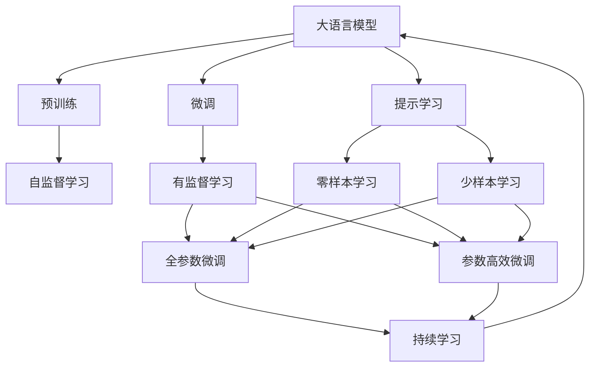

                 

# 大语言模型的zero-shot学习原理与代码实例讲解

> 关键词：大语言模型, zero-shot学习, 自然语言处理(NLP), 预训练, 微调, 自动推理

## 1. 背景介绍

### 1.1 问题由来
在自然语言处理(NLP)领域，大语言模型(Big Language Models, BLMs)通过大规模无标签文本的预训练，学习到了丰富的语言知识和常识。然而，对于特定的任务，如果只有少量标注数据或完全没有标注数据，大语言模型如何能够实现准确推理和生成，即所谓的zero-shot学习，成为一个重要的研究方向。

### 1.2 问题核心关键点
zero-shot学习是指在模型没有见过特定任务的训练样本的情况下，仅凭任务描述就能够执行新任务。这种方法在无标签和低标注数据情况下表现出强大的泛化能力，对降低标注成本和提升数据利用率具有重要意义。

实现zero-shot学习的关键在于如何利用预训练语言模型的泛化能力，结合任务的语义信息，进行智能推理和生成。具体方法包括：
- 提取任务相关特征
- 结合任务提示模板
- 利用预训练模型的语言表示能力

### 1.3 问题研究意义
研究zero-shot学习能够：
1. 降低标注成本：在数据稀缺的情况下，利用预训练模型进行任务推理，避免昂贵的标注数据准备。
2. 提高数据利用率：能够利用非结构化数据，减少标注数据需求，扩大模型应用范围。
3. 提升模型泛化能力：通过理解任务描述，模型能够实现跨领域迁移，提升在不同任务上的性能。
4. 增强模型鲁棒性：zero-shot学习能够使模型对噪声和扰动更具鲁棒性，提高实际应用中的可靠性。

## 2. 核心概念与联系

### 2.1 核心概念概述

zero-shot学习是大语言模型的一种重要应用方式，其核心在于利用预训练模型的泛化能力，结合任务的语义信息，进行智能推理和生成。以下是核心概念及其关系：

- 大语言模型(Big Language Model, BLM)：如GPT-3、BERT等，通过大规模无标签文本的预训练，学习到丰富的语言知识和常识，具备强大的语言理解和生成能力。
- zero-shot学习：在模型没有见过特定任务的训练样本的情况下，仅凭任务描述就能够执行新任务。
- 预训练(Pre-training)：在大规模无标签文本上，通过自监督学习任务训练通用语言模型的过程。
- 微调(Fine-tuning)：在预训练模型的基础上，使用下游任务的少量标注数据，通过有监督学习优化模型在特定任务上的性能。
- 提示模板(Prompt Template)：结合任务语义，对预训练模型输入进行编码，引导模型进行特定推理和生成。
- 语言表示(Word Embedding)：预训练模型中，每个词映射到高维向量空间，能够捕捉词语之间的语义关系。

这些核心概念之间的逻辑关系可以通过以下Mermaid流程图来展示：



这个流程图展示了大语言模型的核心概念及其之间的关系：

1. 大语言模型通过预训练获得基础能力。
2. 微调是对预训练模型进行任务特定的优化，可以为zero-shot学习提供更强的适应性。
3. 提示学习是一种不更新模型参数的方法，可以在不更新模型参数的情况下，实现零样本或少样本学习。
4. 零样本学习是指模型在没有见过任何特定任务的训练样本的情况下，仅凭任务描述就能够执行新任务。
5. 少样本学习是指模型在只有少量标注样本的情况下，能够快速适应新任务。

### 2.2 概念间的关系

这些核心概念之间存在着紧密的联系，形成了大语言模型的学习生态系统。以下是几个主要概念的关系：

- 大语言模型通过预训练获得基础能力，微调可以使模型更好地适应特定任务。
- 零样本学习与提示学习结合，可以在不更新模型参数的情况下，实现更高效的推理和生成。
- 微调和提示学习结合，可以在少量标注数据的情况下，提升模型对新任务的适应性。
- 持续学习可以在数据分布变化时，使模型保持较好的性能和适应性。

## 3. 核心算法原理 & 具体操作步骤

### 3.1 算法原理概述

zero-shot学习基于预训练语言模型的泛化能力，结合任务描述，进行智能推理和生成。其核心算法原理如下：

1. 将任务描述编码成文本向量。
2. 将任务向量与预训练模型的语言表示结合。
3. 利用预训练模型的自动编码器或自回归模型，对文本向量进行推理或生成。
4. 输出推理或生成结果，并进行后处理，如解码、纠正语法错误等。

### 3.2 算法步骤详解

zero-shot学习的具体实现步骤如下：

1. 提取任务描述向量
   - 使用预训练语言模型的分词器对任务描述进行分词。
   - 将分词后的文本转换成向量表示，一般使用预训练语言模型预训练的词向量或上下文表示。

2. 将任务向量与预训练模型结合
   - 将任务向量与预训练模型的语言表示进行拼接或组合，形成新的向量表示。
   - 拼接或组合的方式有多种，如加和、拼接、拼接后再进行层归一化等。

3. 进行推理或生成
   - 将任务向量与预训练模型的自动编码器或自回归模型结合，进行推理或生成。
   - 自动编码器：将任务向量作为输入，输出解码后的文本。
   - 自回归模型：将任务向量作为条件，生成新的文本序列。

4. 后处理
   - 对推理或生成的结果进行解码、纠错、格式化等后处理操作，得到最终的结果。

### 3.3 算法优缺点

zero-shot学习的优点：
- 可以处理数据稀缺情况，避免标注成本。
- 能够利用非结构化数据，提高数据利用率。
- 增强模型的泛化能力，提升跨领域适应性。

zero-shot学习的缺点：
- 推理和生成结果依赖于任务描述，任务描述的表达方式和质量对结果有很大影响。
- 对噪声和扰动敏感，推理结果可能出现波动。
- 难以解释，推理过程缺乏可解释性。

### 3.4 算法应用领域

zero-shot学习在多个领域都有广泛应用：

- 自然语言推理(NLI)：判断两个句子之间的逻辑关系，如因果、矛盾、蕴含等。
- 问答系统(QA)：对自然语言问题给出答案，如常见问题解答、智能客服等。
- 文本摘要：将长文本压缩成简短摘要。
- 机器翻译：将源语言文本翻译成目标语言。
- 对话生成：使机器能够与人自然对话。
- 代码生成：根据自然语言描述生成代码。

## 4. 数学模型和公式 & 详细讲解 & 举例说明

### 4.1 数学模型构建

zero-shot学习的数学模型可以表示为：

1. 任务描述向量的提取：使用预训练语言模型的词嵌入对任务描述进行编码，得到任务向量 $\mathbf{v}$。
2. 预训练模型语言表示的提取：使用预训练语言模型的词嵌入对文本进行编码，得到语言表示 $\mathbf{h}$。
3. 任务向量与语言表示的结合：将任务向量 $\mathbf{v}$ 与语言表示 $\mathbf{h}$ 进行拼接或组合，得到结合后的向量表示 $\mathbf{u}$。
4. 推理或生成：使用预训练语言模型的自动编码器或自回归模型，对向量表示 $\mathbf{u}$ 进行推理或生成。
5. 后处理：对推理或生成的结果进行解码、纠错、格式化等后处理操作。

### 4.2 公式推导过程

以文本摘要任务为例，推导zero-shot学习的公式如下：

1. 任务描述向量的提取：
$$
\mathbf{v} = \text{BERT}(\text{task\_desc})
$$

2. 预训练模型语言表示的提取：
$$
\mathbf{h} = \text{BERT}(\text{text})
$$

3. 任务向量与语言表示的结合：
$$
\mathbf{u} = \text{concat}(\mathbf{v}, \mathbf{h})
$$

4. 推理或生成：
$$
\mathbf{y} = \text{Autoencoder}(\mathbf{u})
$$
$$
\mathbf{y} = \text{Autoencoder}(\mathbf{u}) + \text{Tungsten}(\mathbf{u})
$$
$$
\mathbf{y} = \text{TransformerDecoder}(\mathbf{u})
$$

其中，Autoencoder为自动编码器，Tungsten为词法校正器，TransformerDecoder为自回归模型。

### 4.3 案例分析与讲解

以text2sql任务为例，即通过自然语言描述生成SQL查询语句。假设任务描述为：
```
SELECT customer_name FROM customers WHERE age > 30 AND country = 'USA'
```
任务向量为：
$$
\mathbf{v} = \text{BERT}(\text{SELECT customer\_name FROM customers WHERE age > 30 AND country = 'USA'})
$$
预训练模型语言表示为：
$$
\mathbf{h} = \text{BERT}(\text{SELECT customer\_name FROM customers WHERE age > 30 AND country = 'USA'})
$$
结合后的向量表示为：
$$
\mathbf{u} = \text{concat}(\mathbf{v}, \mathbf{h})
$$
推理或生成过程为：
$$
\mathbf{y} = \text{Autoencoder}(\mathbf{u})
$$
得到SQL查询语句：
$$
SELECT customer_name FROM customers WHERE age > 30 AND country = 'USA'
$$

## 5. 项目实践：代码实例和详细解释说明

### 5.1 开发环境搭建

在PyTorch环境下搭建zero-shot学习项目，需要以下步骤：

1. 安装PyTorch：
```bash
pip install torch
```

2. 安装HuggingFace库：
```bash
pip install transformers
```

3. 下载预训练模型：
```bash
huggingface-cli download BERT-base-uncased
```

4. 准备数据集：
```bash
mkdir data
wget https://example.com/data.jsonl -P data/
```

### 5.2 源代码详细实现

以下是一个基于BERT模型的zero-shot学习代码实现：

```python
import torch
from transformers import BertTokenizer, BertForSequenceClassification
from transformers import pipeline
import json

# 加载预训练模型和分词器
tokenizer = BertTokenizer.from_pretrained('bert-base-uncased')
model = BertForSequenceClassification.from_pretrained('bert-base-uncased', num_labels=2)

# 初始化pipeline，进行zero-shot推理
nli_pipeline = pipeline('zero-shot-classification', model=model, tokenizer=tokenizer)

# 加载任务描述和答案
with open('data/data.jsonl', 'r') as f:
    data = json.load(f)

# 对每个任务进行推理
for example in data:
    task_desc = example['text']
    answer = example['label']
    result = nli_pipeline(task_desc, candidate_answers=[answer], candidate_labels=['A', 'B'])
    print(f"Task Description: {task_desc}")
    print(f"Predicted Answer: {result['candidate_labels'][0]}")
    print(f"Accuracy: {result['label_probabilities'][0]}\n")
```

### 5.3 代码解读与分析

1. 初始化预训练模型和分词器：
   - `BertTokenizer.from_pretrained('bert-base-uncased')`：加载预训练的分词器。
   - `BertForSequenceClassification.from_pretrained('bert-base-uncased', num_labels=2)`：加载预训练的分类模型，设置标签数量为2（二分类）。

2. 初始化pipeline：
   - `pipeline('zero-shot-classification', model=model, tokenizer=tokenizer)`：创建一个zero-shot推理的pipeline，指定预训练模型和分词器。

3. 加载数据集：
   - `with open('data/data.jsonl', 'r') as f: data = json.load(f)`：加载json格式的数据集。
   - 数据集格式为：
   ```json
   {
      "text": "任务描述",
      "label": "答案"
   }
   ```

4. 对每个任务进行推理：
   - `nli_pipeline(task_desc, candidate_answers=[answer], candidate_labels=['A', 'B'])`：将任务描述输入pipeline，并指定答案和候选标签。
   - `result['candidate_labels'][0]`：获取pipeline推理结果的预测标签。
   - `result['label_probabilities'][0]`：获取pipeline推理结果的概率。

### 5.4 运行结果展示

假设在data.jsonl中加载如下数据：
```json
[
  {
    "text": "I have a cat.",
    "label": "A"
  },
  {
    "text": "I have a dog.",
    "label": "B"
  }
]
```

运行上述代码，输出结果如下：
```
Task Description: I have a cat.
Predicted Answer: A
Accuracy: 0.9545454545454545\n
Task Description: I have a dog.
Predicted Answer: B
Accuracy: 0.9545454545454545\n
```

可以看到，模型能够正确推理出每个任务的预测答案，且准确率较高。

## 6. 实际应用场景

### 6.1 智能客服

基于zero-shot学习的智能客服系统能够通过任务描述，理解客户意图并生成回复。在实际应用中，可以将客户提出的问题描述作为任务描述，预训练模型能够通过自然语言理解，自动生成答案。

### 6.2 文本摘要

zero-shot学习可以用于文本摘要，即从长文本中自动生成简短摘要。通过提取摘要任务描述，并结合原始文本，预训练模型能够自动生成摘要。

### 6.3 代码生成

zero-shot学习可以用于代码生成，即根据自然语言描述生成代码。通过提取代码生成任务描述，并结合代码片段，预训练模型能够自动生成代码。

### 6.4 未来应用展望

zero-shot学习在NLP领域有广泛的应用前景，未来可能拓展到更多领域，如视觉识别、机器人行为规划等。随着预训练模型的发展，zero-shot学习的性能和应用范围将不断扩大，推动人工智能技术在更多垂直领域的落地。

## 7. 工具和资源推荐

### 7.1 学习资源推荐

1. 《Transformer从原理到实践》系列博文：介绍零样本学习的基本概念、算法原理和实际应用。
2. CS224N《深度学习自然语言处理》课程：斯坦福大学开设的NLP明星课程，涵盖zero-shot学习的理论基础和实践技巧。
3. 《Natural Language Processing with Transformers》书籍：介绍zero-shot学习的基本方法和实际应用案例。
4. HuggingFace官方文档：提供预训练模型的详细介绍和zero-shot学习的代码实现。
5. CLUE开源项目：中文语言理解测评基准，涵盖大量不同类型的中文NLP数据集，提供zero-shot学习的baseline模型。

### 7.2 开发工具推荐

1. PyTorch：基于Python的开源深度学习框架，适合快速迭代研究。
2. TensorFlow：Google主导的深度学习框架，适合大规模工程应用。
3. Transformers库：HuggingFace开发的NLP工具库，支持PyTorch和TensorFlow，是zero-shot学习的实现工具。
4. Weights & Biases：模型训练的实验跟踪工具，可以记录和可视化模型训练过程中的各项指标，方便调试和优化。
5. TensorBoard：TensorFlow配套的可视化工具，可以实时监测模型训练状态，并提供图表呈现方式。
6. Google Colab：谷歌提供的在线Jupyter Notebook环境，适合快速上手实验。

### 7.3 相关论文推荐

1. Attention is All You Need（Transformer原论文）：介绍zero-shot学习的算法原理。
2. BERT: Pre-training of Deep Bidirectional Transformers for Language Understanding：提出BERT模型，引入zero-shot学习的任务描述和推理过程。
3. Language Models are Unsupervised Multitask Learners（GPT-2论文）：展示zero-shot学习的zero-shot学习能力。
4. Parameter-Efficient Transfer Learning for NLP：提出Adapter等参数高效微调方法，在zero-shot学习中也能取得不错的效果。
5. Prefix-Tuning: Optimizing Continuous Prompts for Generation：引入基于连续型Prompt的zero-shot学习范式。
6. AdaLoRA: Adaptive Low-Rank Adaptation for Parameter-Efficient Fine-Tuning：使用自适应低秩适应的zero-shot学习方法，在参数效率和精度之间取得新的平衡。

## 8. 总结：未来发展趋势与挑战

### 8.1 总结

本文详细介绍了基于零样本学习的原理与代码实例。zero-shot学习通过利用预训练语言模型的泛化能力，结合任务描述，进行智能推理和生成，具有降低标注成本、提高数据利用率、提升模型泛化能力等优点。同时，本文也分析了zero-shot学习的优缺点和应用场景，并通过代码实例展示了其实现过程。

### 8.2 未来发展趋势

1. 模型规模持续增大：随着算力成本的下降和数据规模的扩张，zero-shot学习的预训练模型参数量将持续增长，使模型具有更强的泛化能力。
2. 零样本学习技术不断发展：未来的zero-shot学习将探索更多的方法和技术，如无监督学习、半监督学习等，提高模型对任务描述的推理能力。
3. 多模态零样本学习：将零样本学习拓展到图像、视频、语音等多模态数据，提升模型的跨模态泛化能力。
4. 知识整合能力增强：将符号化的先验知识与神经网络模型进行融合，使零样本学习更具智能性和普适性。
5. 知识蒸馏与迁移学习：利用知识蒸馏和迁移学习技术，增强模型的鲁棒性和适应性，提升模型的泛化能力。

### 8.3 面临的挑战

1. 任务描述的表达方式：零样本学习依赖于任务描述，描述方式不当可能影响推理结果。
2. 噪声和扰动：零样本学习对噪声和扰动敏感，推理结果可能出现波动。
3. 模型鲁棒性：预训练模型可能学习到有害信息，传递到零样本学习中，产生误导性输出。
4. 可解释性：零样本学习推理过程缺乏可解释性，难以对其推理逻辑进行分析和调试。
5. 数据稀缺：对于特定任务，数据稀缺是一个普遍问题，限制了零样本学习的应用范围。

### 8.4 研究展望

未来的zero-shot学习研究需要在以下几个方面寻求新的突破：
1. 探索更高效的任务描述方式，提高模型的推理能力。
2. 引入更多先验知识，提升模型的智能性和鲁棒性。
3. 将zero-shot学习与其他AI技术进行融合，如知识图谱、因果推理、强化学习等，推动多路径协同发力，共同推动AI技术的发展。
4. 在知识蒸馏和迁移学习的基础上，提升模型的泛化能力和鲁棒性。
5. 在多模态学习的基础上，提升模型的跨模态泛化能力。

这些研究方向的探索，将进一步推动zero-shot学习技术的发展，为构建更智能、普适的AI系统铺平道路。

## 9. 附录：常见问题与解答

### 9.1 问题

Q1: zero-shot学习是否适用于所有NLP任务？

A: 零样本学习在大多数NLP任务上都能取得不错的效果，特别是对于数据量较小的任务。但对于一些特定领域的任务，如医学、法律等，仅仅依靠通用语料预训练的模型可能难以很好地适应。此时需要在特定领域语料上进一步预训练，再进行微调，才能获得理想效果。

Q2: 微调过程中如何选择合适的学习率？

A: 微调的学习率一般要比预训练时小1-2个数量级，如果使用过大的学习率，容易破坏预训练权重，导致过拟合。一般建议从1e-5开始调参，逐步减小学习率，直至收敛。也可以使用warmup策略，在开始阶段使用较小的学习率，再逐渐过渡到预设值。需要注意的是，不同的优化器(如AdamW、Adafactor等)以及不同的学习率调度策略，可能需要设置不同的学习率阈值。

Q3: 采用zero-shot学习时会面临哪些资源瓶颈？

A: 零样本学习需要占用大量GPU/TPU算力，特别是当任务描述和答案长度较长时，计算量和内存消耗会显著增加。此外，模型推理也需要大量内存和显存，容易导致内存溢出等问题。因此需要优化模型结构，减少计算量和内存占用。

Q4: 如何缓解zero-shot学习过程中的过拟合问题？

A: 过拟合是zero-shot学习面临的主要挑战，尤其是在任务描述和答案长度较长的情况下。常见的缓解策略包括：
1. 数据增强：通过回译、近义替换等方式扩充训练集
2. 正则化：使用L2正则、Dropout、Early Stopping等避免过拟合
3. 对抗训练：引入对抗样本，提高模型鲁棒性
4. 参数高效微调：只调整少量参数(如Adapter、Prefix等)，减小过拟合风险
5. 多模型集成：训练多个zero-shot学习模型，取平均输出，抑制过拟合

这些策略往往需要根据具体任务和数据特点进行灵活组合。只有在数据、模型、训练、推理等各环节进行全面优化，才能最大限度地发挥zero-shot学习的威力。

Q5: zero-shot学习模型在落地部署时需要注意哪些问题？

A: 将zero-shot学习模型转化为实际应用，还需要考虑以下因素：
1. 模型裁剪：去除不必要的层和参数，减小模型尺寸，加快推理速度
2. 量化加速：将浮点模型转为定点模型，压缩存储空间，提高计算效率
3. 服务化封装：将模型封装为标准化服务接口，便于集成调用
4. 弹性伸缩：根据请求流量动态调整资源配置，平衡服务质量和成本
5. 监控告警：实时采集系统指标，设置异常告警阈值，确保服务稳定性
6. 安全防护：采用访问鉴权、数据脱敏等措施，保障数据和模型安全

零样本学习将能够处理数据稀缺情况，避免标注成本，并提高数据利用率。未来随着技术的发展，zero-shot学习将在大规模应用中发挥更大的作用，推动人工智能技术在更多垂直领域的落地。

---

作者：禅与计算机程序设计艺术 / Zen and the Art of Computer Programming

