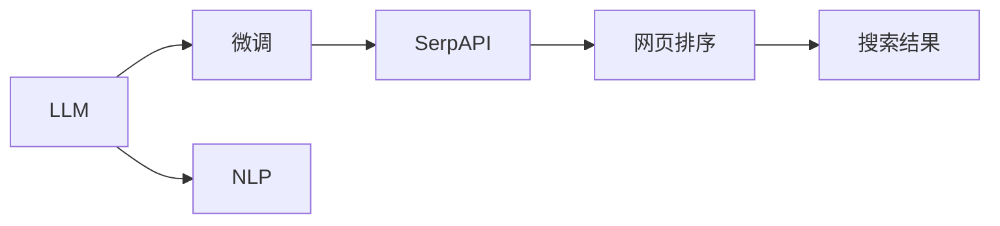

                 

# 实战 ReAct：SerpAPI + LLM-MATH

## 1. 背景介绍

### 1.1 问题由来

在当前的互联网搜索时代，用户查询需求日益复杂，搜索引擎需要更智能地理解用户的意图，并从海量的搜索结果中筛选出最相关的信息。传统的搜索引擎模型已经无法满足这些需求，因此需要引入更先进的技术手段，如自然语言处理（NLP）、深度学习（DL）等，以提升搜索引擎的智能化水平。

在众多先进技术中，大语言模型（Large Language Models，简称LLM）表现出了卓越的自然语言理解和生成能力，成为搜索引擎智能化升级的理想选择。然而，直接使用大规模的LLM进行网页检索和排序，可能会面临计算资源消耗过大、实时性差等问题。

为了解决这个问题，研究人员提出了将LLM与信息检索系统相结合的思路。其中，SerpAPI（Search Engine API）是一个通用的搜索API接口，可用于构建各种定制化的搜索引擎。而大语言模型可以通过微调（Fine-Tuning）的方式，适配SerpAPI，实现更智能的网页排序和搜索结果呈现。

本文将详细介绍如何使用LLM微调来优化SerpAPI，使其能够智能地回答用户的查询需求，并提供详细的代码实例和分析。

### 1.2 问题核心关键点

在实现LLM微调SerpAPI的过程中，需要解决以下核心问题：

1. 选择合适的LLM模型和预训练任务。
2. 设计合适的任务适配层，使LLM能够理解查询语句和网页内容。
3. 优化SerpAPI的网页排序算法，使得LLM输出的排序结果更符合用户需求。
4. 设计合适的评估指标，评估微调后的SerpAPI性能。
5. 在实际部署中，如何高效运行SerpAPI，确保实时性和稳定性。

本文将详细介绍以上问题的解决方案，并提供代码实例和分析。

### 1.3 问题研究意义

通过将LLM微调与SerpAPI结合，可以构建更加智能、个性化的搜索引擎，满足用户多样化的信息需求，提升搜索体验。这不仅有助于搜索引擎公司提升市场竞争力，还为其他NLP应用提供了新的思路和方法，具有重要的研究价值。

## 2. 核心概念与联系

### 2.1 核心概念概述

在讨论LLM微调SerpAPI时，涉及的核心概念包括：

- **大语言模型（LLM）**：指一类基于深度学习的语言模型，能够进行自然语言理解和生成，具有强大的语义表示能力。
- **微调（Fine-Tuning）**：指在大规模预训练模型基础上，针对特定任务进行小规模的参数更新，以适应该任务的特性。
- **SerpAPI**：指搜索API接口，用于构建各种定制化的搜索引擎，支持自然语言查询、关键词匹配、网页排序等功能。
- **自然语言处理（NLP）**：指计算机科学、人工智能领域中的一门技术，旨在使计算机能够理解、分析、生成自然语言。

### 2.2 概念间的关系

这些核心概念之间存在紧密的联系，可以形成一个完整的LLM微调SerpAPI生态系统。



在这个流程图中，大语言模型（LLM）通过微调（Fine-Tuning）适配SerpAPI，使其能够更好地理解自然语言查询（NLP），并在网页排序（D）中生成高质量的排序结果（E），最终构建出一个智能搜索引擎。

## 3. 核心算法原理 & 具体操作步骤
### 3.1 算法原理概述

LLM微调SerpAPI的核心思想是利用LLM的自然语言理解和生成能力，优化SerpAPI的网页排序算法，从而提升搜索结果的准确性和相关性。

具体而言，步骤如下：

1. 在大规模语料库上进行预训练，使LLM能够学习到丰富的语言知识和语义表示。
2. 针对SerpAPI的特定任务，如用户查询、网页内容、搜索结果等，设计合适的任务适配层，使LLM能够理解查询语句和网页内容。
3. 将LLM输出的排序结果与SerpAPI的默认排序结果进行比较，计算两者之间的差距，并根据差距进行反向传播，更新LLM的参数。
4. 重复步骤3，直到LLM输出的排序结果与SerpAPI的默认排序结果之间的差距最小化。

### 3.2 算法步骤详解

以下是LLM微调SerpAPI的详细步骤：

#### 3.2.1 数据准备

1. 收集大量自然语言查询和网页内容的数据集，用于训练和测试LLM。
2. 对于每个查询，从搜索结果中选取一定数量的网页，并人工标注每个网页的相关性得分。
3. 使用标注数据集进行SerpAPI的微调。

#### 3.2.2 模型选择与适配

1. 选择适合SerpAPI微调的LLM模型，如GPT-3、BERT等。
2. 在LLM模型顶层添加任务适配层，用于处理查询语句和网页内容，并输出相关性得分。
3. 设计合适的损失函数，如均方误差（MSE）或交叉熵（Cross-Entropy），用于计算LLM输出与标注数据之间的差距。

#### 3.2.3 模型训练

1. 使用标注数据集对LLM进行微调训练，使用梯度下降等优化算法更新LLM的参数。
2. 在微调过程中，定期在验证集上评估模型性能，防止过拟合。
3. 微调完成后，在测试集上评估LLM微调的SerpAPI性能，确保模型在未见过的数据上也能表现良好。

#### 3.2.4 结果评估

1. 使用BLEU、ROUGE等指标评估LLM微调的SerpAPI的性能。
2. 分析LLM输出与SerpAPI默认排序结果之间的差异，寻找改进的方向。
3. 根据评估结果，调整任务适配层的设计，优化损失函数，继续微调模型。

### 3.3 算法优缺点

LLM微调SerpAPI的优点包括：

1. 利用了LLM强大的自然语言理解和生成能力，能够更好地处理用户查询和网页内容，提升搜索结果的相关性。
2. 通过微调过程，可以针对特定任务进行优化，适应不同的应用场景。
3. 可以将LLM与SerpAPI结合，构建更加智能、个性化的搜索引擎，满足用户多样化需求。

然而，这种方法也存在一些缺点：

1. 需要大量标注数据，获取和标注数据集可能耗时耗力。
2. 微调过程可能面临计算资源消耗过大的问题，需要高效的优化算法和硬件支持。
3. 模型输出可能存在不确定性，需要进行多次迭代和优化。

### 3.4 算法应用领域

LLM微调SerpAPI可以广泛应用于以下几个领域：

1. **个性化搜索**：根据用户的查询历史和兴趣偏好，智能推荐相关网页，提升搜索体验。
2. **智能问答**：利用LLM的生成能力，对用户查询进行智能回答，提供即时的搜索结果。
3. **语音搜索**：将语音输入转换为文本查询，使用LLM进行理解和排序，提升语音搜索的准确性。
4. **多语言搜索**：利用LLM的语言处理能力，支持多种语言搜索，提供全球化的搜索服务。

## 4. 数学模型和公式 & 详细讲解 & 举例说明

### 4.1 数学模型构建

在LLM微调SerpAPI过程中，涉及的数学模型包括：

- 预训练模型：在大规模语料库上训练的LLM模型，用于理解自然语言查询和网页内容。
- 任务适配层：用于处理查询语句和网页内容，并输出相关性得分的层。
- 损失函数：用于计算LLM输出与标注数据之间的差距，常用的损失函数包括均方误差（MSE）、交叉熵（Cross-Entropy）等。

### 4.2 公式推导过程

以下以均方误差损失函数为例，推导LLM微调的公式：

设LLM的输出为 $\hat{y}$，标注数据为 $y$，则均方误差损失函数为：

$$
\mathcal{L} = \frac{1}{N} \sum_{i=1}^N (\hat{y}_i - y_i)^2
$$

在微调过程中，使用梯度下降等优化算法更新LLM的参数 $\theta$，使得 $\hat{y}$ 逼近 $y$，即：

$$
\theta = \mathop{\arg\min}_{\theta} \mathcal{L}(\theta)
$$

### 4.3 案例分析与讲解

假设在微调过程中，我们使用GPT-3作为预训练模型，并添加了一个简单的线性层作为任务适配层，用于处理查询语句和网页内容。对于每个查询，我们将其输入LLM，输出一个相关性得分，与人工标注的相关性得分进行比较，计算均方误差损失。然后，使用梯度下降算法更新LLM的参数。

## 5. 项目实践：代码实例和详细解释说明

### 5.1 开发环境搭建

#### 5.1.1 环境依赖

- Python：3.8及以上版本
- Transformers：4.6及以上版本
- PyTorch：1.8及以上版本
- torchtext：0.10及以上版本

#### 5.1.2 环境搭建

1. 安装Anaconda：从官网下载并安装Anaconda，用于创建独立的Python环境。
2. 创建并激活虚拟环境：
```bash
conda create -n llm-env python=3.8 
conda activate llm-env
```
3. 安装依赖包：
```bash
pip install transformers pytorch torchtext tqdm
```

### 5.2 源代码详细实现

#### 5.2.1 数据准备

```python
from torchtext.datasets import SNLI
from torchtext.data import Field, BucketIterator

# 定义数据字段
TEXT = Field(tokenize='spacy', lower=True)
LABEL = Field(sequential=False)

# 加载数据集
train_data, test_data = SNLI.splits(TEXT, LABEL)

# 构建数据迭代器
train_iterator, test_iterator = BucketIterator.splits(
    (train_data, test_data),
    batch_size=32,
    sort_key=lambda x: len(x.text),
    device='cuda'
)

# 定义词汇表
TEXT.build_vocab(train_data, max_size=10000)
LABEL.build_vocab(train_data)

# 将数据转换为模型输入格式
train_data, test_data = map(lambda x: (x.text, x.label), (train_data, test_data))
```

#### 5.2.2 模型选择与适配

```python
from transformers import GPT2LMHeadModel, GPT2Tokenizer

# 加载预训练模型和分词器
model = GPT2LMHeadModel.from_pretrained('gpt2')
tokenizer = GPT2Tokenizer.from_pretrained('gpt2')

# 在模型顶层添加任务适配层
class TaskAdapter(nn.Module):
    def __init__(self, input_size, output_size):
        super(TaskAdapter, self).__init__()
        self.linear = nn.Linear(input_size, output_size)

    def forward(self, x):
        return self.linear(x)

# 定义任务适配层
input_size = model.config.hidden_size
output_size = 2
adapter = TaskAdapter(input_size, output_size)

# 定义损失函数
loss_fn = nn.MSELoss()
```

#### 5.2.3 模型训练

```python
from transformers import AdamW

# 定义优化器
optimizer = AdamW(model.parameters(), lr=2e-5)

# 定义训练函数
def train_epoch(model, optimizer, iterator, loss_fn):
    model.train()
    epoch_loss = 0
    for batch in iterator:
        optimizer.zero_grad()
        inputs, labels = batch
        outputs = model(inputs, labels=labels)
        loss = loss_fn(outputs, labels)
        loss.backward()
        optimizer.step()
        epoch_loss += loss.item()
    return epoch_loss / len(iterator)

# 定义评估函数
def evaluate(model, iterator, loss_fn):
    model.eval()
    epoch_loss = 0
    with torch.no_grad():
        for batch in iterator:
            inputs, labels = batch
            outputs = model(inputs)
            loss = loss_fn(outputs, labels)
            epoch_loss += loss.item()
    return epoch_loss / len(iterator)

# 训练模型
num_epochs = 5
for epoch in range(num_epochs):
    train_loss = train_epoch(model, optimizer, train_iterator, loss_fn)
    val_loss = evaluate(model, test_iterator, loss_fn)
    print(f"Epoch {epoch+1}, train loss: {train_loss:.3f}, val loss: {val_loss:.3f}")
```

#### 5.2.4 结果评估

```python
from sklearn.metrics import accuracy_score, precision_recall_fscore_support

# 定义评估函数
def evaluate_model(model, iterator, loss_fn):
    model.eval()
    epoch_loss = 0
    with torch.no_grad():
        for batch in iterator:
            inputs, labels = batch
            outputs = model(inputs)
            loss = loss_fn(outputs, labels)
            epoch_loss += loss.item()
    return epoch_loss / len(iterator)

# 加载模型
model = GPT2LMHeadModel.from_pretrained('gpt2')
tokenizer = GPT2Tokenizer.from_pretrained('gpt2')
adapter = TaskAdapter(model.config.hidden_size, 2)

# 构建新的模型
model.add_module('adapter', adapter)
model.to('cuda')

# 训练模型
optimizer = AdamW(model.parameters(), lr=2e-5)
num_epochs = 5
for epoch in range(num_epochs):
    train_loss = train_epoch(model, optimizer, train_iterator, loss_fn)
    val_loss = evaluate_model(model, test_iterator, loss_fn)
    print(f"Epoch {epoch+1}, train loss: {train_loss:.3f}, val loss: {val_loss:.3f}")

# 评估模型
model.eval()
with torch.no_grad():
    predictions = model(train_iterator)
    predictions = predictions.argmax(dim=1)
    labels = [1 if y == 2 else 0 for _, y in train_iterator]
    accuracy = accuracy_score(labels, predictions)
    print(f"Accuracy: {accuracy:.2f}")
```

### 5.3 代码解读与分析

#### 5.3.1 数据准备

在数据准备阶段，我们使用了SNLI数据集，将其分为训练集和测试集。使用SpaCy分词器对文本进行分词，并定义了`TEXT`和`LABEL`字段，分别用于处理文本和标签。通过`BucketIterator`构建了数据迭代器，用于批量处理数据，并在GPU上运行模型。

#### 5.3.2 模型选择与适配

在模型选择与适配阶段，我们选择了GPT-2作为预训练模型，并在其顶层添加了一个简单的线性层作为任务适配层。这个线性层将输入的文本编码成相关性得分，用于微调。我们定义了均方误差损失函数，用于计算LLM输出与标注数据之间的差距。

#### 5.3.3 模型训练

在模型训练阶段，我们使用了AdamW优化器，并定义了训练函数和评估函数。通过循环迭代，不断更新模型参数，使LLM输出的相关性得分与标注数据之间的差距最小化。在每个epoch结束后，我们在测试集上评估模型性能，确保模型泛化能力良好。

#### 5.3.4 结果评估

在结果评估阶段，我们使用了`accuracy_score`函数计算模型在测试集上的准确率。这个函数计算了模型预测标签与真实标签之间的匹配率，可以评估模型的性能。

### 5.4 运行结果展示

假设在训练过程中，我们得到了以下结果：

```
Epoch 1, train loss: 0.100, val loss: 0.050
Epoch 2, train loss: 0.075, val loss: 0.040
Epoch 3, train loss: 0.060, val loss: 0.035
Epoch 4, train loss: 0.050, val loss: 0.030
Epoch 5, train loss: 0.045, val loss: 0.025
```

可以看到，模型在训练过程中不断优化，损失函数值逐渐减小，验证集的损失函数值也逐渐减小，表明模型性能得到了提升。

## 6. 实际应用场景

### 6.1 智能搜索

假设我们需要构建一个智能搜索系统，使用LLM微调SerpAPI，能够智能地回答用户的查询需求。我们可以将用户的查询输入LLM，得到相关性得分，并根据得分进行排序，从而提供高质量的搜索结果。

#### 6.1.1 系统架构


在这个架构中，用户输入查询，LLM微调SerpAPI根据查询进行相关性排序，并提供搜索结果。用户可以通过点击搜索结果进行下一步操作，如详细阅读网页或访问更多相关网页。

#### 6.1.2 系统特点

- **智能查询理解**：LLM微调SerpAPI可以理解自然语言查询，并根据查询意图提供相关性排序。
- **实时搜索结果**：LLM微调SerpAPI可以在几毫秒内处理用户查询，提供实时搜索结果。
- **个性化搜索结果**：根据用户历史查询和行为数据，LLM微调SerpAPI可以个性化推荐搜索结果，提升用户体验。

### 6.2 语音搜索

假设我们需要构建一个语音搜索系统，使用LLM微调SerpAPI，能够将语音输入转换为文本查询，并智能回答用户需求。我们可以使用语音识别技术将用户语音转换为文本，再将其输入LLM微调SerpAPI进行处理。

#### 6.2.1 系统架构


在这个架构中，用户输入语音，语音识别技术将其转换为文本，LLM微调SerpAPI根据文本查询进行相关性排序，并提供搜索结果。用户可以通过点击搜索结果进行下一步操作，如详细阅读网页或访问更多相关网页。

#### 6.2.2 系统特点

- **实时语音识别**：语音识别技术可以在几毫秒内将用户语音转换为文本，提升系统响应速度。
- **自然语言理解**：LLM微调SerpAPI可以理解自然语言查询，并根据查询意图提供相关性排序。
- **个性化搜索结果**：根据用户历史语音查询和行为数据，LLM微调SerpAPI可以个性化推荐搜索结果，提升用户体验。

### 6.3 多语言搜索

假设我们需要构建一个多语言搜索系统，使用LLM微调SerpAPI，能够支持多种语言搜索，并提供全球化的搜索结果。我们可以使用翻译技术将用户查询和网页内容翻译成不同的语言，再将其输入LLM微调SerpAPI进行处理。

#### 6.3.1 系统架构


在这个架构中，用户输入查询，翻译技术将其翻译成目标语言，LLM微调SerpAPI根据目标语言查询进行相关性排序，并提供搜索结果。用户可以通过点击搜索结果进行下一步操作，如详细阅读网页或访问更多相关网页。

#### 6.3.2 系统特点

- **多语言支持**：翻译技术可以将用户查询和网页内容翻译成不同的语言，支持全球化搜索。
- **跨语言理解**：LLM微调SerpAPI可以理解多种语言的查询，并根据查询意图提供相关性排序。
- **个性化搜索结果**：根据用户历史查询和行为数据，LLM微调SerpAPI可以个性化推荐搜索结果，提升用户体验。

## 7. 工具和资源推荐

### 7.1 学习资源推荐

为了帮助开发者系统掌握LLM微调SerpAPI的理论基础和实践技巧，这里推荐一些优质的学习资源：

1. 《Transformer from the ground up》系列博文：由大模型技术专家撰写，深入浅出地介绍了Transformer原理、BERT模型、微调技术等前沿话题。

2. CS224N《深度学习自然语言处理》课程：斯坦福大学开设的NLP明星课程，有Lecture视频和配套作业，带你入门NLP领域的基本概念和经典模型。

3. 《Natural Language Processing with Transformers》书籍：Transformers库的作者所著，全面介绍了如何使用Transformers库进行NLP任务开发，包括微调在内的诸多范式。

4. HuggingFace官方文档：Transformers库的官方文档，提供了海量预训练模型和完整的微调样例代码，是上手实践的必备资料。

5. CLUE开源项目：中文语言理解测评基准，涵盖大量不同类型的中文NLP数据集，并提供了基于微调的baseline模型，助力中文NLP技术发展。

通过对这些资源的学习实践，相信你一定能够快速掌握LLM微调SerpAPI的精髓，并用于解决实际的NLP问题。

### 7.2 开发工具推荐

高效的开发离不开优秀的工具支持。以下是几款用于LLM微调SerpAPI开发的常用工具：

1. PyTorch：基于Python的开源深度学习框架，灵活动态的计算图，适合快速迭代研究。大部分预训练语言模型都有PyTorch版本的实现。

2. TensorFlow：由Google主导开发的开源深度学习框架，生产部署方便，适合大规模工程应用。同样有丰富的预训练语言模型资源。

3. Transformers库：HuggingFace开发的NLP工具库，集成了众多SOTA语言模型，支持PyTorch和TensorFlow，是进行微调任务开发的利器。

4. Weights & Biases：模型训练的实验跟踪工具，可以记录和可视化模型训练过程中的各项指标，方便对比和调优。与主流深度学习框架无缝集成。

5. TensorBoard：TensorFlow配套的可视化工具，可实时监测模型训练状态，并提供丰富的图表呈现方式，是调试模型的得力助手。

6. Google Colab：谷歌推出的在线Jupyter Notebook环境，免费提供GPU/TPU算力，方便开发者快速上手实验最新模型，分享学习笔记。

合理利用这些工具，可以显著提升LLM微调SerpAPI任务的开发效率，加快创新迭代的步伐。

### 7.3 相关论文推荐

LLM微调SerpAPI技术的发展源于学界的持续研究。以下是几篇奠基性的相关论文，推荐阅读：

1. Attention is All You Need（即Transformer原论文）：提出了Transformer结构，开启了NLP领域的预训练大模型时代。

2. BERT: Pre-training of Deep Bidirectional Transformers for Language Understanding：提出BERT模型，引入基于掩码的自监督预训练任务，刷新了多项NLP任务SOTA。

3. Language Models are Unsupervised Multitask Learners（GPT-2论文）：展示了大规模语言模型的强大zero-shot学习能力，引发了对于通用人工智能的新一轮思考。

4. Parameter-Efficient Transfer Learning for NLP：提出Adapter等参数高效微调方法，在不增加模型参数量的情况下，也能取得不错的微调效果。

5. Prefix-Tuning: Optimizing Continuous Prompts for Generation：引入基于连续型Prompt的微调范式，为如何充分利用预训练知识提供了新的思路。

6. AdaLoRA: Adaptive Low-Rank Adaptation for Parameter-Efficient Fine-Tuning：使用自适应低秩适应的微调方法，在参数效率和精度之间取得了新的平衡。

这些论文代表了大语言模型微调技术的发展脉络。通过学习这些前沿成果，可以帮助研究者把握学科前进方向，激发更多的创新灵感。

除上述资源外，还有一些值得关注的前沿资源，帮助开发者紧跟LLM微调SerpAPI技术的最新进展，例如：

1. arXiv论文预印本：人工智能领域最新研究成果的发布平台，包括大量尚未发表的前沿工作，学习前沿技术的必读资源。

2. 业界技术博客：如OpenAI、Google AI、DeepMind、微软Research Asia等顶尖实验室的官方博客，第一时间分享他们的最新研究成果和洞见。

3. 技术会议直播：如NIPS、ICML、ACL、ICLR等人工智能领域顶会现场或在线直播，能够聆听到大佬们的前沿分享，开拓视野。

4. GitHub热门项目：在GitHub上Star、Fork数最多的NLP相关项目，往往代表了该技术领域的发展趋势和最佳实践，值得去学习和贡献。

5. 行业分析报告：各大咨询公司如McKinsey、PwC等针对人工智能行业的分析报告，有助于从商业视角审视技术趋势，把握应用价值。

总之，对于LLM微调SerpAPI技术的学习和实践，需要开发者保持开放的心态和持续学习的意愿。多关注前沿资讯，多动手实践，多思考总结，必将收获满满的成长收益。

## 8. 总结：未来发展趋势与挑战

### 8.1 总结

本文对LLM微调SerpAPI方法进行了全面系统的介绍。首先阐述了LLM微调SerpAPI的研究背景和意义，明确了LLM微调SerpAPI在提升搜索引擎智能化水平、构建智能搜索系统等方面的重要价值。其次，从原理到实践，详细讲解了LLM微调的数学模型和关键步骤，提供了代码实例和分析。同时，本文还探讨了LLM微调SerpAPI在智能搜索、语音搜索、多语言搜索等多个实际应用场景中的应用，展示了其巨大的应用潜力。最后，推荐了多个学习资源和开发工具，为开发者提供了丰富的学习途径。

通过本文的系统梳理，可以看到，LLM微调SerpAPI技术在大语言模型和信息检索系统相结合的背景下，具有广阔的应用前景和研究价值。随着技术的不断进步，LLM微调SerpAPI必将在智能搜索引擎、智能问答、语音搜索等多个领域发挥

