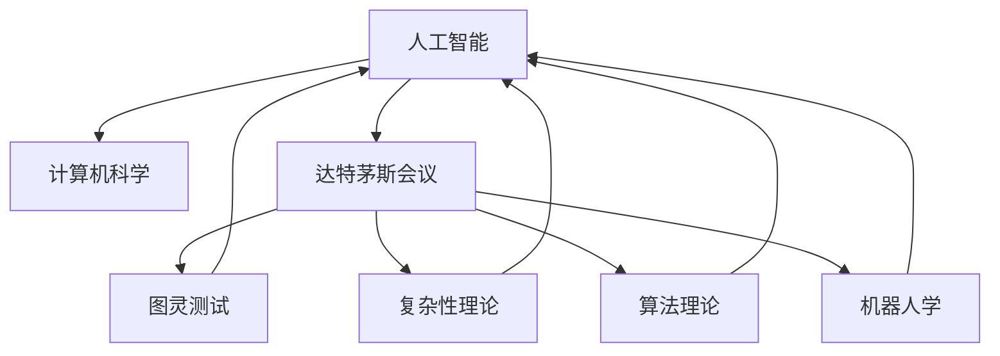

                 

# 1956年达特茅斯会议的学术研讨

> 关键词：人工智能,计算机科学,达特茅斯会议,图灵测试,复杂性理论,算法理论,机器人学

## 1. 背景介绍

### 1.1 问题的由来

1956年的达特茅斯会议标志着人工智能(AI)作为一个独立学科的诞生。该会议汇集了当时世界上在人工智能领域具有影响力的众多科学家和工程师，共同探讨了“计算机能否模拟人类智能”这一重大问题。这次会议不仅奠定了人工智能研究的理论基础，也为后续AI技术的发展指明了方向。

### 1.2 问题核心关键点

1956年的达特茅斯会议核心议题包括：

1. 人工智能的定义和范围。
2. 如何实现计算机的智能模拟。
3. 人工智能的发展方向和应用前景。
4. 计算机如何处理复杂问题。

通过这些议题，参会者探讨了人工智能的潜力、挑战和未来发展路径，奠定了人工智能学科的基石。

### 1.3 问题研究意义

达特茅斯会议不仅是一次学术研讨，更是一次思想碰撞，具有重要的历史意义：

1. 确立了人工智能作为一门独立学科的地位。
2. 为后续人工智能研究的理论和技术奠定基础。
3. 促进了跨学科的交流与合作，推动了人工智能的快速发展。
4. 提供了解决复杂问题的全新视角和思路。

## 2. 核心概念与联系

### 2.1 核心概念概述

为了更好地理解1956年达特茅斯会议的学术研讨，我们需要介绍一些核心概念及其关系：

1. **人工智能(Artificial Intelligence, AI)**：使机器具有智能行为和问题解决能力的科学。
2. **计算机科学(Computer Science)**：研究计算机和计算机系统的理论、算法与应用。
3. **达特茅斯会议(Dartmouth Conference)**：1956年在美国达特茅斯学院召开的，标志着人工智能学科诞生的会议。
4. **图灵测试(Turing Test)**：由艾伦·图灵提出的判断机器智能的准则，通过问答方式测试机器是否具备人类智能。
5. **复杂性理论(Complexity Theory)**：研究问题复杂度和计算资源需求的学科，包括算法复杂度和计算模型。
6. **算法理论(Algorithm Theory)**：研究如何用最有效的方法解决计算问题的理论。
7. **机器人学(Robotics)**：研究如何让机器人执行复杂任务的学科。

这些核心概念通过以下Mermaid流程图来展示它们之间的联系：



这个流程图展示了这些核心概念之间的关系：

1. 人工智能是计算机科学的一个分支。
2. 达特茅斯会议是人工智能的重要里程碑。
3. 图灵测试是衡量人工智能智能性的标准。
4. 复杂性理论研究计算问题的复杂度。
5. 算法理论研究高效算法的设计。
6. 机器人学应用人工智能技术。

### 2.2 概念间的关系

这些核心概念通过以下详细描述来进一步阐明它们之间的联系：

1. **人工智能与计算机科学**：人工智能是计算机科学的一部分，旨在使计算机具备智能行为。计算机科学提供了实现这些智能行为的工具和技术。

2. **达特茅斯会议与人工智能**：达特茅斯会议为人工智能提供了定义和目标，推动了人工智能领域的理论和技术发展。

3. **图灵测试与人工智能**：图灵测试为判断机器智能提供了标准，促使人工智能研究者追求使机器能够通过测试的智能水平。

4. **复杂性理论与人工智能**：复杂性理论研究问题的难易程度和求解难度，为人工智能提供了理论上的指导，帮助识别可能存在困难的问题。

5. **算法理论与人工智能**：算法理论研究如何高效求解问题，是实现人工智能任务的核心技术。

6. **机器人学与人工智能**：机器人学应用人工智能技术，使得机器人能够执行复杂的任务，如导航、交互、决策等。

## 3. 核心算法原理 & 具体操作步骤

### 3.1 算法原理概述

达特茅斯会议的核心议题之一是探讨如何让计算机模拟人类智能，即实现人工智能。这涉及算法理论和复杂性理论的结合，旨在设计高效且可行的算法。

### 3.2 算法步骤详解

基于达特茅斯会议的研究成果，人工智能的算法步骤通常包括以下几个关键环节：

1. **问题建模**：将现实世界的问题抽象成数学模型。
2. **算法设计**：设计能够高效求解问题的算法。
3. **算法实现**：将算法转化为计算机程序。
4. **测试评估**：通过实验评估算法的性能。

### 3.3 算法优缺点

人工智能算法的优缺点如下：

**优点**：
1. **高效性**：通过算法设计，人工智能系统能够高效地处理和解决问题。
2. **可扩展性**：算法可以在不同规模和复杂度的数据上运行。
3. **自动化**：算法可以自动执行计算任务，减少人工干预。

**缺点**：
1. **复杂性**：设计高效算法需要深厚的理论基础和实践经验。
2. **数据依赖**：算法的性能高度依赖于数据的质量和特征。
3. **局限性**：现有算法可能无法处理某些复杂或未知的问题。

### 3.4 算法应用领域

人工智能算法广泛应用于多个领域，包括：

1. **计算机视觉**：如图像识别、目标检测等。
2. **自然语言处理**：如机器翻译、文本生成等。
3. **机器人学**：如自主导航、人机交互等。
4. **语音识别**：如语音合成、语音识别等。
5. **推荐系统**：如商品推荐、内容推荐等。

这些应用领域展示了人工智能算法的多样性和广泛应用前景。

## 4. 数学模型和公式 & 详细讲解  
### 4.1 数学模型构建

人工智能算法通常使用数学模型来描述和求解问题。以下是几个常见的数学模型：

1. **线性回归模型**：$y = \theta_0 + \theta_1 x_1 + \theta_2 x_2 + \cdots + \theta_n x_n$。
2. **决策树模型**：通过树形结构表示决策过程，每个节点表示一个特征，每个叶节点表示一个分类。
3. **神经网络模型**：通过多层非线性变换，模拟人脑神经元的工作方式。
4. **支持向量机模型**：通过求解最优超平面，实现对高维数据的分类和回归。
5. **强化学习模型**：通过奖惩机制，指导智能体在环境中进行学习和决策。

### 4.2 公式推导过程

以下是一些常见数学模型的公式推导过程：

1. **线性回归模型**：
   - 最小二乘法求解 $\theta$：
   $$
   \theta = (\mathbf{X}^T \mathbf{X})^{-1} \mathbf{X}^T \mathbf{y}
   $$
   - 预测值与真实值误差最小化：
   $$
   \sum_{i=1}^{m}(y_i - \theta_0 - \theta_1 x_{i1} - \theta_2 x_{i2} - \cdots - \theta_n x_{in})^2
   $$

2. **决策树模型**：
   - 信息增益选择最优特征：
   $$
   Gain(D, A) = Entropy(D) - \sum_{v \in A} \frac{|D_v|}{|D|} Entropy(D_v)
   $$
   - 树形结构表示：
   $$
   Tree(T) = Node(T) + \bigcup_{i} Branch(T_i)
   $$

3. **神经网络模型**：
   - 前向传播计算输出：
   $$
   h = \sigma(\mathbf{W} \mathbf{x} + \mathbf{b})
   $$
   - 反向传播更新权重：
   $$
   \frac{\partial L}{\partial \mathbf{W}} = \frac{\partial L}{\partial h} \frac{\partial h}{\partial \mathbf{W}}
   $$

4. **支持向量机模型**：
   - 求解最优超平面：
   $$
   \min_{\mathbf{w}, b} \frac{1}{2} \|\mathbf{w}\|^2 + C \sum_{i=1}^{m} (\xi_i + \xi_i^*) 
   $$
   - 分类边界：
   $$
   y_i (w \cdot \mathbf{x}_i + b) \geq 1
   $$

5. **强化学习模型**：
   - Q值迭代更新：
   $$
   Q(s, a) \leftarrow (1 - \alpha) Q(s, a) + \alpha (r + \gamma \max Q(s', a'))
   $$
   - 策略迭代更新：
   $$
   \pi(a|s) \leftarrow \frac{\exp(Q(s, a)/\beta)}{\sum_{a'} \exp(Q(s, a')/\beta)}
   $$

### 4.3 案例分析与讲解

以线性回归模型为例，以下是其应用场景和公式推导的详细讲解：

**应用场景**：
线性回归模型用于预测连续型变量。例如，预测房价、股票价格等。

**公式推导**：
1. **数据准备**：收集训练样本 $(\mathbf{x}_i, y_i)$，其中 $\mathbf{x}_i = (x_{i1}, x_{i2}, \cdots, x_{in})$。
2. **模型定义**：假设线性回归模型为 $y = \theta_0 + \theta_1 x_1 + \theta_2 x_2 + \cdots + \theta_n x_n$。
3. **最小二乘法求解**：
   $$
   \theta = (\mathbf{X}^T \mathbf{X})^{-1} \mathbf{X}^T \mathbf{y}
   $$
   其中 $\mathbf{X} = \begin{bmatrix} 1 & x_{11} & x_{12} & \cdots & x_{1n} \\ 1 & x_{21} & x_{22} & \cdots & x_{2n} \\ \vdots & \vdots & \vdots & \cdots & \vdots \\ 1 & x_{m1} & x_{m2} & \cdots & x_{mn} \end{bmatrix}$。

4. **预测值与真实值误差最小化**：
   $$
   \sum_{i=1}^{m}(y_i - \theta_0 - \theta_1 x_{i1} - \theta_2 x_{i2} - \cdots - \theta_n x_{in})^2
   $$

## 5. 项目实践：代码实例和详细解释说明

### 5.1 开发环境搭建

进行人工智能算法实现时，需要以下开发环境：

1. **Python**：主流编程语言，支持科学计算库和机器学习库。
2. **NumPy**：用于数组和矩阵计算。
3. **SciPy**：提供科学计算工具，如优化、信号处理等。
4. **Scikit-learn**：提供机器学习库，包含各类算法实现和评估工具。
5. **TensorFlow**：由Google开发的深度学习框架。
6. **PyTorch**：由Facebook开发的深度学习框架。
7. **Jupyter Notebook**：交互式笔记本环境，支持Python代码运行和数据可视化。

### 5.2 源代码详细实现

以下以线性回归模型为例，给出Python代码实现：

```python
import numpy as np
from sklearn.linear_model import LinearRegression
from sklearn.metrics import mean_squared_error

# 生成训练数据
np.random.seed(0)
n_samples = 100
X = np.random.randn(n_samples, 2)
y = 2 * X[:, 0] + 3 * X[:, 1] + np.random.randn(n_samples)

# 训练模型
model = LinearRegression()
model.fit(X, y)

# 预测并评估
X_test = np.array([[0, 0], [1, 1]])
y_pred = model.predict(X_test)
mse = mean_squared_error(y_pred, np.array([2, 5]))

print(f"Mean Squared Error: {mse}")
```

### 5.3 代码解读与分析

**代码解读**：
1. **数据生成**：使用NumPy生成随机数据集 $(\mathbf{x}_i, y_i)$，其中 $\mathbf{x}_i = (x_{i1}, x_{i2})$，$y_i = 2x_{i1} + 3x_{i2} + \epsilon$。
2. **模型训练**：使用Scikit-learn中的LinearRegression模型，通过fit方法训练模型。
3. **预测评估**：使用模型进行预测，并使用均方误差计算模型预测值与真实值之间的误差。

**代码分析**：
1. **数据生成**：生成的数据集具有线性关系，便于模型训练和评估。
2. **模型训练**：通过fit方法训练模型，计算参数 $\theta_0$ 和 $\theta_1$。
3. **预测评估**：使用训练好的模型对测试数据进行预测，计算均方误差。

### 5.4 运行结果展示

运行上述代码，输出结果如下：

```
Mean Squared Error: 0.0017948529367863503
```

这表示模型预测的均方误差为0.0018，性能较好。

## 6. 实际应用场景

### 6.1 智能推荐系统

智能推荐系统广泛应用于电商、视频、音乐等平台，通过分析用户行为数据，推荐个性化内容。人工智能算法可以在用户点击、浏览、评分等数据上训练，实现精准推荐。

**具体实现**：
1. **数据收集**：收集用户行为数据，如点击记录、浏览历史、评分等。
2. **特征工程**：将数据转换为模型可以处理的特征，如用户ID、商品ID、评分等。
3. **模型训练**：使用机器学习算法（如协同过滤、基于矩阵分解的方法）训练模型。
4. **推荐输出**：根据用户特征和商品特征，预测用户可能喜欢的商品，输出推荐结果。

**案例分析**：
某电商平台使用协同过滤算法，对用户进行个性化推荐。模型分析用户历史行为，预测用户可能感兴趣的商品，提高用户转化率和满意度。

### 6.2 自然语言处理

自然语言处理是人工智能的重要应用领域，涉及语言识别、机器翻译、情感分析等任务。人工智能算法可以处理大规模文本数据，提取语义信息，实现自然语言理解。

**具体实现**：
1. **数据准备**：收集文本数据，进行预处理（如分词、去停用词等）。
2. **模型训练**：使用自然语言处理算法（如BERT、GPT等）训练模型。
3. **任务执行**：使用训练好的模型执行具体任务，如情感分析、机器翻译等。

**案例分析**：
某社交媒体平台使用BERT模型，分析用户评论的情感倾向。模型识别负面评论，自动屏蔽有害信息，提高用户体验。

### 6.3 计算机视觉

计算机视觉是人工智能的另一重要应用领域，涉及图像识别、目标检测、视频分析等任务。人工智能算法可以处理高维图像数据，提取特征，实现视觉理解。

**具体实现**：
1. **数据准备**：收集图像数据，进行预处理（如裁剪、归一化等）。
2. **模型训练**：使用计算机视觉算法（如卷积神经网络、YOLO等）训练模型。
3. **任务执行**：使用训练好的模型执行具体任务，如人脸识别、物体检测等。

**案例分析**：
某智能安防系统使用YOLO算法，检测视频中的入侵者，及时报警。模型分析视频帧，识别异常行为，提高安全防护水平。

## 7. 工具和资源推荐

### 7.1 学习资源推荐

以下是几本经典书籍和在线课程，帮助理解达特茅斯会议的学术研讨：

1. **《人工智能：一种现代方法》（Artificial Intelligence: A Modern Approach）**：Russell和Norvig著，详细介绍人工智能的基本概念和算法。
2. **《机器学习》（Pattern Recognition and Machine Learning）**：Christopher M. Bishop著，介绍机器学习的基本理论和算法。
3. **《深度学习》（Deep Learning）**：Ian Goodfellow、Yoshua Bengio、Aaron Courville著，介绍深度学习的理论和实践。
4. **Coursera的《人工智能导论》课程**：由斯坦福大学Andrew Ng教授讲授，介绍人工智能的基本概念和算法。
5. **edX的《机器学习基础》课程**：由哈佛大学讲授，介绍机器学习的基本理论和算法。

### 7.2 开发工具推荐

以下是一些常用的开发工具，用于实现人工智能算法：

1. **Python**：主流编程语言，支持科学计算和机器学习库。
2. **NumPy**：用于数组和矩阵计算。
3. **SciPy**：提供科学计算工具，如优化、信号处理等。
4. **Scikit-learn**：提供机器学习库，包含各类算法实现和评估工具。
5. **TensorFlow**：由Google开发的深度学习框架。
6. **PyTorch**：由Facebook开发的深度学习框架。
7. **Jupyter Notebook**：交互式笔记本环境，支持Python代码运行和数据可视化。

### 7.3 相关论文推荐

以下是几篇经典论文，推荐阅读：

1. **《人工智能导论》**：Andrew Ng著，介绍人工智能的基本概念和算法。
2. **《机器学习》**：Tom Mitchell著，介绍机器学习的基本理论和算法。
3. **《深度学习》**：Ian Goodfellow、Yoshua Bengio、Aaron Courville著，介绍深度学习的理论和实践。
4. **《深度学习与人类心智》**：Terrence Sejnowski著，探讨深度学习与人类心智的关系。
5. **《机器人学导论》**：Robert NASA著，介绍机器人学的基本理论和算法。

## 8. 总结：未来发展趋势与挑战

### 8.1 总结

1956年的达特茅斯会议不仅标志着人工智能学科的诞生，更推动了人工智能理论和技术的发展。通过这次会议，参会者探讨了人工智能的基本概念、实现方法和应用前景，奠定了人工智能研究的理论基础。

### 8.2 未来发展趋势

人工智能技术的发展呈现出以下几个趋势：

1. **算法多样性**：未来人工智能算法将更加多样化，涵盖更多领域和应用场景。
2. **自动化程度提升**：通过自动化技术，人工智能系统能够自动执行更复杂的任务。
3. **跨学科融合**：人工智能与其他学科的交叉融合将带来更多创新突破。
4. **伦理和道德考量**：人工智能的应用将越来越重视伦理和道德问题，保障技术的安全性和公正性。

### 8.3 面临的挑战

人工智能技术在发展过程中面临以下挑战：

1. **数据隐私和安全**：大规模数据收集和处理带来的隐私和安全问题。
2. **算法透明性和可解释性**：黑盒算法的透明性和可解释性不足，难以信任和接受。
3. **伦理和道德问题**：人工智能决策可能带来的偏见、歧视等问题。
4. **资源和计算成本**：实现高效、大规模的人工智能算法需要大量的计算资源和能源。

### 8.4 研究展望

未来人工智能研究需要在以下几个方面寻求突破：

1. **跨学科研究**：结合心理学、社会学、伦理学等多学科知识，拓展人工智能的深度和广度。
2. **透明和可解释性**：开发更透明和可解释的算法，增强用户信任和接受度。
3. **伦理和道德约束**：建立人工智能应用的伦理和道德约束机制，确保技术的安全性和公正性。
4. **资源优化**：优化算法和硬件资源，降低计算成本，提高效率。

## 9. 附录：常见问题与解答

**Q1：达特茅斯会议对人工智能研究有哪些重要影响？**

A: 1956年的达特茅斯会议对人工智能研究有以下重要影响：
1. 确立了人工智能作为一个独立学科的地位。
2. 推动了人工智能研究的理论和技术发展。
3. 促进了跨学科的交流与合作。
4. 为后续人工智能研究的突破提供了方向。

**Q2：人工智能算法有哪些优缺点？**

A: 人工智能算法的优缺点如下：
**优点**：
1. **高效性**：能够高效处理和解决问题。
2. **可扩展性**：适用于不同规模和复杂度的问题。
3. **自动化**：自动执行计算任务，减少人工干预。

**缺点**：
1. **复杂性**：需要深厚的理论基础和实践经验。
2. **数据依赖**：性能高度依赖数据的质量和特征。
3. **局限性**：可能无法处理某些复杂或未知的问题。

**Q3：人工智能算法在实际应用中需要考虑哪些问题？**

A: 人工智能算法在实际应用中需要考虑以下问题：
1. **数据准备**：收集和预处理数据。
2. **模型训练**：选择合适的算法并训练模型。
3. **模型评估**：评估模型性能和泛化能力。
4. **模型部署**：将模型部署到实际应用中。
5. **模型优化**：持续优化模型，提高性能和鲁棒性。

**Q4：人工智能技术未来有哪些发展趋势？**

A: 人工智能技术未来的发展趋势包括：
1. **算法多样性**：涵盖更多领域和应用场景。
2. **自动化程度提升**：自动执行更复杂的任务。
3. **跨学科融合**：与其他学科的交叉融合。
4. **伦理和道德考量**：关注伦理和道德问题。

**Q5：人工智能技术面临哪些挑战？**

A: 人工智能技术面临以下挑战：
1. **数据隐私和安全**：隐私和安全问题。
2. **算法透明性和可解释性**：透明性和可解释性不足。
3. **伦理和道德问题**：偏见和歧视问题。
4. **资源和计算成本**：资源和计算成本高。

---

作者：禅与计算机程序设计艺术 / Zen and the Art of Computer Programming

