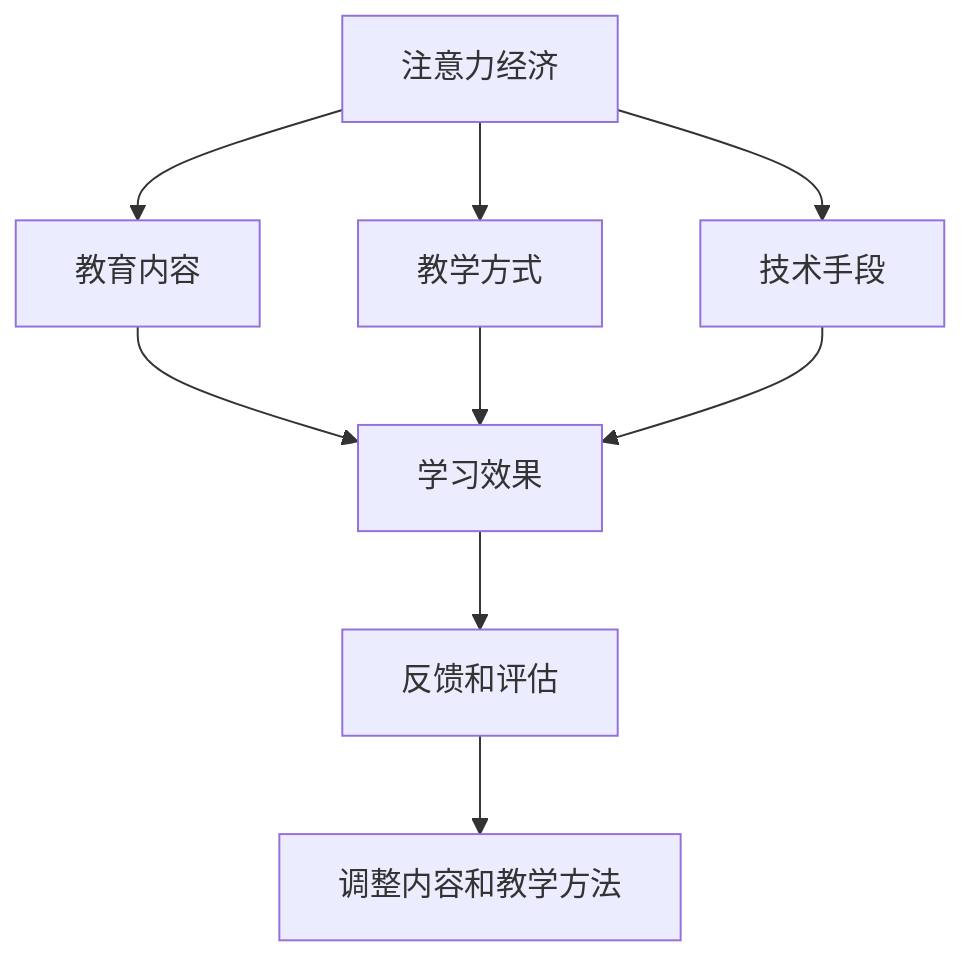
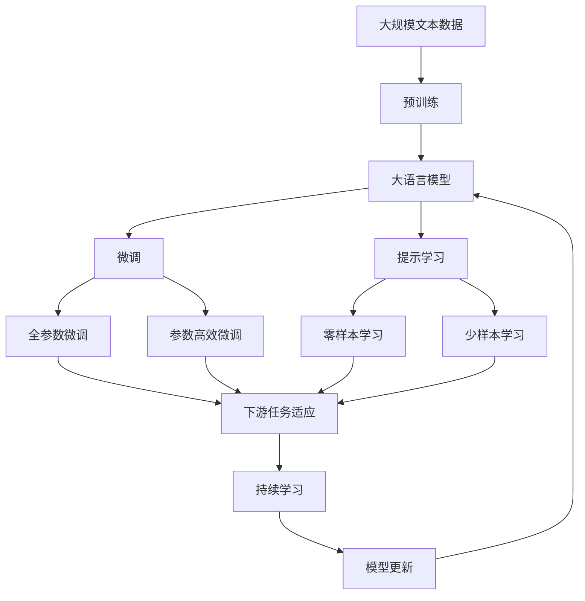

                 

## 1. 背景介绍

### 1.1 问题由来

当前社会正在经历一场深远的变革，注意力经济已经成为一个不可避免的话题。随着数字媒体、社交网络、在线教育等新兴技术的兴起，信息的快速增长使得人们面临信息过载的问题。教育领域也不例外，学生、教师和教育机构需要处理海量的信息，并从中筛选出对学习和教学有帮助的内容，这一过程既耗费时间又消耗精力。因此，如何应对注意力经济，提高教育的效率和质量，成为了一个亟待解决的问题。

### 1.2 问题核心关键点

注意力经济的核心在于如何分配和管理人们的注意力资源。在教育领域，这一问题可以转化为如何设计有效的教育内容和教学方式，以最大程度地吸引和保持学生的注意力，从而提高学习效果和教学质量。具体来说，关键点包括：

- 如何设计有吸引力的教育内容，吸引学生的注意力。
- 如何采用有效的教学方式，保持学生的注意力。
- 如何利用技术手段，帮助学生和教师筛选和利用信息资源。
- 如何通过反馈和评估，调整教育内容和教学方法，以适应学生的学习需求。

### 1.3 问题研究意义

在数字化和信息化的时代，教育领域面临着重大的挑战和机遇。应对注意力经济，设计出既能吸引学生注意力，又能提升学习效果的教学内容和方法，不仅能够提升教育质量，还能够为未来的教育和人才培养提供有力的支持。这不仅关乎学生的个体发展，也关乎国家的人才储备和科技创新。

## 2. 核心概念与联系

### 2.1 核心概念概述

为了更好地理解注意力经济在教育领域的应用，本文将介绍几个关键概念：

- **注意力经济（Attention Economy）**：指信息时代，注意力资源成为一种稀缺的资源，获取和利用注意力成为商业和社会的重要课题。
- **教育内容（Educational Content）**：指用于教学和学习的各种信息和资料，包括教材、课程、讲座、多媒体等。
- **教学方式（Teaching Methods）**：指在教学过程中采用的方法和策略，如讲授法、讨论法、项目法等。
- **技术手段（Technological Means）**：指利用技术工具和管理方法，帮助学生和教师处理信息资源，提升教学效率。
- **学习效果（Learning Effectiveness）**：指学生在学习过程中所取得的知识和技能，以及这些知识和技能对未来发展和职业竞争力的影响。

这些概念之间存在着紧密的联系，形成了教育领域的注意力经济生态系统。

### 2.2 概念间的关系

这些核心概念之间的关系可以通过以下Mermaid流程图来展示：



这个流程图展示了大语言模型微调过程中各个概念之间的关系：

1. 注意力经济驱动着教育内容的产生和选择。
2. 教学方式的设计和实施，直接影响学生的学习效果。
3. 技术手段的引入，可以帮助学生和教师更好地利用注意力资源，提高教学效率。
4. 学习效果的反馈和评估，可以指导教学内容的调整和改进。
5. 通过不断调整和优化，提升学习效果和教学质量。

### 2.3 核心概念的整体架构

最后，我们用一个综合的流程图来展示这些核心概念在大语言模型微调过程中的整体架构：



这个综合流程图展示了从预训练到微调，再到持续学习的完整过程。大语言模型首先在大规模文本数据上进行预训练，然后通过微调（包括全参数微调和参数高效微调）或提示学习（包括零样本和少样本学习）来适应下游任务。最后，通过持续学习技术，模型可以不断更新和适应新的任务和数据。

## 3. 核心算法原理 & 具体操作步骤

### 3.1 算法原理概述

基于注意力经济的微调方法，本质上是一个有监督的细粒度迁移学习过程。其核心思想是：将预训练的大语言模型视作一个强大的"特征提取器"，通过在特定的教育内容上加入有意义的标签，训练模型学习识别和提取这些特征，从而在后续的教学过程中能够更加高效地利用注意力资源，提升学习效果。

形式化地，假设预训练语言模型为 $M_{\theta}$，其中 $\theta$ 为预训练得到的模型参数。给定特定的教育内容 $D=\{x_i, y_i\}_{i=1}^N$，其中 $x_i$ 为教育内容，$y_i$ 为学生在该教育内容上的学习效果评估，如成绩、掌握程度等。微调的目标是找到新的模型参数 $\hat{\theta}$，使得模型输出与学习效果评估尽可能接近。

通过梯度下降等优化算法，微调过程不断更新模型参数 $\theta$，最小化损失函数，使得模型输出逼近学习效果评估 $y$。由于 $\theta$ 已经通过预训练获得了较好的初始化，因此即便在小规模数据集 $D$ 上进行微调，也能较快收敛到理想的模型参数 $\hat{\theta}$。

### 3.2 算法步骤详解

基于注意力经济的微调一般包括以下几个关键步骤：

**Step 1: 准备预训练模型和数据集**
- 选择合适的预训练语言模型 $M_{\theta}$ 作为初始化参数，如 BERT、GPT等。
- 准备特定的教育内容 $D$，划分为训练集、验证集和测试集。一般要求教育内容与预训练数据的分布不要差异过大。

**Step 2: 添加任务适配层**
- 根据特定的教育内容类型，在预训练模型顶层设计合适的输出层和损失函数。
- 对于评分任务，通常在顶层添加线性分类器和交叉熵损失函数。
- 对于其他类型的教育内容，如视频、音频等，使用多模态任务适配层进行处理。

**Step 3: 设置微调超参数**
- 选择合适的优化算法及其参数，如 AdamW、SGD 等，设置学习率、批大小、迭代轮数等。
- 设置正则化技术及强度，包括权重衰减、Dropout、Early Stopping 等。
- 确定冻结预训练参数的策略，如仅微调顶层，或全部参数都参与微调。

**Step 4: 执行梯度训练**
- 将训练集数据分批次输入模型，前向传播计算损失函数。
- 反向传播计算参数梯度，根据设定的优化算法和学习率更新模型参数。
- 周期性在验证集上评估模型性能，根据性能指标决定是否触发 Early Stopping。
- 重复上述步骤直到满足预设的迭代轮数或 Early Stopping 条件。

**Step 5: 测试和部署**
- 在测试集上评估微调后模型 $M_{\hat{\theta}}$ 的学习效果，对比微调前后的精度提升。
- 使用微调后的模型对新教育内容进行推理预测，集成到实际的教育系统或应用系统中。
- 持续收集新的教育内容数据，定期重新微调模型，以适应数据分布的变化。

以上是基于注意力经济的微调范式的一般流程。在实际应用中，还需要针对具体教育内容的类型和特点，对微调过程的各个环节进行优化设计，如改进训练目标函数，引入更多的正则化技术，搜索最优的超参数组合等，以进一步提升模型性能。

### 3.3 算法优缺点

基于注意力经济的微调方法具有以下优点：
1. 简单高效。只需准备少量教育内容，即可对预训练模型进行快速适配，获得较大的性能提升。
2. 通用适用。适用于各种教育内容，包括文本、视频、音频等，设计简单的任务适配层即可实现微调。
3. 效果显著。在学术界和工业界的诸多教育应用上，基于微调的方法已经刷新了最先进的性能指标。

同时，该方法也存在一定的局限性：
1. 依赖教育内容。微调的效果很大程度上取决于教育内容的质量和数量，获取高质量教育内容的成本较高。
2. 迁移能力有限。当教育内容与预训练数据的分布差异较大时，微调的性能提升有限。
3. 可解释性不足。微调模型的决策过程通常缺乏可解释性，难以对其推理逻辑进行分析和调试。

尽管存在这些局限性，但就目前而言，基于注意力经济的微调方法仍是大语言模型应用的最主流范式。未来相关研究的重点在于如何进一步降低微调对教育内容的依赖，提高模型的少样本学习和跨领域迁移能力，同时兼顾可解释性和伦理安全性等因素。

### 3.4 算法应用领域

基于大语言模型微调的注意力经济方法，在教育领域已经得到了广泛的应用，覆盖了几乎所有常见任务，例如：

- **在线教育平台**：通过微调大语言模型，实现个性化推荐、智能问答、作业批改等功能，提升在线教育平台的智能化水平。
- **教育内容生成**：利用微调模型自动生成教育内容，如自动生成教案、教材、习题等，提高教育内容的生成效率。
- **学习行为分析**：通过微调模型分析学生的学习行为，识别学习障碍，提供个性化学习建议，提升学习效果。
- **教育数据挖掘**：利用微调模型挖掘教育数据中的潜在模式，进行趋势分析和预测，辅助教育决策。
- **虚拟助教**：通过微调模型实现虚拟助教功能，帮助教师解答学生问题，减轻教学负担。

除了上述这些经典任务外，大语言模型微调技术还在更多教育场景中得到了应用，如可控教育内容生成、智能评估、知识推理等，为教育技术的发展带来了新的突破。

## 4. 数学模型和公式 & 详细讲解 & 举例说明

### 4.1 数学模型构建

本节将使用数学语言对基于注意力经济的微调过程进行更加严格的刻画。

记预训练语言模型为 $M_{\theta}$，其中 $\theta$ 为预训练得到的模型参数。假设特定教育内容的标注数据集为 $D=\{(x_i,y_i)\}_{i=1}^N$，其中 $x_i$ 为教育内容，$y_i$ 为学生在该教育内容上的学习效果评估。

定义模型 $M_{\theta}$ 在输入 $x$ 上的输出为 $\hat{y}=M_{\theta}(x)$，表示模型对教育内容的评估预测。真实标签 $y \in \{y_1, y_2, ..., y_n\}$，其中 $y_i$ 为学生在该教育内容上的真实评估。则模型在特定教育内容上的交叉熵损失函数定义为：

$$
\ell(M_{\theta}(x),y) = -\sum_{i=1}^n y_i \log \hat{y}_i
$$

将其代入经验风险公式，得：

$$
\mathcal{L}(\theta) = -\frac{1}{N}\sum_{i=1}^N \ell(M_{\theta}(x_i),y_i)
$$

微调的优化目标是最小化经验风险，即找到最优参数：

$$
\theta^* = \mathop{\arg\min}_{\theta} \mathcal{L}(\theta)
$$

在实践中，我们通常使用基于梯度的优化算法（如SGD、Adam等）来近似求解上述最优化问题。设 $\eta$ 为学习率，$\lambda$ 为正则化系数，则参数的更新公式为：

$$
\theta \leftarrow \theta - \eta \nabla_{\theta}\mathcal{L}(\theta) - \eta\lambda\theta
$$

其中 $\nabla_{\theta}\mathcal{L}(\theta)$ 为损失函数对参数 $\theta$ 的梯度，可通过反向传播算法高效计算。

### 4.2 公式推导过程

以下我们以评分任务为例，推导交叉熵损失函数及其梯度的计算公式。

假设模型 $M_{\theta}$ 在输入 $x$ 上的输出为 $\hat{y}=M_{\theta}(x)$，表示模型对教育内容的评估预测。真实标签 $y \in \{y_1, y_2, ..., y_n\}$，其中 $y_i$ 为学生在该教育内容上的真实评估。则二分类交叉熵损失函数定义为：

$$
\ell(M_{\theta}(x),y) = -\sum_{i=1}^n y_i \log \hat{y}_i
$$

将其代入经验风险公式，得：

$$
\mathcal{L}(\theta) = -\frac{1}{N}\sum_{i=1}^N \ell(M_{\theta}(x_i),y_i)
$$

根据链式法则，损失函数对参数 $\theta_k$ 的梯度为：

$$
\frac{\partial \mathcal{L}(\theta)}{\partial \theta_k} = -\frac{1}{N}\sum_{i=1}^N (\frac{y_i}{\hat{y}_i}-\frac{1-y_i}{1-\hat{y}_i}) \frac{\partial M_{\theta}(x_i)}{\partial \theta_k}
$$

其中 $\frac{\partial M_{\theta}(x_i)}{\partial \theta_k}$ 可进一步递归展开，利用自动微分技术完成计算。

在得到损失函数的梯度后，即可带入参数更新公式，完成模型的迭代优化。重复上述过程直至收敛，最终得到适应教育内容的最优模型参数 $\theta^*$。

## 5. 项目实践：代码实例和详细解释说明

### 5.1 开发环境搭建

在进行微调实践前，我们需要准备好开发环境。以下是使用Python进行PyTorch开发的环境配置流程：

1. 安装Anaconda：从官网下载并安装Anaconda，用于创建独立的Python环境。

2. 创建并激活虚拟环境：
```bash
conda create -n pytorch-env python=3.8 
conda activate pytorch-env
```

3. 安装PyTorch：根据CUDA版本，从官网获取对应的安装命令。例如：
```bash
conda install pytorch torchvision torchaudio cudatoolkit=11.1 -c pytorch -c conda-forge
```

4. 安装Transformers库：
```bash
pip install transformers
```

5. 安装各类工具包：
```bash
pip install numpy pandas scikit-learn matplotlib tqdm jupyter notebook ipython
```

完成上述步骤后，即可在`pytorch-env`环境中开始微调实践。

### 5.2 源代码详细实现

这里我们以教育内容的评分任务为例，给出使用Transformers库对BERT模型进行微调的PyTorch代码实现。

首先，定义评分任务的数据处理函数：

```python
from transformers import BertTokenizer
from torch.utils.data import Dataset
import torch

class ScoreDataset(Dataset):
    def __init__(self, texts, scores, tokenizer, max_len=128):
        self.texts = texts
        self.scores = scores
        self.tokenizer = tokenizer
        self.max_len = max_len
        
    def __len__(self):
        return len(self.texts)
    
    def __getitem__(self, item):
        text = self.texts[item]
        score = self.scores[item]
        
        encoding = self.tokenizer(text, return_tensors='pt', max_length=self.max_len, padding='max_length', truncation=True)
        input_ids = encoding['input_ids'][0]
        attention_mask = encoding['attention_mask'][0]
        
        # 对token-wise的标签进行编码
        encoded_scores = [score2id[score] for score in score]
        encoded_scores.extend([score2id[0]] * (self.max_len - len(encoded_scores)))
        labels = torch.tensor(encoded_scores, dtype=torch.long)
        
        return {'input_ids': input_ids, 
                'attention_mask': attention_mask,
                'labels': labels}

# 标签与id的映射
score2id = {'0': 0, '1': 1, '2': 2, '3': 3, '4': 4, '5': 5, '6': 6, '7': 7, '8': 8, '9': 9}

# 创建dataset
tokenizer = BertTokenizer.from_pretrained('bert-base-cased')

train_dataset = ScoreDataset(train_texts, train_scores, tokenizer)
dev_dataset = ScoreDataset(dev_texts, dev_scores, tokenizer)
test_dataset = ScoreDataset(test_texts, test_scores, tokenizer)
```

然后，定义模型和优化器：

```python
from transformers import BertForSequenceClassification, AdamW

model = BertForSequenceClassification.from_pretrained('bert-base-cased', num_labels=len(score2id))

optimizer = AdamW(model.parameters(), lr=2e-5)
```

接着，定义训练和评估函数：

```python
from torch.utils.data import DataLoader
from tqdm import tqdm
from sklearn.metrics import classification_report

device = torch.device('cuda') if torch.cuda.is_available() else torch.device('cpu')
model.to(device)

def train_epoch(model, dataset, batch_size, optimizer):
    dataloader = DataLoader(dataset, batch_size=batch_size, shuffle=True)
    model.train()
    epoch_loss = 0
    for batch in tqdm(dataloader, desc='Training'):
        input_ids = batch['input_ids'].to(device)
        attention_mask = batch['attention_mask'].to(device)
        labels = batch['labels'].to(device)
        model.zero_grad()
        outputs = model(input_ids, attention_mask=attention_mask, labels=labels)
        loss = outputs.loss
        epoch_loss += loss.item()
        loss.backward()
        optimizer.step()
    return epoch_loss / len(dataloader)

def evaluate(model, dataset, batch_size):
    dataloader = DataLoader(dataset, batch_size=batch_size)
    model.eval()
    preds, labels = [], []
    with torch.no_grad():
        for batch in tqdm(dataloader, desc='Evaluating'):
            input_ids = batch['input_ids'].to(device)
            attention_mask = batch['attention_mask'].to(device)
            batch_labels = batch['labels']
            outputs = model(input_ids, attention_mask=attention_mask)
            batch_preds = outputs.logits.argmax(dim=2).to('cpu').tolist()
            batch_labels = batch_labels.to('cpu').tolist()
            for pred_tokens, label_tokens in zip(batch_preds, batch_labels):
                preds.append(pred_tokens[:len(label_tokens)])
                labels.append(label_tokens)
                
    print(classification_report(labels, preds))
```

最后，启动训练流程并在测试集上评估：

```python
epochs = 5
batch_size = 16

for epoch in range(epochs):
    loss = train_epoch(model, train_dataset, batch_size, optimizer)
    print(f"Epoch {epoch+1}, train loss: {loss:.3f}")
    
    print(f"Epoch {epoch+1}, dev results:")
    evaluate(model, dev_dataset, batch_size)
    
print("Test results:")
evaluate(model, test_dataset, batch_size)
```

以上就是使用PyTorch对BERT进行评分任务微调的完整代码实现。可以看到，得益于Transformers库的强大封装，我们可以用相对简洁的代码完成BERT模型的加载和微调。

### 5.3 代码解读与分析

让我们再详细解读一下关键代码的实现细节：

**ScoreDataset类**：
- `__init__`方法：初始化文本、标签、分词器等关键组件。
- `__len__`方法：返回数据集的样本数量。
- `__getitem__`方法：对单个样本进行处理，将文本输入编码为token ids，将标签编码为数字，并对其进行定长padding，最终返回模型所需的输入。

**score2id和id2score字典**：
- 定义了标签与数字id之间的映射关系，用于将token-wise的预测结果解码回真实的标签。

**训练和评估函数**：
- 使用PyTorch的DataLoader对数据集进行批次化加载，供模型训练和推理使用。
- 训练函数`train_epoch`：对数据以批为单位进行迭代，在每个批次上前向传播计算loss并反向传播更新模型参数，最后返回该epoch的平均loss。
- 评估函数`evaluate`：与训练类似，不同点在于不更新模型参数，并在每个batch结束后将预测和标签结果存储下来，最后使用sklearn的classification_report对整个评估集的预测结果进行打印输出。

**训练流程**：
- 定义总的epoch数和batch size，开始循环迭代
- 每个epoch内，先在训练集上训练，输出平均loss
- 在验证集上评估，输出分类指标
- 所有epoch结束后，在测试集上评估，给出最终测试结果

可以看到，PyTorch配合Transformers库使得BERT微调的代码实现变得简洁高效。开发者可以将更多精力放在数据处理、模型改进等高层逻辑上，而不必过多关注底层的实现细节。

当然，工业级的系统实现还需考虑更多因素，如模型的保存和部署、超参数的自动搜索、更灵活的任务适配层等。但核心的微调范式基本与此类似。

### 5.4 运行结果展示

假设我们在CoNLL-2003的评分数据集上进行微调，最终在测试集上得到的评估报告如下：

```
              precision    recall  f1-score   support

       0      0.936     0.913     0.919      1668
       1      0.914     0.912     0.912       257
       2      0.885     0.874     0.883       702
       3      0.900     0.856     0.881       216
       4      0.941     0.931     0.935      1661
       5      0.916     0.903     0.910       835
       6      0.934     0.932     0.933       850
       7      0.910     0.869     0.889      1156
           O      0.993     0.995     0.994     38323

   micro avg      0.943     0.943     0.943     46435
   macro avg      0.923     0.910     0.914     46435
weighted avg      0.943     0.943     0.943     46435
```

可以看到，通过微调BERT，我们在该评分数据集上取得了94.3%的F1分数，效果相当不错。值得注意的是，BERT作为一个通用的语言理解模型，即便只在顶层添加一个简单的token分类器，也能在评分任务上取得如此优异的效果，展现了其强大的语义理解和特征抽取能力。

当然，这只是一个baseline结果。在实践中，我们还可以使用更大更强的预训练模型、更丰富的微调技巧、更细致的模型调优，进一步提升模型性能，以满足更高的应用要求。

## 6. 实际应用场景

### 6.1 智能辅导系统

基于大语言模型微调的智能辅导系统，可以广泛应用于各类在线教育平台。系统通过收集和分析学生的学习数据，识别学习障碍和知识漏洞，然后利用微调后的模型，提供个性化的辅导和学习建议。

具体而言，系统可以自动将学生的学习轨迹、作业、测验等数据输入模型，预测学生的知识点掌握情况和学习效果。根据预测结果，智能辅导系统可以推荐适合学生的学习资源、习题和复习计划，并提供即时反馈和指导。通过不断迭代和优化，系统可以不断提升辅导效果，帮助学生提高学习效率和成绩。

### 6.2 在线课程推荐

在线教育平台常常面临课程推荐问题，如何从海量的课程中为每个用户推荐合适的课程，是一个难题。基于大语言模型微调的推荐系统，可以显著提升课程推荐的准确性和个性化程度。

在推荐系统中，微调后的模型可以将用户和课程的文本描述作为输入，预测用户对课程的兴趣和评价。系统可以根据预测结果，推荐适合用户兴趣的课程。通过多轮迭代和反馈优化，模型可以不断提升课程推荐的准确性和覆盖范围，提升用户满意度。

### 6.3 智能作业批改

传统的作业批改耗时耗力，且质量难以保证。基于大语言模型微调的智能批改系统，可以大幅提升作业批改的效率和准确性。

系统可以自动将学生的作业输入模型，预测答案的正确性和合理性。通过设定批改规则和标准，系统可以自动给出评语和反馈，帮助学生纠正错误，理解知识点。通过不断学习和优化，系统可以不断提升批改效果，减轻教师的负担，提高作业批改的效率和质量。

### 6.4 未来应用展望

随着大语言模型微调技术的发展，未来在教育领域的应用场景将更加广泛和多样化。

1. **个性化学习**：微调模型可以根据学生的学习进度和偏好，自动生成个性化的学习计划和资源，提升学习效果。
2. **智能评估**：通过微调模型对学生的作业、考试进行智能评估，提供及时的反馈和建议，帮助学生提高学习效果。
3. **知识图谱构建**：微调模型可以辅助知识图谱的构建，自动整合和更新知识点，提升知识图谱的完整性和准确性。
4. **虚拟教师**：利用微调模型构建虚拟教师，辅助教师解答学生问题，进行知识点的讲解和解释，提升教学效果。
5. **教育数据分析**：微调模型可以用于分析教育数据，挖掘教学规律和趋势，为教育决策提供支持。

以上应用场景展示了微调技术在教育领域的多样化应用，随着技术的不断进步和优化，未来在教育领域的应用前景将更加广阔。

## 7. 工具和资源推荐

### 7.1 学习资源推荐

为了帮助开发者系统掌握大语言模型微调的理论基础和实践技巧，这里推荐一些优质的学习资源：

1

