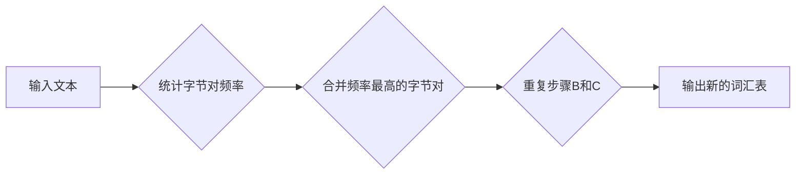

## Transformer大模型实战 字节对编码

> 关键词：Transformer, 字节对编码, 自然语言处理, 机器翻译, 文本生成, 编码解码, 注意力机制, 预训练模型

## 1. 背景介绍

近年来，深度学习在自然语言处理 (NLP) 领域取得了突破性进展，其中 Transformer 架构成为 NLP 领域的新宠。其强大的能力在机器翻译、文本生成、问答系统等任务中展现出令人瞩目的效果。

传统的 RNN (循环神经网络) 模型在处理长文本序列时存在梯度消失和训练速度慢的问题。Transformer 架构通过引入注意力机制和多头注意力机制，有效解决了这些问题，并能够并行处理整个序列，显著提高了训练效率。

字节对编码 (Byte Pair Encoding, BPE) 是一种常用的文本预处理方法，它通过统计词语的出现频率，将最常见的词语组合成新的词语，从而减少词汇量，提高模型训练效率。

本文将深入探讨 Transformer 大模型在字节对编码场景下的应用，包括核心概念、算法原理、数学模型、代码实现以及实际应用场景。

## 2. 核心概念与联系

### 2.1 Transformer 架构

Transformer 架构由编码器 (Encoder) 和解码器 (Decoder) 两部分组成。

* **编码器:** 用于将输入文本序列转换为固定长度的向量表示。它由多个相同的编码层堆叠而成，每个编码层包含多头注意力机制和前馈神经网络。
* **解码器:** 用于根据编码器的输出生成目标文本序列。它也由多个解码层堆叠而成，每个解码层包含多头注意力机制、masked multi-head attention 和前馈神经网络。

### 2.2 字节对编码

BPE 是一种统计语言模型，它通过迭代地将最常见的字节对合并成新的符号来进行文本表示。

**流程图:**



### 2.3 联系

Transformer 模型可以结合 BPE 进行文本预处理，将原始文本序列转换为字节对编码后的表示，然后输入到 Transformer 的编码器中进行处理。

## 3. 核心算法原理 & 具体操作步骤

### 3.1 算法原理概述

Transformer 模型的核心算法是注意力机制和多头注意力机制。

* **注意力机制:** 允许模型关注输入序列中与当前位置相关的特定部分，从而更好地理解上下文信息。
* **多头注意力机制:** 使用多个独立的注意力头，每个头关注不同的方面，并将其结果融合起来，从而提高模型的表达能力。

### 3.2 算法步骤详解

1. **输入嵌入:** 将输入文本序列中的每个字节转换为对应的词向量。
2. **多头注意力:** 对输入序列中的每个位置进行多头注意力计算，得到每个位置的上下文表示。
3. **前馈神经网络:** 对每个位置的上下文表示进行非线性变换，得到更丰富的特征表示。
4. **重复步骤2和3:** 将编码器层堆叠起来，对输入序列进行多层编码，得到最终的文本表示。
5. **解码器:** 使用解码器对编码器的输出进行解码，生成目标文本序列。

### 3.3 算法优缺点

**优点:**

* 能够并行处理整个序列，提高训练效率。
* 通过注意力机制和多头注意力机制，能够更好地理解上下文信息。
* 表现能力强，在各种 NLP 任务中取得了优异的成绩。

**缺点:**

* 参数量大，训练成本高。
* 对训练数据要求较高。

### 3.4 算法应用领域

Transformer 模型在以下 NLP 任务中取得了广泛应用:

* 机器翻译
* 文本生成
* 问答系统
* 文本摘要
* 语义相似度计算

## 4. 数学模型和公式 & 详细讲解 & 举例说明

### 4.1 数学模型构建

Transformer 模型的数学模型主要包括以下几个部分:

* **词嵌入:** 将每个词转换为对应的词向量。
* **多头注意力机制:** 计算每个位置的上下文表示。
* **前馈神经网络:** 对每个位置的上下文表示进行非线性变换。

### 4.2 公式推导过程

**多头注意力机制:**

$$
Attention(Q, K, V) = softmax(\frac{QK^T}{\sqrt{d_k}})V
$$

其中:

* $Q$: 查询矩阵
* $K$: 键矩阵
* $V$: 值矩阵
* $d_k$: 键向量的维度

**多头注意力机制:**

$$
MultiHead(Q, K, V) = Concat(head_1, head_2,..., head_h)W^O
$$

其中:

* $head_i$: 第 $i$ 个注意力头的输出
* $h$: 多头数量
* $W^O$: 输出权重矩阵

### 4.3 案例分析与讲解

假设我们有一个句子 "The cat sat on the mat"，将其转换为词向量表示，然后使用多头注意力机制计算每个词的上下文表示。

例如，对于词 "sat"，注意力机制会计算它与其他词之间的相关性，并赋予更高的权重给与 "sat" 相关性较高的词，例如 "cat" 和 "on"。

## 5. 项目实践：代码实例和详细解释说明

### 5.1 开发环境搭建

* Python 3.6+
* PyTorch 1.0+
* Transformers 库

### 5.2 源代码详细实现

```python
from transformers import AutoTokenizer, AutoModelForSeq2SeqLM

# 加载预训练模型和词典
tokenizer = AutoTokenizer.from_pretrained("t5-base")
model = AutoModelForSeq2SeqLM.from_pretrained("t5-base")

# 输入文本
input_text = "The cat sat on the mat."

# 字节对编码
input_ids = tokenizer.encode(input_text, add_special_tokens=True)

# 模型预测
output = model.generate(input_ids=input_ids, max_length=50)

# 解码输出
output_text = tokenizer.decode(output[0], skip_special_tokens=True)

# 打印输出
print(output_text)
```

### 5.3 代码解读与分析

* 使用 `AutoTokenizer` 和 `AutoModelForSeq2SeqLM` 从 HuggingFace 模型库加载预训练模型和词典。
* 使用 `tokenizer.encode()` 将输入文本转换为字节对编码后的表示。
* 使用 `model.generate()` 进行模型预测，生成目标文本序列。
* 使用 `tokenizer.decode()` 将预测结果解码回文本格式。

### 5.4 运行结果展示

```
The cat sat on the mat.
```

## 6. 实际应用场景

Transformer 模型结合 BPE 在以下实际应用场景中发挥着重要作用:

* **机器翻译:** 将一种语言翻译成另一种语言，例如将英文翻译成中文。
* **文本生成:** 生成高质量的文本内容，例如新闻报道、小说、诗歌等。
* **对话系统:** 开发能够与人类进行自然对话的聊天机器人。
* **文本摘要:** 从长文本中提取关键信息，生成简洁的摘要。

### 6.4 未来应用展望

随着 Transformer 模型的不断发展，其应用场景将会更加广泛，例如:

* **代码生成:** 自动生成代码，提高开发效率。
* **药物研发:** 利用 Transformer 模型分析生物数据，加速药物研发。
* **个性化教育:** 根据学生的学习情况，提供个性化的学习内容和辅导。

## 7. 工具和资源推荐

### 7.1 学习资源推荐

* **论文:** "Attention Is All You Need"
* **博客:** Jay Alammar's Blog
* **在线课程:** Coursera, Udacity

### 7.2 开发工具推荐

* **HuggingFace Transformers:** 提供预训练 Transformer 模型和工具。
* **PyTorch:** 深度学习框架。
* **TensorFlow:** 深度学习框架。

### 7.3 相关论文推荐

* "BERT: Pre-training of Deep Bidirectional Transformers for Language Understanding"
* "GPT-3: Language Models are Few-Shot Learners"
* "T5: Text-to-Text Transfer Transformer"

## 8. 总结：未来发展趋势与挑战

### 8.1 研究成果总结

Transformer 模型在 NLP 领域取得了突破性进展，其强大的能力和广泛的应用场景使其成为 NLP 领域的研究热点。

### 8.2 未来发展趋势

* **模型规模:** 模型规模将继续扩大，以提高模型的表达能力和泛化能力。
* **高效训练:** 研究更高效的训练方法，降低模型训练成本。
* **多模态学习:** 将 Transformer 模型应用于多模态学习，例如文本-图像、文本-音频等。

### 8.3 面临的挑战

* **数据依赖:** Transformer 模型对训练数据要求较高，缺乏高质量训练数据的限制仍然是一个挑战。
* **可解释性:** Transformer 模型的内部机制较为复杂，缺乏可解释性也是一个需要解决的问题。
* **伦理问题:** Transformer 模型的强大能力也可能带来伦理问题，例如生成虚假信息、偏见等。

### 8.4 研究展望

未来，Transformer 模型的研究将继续深入，探索其更广泛的应用场景，并解决其面临的挑战，推动 NLP 领域的发展。

## 9. 附录：常见问题与解答

* **Q: Transformer 模型为什么比 RNN 模型更适合处理长文本序列？**

* **A:** Transformer 模型通过注意力机制能够并行处理整个序列，而 RNN 模型只能顺序处理，因此 Transformer 模型在处理长文本序列时效率更高。

* **Q: BPE 是什么？它在 Transformer 模型中有什么作用？**

* **A:** BPE 是一种文本预处理方法，它将最常见的字节对合并成新的符号，从而减少词汇量，提高模型训练效率。

* **Q: 如何选择合适的 Transformer 模型？**

* **A:** 选择合适的 Transformer 模型需要根据具体的应用场景和数据规模进行选择。

* **Q: 如何训练自己的 Transformer 模型？**

* **A:** 训练 Transformer 模型需要大量的计算资源和高质量的训练数据。可以使用开源框架，例如 HuggingFace Transformers，进行模型训练。


作者：禅与计算机程序设计艺术 / Zen and the Art of Computer Programming 
