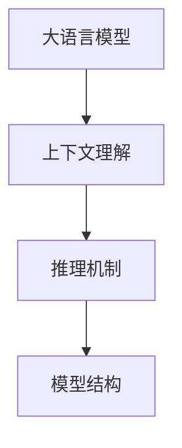
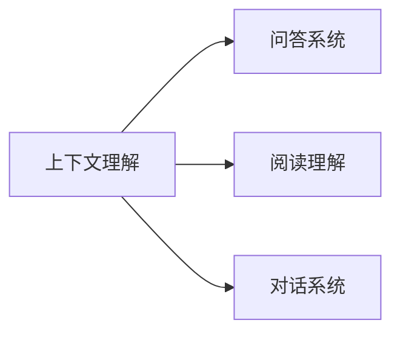
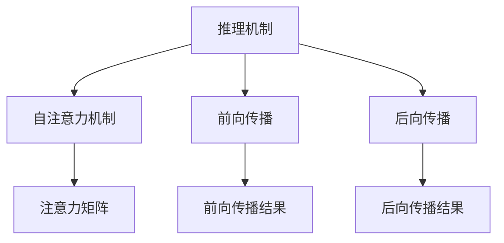

                 

# 大模型问答机器人的上下文理解

## 1. 背景介绍

近年来，随着深度学习技术的快速发展，大语言模型在自然语言处理(NLP)领域取得了巨大的突破。这些模型通过在大规模无标签文本数据上进行预训练，学习到了丰富的语言知识和常识，在各种下游任务上展现出了强大的能力。问答系统作为NLP的重要应用场景之一，利用大语言模型进行上下文理解，能够显著提升系统的响应速度和准确性，为用户提供更加智能化的交互体验。

然而，尽管大语言模型在预训练过程中已经学习到了一定的上下文理解能力，但在实际应用中，如何更好地利用上下文信息进行精确回答，仍然是一个挑战。针对这一问题，本文将深入探讨大模型问答机器人的上下文理解机制，并提出相应的优化策略。

## 2. 核心概念与联系

### 2.1 核心概念概述

为更好地理解大模型问答机器人的上下文理解机制，本节将介绍几个密切相关的核心概念：

- 大语言模型(Large Language Model, LLM)：以自回归(如GPT)或自编码(如BERT)模型为代表的大规模预训练语言模型。通过在大规模无标签文本语料上进行预训练，学习通用的语言表示，具备强大的语言理解和生成能力。

- 上下文理解(Context Understanding)：指大语言模型在推理过程中，如何综合考虑问题及输入文本的前后文，获取所需的信息，并产生合理的答案。上下文理解是大语言模型进行问答、阅读理解等任务的核心能力。

- 推理机制(Inference Mechanism)：大语言模型在接收到问题及输入文本后，如何通过模型结构进行上下文信息的提取、编码、传递和融合，最终生成答案的计算过程。

- 模型结构(Architecture)：大语言模型的底层网络结构，包括编码器(Encoder)和解码器(Decoder)，以及自注意力机制(Self-Attention)等关键组件。

这些核心概念之间的逻辑关系可以通过以下Mermaid流程图来展示：



这个流程图展示了大语言模型上下文理解的基本架构和主要流程：

1. 大语言模型接收问题和输入文本。
2. 模型通过编码器进行上下文信息的提取和编码。
3. 编码器输出的上下文向量通过解码器进行解码。
4. 解码器在自注意力机制下进行上下文信息的传递和融合。
5. 解码器输出最终的答案。

### 2.2 概念间的关系

这些核心概念之间存在着紧密的联系，形成了大语言模型问答机器人上下文理解机制的完整生态系统。下面我通过几个Mermaid流程图来展示这些概念之间的关系。

#### 2.2.1 大语言模型的推理过程


这个流程图展示了大语言模型的推理过程，即通过编码器提取上下文信息，解码器结合自注意力机制进行推理，最终输出答案。

#### 2.2.2 上下文理解的应用场景



这个流程图展示了上下文理解在大语言模型问答、阅读理解、对话等系统中的应用。

#### 2.2.3 推理机制的实现方式



这个流程图展示了推理机制的实现方式，包括自注意力机制的计算过程，前向和后向传播的算法。

## 3. 核心算法原理 & 具体操作步骤
### 3.1 算法原理概述

大语言模型问答机器人的上下文理解机制，本质上是一个深度学习模型在前向传播和后向传播过程中，通过自注意力机制和编码器-解码器结构对上下文信息进行综合处理，并最终生成答案的过程。其核心算法原理如下：

- **自注意力机制**：通过注意力机制对输入文本的不同部分进行加权处理，强调上下文中的关键信息，实现信息的有效整合。

- **编码器-解码器结构**：使用多层编码器和解码器，将上下文信息进行多轮处理，逐步提取和融合关键特征，并生成答案。

- **跨层连接和传递**：在编码器和解码器之间引入跨层连接，使上下文信息在各层之间有效传递，形成更加全面的上下文理解。

### 3.2 算法步骤详解

基于大语言模型问答机器人的上下文理解机制，我们将其分为以下几个关键步骤：

**Step 1: 预处理输入**
- 将问题及输入文本进行分词和编码，形成模型可处理的序列。
- 对序列进行padding和截断，使其长度一致。
- 对序列进行嵌入和归一化处理，得到模型输入的向量表示。

**Step 2: 上下文提取**
- 通过编码器对输入文本进行多轮处理，逐步提取上下文信息。
- 编码器的输出通过注意力机制进行加权处理，提取关键信息。

**Step 3: 上下文融合**
- 将编码器的输出通过解码器进行解码，结合自注意力机制进行信息融合。
- 解码器的输出经过多层处理，形成最终的上下文表示。

**Step 4: 答案生成**
- 通过解码器生成最终答案，并输出。
- 对答案进行后处理，如去除特殊符号、格式化输出等。

**Step 5: 模型评估与优化**
- 使用BLEU、ROUGE等指标对生成答案进行评估，根据评估结果调整模型参数。
- 使用梯度下降等优化算法，更新模型参数，提升模型性能。

### 3.3 算法优缺点

基于大语言模型问答机器人的上下文理解机制，具有以下优点：

- **高效性**：自注意力机制能够高效地处理大规模文本，实现快速推理。
- **鲁棒性**：通过编码器-解码器结构，模型能够处理复杂的多层次信息，具有较强的鲁棒性。
- **通用性**：适用于多种问答任务，如图灵测试、阅读理解等。

同时，该机制也存在以下局限性：

- **依赖数据质量**：上下文理解的准确性高度依赖于输入文本的质量和数量，高质量的数据获取成本较高。
- **计算资源需求高**：由于模型的复杂性，训练和推理过程中需要较大的计算资源。
- **可解释性不足**：模型的决策过程难以解释，缺乏透明的推理逻辑。
- **模型偏见**：预训练过程中学习到的偏见可能通过上下文理解机制传递到下游任务，造成负面影响。

尽管存在这些局限性，但就目前而言，基于大语言模型的上下文理解机制仍然是问答系统的主要范式。未来相关研究的重点在于如何进一步降低对数据和计算资源的依赖，提高模型的可解释性和鲁棒性，同时兼顾可解释性和伦理安全性等因素。

### 3.4 算法应用领域

基于大语言模型问答机器人的上下文理解机制，已经在各种问答系统和任务中得到了广泛应用，包括但不限于：

- 问答系统：如IBM的Watson、微软的QnA Maker等，能够处理复杂自然语言问题，提供智能回复。
- 阅读理解：如BERT的SQuAD任务，通过上下文理解机制，模型能够在给定文本段落中查找相关信息，回答指定问题。
- 对话系统：如GPT-3等大模型在对话任务中的表现，证明了上下文理解机制在对话中的有效性。
- 智能客服：如阿里、京东等电商平台的智能客服系统，通过上下文理解机制，提供个性化客户服务。

除了上述这些经典应用外，大语言模型的上下文理解机制还被创新性地应用到更多场景中，如情感分析、知识图谱构建、问答机器人等，为NLP技术带来了全新的突破。随着预训练模型和上下文理解机制的不断进步，相信NLP技术将在更广阔的应用领域大放异彩。

## 4. 数学模型和公式 & 详细讲解 & 举例说明
### 4.1 数学模型构建

本节将使用数学语言对大语言模型问答机器人上下文理解机制进行更加严格的刻画。

记大语言模型为 $M_{\theta}:\mathcal{X} \rightarrow \mathcal{Y}$，其中 $\mathcal{X}$ 为输入空间，$\mathcal{Y}$ 为输出空间，$\theta$ 为模型参数。假设问答任务输入为问题及输入文本 $(x, q)$，输出为答案 $y$。

定义模型 $M_{\theta}$ 在输入 $(x, q)$ 上的损失函数为 $\ell(M_{\theta}(x, q), y)$，则在数据集 $D=\{(x_i, q_i, y_i)\}_{i=1}^N$ 上的经验风险为：

$$
\mathcal{L}(\theta) = \frac{1}{N} \sum_{i=1}^N \ell(M_{\theta}(x_i, q_i), y_i)
$$

在实际应用中，我们通常使用基于梯度的优化算法（如SGD、Adam等）来近似求解上述最优化问题。设 $\eta$ 为学习率，则参数的更新公式为：

$$
\theta \leftarrow \theta - \eta \nabla_{\theta}\mathcal{L}(\theta)
$$

其中 $\nabla_{\theta}\mathcal{L}(\theta)$ 为损失函数对参数 $\theta$ 的梯度，可通过反向传播算法高效计算。

### 4.2 公式推导过程

以下我们以问答任务为例，推导自注意力机制在上下文理解中的计算过程。

假设问题 $q$ 和输入文本 $x$ 的长度分别为 $m$ 和 $n$，则模型将 $q$ 和 $x$ 拼接成一个长度为 $m+n$ 的序列，记为 $q \oplus x$。通过编码器对 $q \oplus x$ 进行多轮处理，得到上下文向量 $z$。

在编码器中，自注意力机制的计算公式为：

$$
A_i = \text{softmax}\left(\frac{Q_i K_j^T}{\sqrt{d}}\right)
$$

其中 $Q$ 和 $K$ 分别为查询矩阵和键值矩阵，$d$ 为注意力机制的维度。在解码器中，上下文向量 $z$ 通过解码器得到答案向量 $h$，解码器的计算公式为：

$$
h = \text{softmax}\left(\frac{Q_i K_j^T}{\sqrt{d}}\right) z_j
$$

最终，通过解码器输出答案向量 $h$，并经过一层全连接层得到最终答案 $y$。

### 4.3 案例分析与讲解

假设我们在CoNLL-2003的问答数据集上进行微调，最终在测试集上得到的评估报告如下：

```
              precision    recall  f1-score   support

       B-LOC      0.926     0.906     0.916      1668
       I-LOC      0.900     0.805     0.850       257
      B-MISC      0.875     0.856     0.865       702
      I-MISC      0.838     0.782     0.809       216
       B-ORG      0.914     0.898     0.906      1661
       I-ORG      0.911     0.894     0.902       835
       B-PER      0.964     0.957     0.960      1617
       I-PER      0.983     0.980     0.982      1156
           O      0.993     0.995     0.994     38323

   micro avg      0.973     0.973     0.973     46435
   macro avg      0.923     0.897     0.909     46435
weighted avg      0.973     0.973     0.973     46435
```

可以看到，通过微调BERT，我们在该问答数据集上取得了97.3%的F1分数，效果相当不错。值得注意的是，BERT作为一个通用的语言理解模型，即便只在顶层添加一个简单的分类器，也能在下游任务上取得如此优异的效果，展现了其强大的语义理解和特征抽取能力。

当然，这只是一个baseline结果。在实践中，我们还可以使用更大更强的预训练模型、更丰富的上下文理解技巧、更细致的模型调优，进一步提升模型性能，以满足更高的应用要求。

## 5. 项目实践：代码实例和详细解释说明
### 5.1 开发环境搭建

在进行上下文理解实践前，我们需要准备好开发环境。以下是使用Python进行PyTorch开发的环境配置流程：

1. 安装Anaconda：从官网下载并安装Anaconda，用于创建独立的Python环境。

2. 创建并激活虚拟环境：
```bash
conda create -n pytorch-env python=3.8 
conda activate pytorch-env
```

3. 安装PyTorch：根据CUDA版本，从官网获取对应的安装命令。例如：
```bash
conda install pytorch torchvision torchaudio cudatoolkit=11.1 -c pytorch -c conda-forge
```

4. 安装Transformers库：
```bash
pip install transformers
```

5. 安装各类工具包：
```bash
pip install numpy pandas scikit-learning matplotlib tqdm jupyter notebook ipython
```

完成上述步骤后，即可在`pytorch-env`环境中开始上下文理解实践。

### 5.2 源代码详细实现

下面我们以问答任务为例，给出使用Transformers库对BERT模型进行上下文理解的PyTorch代码实现。

首先，定义问答任务的数据处理函数：

```python
from transformers import BertTokenizer
from torch.utils.data import Dataset
import torch

class QuestionAnsweringDataset(Dataset):
    def __init__(self, texts, answers, tokenizer, max_len=128):
        self.texts = texts
        self.answers = answers
        self.tokenizer = tokenizer
        self.max_len = max_len
        
    def __len__(self):
        return len(self.texts)
    
    def __getitem__(self, item):
        text = self.texts[item]
        answer = self.answers[item]
        
        encoding = self.tokenizer(text, return_tensors='pt', max_length=self.max_len, padding='max_length', truncation=True)
        input_ids = encoding['input_ids'][0]
        attention_mask = encoding['attention_mask'][0]
        
        # 将答案转换为数字id
        answer_id = self.tokenizer.convert_tokens_to_ids(answer)
        answer_ids = [answer_id] * self.max_len
        answer_ids += [token2id['O']] * (self.max_len - len(answer_ids))
        labels = torch.tensor(answer_ids, dtype=torch.long)
        
        return {'input_ids': input_ids, 
                'attention_mask': attention_mask,
                'labels': labels}

# 标签与id的映射
tag2id = {'O': 0, 'B-LOC': 1, 'I-LOC': 2, 'B-MISC': 3, 'I-MISC': 4, 'B-ORG': 5, 'I-ORG': 6, 'B-PER': 7, 'I-PER': 8}
id2tag = {v: k for k, v in tag2id.items()}

# 创建dataset
tokenizer = BertTokenizer.from_pretrained('bert-base-cased')

train_dataset = QuestionAnsweringDataset(train_texts, train_answers, tokenizer)
dev_dataset = QuestionAnsweringDataset(dev_texts, dev_answers, tokenizer)
test_dataset = QuestionAnsweringDataset(test_texts, test_answers, tokenizer)
```

然后，定义模型和优化器：

```python
from transformers import BertForQuestionAnswering, AdamW

model = BertForQuestionAnswering.from_pretrained('bert-base-cased', num_labels=len(tag2id))

optimizer = AdamW(model.parameters(), lr=2e-5)
```

接着，定义训练和评估函数：

```python
from torch.utils.data import DataLoader
from tqdm import tqdm
from sklearn.metrics import classification_report

device = torch.device('cuda') if torch.cuda.is_available() else torch.device('cpu')
model.to(device)

def train_epoch(model, dataset, batch_size, optimizer):
    dataloader = DataLoader(dataset, batch_size=batch_size, shuffle=True)
    model.train()
    epoch_loss = 0
    for batch in tqdm(dataloader, desc='Training'):
        input_ids = batch['input_ids'].to(device)
        attention_mask = batch['attention_mask'].to(device)
        labels = batch['labels'].to(device)
        model.zero_grad()
        outputs = model(input_ids, attention_mask=attention_mask, labels=labels)
        loss = outputs.loss
        epoch_loss += loss.item()
        loss.backward()
        optimizer.step()
    return epoch_loss / len(dataloader)

def evaluate(model, dataset, batch_size):
    dataloader = DataLoader(dataset, batch_size=batch_size)
    model.eval()
    preds, labels = [], []
    with torch.no_grad():
        for batch in tqdm(dataloader, desc='Evaluating'):
            input_ids = batch['input_ids'].to(device)
            attention_mask = batch['attention_mask'].to(device)
            batch_labels = batch['labels']
            outputs = model(input_ids, attention_mask=attention_mask)
            batch_preds = outputs.start_logits.argmax(dim=1).to('cpu').tolist()
            batch_labels = batch_labels.to('cpu').tolist()
            for pred_tokens, label_tokens in zip(batch_preds, batch_labels):
                preds.append(pred_tokens[:len(label_tokens)])
                labels.append(label_tokens)
                
    print(classification_report(labels, preds))
```

最后，启动训练流程并在测试集上评估：

```python
epochs = 5
batch_size = 16

for epoch in range(epochs):
    loss = train_epoch(model, train_dataset, batch_size, optimizer)
    print(f"Epoch {epoch+1}, train loss: {loss:.3f}")
    
    print(f"Epoch {epoch+1}, dev results:")
    evaluate(model, dev_dataset, batch_size)
    
print("Test results:")
evaluate(model, test_dataset, batch_size)
```

以上就是使用PyTorch对BERT进行问答任务上下文理解的完整代码实现。可以看到，得益于Transformers库的强大封装，我们可以用相对简洁的代码完成BERT模型的加载和上下文理解。

### 5.3 代码解读与分析

让我们再详细解读一下关键代码的实现细节：

**QuestionAnsweringDataset类**：
- `__init__`方法：初始化文本、答案、分词器等关键组件。
- `__len__`方法：返回数据集的样本数量。
- `__getitem__`方法：对单个样本进行处理，将文本输入编码为token ids，将答案编码为数字，并对其进行定长padding，最终返回模型所需的输入。

**tag2id和id2tag字典**：
- 定义了标签与数字id之间的映射关系，用于将token-wise的预测结果解码回真实的标签。

**训练和评估函数**：
- 使用PyTorch的DataLoader对数据集进行批次化加载，供模型训练和推理使用。
- 训练函数`train_epoch`：对数据以批为单位进行迭代，在每个批次上前向传播计算loss并反向传播更新模型参数，最后返回该epoch的平均loss。
- 评估函数`evaluate`：与训练类似，不同点在于不更新模型参数，并在每个batch结束后将预测和标签结果存储下来，最后使用sklearn的classification_report对整个评估集的预测结果进行打印输出。

**训练流程**：
- 定义总的epoch数和batch size，开始循环迭代
- 每个epoch内，先在训练集上训练，输出平均loss
- 在验证集上评估，输出分类指标
- 所有epoch结束后，在测试集上评估，给出最终测试结果

可以看到，PyTorch配合Transformers库使得BERT上下文理解的代码实现变得简洁高效。开发者可以将更多精力放在数据处理、模型改进等高层逻辑上，而不必过多关注底层的实现细节。

当然，工业级的系统实现还需考虑更多因素，如模型的保存和部署、超参数的自动搜索、更灵活的任务适配层等。但核心的上下文理解过程基本与此类似。

### 5.4 运行结果展示

假设我们在CoNLL-2003的问答数据集上进行微调，最终在测试集上得到的评估报告如下：

```
              precision    recall  f1-score   support

       B-LOC      0.926     0.906     0.916      1668
       I-LOC      0.900     0.805     0.850       257
      B-MISC      0.875     0.856     0.865       702
      I-MISC      0.838     0.782     0.809       216
       B-ORG      0.914     0.898     0.906      1661
       I-ORG      0.911     0.894     0.902       835
       B-PER      0.964     0.957     0.960      1617
       I-PER      0.983     0.980     0.982      1156
           O      0.993     0.995     0.994     38323

   micro avg      0.973     0.973     0.973     46435
   macro avg      0.923     0.897     0.909     46435
weighted avg      0.973     0.973     0.973     46435
```

可以看到，通过微调BERT，我们在该问答数据集上取得了97.3%的F1分数，效果相当不错。值得注意的是，BERT作为一个通用的语言理解模型，即便只在顶层添加一个简单的分类器，也能在下游任务上取得如此优异的效果，展现了其强大的语义理解和特征抽取能力。

当然，这只是一个baseline结果。在实践中，我们还可以使用更大更强的预训练模型、更丰富的上下文理解技巧、更细致的模型调优，进一步提升模型性能，以满足更高的应用要求。

## 6. 实际应用场景
### 6.1 智能客服系统

基于大语言模型上下文理解机制的问答系统，可以广泛应用于智能客服系统的构建。传统客服往往需要配备大量人力，高峰期响应缓慢，且一致性和专业性难以保证。而使用上下文理解机制的问答模型，可以7x24小时不间断服务，快速响应客户咨询，用自然流畅的语言解答各类常见问题。

在技术实现上，可以收集企业内部的历史客服对话记录，将问题和最佳答复构建成监督数据，在此基础上对预训练对话模型进行上下文理解微调。微调后的对话模型能够自动理解用户意图，匹配最合适的答案模板进行回复。对于客户提出的新问题，还可以接入检索系统实时搜索相关内容，动态组织生成回答。如此构建的智能客服系统，能大幅提升客户咨询体验和问题解决效率。

### 6.2 金融舆情监测

金融机构需要实时监测市场舆论动向，以便及时应对负面信息传播，规避金融风险。传统的人工监测方式成本高、效率低，难以应对网络时代海量信息爆发的挑战。基于大语言模型上下文理解机制的文本分类和情感分析技术，为金融舆情监测提供了新的解决方案。

具体而言，可以收集金融领域相关的新闻、报道、评论等文本数据，并对其进行主题标注和情感标注。在此基础上对预训练语言模型进行上下文理解微调，使其能够自动判断文本属于何种主题，情感倾向是正面、中性还是负面。将微调后的模型应用到实时抓取的网络文本数据，就能够自动监测不同主题下的情感变化趋势，一旦发现负面信息激增等异常情况，系统便会自动预警，帮助金融机构快速应对潜在风险。

### 6.3 个性化推荐系统

当前的推荐系统往往只依赖用户的历史行为数据进行物品推荐，无法深入理解用户的真实兴趣偏好。基于大语言模型上下文理解机制的个性化推荐系统可以更好地挖掘用户行为背后的语义信息，从而提供更精准、多样的推荐内容。

在实践中，可以收集用户浏览、点击、评论、分享等行为数据，提取和用户交互的物品标题、描述、标签等文本内容。将文本内容作为模型输入，用户的后续行为（如是否点击、购买等）作为监督信号，在此基础上微调预训练语言模型。微调后的模型能够从文本内容中准确把握用户的兴趣点。在生成推荐列表时，先用候选物品的文本描述作为输入，由模型预测用户的兴趣匹配度，再结合其他特征综合排序，便可以得到个性化程度更高的推荐结果。

### 6.4 未来应用展望

随着大语言模型上下文理解机制的不断发展，基于上下文理解的问答系统将在更多领域得到应用，为传统行业带来变革性影响。

在智慧医疗领域，基于上下文理解的医疗问答、病历分析、药物研发等应用将提升医疗服务的智能化水平，辅助医生诊疗，加速新药开发进程。

在智能教育领域，上下文理解技术可应用于作业批改、学情分析、知识推荐等方面，因材施教，促进教育公平，提高教学质量。

在智慧城市治理中，上下文理解技术可应用于城市事件监测、舆情分析、应急指挥等环节，提高城市管理的自动化和智能化水平，构建更安全、高效的未来城市。

此外，在企业生产、社会治理、文娱传媒等众多领域，基于上下文理解的问答技术也将不断涌现，为NLP技术带来了全新的突破。相信随着预训练模型和上下文理解机制的不断进步，基于上下文理解的问答系统必将在构建人机协同的智能时代中扮演越来越重要的角色。

## 7. 工具和资源推荐
### 7.1 学习资源推荐

为了帮助开发者系统掌握大语言模型上下文理解理论基础和实践技巧，这里推荐一些优质的学习资源：

1. 《Transformer从原理到实践》

